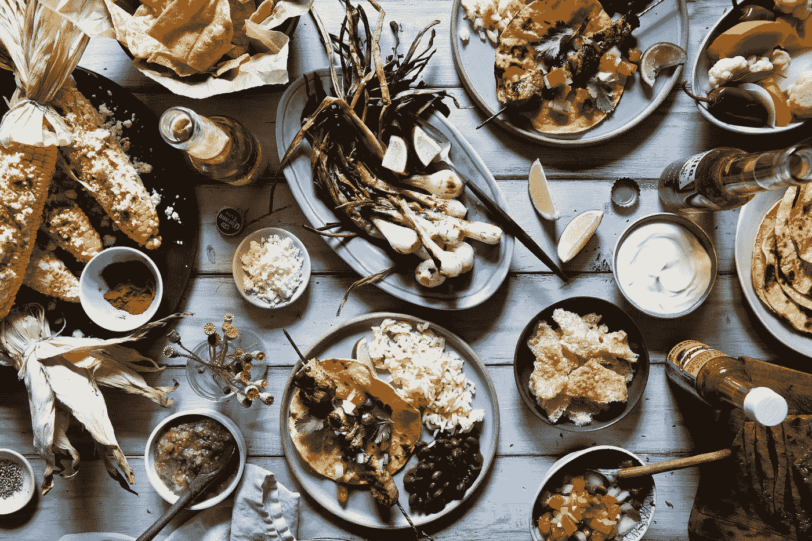
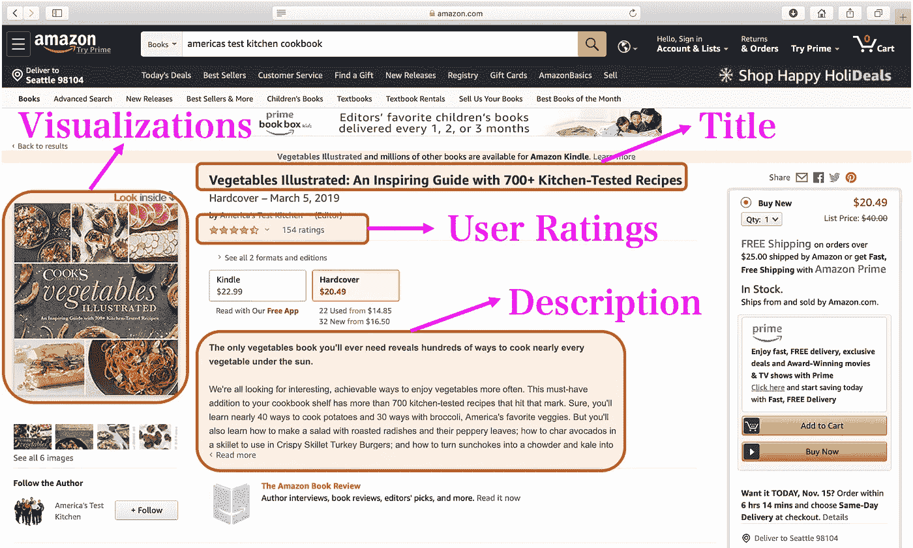
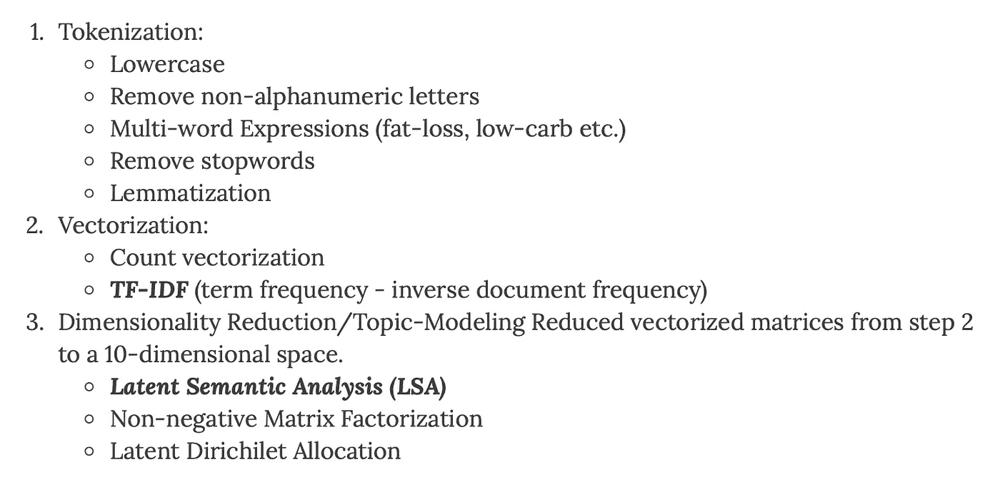
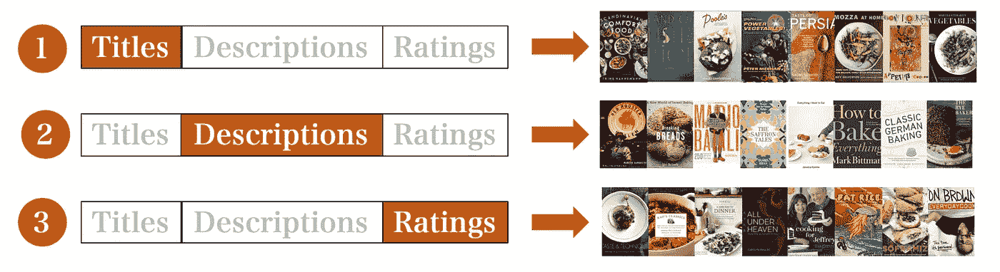
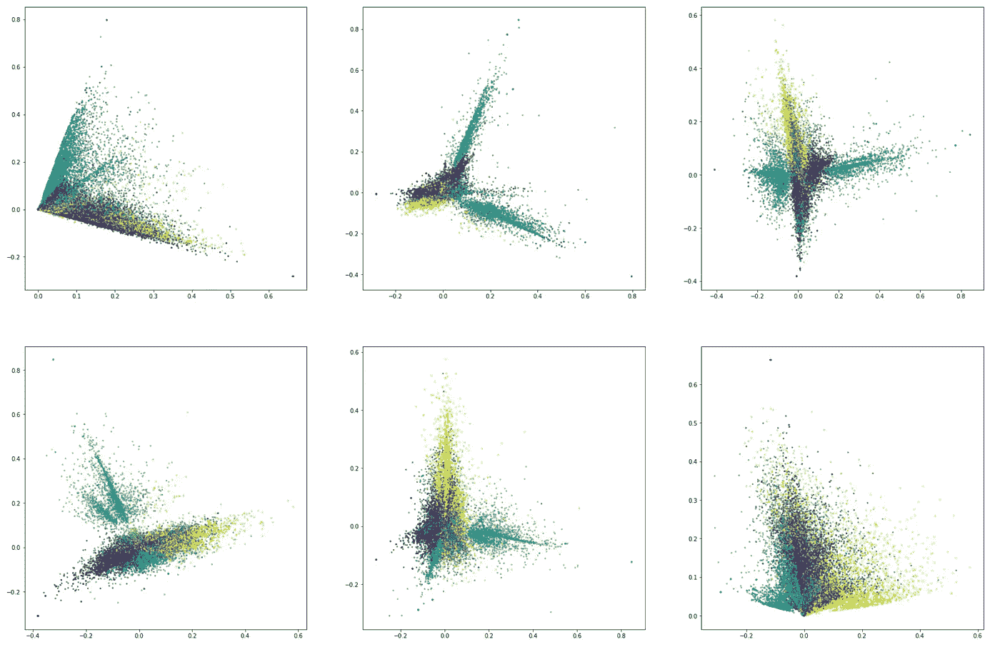
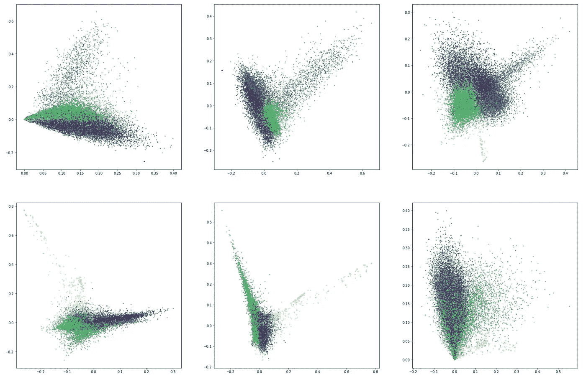
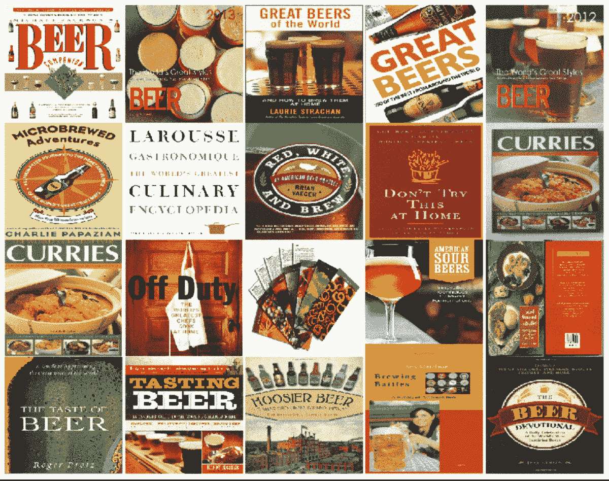
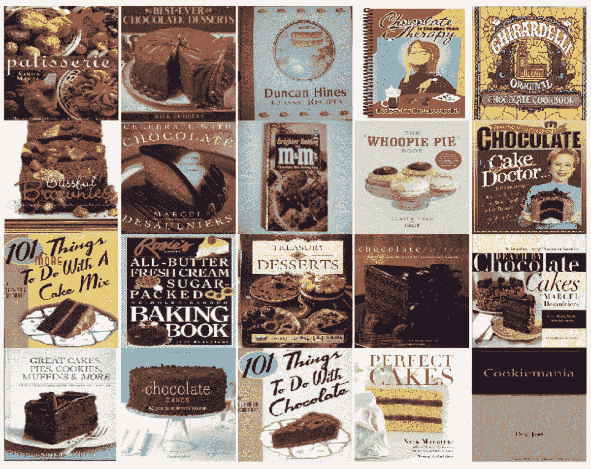

# 食谱推荐系统

> 原文：<https://towardsdatascience.com/recommendation-system-for-cookbooks-439795005bab?source=collection_archive---------19----------------------->

[来源](https://backgrounddownload.com/aesthetic-food-background-5/)

## 使用亚马逊书评的案例研究

# 1.介绍

自从我开始看《伟大的英国烘焙秀》后，我不断增加的烹饪书收藏中又增加了三本。我会烘焙吗？不，先生，我没有！至少不是很熟。我并不是唯一痴迷于烹饪节目和烹饪书的人。根据 NBCNews.com 的数据，2018 年大约售出了 1800 万本烹饪书，至少在过去两年中，烹饪书的年销售额增长了 21%或以上[1]、[2]、[3]。这些书的格式也发生了变化——更多的光面纸和图片，而不是记录食谱的冗长文本。

那么，我们如何找到我们的食谱呢？当然，我们从 Amazon.com 评论开始！结合我对烹饪书的迷恋和对数据科学的热情，我试图通过建立一个基于 Amazon.com 图书收藏和用户评级的推荐系统来帮助我的烹饪书爱好者朋友找到他们的下一次购买。我使用了自然语言处理(NLP)方法和无监督学习来将书籍聚集在一起，以找到主题和子主题。

还有谁会从这样的推荐系统中受益呢？希望通过向客户提供适当且相关的图书建议来增加在线销售的供应商。以及空间有限的小型商业书店，因此他们可以挑选与以前销售情况相似的书籍。

# 2.方法

我的方法包括建立一个混合推荐系统，它结合了:

*   NLP 主题建模技术，分别使用书名和图书描述构建两个基于内容的推荐系统
*   SVD 矩阵分解技术(类似于 Simon Funk 因 Netflix 奖而推广的方法),用于使用用户对烹饪书的评级来构建协作推荐系统。

## 2.1 数据集

来自 Amazon.com 的用户评级和产品信息的收集可从加州大学圣地亚哥分校计算机科学系获得[4]。这个数据集从 1996 年到 2018 年，被修剪成只包括烹饪书评论。这导致了大约 45，000 本烹饪书，其中 29，000 本(65%)没有用户评级，其余的大约 16，000 本烹饪书有 428，000 个评级。Amazon 数据集由两个 JSON 格式的独立数据文件组成:

*   用于菜谱 ***标题和描述*** 的产品表，以及
*   点评表用于提取 ***用户评分*** 。

请注意，此分析没有使用用户评论，只使用了用户评级。可以想象使用评论文本建立一个基于内容的推荐系统，也许这将是这个项目的扩展。

下图 1 展示了 Amazon.com 网站上用于分析的数据。

*图 1:一个样本食谱数据点*

## 2.2 建模步骤

数据处理和建模涉及多个步骤，每个步骤都有如下变化:

在降维步骤之后，测试了 K-means 聚类算法，但是后来确定它对食谱推荐系统不是太有益。在搜索空间中有大约 45，000 本烹饪书，如果有一百万个产品要通过 K-means 来查找，将有利于减少搜索空间。

产生最佳结果的模型(从质量上来说)是 TF-IDF 和 LSA 的结合。在执行这些步骤时使用了许多工具和技术，其中包括:

*   计算机编程语言
*   Sci-kit 学习
*   熊猫
*   惊喜，Python 的推荐系统引擎
*   自然语言工具包

作为该项目的一部分构建的三个推荐系统如下所示。请注意，每个推荐系统都是不同的，并且不共享任何输入。这是为了最大化模型可以从每一个输入类别中学习到的东西。考虑的另一种方法是告知每一步前面的步骤学到了什么，但这使得该方法比这个项目的范围稍大，我希望在以后的日子里探索这一点。

*图二:三个推荐系统*

我很乐意仅仅使用烹饪书的标题来构建一个推荐系统。烹饪书的标题旨在吸引注意力，而且亚马逊上的标题往往包括副标题，甚至更多一点的描述，以便在搜索中可见。但是我不建议对其他类型的书籍使用标题。举个例子， ***由 ***变成*** 米歇尔奥巴马*** 不会只根据标题找到它的邻居。

## 其他数据探索

为了更好地理解主题建模空间，通过将十维空间投影到两维空间上，对维度的一些选择组合进行了降维步骤的额外探索。

我的直觉是，书名承载着与书籍描述不同的“高质量信息”，因为书名应该简洁、吸引人、切中要害。烹饪书的标题由作者和出版商仔细审查、编辑和营销，比烹饪书的描述更有分量。另一方面，书籍描述承载了更多的“信息量”，因为它们使用了更多的词汇，并且更有可能将不同的概念联系起来。以下两个数字证实了这种直觉，因为 LSA 之后的书名的投影空间是清晰、干净和鲜明的。另一方面，LSA 之后书籍描述的投影空间扩展并具有交叉分支/斑点(图 4)。

*图 3:LSA 之后的食谱标题的维度空间:从 10 维空间中选择投影(颜色基于 K-Means 算法，仅用于说明目的)*

*图 4:LSA 之后的食谱描述的维度空间:从 10 维空间中选择投影(颜色基于 K-Means 算法，仅用于说明目的)*

# 3.模型结果

对于两个基于内容的推荐系统，模型结果以定性的形式呈现:阶段 1 和阶段 2。针对第三阶段基于模型的协同推荐系统，对两个“朴素”模型进行了定量比较。

对于这两个基于内容的推荐系统，一种方法是引入不在训练集中的新食谱，并检查推荐的“相关性”。相反，我采取了更具探索性的方法:

> 1.从训练数据中随机选择一本书，
> 
> 2.找到基于余弦相似性确定的最近邻居，
> 
> 3.显示这些邻居的书的封面，并从视觉上检查书籍类别/主题。

这种探索性的方法提供了一种发现推荐系统从食谱中学到了什么的方法。

至少可以说，结果相当令人着迷。我将尝试在这一节中直观地展示这些。正如图 3 和图 4 所预期的，这种探索性的方法也揭示了书名倾向于推荐“狭窄”范围的选项，而书籍描述提供了更广阔的视角。

基于内容的推荐系统经常遭受“信息限制区域”问题，其中相同的项目被重复地建议给用户。这个问题导致错过了帮助用户探索他们可能感兴趣并且可能已经导致购买的更多项目的机会。对食谱使用两种不同的推荐系统肯定会解决这个问题。

## 3.1 结果:使用书名的基于内容的推荐系统

该模型发现了烹饪书的许多主题和子主题。有许多类别，探索模型所学的所有内容是不切实际的！！一些突出的类别如下:

*   蛋糕
*   纸杯蛋糕
*   标题中有糖的甜点
*   糖果
*   葡萄园
*   葡萄酒和食物
*   啤酒
*   鸡尾酒
*   海味
*   高压锅
*   电炖烧锅
*   意大利的
*   沙无然食物(包括美国南方食物和意大利南方食物！)
*   柴&茶

*图 5:使用书名的基于内容的推荐系统*

## 3.2 结果:使用图书描述的基于内容的推荐系统

模型发现的几个类别是:

*图 6:使用图书描述的基于内容的推荐系统*

## 3.3 结果:使用图书用户评级的协作推荐系统

协同推荐系统是利用西蒙·芬克因网飞奖而推广的奇异值分解矩阵构造的。这一步使用了 Python 的推荐系统 machine Surprise。将结果与两个简单的解决方案进行比较:

1.  向每个人推荐每本食谱。因为每个人都喜欢烹饪书！对于每一个用户，每一本烹饪书来说，这是一个 5 星级的评价
2.  *朴素模型#2* 向每个用户推荐平均图书评级

模型结果只比上面两个简单的解决方案稍微好一点。各型号的 RMSE 如下所示:

*   模型 RMSE = 0.92
*   *天真模型#1* RMSE = 1.13
*   简单模型#2 RMEE = 0.93

# 4.结论

构建上述推荐系统的主要结论是:

1.  仅仅使用标题，主题建模就有惊人的效果！
2.  与基于标题的推荐系统相比，使用书籍描述进行主题建模使主题多样化
3.  拥有多个推荐系统(在上面的例子中使用 tiles & description)有助于使用户推荐多样化
4.  大多数亚马逊对烹饪书的评价都很高——每个人都喜欢烹饪书。这意味着，一个协作推荐系统可能会过度适应更高的评级，并需要更先进/彻底/智能的方式来处理它。

# 5.参考

[1]米歇尔·梅纳德(Micheline Maynard)，[烹饪书销量激增，这对专营烹饪书的商店来说是个好消息](https://www.forbes.com/sites/michelinemaynard/2019/03/10/cookbook-sales-are-jumping-which-is-great-news-for-shops-that-specialize-in-them/#558177d6e54d)(2019 年 3 月)，福布斯。

[2] Ed Nawotka，[美食书店喂饱本地人的胃口](https://www.publishersweekly.com/pw/by-topic/industry-news/bookselling/article/79410-culinary-bookstores-feed-local-appetites.html?fbclid=IwAR2UhWRyM8pwOOgUY1f2YG1aT3u4Jrjs_hEhY8qqSmtWEzUy8au-b5nNPRY)(2019 . 03 . 01)出版人周刊。

[3]玛莎·c·怀特(Martha C. White)，成功的秘诀:[烹饪书的销售在向数字媒体的转变中幸存](https://www.nbcnews.com/business/consumer/recipe-success-cookbook-sales-survive-shift-digital-media-n900621)(2018 年 8 月 14 日)，NBCNews.com。

[4]朱利安·麦考利&简墨·尼，UCSD，[亚马逊评论数据(2018)](https://nijianmo.github.io/amazon/index.html) ，GitHub。

[5] Baptiste Rocca，[推荐系统介绍，一些主要推荐算法概述。](/introduction-to-recommender-systems-6c66cf15ada)中/走向数据科学篇。

*原载于*[*https://mlbhanuyerra . github . io*](https://mlbhanuyerra.github.io/2019-11-16-Cookbook-Recommendation-Amazon-Reviews/)*。*

GitHub 回购:[https://github.com/mlBhanuYerra/Metis_Prj4/tree/master/code](https://github.com/mlBhanuYerra/Metis_Prj4/tree/master/code)