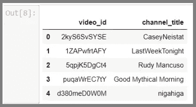
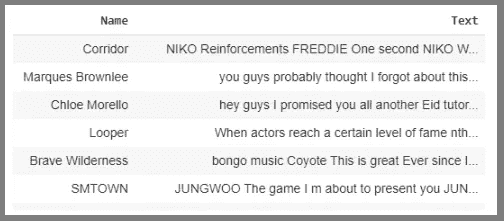
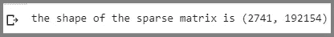
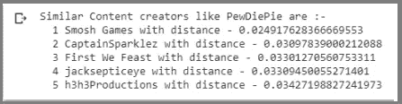
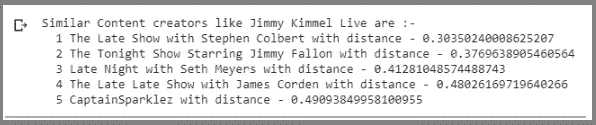
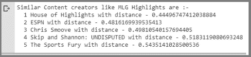
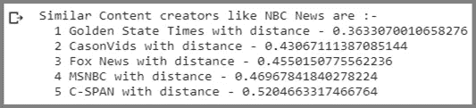

# YouTube 上相似内容创建者的推荐系统

> 原文：<https://towardsdatascience.com/recommendation-system-for-similar-content-creators-on-youtube-3fed96b3c783?source=collection_archive---------34----------------------->

## 使用无监督的机器学习算法为任何给定的 YouTube 频道推荐相似的内容创建者


**照片由** [**今敏**](https://unsplash.com/@konkarampelas?utm_source=medium&utm_medium=referral) **上** [**下**](https://unsplash.com?utm_source=medium&utm_medium=referral)

YouTube 是任何有空闲时间的人都会去的网站之一。从观看随机视频到学习新事物，YouTube 在我的生活中发挥了非常大的作用。我喜欢 YouTube 的一个原因是它拥有种类繁多的内容创作者。从播客到 ASMR 视频，YouTube 应有尽有。

虽然 YouTube 有一个很棒的推荐系统，可以根据用户的历史和类似用户观看过的内容来推荐视频，但是，假设对于一个给定的 YouTube 频道名称，如果我们想知道其他 5 个类似的 YouTube 频道(根据它们创建的内容)，那么没有任何平台可以让我找到这些(而不必观看 YouTube 上的每个视频)。例如，如果我们更喜欢一个上传旅游博客的用户，比如说我想知道其他 5 个上传旅游博客的类似内容创建者，那么我将不得不根据他们创建的内容建立一个推荐系统，而不是依赖 YouTube 在我的 feed 或“up next”部分自动推荐他们，并观看每一个视频。下面是我试图建立一个简单的推荐系统来做到这一点-

网上没有任何数据集包含你的土豆的名字和他们创造的内容。我们可以获得任何 YouTube 频道的视频内容细节的一种方法是抓取他们在视频中提供的字幕(因为他们在视频中输入的标签可能不会准确地了解视频中的内容，并且不是每个内容创作者都为他们的视频添加“标签”)。假设一个 YouTube 频道谈论或评论汽车，那么他们视频中的字幕将包含重复的关键词，如“马力”、“发动机”等。甚至像“大众”这样的品牌名称。对于这种方法，我们首先需要所有(或受欢迎的)YouTube 频道的名称，为了获得这些名称，我们可以使用这里的数据集。这个数据集包括几个月的 YouTube 每日趋势视频数据。数据分别来自美国、英国、德国、加拿大和法国(但我只使用了美国和加拿大，即 CAvideos.csv & USvideos.csv)。让我们用 python 导入这些 CSV 文件，并将它们附加到一个数据帧中

```
**import os
import pandas as pd 
directory = os.getcwd()
df_1 = pd.read_csv(directory+"/USvideos.csv")
df_2 = pd.read_csv(directory+"/CAvideos.csv")
df= df_1.append(df_2)
df[["video_id","channel_title"]].head()**
```



**我们数据集中的前 5 行(作者图片)**

我们使用这个数据集只是为了获得 YouTube 频道的名称和那些出现在 YouTube 的趋势视频标签中的视频的视频 ID。一旦我们有了视频 ID 和 YouTube 频道名称，就可以使用[YouTube-抄本-api](https://pypi.org/project/youtube-transcript-api/) ，我们可以创建一个函数来遍历数据集中的所有视频 ID。csv 文件),我们可以检索数据集中提到的所有视频 ID 的字幕，然后将它们存储在. csv 文件中。

```
**!pip install youtube_transcript_api # install youtube_transcript_api
import pandas as pd
import os
import re
import csv
import numpy as np
directory = os.getcwd() 
from youtube_transcript_api import YouTubeTranscriptApi #this library that will retrieve the subtitles from a  video in the form of list of dictionaries****#Creating a function that will iterate through the data-set and get the subtitles from each of the video ID's available
def converter(x):#function will take an input as a data-frame
    array = x.to_numpy() #convert to array
    for i in range(len(array)):
        try:
            video_id=str(array[i][0])
            Channel_name = array[i][3]
            subtitles_1 = YouTubeTranscriptApi.get_transcript(video_id,languages=['en']) #obtain the subtitles in the video
            first=''
            for g in range(len(subtitles_1)):
                first += " "+str(next(iter(subtitles_1[g].values()))).replace("\n"," ")

            subtitles_2= first #sanitize the subtitles
            subtitles_3=' '.join([i for i in subtitles_2 if not i.isdigit()]) #remove numbers as they are not relevant
            subtitles = re.sub('[^A-Za-z ]+','',subtitles_3)
            print(subtitles)
        except:
            subtitles=''
            Channel_name=''            
        subtitles_part_one = subtitles[0:20000]
        subtitles_part_two = subtitles[20001:40000] 
        subtitles_part_three = subtitles[40001:len(subtitles)] 

        with open(directory+'/Subtitles.csv', 'a',encoding='utf-8') as newFile:
            FileWriter = csv.writer(newFile)
            FileWriter.writerow([Channel_name+"|"+subtitles_part_one+"|"+subtitles_part_two+"|"+subtitles_part_three])
converter(df)#pass the data frame to the function
#Note the above function takes around 10-12 hours to run completely**
```

一旦我们运行上面的代码，我们将得到。csv 文件，其中一列包含内容创建者的姓名，另外三列包含每个视频的字幕。现在让我们用 python 导入这个文件，并查看数据的前 5 行

```
**data=pd.read_csv(directory+'/Subtitles.csv',sep="|",skiprows=0,header=None)
data = data.replace(np.nan, '', regex=True)****data["Text"] = data.apply(lambda x: f'{x[1]} {x[2]}  {x[3]}', axis=1) *#combining subtitles from three columns*****data=data.drop([1,2,3],axis=1)** **data =data.rename(columns={0:'Name'})****data.head()**
```



**“名称”栏包含你的土豆名称，“文本”栏包含每个视频的字幕。(图片由作者提供)**

正如您在上面的图像中看到的，文本列包含小写和大写的文本，还包含停用词。以上数据需要清理，以便我们获得一些关键的见解。

下面我们整理数据集-

```
***#Convert text to upper case*
data["Text"]=data["Text"].str.upper()*****#remove words of length less than 2 (as they will not be relevant)*
data["Text"]=data["Text"].apply(lambda x: ' '.join([word for word in x.split() if len(word)>2]))**
```

由于 one You Tuber 有多个视频，我们需要将多个视频的字幕连接起来，放在一行。下面是实现这一点的代码:

```
**grouped_df = data.groupby("Name")****grouped_lists = grouped_df["Text"].agg(lambda column: "".join(column))****grouped_lists = grouped_lists.reset_index()**
```

在下面的代码中，我们使用“TfidfVectorizer”来获得每个文档中每个单词的总权重，即我们的例子中的字幕。术语频率-逆文档频率是一种统计数据，它强调某个单词相对于文档集合中所有单词的重要性。使用“TfidfVectorizer ”,每个单词的值与计数成比例增加，但与语料库中单词的频率成反比。这种相反的文档频率将适应某些单词通常频繁出现的事实。例如，由于我们的数据基本上是每个视频的字幕，“the”、“we”和“you”等词的频率会经常出现，但是，它们并不能真正告诉我们视频中的内容。我们使用“TfidfVectorizer”来获取每个单词的权重，它将返回每个频道字幕中每个单词的 TF-IDF 值的稀疏矩阵。这将有助于我们找到那些使用类似词语如“播客”、“烹饪”等的人。(我们目前只采用单个单词，但是也可以通过改变下面代码中的“ngram_range”参数来使用单词的组合)

警告——在“min_df”中提供较小的值将增加稀疏矩阵的形状，导致内存负载，因此建议相应地调整“min_df”。

```
**from sklearn.feature_extraction.text import TfidfVectorizer****from nltk.tokenize import RegexpTokenizer*****#tokenizer to remove unwanted elements from out data like symbols and numbers*
token = RegexpTokenizer(r'[a-zA-Z0-9]+')*****#Convert the collection of subtitles to a matrix of TF-IDF features*
cv = TfidfVectorizer(analyzer='word',stop_words='english',tokenizer = token.tokenize,min_df =1,ngram_range = (1,1))****text_counts= cv.fit_transform(grouped_lists['Text'])****print('the shape of the sparse matrix is',text_counts.shape)**
```

下面是我们稀疏矩阵的形状-



**作者图片**

# k-最近邻(KNN)

现在我们到了有趣的部分，即实际构建模型。为此，我们将使用 NearestNeighbors，这是一个用于实现邻居搜索的无监督学习器。下面是代码:

```
**from sklearn.neighbors import NearestNeighbors****model = NearestNeighbors(metric='cosine',algorithm='auto',n_neighbors=5)****model.fit(text_counts)**
```

就这样…我们完了！！


**照片由** [**安布琳·哈桑**](https://unsplash.com/@ambreenhasan?utm_source=medium&utm_medium=referral) **上** [**下**](https://unsplash.com?utm_source=medium&utm_medium=referral)

现在，为了返回给定的 YouTube 的 5 个相似的内容创建者，我们将创建一个函数，该函数将接受一个输入(即 YouTube 频道名称)并给出 5 个相似的 YouTube 频道及其距离

```
**#this function will take input x i.e. Name of the content creator
def get_recommends(x):
    indices = pd.Series(grouped_lists.index, index=grouped_lists['Name'])*#this will allow us to map our input i.e. YouTube channel’s name for the model*
    idx = indices[x]
    distances, indices = model.kneighbors(text_counts.getrow(idx), n_neighbors = 6)#here we have kept n_neighbors = 6 because 0th neighbour will be x itself
    names_similar = pd.Series(indices.flatten()).map(grouped_lists.reset_index()['Name'])
    for i in range(0, len(distances.flatten())):
        if i==0:
            print('Similar Content creators like',names_similar[0],'are :-')
        else:
            print(" ",i,names_similar[i],'with distance - ',distances.flatten()[i])**
```

现在，我们将使用上面定义的函数，并为我们的推荐模型提供输入，以便为给定的 YouTube 频道名称提供相似的 You Tubers(邻居)。

```
**get_recommends("PewDiePie")*#"PewDiePie" is our Input***
```



**类似的内容创建者，如“PewDiePie”以及它们的成对距离(图片由作者提供)**

上面的输出首先打印我们的输入，即 PewDiePie，随后是五个不同的 YouTube 频道，内容相似，如“游戏”、“反应视频”等。以及它们的成对距离。

让我们试试其他渠道-

```
**get_recommends("Jimmy Kimmel Live")**
```



**类似的内容创建者，如“吉米·基梅尔现场直播”以及他们的成对距离(图片由作者提供)**

```
**get_recommends("MLG Highlights")** 
```



**类似的内容创建者，如“MLG 集锦”(图片由作者提供)**

```
**get_recommends("NBC News")*#NBC News is our Input***
```



**类似的内容创建者，如“NBC 新闻”(图片由作者提供)**

# 摘要

对于那些熟悉我们上面测试的 YouTube 频道的人来说，会知道我们创建的推荐系统是有效的！！

我们在 TfidfVectorizer 函数中提供的参数可以进一步优化，以提供更精确的结果。

因此，这是一个创建简单推荐模型的尝试，在这个模型的帮助下，我们可以从 YouTube 上推荐类似的内容创作者。请分享你对这个实现和整个帖子的想法。