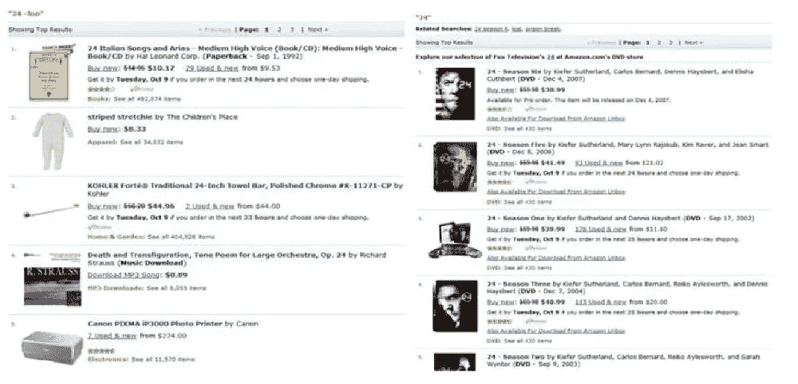
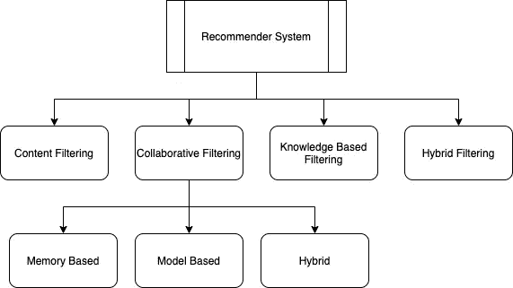
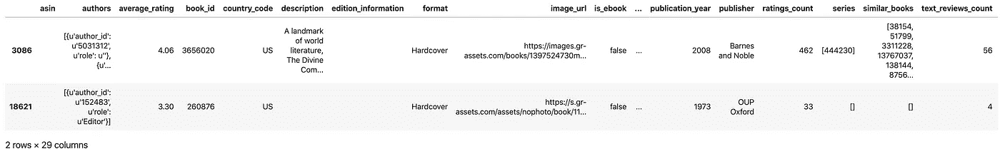
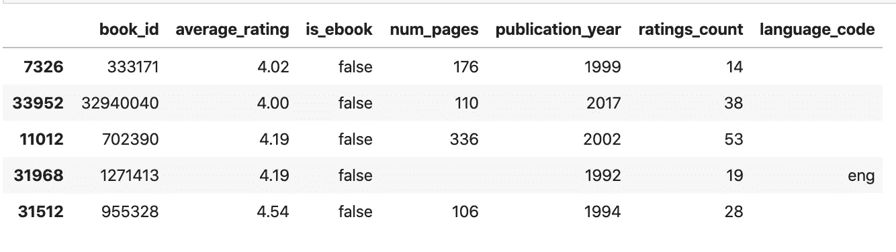
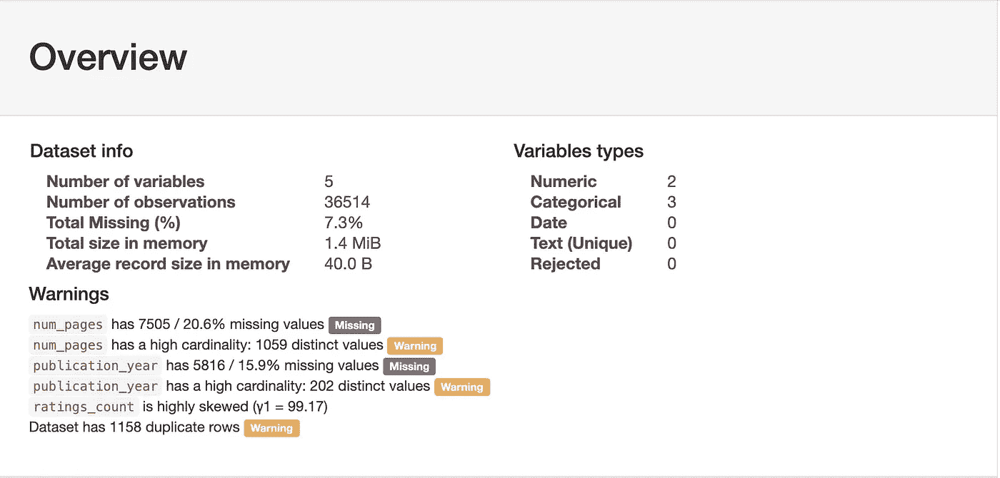
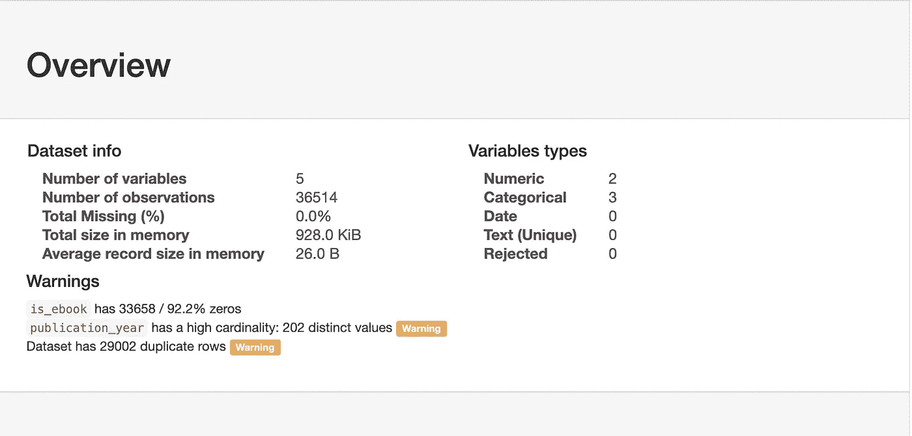
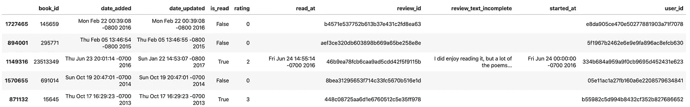
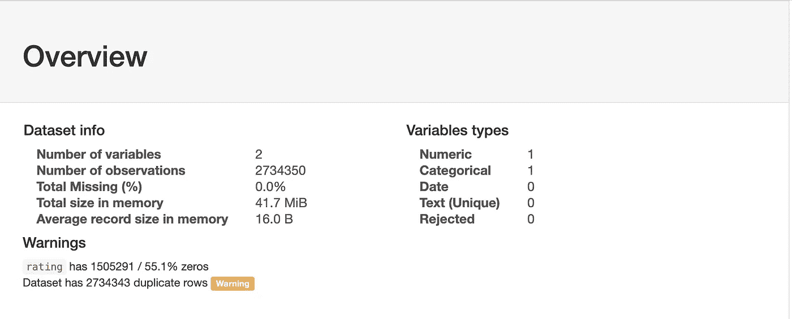
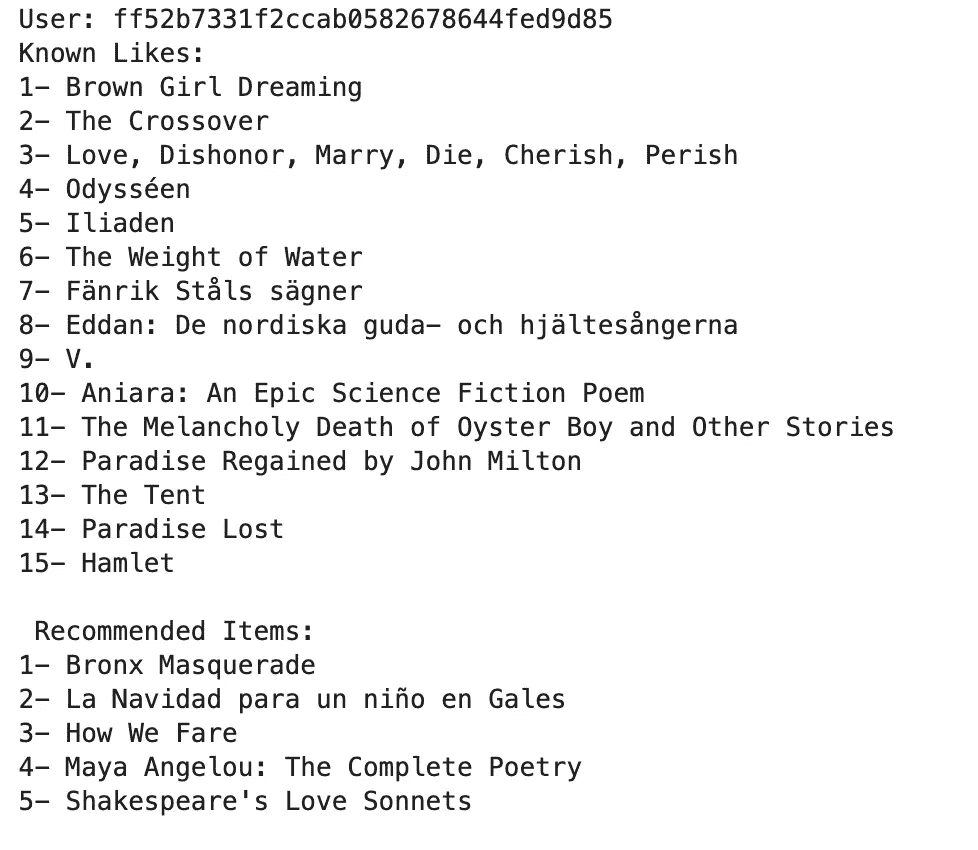

# Python 中的推荐系统:LightFM

> 原文：<https://towardsdatascience.com/recommendation-system-in-python-lightfm-61c85010ce17?source=collection_archive---------0----------------------->


[https://www . needpix . com/photo/642084/needle-hay-大海捞针](https://www.needpix.com/photo/642084/needle-hay-needle-in-a-haystack)

## [**深度解析**](https://medium.com/towards-data-science/in-depth-analysis/home)

## 使用 LightFM 在 Python 中构建推荐系统的分步指南

推荐系统或推荐系统可以被认为是信息过滤系统的一个子类，该信息过滤系统寻求预测用户将给予项目的最佳“评级”或“偏好”,该最佳“评级”或“偏好”通常通过优化诸如总点击、总收入和总销售额之类的目标来获得。

> 推荐算法工作的基本原理是什么？

推荐的基本原则是，以用户为中心的活动和以项目为中心的活动之间存在显著的依赖关系。例如，对纽约市的酒店感兴趣的用户更可能对纽约市的其他酒店感兴趣，而不是波士顿。

# 介绍

尽管任何推荐系统的主要商业目标是为用户提供个性化的体验；从问题设置的角度来看，我们可以将推荐者大致分为两类:

*   **预测问题:**第一种方法是我们希望预测用户-项目组合的评级值，假设训练数据可用于指示用户对其他项目的偏好。设想 m × n 矩阵，其中 m 是用户数，n 是项目数，目标是预测缺失(或未观察到)的值。


[图像来源](https://www.google.com/url?sa=i&url=https%3A%2F%2Fwww.needpix.com%2Fphoto%2F18235%2Frating-stars-chart-poor-performance-result-statistical-success-symbols&psig=AOvVaw2TxYq_-XgJ5B65nDAszvSr&ust=1582730198563000&source=images&cd=vfe&ved=0CAIQjRxqFwoTCOiLz9D_7OcCFQAAAAAdAAAAABAE)

*   **排名问题:**其他时候，我们希望为特定用户推荐前 k 个项目，或者确定特定主题的前 k 个目标用户。这个问题也被称为 top-k 推荐问题，是推荐问题的排名提法。想想搜索引擎，取决于谁在搜索；您希望显示 top-k 项目，以根据他们过去的偏好和最近的活动提供个性化的结果。



[图像来源](https://www.google.com/url?sa=i&url=https%3A%2F%2Factionml.com%2Fblog%2Fpersonalized_search&psig=AOvVaw125Jk0lya25z8gCv9C4IwX&ust=1582412856268000&source=images&cd=vfe&ved=0CAIQjRxqFwoTCOCA-rXh4-cCFQAAAAAdAAAAABAJ)

# 推荐建模方法的基础

概括地说，大多数推荐系统利用两种类型的数据:

*   *交互数据*，如评分和浏览行为，以及
*   *归属信息*，关于每个用户和物品

依赖于前者数据的建模方法一般称为`Collaborative Filtering`方法，使用后者的方法称为`Content Base Filtering`方法。还有另一类被称为`Knowledge-Based`的推荐系统，它基于明确指定的用户需求。

> 当然，每种方法都有其优点和缺点，这取决于它们用于哪些应用程序以及可用的数据量。

`Hybrid Systems`然后用于结合这些方法的优势，在各种应用中拥有一个健壮的执行系统。



*   **协作过滤方法:**这些类型的模型使用多个用户提供的评级的协作能力来进行推荐，并且主要依赖于利用项目间相关性或用户间交互来进行预测过程。直觉上，它依赖于一个潜在的概念，即对项目进行相似评级的两个用户很可能对其他项目具有相似的偏好。
*   有两种类型的方法常用于协同过滤:

> **基于记忆的**方法也称为基于邻域的协同过滤算法，其中用户-项目组合的评级是基于它们的邻域来预测的。这些邻域可以进一步定义为(1)基于用户，和(2)基于项目
> 
> 在**基于模型的**方法中，ML 技术用于在给定优化框架的上下文中学习模型参数

*   **基于内容的过滤方法:**在这些类型的系统中，使用项目/用户的描述性属性来进行推荐。术语“内容”指的是这些描述。在基于内容的方法中，用户的评级和交互行为与项目中可用的内容信息相结合。
*   **混合方法:**在许多情况下，有更多种类的输入可用；在这种情况下，存在许多混合的机会，来自不同类型系统的各个方面被结合起来，以实现所有世界的最佳。该方法与传统的集成分析方法相当，在传统的集成分析方法中，多种类型的机器学习算法的能力被组合以创建更鲁棒的模型。

还有更多不同类型的方法，以及每种方法的细微差别；如果你有兴趣了解更多，我强烈推荐 Deepak Agarwal 的《推荐系统的统计方法》一书。

# LightFM 入门

有许多跨不同语言的开源推荐系统框架和库，可以帮助您开始首次实现推荐模型。

在本文中，我们将探索其中一个我在工作中发现的有价值的算法，并涵盖各种用例的各种底层算法，称为`LighFM`

LightFM 是针对隐式和显式反馈类型的几种流行推荐算法的 Python 实现。

重要的是，它允许您将项目和用户元数据合并到传统的矩阵分解算法中，从而可以推广到新项目(通过项目功能)和新用户(通过用户功能)。

要了解更多，你可以查看它的文档[这里](https://making.lyst.com/lightfm/docs/home.html)。

# 履行

完整的代码可以在 GitHub 的 [Jupyter 笔记本上找到](https://github.com/kapadias/mediumposts/blob/master/recommender/published_notebooks/recommendation_python_lightfm.ipynb)

*   **加载数据**
*   **数据检查和准备**
*   **数据预处理**
*   **模特培训**
*   **前 n 条建议**

# 加载数据

对于本教程，我们将使用 Goodreads 的书评数据。这些数据集是在 2017 年底从 goodreads.com 收集的，从用户的公共书架上收集数据，即每个人都可以在网上看到它，而无需登录。用户 id 和评论 id 是匿名的。


收集该数据集仅用于学术用途。请不要重新分发或用于商业目的。

有三组数据集:

*   书籍的元数据
*   用户-图书交互
*   用户的详细书评

这些数据集可以通过匹配图书/用户/评论 id 合并在一起。对于本教程，我们将只使用前两个。

您可以从这里下载本文中使用的数据集:

*   书籍元数据:[https://drive.google.com/uc?id = 1 h6 xuv 48 D5 sa 2 usf _ BusW-ibj 7 pcqzts 1](https://drive.google.com/uc?id=1H6xUV48D5sa2uSF_BusW-IBJ7PCQZTS1)
*   用户与图书的互动:[https://drive.google.com/uc?id = 17 G5 _ mes wuhynd 4 fgjmvkrsolbqccimxj](https://drive.google.com/uc?id=17G5_MeSWuhYnD4fGJMvKRSOlBqCCimxJ)

```
%%time
books_metadata = pd.read_json('./data/goodreads_books_poetry.json', lines=True)
interactions = pd.read_json('./data/goodreads_interactions_poetry.json', lines=True)
```

# 数据检查和准备

## 书籍元数据

让我们从检查书籍的元数据信息开始。为了开发一个可靠和稳健的 ML 模型，有必要对现有数据进行全面的理解。

作为第一步，让我们看看所有可用的字段和示例数据

```
books_metadata.sample(2)
```



书籍元数据(示例)

虽然所有可用的信息对于提取上下文信息以便能够训练更好的推荐系统是至关重要的，但是对于本例，我们将只关注需要最少操作的选定字段。

```
# Limit the books metadata to selected fields
books_metadata_selected = books_metadata[['book_id', 
'average_rating', 'is_ebook', 'num_pages', 'publication_year', 
'ratings_count', 'language_code']]
books_metadata_selected.sample(5)
```



过滤的图书元数据(示例)

现在我们已经有了包含所选字段的数据，接下来，我们将通过 pandas profiler 运行它来执行初步的探索性数据分析，以帮助我们更好地理解可用数据

```
import pandas_profiling
import numpy as np
# replace blank cells with NaN
books_metadata_selected.replace('', np.nan, inplace=True)
# not taking book_id into the profiler report
profile = \
pandas_profiling.ProfileReport(books_metadata_selected[['average_rating', 
'is_ebook', 'num_pages', 'publication_year', 'ratings_count']])
profile.to_file('./results/profiler_books_metadata_1.html')
```



考虑到探查器的结果，我们将对数据集执行以下转换:

*   用另一个值替换分类值中缺少的值，以创建新的类别
*   将数值变量的 bin 值转换为离散区间

```
# using pandas cut method to convert fields into discrete intervals
books_metadata_selected['num_pages'].replace(np.nan, -1, inplace=True)
books_metadata_selected['num_pages'] = pd.to_numeric(books_metadata_selected['num_pages'])
books_metadata_selected['num_pages'] = pd.cut(books_metadata_selected['num_pages'], bins=25)
# rounding ratings to neares .5 score
books_metadata_selected['average_rating'] = books_metadata_selected['average_rating'].apply(lambda x: round(x*2)/2)
# using pandas qcut method to convert fields into quantile-based discrete intervals
books_metadata_selected['ratings_count'] = pd.qcut(books_metadata_selected['ratings_count'], 25)
# replacing missing values to year 2100
books_metadata_selected['publication_year'].replace(np.nan, 2100, inplace=True)
# replacing missing values to 'unknown'
books_metadata_selected['language_code'].replace(np.nan, 'unknown', inplace=True)
# convert is_ebook column into 1/0 where true=1 and false=0
books_metadata_selected['is_ebook'] = books_metadata_selected.is_ebook.map(
    lambda x: 1.0*(x == 'true'))
profile = pandas_profiling.ProfileReport(books_metadata_selected[['average_rating', 'is_ebook', 'num_pages', 
                                                        'publication_year', 'ratings_count']])
profile.to_file('./results/profiler_books_metadata_2.html')
```



## 交互数据

作为第一步，让我们看看所有可用的字段和示例数据

```
interactions.sample(5)
```



交互数据(示例)

将数据仅限于选定的字段

```
# Limit the books metadata to selected fields
interactions_selected = interactions[['user_id', 'book_id', 'is_read', 'rating']]
# mapping boolean to string
booleanDictionary = {True: 'true', False: 'false'}
interactions_selected['is_read'] = interactions_selected['is_read'].replace(booleanDictionary)
profile = pandas_profiling.ProfileReport(interactions_selected[['is_read', 'rating']])
profile.to_file('./results/profiler_interactions.html')
```



考虑到分析器的结果，我们将 is_read 列转换为 1/0

```
# convert is_read column into 1/0 where true=1 and false=0
interactions_selected['is_read'] = interactions_selected.is_read.map(
    lambda x: 1.0*(x == 'true'))
```

因为我们有两个字段表示用户和书之间的交互，“is_read”和“rating”——让我们看看我们有多少数据点，用户没有读过这本书，但给出了评级。

```
interactions_selected.groupby(['rating', 'is_read']).size().reset_index().pivot(columns='rating', index='is_read', values=0)
```


从上面的结果，我们可以得出结论，评分> = 1 的用户都读过这本书。因此，我们将使用“评级”作为最终得分，删除“is_read”为假的交互，并限制随机 5000 个用户的交互，以限制进一步分析的数据大小

# 数据预处理

现在，让我们将可用的数据转换成可用于矩阵运算的 CSR 稀疏矩阵。我们将通过创建 books_metadata matrix 开始这个过程，它是 NP . float 64 CSR _ matrix of shape([n _ books，n_books_features]) —每一行都包含该书相对于功能的权重。然而，在我们创建一个稀疏矩阵之前，我们将首先创建一个条目字典用于将来的引用

```
item_dict ={}
df = books_metadata[['book_id', 'title']].sort_values('book_id').reset_index()
for i in range(df.shape[0]):
    item_dict[(df.loc[i,'book_id'])] = df.loc[i,'title']
# dummify categorical features
books_metadata_selected_transformed = pd.get_dummies(books_metadata_selected, columns = ['average_rating', 'is_ebook', 'num_pages',                          'publication_year', 'ratings_count', 'language_code'])
books_metadata_selected_transformed = books_metadata_selected_transformed.sort_values('book_id').reset_index().drop('index', axis=1)
books_metadata_selected_transformed.head(5)
# convert to csr matrix
books_metadata_csr = csr_matrix(books_metadata_selected_transformed.drop('book_id', axis=1).values)
```

接下来，我们将创建一个迭代矩阵，它是 NP . float 64 CSR _ matrix of shape([n _ users，n_books])。我们还将为未来的用例创建一个用户字典

```
user_book_interaction = pd.pivot_table(interactions_selected, index='user_id', columns='book_id', values='rating')
# fill missing values with 0
user_book_interaction = user_book_interaction.fillna(0)
user_id = list(user_book_interaction.index)
user_dict = {}
counter = 0 
for i in user_id:
    user_dict[i] = counter
    counter += 1
# convert to csr matrix
user_book_interaction_csr = csr_matrix(user_book_interaction.values)
user_book_interaction_csr
```

# 模特培训

理想情况下，我们将为我们的推荐系统构建、训练和评估几个模型，以确定哪个模型最有希望进行进一步优化(超参数调整)。

然而，对于本教程，我们将使用随机选择的输入参数来训练基本模型。

```
model = LightFM(loss='warp',
                random_state=2016,
                learning_rate=0.90,
                no_components=150,
                user_alpha=0.000005)
model = model.fit(user_book_interaction_csr,
                  epochs=100,
                  num_threads=16, verbose=False)
```

# 前 n 条建议

为了找回前 n 名的推荐，我们将通过[Aayush agr awal](https://github.com/aayushmnit)T2 重新使用代码

```
def sample_recommendation_user(model, interactions, user_id, user_dict, 
                               item_dict,threshold = 0,nrec_items = 5, show = True):

    n_users, n_items = interactions.shape
    user_x = user_dict[user_id]
    scores = pd.Series(model.predict(user_x,np.arange(n_items), item_features=books_metadata_csr))
    scores.index = interactions.columns
    scores = list(pd.Series(scores.sort_values(ascending=False).index))

    known_items = list(pd.Series(interactions.loc[user_id,:] \
                                 [interactions.loc[user_id,:] > threshold].index).sort_values(ascending=False))

    scores = [x for x in scores if x not in known_items]
    return_score_list = scores[0:nrec_items]
    known_items = list(pd.Series(known_items).apply(lambda x: item_dict[x]))
    scores = list(pd.Series(return_score_list).apply(lambda x: item_dict[x]))
    if show == True:
        print ("User: " + str(user_id))
        print("Known Likes:")
        counter = 1
        for i in known_items:
            print(str(counter) + '- ' + i)
            counter+=1
print("\n Recommended Items:")
        counter = 1
        for i in scores:
            print(str(counter) + '- ' + i)
            counter+=1
```

让我们检查结果

```
sample_recommendation_user(model, user_book_interaction, 'ff52b7331f2ccab0582678644fed9d85', user_dict, item_dict)
```



# 结束语

在过去的十年中，机器学习变得越来越受欢迎，计算可用性的最新进展导致人们寻求新方法如何被结合以推进推荐系统领域的方法呈指数级增长。

通常，我们将推荐系统视为黑盒算法。尽管如此，希望这篇文章能够揭示底层的数学原理、背后的直觉，以及让你开始构建你的第一个推荐模型的高级代码。

在下一篇文章中，我们将更深入地了解如何评估这些模型的性能，调整其超参数以获得更直观和可靠的结果。

# 参考

[1][https://en.wikipedia.org/wiki/Recommender_system](https://en.wikipedia.org/wiki/Recommender_system)

[2]迪帕克·阿加瓦尔..推荐系统的统计方法。剑桥大学出版社。Kindle 版

[3] Charu，A. (1997 年)。推荐系统教科书。在美国计算机学会的*通讯中(第 40 卷)*

[4]万，朱利安·麦考利，【关于单调行为链的项目建议】，载于 *RecSys'18*

[5]万，里沙布·米斯拉，恩达帕·纳卡肖勒，朱利安·麦考利，“大规模评论语料库中的[细粒度扰流板检测](https://www.google.com/url?q=https%3A%2F%2Fwww.aclweb.org%2Fanthology%2FP19-1248&sa=D&sntz=1&usg=AFQjCNG8xlMi09lyuzzMI8lCW58wrBEGsQ)”，载于 *ACL'19*

[6][https://github . com/aayushmnit/cookbook/blob/master/rec sys . py](https://github.com/aayushmnit/cookbook/blob/master/recsys.py)

感谢阅读。*如果你有任何反馈，请联系我，在*[*LinkedIn*](https://www.linkedin.com/in/shashankkapadia/)*给我发邮件(shmkapadia[at]gmail.com)*

如果你喜欢这篇文章，请阅读我在 NLP 上的其他文章

[](/end-to-end-topic-modeling-in-python-latent-dirichlet-allocation-lda-35ce4ed6b3e0) [## Python 中的主题建模:潜在狄利克雷分配(LDA)

### 如何开始使用 Python 中的 LDA 进行主题建模

towardsdatascience.com](/end-to-end-topic-modeling-in-python-latent-dirichlet-allocation-lda-35ce4ed6b3e0) [](/evaluate-topic-model-in-python-latent-dirichlet-allocation-lda-7d57484bb5d0) [## 评估主题模型:潜在狄利克雷分配(LDA)

### 构建可解释主题模型的分步指南

towardsdatascience.com](/evaluate-topic-model-in-python-latent-dirichlet-allocation-lda-7d57484bb5d0)