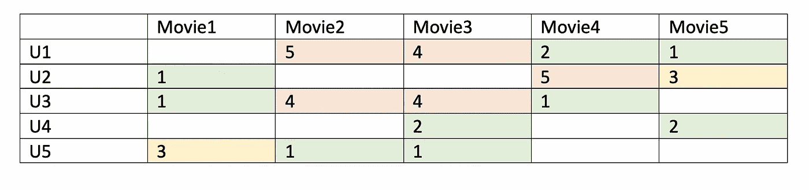
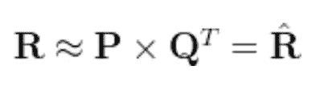
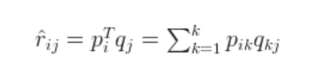
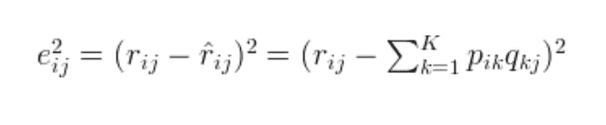
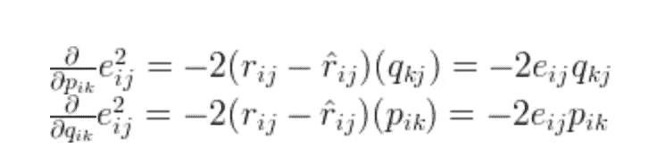
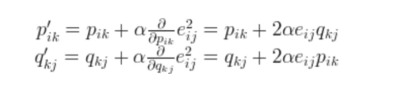
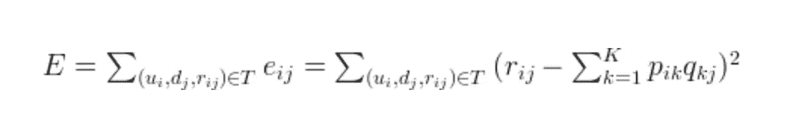

# 推荐系统——矩阵分解

> 原文：<https://towardsdatascience.com/recommendation-system-matrix-factorization-d61978660b4b?source=collection_archive---------1----------------------->

照片由[freepik.com](https://www.freepik.com/free-photo/technological-device-with-netfilx-app_3380678.htm#page=1&query=netflix&position=3)拍摄

R ecommender 系统在亚马逊、UberEats、网飞和 Youtube 等多个领域得到应用。

> ***协同过滤:*** *协同过滤是发现用户过去行为上的相似之处，并基于与其他用户相似的偏好对用户做出预测。该模型然后被用于预测用户可能感兴趣的项目(或项目的评级)。*
> 
> ***基于内容的过滤:*** *基于内容的过滤用于根据项目的特征产生项目推荐。*

在本文中，您将学习推荐系统的矩阵分解算法:

(1)矩阵分解的介绍

(2)矩阵分解的数学概念

(python 代码对矩阵分解的实践经验

## 矩阵分解导论

矩阵分解是两种不同实体相乘时生成潜在特征的一种方式。协同过滤是矩阵分解的应用，用于识别项目和用户实体之间的关系。通过输入用户对商店商品的评级，我们希望预测用户将如何对商品进行评级，以便用户可以基于预测获得推荐。

假设我们有 5 个用户和 5 部电影的客户评级表，评级是从 1 到 5 的整数，矩阵由下表提供。

表 1-用户对电影的评分表

因为不是每个用户都给所有电影评级，所以矩阵中有许多缺失值，这导致了稀疏矩阵。因此，用户没有给出的空值将用 0 填充，以便为乘法运算提供填充的值。例如，当电影由他们最喜欢的男演员和女演员表演或者电影类型是动作片时，两个用户给某个动作高的评价，等等。从上表中我们可以发现，用户 1 和用户 3 都给了《move2》和《movie3》很高的评价。因此，从矩阵分解中，我们能够发现这些潜在特征，以给出关于用户偏好和交互的相似性的评级预测。

给定一个场景，用户 4 没有给电影 4 评级。我们想知道用户 4 是否喜欢电影 4。该方法是通过获取对电影 4 具有相似偏好的用户给出的评级来发现与用户 4 具有相似偏好的其他用户，并预测用户 4 是否喜欢电影 4。

## 矩阵分解的数学概念

定义一组用户(U)、项目(D)、R 大小|U|和|D|。矩阵|U|*|D|包括用户给出的所有评级。目标是发现潜在的特征。给定两个矩阵 P (|U|*k)和 Q (|D|*k)的输入，它将生成乘积结果 r。

矩阵 P 表示用户和特征之间的关联，而矩阵 Q 表示项目和特征之间的关联。通过计算 u_i 和 d_j 对应的两个向量的点积，我们可以得到对一个项目评分的预测。

为了获得 P 和 Q 的两个实体，我们需要初始化这两个矩阵，并计算名为矩阵 m 的乘积的差。接下来，我们通过迭代来最小化差。该方法被称为**梯度下降**，旨在找到差异的局部最小值。

为了使误差最小化，梯度能够使误差最小化，因此我们分别对上述方程的这两个变量进行微分。

根据梯度，可以更新 p_ik 和 q_kj 的数学公式。a 是计算梯度时达到最小值的步长，a 通常设置为小值。

根据上面的等式，p'_ik 和 q'_kj 都可以通过迭代更新，直到误差收敛到最小值。

## 矩阵分解的例子

用户和物品矩阵的点积可以生成评分矩阵，而用户矩阵是 k(用户)* f(特征)的形状，物品矩阵是 j(物品)* f(特征)的形状。从用户和项目的矩阵中，电影的特征可以是其类型、演员、情节等。有了分解矩阵的两个特征，让我们假设 F1 是“这部电影是不是喜剧？”F2 为“如果罗宾·威廉姆斯出演这部电影？”

**用户矩阵:**根据用户 1 的说法，如果这是一部喜剧电影，他会给它 4 分，如果罗宾·威廉姆斯是这部电影的演员，他会给它 3 分。

**项目矩阵:**项目矩阵中主要有二进制值，当满足上述特征的条件时为 1，否则为 0。通过执行用户矩阵和项目矩阵的点积，*将生成评级矩阵。*

> 当数学成本函数 **RMSE** 通过矩阵分解最小化时，可以生成用户和项目矩阵的矩阵分解。根据上述数学概念，梯度下降是通过每次迭代最小化 RMSE 的方法之一。

## 矩阵分解的实用 Python 代码

下面是执行梯度下降算法的 python 代码片段。我们用 6 个用户给出的 4 部电影设置了一个评级矩阵。如你所见，有些用户之前没有看一些电影，所以在评分中给出的评分为 0。

预测矩阵生成如下。如您所见，预测矩阵具有与真实值相似的输出，0 评级被基于相似用户对电影的偏好的预测所取代。

我们可以看到，对于现有的评级，我们有非常接近真实值的近似值，我们还可以获得一些未知值的“预测”。给定特征为 3 时，算法能够将用户和项目与三个不同的特征相关联，并且预测也遵循这些关联。我们可以发现，U2、U5 和 U6 对 M1 和 M2 给予低评级，而对 M3 给予高评级。即使 U5 没有看 M1，我们也会进一步推断 U5 可能不喜欢 M1。

在现实世界中，评级矩阵非常稀疏，因为每个用户都以不同的频率观看电影。但是，误差函数 RMSE 仅使用非空等级进行计算。评级矩阵中缺失的条目将由因素矩阵的点积代替。因此，我们知道如何根据预测向用户推荐未看过的电影。

# 总之:

*   矩阵分解是一种协同过滤方法，用于发现项目和用户实体之间的关系。潜在特征，即用户和电影矩阵之间的关联，被确定来寻找相似性并基于项目和用户实体进行预测
*   当数学成本函数 **RMSE** 通过矩阵分解被最小化时，可以生成用户和项目矩阵的矩阵分解。梯度下降是一种最小化成本函数的方法。

# 参考:

1.  矩阵分解:[http://www . quux labs . com/blog/2010/09/matrix-Factorization-a-simple-tutorial-and-implementation-in-python/](http://www.quuxlabs.com/blog/2010/09/matrix-factorization-a-simple-tutorial-and-implementation-in-python/)

2.推荐系统:[https://medium . com/sfu-cspmp/recommendation-Systems-collaborative-filtering-using-matrix-factorization-simplified-2118 F4 ef 2c D3](https://medium.com/sfu-cspmp/recommendation-systems-collaborative-filtering-using-matrix-factorization-simplified-2118f4ef2cd3)