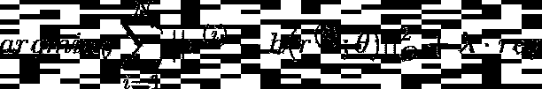
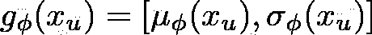

# 推荐系统系列第 6 部分:用于协同过滤的自动编码器的 6 种变体

> 原文：<https://towardsdatascience.com/recommendation-system-series-part-6-the-6-variants-of-autoencoders-for-collaborative-filtering-bd7b9eae2ec7?source=collection_archive---------6----------------------->

## RECSYS 系列

## 利用自动编码器提出建议

***更新:*** *本文是我探索学术界和工业界推荐系统系列文章的一部分。查看完整系列:* [*第一部分*](/recommendation-system-series-part-1-an-executive-guide-to-building-recommendation-system-608f83e2630a) *，* [*第二部分*](/recommendation-system-series-part-2-the-10-categories-of-deep-recommendation-systems-that-189d60287b58) *，* [*第三部分*](/recommendation-system-series-part-3-the-6-research-directions-of-deep-recommendation-systems-that-3a328d264fb7) *，* [*第四部分*](/recsys-series-part-4-the-7-variants-of-matrix-factorization-for-collaborative-filtering-368754e4fab5) *，* [*第五部分*](/recsys-series-part-5-neural-matrix-factorization-for-collaborative-filtering-a0aebfe15883) *和*

在过去的几年中，已经提出了许多推荐模型。然而，它们在处理数据稀疏和冷启动问题时都有其局限性。

*   如果用户和项目之间的交互非常稀疏，当推荐性能显著下降时，就会出现**数据稀疏性**。
*   **冷启动问题**发生在模型无法推荐新用户和新物品的时候。

为了解决这些问题，最近的方法已经利用了关于用户或项目的辅助信息。然而，由于这种模型在捕捉用户偏好和项目特征方面的限制，推荐性能的提高并不显著。

*丽贝卡·海尔威尔——抖音的推荐有些奇怪(*[*https://www . vox . com/recode/2020/2/25/21152585/tiktok-推荐-简介-长相相似*](https://www.vox.com/recode/2020/2/25/21152585/tiktok-recommendations-profile-look-alike) *)*

**Auto-encoder** 是一种适合无监督学习任务的神经网络，包括生成建模、维度缩减和高效编码。在许多领域，包括计算机视觉、语音识别和语言建模，它在学习潜在特征表示方面已经显示出它的优越性。鉴于这一点，新的推荐架构已经整合了 autoencoder，因此在重新创造用户体验以满足客户方面带来了更多机会。

*   传统模型只处理单一数据源(评级或文本)，而基于自动编码器的模型可以处理**异构**数据源(评级、音频、视频、视频)。
*   Auto-encoder 的**更好地理解了用户需求和项目特征的**，因此比传统模型具有更高的推荐准确度。
*   此外，自动编码器有助于推荐模型**在多媒体场景中更具适应性**，并且在处理输入噪声方面比传统模型更有效。

在这篇文章和接下来的文章中，我将介绍推荐系统的创建和训练，因为我目前正在做这个主题的硕士论文。

*   [第 1 部分](/recommendation-system-series-part-1-an-executive-guide-to-building-recommendation-system-608f83e2630a)提供了关于推荐系统、如何构建推荐系统以及如何利用推荐系统改善各行业业务的高级概述。
*   [第 2 部分](/recommendation-system-series-part-2-the-10-categories-of-deep-recommendation-systems-that-189d60287b58)提供了关于这些模型的优势和应用场景的正在进行的研究计划的仔细回顾。
*   [第 3 部分](/recommendation-system-series-part-3-the-6-research-directions-of-deep-recommendation-systems-that-3a328d264fb7)提供了几个可能与推荐系统学者社区相关的研究方向。
*   [第 4 部分](/recsys-series-part-4-the-7-variants-of-matrix-factorization-for-collaborative-filtering-368754e4fab5)提供了您可以构建的矩阵分解的 7 种变体的本质数学细节:从使用巧妙的辅助功能到应用贝叶斯方法。
*   [第 5 部分](/recsys-series-part-5-neural-matrix-factorization-for-collaborative-filtering-a0aebfe15883)提供了基于多层感知器的协同过滤模型的 5 个变体的架构设计，它们是能够以非线性方式解释特征的判别模型。

在第 6 部分中，我探索了使用**自动编码器**进行协同过滤。更具体地说，我将剖析六篇将自动编码器纳入其推荐架构的原则性论文。但是首先，让我们浏览一下关于自动编码器及其变体的初级读本。

# 自动编码器及其变体入门

如下图所示，标准自动编码器由输入层、隐藏层和输出层组成。输入数据被传递到输入层。输入层和隐藏层构成一个编码器。隐藏层和输出层构成解码器。输出数据来自输出层。

自动编码器架构

编码器用函数 f 将高维输入数据 x 编码成低维隐藏表示 h:

*方程式 1*

其中，s_f 是激活函数，W 是权重矩阵，b 是偏置向量。

解码器通过另一个函数 g 将隐藏表示 h 解码回重构 x ’:

等式 2

其中 s_g 是激活函数，W’是权重矩阵，b’是偏差向量。

s_f 和 s_g 的选择是非线性的，例如 Sigmoid、TanH 或 ReLU。这使得 auto-encoder 能够学习比其他无监督线性方法更有用的特征，比如主成分分析。

我可以训练自动编码器通过平方误差(对于回归任务)或交叉熵误差(对于分类任务)来最小化 x 和 x’之间的重建误差。

这是平方误差的公式:

等式 3

交叉熵误差的公式如下:

等式 4

最后，向自动编码器的最终重构误差添加一个正则项始终是一个好的做法:

等式 5

上面的重建误差函数可以通过随机梯度下降或替代的最小二乘法来优化。

目前在推荐系统中使用的自动编码器有很多种。四种最常见的是:

*   **去噪自动编码器(DAE)** 在将输入映射到隐藏表示之前破坏输入，然后从其破坏的版本重建原始输入。想法是迫使隐藏层获得更健壮的特征，并防止网络仅仅学习身份函数。
*   **堆叠去噪自动编码器(SDAE)** 堆叠多个去噪自动编码器，以获得输入的更高级表示。训练通常用贪婪算法逐层优化。这里明显的缺点是训练的高计算成本和缺乏对高维特征的可扩展性。
*   **边缘化去噪自动编码器(MDAE)** 通过边缘化随机特征破坏来避免 SDAE 的高计算成本。因此，它具有训练速度快、实现简单和对高维数据的可扩展性。
*   **变分自动编码器(VAE)** 是一个无监督的潜在变量模型，它从高维数据中学习深度表示。其思想是将输入编码为概率分布，而不是像普通自动编码器那样的点估计。然后，VAE 使用解码器通过使用来自该概率分布的样本来重建原始输入。

可变自动编码器架构

好了，是时候回顾一下不同的基于自动编码器的推荐框架了！

# **1 — AutoRec**

从自动编码器的角度考虑协同过滤问题的最早的模型之一是来自 Suvash Sedhain、Aditya、Scott Sanner 和 Lexing Xie 的“[自动编码器遇到协同过滤](https://users.cecs.anu.edu.au/~akmenon/papers/autorec/autorec-paper.pdf)”的 **AutoRec** 。

在该论文的设置中，有 m 个用户，n 个项目，以及维数为 m×n 的部分填充的用户-项目交互/评级矩阵 r。每个用户 u 可以由部分填充的向量 rᵤ表示，每个项目 I 可以由部分填充的向量 rᵢ.表示 AutoRec 直接将用户评级向量 rᵤ或项目评级 rᵢ作为输入数据，并在输出层获得重建的评级。根据两种类型的输入，AutoRec 有两种变体:基于项目的 AutoRec ( **I-AutoRec** )和基于用户的 AutoRec ( **U-AutoRec** )。两者结构相同。

*Suvesh Sedhain 等人——AutoRec:自动编码器满足协同过滤(*[*https://dl.acm.org/doi/10.1145/2740908.2742726*](https://dl.acm.org/doi/10.1145/2740908.2742726)*)*

论文中的图 1 说明了 I-AutoRec 的结构。阴影节点对应于观察到的等级，实线连接对应于为输入 rᵢ.更新的权重

给定输入 rᵢ，重建为:

等式 6

其中 f 和 g 是激活函数，参数θ包括 W、V、mu 和 b

AutoRec 仅使用**普通自动编码器结构**。该模型的目标函数类似于自动编码器的损失函数:

等式 7

该函数可以通过弹性传播(收敛更快并产生可比较的结果)或 L-BFGS(有限内存 Broyden Fletcher Goldfarb Shanno 算法)进行优化。

以下是 AutoRec 的一些重要信息:

*   I-AutoRec 的表现一般比 U-AutoRec 好。这是因为每个项目的平均评级数比每个用户给出的平均评级数多得多。
*   激活功能的不同组合会显著影响 AutoRec 的性能。
*   增加隐藏神经元的数量或层数可以提高模型性能。这是有意义的，因为扩展隐藏层的维度允许 AutoRec 有更多的能力来模拟输入要素。
*   添加更多的层来形成深层网络可以导致轻微的改善。

出于说明目的，AutoRec 模型类别的张量流代码如下所示:

对于[我的 TensorFlow 实现](https://github.com/khanhnamle1994/transfer-rec/tree/master/Autoencoders-Experiments/AutoRec-TensorFlow)，我用一个由 sigmoid 非线性函数激活的 500 个单元的隐藏层来训练 AutoRec 架构。其他超参数包括 0.001 的学习率、512 的批量大小、Adam 优化器和 1 的 lambda 正则化器。

# **2 — DeepRec**

**DeepRec** 是由英伟达的 Oleisii Kuchaiev 和 Boris Ginsburg 创建的模型，参见“[为协同过滤训练深度自动编码器](https://arxiv.org/abs/1708.01715)”该模型受上述 AutoRec 模型的启发，有几个重要区别:

*   网络要深得多。
*   该模型使用“比例指数线性单位”(SELUs)。
*   辍学率很高。
*   作者在训练期间使用迭代输出再馈。

*Oleisii Kuchaiev 和 Boris Ginsburg——为协同过滤训练深度自动编码器(*[*https://arxiv.org/abs/1708.01715*](https://arxiv.org/abs/1708.01715)*)*

## **2.1 —型号**

上图描述了一个典型的 4 层自动编码器网络。编码器有 2 层 E1 和 E2，而解码器有 2 层 D1 和 D2。它们在表示 z 上融合在一起。这些层被表示为 f(W * x + b)，其中 f 是某个非线性激活函数。如果激活函数的范围小于数据的范围，则解码器的最后一层应该保持线性。作者发现隐藏层中的激活函数 f 包含非零负部分是非常重要的，并且在他们的大多数实验中使用 SELU 单位。

## **2.2 —损失函数**

由于预测用户表示向量 x 中的零没有意义，作者优化了**掩蔽均方误差**损失:

等式 8

其中 r_i 是实际评级，y_i 是重构评级，m_i 是屏蔽函数，使得如果 r_i 不为 0，m_i = 1，否则 m_i = 0。

**2.3 —密集再进给**

在前向传递和推理传递期间，模型从训练集 x 中获取由其评级向量表示的用户。注意，x 非常稀疏，而解码器 f(x)的输出是密集的，并且包含对语料库中所有项目的评级预测。因此，为了明确实施定点约束并执行密集训练更新，作者用如下的**迭代密集再反馈步骤**来增加每个优化迭代:

1.  在初始正向传递期间，给定稀疏输入 x，模型使用等式 8 计算密集输出 f(x)和 MMSE 损耗。
2.  在最初的反向过程中，模型计算梯度并相应地更新权重。
3.  在第二次向前传递期间，模型将 f(x)视为新的数据点，从而计算 f(f(x))。f(x)和 f(f(x))都变得稠密。MMSE 损失现在所有的 m 都是非零的。
4.  在第二次反向传递期间，模型再次计算梯度并相应地更新权重。

为了便于说明，下面给出了 DeepRec 模型定义的张量流代码:

对于[我的 TensorFlow 实现](https://github.com/khanhnamle1994/transfer-rec/tree/master/Autoencoders-Experiments/NVIDIA-DeepRec-TensorFlow)，我用以下架构训练了 DeepRec，512，512，1024，512，512，n]。所以 n 是用户给定的收视率数，编码器有 3 层大小(512，512，1034)，瓶颈层有大小 1024，解码器有 3 层大小(512，512，n)。我用随机梯度下降来训练模型，动量为 0.9，学习率为 0.001，批量为 512，辍学率为 0.8。参数通过 Xavier 初始化方案进行初始化。

# **3 —协同去噪自动编码器**

[“Top-N 推荐系统的协同去噪自动编码器](https://alicezheng.org/papers/wsdm16-cdae.pdf)”作者、Christopher DuBois、Alice Zheng 和 Martin Ester 是一个具有一个隐藏层的神经网络。与 AutoRec 和 DeepRec 相比， **CDAE** 有以下不同之处:

*   CDAE 的输入不是用户项目评分，而是部分观察到的隐含反馈 r(用户的项目偏好)。如果用户喜欢一部电影，对应的条目值为 1，否则为 0。
*   与用于评级预测的前两个模型不同，CDAE 主要用于排名预测(也称为前 N 名偏好推荐)。

*https://dl.acm.org/doi/10.1145/2835776.2835837**)*吴耀等人——前 N 名推荐系统的协同去噪自动编码器

## **3.1 —型号**

上图显示了一个 CDAE 的样本结构，它由三层组成:输入层、隐藏层和输出层。

*   在输入层中总共有 I + 1 个节点。第一个 I 节点代表用户偏好，这些 I 节点的每个节点对应一个项目。最后一个节点是特定于用户的节点，在上图中用红色节点表示，这意味着不同的用户有不同的节点和相关的权重。
*   这里，yᵤ是用户 u 对 I 中所有项目的 I 维反馈向量。yᵤ是一个稀疏的二进制向量，只具有非零值:如果用户 u 对 I 评分，yᵤᵢ = 1，否则 yᵤᵢ = 0。
*   有 K(<< I) + 1 nodes in the hidden layer. The blue K nodes are fully connected to the nodes of the input layer. The pink additional node in the hidden layer captures the bias effects.
*   In the output layer, there are I nodes which are the reconstructed output of the input yᵤ. They are fully connected to the nodes in the hidden layer.

The corrupted input **CDAE 的 r_corr** 是从一个条件高斯分布中得出的 **p(r_corr | r)** 。 **r_corr** 的重建公式如下:

等式 9

其中 W₁是对应于编码器的权重矩阵(从输入层到隐藏层)，W₂是对应于解码器的权重矩阵(从隐藏层到输出层)。Vᵤ是红色用户节点的权重矩阵，而 b₁和 b₂都是偏置向量。

## **3.2 —损失函数**

通过最小化平均重建误差来学习 CDAE 的参数，如下所示:

等式 10

上式中的损失函数 L **(r_corr，h(r_corr))** 可以是平方损失，也可以是 logistic 损失。CDAE 使用平方 L2 范数来控制模型的复杂度。它还(1)应用随机梯度下降来学习模型的参数，以及(2)在学习过程中采用 AdaGrad 来自动调整训练步长。

作者还提出了**负采样技术**来从用户没有交互的项目中提取一个小子集，以在不降低排序质量的情况下显著降低时间复杂度。在推理时，CDAE 将用户的现有偏好集(没有损坏)作为输入，并向该用户推荐输出层上具有最大预测值的项目。

为了便于说明，下面给出了 CDAE 建筑等级的 PyTorch 代码:

对于我的 PyTorch 实现，我使用了一个 CDAE 架构，隐藏了 50 个单元。我使用随机梯度下降来训练模型，学习率为 0.01，批量为 512，损坏率为 0.5。

# **4 —多项式变分自动编码器**

这次讨论中最有影响力的论文之一是来自网飞的 Dawen Liang、Rahul Krishnan、Matthew Hoffman 和 Tony Jebara 的“[协作过滤的变分自动编码器](https://arxiv.org/abs/1802.05814)”。它提出了一种 VAE 的变体，用于隐式数据的推荐。特别是，作者介绍了**一种有原则的贝叶斯推理方法**来估计模型参数，并显示出比常用的似然函数更好的结果。

本文使用 U 来索引所有用户，使用 I 来索引所有项目。用户逐项交互矩阵称为 X(维度为 U x I)。小写的 xᵤ是一个单词包向量，其中包含用户 u 对每个项目的点击次数。对于隐式反馈，该矩阵被二进制化为只有 0 和 1。

## **4.1 —型号**

等式 11

模型的生成过程如等式 11 所示，细分如下:

*   对于每个用户 u，该模型从标准高斯先验中采样 k 维潜在表示 zᵤ。
*   然后，它通过非线性函数 f_θ变换 zᵤ，以产生 I 项π(zᵤ).上的概率分布
*   f_θ是一个多层感知器，有参数θ和一个 softmax 激活函数。
*   给定来自用户 u 的点击总数，从具有概率π(zᵤ).的多项式分布中采样词袋向量 xᵤ

用户 u 的对数似然性(以潜在表示为条件)为:

等式 12

作者认为**多项式分布**适合这个协同过滤问题。具体而言，等式 11 中的交互作用矩阵的可能性奖励了将概率质量放在 xᵤ.的非零条目上的模型然而，考虑到π(zᵤ)的总和必须为 1，项目必须竞争有限的概率质量预算。因此，该模型应该将更多的概率质量分配给更有可能被点击的项目，使得它适合于在推荐系统的前 N 名排名评估度量中实现稳定的性能。

## **4.2 —变分推理**

为了训练等式 11 中的生成模型，作者经由**变分推理**通过近似难以处理的后验分布 p(zᵤ | xᵤ)来估计θ。这种方法用一种更简单的变分分布 q(zᵤ(一种全对角高斯分布)来逼近真实的难处理的后验概率。变分推理的目标是优化自由变分参数{μᵤ，σᵤ }使得库尔贝克-莱伯散度**kl(q(zᵤ)| |p(zᵤ|xᵤ)】**最小化。

变分推断的问题在于，用于优化σᵤ{μᵤ的参数数量会随着数据集中用户和项目的数量而增长。VAE 通过用一个依赖于数据的函数代替单个变分参数来帮助解决这个问题:

等式 13

该函数由ϕ参数化，其中μ_{ϕ} (xᵤ)和σ_{ϕ} (xᵤ)都是 k 维向量。然后，变分分布设置如下:

等式 14

使用输入 xᵤ，推理模型返回相应的变分分布 q_{ϕ} (zᵤ|xᵤ).)的变分参数当被优化时，这种变分分布近似于难处理的后 p_{ϕ} (zᵤ | xᵤ).

*变分渐变(*[*【https://matsen.fredhutch.org/general/2019/08/24/vbpi.html】*](https://matsen.fredhutch.org/general/2019/08/24/vbpi.html)*)*

为了用变分推断学习潜变量模型，标准的方法是对数据的对数边际似然进行下界估计。用户 u 最大化的目标函数现在变成:

等式 15

这个目标的另一个术语是**证据下限(ELBO)。**直观上，我们应该能够通过对 zᵤ∞q_ϕ进行采样并使用随机梯度上升对其进行优化来获得 ELBO 的估计值。然而，我们不能对爱尔波求导以得到相对于ϕ.的梯度**重新参数化技巧**在这里派上了用场:

等式 16

本质上，我们隔离了采样过程中的随机性，因此相对于ϕ的梯度可以通过采样的 zᵤ.反向传播

从不同的角度来看，等式 15 的第一项可以解释为**重构误差**，等式 15 的第二项可以解释为**正则化**。因此，作者用一个附加参数β来扩展方程 15，以控制正则化的强度:

等式 17

该参数β在模型拟合数据的良好程度和学习期间近似后验与先验的接近程度之间进行权衡。作者通过 **KL 退火**调整β，这是一种常见的启发式方法，用于在担心模型未被充分利用时训练 VAEs。

## **4.3 —预测**

给定用户的点击历史 x，该模型基于未归一化的预测多项式概率 f_ϕ (z)对所有项目进行排名。x 的潜在表示 z 就是变分分布 z = μ_ϕ (x)的平均值。

*梁大文等——用于协同过滤的变分自动编码器(*[*【https://arxiv.org/abs/1802.05814】*](https://arxiv.org/abs/1802.05814)*)*

该论文中的图 2 提供了自动编码器不同变体的统一视图。

*   2a 是普通的自动编码器架构，如 AutoRec 和 DeepRec 所示。
*   2b 是去噪自动编码器架构，如在 CDAE 看到的。这里，ϵ是注入到输入层的噪声。
*   2c 是 MultVAE 下的变分自动编码器架构，其使用由ϕ参数化的推理模型来产生近似变分分布的均值和方差，如上面详细解释的。

MultVAE 架构类的 PyTorch 代码如下所示，用于说明目的:

对于[我的 PyTorch 实现](https://github.com/khanhnamle1994/transfer-rec/tree/master/Autoencoders-Experiments/VAE-PyTorch)，我保持生成模型 f 和推理模型 g 的架构对称，并使用一个带有 1 个隐藏层的 MLP。潜在表示 K 的维度被设置为 200，而其他隐藏层的维度被设置为 600。MultVAE 的整体架构现在变成[I->600->200->600->I]，其中 I 是项目总数。其他模型细节包括 tanH 激活函数，概率为 0.5 的辍学率，Adam 优化器，批量为 512，学习率为 0.01。

# **5 —顺序变分自动编码器**

在“[用于协同过滤的序列变分自动编码器](https://arxiv.org/abs/1811.09975)”中，诺维恩·萨克德瓦、朱塞佩·曼科、埃托雷·里塔克和维克拉姆·迪普通过探索过去偏好历史中存在的丰富信息，提出了对 MultVAE 的扩展。他们引入了 MultVAE 的递归版本**，而不是传递整个历史的子集，而不管时间依赖性，他们通过递归神经网络传递消费序列子集。他们表明**处理时间信息**对于提高 VAE 的准确性至关重要。**

## **5.1 —设置**

问题设置与 MultVAE 论文中的设置完全相似:U 是一组用户，I 是一组项目，X 是维度为 U x I 的用户-项目偏好矩阵。主要区别在于 SVAE 考虑了矩阵 X 中的优先级和时间关系。

*   x 归纳出评分矩阵中项目之间的自然排序关系:i x_{u，j}。
*   他们假设定时信息 T 的存在，其中 t_{u，i}项代表我被 u 选中的时间，那么我 t_{u，j}。
*   他们还在 xᵤ:的元素中引入了一个时间标记，x_{u(t)}表示

*诺维恩·萨克德瓦等人——用于协同过滤的序列变分自动编码器(*[*【https://arxiv.org/abs/1811.09975】*](https://arxiv.org/abs/1811.09975)*)*

## **5.2 —型号**

论文中的上图显示了 MultVAE、SVAE 和另一个名为 RVAE 的模型之间的架构差异(我在这里不讨论它)。查看 SVAE 架构，我可以观察到 z_{u(t)}所依赖的层中出现的循环关系。SVAE 背后的基本思想是**潜在变量建模应该能够表达时间动态** **以及用户历史**中偏好之间的因果关系和依赖性。

让我们复习一下数学。在这个 SVAE 框架内，作者通过将每个事件与之前的事件相联系来模拟时间依赖性。给定一个序列 x_{(1: T}，那么它的概率是:

等式 18

这个概率表示 x_{(t+1)和 x_{(1:t)}之间的递归关系。因此，模型可以单独处理每个时间步长。

回想等式 11 中的生成过程，我们可以添加时间戳 t，如下所示:

等式 19

等式 19 得出联合似然性:

等式 20

等式 20 中的后验似然性可以用因式分解的建议分布来近似:

等式 21

其中右边是高斯分布，其参数μ和σ取决于当前历史 x_{u(1:t-1)}，通过递归层 h_t:

等式 22

最后，SVAE 优化的损失函数为:

等式 23

## **5.3 —预测**

在这个 SVAE 模型中，建议分布引入了来自递归层的潜在变量的依赖性，这允许我们**从先前的历史**中恢复信息。给定用户历史 x_{u(1:t-1)}，我们可以使用等式 22 并设置 z = μ_{λ} (t)，在此基础上，我们可以通过π(z)来设计 x_{u(t)}的概率。

为了便于说明，下面给出了 SVAE 架构类的 PyTorch 代码:

本文的另一个独特之处是评估协议的工作方式。作者将用户分为训练集、验证集和测试集；然后使用训练集中用户的全部历史来训练该模型。在评估过程中，对于验证/测试集中的每个用户，他们将**按时间排序的**用户历史分为两部分，即*折叠*和*折叠*拆分。

*   *折叠*分割学习必要的表示并推荐商品。
*   然后，使用精确度、召回率和标准化折扣累积收益等指标，使用用户历史的*展开*分割来评估这些项目。

对于[我的 PyTorch 实现](https://github.com/khanhnamle1994/transfer-rec/tree/master/Autoencoders-Experiments/SVAE-PyTorch)，我遵循作者提供的相同代码。

*   SVAE 架构包括大小为 256 的嵌入层、具有 200 个单元的递归层(门控递归单元)、两个编码层(大小为 150 和 64)以及最后两个解码层(大小为 64 和 150)。
*   VAE 的潜在因子的数量 K 被设置为 64。
*   该模型使用 Adam 进行优化，权重衰减设置为 0.01。

# **6 —令人尴尬的浅薄的自动编码器**

Harald Steck 的“[令人尴尬的浅薄的稀疏数据自动编码器](https://arxiv.org/abs/1905.03375)”是一个很吸引人的东西，我想带进这个讨论。这里的动机是，根据他的文献综述，与仅具有一个、两个或三个隐藏层的“深度”模型相比，具有大量隐藏层的*深度模型通常在协同过滤中获得排名准确度的显著提高* ***而不是*** *。这与 NLP 或计算机视觉等其他领域形成了鲜明的对比。*

*Harald Steck——令人尴尬的浅薄的稀疏数据自动编码器(*[*https://arxiv.org/abs/1905.03375*](https://arxiv.org/abs/1905.03375)*)*

## **6.1 —型号**

**令人尴尬的浅薄的自动编码器** (ESAE)是一个没有隐藏层的线性模型*。(二进制)输入向量 X 向量表示用户已经交互的项目，ESAE 的目标是在输出层预测推荐给用户的最佳项目(如上图所示)。对于隐式反馈，X 中的值 1 指示用户与项目交互，而 X 中的值 0 指示没有观察到交互。*

项目-项目权重矩阵 B 表示 ESAE 的参数。这里，输入层中的项目与输出层中的项目的自相似性被忽略，因此 ESAE 可以在重建步骤中有效地进行概化。因此，该权重矩阵 B 的对角线被约束为 0 ( **diag(B) = 0** )。

对于一个项目 j 和一个用户 u，我们想预测 S_{u，j}，其中 X_{u，.}指的是 u 行和 B_{。，j}指的是 j 列:

等式 24

## **6.2 —目标函数**

关于 **diag(B) = 0，** ESAE 具有以下用于学习权重 B 的凸目标:

等式 25

以下是关于这个凸目标的重要注释:

*   ||.||表示 [Frobenius 范数](https://mathworld.wolfram.com/FrobeniusNorm.html)。数据 X 和预测得分 XB 之间的平方损失允许一个**封闭形式的解决方案**。
*   超参数λ是权重 b 的 L2 范数正则化
*   零对角线的约束有助于避免平凡解 B = I，其中 I 是单位矩阵。

在论文中，Harald 从等式 25 中的训练目标导出了一个封闭形式的解。他认为，传统的基于邻居的协同过滤方法是基于概念上不正确的项目-项目相似性矩阵，而 ESAE 框架利用了**原则的**邻居模型。我不会在这里重复数学推导，但是你应该看看论文的第 3.1 节来了解细节。

值得注意的是，ESAE 的相似性矩阵是基于给定数据矩阵的 ***逆*** 。结果，学习到的权重也可以是负的，因此模型可以学习项目之间的**不相似性**(除了相似性之外)。事实证明，这对于获得良好的**分级准确性**至关重要。此外，如果数据矩阵 X 中的用户数量足够大，则**数据稀疏性**问题(对于*每个*用户可能只有少量数据可用)不会影响估计权重矩阵 B 的不确定性。

## **6.3 —算法**

上面给出了学习算法的 Python 代码。训练只需要项目-项目矩阵 G = X^T * X 作为输入，而不需要用户-项目矩阵 x。如果 g 的大小小于 x 的大小，这是非常有效的

对于[我的 PyTorch 实现](https://github.com/khanhnamle1994/transfer-rec/tree/master/Autoencoders-Experiments/ESAE-PyTorch)，我设置 L2 范数正则化超参数λ为 1000，学习率为 0.01，批量为 512。

# **模型评估**

您可以查看我在这个存储库中构建的所有六个基于自动编码器的推荐模型:[https://github . com/khanhnamle 1994/transfer-rec/tree/master/auto encoders-Experiments](https://github.com/khanhnamle1994/transfer-rec/tree/master/Autoencoders-Experiments)。

*   数据集是 [**MovieLens 1M**](https://github.com/khanhnamle1994/transfer-rec/tree/master/ml-1m) ，类似于我之前用[矩阵分解](https://github.com/khanhnamle1994/transfer-rec/tree/master/Matrix-Factorization-Experiments)和[多层感知器](https://github.com/khanhnamle1994/transfer-rec/tree/master/Multilayer-Perceptron-Experiments)做过的两个实验。目标是预测用户对一部电影的评价，其中评价在 1 到 5 之间。
*   对于 AutoRec 和 DeepRec 模型，评估指标是评级预测(回归)设置中的**掩蔽均方根误差(RMSE)** 。
*   对于 CDAE、马尔特瓦、SVAE 和 ESAE 模型，评估指标是排名预测(分类)设置中的**精度**、**召回**和**归一化贴现累积收益(NDCG)** 。如以上部分所述，这些模型使用隐式反馈数据，其中评级被二进制化为 0(小于等于 3)和 1(大于 3)。
*   结果在 [**彗星 ML**](https://www.comet.ml/) 中被捕获。对于那些不熟悉的人来说，它是一个非常棒的工具，可以跟踪模型实验，并在一个仪表板中记录所有必要的指标。

结果表在我的回购的[自述](https://github.com/khanhnamle1994/transfer-rec/blob/master/Autoencoders-Experiments/README.md)的底部:

模型评估

对于**评级**预测:

*   AutoRec 比 DeepRec 性能更好:RMSE 更低，运行时间更短。
*   这很令人惊讶，因为 DeepRec 是比 AutoRec 更深层次的架构。

对于**排名**预测:

*   SVAE 模型显然具有最好的结果；但是，也需要一个数量级的时间来训练。
*   其余三个模型之间:CDAE 的精度最高@100，ESAE 的召回率最高@100，NDCG@100，MultVAE 的运行时间最短。

# **结论**

在这篇文章中，我讨论了自动编码器的具体细节以及它们在协同过滤中的应用。我还浏览了 6 篇使用自动编码器作为推荐框架的不同论文:(1) AutoRec，(2) DeepRec，(3)协作去噪自动编码器，(4)多项式变分自动编码器，(5)顺序变分自动编码器，以及(6)令人尴尬的浅薄自动编码器。

这个领域出现了几个新兴的研究方向:

*   当面对不同的推荐需求时，重要的是融入辅助信息来帮助理解用户和项目，以进一步提高推荐的性能。自动编码器处理异构数据源的能力为推荐具有非结构化数据(如文本、图像、音频和视频特征)的不同项目带来了巨大的机会。
*   最近出现了许多基于自动编码器的有效的无监督学习技术:加权自动编码器、梯形变分自动编码器和离散变分自动编码器。使用这些新的自动编码器变体将有助于进一步提高推荐性能。
*   除了协作过滤之外，还可以将自动编码器范例与基于内容的过滤和基于知识的推荐方法相集成。这些基本上是未得到充分探索的领域，有取得进展的潜力。

请继续关注本系列未来的博文，这些博文将探索为协同过滤而设计的不同建模架构。

# **参考文献**

*   [*自动编码器满足协同过滤*](https://users.cecs.anu.edu.au/~akmenon/papers/autorec/autorec-paper.pdf) 。Suvash Sedhain、Aditya、Scott Sanner 和 Lexing Xie。2015 年 5 月。
*   [*训练深度自动编码器进行协同过滤*](https://arxiv.org/abs/1708.01715) 。奥莱克西·库切耶夫和鲍里斯·金斯伯格。2017 年 8 月。
*   [*Top-N 推荐系统的协同去噪自动编码器*](https://alicezheng.org/papers/wsdm16-cdae.pdf) *。吴耀、克里斯托弗·杜布瓦、爱丽丝·郑和马丁·埃斯特。2016 年 2 月。*
*   [*用于协同过滤的变分自动编码器*](https://arxiv.org/abs/1802.05814) 。Dawen Liang，Rahul G. Krishnan，Matthew D. Hoffman 和 Tony Jebara。2018 年 2 月。
*   [*用于协同过滤的序贯变分自动编码器*](https://arxiv.org/abs/1811.09975) 。诺维恩·萨克德瓦、朱塞佩·曼科、埃托雷·里塔克和维克拉姆·迪普。2018 年 11 月。
*   [*尴尬浅薄的稀疏数据自动编码器*](https://arxiv.org/abs/1905.03375) *。哈拉尔德·斯泰克。2019 年 5 月。*

*如果你想关注我在推荐系统、深度学习和数据科学新闻方面的工作，你可以查看我的* [*中的*](https://medium.com/@james_aka_yale) *和*[*GitHub*](https://github.com/khanhnamle1994)*，以及 https://jameskle.com/***的其他项目。你也可以在* [*推特*](https://twitter.com/le_james94) *，* [*直接发邮件给我*](mailto:khanhle.1013@gmail.com) *，或者* [*在 LinkedIn*](http://www.linkedin.com/in/khanhnamle94) *上找我。* [*注册我的简讯*](http://eepurl.com/deWjzb) *就在你的收件箱里接收我对机器学习研究和行业的最新想法吧！**