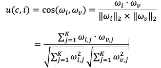
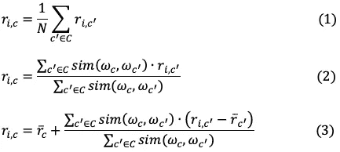

# 推荐系统:综述

> 原文：<https://towardsdatascience.com/recommendation-systems-a-review-d4592b6caf4b?source=collection_archive---------6----------------------->

日本北海道别市

## 推荐系统方法综述

*一个* ***推荐系统*** *，或一个* ***推荐系统*** *，是* [*信息过滤系统*](https://en.wikipedia.org/wiki/Information_filtering_system) *的一个子类，它试图预测用户对一个项目的“评分”或“偏好”。它们主要用于商业应用。*

这类应用的例子包括在亚马逊上推荐产品，在 Spotify 上推荐音乐，当然还有在 Medium 上推荐故事。著名的[Netflix 奖](https://en.wikipedia.org/wiki/Netflix_Prize)也是推荐系统背景下的竞争。

更正式地说，推荐者问题可以解释为确定映射( *c，i* ) *→ R* 其中 *c* 表示用户， *i* 表示项目， *R* 是被推荐项目的用户的效用。然后，项目按实用程序排序，前 *N* 个项目作为推荐项目呈现给用户。

效用的抽象概念有时可以通过用户的后续行为来衡量，例如购买商品、点击“不感兴趣”或“不再显示”等。

# 排名与推荐

人们有时会混淆排名(或搜索排名)系统和推荐系统，有些人甚至认为它们是可以互换的。虽然这两种算法都试图以排序的方式呈现项目，但这两种算法之间存在一些关键差异:

*   排名算法依赖于用户提供的搜索查询，用户知道他们在寻找什么。另一方面，推荐系统没有用户的任何明确输入，旨在发现他们否则可能不会发现的东西。
*   排名算法通常将更相关的项目放在显示列表的顶部，而推荐系统有时试图避免过度专业化。一个好的推荐系统不应该推荐与用户之前看过的过于相似的项目，而应该使其推荐多样化。
*   推荐系统更加强调个性化，因此更容易受到数据稀疏性的影响。

# 推荐系统的类型

推荐系统通常分为以下几类:

*   *基于内容的过滤*
*   *协同过滤*
*   *混合动力系统*

根据模型是否从底层数据中学习，推荐系统也可以分为:

*   基于记忆的
*   模型库

# 基于内容过滤

基于内容的过滤方法基于项目的特征化(与用户相对)和用户效用的简档。它最适合于关于项目的已知数据(例如，主要演员、发行年份、电影类型)以及用户历史上如何与推荐系统交互的问题，但是缺少用户的个人信息。基于内容的推荐器本质上是一个用户特定的学习问题，用于量化用户的效用(喜欢和不喜欢，评级等)。)基于项目特征。

更正式地说，用户 *c* 的项目 *i* 的效用 *u* ( *c* ， *i* )是根据同一用户 *c* 分配给之前看到的其他项目的效用来估算的。

让我们假设**是项目 *i* 的特征向量，而 ***ω*** *ᵥ* 是用户 *v* 的简档向量。用户简档可以被解释为用户对之前看到的所有项目的效用的总结。**

## ****基于记忆的例子****

**让我们以评级系统为例，对用户简档向量建模的一种方式是通过评级加权平均值，即，**

****

**那么效用 *u* ( *c* ， *i* )就变成了**

****

**效用函数在信息检索文献中通常用余弦相似性度量来表示**

****

**其中 *K* 是项目和用户简档向量的维度。**

## ****基于模型的示例****

**[朴素贝叶斯分类器](https://en.wikipedia.org/wiki/Naive_Bayes_classifier)已经被广泛用作推荐系统的基于模型的方法。**

**我们以一个视频推荐系统为例，用一个推荐的视频是否被用户点击来衡量一个用户的效用。更正式地说，这个推荐问题可以被建模为估计点击的概率(或者某些文献中的点击率)，即，**

****

**根据贝叶斯定理，**

****

**根据链式法则，**

****

**来自维基百科**

**现在，借助于“天真的”条件独立性假设，我们有了**

****

**这里 *α* 是一个归一化参数，以确保所得概率位于[0，1]内。然而，这对于一些推荐系统来说是不必要的，在这些推荐系统中，我们只关心所有项目之间的相对排名。**

## ****限制****

*   **数据稀疏、基于记忆或基于模型，它们都利用了用户与推荐系统的历史交互。所以对于不活跃的用户，推荐可能是非常不准确的。**
*   **新用户，这是非活动用户的极端情况，因此使得基于内容的过滤方法不适用。**

**协同过滤方法通过利用跨用户信息来解决上述限制。**

# **协同过滤**

**协同过滤最适合于具有已知用户数据(年龄、性别、职业等)的问题，但是缺乏项目数据或者难以对感兴趣的项目进行特征提取。**

**与基于内容的方法不同，协同推荐系统试图根据其他用户以前对某个项目的效用来预测用户对该项目的效用。**

## ****基于记忆的例子****

**重新使用评级系统示例，基于记忆的方法本质上是试探法，其基于来自其他用户的对项目的评级集合来预测用户对项目的评级，即，**

****

**其中 *C* 是不包括感兴趣的用户 *c* 的用户集合。**

**聚合函数的几种实现是**

****

**(1)仅仅是所有其他用户对该项目的平均评级。(2)试图通过其他用户与用户 *c* 的接近程度来加权其他用户的评级，并且一种测量方式是两个用户的特征向量(年龄、性别、位置、职业等)之间的相似性函数。).(3)是为了解决用户对于他们“喜欢”的意思可能具有不同的评级尺度的问题，例如，一些用户可能更慷慨地对他们喜欢的项目给出最高评级。**

## ****基于模型的示例****

**与基于模型的基于内容的过滤类似，基于模型的协同过滤使用历史数据(来自其他用户)来学习模型。对于评分示例，基于模型的方法是分别为每个项目建立以用户简档为特征、评分为目标的线性回归模型。**

## ****限制****

**类似于基于内容的方法的限制，协同过滤方法也受到下面列出的一些约束**

*   **数据稀疏，对于评分少的冷门项目，协同算法很难做出准确的预测。**
*   **新项目，这是不太受欢迎项目的极端情况，因此使得协同过滤方法不适用。**

# **混合方法**

**考虑到基于内容的方法和协作方法的局限性，并且它们都解决了另一种方法的一些局限性，自然要考虑将这两种方法结合起来，这就产生了混合方法。结合的方式包括:**

1.  **分别实现基于内容的方法和协作方法，并结合它们的预测。这本质上是一种模型集合方法。**
2.  **将基于内容的特征纳入协作方法。一种方法是利用用户简档来测量两个用户之间的相似性，并在协作方法的聚集步骤中使用该相似性作为权重。**
3.  **将协作特征纳入基于内容的方法。做到这一点的一种方法是对一组用户简档应用降维技术，并将其呈现为感兴趣的用户的协作版本简档。**
4.  **跨用户和跨项目模型。这就是建立一个既有物品特征又有用户特征作为输入的模型，比如线性回归模型、树形模型、神经网络模型等。**

# **延长**

**一些推荐系统对时间非常敏感(例如新闻馈送)或者受季节性影响(旅游目的地推荐)。对于这些系统，我们可能需要考虑建立时间序列模型(如 ARIMA、RNN)。还有一些系统，其中推荐与用户最后观看的项目高度相关(例如，YouTube.com)，在这种情况下，基于马尔可夫的模型可能更合适。**

## **参考**

**班尼特，詹姆斯和斯坦·朗宁。“网飞奖。”*KDD 杯及研讨会会议录*。第 2007 卷。2007.**

**协同推荐系统。美国专利 8949899 号。2015 年 2 月 3 日。**

**《YouTube 视频推荐系统》*第四届 ACM 推荐系统会议论文集*。2010.**

**Adomavicius，Gediminas 和 Alexander Tuzhilin。“迈向下一代推荐系统:对最新技术和可能扩展的调查” *IEEE 知识与数据工程汇刊*17.6(2005):734–749。**