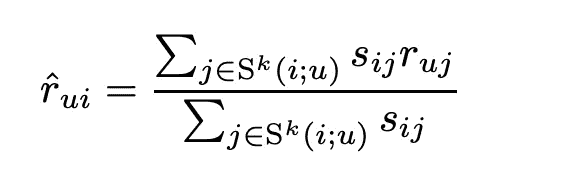
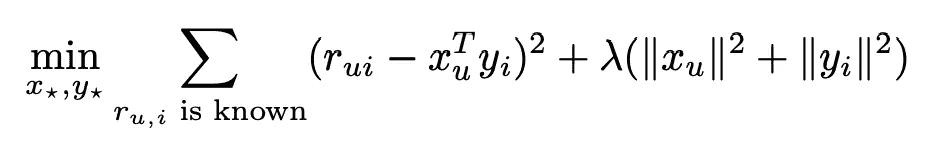
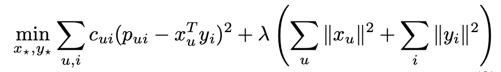
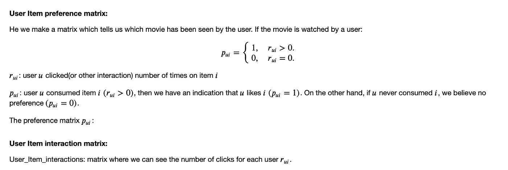
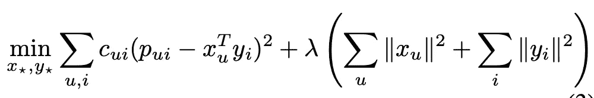

# 推荐系统——高级矩阵分解

> 原文：<https://towardsdatascience.com/recommender-system-advanced-matrix-factorization-2d484bf11c0b?source=collection_archive---------36----------------------->

## 隐式数据集的高级矩阵分解遍历推荐系统


照片由[freepik.com](https://www.freepik.com/free-photo/top-view-earphones-music-concept_9157989.htm#page=1&query=music%20artist&position=8)拍摄

隐式数据集提供用户的行为数据，如购买历史、观看习惯和浏览活动。与来自用户评级数据的显式反馈不同，隐式数据集缺乏对他们偏好的直接指示。因此，很难知道客户不喜欢哪些产品。我们下面工作的模型生成隐式反馈数据集的独特属性。信心水平因积极和消极偏好而异。

**在本文中，您将学习推荐系统的高级矩阵分解算法:**

(1)邻域模型介绍

(2)潜在因素模型介绍

(3)隐式反馈模型介绍

(python 代码在矩阵分解方面的实践经验

# 邻域模型简介

邻域模型是协同过滤算法中的一种常用方法。这样的方法是基于历史数据集推荐具有相同兴趣的用户。更好的可伸缩性和改进的准确性使得面向项目的方法在许多情况下更受欢迎。在这些方法中，使用同一用户对类似项目做出的已知评级来估计评级。更好的可伸缩性和改进的准确性使得面向项目的方法在许多情况下更受欢迎。面向项目的方法对用户更有利，因为他们熟悉他们以前偏好的项目，并且推荐的项目基于相同兴趣的用户。

相似性度量被应用于邻域模型，其中 s_ij 表示 I 和 j 的相似性，并且通过皮尔逊相关系数来计算。目标是预测 r _ ui——用户 u 对项目 i. S^k(i 的未观察值；u)由一组 k 个邻居表示，并且 r_ui 的预测值被取为相邻项目的评级的加权平均值。



相似性度量

# 潜在因素模型介绍

潜在因素模型是一种替代的协作过滤方法，用于揭示解释观察到的评级的潜在特征。奇异值分解(SVD)是潜在因素模型的主要算法。SVD 模型成为一种流行的用户项目观察方法。

SVD 模型由用户因素向量 X_u 和项目因素向量 Y_i 组成。预测由内积 r^ui = X^T_u*Y_i.生成。λ是用于正则化的参数。



正则化奇异值分解模型

# 隐式反馈模型简介

## 将信心的概念形式化

1.  **偏好变量:**是一个二元变量，表示用户 u 对项目 I 的偏好，当 P_ui =1 时，用户 u 消费了项目 i (R_ui > 0)，u 喜欢项目 I，而用户 u 从未消费过项目 I，P_ui =0 时，对项目 I 没有偏好。一般来说，随着 R_ui 的增长，强烈表明用户确实喜欢该物品。

```
P_ui = { 1, R_ui > 0 ; 0, R_ui = 0}
```

**2。置信变量:** C_ui 是通过观察 P_ui 得到的置信测度。对于每个用户-项目对，它在 P_ui 中以某种最小置信度设置。置信测度通过常数α随着积极偏好而增加。

```
C_ui = 1 + α*R_ui
```

## 价值函数

λ项用于正则化模型，以防止对训练数据过度拟合。成本函数中有 m 项和 n 项，其中 m 是用户数，n 是项目数。



价值函数

交替最小二乘法用于在计算用户因素和项目因素时降低成本函数值。这种方法用于显式数据集，并将所有未知值视为缺失值，从而产生稀疏目标函数。提取 P_ui 的另一种方法是从 R_ui 中为 P_ui 的相应非零值设置最小阈值。同样，置信度 C_ui 可以从 R_ui 转换而来。

```
C_ui = 1 + α log(1 + rui/ε)
```

对于隐式反馈的独特特征，有两个主要的特性需要解决。

1.  将参数(R_ui)转换成两个不同的观察值:偏好参数(P_ui)和置信水平(C_ui)
2.  用户-项目组合(n-m)可以通过代数算法在线性运行时间内执行。

# python 代码在矩阵分解方面的实践经验

## 数据描述:

该数据集包含来自 [Last.fm](http://www.last.fm) 在线音乐系统的一组 2K 用户的社交网络、标签和音乐艺术家收听信息。总共有 1892 和 17632 位艺术家。有 12717 个双向用户朋友关系，有 25434 (user_i，user_j)对。从用户收听艺术家的历史数据来看，有 92834 个用户收听艺术家关系和平均 5.265 个用户收听每个艺术家。

## 数据输入:

数据由每一列的制表符分隔，并具有' **userID** '、 **artistID** '和' **weight** '列。我们总共得到了 278502 位艺术家的作品。在我们删除重复的记录后(如果有人听了同样的歌曲两次)，数据中有 1892 个用户和 17632 个艺术家。

## 用户 _ 项目 _ 首选项&用户 _ 项目 _ 交往矩阵



## 培训、测试和评估矩阵

用于从训练矩阵中屏蔽偏好数据的函数。训练矩阵由用户收听的艺术家创建，并将其掩蔽到训练矩阵。测试矩阵是基于用户的历史数据集创建的。

## 张量流模型训练

在模型创建之前，偏好矩阵由占位符函数生成，该占位符函数用于构建计算图，而不需要数据。此外，预测偏好矩阵是通过取内积 r \u I = x^t_u*y_i.来完成的。稍后，我们取实际和预测偏好矩阵的平方误差，乘以置信矩阵，并将λ的乘积值与损失函数相加。这是我们从上述方法中最小化成本函数的地方。成本函数如下所述。 **Top_k_precision** 是通过推荐的艺术家和用户喜欢的艺术家的交集来帮助计算前 k 项平均预测精度的函数。

**推荐系统型号**
1。获得建议的预测矩阵
2。从用户的历史数据集中锁定最受推荐的艺术家
3。从用户历史数据和推荐艺术家中映射艺术家
4。从上面 K 位顶级艺术家的映射方法中获得交集的结果



价值函数

## 未来的工作

1.  偏好和交互矩阵相对稀疏，因为不是每个用户都听数据中的所有艺术家。为了克服这个问题，可以通过人口统计学将用户分类为不同的组。因此，矩阵会更密集
2.  模型的超参数会影响预测结果。增加 lambda 以增加更多的正则化或增加学习率可以惩罚过拟合模型。

# 总之:

1.  偏好变量指示用户确实喜欢该项目。置信度变量在 P_ui 中设置有一些最小置信度。隐式数据集的成本函数是提取 P_ui，是从 R_ui 为 P_ui 的相应非零值设置最小阈值。
2.  Tensorflow **推荐系统模型训练**推荐的预测矩阵，并将其屏蔽回用户的偏好和交互数据。每次运行历元后，都会优化精度值。

# 参考:

1.  http://yifanhu.net/PUB/cf.pdf[2009 年 2 月 10 日，胡一帆、耶胡达·科伦和克里斯·沃林斯基“隐式反馈数据集的协同过滤”](http://yifanhu.net/PUB/cf.pdf)

2.隐式反馈数据集协同过滤
[https://github . com/azg 0404/隐式反馈数据集协同过滤](https://github.com/AZG0404/Collaborative-Filtering-for-Implicit-Feedback-Datasets)