# 推荐系统——基于隐式反馈的贝叶斯个性化排序

> 原文：<https://towardsdatascience.com/recommender-system-bayesian-personalized-ranking-from-implicit-feedback-78684bfcddf6?source=collection_archive---------17----------------------->

## 贝叶斯个性化排序&自适应 K-最近邻的漫游推荐系统

杰夫·谢尔登在 [Unsplash](https://unsplash.com/collections/1680217/workspace?utm_source=unsplash&utm_medium=referral&utm_content=creditCopyText) 上的照片

更普遍的是看到公司使用推荐系统算法，根据用户以前的购物体验来生产用户喜欢的商品。在线顾客在网上购物时会从易贝、亚马逊、沃尔玛等商店获得推荐商品。这篇文章的重点是项目推荐。项目推荐系统方法为从用户过去的数据集(例如购买历史、观看历史等)中学习的一组项目提供用户特定的排名。如今，推荐系统变化很大，从像评级这样的显式数据集的输入到像监控点击、观看时间、购买等这样的隐式数据集的输入。这些信息比较容易收集，但是很难推荐用户喜欢的项目。

**在本文中，你将学习推荐系统的奇异值分解和截断奇异值分解:**

(1)个性化排名系统

(2)问题陈述

(3)贝叶斯个性化排序

(4)流程再造优化标准

(5) BPR 学习算法

(6)矩阵分解

(7)自适应 K 近邻

## 个性化排名系统

个性化排序向顾客提供排序的项目列表的项目推荐。这篇文章将着重于根据用户从过去的购买数据中得出的隐含行为，向客户推荐个性化的商品排序列表。从购买数据中观察，可以获得积极的观察结果，如用户的购买历史，而未观察到的用户-项目对数据很难用于模型输入，如未购买的项目、不感兴趣的项目或对其未来购买感兴趣的项目。

## 问题陈述

对于隐式反馈系统，它能够检测像购买历史这样的正数据集。对于剩余的数据，它是实际负值和缺失值的混合。然而，机器学习模型无法学习缺失的数据。通常，项目推荐器基于用户对项目的偏好输出个性化得分 X_ui，并且项目从预测得分中排序。项目推荐器的机器学习模型提供训练数据，其中给定对(U，i) ∈ S 作为正类标签，并且(pairs 中的所有其他组合为负类标签。

该模型适合于预测值为 1 和 0 的正类，而对于其余的正类。当模型无法对项目((U × I) \ S)进行排序时，会出现问题，这些项目在训练期间作为负面反馈给出。一种替代方法是将正则化添加到模型中，以防止过度拟合。另一种方法是创建项目对作为训练数据，并优化以正确排列项目对，而不是对单个项目评分，同时忽略缺失值。从下面的照片来看，模型很难只从观察到的数据中学习。因此，所有的负数据都被替换为 0。

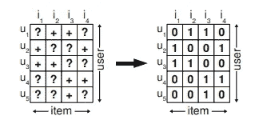

Photo0:观察到的 0 值和未观察到的 1 值。

## 贝叶斯个性化排名(BPR)

为了克服个性化排序任务，贝叶斯个性化排序结合了使用 p(I > u j |θ)的似然函数和模型参数 p(θ)的先验概率的问题的贝叶斯分析。

在这一节中，我们推导出一种解决个性化排序任务的通用方法。它包括个性化排序的通用优化标准 BPR-Opt，该标准将通过使用 p(I > u j |θ)的似然函数和模型参数 p(θ)的先验概率对问题进行贝叶斯分析而得到

## BPR 优化标准

贝叶斯方法是对所有项目 i ∈ I 进行排序，以最大化以下后验概率，其中θ表示任意模型类别的参数向量

> p(θ| > u)∞p(> u |θ)p(θ)

所有用户因素都是相互独立的，并且对于特定用户，每对项目(I，j)的排序是唯一的。

因此，上述用户特定的似然函数可以用下面的公式再现。

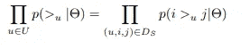

用户的可能性函数

我们将用户确实更喜欢项目 I 而不是项目 j 的个体概率定义为:

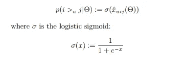

用户偏好项目 I 而非项目 j 的概率

对于个性化排序任务的贝叶斯建模方法，引入了广义先验密度 p(θ),它是均值为零且方差-协方差矩阵为σθ的正态分布。

> p(θ)∞N(0，σθ)

通过设置σθ=λθI，我们减少了未知超参数的数量。设置最大后验估计量来导出个性化排序 BPR-Opt 的优化准则。

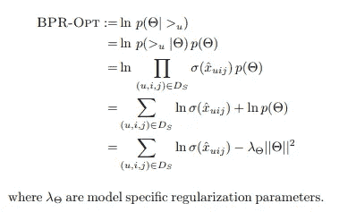

BPR-Opt 数学公式

## BPR 学习算法

从上一节可以看出，该标准来自个性化排序，标准梯度下降不适于处理该问题。然后，引入 LearnBPR 作为随机梯度下降算法来优化模型性能。

BPR-Opt 相对于模型参数的梯度为:

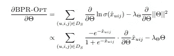

梯度 BPR-Opt 数学公式

优化模型中的参数被指定为学习率α和正则化λθ。该模型是一个基于自举的随机梯度下降模型。

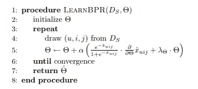

Photo2:基于自举的随机梯度下降算法

我们将介绍一种流行的随机梯度下降法。根据下面的等式，对每个三元组(u，I，j) ∈ D_s 执行更新。

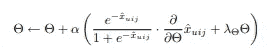

随机梯度下降数学公式

训练对上的方法顺序至关重要。当相同的用户-项目对会有许多更新时，遍历数据项或用户-项目会导致较差的收敛性。引入随机梯度下降算法来随机选择三元组(均匀分布)。这种方法可以减少在连续更新步骤中选择相同用户项目组合的机会。带替换的 Bootstrap 抽样方法能够停止用户-项目对的随机选择。在我们的评估中，单个步骤的数量是根据观察到的正反馈数量线性选择的。

## BPR 学习模型

矩阵分解和学习的 k-最近邻这两种不同的模型类别将对用户对某个项目的隐藏偏好进行建模。首先，我们分解估计量 x_uij，并将其定义为:

> xuij:= xui xuj

接下来，应用标准的协同过滤模型来预测ˇx _ ul。这种方法比原来的方法更好，因为它对两个预测值 x _ ui x _ uj 的差异进行分类，而不是将单个预测值 x_ul 回归为单个数字。

## 矩阵分解

矩阵 X : U × I 的估计用于处理预测ˇX _ ui 的问题。目标矩阵由矩阵分解得到的两个低秩矩阵 W : |U| × k 和 H : |I| × k 的矩阵乘积生成。

> xˇ:= w * h^t

根据下面的等式，有指定的参数。

k:近似的维数/秩
W _ u:W 中的特征向量，指示用户 u，类似地，H 的每一行 hi 描述一个项目 I

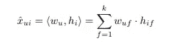

预测公式

θ=(W，H):矩阵分解的模型参数。这些参数是潜在变量，用于模拟未观察到的用户和项目对。实现奇异值分解(SVD)以最小平方逼近 Xˇ到 X。通常，SVD 方法会过度拟合数据。然后，还有其他推荐的方法，如正则化最小二乘优化，非负因式分解，最大间隔因式分解。

对于排名任务，我们使用 LearnBPR 来估计用户是否更喜欢某个项目。通过 LearnBPR 方法，我们需要知道ˇx _ uij 相对于每个模型参数θ的梯度。下面，它显示了矩阵分解模型的导数。

对于排序任务，即评估用户是否喜欢某个项目，更好的方法是根据 BPR-Opt 标准进行优化。这可以通过使用我们提出的算法 LearnBPR 来实现。如前所述，使用 LearnBPR 进行优化时，只需知道相对于每个模型参数θ的梯度ˇx _ uij。对于矩阵分解模型，导数为:

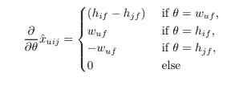

矩阵分解模型的导数

此外，还增加了三个正则项。

λW:用户特征 W
λH+:项目特征 H 的 hif 上的正更新
λH——项目特征 H 的 hjf 上的负更新

## 自适应 K 近邻

在协同过滤中还有另一种流行的方法，叫做 K-最近邻法，来自于项目(基于项目)或用户(基于用户)之间的相似性度量。对于 K-最近邻，我们基于 I 与用户在过去的历史数据中见过的所有其他项目的过去相似性，即 I + u，从用户 u 生成推荐项目 I 的预测。K-最近邻是从 I + u 的 K 个最相似的项目中产生的。c 是对称的项目相关性/项目相似性矩阵。

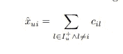

K 近邻项目预测

kNN 中的模型参数是θ= C。C 通过应用启发式相似性度量来确定，例如余弦向量相似性:I。

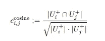

K 近邻的余弦向量相似性

当模型学习时，相似性度量 C 将被更新。可以直接应用参数 C。另一方面，当参数 C 过大时，模型从 H : I × k 的因式分解 HHt 产生 C，后来，我们选择适应没有因式分解的 C。为了优化用于排名的 KNN 模型，使用 LearnBPR 算法来更新相对于模型参数 c 的-x _ uij 的梯度

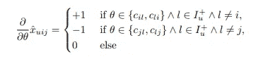

KNN 梯度学习算法数学公式

有两个正则化常数，用于 cil 更新的λ+和用于 cjl 更新的λ。：

# python 代码的实践经验

## 数据描述:

有从 [grouplens](https://grouplens.org/datasets/movielens/1m/) 网站提取的收视率、用户和电影数据集。这些文件包含来自 6000 名 MovieLens 用户的大约 4000 部电影的大约 100 万个匿名评级。分级数据包括用户 ID、电影 ID 和分级。用户文件包含用户的人口统计信息，如性别、年龄、职业和邮政编码。电影数据集包含电影 ID、标题和类型等基本信息。

## 基于隐式反馈的贝叶斯个性化排序

对于建模方法，在 Pytorch 模型中实现了个性化排序系统，即来自贝叶斯分析的最大后验估计器。此外，模型的优化是通过一个基于随机梯度下降和 bootstrap 采样的通用学习算法来完成的。

## 数据预处理

从用户和评级数据集中，我们用唯一用户给出的电影评级创建唯一的 userid 映射。此外，评级数据集中的唯一项目映射。创建 train_user_matrix 和 test_user_matrix 时有两种方法。一个是随机选择的用户，另一个是考虑时间顺序因素。通过训练和测试集列表，我们可以为矩阵输入创建用户和项目对。

对于模型输入数据，我们使用 Pytorch 库中的 DataLoader 对象。DataLoader 从数据集和采样器的组合中遍历数据集。数据加载器通过参数`batch_size.`批量创建数据。该参数决定每批加载多少个样本。DataLoader 类中还有另一个`num_worker`参数，它指定了多少个子进程用于数据加载。

## 系统模型化

首先，我们创建具有用户索引的用户矩阵(u ),具有用户偏好的所有项目的项目索引(I ),以及用户不偏好的项目索引(j)。然后用 u 和 I 相乘生成矩阵 x_ui，用每行求和。并且，矩阵 x_uj 是用 u 和 j 的乘积生成的，并且对每一行求和。矩阵 x_uij:矩阵 x_ui —矩阵 x_uj。概率由矩阵 x_uij 的 sigmoid 函数呈现，并对值求和。正则化增加了权重衰减参数乘以用户和项目矩阵的归一化，并对平方函数求和。数学公式如下。

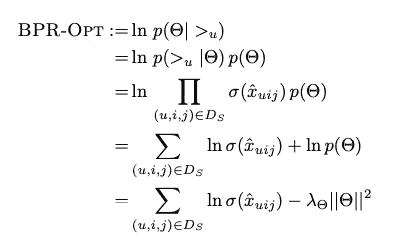

稍后，预测输出推荐项目的最高概率，并存储在列表中。

## 数据加载器和丢失的功能

我们生成一个批量为 4096 的 DataLoader 类，并分配 16 个工作线程。由于数据集非常大，我们分配了 16 个子流程来并行处理数据。Adam optimizer 的学习率设置为 0.0001。反向传播有随机梯度下降来优化模型。对于每个批次，我们记录损失、精确率和召回率。

# 结果

模型输入有两种不同的数据集。一个是带有 userid 和 itemid 的随机数据，另一个是时序数据集。

精度产生如下。左手边是随机数据。从左边的图来看，1 个项目的推荐比 5 个和 10 个电影的推荐产生更好的结果。在右图中，时间顺序输入数据集的结果比随机数据稍差，因为模型很难将时间顺序因素捕捉到模型中。

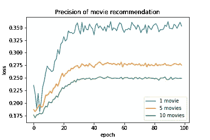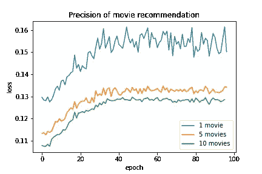

## 未来工作:

*   处理稀疏矩阵。从数据预处理方法上，过滤电影，而不是从用户喜欢的类别。
*   添加更多的用户矩阵特征，如用户的朋友关系、会员资格、点击率等。
*   将时间因素纳入模型结构

# 最后

*   贝叶斯个性化排序使用 p(I > u j |θ)的似然函数和模型参数 p(θ)的先验概率。贝叶斯方法是对所有项目 i ∈ I 进行排序，以最大化以下后验概率
*   对于排名任务，我们使用 LearnBPR 从矩阵分解中估计用户是否更喜欢某个项目。通过计算ˇx _ uij 相对于每个模型参数θ的梯度来实现模型的优化。
*   从项目(基于项目)或用户(基于用户)之间的相似性度量导出的 k-最近邻方法，基于 I 与用户在过去的历史数据中看过的所有其他项目的过去相似性，生成来自用户 u 的推荐项目 I 的预测。

# 参考

*   BPR:来自隐性反馈的贝叶斯个性化排名
    [https://arxiv.org/pdf/1205.2618.pdf](https://arxiv.org/pdf/1205.2618.pdf)