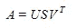
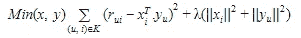
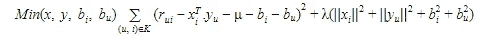
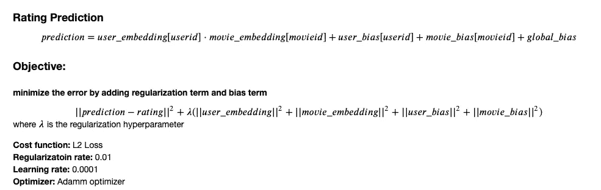
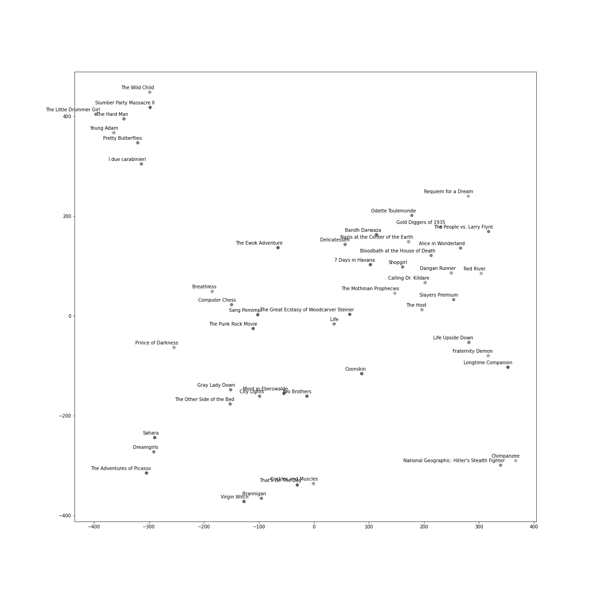

# 推荐系统——奇异值分解和截断奇异值分解

> 原文：<https://towardsdatascience.com/recommender-system-singular-value-decomposition-svd-truncated-svd-97096338f361?source=collection_archive---------3----------------------->


照片由[Unsplash.com](https://unsplash.com/photos/C6T6vr1sQI0)拍摄

推荐系统最常用的方法通常是协同过滤(CF ),它依赖于过去的用户和项目数据集。CF 的两种流行方法是潜在因素模型，它从用户和项目矩阵中提取特征，以及邻居模型，它发现产品或用户之间的相似性。

邻居模型是一种面向项目的方法，基于用户对相似项目给出的评级来发现用户偏好。另一方面，诸如奇异值分解(SVD)的潜在因素模型从用户-项目矩阵中提取特征和相关性。例如，当项目是不同类别的电影时。当审视动作与喜剧、好莱坞与宝莱坞或漫威与迪士尼等维度空间时，奇异值分解会产生一些因素。主要地，我们将集中于奇异值分解(SVD)方法的潜在因子模型。

**在本文中，您将学习推荐系统的奇异值分解和截断奇异值分解:**

(1)奇异值分解介绍

(2)截断奇异值分解简介

(python 代码对矩阵分解的实践经验

# 奇异值分解简介

谈到降维，奇异值分解(SVD)是机器学习中矩阵分解的线性代数中的一种流行方法。这样的方法将空间维度从 N 维收缩到 K 维(其中 K



Matrix U: singular matrix of (user*latent factors)
矩阵 S:对角矩阵(显示每个潜在因素的强度)
矩阵 U:奇异矩阵(项*潜在因素)

通过矩阵分解，潜在因素显示了项目的特征。最后，产生形状为 m*n 的效用矩阵 A。矩阵 A 的最终输出通过提取潜在因素来降维。从矩阵 A 中，它通过将用户和项目映射到 *r* 维潜在空间来显示用户和项目之间的关系。向量 X_i 被认为是每个项目，向量 Y_u 被认为是每个用户。用户对项目给出的评级为 R_ui = X^T_i * Y_u。损失可以通过 R_ui 和预期评级的乘积之间的平方误差差来最小化。


正则化用于避免过度拟合，并通过添加惩罚来概化数据集。



这里，我们添加了一个偏差项，以减少实际值与模型预测值之间的误差。

> *(u，i):* 用户-项目对
> *μ:* 所有项目的平均评分
> *bi:* 项目平均评分 *i* 减去 *μ
> bu:* 用户给出的平均评分 *u* 减去 *μ*

下面的等式增加了偏差项和正则项:



# 截断奇异值分解简介

说到矩阵分解技术，截断的**奇异值分解** ( **SVD** )是一种产生将矩阵 M 分解为三个矩阵 U、σ和 v 的特征的常用方法。另一种常用方法是主成分分析(PCA)。截断的 SVD 与 PCA 具有相似性，而 SVD 是从数据矩阵中产生的，PCA 的因式分解是从协方差矩阵中产生的。与常规 SVD 不同，截断 SVD 产生一种因子分解，其中可以为许多截断指定列数。例如，给定一个 n×n 矩阵，截断 SVD 生成指定列数的矩阵，而 SVD 输出 n 列矩阵。

## 截断奇异值分解相对于主成分分析的优势

截断 SVD 可以处理稀疏矩阵以生成特征矩阵，而 PCA 将对整个矩阵进行操作以输出协方差矩阵。

# python 代码的实践经验

## 数据描述:

元数据包括完整 MovieLens 数据集中列出的 45，000 部电影，电影在 2017 年 7 月之前上映。演员、工作人员、情节关键词、预算、收入、海报、上映日期、语言、制作公司、国家、TMDB 投票数和平均投票数都在数据集中。评级范围为 1-5，从 GroupLens 官方网站获取。该数据集是从 [Kaggle 数据集](https://www.kaggle.com/rounakbanik/the-movies-dataset?select=movies_metadata.csv)中引用的。

# 使用 SVD 推荐电影

奇异值分解是一种用于电影推荐的协同过滤方法。代码实现的目的是从项目-用户矩阵的潜在特征中为用户提供电影推荐。该代码将向您展示如何使用 SVD 潜在因子模型进行矩阵分解。

## 数据预处理

随机采样分级数据集并生成带有流派的电影特征。然后，labelencode 用各自唯一的 id 对所有电影和用户进行编码。

```
num of users: 1105
num of movies: 3000
```



## 模型性能

通过每个历元的运行，rmse 降低，最终输出达到 rmse 0.57。批量大小的数量会影响每次运行时输入到模型中的输入数据的数量。批量大小、学习速率和正则项是可调的，以优化模型性能。

```
RMSE 2.1727233
RMSE 2.101482
RMSE 2.0310202
RMSE 1.9610059
RMSE 1.8911659
RMSE 1.8213558
RMSE 1.7515925
RMSE 1.681992
RMSE 1.612707
RMSE 1.543902
RMSE 1.4757496
RMSE 1.408429
RMSE 1.3421307
RMSE 1.277059
RMSE 1.2134355
RMSE 1.1514966
RMSE 1.0914934
RMSE 1.0336862
RMSE 0.9783424
RMSE 0.9257237
RMSE 0.87606686
RMSE 0.82956517
RMSE 0.7863303
RMSE 0.7463626
RMSE 0.7095342
RMSE 0.67563176
RMSE 0.6445249
RMSE 0.6163493
RMSE 0.5914116
RMSE 0.5701855
```

# 使用截断奇异值分解推荐电影

通过截断 SVD 生成的用户 x 电影矩阵的前 10 个分量。在重构的矩阵中存在潜在的特征，这些特征示出了与用于评级预测的用户评级的相关性。

由于“流派”列位于字典格式的列表中，因此该列经过预处理，并提取出由|格式分隔的几个流派名称。

## 对用户和电影矩阵执行截断奇异值分解

从数据集中随机抽取 3000 个用户评级样本，创建索引为 **Userid** 的数据透视表和带有评级值的 **MovieID** 列。然后，由用户矩阵生成具有 2921×1739 个用户的用户矩阵。

从数据集中随机抽取 3000 个电影样本，创建数据透视表，索引为 **MovieID** ，列为 **Userid** ，评级值为。然后，由电影矩阵生成具有 3000×1105 个用户的电影矩阵。

从用户和评级矩阵来看，80%的数据用于训练数据，其余 20%用于测试数据。对于训练数据，重构矩阵由截断 SVD 的 10 个分量产生。矩阵的行*列长度为 movie_features.shape = (2400，10)和 user_features.shape = (2336，10)。

**TSNE 可视化**

TSNE 将数据的高维空间转换成数据的低维空间，并将其可视化。困惑是一种可调整的特征，用于平衡局部和全局数据，并建议每个点的近邻数量。

以电影特征的 5 和 2 的组成部分的困惑和情节被生产并且显示电影的群集。通过 TSNE 方法产生的潜在特征对相关的电影进行聚类。



相关电影的 TSNE 情节

## 准备训练和目标数据

目标数据的标签是平均用户评级，并四舍五入到小数点后 1 位。电影共 501 部，用户评分 1108。火车的大小和目标数据是 data.shape = (3000，1105)和 targets.shape = (3000，)。

## 在潜在特征上训练梯度增强回归器

用 0.1 的学习率和 200 个估计量训练梯度增强回归器模型。通过**均方误差**计算损失函数。

最后的预测是由用户产生的所有评级对每部电影的平均评级。最终的 MSE 在 0.51 左右，对于平均评级模型来说是相当优化的。

```
 Iter       Train Loss   Remaining Time 
         1           0.3735            5.43s
         2           0.3710            5.12s
         3           0.3689            4.89s
         4           0.3672            4.76s
         5           0.3656            4.67s
         6           0.3641            4.64s
         7           0.3628            4.59s
         8           0.3614            4.54s
         9           0.3601            4.52s
        10           0.3589            4.51s
        20           0.3480            4.14s
        30           0.3391            3.83s
        40           0.3316            3.59s
        50           0.3245            3.35s
        60           0.3174            3.14s
        70           0.3118            2.91s
        80           0.3063            2.68s
        90           0.3013            2.45s
       100           0.2968            2.22s
       200           0.2620            0.00sFinal MSE:0.5118555681581297
```

# 总之:

1.  奇异值分解分解三个矩阵，潜在因子表示项目的特征。它通过提取潜在因素来降低维度。通过增加正则化和偏置项，它通过最小化 rmse 误差来优化模型性能。
2.  截断 SVD 生成指定列数的矩阵，而 SVD 输出 n 列矩阵。它减少了输出的数量，并能更好地处理稀疏矩阵的特征输出。

# 参考

1.  利用截断 SVD 降维
    [https://subscription . packtpub . com/book/big _ data _ and _ business _ intelligence/9781783989485/1/ch 01 LV 1 sec 21/using-truncated-SVD-to-reduce-dimension](https://subscription.packtpub.com/book/big_data_and_business_intelligence/9781783989485/1/ch01lvl1sec21/using-truncated-svd-to-reduce-dimensionality)
2.  使用截短的 SVD
    [推荐电影 https://github . com/saurabhmathur 96/movie-recommendations/blob/master/notebooks/推荐% 20movies %使用% 20 截短的%20SVD.ipynb](https://github.com/saurabhmathur96/movie-recommendations/blob/master/notebooks/Recommending%20movies%20using%20Truncated%20SVD.ipynb)

3.奇异值分解及其在推荐系统中的应用 https://analyticsindiamag . com/singular-Value-Decomposition-SVD-Application-Recommender-System/#:~:text = In % 20 the % 20 context % 20 of % 20 the，给定%20to%20items%20by%20users。

4.使用 SVD 矩阵分解推荐电影
[https://github . com/saurabhmathur 96/movie-recommendations/blob/master/notebooks/推荐% 20movies %使用% 20 SVD % 20 Matrix % 20 factorization . ipynb](https://github.com/saurabhmathur96/movie-recommendations/blob/master/notebooks/Recommending%20movies%20using%20SVD%20Matrix%20Factorisation.ipynb)