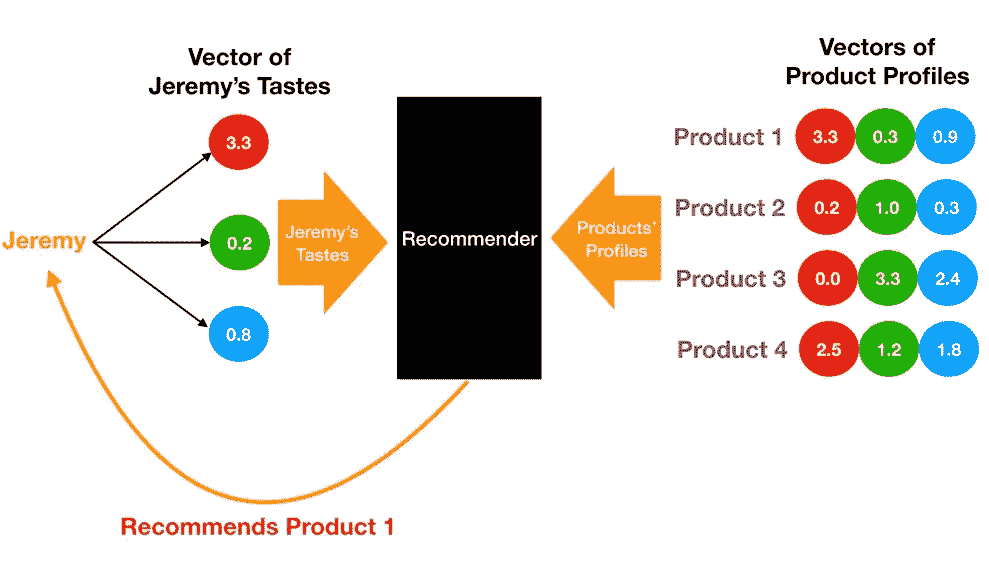

# 推荐系统解释

> 原文：<https://towardsdatascience.com/recommender-systems-explained-88807e90e144?source=collection_archive---------38----------------------->


哈尔·盖特伍德在 [Unsplash](https://unsplash.com?utm_source=medium&utm_medium=referral) 上拍摄的照片

## 推荐系统如何工作的简单英语指南

我花了很多时间写各种数据科学算法和概念如何在基础层面上工作。但是我们的许多利益相关者不希望或不需要这种程度的细节。所以今天我试图做相反的事情——在一个高层次上清楚地(简明地)解释 ***推荐系统*** *，一个流行的机器学习应用程序，如何做它们所做的事情*。

# 匹配用户和商品

在超高层次上，**推荐系统试图将用户(也称为潜在客户)与他们可能喜欢的商品或服务匹配起来**。很明显，我们希望这种推荐能带来购买。

那么这是怎么做到的呢？如果你曾经在谷歌上搜索过推荐系统，你可能会看到像**基于内容**和**协同过滤**这样的术语。这是创建推荐的两种主要方法。但是我们先不要去那里。相反，假设我们正在运营一个电子商务网站。我们如何决定(使用数据)向第一次访问我们网站的名为 Jeremy 的特定用户推荐什么商品？

这取决于我们对杰里米了解多少。下图从 30，000 英尺的高度展示了推荐系统正在做的事情。



推荐系统

推荐器是一种算法，它考虑了杰里米的口味，用话题负载的向量来表示(例如，红点可能代表视频游戏、绿色自然和蓝色食物)。它还考虑了所有可用产品的概况，每个产品都被表示为与用于量化 Jeremy 口味的主题相同的主题的负载向量(因此它是一个数组)。

以口味向量和产品档案数组作为输入，推荐器的工作是将 Jeremy 与它预测他最喜欢的产品匹配起来。所以从某种意义上来说，这是一个分类问题，我们试图预测某人是否会喜欢某个给定的产品并购买它。

# 计算产品配置文件


产品简介

我们如何了解我们每个产品的概况？产品简介应该代表产品的关键潜在特征，尤其是用户关心的特征。

一个非常简单的产品简介就是类别。例如，对于书籍，简介可以是历史、幻想、科幻、非虚构、传记、浪漫、幽默等。从数量上来说，书就像这样:

```
**Lord of the Rings**
History:    0  *
Fantasy:    1  ----------*
Sci Fi:     0  *
Nonfiction: 0  *
Biography:  0  *
Romance:    0  *
Humor:      0  ***Twilight**
History:    0  *
Fantasy:    0  *
Sci Fi:     0  *
Nonfiction: 0  *
Biography:  0  *
Romance:    1  ----------*
Humor:      0  *
```

我们会努力找出我们的客户喜欢阅读的类别(流派)。我们可以通过以下几种方式来实现:

*   直接问他们最喜欢的流派是什么。
*   索要一份他们最喜欢的书的清单，并从清单中推断出他们喜欢的类型。

假设我们采用方法 2——杰里米给了我们 7 本奇幻书和 3 本浪漫书的清单。那么杰里米最喜欢的类型一定是幻想，对不对？所以我们可以把他送到幻想区然后就完事了？没那么快！他还告诉我们他非常喜欢的 3 本言情书。这也是有用的信息。杰里米看书时似乎更喜欢幻想和浪漫的结合。

我们能否创建更细致的产品简介，而不是全有或全无类别，更符合杰里米的口味？如果你读过《哈利·波特》系列，你会知道这些书是关于魔法和与伏地魔战斗的，因为它们是一个成长的故事。知道了这一点，哈利·波特更好的形象可能是:

```
**Harry Potter**
History:    0   *
Fantasy:    0.7 -------*
Sci Fi:     0   *
Nonfiction: 0   *
Biography:  0   *
Romance:    0.3 ---*
Humor:      0   *
```

因此，如果我们希望能够提供更加细致入微的推荐，一个产品的简介不仅应该基于它的一般类别，还应该基于它的内容。观察差异:

*   当我们纯粹按类别来分类时，哈利波特会被认为是奇幻类的，因为它的奇幻内容得分最高(而且超过了它的浪漫内容)。
*   但是，当我们允许书籍是类别(或主题)的组合时，我们可以将《哈利·波特》描述为 70%的奇幻和 30%的浪漫(基于其内容文本)，这将是向杰里米推荐的最佳书籍。

在我们的例子中，我们将流行书籍类别作为我们的主题。但实际上，想出这些题目的方法有很多。唯一重要的是这些主题可以映射到用户的品味和偏好。如果你想知道我说的主题是什么意思，它们是我们用来描述产品的个人特征或品质。有了它们，我们可以将每个产品建模为主题组合。并且**这些话题负载向量成为每个产品(产品简介)的量化表示，推荐系统可以理解并利用它来进行推荐**。

我们想出主题的一种方式是通过 NLP(自然语言处理)。我们可以对库存中所有书籍的组合文本运行 NLP，或者至少对它们的描述或概要运行 NLP。这种 NLP 分析的输出将是语料库(我们的图书目录)中所有图书覆盖的潜在主题以及每本书的主题负载。关于 NLP 的更多信息，你可以在这里阅读我的帖子。

如果我们想要的不仅仅是主题，我们可以对 NLP 分析的结果进行聚类分析(这给了我们主题)。这将告诉我们网站上的书籍通常属于什么主题组合。例如，我们可能会发现我们的网站主要销售以下 3 种类型的书籍:

```
***Values below are for the centers of each cluster*****Cluster 1 (Fantasy with a Dash of Romance)**
History:    0   *
Fantasy:    0.7 -------*
Sci Fi:     0   *
Nonfiction: 0   *
Biography:  0   *
Romance:    0.3 ---*
Humor:      0   ***Cluster 2 (Romance with a Dash of Vampires)**
History:    0   *
Fantasy:    0.1 -*
Sci Fi:     0   *
Nonfiction: 0   *
Biography:  0   *
Romance:    0.9 ---------*
Humor:      0   ***Cluster 3 (Funny Biographies)**
History:    0   *
Fantasy:    0   *
Sci Fi:     0   *
Nonfiction: 0   *
Biography:  0.5 -----*
Romance:    0   *
Humor:      0.5 -----*
```

看到这一点，我们可能会得出结论，我们需要增加我们的图书品种。而且，我们知道要把我们的营销努力集中在那些可能对我们的 3 个利基集群中的至少一个感兴趣的用户身上。但是我们怎么知道谁感兴趣呢？

# 推断用户的品味和偏好


用户口味向量

如果杰里米之前没有明确告诉我们他最喜欢的 10 本书，我们怎么能推断出他的品味呢？这取决于我们对他了解多少。一般来说，我们有 4 种可能的情况:

1.  他通过调查或问卷直接告诉我们他喜欢什么(我们设计调查或问卷是为了找出用户喜好的话题负载)。在这种情况下，这很容易，我们只需将调查结果映射到一个主题负载向量或一个特定的集群中(为简单起见，假设我们使用主题负载作为推荐器)。**让我们称这个向量为前进的口味向量。**
2.  如果我们知道他的购书历史，那么**我们可以查看他购买的所有或部分书籍的主题负载，以计算他的口味向量**——这也很容易。如果 Jeremy 有足够多的过去买书的样本，那么这个购买时间序列本身就可以作为一个替代的口味向量。
3.  我们不知道他的购买历史(他对我们的网站来说是全新的)，但我们知道他的一些数据点，如姓名、年龄、工作、教育水平等。然后，我们可以根据我们对 Jeremy 的了解，查看与他相似的其他访问者的购买历史。根据类似用户的购买历史，我们可以猜测一个口味向量，并使用它来进行一些初步的推荐。然后，当他接受或拒绝我们的建议时(并希望进行一些购买)，我们可以用真实的杰里米数据来增加我们猜测的口味向量。
4.  最后，如果我们对他一无所知呢？然后，我们将需要使用我们拥有的数据来提出一些通用的建议。我们可能希望将一些流行的书籍(我们网站的其他用户倾向于喜欢的)与一些更具探索性的推荐(旨在尽可能多地收集关于 Jeremy 的信息)相结合，以便我们可以尽快计算出 Jeremy 的可用口味向量。

一旦我们有了杰里米的品味向量，我们就可以用它做各种很酷的事情:

*   我们可以用它来向杰里米推荐。
*   我们可以使用它来找到与 Jeremy 相似的用户，并根据这些用户的购买和行为增加我们对他的推荐。
*   如果 Jeremy 是我们网站中非常活跃且模型化良好的成员，我们可以使用他的数据和购买历史来更好地建模，并为我们认为相似的其他用户提供建议。

# 提出建议

推荐是品味与产品简介相交的地方。我们的想法是浏览我们的产品库存，并推荐符合相关用户口味的产品。正如我们上面提到的，有几种流行的方法可以做到这一点:

*   我们可以根据他们的口味向量或购买历史找到相似的用户，并推荐其他相似用户购买的产品。这种类型的推荐系统叫做**协同过滤**。
*   我们可以使用用户的口味向量和我们计算的产品简介来模拟用户与产品的交互。我们可以使用生成的模型来预测用户购买我们库存中每种产品的可能性。然后，我们将使用我们的模型来推荐给定用户最有可能购买的产品。这被称为基于内容的 T4。
*   没有理由为什么这些方法不能结合起来。用户与我们的产品和建议互动得越多，效果就越好。因此，随着交互次数的增加，协同过滤的有效性通常会随着时间的推移而提高。但是当我们第一次遇到一个用户并且对他们知之甚少的时候(特别是在购买和浏览行为方面)，我们可以使用基于内容的方法来推荐和了解他们。
*   我们的最终目标也很重要。如果我们纯粹是为了移动产品，那么将用户建模为产品购买的载体可能就足够了。但是，如果我们希望更多地了解我们的用户，了解是什么让他们产生兴趣，以及他们为什么做他们所做的事情(这样我们就可以提供更多的服务，扩展我们的产品，或者开创一个全新的业务系列)，那么分析和模拟他们的品味和偏好就变得至关重要，基于内容的方法开始变得非常有吸引力。
*   另一个要考虑的实际问题是如何排列我们的结果。我们可以根据相关性、受欢迎程度、评级(用户对产品的满意度)等进行排名。我们选择的排名指标也将取决于我们的最终目标。

在这篇文章中，我比我预想的要深入一些。我最初的目标是用 5 段或更少的篇幅来解释推荐者，但是我失败了。但希望这既有趣又有见地。干杯！

***更多数据科学相关帖子由我:***

[*理解交叉验证*](/understanding-cross-validation-419dbd47e9bd)

[*QQ 剧情到底是什么？*](/what-in-the-world-are-qq-plots-20d0e41dece1)

[*了解正态分布*](/understanding-the-normal-distribution-with-python-e70bb855b027)

[*熊猫加入 vs 合并*](/pandas-join-vs-merge-c365fd4fbf49)

[*理解贝叶斯定理*](/understanding-bayes-theorem-7e31b8434d4b)