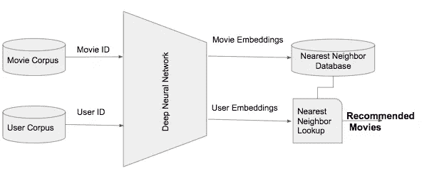
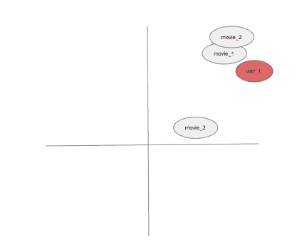
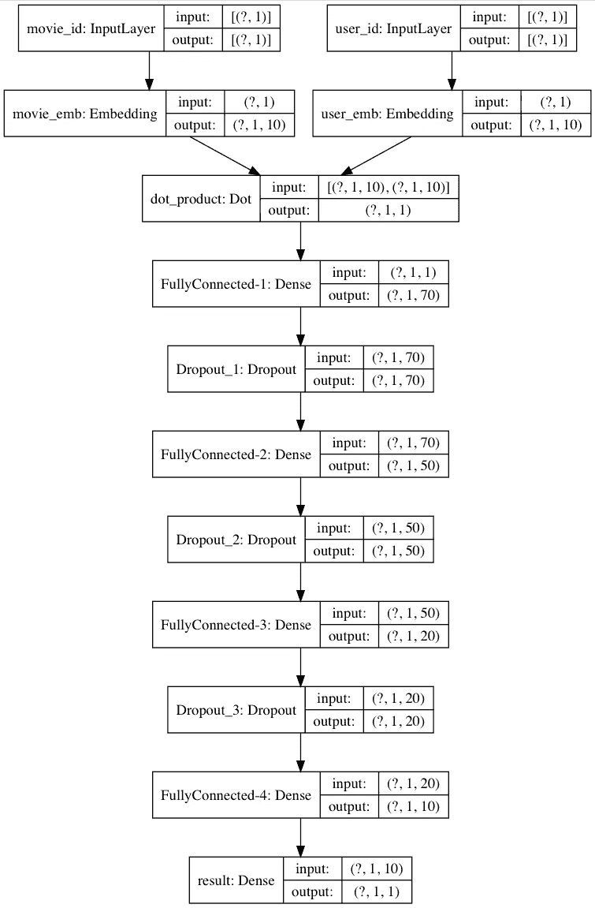
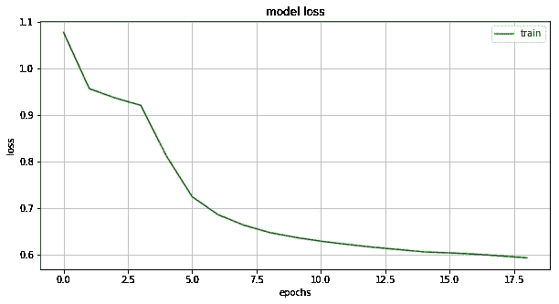
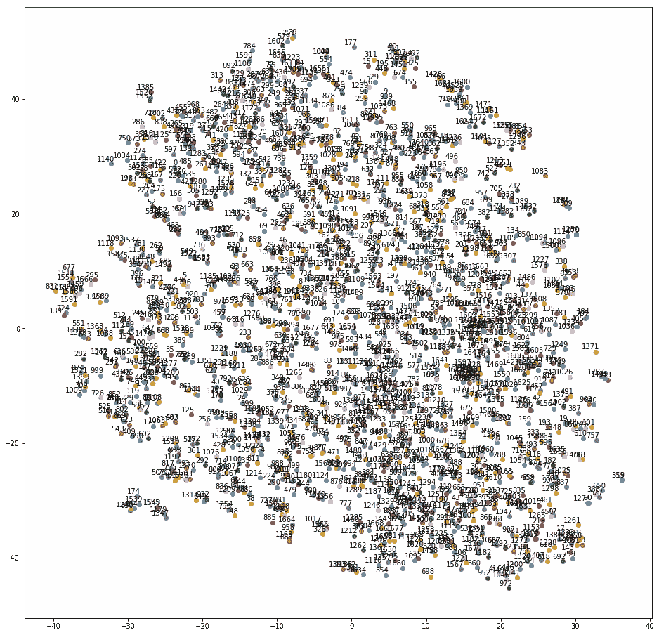
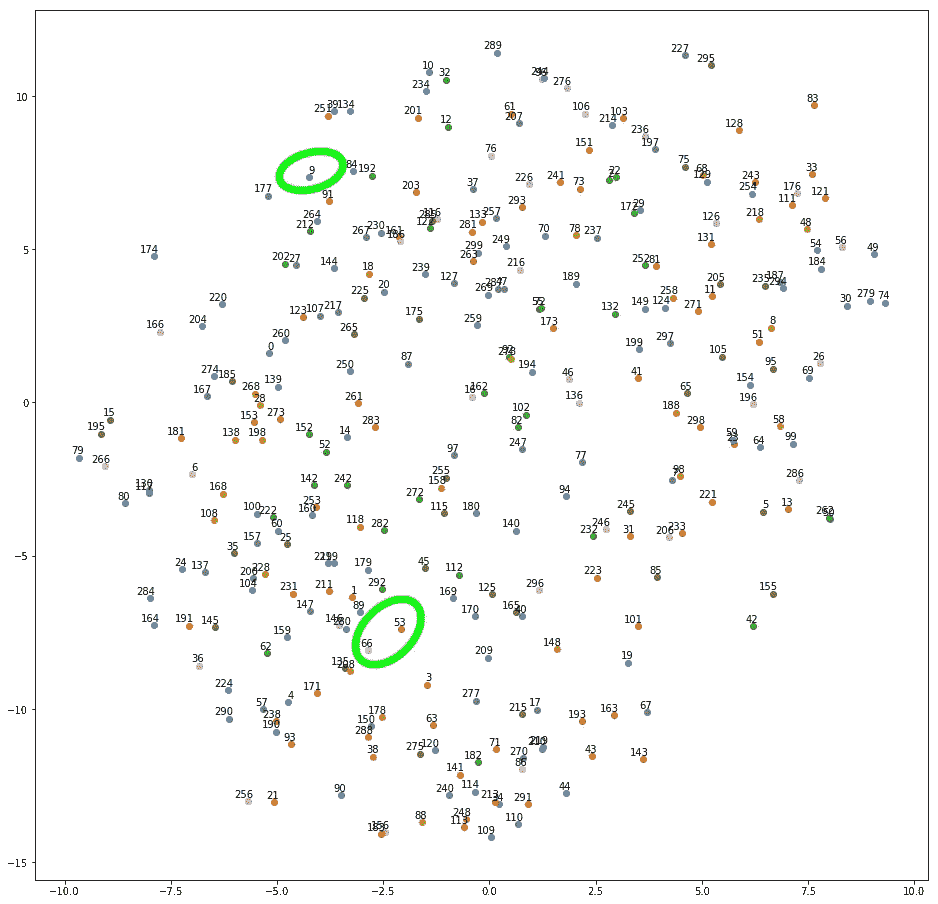
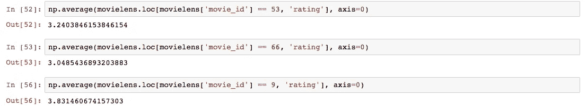
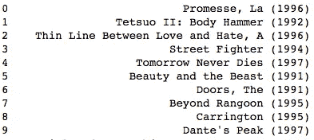

# 基于学习嵌入的推荐系统

> 原文：<https://towardsdatascience.com/recommender-systems-from-learned-embeddings-f1d12288f278?source=collection_archive---------7----------------------->

## 一种深度神经网络方法

推荐系统是现代消费者网络应用的基本构建模块，其寻求预测用户偏好。有不同的方法来建立推荐系统。我们对基于最近邻的方法特别感兴趣。我们研究一个项目的配对之间的相似性，并推荐给用户

在本文中，我们将在电影数据集上应用深度神经网络，向用户推荐电影。该系统将随着模型训练过程学习电影嵌入。我们将使用这些嵌入来创建最近邻数据库。每当用户点击一部电影，系统就会提取它的嵌入，找到最近邻的电影推荐给用户。


图片来自 Pixabay 的 Thomas Breher

如果你觉得这篇文章很有趣，请随时联系 LinkedIn。

# 一般建筑

该系统的整体架构如图 1 所示



图 1 —系统架构

我们将使用电影 ID 和用户 ID 来生成它们相应的嵌入。这些嵌入是通过模型训练过程与其他参数一起生成的。一旦我们有了嵌入，我们建立一个 K-最近邻(KNN)模型。那么每当有一个用户，我们就可以从我们的神经网络模型中得到那个用户的嵌入。我们使用这种嵌入在 KNN 数据库中查找并向该用户推荐 top-K 电影。

这里需要注意的一点是，这种方法无法处理未知用户。也就是说，如果用户 ID 在模型训练过程中不存在，我们将无法为该用户推荐电影。解决这个问题有不同的方法。例如基于人口统计或其他特征找到相似的用户，并基于此为新用户进行推荐。但是这种讨论超出了本文的范围。

在这篇文章中，我将使用 Keras (Tensorflow 2.0 作为后端)来构建我们的深度学习模型。

# 资料组

在这篇文章中，我们将使用 [MovieLens 100K](http://files.grouplens.org/datasets/movielens/ml-100k.zip) 数据集。数据集包含 100K 行和 34 列。各列如下所示。

```
'user_id', 'movie_id', 'rating', 'unix_timestamp', 'title', 'release_date', 'video_release_date', 'imdb_url', 'genre_unknown','Action', 'Adventure', 'Animation', 'Children', 'Comedy', 'Crime','Documentary', 'Drama', 'Fantasy', 'Film-Noir', 'Horror', 'Musical','Mystery', 'Romance', 'Sci-Fi', 'Thriller', 'War', 'Western', 'year','genre', 'all_genres', 'age', 'sex', 'occupation', 'zip_code'
```

我不会深入特性工程的细节，因为这超出了这篇文章的范围。数据集有 943 个唯一的`users`和 1682 个唯一的`movies`。我们将使用`user_id`和`movie_id`作为特征，使用`rating`作为基于嵌入模型的目标。

# 关于嵌入的注释

嵌入是实体的向量表示。你可以通过嵌入把任何离散的实体表示成一个连续的空间[2]。向量中的每一项代表该实体的一个特征或特征组合。

例如，您可以将电影和用户 id 表示为嵌入。为了简单起见，让我们假设这些嵌入是二维向量，如图 2 所示。我们将创建电影和用户嵌入，并用我们的神经网络训练它们。目标是将用户和电影放在一个相似的嵌入空间中，这样我们就可以应用基于最近邻的推荐。图 2 显示了一个假设的例子，其中`user_1`比`movie_3`更接近嵌入空间中的`movie_1`和`movie_2`。所以我们将推荐`movie_1`和`movie_2`到`user_1`。



图 2 —嵌入空间中的电影和用户

# 模型

记住上面的概念，让我们定义我们的模型。在本文中，我正在构建一个四层深度神经网络。您将定义`EMBEDDING_SIZE`为您想要嵌入的向量的维数。一般来说，更高的维度更好，因为这可以捕捉更多的特征，尽管这可能会增加训练时间。本例中`NUM_USERS`为`943`而`NUM_MOVIES`为`1682`。`ROW_COUNT`表示您的训练集的大小。

正如您在上面的代码中看到的，我们已经为电影(第 4 行)和用户(第 11 行)创建了一个嵌入层。对于一个机器学习工程师来说，了解 Keras 嵌入层是如何工作的是值得的[3][4]。`output_dim`表示嵌入向量的长度，在我们的例子中是`EMBEDDING_SIZE`。`input_dim`表示不同实体的数量——在本例中为`NUM_MOVIES`或`NUM_USERS`。`input_length`参数决定每个输入序列的大小。嵌入层根据`embedding_initializer`参数【3】初始化嵌入权重。如果您将这些嵌入层与网络一起训练，这些层的输出将得到更新。这就是我们模型中发生的情况。

我为`50`个时期训练模型，将`early_stopping`设置为在连续 10 个时期内验证损失不变。您可以根据自己的需要调整这些参数。

我们可以绘制模型来可视化它的架构

```
keras.utils.plot_model(model, show_shapes=True) 
```



图 3——可视化模型架构

我们可以绘制不同时期的损失曲线



图 4 —历元曲线上的损耗

图 4 示出了训练损失随着时期减少，这意味着训练收敛到最佳点。

您可以使用`movie_model.predict(numpy.array([id]))`从每个电影 ID 的`movie_model`中提取电影嵌入。

# 验证嵌入

你怎么知道这些嵌入是正确的呢？验证它们的一种方法是绘制嵌入图。一旦你画了图，你会看到有相似评级的电影(因为评级是我们的目标)就在嵌入空间附近。让我们看一看。



图 5 —电影嵌入的 t-SNE 图

图 5 有点难以想象。所以我打算绘制前 300 个电影嵌入，看看我是否能得到更清晰的图像。



图 6-电影 ID 300 之前电影嵌入的 t-SNE 图

例如，在图 6 中，电影 ID `53`和`66`在嵌入空间上比电影 ID `9`更接近。



图 7 —计算平均电影评级

如果您检查数据集的平均评分(图 7)，您会发现电影 ID `53`和`66`的平均评分分别为`3.24`和`3.04` ，而电影 ID `9`的平均评分为`3.83`。

# 使用 KNN 的最近邻居

现在我们有了嵌入，我们可以应用最近邻算法向用户推荐电影。我们可以从`user_id`中得到`user_embedding`，找出嵌入空间中与`user_embedding`接近的电影有哪些。为此，我们使用 K-最近邻算法。

这里推荐的 10 部电影列表如图 8 所示。



图 8 —推荐电影列表

这里需要注意的是，如果嵌入发生变化，推荐的电影列表可能会有所不同。嵌入可能会因运行而异。这主要是因为我们使用了一个较小的数据集(100K 行)。更大的数据集(1M+)以及更长的训练时间可能会输出更稳定的嵌入。

本文的完整代码可以在[这里](https://github.com/nahidalam/blog/blob/master/Recommender%20Systems%20from%20Learned%20Embedding.ipynb)找到。

# 参考:

1.  Youtube 深度神经网络推荐[此处](https://static.googleusercontent.com/media/research.google.com/en//pubs/archive/45530.pdf)
2.  m .库拉(2015 年)。[用户和项目冷启动推荐的元数据嵌入](https://arxiv.org/pdf/1507.08439.pdf)。arXiv:1507.08439。
3.  Keras 嵌入层【https://keras.io/api/layers/core_layers/embedding/ 
4.  Keras 嵌入层如何工作[https://stats . stack exchange . com/questions/270546/how-does-Keras-Embedding-layer-work](https://stats.stackexchange.com/questions/270546/how-does-keras-embedding-layer-work)
5.  [https://drop . engineering/building-a-recommenders-system-using-embeddings-de 5a 30 e 655 aa](https://drop.engineering/building-a-recommender-system-using-embeddings-de5a30e655aa)
6.  [https://www . ka ggle . com/willkoehrsen/Neural-Network-Embedding-recommendation-system # Neural-Network-Embedding-Model](https://www.kaggle.com/willkoehrsen/neural-network-embedding-recommendation-system#Neural-Network-Embedding-Model)