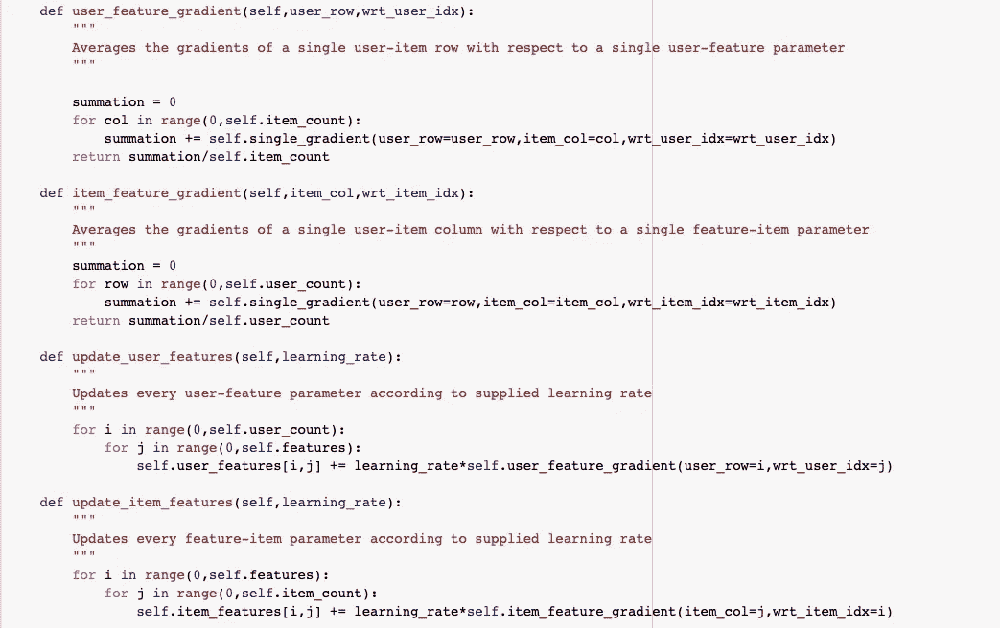

# Python:从头开始实现矩阵分解！

> 原文：<https://towardsdatascience.com/recommender-systems-in-python-from-scratch-643c8fc4f704?source=collection_archive---------2----------------------->

## 基于梯度下降的矩阵分解模型在推荐系统中的应用

信用:Pixabay

你有没有想过网飞是如何确定你可能喜欢什么内容，或者亚马逊是如何让你注意到你可能会购买的产品的？或者，如果你正在阅读这篇文章，你可能非常清楚这些系统的存在，但不确定它们是如何运作的。

## 基于内容的过滤与协同过滤

一般来说，推荐系统有两种主要的方法:基于内容的和协作的。当然，有混合的方法，并且据称，也存在基于知识的系统。见下图:[https://pdfs . semantic scholar . org/7e 41/3d 5661 f 185 B4 f 19825 da 9220535 cc 04388 AE . pdf](https://pdfs.semanticscholar.org/7e41/3d5661f185b4f19825da9220535cc04388ae.pdf)

没有任何不必要的麻烦，基于内容意味着根据内容与其他内容的相似性向你推荐内容*，而不考虑其他用户的偏好*。协作是相反的，它不关心项目的非抽象特征，而是利用群体的智慧来产生推荐。前者的一个例子就是潘多拉的推荐系统。他们(煞费苦心地)精心制作了大约 400 个特征的音乐基因组。并且根据歌曲展现这些特征的程度向用户推荐歌曲。(想想流派，歌曲长度，艺人年龄，艺人种族等。)协作过滤发现用户项目偏好中的模式，并利用这些模式来生成推荐。对于本文，我们将只关注协同过滤。

在协作过滤生态系统中，有许多选项可用。例如，奇异值分解(SVD)是第一种这样的技术，它(顾名思义)将用户项目偏好矩阵分解为三个元素:用户特征特征向量、特征项目特征向量和特征值的对角矩阵。将用户条目矩阵分解成潜在特征是非常有用的。用户被理解为他们*更喜欢*的潜在特征，而项目被理解为潜在特征和它们*呈现的程度*。换句话说，距离度量，例如余弦相似性，可以用于将用户直接与项目进行比较，并生成最佳匹配。当然，您可以将用户与用户进行比较，将项目与项目进行比较，但是 SVD 要强大得多！

另一种方法是基于梯度下降的矩阵分解，我们将在本文的剩余部分重点介绍这种方法。这里的核心思想是创建参数并迭代更新它们，以最小化某个成本函数。如果这听起来像是神经网络——你就在正确的轨道上；我们朝那个方向去了！**注意**:基于深度学习的方法*确实*存在；然而，我们不会使用神经元或非线性，我们肯定不会将多层神经元链接在一起(*又名深度学习。*)

让我们开始考虑我们将如何处理这个问题，从理解我们的参数、矩阵乘法以及我们如何迭代地更新这些参数开始。让我们考虑下面的情况:

用户特征行和特征项目列的点积是单个用户项目评级

请注意，用户特征矩阵和特征项目矩阵中的每个单元都是一个参数。(在神经网络行话中称为权重)我们需要通过一些成本函数迭代更新这些参数。但是在我们深入研究之前，我们需要知道任何给定的用户特征单元和特征项单元所贡献的*用户项*单元。比如`U1F1`、`U1F2`贡献`U1I1`、`U1I2`、`U1I3`。矩阵乘法被执行为左矩阵的*行*与右矩阵的*列*的点积。正如您将看到的，用户条目矩阵的行和列索引决定了从分解的矩阵中选择的整个*行和列。*

用户特征单元和它们参与的用户项目单元

让我们考虑另一个例子。请注意，我已经提醒您注意的用户项单元格形成了一个单独的列，*而不是一行*。这是因为单元格`F1I1`和`F2I2`构成了用户项矩阵中的三个不同的单元格。

要素项单元及其所在的用户项单元

如果这还不明显，我们需要更新我们的用户特征和特征项参数，但重要的是要注意— *每个参数将由三个不同梯度的平均值更新，每个梯度都与给定的参数相关。*

下面的例子显示了更新`U1F1`所需的三个梯度中的一个；注意另外两个梯度`U1I2`和`U1I3`，每个(当然)相对于`U1F1`。当我们更新`U1F1`时，我们将对这三个梯度进行平均。这里的直觉是，如果一次追逐一个梯度，我们*可能*永远不会收敛到最佳参数值。通过平均梯度，我们可以同时采取三个步骤来达到最佳决策。

U1I1 的 MSE 和相对于 U1F1 的梯度

信不信由你——我们现在已经拥有了用 python 编写矩阵分解求解器所需的所有构件！让我们看看代码。我在下面附上了一个 Google Colab 笔记本，你可以在那里看到并运行代码来试验结果！我们将在类架构中逐个方法地剖析代码。

 [## 谷歌联合实验室

### 矩阵分解从零开始 colab.research.google.com](https://colab.research.google.com/drive/1X0cFGeY2y8D2OLK4VB8frHkVxCMaBS1s?authuser=1#scrollTo=H5mPYAKPIyfu) 

首先，让我们创建一个类对象并初始化它的特性。我已经做出了设计决定，将参数初始化为 0.1 到 0.9 之间的默认值。此外，我们将如前所述定义 MSE 函数。

第二，让我们找到一个*单一的*梯度。如前所述，这是相对于一个用户特征单元(或一个特征项单元)的一个用户项单元。

但是正如我们已经讨论过的，仅仅找到一个梯度是不够的。在更新给定参数时，我们必须考虑整行(或整列)。

最后，我们需要定义一个训练模型的方法。默认情况下，我们将学习率设置为 0.1，迭代次数设置为 1000 次。这可以在上面提到的 Google Colab 中修改。您会注意到，在每次迭代中，项目特征值都增加了*。梯度不是负的吗？*是的！但在梯度下降中，使用符号* `w -= learning_rate * gradient`是标准的。在我们的例子中，双重否定完全抵消了。*

**

*现在，让我们验证我们的代码是否有效！正如你所看到的，只有两个潜在的特征，我们离最优解只有这么近。误差不会减小到超过 3.54。*

**

*然而，如果我们再增加一个潜在的特征，我们可以非常接近 0 误差。事实上，当我们将矩阵用户特征和特征项相乘时，我们得到了我们开始时的矩阵。是不是很美！*

**

*我希望你喜欢今天的文章。如果你想看到更多这样的内容，请在下面评论！*