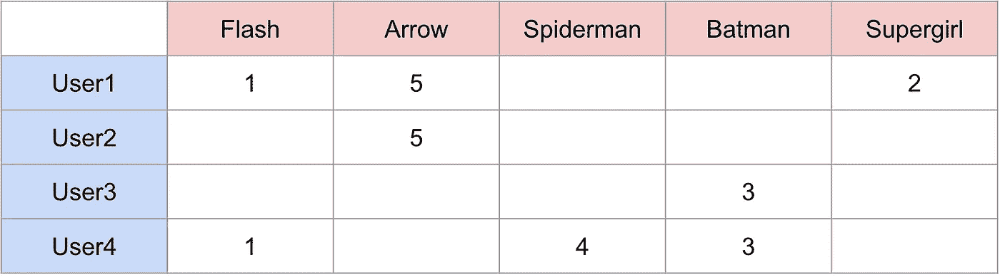
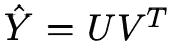
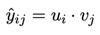
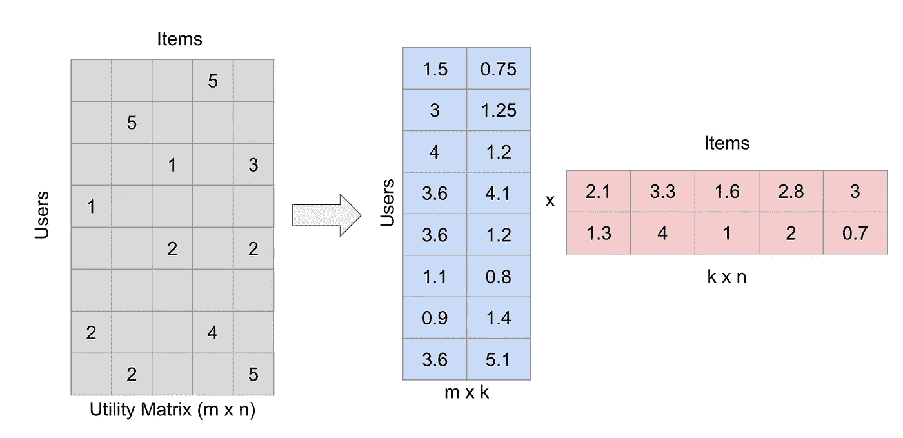
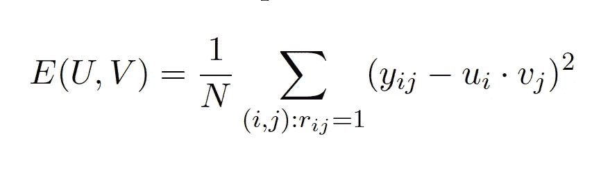
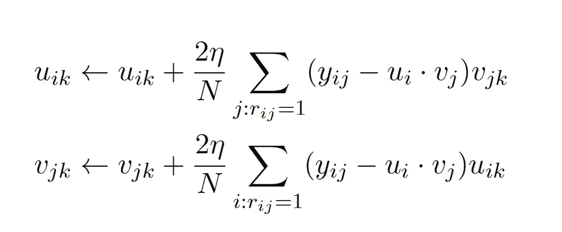
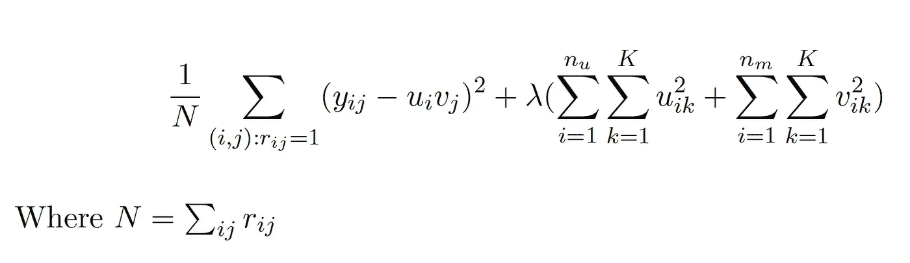

# 推荐系统:从零开始的矩阵分解

> 原文：<https://towardsdatascience.com/recommender-systems-matrix-factorization-using-pytorch-bd52f46aa199?source=collection_archive---------8----------------------->

## 预测动漫收视率

[来源](https://pixabay.com/illustrations/chibi-kids-sports-chibi-boy-ball-4156788/)

我们每天都会遇到多次推荐——在决定在网飞/Youtube 上看什么的时候，购物网站上的商品推荐，Spotify 上的歌曲推荐，Instagram 上的朋友推荐，LinkedIn 上的工作推荐……不胜枚举！推荐系统旨在预测用户对某个项目的“评分”或“偏好”。这些评级用于确定用户可能喜欢什么，并给出明智的建议。

有两大类推荐系统:

1.  **基于内容的系统**:这些系统试图根据物品的内容(类型、颜色等)和用户的个人资料(喜欢、不喜欢、人口统计信息等)来匹配用户和物品。例如，Youtube 可能会基于我是一名厨师和/或我过去看过很多烘焙视频的事实，建议我制作视频，从而利用它所拥有的关于视频内容和我的个人资料的信息。
2.  **协同过滤**:他们依赖于相似用户喜欢相似物品的假设。用户和/或项目之间的相似性度量被用来进行推荐。

本文讨论了一种非常流行的协作过滤技术，称为矩阵分解。

# 矩阵分解

推荐系统有两个实体——用户和项目。假设我们有`m`个用户和`n`个项目。我们推荐系统的目标是建立一个`mxn`矩阵(称为**效用矩阵**)，它由每个用户-项目对的评级(或偏好)组成。最初，这个矩阵通常非常稀疏，因为我们只有有限数量的用户-项目对的评级。

这里有一个例子。假设我们有 4 个用户和 5 个超级英雄，我们试图预测每个用户给每个超级英雄的评分。这是我们的效用矩阵最初的样子:

超级英雄评级的 4x5 效用矩阵(图片由作者提供)

现在，我们的目标是通过找到用户和项目之间的相似性来填充这个矩阵。举例来说，为了获得直觉，我们看到用户 3 和用户 4 给蝙蝠侠的评分相同，所以我们可以假设用户是相似的，他们对蜘蛛侠有相同的感觉，并预测用户 3 会给蜘蛛侠 4 分。然而，在实践中，这并不简单，因为有多个用户与许多不同的项目进行交互。

在实践中，通过将效用矩阵分解(或因式分解)成两个瘦高矩阵来填充矩阵。分解公式如下:

效用矩阵可以分解为两个低维的瘦高矩阵的乘积，这两个矩阵分别代表用户和项目

其中 U 为`m x k`，V 为`n x k`。u 是用户在某个低维空间的表示，V 是物品的表示。对于用户 I，uᵢ给出该用户的表示，对于物品 e，vₑ给出该物品的表示。用户-项目对的评级预测简单来说就是:

用户-项目对的评级预测只是用户和项目表示的点积

矩阵分解(为便于说明，数字是随机的)(图片由作者提供)

# 履行

为了实现矩阵分解，我们可以使用用户和项目嵌入矩阵的嵌入，并使用梯度下降来获得最佳分解。如果您对嵌入不熟悉，您可以查看这篇文章，在这篇文章中我详细讨论了它们:

 [## 使用 PyTorch 对表格数据进行深度学习

### 关于多类分类问题

towardsdatascience.com](/deep-learning-for-tabular-data-using-pytorch-1807f2858320) 

## 密码

我在本文中使用的所有代码都可以在这里找到:[https://jovian . ml/aakanksha-ns/anime-ratings-matrix-factorization](https://jovian.ml/aakanksha-ns/anime-ratings-matrix-factorization)

## 资料组

我使用了 Kaggle 的动漫推荐数据集:

 [## 动漫推荐数据库

### 来自 myanimelist.net 76，000 名用户的推荐数据

www.kaggle.com](https://www.kaggle.com/CooperUnion/anime-recommendations-database) 

我们总共有 69600 个用户和 9927 部动漫。提供了 6337241 个评级(在 690，919，200 个可能的评级中)。

## 问题陈述

给定一组动漫的用户评分，预测每对用户动漫的评分。

## 数据探索

我们看到有许多评级为`-1`的行，表示缺少评级，我们可以去掉这些行。

我们也可以看看收视率的分布和每个用户的收视率。

## 预处理

我们需要连续的 id，以便能够索引到嵌入矩阵中，并访问每个用户/项目嵌入。

## 培养

我们的目标是为每个用户和每个项目找到最佳嵌入。然后，我们可以使用这些嵌入，通过取用户嵌入和项目嵌入的点积，对任何用户-项目对进行预测

**成本函数:**我们试图最小化效用矩阵的均方误差。这里 N 是效用矩阵中非空白元素的数量。

矩阵分解的代价函数

使用项目和用户嵌入的预测

均方误差(mean square error)

**初始化用户和项目嵌入**:有很多方法可以初始化嵌入权重，这是一个活跃的研究领域，例如， [fastai](https://www.fast.ai/) 使用了一种叫做[的截断法线初始化器](https://discuss.pytorch.org/t/implementing-truncated-normal-initializer/4778)。在我的实现中，我刚刚在(0，11/K)中用统一的值初始化了我的嵌入(随机地，在我的例子中工作得很好！)其中 K 是嵌入矩阵中因子的数量。k 是一个通常由经验决定的超参数，它不应该太小，因为你希望你的嵌入学习足够的特征，但你也不希望它太大，因为它会开始过度适应你的训练数据并增加计算时间。

**创建稀疏效用矩阵:**因为我们的成本函数需要效用矩阵，所以我们需要一个函数来创建这个矩阵。

**梯度下降**:

梯度下降方程为:

我在我的实现中使用了动量，这是一种有助于在相关方向上加速梯度下降并抑制振荡从而导致更快收敛的方法。我还添加了正则化，以确保我的模型不会过度适应训练数据。因此，我的代码中的梯度下降方程比上面提到的稍微复杂一些。

正则化的成本函数是:

培养

## 验证集预测

因为我们不能对我们在训练集中没有遇到的用户和动画(冷启动问题)进行预测，所以我们需要将它们从我们看不见的数据集中移除。

我们的模型稍微过度拟合了训练数据，因此可以增加正则化因子(λ)以使其更好地泛化。

让我们来看几个预测:

鉴于这些评级仅仅基于用户行为之间的相似性，在 1-10 的评级范围内，均方根值仅为 3.4 就已经非常令人印象深刻了。它展示了矩阵分解是多么强大，尽管它是如此简单。

# 矩阵分解的局限性

矩阵分解是一种非常简单方便的推荐方法。然而，它也有缺陷，其中一个缺陷我们已经在实施中遇到过:

## 冷启动问题

我们无法预测在训练数据中从未遇到过的项目和用户，因为我们没有它们的嵌入。

冷启动问题可以通过多种方式解决，包括推荐受欢迎的项目，要求用户对一些项目进行评级，使用基于内容的方法，直到我们有足够的数据来使用协同过滤。

## 很难包含关于用户/项目的附加上下文

我们只使用用户 id 和项目 id 来创建嵌入。在我们的实施过程中，我们无法使用任何其他关于我们的用户和项目的信息。有一些基于内容的协作过滤的复杂混合模型可以用来解决这个问题。

## 评级并不总是可用

很难得到用户的反馈。大多数用户只有在他们真的喜欢某样东西或者绝对讨厌它的时候才会给它打分。在这种情况下，我们经常需要想出一种方法来测量隐式反馈，并使用负采样技术来得出一个合理的训练集。

# 结论

推荐系统确实很有趣，但也很容易变得太复杂，尤其是当在有数百万用户和数百万项目的规模上实现时。如果你想更深入地了解推荐系统，可以看看各种案例研究 Youtube 如何推荐视频、LinkedIn 工作推荐、广告排名。通常，你可以找到与这些案例研究相对应的研究论文/视频/工程博客。以下是一些有用的资源:

*   [https://engineering . LinkedIn . com/blog/2019/04/ai-behind-LinkedIn-recruiter-search-and-recommendation-systems](https://engineering.linkedin.com/blog/2019/04/ai-behind-linkedin-recruiter-search-and-recommendation-systems)
*   [https://static . Google user content . com/media/research . Google . com/en//pubs/archive/45530 . pdf](https://static.googleusercontent.com/media/research.google.com/en//pubs/archive/45530.pdf)
*   [https://labs . Pinterest . com/user/themes/pin _ labs/assets/paper/P2P-www 17 . pdf](https://labs.pinterest.com/user/themes/pin_labs/assets/paper/p2p-www17.pdf)

# 参考

*   [https://developers . Google . com/machine-learning/recommendation/collaborative/matrix](https://developers.google.com/machine-learning/recommendation/collaborative/matrix)
*   [https://medium . com/@ pari tosh _ 30025/re commendation-using-matrix-factorization-5223 A8 E1 F4](https://medium.com/@paritosh_30025/recommendation-using-matrix-factorization-5223a8ee1f4)
*   旧金山大学 MSDS 分校—高级机器学习课程
*   [https://www.youtube.com/watch?v=ZspR5PZemcs](https://www.youtube.com/watch?v=ZspR5PZemcs)