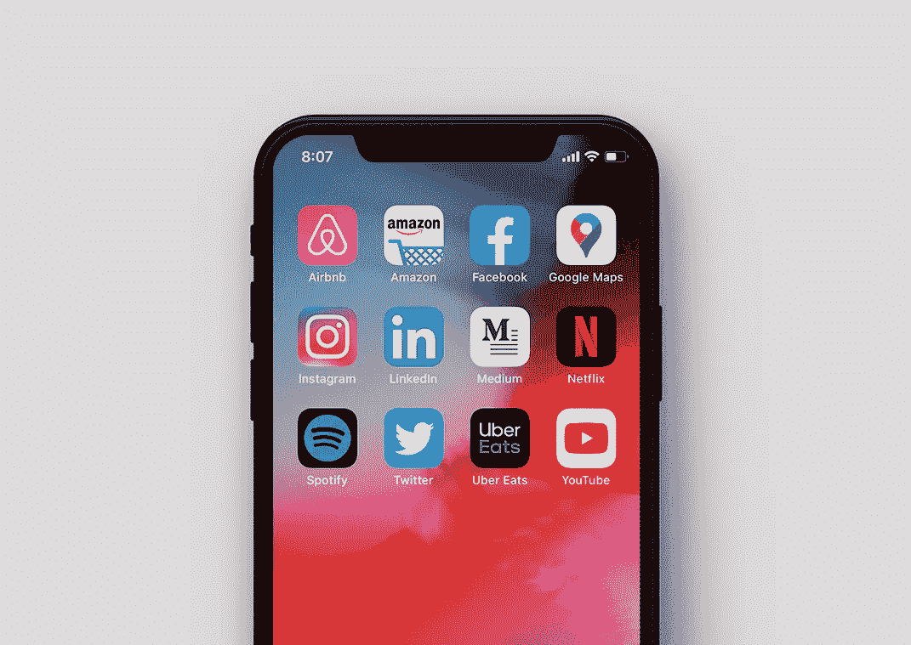
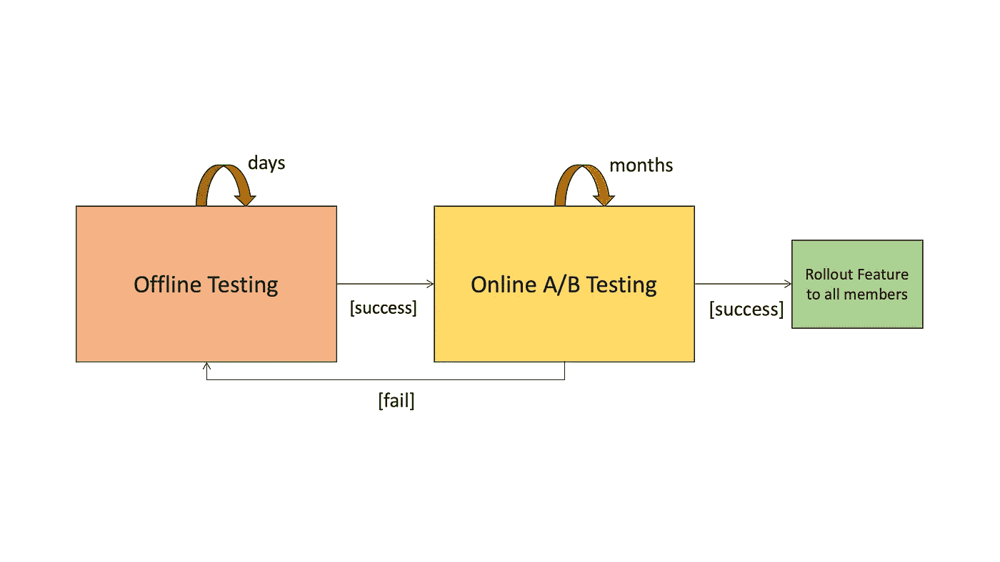
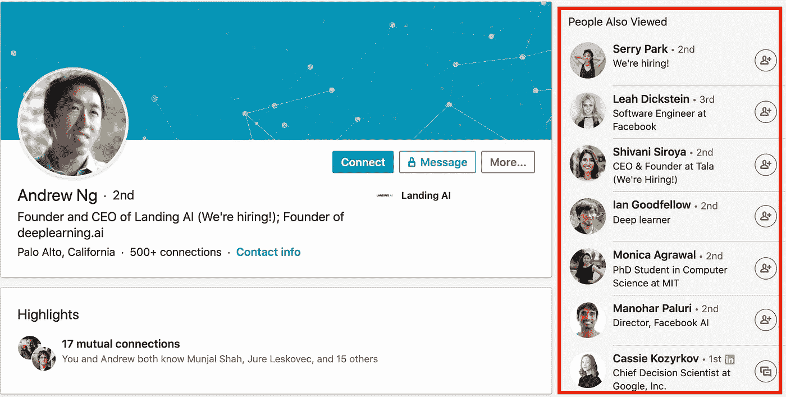
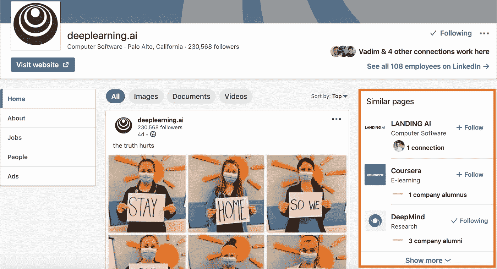
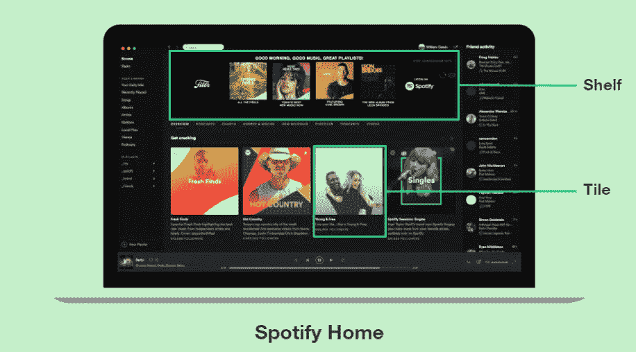
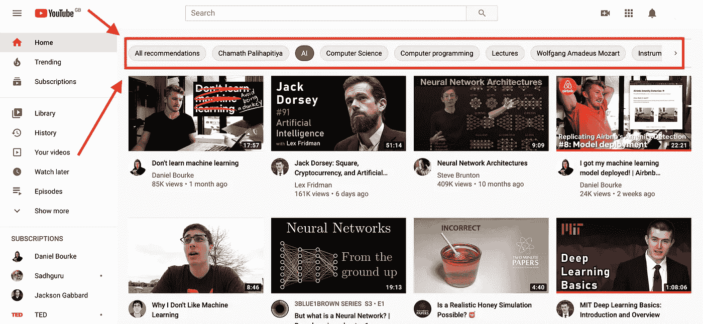

# 推荐系统:机器学习最有价值的应用(下)

> 原文：<https://towardsdatascience.com/recommender-systems-the-most-valuable-application-of-machine-learning-2bc6903c63ce?source=collection_archive---------25----------------------->

## 为什么推荐系统是机器学习最有价值的应用，以及机器学习驱动的推荐器如何已经驱动了我们生活的几乎每个方面。

推荐系统已经驱动了我们日常生活的几乎每个方面。

这是 5 月 11 日发表的文章的第二部分。在第一部分中，我介绍了:

*   商业价值
*   问题定式化
*   数据
*   算法

 [## 推荐系统:机器学习最有价值的应用(上)

### 为什么推荐系统是机器学习最有价值的应用，以及成功的科技公司如何使用…

towardsdatascience.com](/recommender-systems-the-most-valuable-application-of-machine-learning-part-1-f96ecbc4b7f5) 

在第二部分中，我将讨论以下主题:

*   评估指标
*   用户界面
*   冷启动问题
*   探索与开发
*   推荐系统的未来

在整篇文章中，我将继续使用在过去几年中建立了最广泛使用的系统的公司的例子，包括 Airbnb、亚马逊、Instagram、LinkedIn、网飞、Spotify、Uber Eats 和 YouTube。

# 评估指标

现在我们有了推荐系统的算法，我们需要找到一种方法来评估它的性能。与每个机器学习模型一样，有两种类型的评估:

1.  离线评估
2.  在线评估

离线/在线测试框架

一般来说，我们可以将离线评估指标视为*低级*指标，通常很容易测量。最著名的例子是网飞选择使用*均方根误差* (RMSE)作为 Netflix 奖挑战的代理指标。在线评估指标是*的高层次*业务指标，只有当我们将模型投放到现实世界并与真实用户一起测试时，这些指标才是可衡量的。一些例子包括客户保持率、点击率或用户参与度。

## 离线评估

由于大多数现有的推荐系统包括两个阶段(候选生成和排序)，我们需要为每个阶段选择正确的度量。对于候选生成阶段，[例如，YouTube](https://static.googleusercontent.com/media/research.google.com/en//pubs/archive/45530.pdf) 关注**高精度**因此*“在所有预选的视频中，有多少是相关的”*。这是有意义的，因为在第一阶段，我们希望过滤一个较小的视频集，同时确保所有视频都与用户潜在相关。在第二阶段，在列表中呈现几个“最佳”推荐需要精细的表示，以区分具有**高回忆的候选人** ( *“我们找到了多少相关视频】* ) **)。**

通常，大多数例子都使用机器学习社区中使用的标准评估指标:从标准化折扣累积增益、平均倒数排名或和谐对的分数等排名措施，到包括准确度、精确度、召回率或 F 分数在内的分类指标。

[Instagram 制定了](https://ai.facebook.com/blog/powered-by-ai-instagrams-explore-recommender-system/)他们最终通过模型的优化函数略有不同:

> 我们预测人们在每个媒体上采取的个人行动，无论是积极的行动，如喜欢和保存，还是消极的行动，如“少看这样的帖子”(SFPLT)。我们使用多任务多标签(MTML)神经网络来预测这些事件。

尽管离线实验很吸引人，但它们有一个重大缺陷:它们假设，如果被评估的新算法被用来生成推荐，成员们会以同样的方式行事，比如播放同样的视频。这就是为什么我们需要在线评估来衡量我们的模型对更高层次的业务指标的实际影响。

## 在线评估

这里需要注意的方法是 A/B 测试。有许多有趣而详尽的文章/ [课程](https://www.udacity.com/course/ab-testing--ud257)很好地涵盖了这一点，因此我不会在这上面花太多时间。我遇到的唯一一个微小的变化是网飞的“消费者数据科学”，你可以[在这里](https://netflixtechblog.com/how-we-determine-product-success-980f81f0047e)读到它。

公司在这里衡量的最流行的高级指标是*点击率*和*参与度*。Uber Eats 在这里走得更远，设计了一个多目标权衡，即[捕捉多个高级指标](https://eng.uber.com/uber-eats-recommending-marketplace/)来说明他们三方市场的整体健康状况(其中包括:市场公平性、总预订量、可靠性、食客满意度)。除了中期参与外，网飞还关注会员保留率，因为他们的在线测试可以[持续 2-6 个月](https://dl.acm.org/doi/pdf/10.1145/2843948)。

众所周知，YouTube 优先考虑观看时间，而不是点击率。他们甚至写了一篇文章，解释为什么:

> 通过点击率排名通常会促进用户没有完成的欺骗性视频(“点击诱饵”)，而观看时间更好地捕捉参与度

## 评估嵌入

如算法部分所述，嵌入是候选生成阶段的关键部分。然而，与分类或回归模型不同，众所周知很难测量嵌入的质量，因为它们经常在不同的环境中使用。我们可以执行的健全性检查是将高维嵌入向量映射到较低维的表示中(通过 PCA、t-SNE 或 UMAP ),或者应用 k-means 等聚类技术，然后可视化结果。Airbnb 通过他们的[房源嵌入](https://medium.com/airbnb-engineering/listing-embeddings-for-similar-listing-recommendations-and-real-time-personalization-in-search-601172f7603e)做到了这一点，以确认来自相似地点的房源被聚集在一起。

# 用户界面

对于机器学习工程师或数据科学家来说，等式中最容易被忽略的方面是用户界面。问题是，如果您的 UI 不包含展示推荐所需的组件，或者在错误的上下文中展示它们，那么反馈循环就存在固有的缺陷。

我们以 Linkedin 为例来说明这一点。如果我在浏览人们的个人资料，我会在屏幕的右边看到对*相似的人*的推荐。当我浏览公司时，我看到了对*类似公司*的推荐。这些推荐符合我当前的目标和背景，鼓励我继续浏览网站。如果*相似公司*的推荐会出现在一个人的个人资料上，我可能不太愿意点击他们的个人资料，因为这不是我目前正在寻找的。

Linkedin 上类似的用户推荐

Linkedin 上类似公司的推荐

你可以建立世界上最好的推荐系统，但是，如果你的界面不是为满足用户的需求而设计的，没有人会欣赏你的推荐。事实上，用户界面的挑战是如此重要，以至于[网飞将他们网站上的所有组件都变成了动态组件](https://netflixtechblog.com/learning-a-personalized-homepage-aa8ec670359a)，由机器学习算法组装起来，以最好地反映用户的目标。

Spotify 遵循了这一模式，而[在主屏幕设计上也采用了类似的布局](https://labs.spotify.com/2020/01/16/for-your-ears-only-personalizing-spotify-home-with-machine-learning/)，如下图所示。

用机器学习个性化 Spotify Home(来源: [Spotify](https://www.oreilly.com/radar/personalization-of-spotify-home-and-tensorflow/)

这是一个仍在进行大量实验的领域。例如，YouTube 最近改变了他们的主页界面，使用户能够缩小不同主题的推荐范围:

新的 YouTube 主页

# 冷启动问题

[冷启动问题](https://en.wikipedia.org/wiki/Cold_start_%28computing%29)在推荐系统中经常出现，因为像协同过滤这样的方法严重依赖于过去的用户-项目交互。企业面临的冷启动问题有两种方式:用户冷启动和物品冷启动。根据平台的类型，这两种方式中的任何一种都更流行。

## 用户冷启动

想象一下，一个新成员注册了网飞。此时，公司对新成员的偏好一无所知。该公司如何通过提供出色的推荐来留住她？

在网飞的情况下，新会员可以获得一个月的免费试用期，在此期间取消率最高，但之后会迅速下降。这就是为什么冷启动问题的任何改善都会为网飞带来巨大的商机，从而在最初的 30 天里增加参与度和保留率。如今，他们的成员在注册过程中会接受一项调查，在此期间，他们会被要求从一组算法填充的视频中选择视频，然后作为他们所有算法的输入。

## 项目冷启动

当新项目或内容添加到目录中时，公司会面临类似的挑战。像网飞或 Prime Video 这样的平台拥有一个现有的媒体项目目录，这些目录很少改变(制作电影或连续剧需要时间！)，因此他们很少为此而挣扎。相反，在 Airbnb 或 Zillow 上，每天都有新的房源被创建，在这一点上，它们没有嵌入，因为它们在培训过程中不存在。Airbnb 通过以下方式解决这一问题:

> 为了创建新列表的嵌入，我们找到 3 个地理上最接近的列表，它们确实有嵌入，并且与新列表具有相同的列表类型和价格范围，并计算它们的平均向量。

对于 Zillow 来说，这一点尤为重要，因为一些新房房源可能只会在网站上呆几天。他们[通过创建从内容空间到嵌入空间的基于神经网络的映射函数，创造性地解决了这个问题](https://www.zillow.com/tech/embedding-similar-home-recommendation/)，该映射函数在学习阶段由来自用户的参与度数据指导。这允许他们仅仅通过使用其特征就可以将新的住宅列表映射到所学习的嵌入空间。

# 探索与开发

探索/开发的概念可以被看作是新内容与成熟内容之间的平衡。我本来打算自己来阐述这个概念，但我发现了一段很棒的摘录，这段摘录恰到好处:

> “想象你刚刚走进一家冰淇淋店。你现在面临着一个至关重要的决定——在大约 30 种口味中，你只需要选择一种！你可以选择两种策略:要么选择你最喜欢的口味，你已经知道那是最好的；或者探索你从未尝试过的新口味，也许会发现一种新的最佳口味。
> 这两种策略——开发和探索——也可以在推荐内容时使用。我们可以利用具有高确定性的高点击率的项目——可能是因为这些项目已经向类似用户显示了数千次，或者我们可以探索过去没有向许多用户显示的新项目。将探索融入到你的推荐策略中至关重要——没有探索，新商品就没有机会与更老、更熟悉的商品竞争。”

*(来源:* [*推荐系统:利用不确定性探索未知*](https://anotherdatum.com/exploration-exploitation.html) *)*

这种权衡是典型的强化学习问题，常用的方法是多臂 bandit 算法。Spotify 使用它来个性化每个用户的主页，Uber Eats 也使用它来提供针对三方市场优化的个性化推荐。网飞大学的两位科学家做了一个精彩的演讲，讲述了他们如何使用 MAB 电影推荐框架。

虽然我应该提到，这绝不是这个问题的最终解决方案，但它似乎对网飞、Spotify 和 Uber Eats 都有效，对吗？

是的。但是！

网飞大约有 1.6 亿用户和 6000 部电影/节目。Spotify 拥有约 2.3 亿用户和 5000 万首歌曲+ 50 万个播客。

Twitter 的 3.3 亿活跃用户每天产生超过 ***5 亿条推文*** (每分钟 35 万条推文，每秒 6.000 条推文)。还有 YouTube，它的 ***每分钟上传 300 小时的视频*** ！

后两种情况下的探索空间比网飞或 Uber Eats 的情况大一点点，这使得问题更具挑战性。

# 推荐系统的未来

这是我对推荐系统的小调查的结尾。正如我们所观察到的，推荐系统已经指导了我们生活的许多方面。我们在这两篇文章中讨论的所有算法每天都在争夺我们的注意力。毕竟，他们都在最大限度地利用他们平台上的时间。正如我在评估方法一节中所述，大多数算法都是针对点击率、参与度或 YouTube 的观看时间进行优化的。

作为消费者，这对我们意味着什么？

这意味着，我们不再能控制我们的欲望。虽然这听起来很有诗意，但是仔细想想。我们来看看 YouTube 来到现场时，我们都有目标。我们可能想听音乐，看一些有趣的东西，或者学习一些新的东西。但是所有推荐给我们的内容(无论是通过主页推荐，搜索排名，还是观看下一集)都经过了优化，可以让我们在网站上停留更长时间。

Lex Fridman 和 Franç ois Chollet 在人工智能播客上就这个进行了一次[的精彩对话。如果公司让用户负责选择他们自己的目标函数，而不是选择优化的指标，会怎么样？如果他们将用户档案的个人目标考虑在内，并问用户，你想达到什么目标呢？现在，这项技术几乎就像我们的老板，我们无法控制它。利用推荐系统的力量，使其更像一个导师、教练或助手，这难道不可思议吗？](https://www.youtube.com/watch?v=Bo8MY4JpiXE)

想象一下，作为一名消费者，你可以要求 YouTube 优化内容，以最大限度地提高学习效果。技术当然已经存在了。真正的挑战在于将它与现有的业务模型结合起来，并设计合适的界面，使用户能够做出选择，并随着目标的发展而改变。有了新的界面，YouTube 可能已经在这个方向上迈出了一小步，让用户负责选择她希望看到推荐的类别。但这仅仅是开始。

这是未来的发展方向，还是仅仅是消费者的梦想？

***资源***

[Fran ois Chollet:Keras、深度学习和人工智能的进展|人工智能播客](https://www.youtube.com/watch?v=Bo8MY4JpiXE)

[Airbnb —在搜索排名中列出嵌入内容](https://medium.com/airbnb-engineering/listing-embeddings-for-similar-listing-recommendations-and-real-time-personalization-in-search-601172f7603e)

[Airbnb——基于机器学习的 Airbnb 体验搜索排名](https://medium.com/airbnb-engineering/machine-learning-powered-search-ranking-of-airbnb-experiences-110b4b1a0789)

【亚马逊-Amazon.com 推荐商品对商品协同过滤】T2

[亚马逊——亚马逊推荐算法的历史](https://www.amazon.science/the-history-of-amazons-recommendation-algorithm)

[Instagram——由人工智能支持:insta gram 的探索推荐系统](https://ai.facebook.com/blog/powered-by-ai-instagrams-explore-recommender-system/)

[LinkedIn——浏览器地图:LinkedIn 上的协作过滤](https://ls13-www.cs.tu-dortmund.de/homepage/rsweb2014/papers/rsweb2014_submission_3.pdf)

[网飞—网飞推荐:超越五星(上)](https://netflixtechblog.com/netflix-recommendations-beyond-the-5-stars-part-1-55838468f429)

[网飞—网飞推荐:超越五星(下)](https://netflixtechblog.com/netflix-recommendations-beyond-the-5-stars-part-2-d9b96aa399f5)

[网飞——网飞推荐系统:算法、商业价值和创新](https://dl.acm.org/doi/pdf/10.1145/2843948)

[网飞——学习个性化主页](https://netflixtechblog.com/learning-a-personalized-homepage-aa8ec670359a)

[潘多拉——潘多拉的音乐推荐者](https://pdfs.semanticscholar.org/f635/6c70452b3f56dc1ae07b4649a80239afb1b6.pdf)

Spotify——探索周刊:Spotify 怎么这么了解你？

[Spotify——只给你听:用机器学习个性化 Spotify Home](https://labs.spotify.com/2020/01/16/for-your-ears-only-personalizing-spotify-home-with-machine-learning/)

[Spotify——从想法到执行:Spotify 的《发现周刊》](https://www.slideshare.net/MrChrisJohnson/from-idea-to-execution-spotifys-discover-weekly/31-1_0_0_0_1)

[Twitter —嵌入@Twitter](https://blog.twitter.com/engineering/en_us/topics/insights/2018/embeddingsattwitter.html)

[Uber Eats——用 Uber Eats 发现食物:向市场推荐](https://eng.uber.com/uber-eats-recommending-marketplace/)

[Uber Eats——用 Uber Eats 发现食物:使用图形学习来增强推荐](https://eng.uber.com/uber-eats-graph-learning/)

[YouTube——YouTube 视频推荐系统](https://www.inf.unibz.it/~ricci/ISR/papers/p293-davidson.pdf)

[YouTube——推荐系统的协作深度学习](https://arxiv.org/pdf/1409.2944.pdf)

[YouTube —用于 YouTube 推荐的深度神经网络](https://static.googleusercontent.com/media/research.google.com/en//pubs/archive/45530.pdf)

[Zillow —相似住宅推荐的住宅嵌入](https://www.zillow.com/tech/embedding-similar-home-recommendation/)

[吴恩达的机器学习课程(推荐系统)](https://www.youtube.com/watch?v=giIXNoiqO_U&list=PL-6SiIrhTAi6x4Oq28s7yy94ubLzVXabj)

[谷歌的机器学习速成班——嵌入](https://developers.google.com/machine-learning/crash-course/embeddings/video-lecture)

范登布鲁克·朱丽叶[✍️](https://medium.com/u/2fa93184f586?source=post_page-----2bc6903c63ce--------------------------------)编辑评论