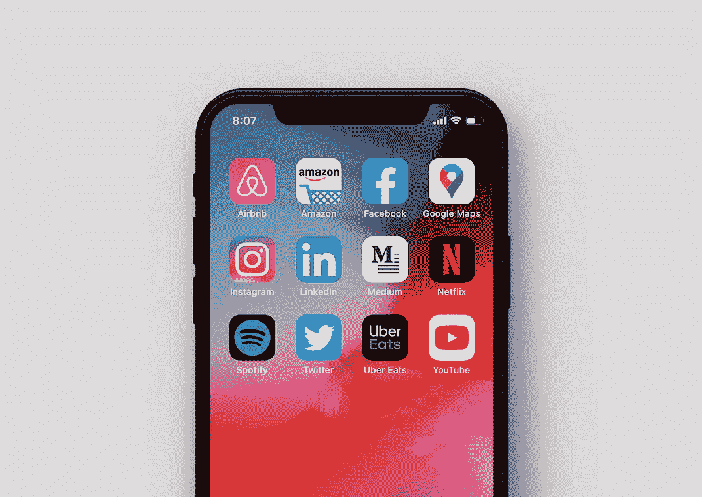
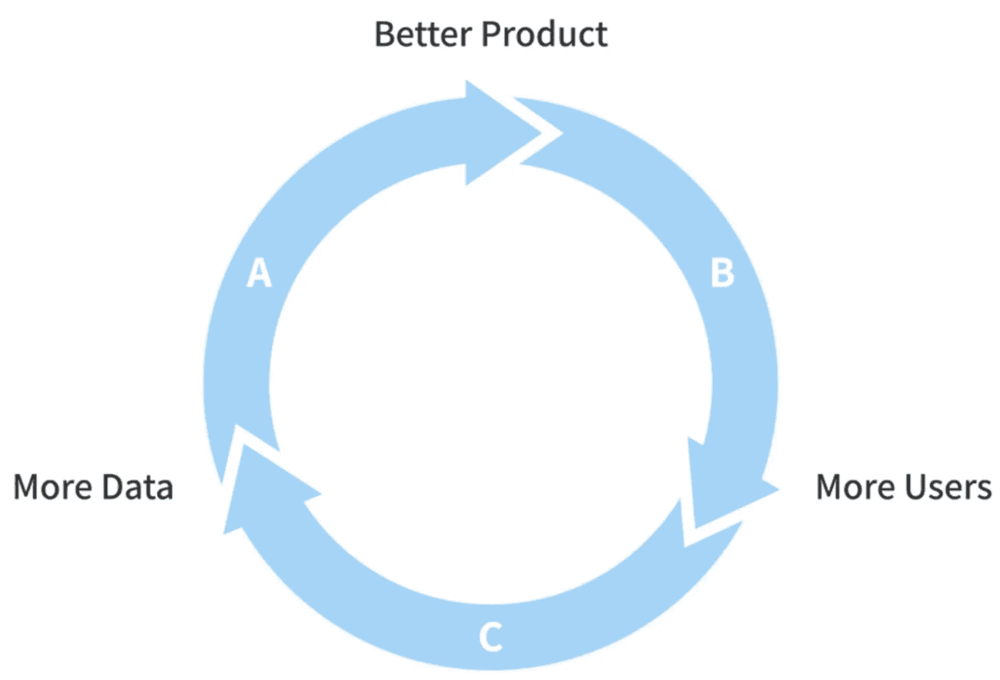
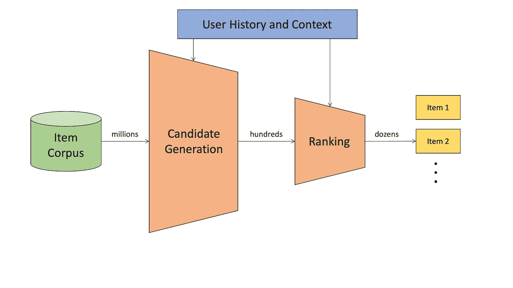
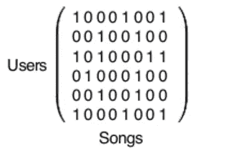

# 推荐系统:机器学习最有价值的应用(上)

> 原文：<https://towardsdatascience.com/recommender-systems-the-most-valuable-application-of-machine-learning-part-1-f96ecbc4b7f5?source=collection_archive---------4----------------------->

为什么推荐系统是机器学习最有价值的应用，以及机器学习驱动的推荐器如何已经驱动了我们生活的几乎每个方面。

推荐系统已经驱动了我们日常生活的几乎每个方面。

回顾你的一周:一个机器学习算法决定了你可能喜欢听什么歌，在网上订购什么食物，你在你最喜欢的社交网络上看到什么帖子，以及你可能想联系的下一个人，你想看什么连续剧或电影等等…

机器学习已经指导了我们生活的许多方面，而我们却不一定意识到这一点。上面提到的所有应用都是由一种算法驱动的:推荐系统。

在这篇文章中，我将探索和深入构建一个成功的推荐系统的所有方面。这篇文章的长度有点失控，所以我决定把它分成两部分。第一部分将包括:

*   商业价值
*   问题定式化
*   数据
*   算法

第二部分将涵盖:

*   评估指标
*   用户界面
*   冷启动问题
*   探索与开发
*   推荐系统的未来

在整篇文章中，我将使用在过去几年中建立了最广泛使用的系统的公司的例子，包括 Airbnb、亚马逊、Instagram、LinkedIn、网飞、Spotify、Uber Eats 和 YouTube。

# 商业价值

《哈佛商业评论》发表了一份强有力的声明，称推荐人是“天生数字化”企业和传统企业之间最重要的算法区别。HBR 还描述了这些可以产生的良性商业循环:使用公司推荐系统的人越多，他们就变得越有价值，而他们变得越有价值，使用他们的人就越多。

推荐系统的良性商业循环(来源: [MDPI](https://www.mdpi.com/2199-8531/5/3/44/htm) ，CC)

我们被鼓励关注推荐系统，不是作为一种在线销售的方式，而是将其视为*不断提高客户洞察力和我们自己洞察力的可再生资源*。如果我们看上面的插图，我们可以看到许多传统公司也有大量的用户，因此也有大量的数据。他们的良性循环没有像亚马逊、网飞或 Spotify 那样迅速，原因是缺乏将用户数据转化为可操作的见解的知识，这些见解可以用来改进他们的产品或服务。

以网飞为例，可以看出这一点有多重要，因为人们观看的 80%的内容都来自某种推荐。2015 年[，他们的一篇论文引用了](https://dl.acm.org/doi/pdf/10.1145/2843948):

> “我们认为个性化和推荐的综合效果每年为我们节省了超过$1B。”

如果我们看看亚马逊，[顾客在亚马逊](https://www.mckinsey.com/industries/retail/our-insights/how-retailers-can-keep-up-with-consumers)购买的 35%来自产品推荐，而在 Airbnb，搜索排名和类似的列表推动了 [99%的预订转化](https://medium.com/airbnb-engineering/listing-embeddings-for-similar-listing-recommendations-and-real-time-personalization-in-search-601172f7603e)。

# 问题定式化

现在我们已经看到了巨大的价值，公司可以从推荐系统中获益，让我们看看他们可以解决的挑战类型。一般来说，科技公司试图向他们的用户推荐**最相关的内容**。这可能意味着:

*   类似的房屋列表(Airbnb、Zillow)
*   相关媒体，如照片、视频和故事(Instagram)
*   相关系列和电影(网飞、亚马逊 Prime 视频)
*   相关歌曲和播客(Spotify)
*   相关视频(YouTube)
*   相似的用户，帖子(LinkedIn，Twitter，Instagram)
*   相关菜品和餐厅(优步吃)

在这里，问题的表述是至关重要的。很多时候，公司希望推荐用户未来最有可能喜欢的内容。这个问题的重新表述，以及算法从推荐“用户最有可能观看什么”到“用户未来最有可能观看什么*[的变化，使得亚马逊 PrimeVideo 获得了 2 倍的改善](https://www.amazon.science/the-history-of-amazons-recommendation-algorithm)，这是他们电影推荐系统的“十年一次的飞跃”。*

> *“亚马逊的研究人员发现，当他们按时间顺序对输入数据进行排序，并使用它来预测未来短期(一到两周)内的电影偏好时，使用神经网络来生成电影推荐的效果要好得多。”*

# *数据*

*推荐系统通常将两种类型的数据作为输入:*

*   ***用户交互数据**(隐式/显式)*
*   ***项目数据**(特性)*

*基于**协作过滤**(被[亚马逊](https://www.cs.umd.edu/~samir/498/Amazon-Recommendations.pdf)、[网飞](https://netflixtechblog.com/netflix-recommendations-beyond-the-5-stars-part-1-55838468f429)、 [LinkedIn](https://ls13-www.cs.tu-dortmund.de/homepage/rsweb2014/papers/rsweb2014_submission_3.pdf) 、 [Spotify](https://medium.com/s/story/spotifys-discover-weekly-how-machine-learning-finds-your-new-music-19a41ab76efe) 和 [YouTube](https://static.googleusercontent.com/media/research.google.com/en//pubs/archive/45530.pdf) 使用)的“经典”且仍被广泛使用的推荐系统方法使用用户-用户或项目-项目关系来查找相似的内容。我不打算深入探讨这个问题的内部工作原理，因为有很多关于这个主题的文章——比如这篇文章——很好地解释了这个概念。*

**用户交互数据*是我们从网络日志中收集的数据，可以分为两组:*

**:来自我们用户的明确输入(例如，电影评级、搜索日志、喜欢、评论、观看、收藏等。)**

*****隐含数据*** :不是有意提供的，而是从可用数据流中收集的信息(如搜索历史、订单历史、点击、互动账户等)。)**

***项目数据*主要由项目特征组成。在 YouTube 的情况下，这将是视频的元数据，如标题和描述。对于 Zillow 来说，这可能是一个家庭的邮政编码、城市地区、价格或卧室数量。**

**其他数据源可能是 ***外部数据*** (例如，网飞可能[添加外部项目数据特征](https://netflixtechblog.com/netflix-recommendations-beyond-the-5-stars-part-2-d9b96aa399f5)如票房表现或评论家评论)或**专家生成的数据**(潘多拉的[音乐基因组项目](https://pdfs.semanticscholar.org/f635/6c70452b3f56dc1ae07b4649a80239afb1b6.pdf)使用人类输入来应用每首歌曲在大约 400 个音乐属性中的值)。**

**这里的一个关键见解是，显然，拥有更多关于你的用户的数据将不可避免地导致更好的模型结果(如果应用正确)，然而，正如 Airbnb 在他们的[为 Airbnb 体验建立排名模型的 3 部分旅程中所示](https://medium.com/airbnb-engineering/machine-learning-powered-search-ranking-of-airbnb-experiences-110b4b1a0789)你已经可以用更少的数据实现相当多的成就:Airbnb 的团队仅用 500 次体验和 50k 的训练数据规模就已经将预订量提高了+13%。**

> **“主要的收获是:*不要等到你有了大数据，你可以用小数据做很多事情来帮助你的业务增长和改善。***

# **算法**

**通常，我们只把推荐系统和协同过滤联系在一起。这很公平，因为在过去，这是许多在实践中部署了成功系统的公司的首选方法。亚马逊可能是第一家利用[项目对项目协同过滤](https://www.cs.umd.edu/~samir/498/Amazon-Recommendations.pdf)的公司。当他们在 2003 年首次在一篇论文中公布他们方法的内部运作时，该系统已经使用了六年。**

**然后，在 2006 年，网飞紧随其后，发起了著名的网飞价格挑战，奖励任何将他们现有的电影技术系统的精确度提高 10%的人 100 万美元。协同过滤也是 Spotify 和 YouTube 早期推荐系统的一部分。LinkedIn 甚至开发了一个名为 Browsemaps 的横向协作过滤基础设施。该平台支持针对 LinkedIn 上几乎所有用例的协同过滤推荐的快速开发、部署和计算。**

**如果你想了解更多关于协同过滤的知识，我推荐你去看看 Coursera 上吴恩达机器学习课程的第 16 部分，在那里他深入研究了其背后的数学原理。**

**现在，我想后退一步，概括一下推荐系统的概念。虽然许多公司过去依赖于协同过滤，但今天有许多其他不同的算法在发挥作用，它们补充甚至取代了协同过滤方法。当网飞从 DVD 运输转向流媒体业务时，他们经历了这一变化。正如他们在一篇论文中所描述的:**

> **“当我们的主要业务是通过邮件运送 DVD 时，我们确实非常依赖这样的算法，部分原因是在这种情况下，星级是我们收到的会员实际观看视频的主要反馈。[……]但明星和 DVD 成为网飞推荐焦点的日子早已过去。[……]现在，我们的推荐系统由各种算法组成，这些算法共同定义了网飞体验，其中大多数都集中在网飞主页上。”**

**如果我们缩小一点，更广泛地观察推荐系统，我们会发现它们基本上由两部分组成:**

1.  ****候选生成****
2.  ****排名****

**下面我将使用 [YouTube 的推荐系统](https://static.googleusercontent.com/media/research.google.com/en//pubs/archive/45530.pdf)作为例子，因为它们提供了一个很好的可视化效果，但是同样的概念也适用于 Instagram 的“insta gram Explore”中的[推荐，优步的](https://ai.facebook.com/blog/powered-by-ai-instagrams-explore-recommender-system/)[菜肴和餐馆推荐系统](https://eng.uber.com/uber-eats-graph-learning/)，网飞的[电影推荐](https://netflixtechblog.com/netflix-recommendations-beyond-the-5-stars-part-2-d9b96aa399f5)以及其他许多公司。**

****

**两阶段推荐系统(受 [YouTube](https://static.googleusercontent.com/media/research.google.com/en//pubs/archive/45530.pdf) 启发)**

**根据网飞的说法，推荐系统的目标是提供大量有吸引力的商品供人们选择。这通常是通过选择一些项目(*候选生成*)并按照预期享受(或效用)的顺序对它们进行排序(*排名*)来实现的。**

**让我们进一步研究这两个阶段:**

## **候选生成**

**在这一阶段，我们希望找到有资格向我们的用户展示的相关候选人。在这里，我们处理的是整个商品目录，所以它可能非常大(YouTube 和 Instagram 就是很好的例子)。做到这一点的关键是实体嵌入。什么是实体嵌入？**

**实体嵌入是实体的数学向量表示，使得它的维度可以表示某些属性。Twitter 在一篇关于嵌入@Twitter 的博文中有一个很好的例子:假设我们有两名 NBA 球员(斯蒂芬·库里和勒布朗)和两名音乐家(肯德里克·拉玛尔和布鲁诺·马斯)。我们期望 NBA 球员之间的嵌入距离小于球员和音乐家之间的嵌入距离。我们可以使用欧几里得距离公式来计算两个嵌入之间的距离。**

*****我们是如何想出这些嵌入的？*****

**一种方法是协同过滤。我们有我们的项目和我们的用户。如果我们将它们放在一个矩阵中(以 Spotify 为例)，它可能是这样的:**

****

**在应用了[矩阵分解算法](https://www.slideshare.net/MrChrisJohnson/from-idea-to-execution-spotifys-discover-weekly/31-1_0_0_0_1)之后，我们最终得到了用户向量和歌曲向量。为了找出哪些用户的口味与另一个最相似，协作过滤将一个用户的向量与所有其他用户的向量进行比较，最终找出最匹配的用户。Y 向量也是如此，*歌曲*:你可以将一首歌曲的向量与所有其他歌曲的向量进行比较，找出哪些歌曲与所讨论的歌曲最相似。**

**另一种方法是从自然语言处理领域的应用中获得灵感。研究人员将谷歌在 2010 年代早期开发的 [word2vec 算法](https://papers.nips.cc/paper/5021-distributed-representations-of-words-and-phrases-and-their-compositionality.pdf)推广到所有出现在类似上下文中的实体。在 word2vec 中，通过直接考虑词序及其共现来训练网络，这是基于这样的假设，即在句子中频繁出现的词也共享更多的统计相关性。正如 Airbnb 在他们关于创建列表嵌入的[博客文章](https://medium.com/airbnb-engineering/listing-embeddings-for-similar-listing-recommendations-and-real-time-personalization-in-search-601172f7603e)中所描述的:**

> **最近，嵌入的概念已经从单词表示扩展到 NLP 领域之外的其他应用。来自网络搜索、电子商务和市场领域的研究人员已经认识到，就像可以通过将句子中的单词序列视为上下文来训练单词嵌入一样，可以通过将用户动作序列视为上下文来训练用户动作的嵌入。例子包括学习被点击或购买的物品的[表示或者被点击的](https://arxiv.org/pdf/1606.07154.pdf)的[查询和广告。这些嵌入随后被用于网络上的各种推荐。](https://arxiv.org/pdf/1607.01869.pdf)**

**除了 Airbnb，这个概念还被 Instagram (IG2Vec)用于[学习账户嵌入](https://ai.facebook.com/blog/powered-by-ai-instagrams-explore-recommender-system/)，被 YouTube 用于[学习视频嵌入](https://static.googleusercontent.com/media/research.google.com/en//pubs/archive/45530.pdf)，被 Zillow 用于[学习分类嵌入](https://www.zillow.com/tech/embedding-similar-home-recommendation/)。**

**另一种更新颖的方法被称为图形学习，它被 Uber Eats 用于他们的菜肴和餐馆嵌入。他们在一个单独的图中表示他们的每个菜肴和餐馆，并应用 [GraphSAGE 算法](http://snap.stanford.edu/graphsage/)来获得各自节点的表示(嵌入)。**

**最后但同样重要的是，我们还可以学习嵌入，作为我们目标任务的神经网络的一部分。这种方法可以为您的特定系统定制一个嵌入，但是可能比单独训练嵌入需要更长的时间。 [Keras 嵌入层](https://keras.io/api/layers/core_layers/embedding/)是实现这一点的一种方式。谷歌在他们的[机器学习速成班中很好地涵盖了这一点。](https://developers.google.com/machine-learning/crash-course/embeddings/obtaining-embeddings)**

**一旦我们有了项目的矢量表示，我们就可以简单地使用最近邻搜索来找到我们的潜在候选对象。
[Instagram，例如](https://ai.facebook.com/blog/powered-by-ai-instagrams-explore-recommender-system/)，定义了几个种子账户(人们过去互动过的账户)，并使用它们的 IG2Vec 账户嵌入来寻找类似的账户。根据这些帐户，他们能够找到这些帐户发布或参与的媒体。通过这样做，他们能够过滤数十亿个媒体项目，然后从池中抽取 500 个候选项目，并将这些候选项目发送到下游的排名阶段。**

**这个阶段也可以由业务规则或用户输入来指导(我们拥有的信息越多，我们就越具体)。例如，正如 Uber Eats 在他们的博客文章中提到的[，预过滤可以基于地理位置等因素。](https://eng.uber.com/uber-eats-graph-learning/)**

**所以，总结一下:**

***在候选生成(或采购)阶段，我们会从整个内容目录中筛选出用户可能感兴趣的一小部分内容。要做到这一点，我们需要将我们的项目映射到一个称为嵌入的数学表示中，这样我们就可以使用相似性函数来找到空间中最相似的项目。有几种方法可以实现这一点。其中三个是协作过滤、用于实体的 word2vec 和图形学习。***

## **等级**

**让我们回到 Instagram 的案例。在候选生成阶段之后，我们有大约 500 个潜在相关的媒体项目，我们可以在用户的“探索”提要中显示给用户。
但是哪些会是**最相关的**？**

**因为毕竟“探索”版块首页只有 25 个点。如果第一个项目很糟糕，用户就不会留下深刻印象，也不会有兴趣继续浏览。网飞和亚马逊 PrimeVideo 的网络界面[只在首页](https://www.amazon.science/the-history-of-amazons-recommendation-algorithm)显示与目录中每本书相关的前 6 个推荐。 [Spotify 的 Discover Weekly](https://www.slideshare.net/MrChrisJohnson/from-idea-to-execution-spotifys-discover-weekly/31-1_0_0_0_1) 播放列表只包含 30 首歌曲。
此外，所有这些都取决于用户的设备。当然，智能手机的相关推荐空间比网络浏览器小。**

**“有许多方法可以构建排名函数，从简单的评分方法到成对偏好，再到整个排名的优化。如果我们要将这个问题公式化为机器学习问题，我们可以从历史数据中选择正面和负面的例子，并让机器学习算法学习优化我们目标的权重。这一系列机器学习问题被称为“[学习排名](http://en.wikipedia.org/wiki/Learning_to_rank)”，是搜索引擎或广告定位等应用场景的核心。在排名阶段，我们的目标不是让我们的项目具有全球概念的*相关性*，而是寻找优化个性化模型的方法*(摘自* [*【网飞博文*](https://netflixtechblog.com/netflix-recommendations-beyond-the-5-stars-part-2-d9b96aa399f5) *)。***

**为了实现这一点， [Instagram 使用三阶段排名基础设施](https://ai.facebook.com/blog/powered-by-ai-instagrams-explore-recommender-system/)来帮助平衡排名相关性和计算效率之间的权衡。在 Uber Eats 的[案例中，他们的个性化排名系统是“一个成熟的 ML 模型，它根据额外的上下文信息，如用户打开 Uber Eats 应用程序时的日期、时间和当前位置，对预过滤的菜肴和餐馆候选进行排名”。通常，模型的复杂程度实际上取决于特征空间的大小。许多监督分类方法可用于排序。典型的选择包括逻辑回归、支持向量机、神经网络或基于决策树的方法，如梯度推进决策树(GBDT)。另一方面，近年来出现了大量专门为学习排序而设计的算法，如 RankSVM 或 RankBoost。](https://eng.uber.com/uber-eats-graph-learning/)**

**总结一下:**

***在为我们的推荐选择初始候选项之后，在排名阶段，我们需要设计一个排名函数，根据项目的相关性对其进行排名。这可以表述为一个机器学习问题，这里的目标是为每个用户优化一个个性化的模型。这一步很重要，因为在大多数界面中，我们推荐项目的空间有限，所以我们需要充分利用空间，将最相关的项目放在最上面。***

## **基线**

**至于每一个机器学习算法，我们需要一个好的基线来衡量任何变化的改善。一个好的基线是使用目录中最受欢迎的[商品，正如 Amazon](https://www.amazon.science/the-history-of-amazons-recommendation-algorithm) 所描述的:**

> **“在推荐领域，有一条基本原则。如果我对你一无所知，那么推荐给你的最好的东西就是世界上最受欢迎的东西。”**

**然而，如果你甚至不知道什么是最受欢迎的，因为你刚刚推出了一个新产品或新项目——就像 [Airbnb Experiences](https://medium.com/airbnb-engineering/machine-learning-powered-search-ranking-of-airbnb-experiences-110b4b1a0789) 的情况一样——你可以每天随机重新排列项目集合，直到你为你的第一个模型收集了足够的数据。**

**这是本系列第 1 部分的总结。在这篇文章中，我想强调几点:**

*   **推荐系统是机器学习最有价值的应用，因为它们能够创建一个良性的反馈循环:越多人使用公司的推荐系统，它们就越有价值，越有价值，就越有人使用。一旦你进入那个循环，天空就是极限。**
*   **正确的问题表述是关键。**
*   **在网飞价格挑战中，团队试图建立模型来预测用户对给定电影的评级。在“现实世界”中，公司使用更复杂的数据输入，这些数据可以分为两类:显式数据和隐式数据。**
*   **在当今世界，推荐系统不仅仅依赖于协同过滤。**

**在第二部分，我将介绍:**

*   **评估指标**
*   **用户界面**
*   **冷启动问题**
*   **探索与开发**

***看看下面的第二部分:***

** [## 推荐系统:机器学习最有价值的应用

### 为什么推荐系统是机器学习最有价值的应用，以及机器学习如何驱动…

towardsdatascience.com](/recommender-systems-the-most-valuable-application-of-machine-learning-2bc6903c63ce)** 

*****资源*****

**[Airbnb —在搜索排名中列出嵌入内容](https://medium.com/airbnb-engineering/listing-embeddings-for-similar-listing-recommendations-and-real-time-personalization-in-search-601172f7603e)**

**[Airbnb——基于机器学习的 Airbnb 体验搜索排名](https://medium.com/airbnb-engineering/machine-learning-powered-search-ranking-of-airbnb-experiences-110b4b1a0789)**

**[亚马逊—Amazon.com 推荐的单品到单品协同过滤](https://www.cs.umd.edu/~samir/498/Amazon-Recommendations.pdf)**

**[亚马逊——亚马逊推荐算法的历史](https://www.amazon.science/the-history-of-amazons-recommendation-algorithm)**

**[Instagram——由人工智能支持:insta gram 的探索推荐系统](https://ai.facebook.com/blog/powered-by-ai-instagrams-explore-recommender-system/)**

**[LinkedIn——LinkedIn 的浏览器地图:协同过滤](https://ls13-www.cs.tu-dortmund.de/homepage/rsweb2014/papers/rsweb2014_submission_3.pdf)**

**[网飞—网飞推荐:超越五星(上)](https://netflixtechblog.com/netflix-recommendations-beyond-the-5-stars-part-1-55838468f429)**

**[网飞—网飞推荐:超越五星(下)](https://netflixtechblog.com/netflix-recommendations-beyond-the-5-stars-part-2-d9b96aa399f5)**

**[网飞——网飞推荐系统:算法、商业价值和创新](https://dl.acm.org/doi/pdf/10.1145/2843948)**

**[网飞——学习个性化主页](https://netflixtechblog.com/learning-a-personalized-homepage-aa8ec670359a)**

**[潘多拉——潘多拉的音乐推荐者](https://pdfs.semanticscholar.org/f635/6c70452b3f56dc1ae07b4649a80239afb1b6.pdf)**

**[Spotify——探索周刊:Spotify 怎么这么了解你？](https://medium.com/s/story/spotifys-discover-weekly-how-machine-learning-finds-your-new-music-19a41ab76efe)**

**[Spotify——只为你的耳朵:用机器学习个性化 Spotify Home](https://labs.spotify.com/2020/01/16/for-your-ears-only-personalizing-spotify-home-with-machine-learning/)**

**Spotify——从想法到执行:Spotify 的《发现周刊》**

**[Twitter —嵌入@Twitter](https://blog.twitter.com/engineering/en_us/topics/insights/2018/embeddingsattwitter.html)**

**[Uber Eats——用 Uber Eats 发现食物:向市场推荐](https://eng.uber.com/uber-eats-recommending-marketplace/)**

**[Uber Eats——用 Uber Eats 发现食物:使用图形学习来增强推荐功能](https://eng.uber.com/uber-eats-graph-learning/)**

**[YouTube——YouTube 视频推荐系统](https://www.inf.unibz.it/~ricci/ISR/papers/p293-davidson.pdf)**

**[YouTube——推荐系统的协作深度学习](https://arxiv.org/pdf/1409.2944.pdf)**

**[YouTube——用于 YouTube 推荐的深度神经网络](https://static.googleusercontent.com/media/research.google.com/en//pubs/archive/45530.pdf)**

**[Zillow —相似住宅推荐的住宅嵌入](https://www.zillow.com/tech/embedding-similar-home-recommendation/)**

**[吴恩达的机器学习课程(推荐系统)](https://www.youtube.com/watch?v=giIXNoiqO_U&list=PL-6SiIrhTAi6x4Oq28s7yy94ubLzVXabj)**

**[谷歌的机器学习速成班——嵌入](https://developers.google.com/machine-learning/crash-course/embeddings/video-lecture)**

**范登布鲁克·朱丽叶[✍️](https://medium.com/u/2fa93184f586?source=post_page-----f96ecbc4b7f5--------------------------------)的编辑评论**