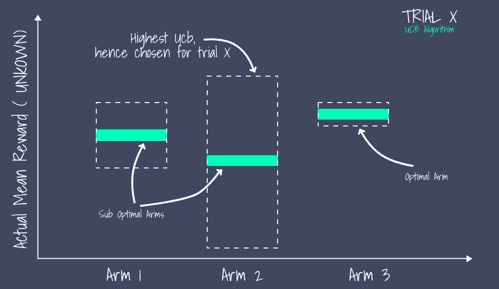
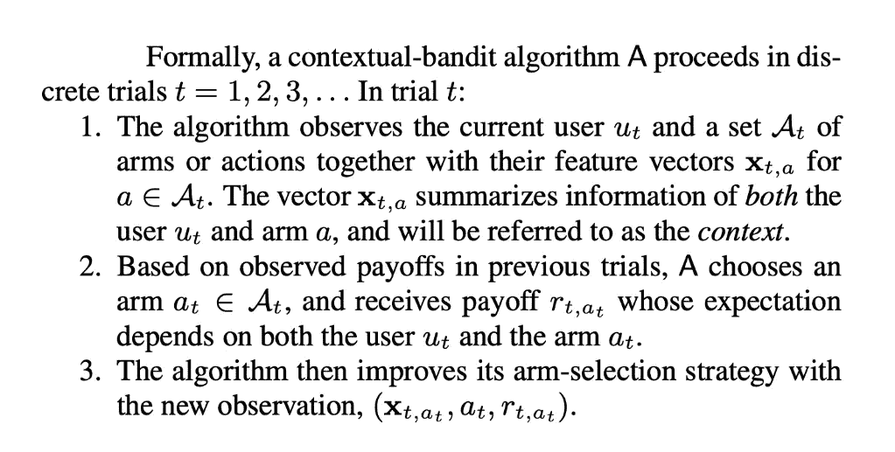
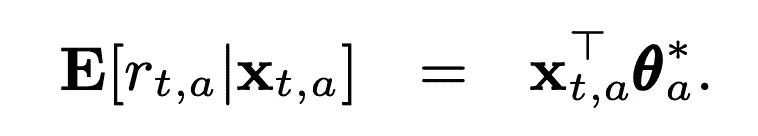
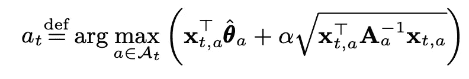
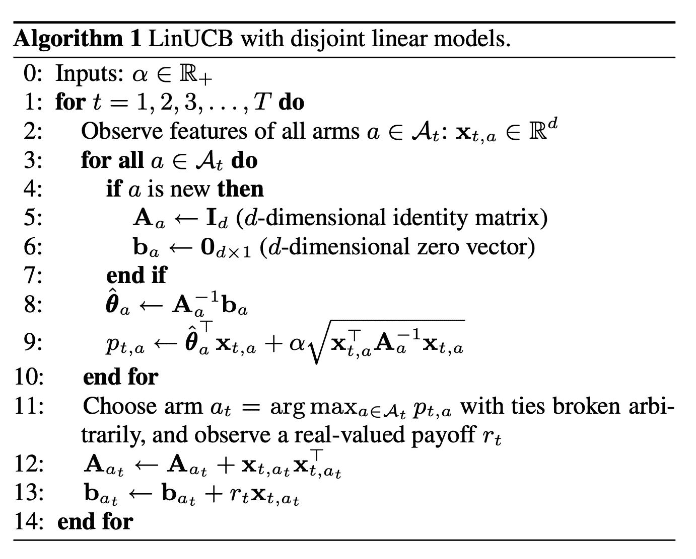
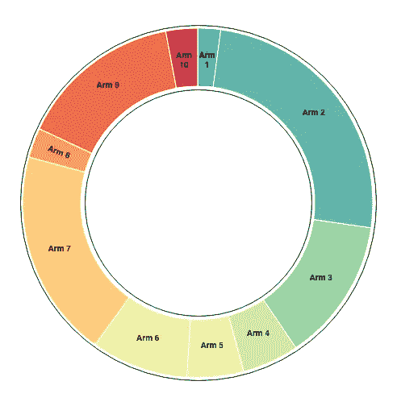
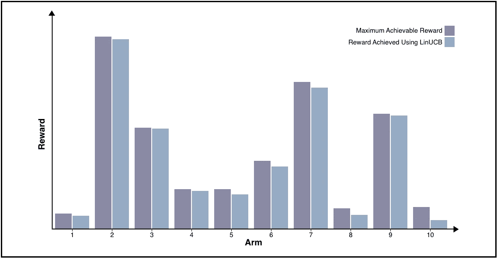

# 使用 LinUCB 的推荐系统:一种上下文多臂 bandit 方法

> 原文：<https://towardsdatascience.com/recommender-systems-using-linucb-a-contextual-multi-armed-bandit-approach-35a6f0eb6c4?source=collection_archive---------5----------------------->

## 推荐系统

## *使用分离 LinUCB 算法最大化用户交互的推荐系统的上下文多臂 bandit 方法分析*

# 什么是多臂土匪问题？

多武器强盗问题，本质上，只是一个重复的试验，其中用户有固定数量的选项*(称为武器)*，并根据他选择的选项获得奖励。比方说，一个企业主有 10 个特定产品的广告，必须在网站上展示其中一个广告。回报是通过观察广告是否**有利可图**足以让用户**点击**并被重定向到产品网站。

企业主为前 1000 个用户运行算法，以从 10 个可用广告中决定最佳广告，并且在他的试运行结束后，决定向其余用户显示**最佳广告**。该算法基于广告在试运行*(前 1000 个用户)*中的表现来评估最佳广告

这是我们开始思考的地方。一个广告真的能满足广大多样的受众吗？

这就是**语境**土匪的用武之地。如果我们对用户有足够的了解，我们可以更准确地预测最适合用户的广告，这就是上下文 MAB 算法的作用。基于用户的特征选择广告(arm)(称为*上下文*)。在我们继续分析这种算法之前，我们需要思考一些事情。

# **勘探与开采**

> 在探索和开发之间做出选择的困境存在于生活的各个方面。

比方说，你去街角的冰淇淋店买你最喜欢的口味——巧克力 T21。你不尝试其他口味，因为你害怕你可能不喜欢它们。但是，也有一个小概率，如果你尝试一种新的口味，比如说 r *ed velvet* ，你可能最终会比巧克力更喜欢它。在尝试新口味(探索)和总是得到你最喜欢的(探索)之间取得平衡是很重要的。

MAB 算法必须在选择随机臂(*可能最终成为最佳臂*)或利用其历史选择它认为是最佳的臂(*可能只是次优臂，因为最佳臂可能还没有被充分探索*)之间找到确切的折衷

在线推荐系统试图使用这种算法，根据用户在网站上的活动记录，显示他们认为用户会喜欢的内容。

我们稍后将构建的一个这样的算法被称为*置信上限算法*。

# UCB 算法

解决多臂强盗问题的一个非常天真贪婪的方法是，在任意打破平局的情况下，选择给我们最大平均奖励的臂。尽管这种方法试图选择最佳的可能 arm，但是算法失去了*探索*的范围，并且从长远来看可能选择次优 arm，因为可能有 arm 没有被充分尝试，但是可能是最佳选择。

UCB 算法超越了这种方法，在探索和开发之间找到了平衡。它是这样工作的。

UCB 算法跟踪到目前试验为止每只手臂的平均奖励，并计算每只手臂的置信上限。上界表示**中的*不确定性，我们评价*手臂的潜力。**

如果一个 arm 具有非常高的置信上限，并且由于巨大的探索机会而选择该 arm，则该算法对于该 arm 的潜力是高度不确定的。

考虑一个运行中的 UCB 算法，其当前置信界限*(虚线轮廓)*如下图所示。

对任意试验 x 的 UCB 算法的表示

尽管第 3 组记录的平均奖励较高，但算法选择第 2 组是因为其潜在的的*不确定性，并更新其未来试验的置信界限。*

UCB 算法不考虑用户的用户和内容特征(上下文),内容特征可能包括用户的历史活动和公开的人口统计信息。

# LinUCB

上下文 MAB 问题的开发/探索问题被形式化如下:

来源:[https://arxiv.org/pdf/1003.0146.pdf](https://arxiv.org/pdf/1003.0146.pdf)

假设手臂的期望收益在其 d 维特征向量 X 中是线性的，具有某个未知的系数向量θ。

来源:[https://arxiv.org/pdf/1003.0146.pdf](https://arxiv.org/pdf/1003.0146.pdf)

这个模型被称为*不相交*，因为参数不在不同的分支之间共享。为了求解上述方程中的系数向量θ，将岭回归应用于训练数据。

必须为每个臂计算置信上限，以便算法能够在每次试验中选择一个臂。每次试验选择手臂的策略 *t* 正式确定为:

来源:https://arxiv.org/pdf/1003.0146.pdf

该算法的目标是最大化总回报(从长远来看，总用户点击量)

该算法由其作者形式化如下:

来源:https://arxiv.org/pdf/1003.0146.pdf

我们不详述算法的数学，但我们关注我通过在标准数据集上模拟该算法所获得的结果。

通常，MAB 问题是在**遗憾**的基础上分析的，遗憾是总是选择最优臂所获得的总报酬与算法所获得的总报酬之差。

下面的甜甜圈图显示了如果我们只选择一只手臂(并将其视为最佳手臂)我们可以获得的最大奖励的比较。该图表明，不管选择的最优策略是什么，如果我们在决策中不表现出灵活性，我们最多可以获得总回报的 20%。这种类型的比较在现实生活中通常是不可能的，因为我们事先无法获得全部数据，但这有助于我们认识到这样一个事实，即我们不能只依赖一个最佳手臂。

当每只手臂分别被选为最佳手臂并用于每次试验时，所获得的总奖励的比较

在每次试验中，LinUCB 算法在决定手臂的选择方面做得非常好，下图也反映了这一点。它将每只手臂可能实现的最大奖励与每只手臂实际实现的奖励进行比较。结果表明，我们能够开发每个手臂高达 90%的潜力。

每只手臂可实现的最大奖励与使用 LinUCB 实现的奖励

推荐系统可以直接建模为上下文 MAB 问题，其中不同的推荐选项是手臂，用户是否喜欢推荐可以转化为奖励，最终目标是能够向每个用户提供个性化推荐。

CMAB 算法与基于用户偏好的各种过滤技术相结合，以实现更加个性化的推荐。

# **总结**

LinUCB 算法使我们能够获得大约 90%的总回报，这比其他 MAB 算法高得多。推荐系统是一个非常重要的用例，其中奖励通常转化为更高的收入，这是企业的最终目标。

# 参考

*   萨顿，理查德 s 和巴尔托，安德鲁 g,《强化学习——介绍》[http://incompleteideas.net/book/the-book-2nd.html](http://incompleteideas.net/book/the-book-2nd.html)
*   个性化新闻文章推荐的语境化方法[https://arxiv.org/pdf/1003.0146.pdf](https://arxiv.org/pdf/1003.0146.pdf)