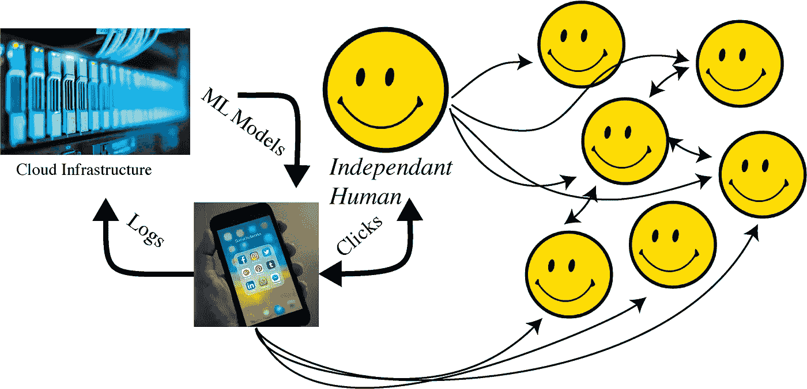
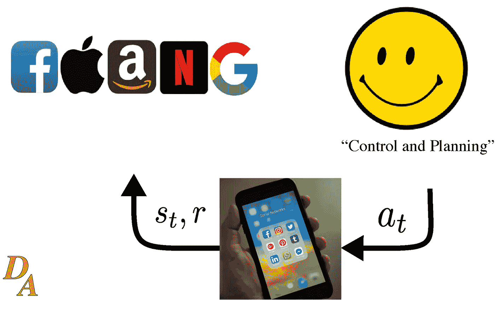
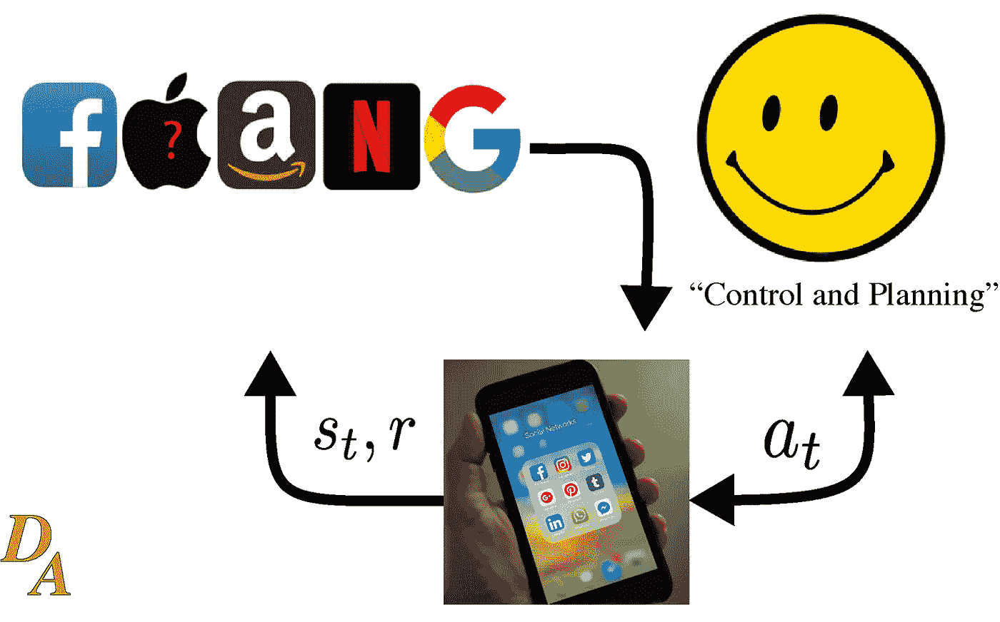
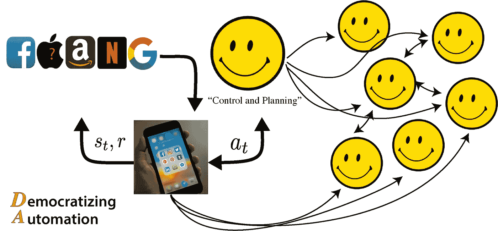

# 推荐系统:价值取向、强化学习和伦理

> 原文：<https://towardsdatascience.com/recommender-systems-value-alignment-reinforcement-learning-and-ethics-625eefaaf138?source=collection_archive---------43----------------------->

## 推荐是一种游戏——一种危险的游戏(对我们来说)。

*这个故事出现在我在* [*民主化自动化*](https://robotic.substack.com/) *写的关于让自动化和 AI 变得可及和公平的每周文章中。*

这包括对在线推荐系统的简要介绍，这种系统的道德规范，我们可以制定人类奖励的方法，以及将人类推荐视为缓慢更新的批量强化学习问题的观点(在*游戏*中，我们的奖励甚至不在循环中)。

来源—作者。

## 推荐系统概述

可以说是新闻反馈系统。推荐系统([维基百科对我来说有最中肯的总结](https://en.wikipedia.org/wiki/Recommender_system))决定给我们什么内容，这是我们的个人资料数据和我们过去互动的函数。根据界面(移动与桌面)和平台(应用程序、操作系统、网页)，交互可以包括许多内容。经常被吹捧为对该技术做出最大贡献的网飞有一个网页描述了他们在该领域的一些研究。

这些系统使用什么样的机器学习？[2015 年的一项调查](https://arxiv.org/pdf/1511.05263.pdf)发现，很多应用使用了[决策树](https://en.wikipedia.org/wiki/Decision_tree)和[贝叶斯方法](https://en.wikipedia.org/wiki/Bayesian_inference#:~:text=Bayesian%20inference%20is%20a%20method,and%20especially%20in%20mathematical%20statistics.)(因为它们给你可解释性)。仅仅两年后，就有了一项关于专门深度学习方法的[调查。我认为许多公司都在使用神经网络，并接受以牺牲可解释性为代价来大幅提高性能的折衷方案— *他们不会告诉客户为什么他们会看到某些内容，对吗？*](https://arxiv.org/pdf/1707.07435.pdf)

我画了一个有趣的图表作为你的基线，它将在整篇文章中展开。这是一种不完全的强化学习框架，主体采取行动 *a* - >环境移动到状态 *s* - >返回奖励 *r* 。

来源—作者。

## 点击直通 led 以点击诱饵

点击率(一种参与和回报的启发式方法)是早期用于创建推荐的指标。clickbait 问题(打开链接，立即关闭)导致页面停留时间度量。我已经被 clickbait 网站彻底击垮了，所以我创建了这个直接面向读者的博客。这对我来说只是表面效应，我相信还有更多。有一段时间，脸书的衡量标准是“点击分享”按钮的使用——好吧，你说到点子上了。

我在上周的机器学习国际会议上发现了一篇来自[研讨会](https://participatoryml.github.io/)的[论文](https://participatoryml.github.io/papers/2020/42.pdf)，内容是关于**机器学习的参与式方法(*当你仔细观察时，会发现有许多很棒的论文可以借鉴，我很可能会重温)*** 。当你看到块引号时，它们来自 [*你在优化什么？使推荐系统与人类价值观相一致。阿尔，2020。有一些关于如何使用和部署系统的大背景。*](https://participatoryml.github.io/papers/2020/42.pdf)

> *如今大多数大型生产系统(包括 Flipboard (Cora，2017 年)和脸书(Peysakhovich & Hendrix，2016 年))转而在人类标记的 clickbait 上训练分类器，并使用它们来测量和降低系统内 clickbait 的流行率。*

当生成的内容超过标记能力时，人工标记的内容是一个瓶颈。此外，在部署时标记分类器会立即过时(不断移动测试集)。[也有公司不会描述他们如何操作](https://www.wired.com/story/tiktok-finally-explains-for-you-algorithm-works/)。关于行业使用，我发现另一个有趣的地方是:

> *Spotify 以阐述音乐平台面临的公平和多样性问题而闻名。他们的推荐系统本质上是一个双边市场，因为艺术家必须以满足双方的方式与用户匹配，否则双方都不会留在平台上。*

下面是显而易见的评论，但却是必不可少的。

> *尤其是在过滤社交媒体和新闻内容时，推荐者是公众讨论中的关键调解人。Twitter 试图创建“健康对话”指标，目标是“为鼓励更具建设性的对话提供积极的激励”(Wagner，2019)。*

我对所学模型的印象是:**如果大公司都这么做，那是因为它管用。**还是那句话，不要假设 malintent，假设利润。现在我们已经介绍了这些公司如何利用他们的平台让我们沉迷于他们的广告，这里是我们模型的一个小更新——一个反馈回路和双向箭头。

来源—作者。

# 推荐系统的伦理

我们的计算机正在决定把什么放在我们面前，主要是为了让公司把我们作为可靠的客户。什么会出错？机器人给你推荐什么你没意见？你的社交媒体内容——好的。我如何决定我的职业道路——我不知道。

我不责怪公司制造这些工具并把它们放在我们面前——他们毕竟想赚钱。随着负面影响在未来几年内不断加剧，这些问题将成为人们关注的焦点。以下几点是我认为公司没有达到足够高的标准:

*   [金融科技(Fintech)公司](https://www.nytimes.com/2020/07/08/technology/robinhood-risky-trading.html):操纵你的大脑以不同的方式参与金融产品，这对没有一定财务稳定性的人产生了更戏剧性的影响。
*   [高流量媒体平台](https://www.wsj.com/articles/facebook-criticized-in-india-over-free-limited-internet-1453398493):除了你每天上网时间的简单点，或者谷歌如何支配你看到的一切，科技公司已经试图在发展中国家成为互联网*。点击链接，看看当脸书试图成为印度的互联网时发生了什么(尽管他们很好地包括了维基百科！).*
*   *[新闻来源](https://open.nytimes.com/how-the-new-york-times-is-experimenting-with-recommendation-algorithms-562f78624d26):主流新闻编辑室(当然还有边缘网站，以及介于两者之间的一切)使用自动化方法来调整给你的新闻。我看到未来他们会调整写作风格，以更好地符合你的观点。因循守旧不是进步。*

*我想从 at-scale，面向人类的人工智能中被称为**价值对齐问题**开始(关于法律合同、人工智能和价值对齐的示例论文[哈德菲尔德-梅内尔&哈德菲尔德，2019](https://dl.acm.org/doi/pdf/10.1145/3306618.3314250?casa_token=nGByQyqI-vAAAAAA%3AwFL1xCEWvZSBgUUS9ylzqq5x1lUmn3d_bv5rSY0wxsjK8VGCuJS5LqUmI6SgIJ2rsf4WizUGzosZ6g) )。*

## *与人类受试者一起工作的低级伦理*

*我在这里将伦理问题定义为短期结果(下面强调)和由算法控制生活的人类的长期精神重组。*

> **对推荐系统的关注包括宣传造谣(* [*斯托克，2019*](https://link.springer.com/chapter/10.1007/978-3-030-39627-5_11) *)、歧视性或其他不公平的结果(* [*巴罗卡斯等人，2019*](https://fairmlbook.org/) *)、成瘾行为(* [*哈桑等人，2018*](https://www.sciencedirect.com/science/article/pii/S0747563217306581)*)(*[*安德瑞森，2015)*](https://link.springer.com/article/10.1007/s40429-015-0056-9)*

*流浪 et。al，2020 继续并介绍**推荐器对齐问题**。由于技术在我们生活中的普及，这是一个特定版本的价值取向问题，它可能会增加出现的机会。如果在这一点上你没有考虑他们如何影响你，你有没有仔细阅读？最后，调整的三阶段方法:*

> **我们观察到一种常见的三阶段对齐方法:1)识别相关的内容类别(例如，点击诱饵);2)这些类别被操作为进化的标记数据集；以及 3)根据该数据训练的模型用于调整系统建议**

*这可以概括为识别(内容和问题)、操作化(模型和数据)、调整部署。这听起来与机器学习模型的部署方式相对接近，但下面会详细介绍。*

## *高级推荐系统调整:*

*高层次的想法同样来自报纸，但评论是我自己的。*

1.  *有用的定义和衡量标准——公司需要对互联网指标进行研究，以更好地匹配用户期望和累积伤害(或提升！)*
2.  *参与式推荐者——让人们参与到内容的循环中，将使人类的回报与模型化的回报更好地匹配，这从长远来看是值得的。*
3.  ***互动价值学习—** 这是最重要的问题，它可能包含所有其他问题。最终，假设奖励函数是一个分布，极端剥削会显著减少(更多见下文)*
4.  *围绕知情、审慎的判断进行设计——这对我来说似乎是显而易见的，但请不要假新闻。*

*让我们继续第三点。*

## *模拟人类奖励*

*被定义为 的 ***优化问题和真正的 ***优化问题*** 之间的交互是在与人类的安全交互中应用机器学习系统的长期战斗。****

*现在大多数机器学习工具使用的模型是优化人类给计算机的奖励函数。**标准模型**([Russell—*Human Compatible*，2019](https://books.google.com/books?hl=en&lr=&id=M1eFDwAAQBAJ&oi=fnd&pg=PT6&dq=human+compatible+book&ots=k_Vqa9Ac13&sig=iD5t7xb-HH1NovGRij2AI--2nt8#v=onepage&q=human%20compatible%20book&f=false) )无非是一个[优化问题](https://en.wikipedia.org/wiki/Optimization_problem#:~:text=In%20mathematics%2C%20computer%20science%20and,solution%20from%20all%20feasible%20solutions.&text=A%20problem%20with%20continuous%20variables,continuous%20function%20must%20be%20found.)当某个奖励函数上的度量改善时，结果会改善。当我们考虑比较多个人的权衡回报(幅度和方向)时，这一点完全失败了，人工智能将利用未提及的行动途径(我告诉机器人我想要咖啡，但最近的咖啡店是 12 美元，这不是我想要的结果，但它“做到了”)，以及更多有害的未建模效应。*

*更好的方法是什么？更好的方法是再次，**互动价值学习**。价值学习是一个框架，它将允许我们制造的人工智能永远不要假设它们拥有人类想要的完整模型。如果一个人工智能只认为它有 80%的机会做出正确的行为，那么它在保持高预期效用的行动中会更加胆怯(我认为 20%的机会包括一些非常负面的结果)。推荐系统也需要考虑这一点，否则，我们将在一个我们几乎无法控制的游戏中螺旋上升。*

# *人和计算机在循环中的强化学习*

*强化学习是一个迭代框架，其中代理通过行动与环境交互以最大化回报。强化学习(RL)在受限游戏中取得了很大的成功。在这种情况下，有两个“游戏”框架。*

1.  *应用程序是代理，人是状态空间的一部分(实际上更适合问题的表述)*
2.  *人类是代理，计算机，世界是环境，而回报是很难建模的。这个更有说服力，所以我继续。这就是我在标题中提到的**游戏**。*

**

*来源—作者。*

*最终，FAANG 公司将记录所有的流量数据(包括我们之前谈到的对真实人类奖励的启发)，并尝试学习您的设备应该如何与您交互。这是一个复杂的系统，在反馈回路中，你与之互动的每个人都有**的下游效应。作为一名 RL 研究员，我知道算法是脆弱的，我不希望这种情况发生在我身上(但我经常努力摆脱自己)。上图是最重要的一点——单个实体不可能设计一个优化来“解决”这个网络。***

*先说数据和建模。据我所知，FAANG 还没有使用 RL，但他们正在获取一个大型数据集来潜在地这样做。从状态、行动和奖励的大型数据集到新政策的过程被称为**批量强化学习**(或离线 RL)。它试图将无序行为的历史提炼为最优策略。*我对科技公司的应用程序的看法是，他们已经在玩这个游戏，但 RL 代理并不决定推荐系统的更新，而是由一组工程师来决定*。唯一可能的情况是，也许抖音的黑匣子已经转向优先考虑收视率的 RL 算法。如果推荐系统将成为强化学习的问题，伦理解决方案需要尽快出台。*

*这里是对[批量 RL 课程材料](https://web.stanford.edu/class/cs234/CS234Win2018/slides/cs234_2018_l13.pdf)、[离线 RL 研究](https://arxiv.org/pdf/2005.13239.pdf)和[现实世界 RL 的广泛挑战](https://arxiv.org/pdf/1904.12901.pdf)感兴趣的读者的资源。*

* [## 自动化大众化

### 一个关于机器人和人工智能的博客，让它们对每个人都有益，以及即将到来的自动化浪潮…

robotic.substack.com](https://robotic.substack.com/)*