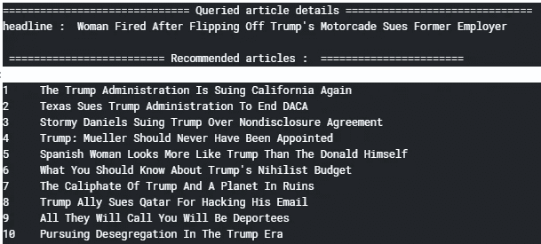
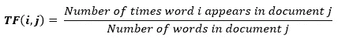
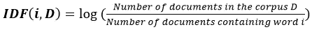
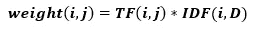
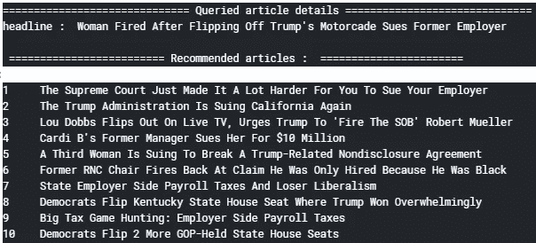
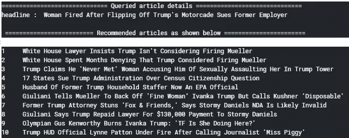
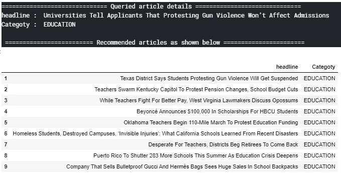
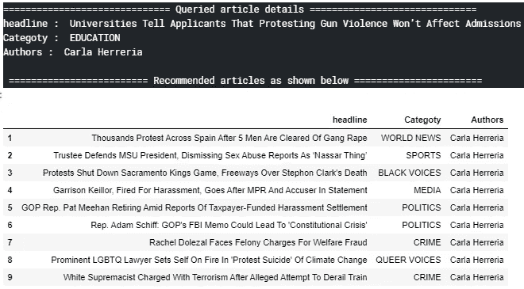
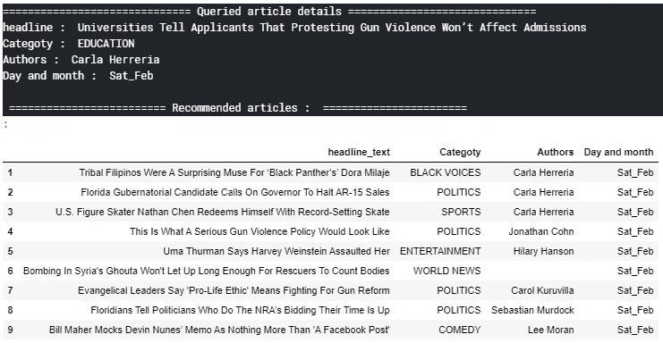

# 基于已阅读的文章推荐新闻文章

> 原文：<https://towardsdatascience.com/recommending-news-articles-based-on-already-read-articles-627695221fe8?source=collection_archive---------18----------------------->

## Python 中基于内容的推荐

由于在你最喜欢的在线平台上很容易获得大量的商品(服务)，如*电子商务*、*求职门户*、*送餐*、*音乐或视频流*，快速找到你选择的所需商品是非常困难和耗时的。这些平台可以通过分析你过去与系统的互动或行为，根据你的兴趣和偏好推荐**商品来帮助你。**

从**亚马逊**到 **Linkedin** ，**优步吃**到 **Spotify** ，**网飞**到**脸书**，**推荐系统**被最广泛地用于向他们的用户推荐“相似的项目”、“相关的工作”、“喜欢的食物”、“感兴趣的电影”等等。

***推荐系统*** 提供适当的商品建议，有助于促进销售、增加收入、留住客户并增加竞争优势。*推荐*方法基本有两种。

1.  **基于内容的推荐**
2.  **协同过滤**

***基于内容的推荐*** 基于通过用户 ***属性*** 获得的用户/项目之间的相似度。它使用关于 ***用户*** 或 ***条目*** 的附加信息(元数据)，即它依赖于什么样的 ***内容*** 已经可用。该元数据可以是用户的 ***人口统计信息*** ，如*年龄*、*性别*、*工作*、*位置*、*技能集、*等。同样，对于 ***项目*、**可以是*项目名称*、*规格*、*类别*、*登记日期、*等。

所以其核心思想就是根据物品的*属性，通过找到与关注的 ***物品/用户*** 相似的物品/用户来推荐物品。*

*在这篇博客中，我们将使用**新闻类别**数据集来讨论*基于内容的推荐*。目标是通过使用诸如文章标题*、*类别*、*作者*和*出版日期*等属性来推荐与已阅读文章相似的*新闻文章*。**

**

*那么让我们开始使用 Kaggle 上可用的 [***新闻类别数据集***](https://www.kaggle.com/rmisra/news-category-dataset)*。数据集包含大约 20 万个对 6 个不同特征的观察，如*新闻标题*、*类别*、*作者*、*简短描述*、*出版日期、*等。**

> **附加说明:为了访问完整的 python 代码，请访问 kaggle 内核[这里](https://www.kaggle.com/vikashrajluhaniwal/recommending-news-articles-based-on-read-articles)([https://www . ka ggle . com/vikashrajluhaniwal/recommending-news-articles-based-on-read-articles](https://www.kaggle.com/vikashrajluhaniwal/recommending-news-articles-based-on-read-articles))。**

## **1.数据预处理**

*   *****仅获取 2018 年*** 的文章——由于数据集大小相当大，因此处理整个数据集可能会耗费太多时间。为了避免这种情况，我们只考虑 2018 年的最新文章。**
*   *****移除所有短标题文章****——**从标题中移除停用词后，标题非常短的文章可能会变成空白标题文章。所以我们把标题里字数少(< 5)的文章都去掉吧。***
*   ******检查并删除所有重复的****——*由于有些文章的标题完全相同，所以让我们删除所有标题重复的文章。***

## ****2。基础数据探索****

****a .基本统计—文章数量、作者、类别****

**经过数据预处理后，共有 892 位作者的 8485 篇新闻文章，分属 26 个不同的类别。**

****b .文章类别分布****

**从条形图中，我们可以观察到`politics`类别的*文章数量最高*文章数量次之`entertainment`文章数量最高，以此类推。**

****c .每月文章数量****

**从柱状图中，我们可以观察到`January` 月的*文章数量最高*，然后是`March`等等。**

****d. PDF 为标题长度****

***标题* `length`的*概率分布*函数几乎类似于*高斯分布*，其中*标题*的大部分长度为 58 到 80 个字。**

## **3.文本预处理**

*   *****停用词移除*** *—* 停用词对分析没有太大帮助，而且包含停用词会在处理过程中耗费大量时间，所以让我们移除它们。**
*   *****引理化—*** 让我们找到单词的基本形式(引理)来考虑与引理相同的单词的不同屈折。**

# **4.基于标题的新文章相似度**

**通常，我们根据*距离*来评估*相似度*。如果*距离*最小，则高*相似度*，如果最大，则低*相似度*。为了计算*距离*，我们需要将标题表示为一个 *d 维*向量。然后我们可以根据向量之间的*距离*找出*相似度*。**

**有多种方法将一个*文本*表示为一个 *d 维*向量，如*单词包*、 *TF-IDF 方法*、 *Word2Vec 嵌入、*等。每种方法都有自己的优缺点。**

**我们一个一个的通过所有的方法来看头条的特征表现。**

## ****a .使用包字法****

***单词包(BoW)* 方法表示单词在*文档中的出现。*在这里，每个标题可以被认为是一个*文档*，所有标题的集合形成一个*语料库。***

**使用*弓*的方法，每个*文档*由一个 ***维*** 向量表示，其中*维* 是语料库中*唯一词*的总数。这一组独特的单词构成了词典。**

**以上功能基于标题推荐 10 篇*与*查询(阅读)*文章相似的*文章。它接受两个参数——已读文章的索引和要推荐的文章总数。**

*基于*欧几里德距离*它找出 10 个最近的*邻居*并推荐。*

**

***缺点***

1.  *它对*语料库*中*不太频繁*观察到的单词赋予很低的*重要性*。在整个*语料库*中，`employer`、`flip`、`fire`等被查询文章中的几个词出现*的频率较低*，因此 *BoW* 方法*不会向*推荐 *headline* 包含这些词的任何文章。由于`trump`是*语料库*中常见的词，所以它推荐标题包含`trump`的文章。*
2.  **鞠躬*方法不保留单词的顺序。*

*为了克服第一个缺点，我们使用 ***TF-IDF*** 方法进行特征表示。*

## ***b .使用 TF-IDF 方法***

**TF-IDF* 方法是一种加权方法，它赋予*语料库*中不太常用的词更多的重要性。它根据*术语频率(TF)* 和*逆文档频率(IDF)为文档中的每个*术语(单词)*分配一个权重。**

******

*因此，如果一个单词在一个文档中出现的次数更多，但在所有其他文档中出现的次数更少，那么它的 *TF-IDF* 值将会很高。*

**

*相比于 *BoW* 方法，这里 *TF-IDF* 方法推荐标题*的文章*中包含类似`employer`、`fire`、`flip`的词在前 5 位推荐，这些词在*语料库*中出现频率*较少*。*

***缺点***

*   **Bow* 和 *TF-IDF* 方法不捕获给定单词与其他单词的*语义*和*句法*相似性，但这可以使用嵌入 的 ***单词来捕获。例如，`trump` 和`white house`、`office`和`employee`、`tiger`和`leopard`、`USA`和`Washington D.C`等词之间就有很好的联想。使用*单词嵌入*技术可以捕获这种*语义*相似性。
    *单词嵌入*技术像 *Word2Vec* 、 *GloVe* 和 *fastText* 利用*语义*单词*之间的相似性。***

## ***c .使用 Word2Vec 嵌入***

**Word2Vec* 是*语义*相似度的技术之一，由 *Google* 于 2013 年发明。对于给定的*语料库*，在训练过程中，它观察模式，并用一个 d *维*向量来表示每个单词。为了得到更好的结果，我们需要一个相当大的语料库。*

*由于我们的语料库规模很小，所以让我们在*谷歌新闻*文章上使用谷歌的预训练模型。这个标准模型包含通过对数百万篇新文章进行训练而获得的数十亿个单词的向量表示。在这里，每个单词用一个 300 维的*密集*向量来表示。*

*由于模型给出了每个*单词*的矢量表示，但是我们计算了*标题*之间的距离，因此我们需要获得每个*标题*的矢量表示。一种方法是首先将标题中所有可用单词的矢量表示相加，然后计算平均值。也被称为*平均 Word2Vec* 型号。*

**

*这里，基于 *Word2Vec* 的表示推荐包含与被查询*文章*中的`trump`相关联的`white house`的*标题*。类似地，它推荐带有与被查询的*标题*中的`employer`、`sue`具有语义相似性的`official`、`insist`的标题。*

> *注意:到目前为止，我们只推荐使用一个特征，即*标题*，但是为了使*推荐系统更加健壮*，我们需要一次考虑*多个*特征。基于商业利益和规则，我们可以决定每个特征的权重。*

*让我们来看看不同的型号与不同的*功能组合*的文章相似性。*

## *d.基于标题和类别的加权相似度*

*我们先来看看基于*标题*和*类别*的文章相似度。我们使用*一键编码*来获得*类别*的特征表示。*

*有时根据业务需要，我们可能需要更多地优先考虑来自同一*类别*的文章。在这种情况下，我们可以在推荐时给*类别*分配更多的权重。权重越高，意义越大。同样，权重越小，特定特征的重要性就越小。*

*上述函数采用两个额外的参数 *w1* 和 *w2* 作为对应于*标题*和*类别*的权重。在从 *0 到 1* 的范围内传递*重量*始终是一个好的做法，其中接近 1 的值表示重量大，而接近 0 的值表示重量小。*

**

*在这里，我们可以观察到推荐的文章与查询的文章*类别*来自同一个*类别*。这是由于高值传递到 *w2* 。*

## *e.基于标题、类别和作者的加权相似度*

*现在让我们来看看基于*作者*以及*标题*和*类别*计算文章相似度。同样，我们通过*一次性编码*对*作者*进行编码。*

*上面的函数为*作者*多了一个权重参数 *w3* 。*

**

*在输出中，我们可以观察到，由于对 *w3* 的高权重，推荐的文章来自与查询的文章*作者*相同的*作者*。*

## *f.基于标题、类别、作者和出版日期的加权相似度*

*现在让我们来看看基于发布*工作日*作者*以及*标题*、*类别、*和*作者*计算文章相似度。同样，我们通过*一键编码*来编码这个新特性。**

*上述函数为*日和月*额外增加了一个权重参数 *w4* 。*

**

*在输出中，我们可以看到，由于对 *w4* 的高权重，推荐的文章与查询的文章来自同一个*日和月*。*

## *结束注释*

*在本文中，我们讨论了不同类型的*单词嵌入*技术，以及针对*基于内容的推荐*的*特征*的不同组合，以及与每种技术相关的常见问题。*