# 推荐苏格兰威士忌

> 原文：<https://towardsdatascience.com/recommending-scotch-whisky-ea440c2eb289?source=collection_archive---------31----------------------->

大约一年前，我在苏格兰参加了苏格兰威士忌体验培训课程，获得了苏格兰威士忌销售证书。由于我有数据科学的背景，这导致我思考如何用数据科学来销售苏格兰威士忌。

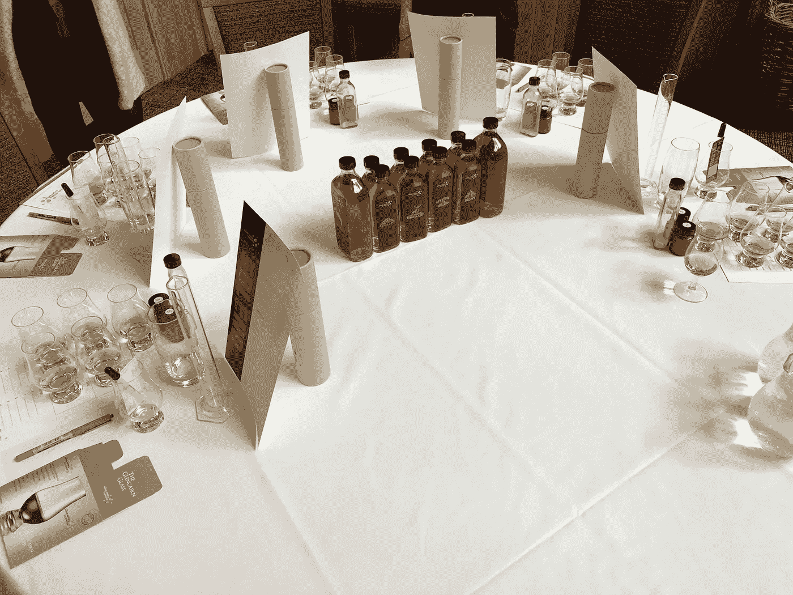

苏格兰威士忌体验中的威士忌品尝

背景
威士忌是一种深色酒，每一种都有其独特的风味和特点。像酒和咖啡等其他饮料一样。欣赏饮料是一门主观艺术。消费者通常没有受过表达他们想要什么的训练，当消费者对他们偏好的威士忌(甚至是葡萄酒或咖啡)的词汇或描述有限时，很难理解消费者想要什么:这很难做出推荐。在苏格兰威士忌体验教学中，他们建议销售人员使用讲故事的方式与消费者进行对话。我认为这是一个良好的开端，但我们可以通过利用威士忌风味和特征的量化数据做得更多，并根据这些数据学习一个模型，这样卖家可能会有更好的指南来猜测消费者可能喜欢什么。所以我认为我们可以使用一些机器学习的方法来建立一个苏格兰威士忌的推荐系统。

有人可能会问:苏格兰威士忌与美国和爱尔兰威士忌有什么不同？爱尔兰威士忌和苏格兰威士忌的主要区别在于，爱尔兰威士忌蒸馏三次，而大多数苏格兰威士忌蒸馏两次。蒸馏产生的质地差异就像浓缩咖啡和倒出来的咖啡之间的差异。苏格兰的温度变化低于美国大多数威士忌生产州，这在陈年阶段产生了影响。此外，苏格兰威士忌行业的理念是避免桶的太多影响，大多数苏格兰威士忌酒厂都避免使用原桶(意味着他们倾向于使用二手或三手桶)。因此，我们预计美国威士忌，尤其是波旁威士忌，会比大多数苏格兰威士忌味道更浓郁。

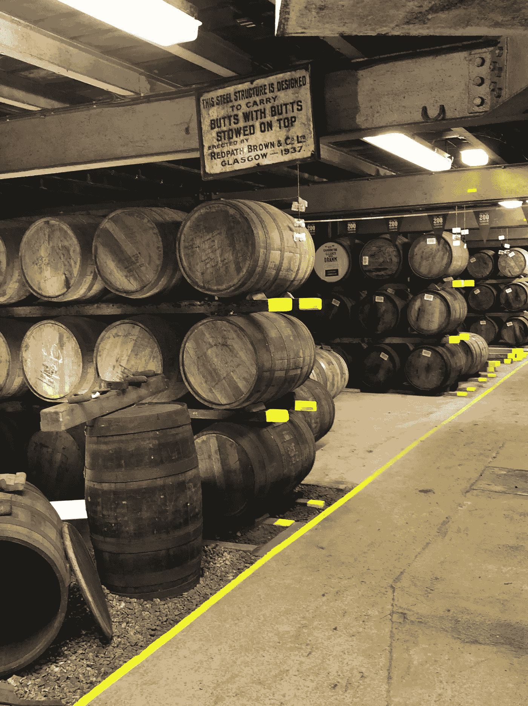

苏格兰威士忌需要在桶中陈酿至少 3 年，才能在法律上被称为苏格兰威士忌

**推荐系统**
我们可以应用的推荐系统主要有两种:协同过滤推荐系统和基于内容的推荐系统。

协同过滤推荐系统是亚马逊目前正在使用的推荐系统。该模型识别消费者群体并学习他们的购物模式，并基于所识别的使用相似的群体推荐用户可能感兴趣的商品。如果我们对威士忌不是很了解，这是推荐威士忌的一个很好的方法，模型能够根据以前消费者的购物偏好进行推荐。不过，我没有这方面的数据。在我看来，这种方法忽视了理解和欣赏威士忌特性的艺术；它只是简单地推荐威士忌的其他消费者如何行为，而不是了解威士忌本身的特性。所以我不会用这种方法来推荐苏格兰威士忌。

基于内容的推荐系统是一种基于两个商品之间的相似性向用户推荐商品的模型。因此，它基于产品本身的数据而不是用户和消费者之间的行为来推荐威士忌。在这篇文章中，我想探索一种从另一种威士忌的内容中推荐威士忌的系统而科学的方法，这种方法可以简化根据威士忌的内容推荐威士忌的过程。

我从 Kaggle 获得了主要苏格兰威士忌酒厂的数据，以及它们的总体量化风味和特征。我还在数据集中添加了经度、纬度和酿酒厂所属的地区，你可以在帖子底部我的 GitHub 链接中找到数据集。威士忌的地区数据基于 *Collins gem —威士忌*。在这个数据集中，只有单一麦芽威士忌可用。

数据集中的列包括:
1。酒厂——酒厂名称(串)
2。Body(整数，范围从 0–4)
3。甜度(整数，范围从 0-4)
4。药用(整数，范围从 0–4)
5。烟草(整数，范围从 0-4)
6。Honey(整数，范围从 0–4)
7。辣(整数，范围 0–4)
8。Winey(整数，范围从 0 到 4)
9。Nutty(整数，范围从 0 到 4)
10。Malty(整数，范围从 0 到 4)
11。水果味(整数，范围从 0-4)
12。Floral(整数，范围从 0 到 4)
13。邮政编码—酒厂的邮政编码(字符串)
14。LatitudeUTM—UTM 格式的纬度(整数)
15。LongitudeUTM—UTM 格式的经度(整数)
16。Lat — Latitude (Float)(我手动添加的列)
17。Lon —经度(Float)(我手动添加的列)
18。基于*柯林斯宝石威士忌*(字符串)的酒厂区域分类(我手动添加的列)

威士忌的风味和特点从 0 到 4 分不等。0 表示无，4 表示最重。例如，Islay & Islands 的 Laphroig 在烟雾弥漫方面获得了 4 分，这并不奇怪，因为 Laphroig 是一种非常烟雾弥漫(泥炭)的威士忌。在这个数据集中，有 86 个酒厂的 12 种风味和特征。

有我手动添加到原始数据集的列，即。纬度、经度和地区。我将 UTM 转换成纬度和经度，因为它有助于在 Tableau 的地图上可视化。在 Region 列中，数据集中有 4 个区域:低地、高地、Speyside 和 Islay & Islands。

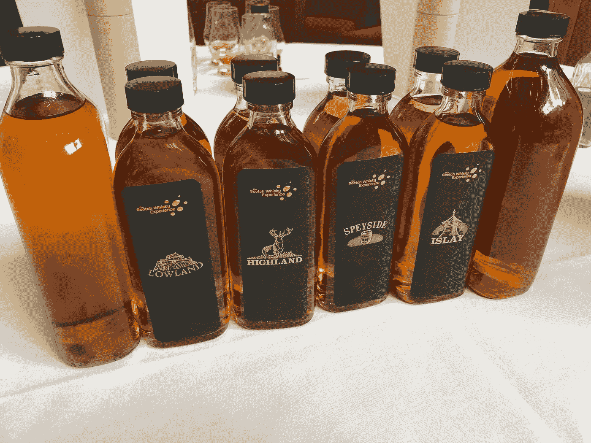

苏格兰的四个地区:低地、高地、斯佩塞德、伊斯莱和群岛

**目标** 我想建立一个服务于两个目标的推荐系统:
1。如果有人喜欢一家酒厂生产的威士忌，我可以推荐一种口味相似的威士忌。
2。如果我们有一种威士忌不在数据集中，我可以找出其他类似的威士忌。

**工具**
在这个项目中，我将使用以下工具和包:
- Python，连同 pandas，scikit-learn，Plotly
- Tableau

**基于地区的推荐**

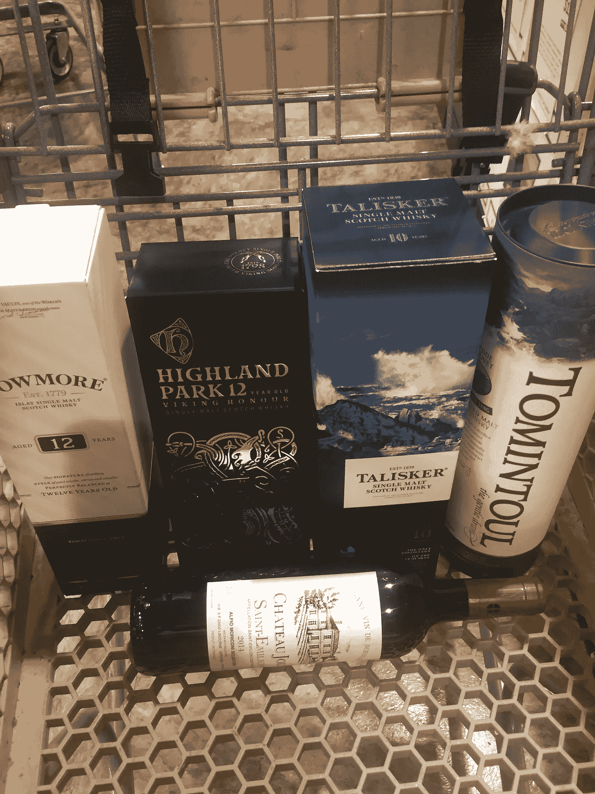

我偏爱的威士忌是艾莱岛

以前，我是一个葡萄酒爱好者。我们根据地区来鉴别法国葡萄酒。每个地区的葡萄酒都有自己的风味和特色。例如，你可能会期待来自波尔多的酒体饱满，果香浓郁的葡萄酒。天真地说，如果我喜欢一瓶圣爱美浓的葡萄酒，那么很可能我喜欢喝梅多克的葡萄酒。同样在苏格兰威士忌中，如果我喜欢喝来自 Islay 的 Laphoraig，我很可能会喝 Lagavulin，因为 Lagavulin 是来自 Islay 的威士忌。我认为根据地区推荐苏格兰威士忌比推荐法国葡萄酒更有意义，因为苏格兰威士忌的地区系统远没有法国葡萄酒的 AOC 系统复杂。

所以，开始做一个基于地域的推荐系统是明智的。一旦我们训练了一个模型，我们可以将新的威士忌添加到模型中，并区分新威士忌的地区，并根据相同的地区推荐威士忌。

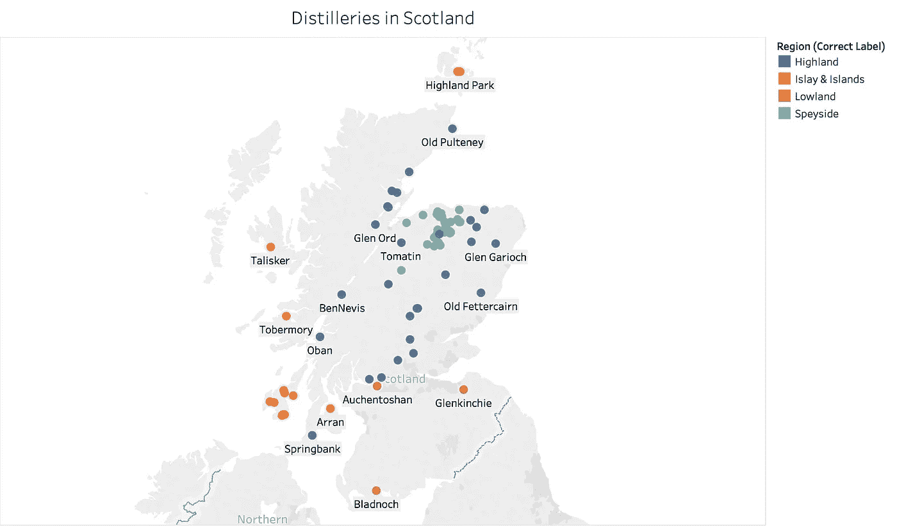

苏格兰威士忌地区分类

如果我们使用这种方法，我们将使用威士忌的风味和特性来学习一个模型来预测威士忌的产地。我使用了四种分类算法来训练模型:逻辑回归、支持向量分类(SVC)、决策树和随机森林。我使用 Python 和 Scikit-learn 来训练模型，并使用 k-fold 交叉验证来确保每种方法的准确性。

结果在这些方法中，用 logistic 回归训练的模型精度最高。然而，logistic 回归模型的准确率仅为 58.10%。准确性太低，以至于数据集中有近一半的威士忌被归类为错误的地区。

你可能会在下面找到贴有错误地区标签的酿酒厂。颜色代表错误分类的区域。

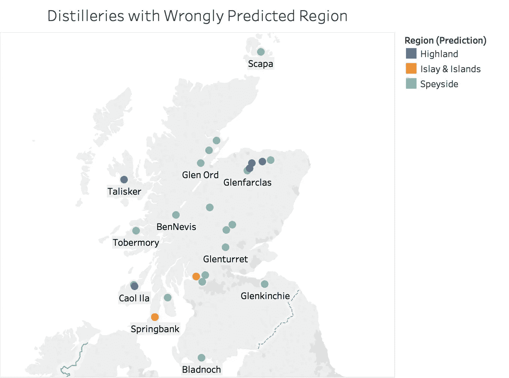

**为什么“最佳模型”的精确度仍然很低？** 在我看来，该型号性能低下有几个原因。

理由 1:斯佩赛德威士忌和高地威士忌很相似
当斯佩赛德威士忌被错误地归类为高地威士忌，或者被韵文归类时，我不会感到惊讶。斯贝河位于高地(斯贝赛德和高地的分界线直到最近几十年才被划分出来)，所以斯贝赛德威士忌和高地威士忌有着非常相似的风味和特征。如果你看看斯派塞威士忌和高地威士忌之间的特征，这些地区之间的数据非常相似。

原因二:数据不平衡。有趣的是，没有一家酒厂被认定为低地威士忌。当我们查看数据集时，只有 3 家低地酒厂！这意味着地区分布首先是不平衡的，因此任何算法都很难预测低地威士忌。

**想到这种方法**
看来预测威士忌产地的准确性很低。在实践中，该模型并不是推荐威士忌的理想方法，因为它很难识别同一地区威士忌之间的相似性。不值得花时间来设计数据集以实现更高的准确性。因此，我们应该寻找新的方法来建立推荐系统。

**树状图**
第二种方法是使用树状图来显示酒厂之间的层级关系。树状图是一种层次聚类，这种方法将数据集中的每个特征视为一个维度，并根据风味和特征的相似性对酒厂进行聚类。

用 Python 生成树状图很容易:一旦有了特性和标签(蒸馏厂)，就可以将特性和标签传递给 Plotly 在 figure_factory 中的 create_dendrogram，您会发现下面的输出。

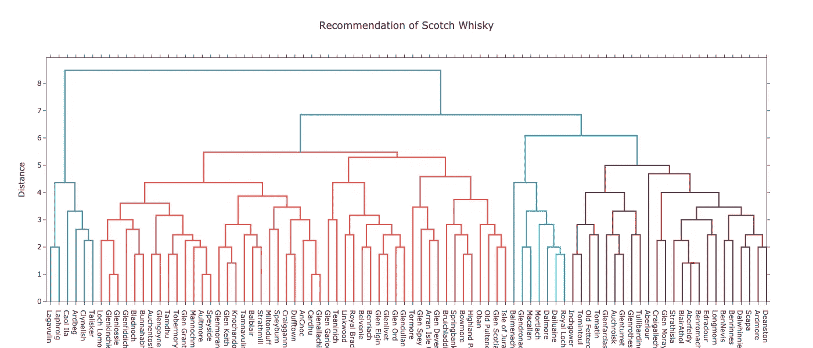

系统树图

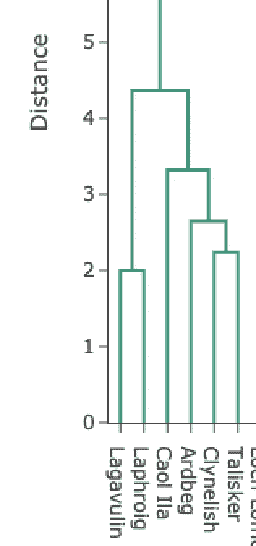

树状图的 x 轴是数据集中苏格兰威士忌的列表。y 轴代表威士忌之间量化特征的欧几里德距离。例如，如果威士忌 A 具有[1，1，2，3]的特征，而威士忌 B 具有[2，3，4，3]的特征，则两种威士忌之间特征的欧几里德距离是(2–1)+(3–1)+(2–4)+(3–3)的平方根，因此威士忌 A 特征和威士忌 B 特征之间的欧几里德距离是 3。如果两种威士忌之间的特征的欧几里德距离低，则意味着两种威士忌具有相似的味道或风味；如果它很高，这意味着这两种威士忌没有相似的味道或风味。

阅读树状图并不容易。首先，你必须选择一个威士忌品牌，并从那里进行观察。例如，如果我从 Laphroaig 开始，我将关注绿色的星团。

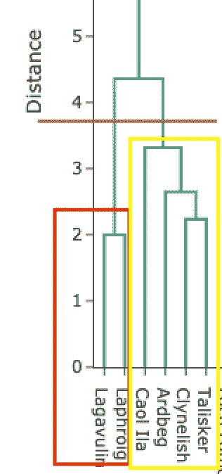

的每个分支代表一个子集群，如图中的棕色线所示。棕色线将威士忌品牌分为两个子群，分别代表红色和黄色方框。要推荐一款与 Laphroaig 相似的威士忌，你会从 Laphroaig 开始寻找，你可能会发现 Lagavulin 与 Laphroaig 最相似，因为连接两种威士忌品牌的分支高度最低。所以，如果有人喜欢 Laphroaig，你会推荐 Lagavulin。如果他不喜欢 Lagavulin，你将把 Lagavulin 和 Laphroaig 作为一个聚类(用红色方框表示),并找到连接 Laphroaig 聚类的下一个分支，即黄色方框中的聚类，然后你会推荐黄色方框中的一种威士忌。然而，现在的问题是:在 Caol Ila、Ardbeg、Clynelish 和 Talisker 中，基于树状图的下一个最佳推荐是什么？

**思考这个方法** 使用这个树状图有一个很好的理由来推荐苏格兰威士忌。树状图倾向于把最相似的威士忌放在一起。如果我从 Laphroaig 开始，那么我会找到 Lagavulin 并推荐它。或者从塔利斯克开始，最相似的威士忌是克莱恩利什，我会推荐克莱恩利什。

绘制树状图是推荐苏格兰威士忌的好方法吗？我不这么认为。虽然树状图很好地展示了威士忌之间的等级差异，但我不认为这是推荐苏格兰威士忌的好方法。

首先，树状图只显示了最接近的威士忌的相似性。缺点是，如果最相似的威士忌不是一个很好的选择，那么就很难找到第二相似的威士忌。回到上图，树状图只是总结了 Laphroaig 和 Lagavulin 之间的相似性。然而，它并没有告诉你 Laphroaig 和 Caol Ila 之间有多相似，因为没有分支直接链接到这两个威士忌品牌。我们无法判断黄盒中的哪种威士忌与 Laphroaig 下一个最相似，因为我们只被告知红盒聚类和黄盒聚类相似，但没有信息来比较红盒聚类中的一种威士忌和黄盒聚类中的一种威士忌。

第二，树状图很难解释，因为阅读树状图中的分支来理解威士忌之间的关系是令人困惑的。如果这是苏格兰威士忌销售人员使用的工具，很难训练销售人员阅读，因为解释如何阅读树状图并不容易。

最后，如果数据集越来越大，树状图就没有用了。想象一下，如果我们有 100 多个威士忌品牌添加到数据集中，我们将不得不在 x 轴上再添加 100 个威士忌品牌，这样树状图就必须放大以提高可读性。这种方法的局限性是，如果我们有更多的品牌，情节需要更多的空间来显示威士忌品牌之间的关系。这意味着如果数据集中有更多的威士忌，可视化的大小必须更大。因此，我们必须为我们的目标找到另一种方法。

**聚类— K 均值** 第三种方法是基于量化特征将相似的威士忌聚类成一组。这种方法将威士忌分成不同的组，而同一组中的每种威士忌通常都具有最接近的总体量化特征和风味的平均值。在苏格兰威士忌推荐系统的应用中，这意味着无论哪种威士忌基于量化特征和风味是相似的，我们都将它们分组到同一个组中。这个想法是，如果消费者在你的脑海中有一个苏格兰威士忌，你可以推荐来自同一组的类似威士忌。

k 均值是无监督学习，这很难确定性能。第一个问题是选择最佳超参数，也就是说使用什么样的 K 值最好。幸运的是，您可以使用肘方法来找到最佳 k。为此，首先选择 k 的范围，比方说 1 到 12 之间，包括 1 和 12。然后，使用 Python 和 Scikit-learn 训练模型并获得误差平方和(SSE)。之后，在形成一个臂的折线图上绘制每个模型的 K 和 SSE 的数量。最后，你可能会在手臂的肘部找到最佳的 k。

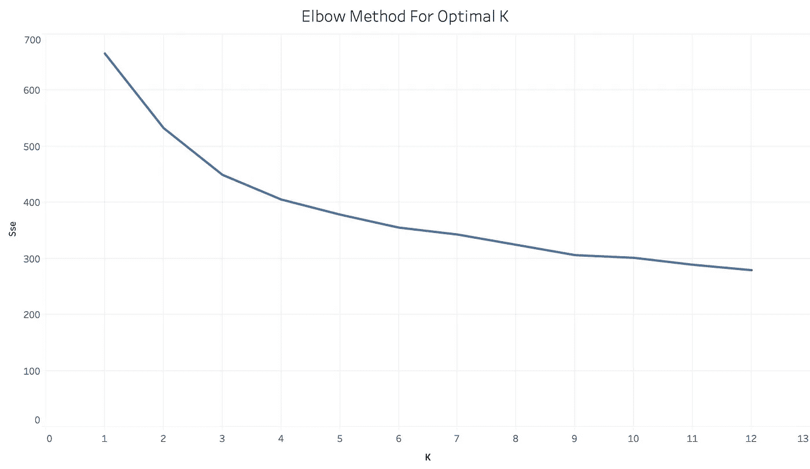

用肘法求 K

我们可以看到肘部在 4 到 6 之间。从技术上讲，在 4 和 6 之间选择一个数字就可以了。然而，在选择超参数时，我们还必须考虑这种应用的有用性。我们需要考虑团队的规模——每个团队中酿酒厂的数量不能太多，也不能太少。理想情况下，我们希望小组规模均匀，每个小组应该有 10 到 15 个酒厂。

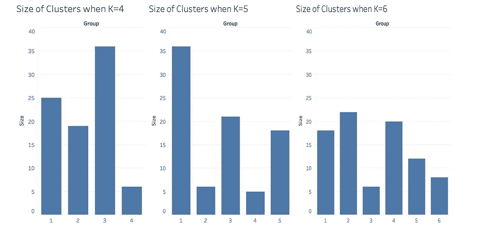

不同 K 值的团簇的大小

我在 3 个条形字符中可视化，以确定哪个超参数符合我们的预期。当 K 为 4 时，我们可以看到大多数组的规模过大；当 K 为 5 时，组的大小是备用的。最后，当 K 是 6 时，每个组的大小是相似的，更接近我们的预期。因此，6 是我们模型的最佳 K。

**K = 6 的 K 均值结果**
一旦我们算出 K 是 6，就可以用这个超参数来训练模型了。结果看起来像这样:

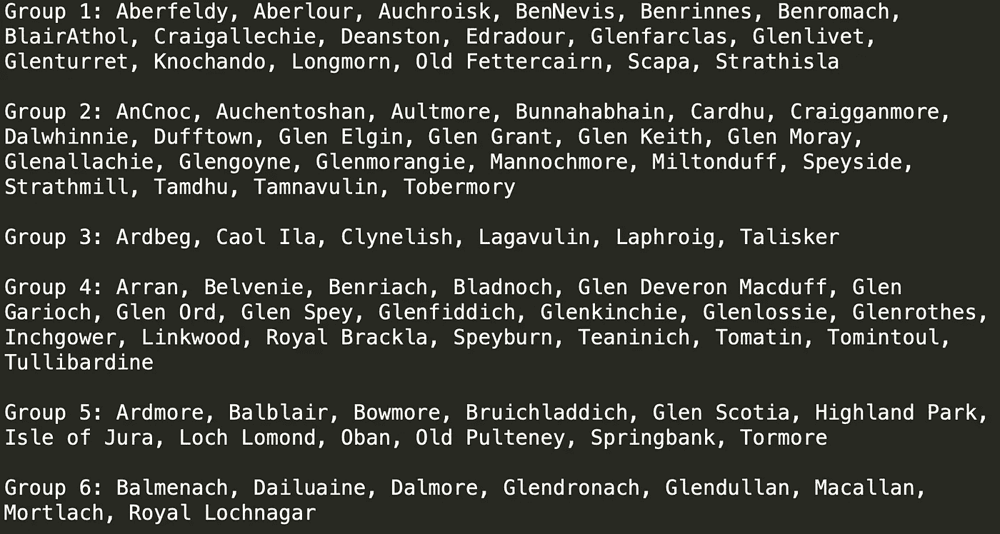

K=6 时 K 均值模型的结果

我发现第三组的威士忌非常相似。第 3 组中的威士忌烟雾弥漫，我们可以看到，如果一个人喜欢 Ardbeg，他很可能会喝 Lagavulin 或 Laphroaig，因为所有这些威士忌都很有泥炭味。另一个很好的例子是第 4 组的 Glen Garioch 和 Glenrothes，这两款威士忌都含有香草和淡淡的柑橘风味。这种模式并不完美:在我看来，麦卡伦和格伦罗斯是很好的替代品，因为这两种威士忌都是在雪利酒桶中陈酿的。因此，这两种威士忌都具有非常相似的雪利酒风味，但不属于同一类。幸运的是，我们可以发现来自同一组的达尔莫尔含有丰富的水果，雪利酒是麦卡伦的一个很好的替代品；至少模型是有用的。

阿伯丁郡是格伦·加里奥奇的家乡

与树状图相比，这种方法更容易理解，因为我们只需读取同一组中威士忌的列表。解释和训练苏格兰销售人员阅读清单要容易得多。

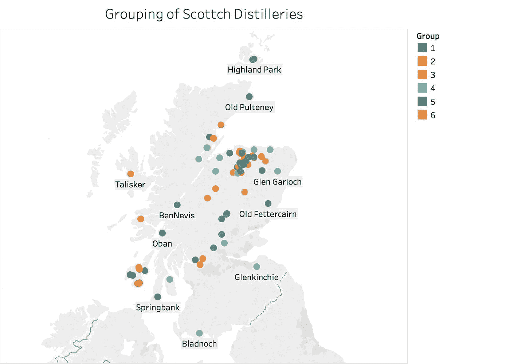

苏格兰地图上 K=6 时 K 均值模型的结果

如果我们有更多的威士忌数据，我们可以简单地用原始数据集附加观察值，并重新聚类 K 均值模型。该算法能够将新的威士忌数据与具有相似口味的原始数据进行聚类。

K 均值模型实现了我们的目标:我们能够从一种威士忌中推荐具有相似风味的威士忌，并且这种模型能够用原始数据集识别新的威士忌数据。因此，我们可以将该模型用于我们的苏格兰威士忌推荐系统。

**冷启动问题**
让我们重新考虑一下我们一开始的场景。我们一直在讨论，如果消费者至少有一种他/她喜欢的威士忌，如何推荐一种威士忌。但是，如果一个消费者以前从未喝过 whisk(e)y，如何向他/她推荐喝什么呢？这是推荐一款威士忌时的经典问题。回答这个问题，考虑两种情况:
1。能够描述他/她喜欢什么的人，如葡萄酒爱好者。
2。这个人不知道从哪里开始。

了解这个人喜欢什么是非常重要的，因为这给了你推荐什么威士忌的方向。例如，根据苏格兰威士忌的经验，南欧人很可能能够描述他/她喜欢什么，因为他们丰富的烹饪和饮料文化提供了描述他们拥有或喜欢的食物或饮料的训练。如果他们喜欢果味葡萄酒，你可能会比他们更喜欢果味威士忌。在我们的应用程序中，如果我们没有最喜欢的威士忌，我们可以使用 choose the desired flavor 并提供一个符合标准的威士忌列表。

没关系，威士忌的清单不属于同一个组。我们的目标是找到人们最喜欢的第一种威士忌。一旦我们有了他/她心目中的第一款威士忌，我们就会推荐与我们推荐的第一款威士忌相似的第二款威士忌。

如果这个人不知道从哪里开始，我们会推荐一种不喝威士忌的人都知道的威士忌，并且不含太多刺激性的味道。在这种情况下，如果他/她想要单一麦芽威士忌(或混合威士忌的约翰尼·沃克)，我会建议他/她从麦卡伦开始。有几个原因:首先，麦卡伦非常有名，给了苏格兰威士忌初学者信心。第二，我们必须避免烟雾弥漫的威士忌。苏格兰威士忌的经验分享了这个行业的经验，即除非这个人明确表达了他/她的兴趣，否则绝不建议使用烟熏或泥炭威士忌。许多不喝威士忌的人讨厌威士忌，因为有人向他们推荐了烟熏威士忌或泥炭威士忌，他们就再也不会回来了。虽然这样的风味区分了苏格兰威士忌性格的独特性，但并不是所有人都喜欢它，因为这个性格太咄咄逼人了(意思是没有 Islay 威士忌)。麦卡伦是一种斯佩塞德威士忌，烟味不大。第三，麦卡伦以其雪利酒风味而闻名，这种风味为饮酒者提供了一种水果和甜味的口感，这对于威士忌初学者来说更容易接受(人们通常喜欢更甜和水果味的饮料)。

**应用**

一旦我们弄清楚使用什么工具和算法，并准备好数据，我们就可以将酿酒厂分成 6 组，并使用结果来推荐威士忌。我们可以构建一个应用程序，允许推荐者获取威士忌列表进行推荐。当我们推荐威士忌时，有三种情况我们必须考虑。消费者有他/她最喜欢的威士忌，并希望找到一种类似的。
2。消费者不知道任何威士忌，但他/她知道他/她喜欢什么口味。
3。消费者什么都不知道。

案例 1:消费者有他/她最喜欢的威士忌，想找一款相似的。

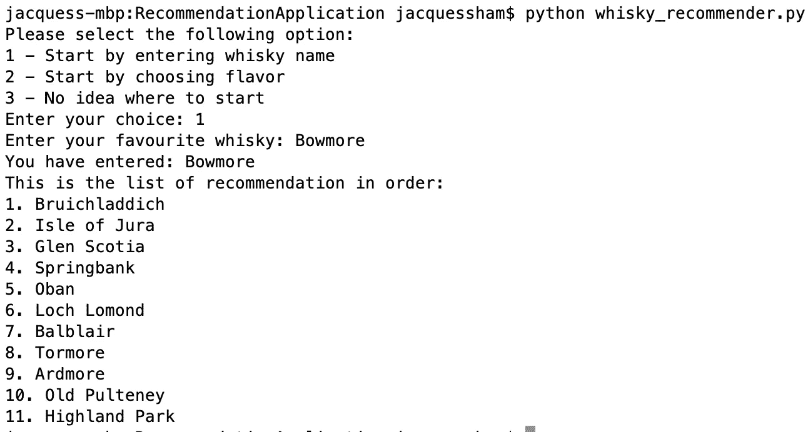

如果我输入 Bowmore，应用程序会列出这样的结果

在这种情况下，我们简单地推荐一种与威士忌消费者喜欢的威士忌非常相似的威士忌。该应用程序将返回同一组威士忌的列表。列表有两种排序方式。

我们假设如果两个酿酒厂彼此靠近，威士忌就有相似的味道。威士忌列表将按照输入的威士忌和类似威士忌之间的物理距离来排序，以反映该假设。

例如，如果我们输入“Bowmore ”,应用程序将返回类似威士忌的列表。因为 Bruichladdich 是离 Bowmore 最近的酿酒厂，所以，Bruichladdich 排在了名单的第一位。

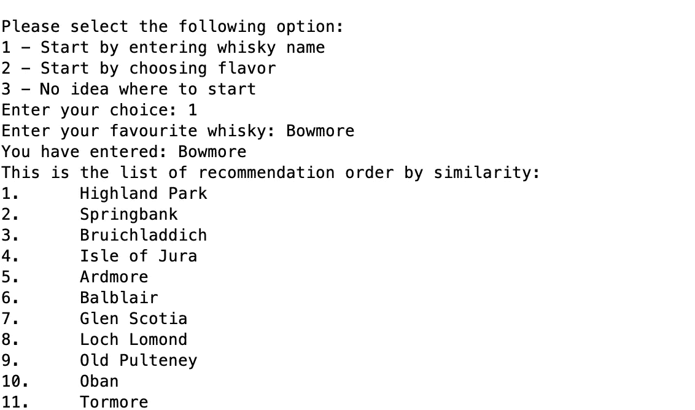

如果我进入鲍莫尔，高地公园的味道和鲍莫尔很像

另一种方法是根据味道的相似性进行分类。相似性通过量化的风味和特征(两种威士忌的风味和特征的标准)的欧几里德距离来计算。

比如我们输入“Bowmore”，列表会按照 Highland Park，Springbank…等进行排序，因为 Bowmore 和 Highland Park 之间的风味和人物欧氏距离最短，其次是 spring bank。这是一个更好的方法，因为列表是按照威士忌的含量排序的。

案例二。消费者不知道任何威士忌，但他/她知道他/她喜欢什么口味。

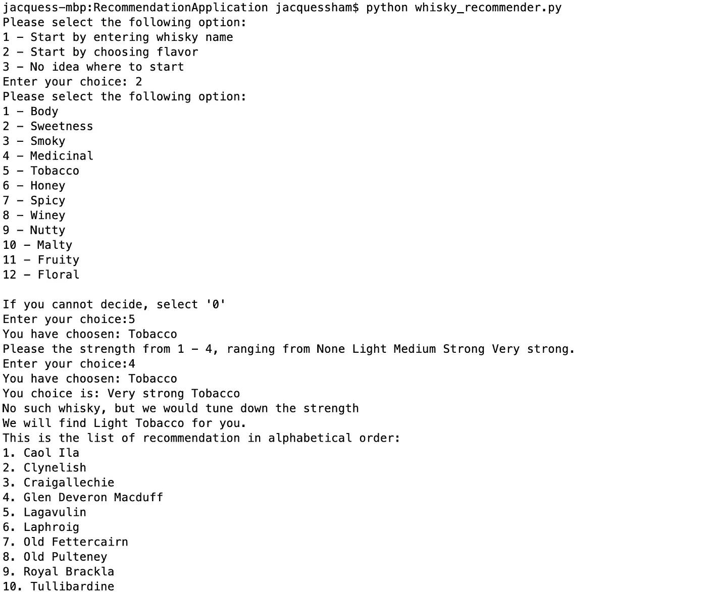

在对特征进行挑选和评分后返回列表

在这种情况下，我们的目标是找出最符合消费者偏好的威士忌。该应用程序将列出我们在数据集中拥有的所有功能，并要求消费者选择一个，并在 1-4 之间评分(不能选择 0)，分数代表:轻，中，强和非常强。

一旦消费者选择了该功能并对其评分，应用程序就会过滤出符合消费者偏好的威士忌列表。

如果我们没有任何符合要求的威士忌，应用程序会降低分数以返回一个味道较淡的列表(我们假设人们更可能接受较淡的味道而不是较重的味道)。例如，在我们的数据集中，没有一种威士忌的烟草得分为 4。如果我们输入这个，应用程序会通知我们它会降低分数，并返回一个烟草分数低于 4 的威士忌列表。威士忌的清单是按字母顺序排列的，很可能不在同一个组中。从这里开始，它需要推荐者和消费者之间的工作，通过推荐者的领域专业知识来找出消费者喜欢哪种威士忌。然而，该应用程序使推荐者的生活变得更容易，因为该应用程序已经从一个更大的选择池中筛选出一个更小的列表。

3.消费者什么都不知道。

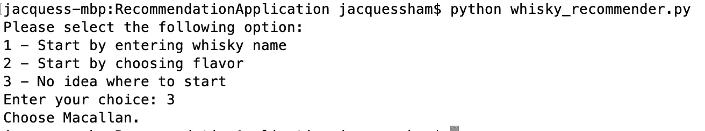

如果不知道，选择麦卡伦！

正如我们已经讨论过的冷启动问题，如果消费者对威士忌没有概念，也没有选择口味，那么推荐我们讨论过的麦卡伦！

是的，我没有在 GUI 中构建这个应用程序，我也不打算这样做。该应用可以嵌入到网站或其他应用中。

**该模式/应用的缺点和思考**

这种模式存在问题。
1。对每个酿酒厂的一个观察

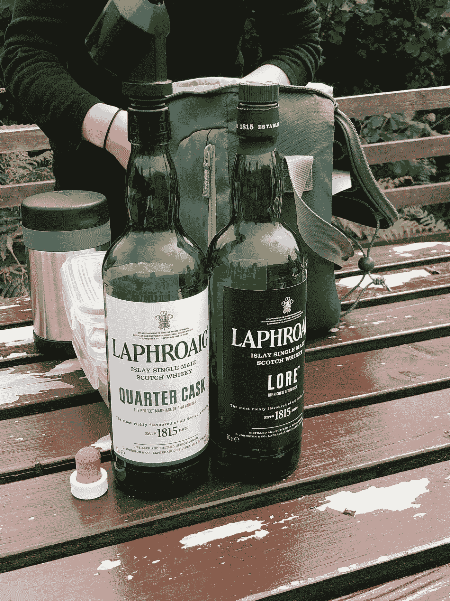

Lore 的味道非常甜，与 10 年的标签不同

数据集只提供了每个酒厂的概况。例如，在 Laphroaig 中有很多标签。我们来对比一下 Laphroiag 10 年和 Laphroaig 绝杀。虽然两种标签都是泥炭味，但 10 年标签提供了一种侵略性的烟熏味以及海藻和梨的味道，而 Lore 标签的味道类似于波特酒，并提供了相对水果味。如果一个人喜欢绝杀的标签，他/她可能不喜欢 10 年的标签；当推荐 Laphroaig 时，这个人可能不喜欢 Laphroaig 中的每个标签。

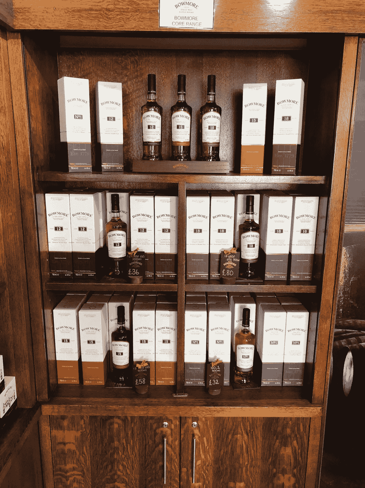

甚至有人建议你买一瓶 Bowmore，但我该挑哪一瓶呢？

2.数据是如何收集的？
人们关心的是如何获得特征的得分。如果分数是由一个以上的评委投票，我们会担心评委的不同观点可能会导致不准确的评分。但是，即使分数是由一个裁判指定的，我们也会担心裁判在指定分数时可能会有偏差。因此，我们必须意识到数据质量可能达不到我们的预期，从而导致对模型/应用程序性能的担忧。使用模型/应用程序时，用您在苏格兰威士忌领域的专业知识验证结果。

3.只有单一麦芽威士忌可用
数据集中只有单一麦芽威士忌数据可用。如果我们加入混合苏格兰威士忌，我们就没有机会检验其性能。

4.仅限苏格兰威士忌
这是一个基于内容的推荐系统。从根本上说，爱尔兰威士忌与苏格兰威士忌的制作方式不同。因此，不建议添加爱尔兰威士忌、美国威士忌、波旁威士忌或日本威士忌的数据，因为这些威士忌的总体特征与苏格兰威士忌不同。例如，波旁威士忌需要在新桶中陈酿，但苏格兰威士忌很少在新桶中陈酿，因为波旁威士忌和苏格兰威士忌的陈酿理念不同。因此，波旁威士忌具有侵略性的特征，而苏格兰威士忌则具有温和的味道。我认为这个数据集中的合格风味不能反映这种差异(更不用说波旁威士忌和苏格兰威士忌之间有更多不同的特征)，因此，建议将数据仅限于苏格兰威士忌。

**结论**
推荐威士忌从来都不容易。我们已经成功地通过数据科学找到了推荐威士忌的方法。当我在浏览探索推荐威士忌的最佳模式的步骤时，它让我想起了数据科学的三个核心要素——计算机科学、统计学和领域专业知识。即使我们已经使用了大量的量化指标来评估模型，即使模型在统计上有很好的性能，但最终的评估仍然需要我们的领域专业知识，因为我们需要通过领域专业知识来确定模型是否有用。它提醒我们，领域专业知识与数据科学中的计算机科学和统计学一样重要，因为我们经常不重视领域专业知识的重要性。

苏格兰艾莱岛的鲍莫尔酿酒厂

这个项目是一个很好的体验，因为它提供了另一个视角来看待苏格兰威士忌之间的相似性。在做这个项目之前，我认为所有的 Islay 威士忌都非常相似；K 均值模型的结果告诉我，Bowmore 和 Laphroig 的味道并不相似。但如果我回忆起我喝鲍莫尔酒的记忆，我会发现鲍莫尔不像拉弗罗格那样多脂，而且不那么咄咄逼人。有时候，我们需要接受理解威士忌的不同视角，以避免你有的偏见。接受关于威士忌的不同意见和观点，增强你对 whish(ies/eys)的了解，并带来不同的饮用 whish(ies/eys)体验。

 [## 雅克·沙姆-旧金山湾区|职业简介| LinkedIn

### 查看雅克·沙姆在全球最大的职业社区 LinkedIn 上的个人资料。雅克有 4 个工作列在他们的…

www.linkedin.com](https://www.linkedin.com/in/jacquessham/) 

**参考**
*科林斯威士忌*

苏格兰威士忌体验:
[https://www.scotchwhiskyexperience.co.uk/](https://www.scotchwhiskyexperience.co.uk/)

苏格兰威士忌数据集:
[https://www.kaggle.com/koki25ando/scotch-whisky-dataset](https://www.kaggle.com/koki25ando/scotch-whisky-dataset)

我的 Github:
https://github.com/jacquessham/ScotchWhiskyT4

树状图使用 Plotly:
[https://stack overflow . com/questions/45847791/create-dendrogram-using-Plotly](https://stackoverflow.com/questions/45847791/create-dendrogram-using-plotly)
[https://plot.ly/python/dendrogram/](https://plot.ly/python/dendrogram/)

肘方法:
[https://blog . Cambridge spark . com/how-to-determine-the-optimal-number-of-k-means-clustering-14f 27070048 f](https://blog.cambridgespark.com/how-to-determine-the-optimal-number-of-clusters-for-k-means-clustering-14f27070048f)