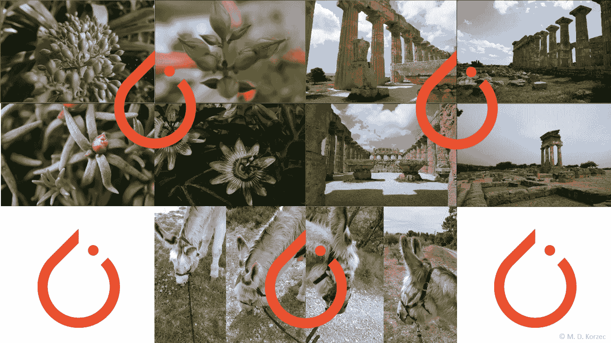
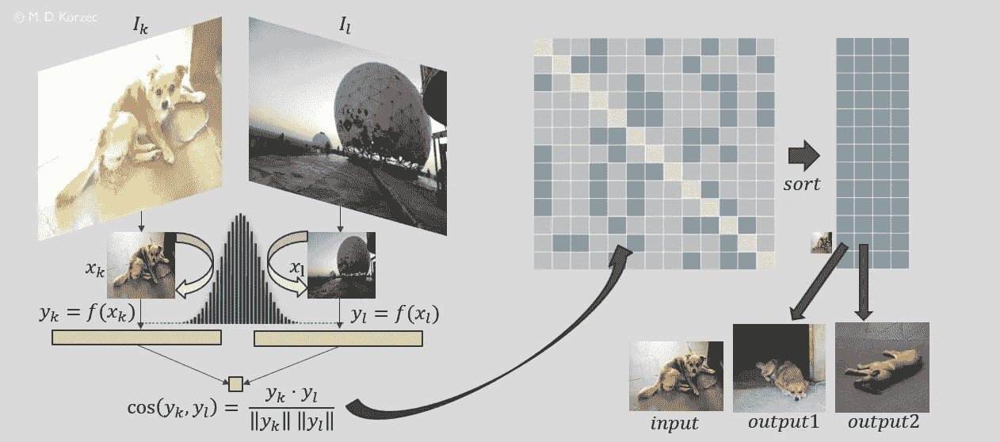
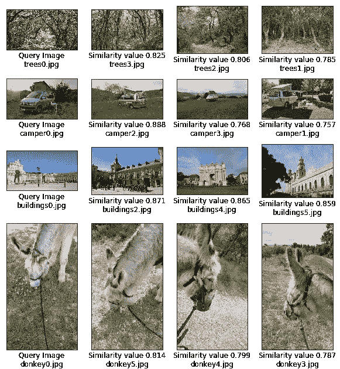

# 使用 PyTorch 推荐相似图片

> 原文：<https://towardsdatascience.com/recommending-similar-images-using-pytorch-da019282770c?source=collection_archive---------11----------------------->

## **resnet 18 的全迁移学习实现**

使用 Resnet18 特性找到了相似的图像(来源:M. D. Korzec)

[在我的上一篇文章](/effortlessly-recommending-similar-images-b65aff6aabfb)中，我们介绍了一种简单的逻辑，通过使用迁移学习，根据图像内容在大集合中为相似图像创建推荐。

现在让我们使用 PyTorch 中预训练的 Resnet18 卷积神经网络创建一个 Python 原型实现。它将获取图像文件夹的内容，并创建 k 个与输入最相似的图像的 top-k 列表。

将 Resnet18 网络用于一组固定图像的简单推荐器的基本实现将在以下步骤中导出

*0。理论倒带:图像推荐逻辑*

*1。重新调整数据*

*2。使用预训练的 Resnet18 网络作为特征向量生成器*

*3。通过计算这些向量的余弦，使用特征阵列计算相似性*

*4。创建 top-k 列表*

*5。使用 top-k 列表并可视化建议*

如果你已经读过我的前一篇文章，可以跳过第 0 步。

如果你主要对原型实现感兴趣，你可以在这里找到 Jupyter 笔记本。它涵盖了所有步骤，包括一组图像样本和推荐图像的简单可视化

# **0。** **图像推荐器逻辑**

我们希望将相似的图像推荐给参考输入，例如在线商店中的推荐者。相似性是基于像素内编码的信息，而不是其元数据。

假设您已经在一个包含 jpg 图像的文件夹中收集了数据。然后，我们对图像进行预处理，以符合所选网络的输入要求(例如，Resnet18 的大小调整为 224x224 RGB 图像)，我们使用所选网络计算大小调整后的图像的特征向量，我们基于余弦相似性计算相似性，并存储用于推荐的 top-k 列表。最后，我们使用列表进行推荐。

以下示意图总结了所有步骤

完整的图像推荐系统示意图(来源:M. D. Korzec)

核心步骤将使用 PyTorch 来执行，py torch 是 Python 中的一个开源机器学习框架。它伴随着各种各样的卷积网络和来自对巨大数据集的预训练的权重。

# **1。** **预处理**

图像文件夹应位于工作目录中。为了满足 PyTorch 卷积网络的输入要求，独立于网络，我们从 [PyTorch 主页](https://pytorch.org/docs/stable/torchvision/models.html)了解到，对于所有模型，我们需要以相同的方式归一化输入图像，以正确使用预训练的权重。输入需要

*   至少具有 224x224 分辨率
*   是 RGB 图像(即三个颜色通道)
*   具有在[0，1]范围内的图像值
*   考虑具有平均值[0.485，0.456，0.406](每个颜色通道一个值)和标准偏差[0.229，0.224，0.225]的归一化图像。

为了重新缩放图像，我们可以如下进行:定义变换，迭代输入目录中的所有图像名称，加载图像，应用变换，将变换后的图像与其方向信息一起存储

规范化是在 next 后面的转换类的构造函数中执行的。

# **2。使用预训练的 Resnet18 网络作为特征向量生成器**

为了从重新缩放的图像中生成特征，我们在构造函数中设置了一个包含网络相关信息的类

*   ToTensor 变换在每个通道中取值为 0 到 255 之间的 H x W x C 形式的图像，并将其压缩为 C x H x W 形状的 torch 张量，值为[0，1]。
*   归一化操作采用图像的每个通道，并计算(图像-平均值)/std
*   私有方法 getFeatureLayer(self)返回特征层，即平均池层。它是小分类向量之前的最后一个完全连接的层，并且是通过模型获得的。_modules.get('avgpool ')

公共方法 getVec(self，img)从图像输入中创建特征向量。它使用定义的设备(cpu)。一个函数被挂接到网络的转发调用，以从相关层复制数据。因此，最终包含相关信息的嵌入张量需要具有层的格式。

现在，为所有图像创建特征向量已经万事俱备。它们被收集在 allVectors 集合中。

# **3。使用特征数组通过计算这些向量的余弦来计算相似度**

在我们计算完所有的特征向量之后，是时候计算它们之间的余弦值了。因为我们仅通过内积和归一化来计算相似性值，所以这是一个使用基本 NumPy(数字线性代数库)功能的函数调用。矩阵存储为 Pandas DataFrame(二维表格数据结构)

请记住，存储整个相似性矩阵是大规模使用的瓶颈——需要一些更精细的方法。

# **4。使用最佳建议列表**

对于前 k 个(k 个最相似的图像)列表，熊猫数据帧从相似性矩阵创建，该矩阵包含与输入相似的名称和相应的相似性值。

tqdm 用于获得一个进度条，当你想处理许多图像时，这很有用。

# **5。** **使用 top-k 列表并可视化推荐**

在最后一步中，您应该能够看到与请求的输入类似的图像。

让我们将它用于存储库中提供的一些图像

资料来源 M. D. Korzec

# **期末笔记**

有了上面的解释和代码，你应该已经掌握了使用 PyTorch 的预训练卷积网络为相似图像创建推荐系统所需的所有基础知识。完整代码可从[下载](https://github.com/MathMagicx/JupyterNotebooks/tree/master/ImageRecommenderResnet18)。

如果你想用不同的型号，在 [PyTorch 网站](https://pytorch.org/docs/stable/torchvision/models.html)上有描述。当你想创建更多的实验时，把代码模块化，只把网络及其层当作参数。当创建具有较大集合的实验时，建议存储中间结果，例如作为 pickle 文件。

如果你问自己如何运营一个包含这种推荐者的网站，你可能想看看我的后续文章。

# 感谢阅读！喜欢这个话题吗？

如果你觉得这篇文章很有趣，你可能想看看我在这个主题上的其他文章:

 [## 轻松推荐相似图片

### 使用来自训练的卷积神经网络的特征来产生可比性

towardsdatascience.com](/effortlessly-recommending-similar-images-b65aff6aabfb)  [## 一个推荐图片的 Flask 应用程序

### PyTorch 中基于卷积神经网络的相似图像推荐网站原型

medium.com](https://medium.com/@maciek.korzec/a-flask-app-for-image-recommendations-a865e1496a0d)  [## py torch+Flask+PostgreSQL+Heroku 部署的映像建议

### 用 Flask 封装一个基于 PostgreSQL/ PyTorch 的图像推荐系统，导入数据并在 Heroku 上运行

towardsdatascience.com](/image-recommendations-with-pytorch-flask-postgresql-heroku-deployment-206682d06c6b)