# 用机器学习推荐川普的下一个朋友

> 原文：<https://towardsdatascience.com/recommending-trumps-next-friend-with-machine-learning-6317cdc640c3?source=collection_archive---------46----------------------->

## 使用图论链接新闻预测


# 序文

我们能预测哪些人会出现在明天的新闻报道中吗？可以为名人推荐好友*吗？敬请期待一探究竟。*

撇开 90 年代美国电影预告片风格的介绍不谈——这篇文章是我上一篇文章的延续，所以我建议[浏览一下，以便更好地理解](/building-a-social-network-from-the-news-using-graph-theory-by-marcell-ferencz-9155d314e77f)。对于懒惰的数据科学家，这里有一个简短的总结:

*   我们从一些顶级(最受欢迎的)英国在线报纸上搜集了一些文章
*   我们使用命名实体识别来识别每篇文章中的人和组织
*   我们从数据中创建了一个网络结构，如果实体出现在同一篇文章中，就将它们链接起来
*   我们做了一些其他的很酷的东西，在这里不相关

然而，现在我们将从描述性统计的舒缓运河中冒险，驶向预测性分析的危险海洋。如果你曾经看过顾问最喜欢的数据分析成熟度图，你会知道这不是一个小跳跃。不过没关系，我们会手拉手活着度过难关的，我保证。

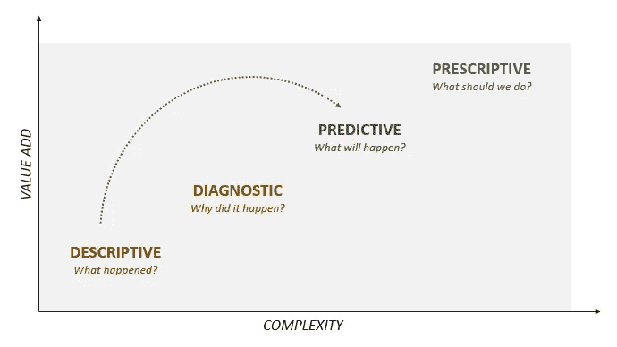

我们在成熟度矩阵上的重大飞跃——螺旋诊断

我们将把我们的社交网络中的人和组织放在新闻中，并试图预测我们的数据中正在形成的新链接，以暗示谁可能在明天的新闻中一起出现。

# 为什么

谁不想扮演马克·扎克伯格呢？谁*不会*想预测谁会一起出现在新闻上？

虽然，正如我们将看到的，这个消息太过狂野，无法完美预测，但我们可以获得关于一个组织与另一个组织或个人相关联的可能性的有价值的见解，这可以告诉我们，例如，我们的客户可能会将我们与谁相关联——有意识地或无意识地。

除此之外，一般实践链接预测还有广泛的使用案例:

*   **向脸书或 Instagram 等社交网络的用户推荐朋友**
*   **向亚马逊或网飞等平台上的用户推荐产品**
*   **预测生化网络中的相互作用**，如蛋白质-蛋白质相互作用
*   **预测疾病在人群中的传播**

# 什么

## 链接预测

链接预测是评估图中两个节点形成连接的可能性的分析方法。目标是通过分析图的结构来预测动态网络中形成的下一条边。

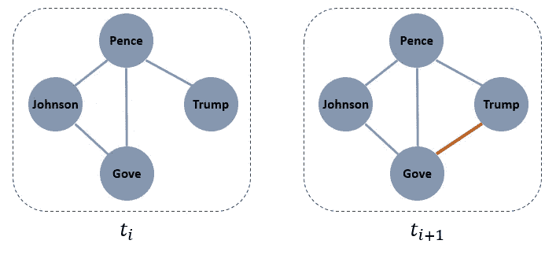

网络中形成链路的示例

我们举一个熟悉的例子。给定一个在时间 *t(i)* 的 4 个人的社交网络，目标是找到该网络在未来某个时间 *t(i+1)* 的结构。听起来很简单，对吧？事实证明，我们最终使用的算法*将*非常简单——魔鬼总是存在于细节中。挑战在于恰当地表述问题。

## 分类

让我们从最后开始，倒推。我们想要结束的是一个潜在的新链接正在形成的数据集，我们可以在其上训练一个分类器。我们将取图中所有尚未连接的线对，并检查它们是否在时间 *t(i+1)形成了连接。*对于上面的示例图，它看起来像这样:

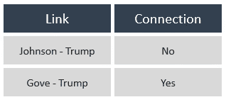

我不知道你怎么想，但在我看来这很可疑，像是一个二进制分类问题。唯一的问题是，我不知道有任何分类器可以在我们上面的 *Link* 专栏中成功训练，更不用说愿意接受它作为输入了。不，我们需要比这更好的功能。戴上你的工程帽。

## 特征工程

幸运的是，在为机器学习做准备时，有许多方法可以为图中的边创建特征。也许在最近的时间里，最受欢迎的是 *node2vec* [(Grover 等人，2016)](https://cs.stanford.edu/~jure/pubs/node2vec-kdd16.pdf) 方法。在名称和思想上与 *word2vec* 相似，该算法使用图上的随机行走来创建其节点的向量表示。听起来很酷，对吧？太糟糕了，因为我们不会用到它。

*注:我对 node2vec 没有任何意见。事实上，我非常希望它能起作用。不幸的是，当在我的图表上训练时，测试数据集上的预测结果非常糟糕。我怀疑我可能需要走更长的路，因为我的图表非常大；但是训练已经花了很长时间，时间是宝贵的。如果你有任何建议，请告诉我。*

我们将坚持使用更传统的方法，一个接一个地生成一些特性。从 2004 年的[李奔-诺埃尔那里得到灵感，我们将计算我们每个边的一些属性。看看这些老伙计们:](https://www.cs.cornell.edu/home/kleinber/link-pred.pdf)

**优先连接** ( [于勒，1925](https://royalsocietypublishing.org/doi/10.1098/rstb.1925.0002) ) —这位 95 岁的老兵听起来很奇特，但在我们的图形世界中，它代表了给定节点对中每个节点的邻居数量的乘积。基本观点是，拥有更多朋友的人更有可能结交更多朋友——因此，两个都有很多朋友的人会有较高的偏好依恋分数，从而有可能彼此建立联系。

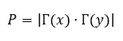

**Jaccard 系数** ( [Jaccard，1901](https://www.researchgate.net/publication/225035806_Etude_de_la_distribution_florale_dans_une_portion_des_Alpes_et_du_Jura))——记录了 119 岁的高龄，在此过程中几乎没有错过 19 世纪，我们有 Jaccard 先生的指数。Jaccard 系数通过一系列替代应用为许多人所熟悉，但在我们的上下文中，它将表示两个节点之间的公共邻居与这两个节点总共拥有的邻居数量的比率。

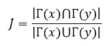

Adamic/Adar 指数 ( [Adamic，Adar，2003](https://www.semanticscholar.org/paper/Friends-and-neighbors-on-the-Web-Adamic-Adar/8dc9d11e3fc229a1b70bb00de72dc15d55848174))——和老伙计们一起闲逛，不能在酒吧点啤酒，就是 Adamic/Adar 指数。与 Jaccard 索引类似，该功能通过邻居拥有的邻居数量的倒数来为节点对的每个公共邻居增加权重。

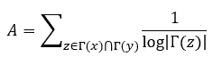

**共同邻居** —简单来说就是两个节点拥有的共同邻居的数量。不废话。

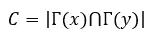

收集了一组很好的特征后，我们可以将它们添加到之前的表中:

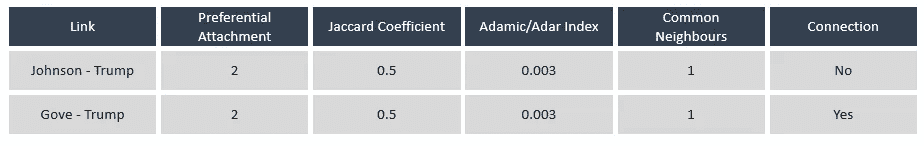

要素表示例-代表值(大部分)

这开始看起来像是我们可以训练机器学习模型的东西(假设这些值在真实数据上有实际差异)！

但是我们如何建立我们的训练数据集呢？

## 培训用数据

我们的目标是，给定某一天社交网络的状态，预测网络中正在形成的新链接。我们所要做的就是在第一天检查每一对尚未连接的节点，并计算它们的上述特征。然后，我们将在第二天观察同一个网络，看看它们中是否有人形成了新的联系。因此，我们可以将第二天形成连接的未连接对标记为阳性，其余的为阴性。

我们可以连续几天重复这一过程，感受网络如何随着时间的推移而演变，并将结果串联起来。下图说明了这一想法:

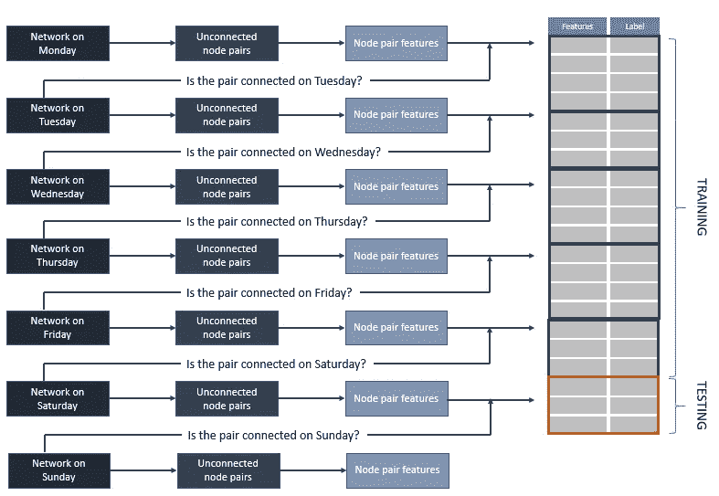

最后，我们将把最后一天的预测分离出来作为一个测试数据集，看看我们的模型在一个看不见的日子里表现如何。

# 怎么做

我们将用现实生活中的数据来演示我上面概述的概念。这次我们将前后工作。

## 培训用数据

在我之前的文章中，我已经展示了我是如何通过识别出现在 3 月 26 日同一篇新闻文章中的实体对来构建“社会”链接的。在接下来的 6 天里，我重复了同样的练习，一直到 4 月 1 日。这让我获得了超过 400，000 个(非唯一的)链接，分布在一周内，如下所示:

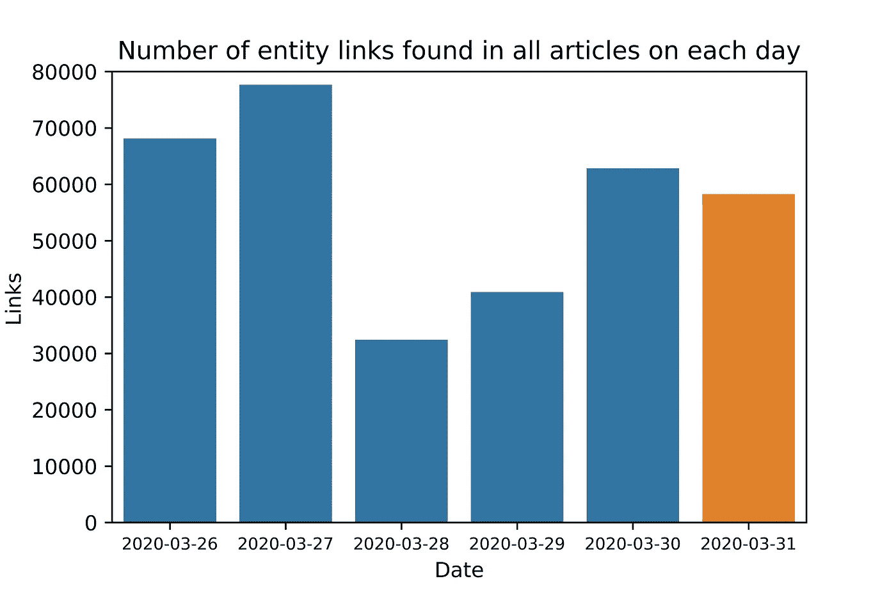

每天的实体链接总数

我故意没有想象第 7 天，因为我们不会从那创建一个图表，我们将只检查与第 6 天相比新形成的链接。

为了演示起见，我们将在第一天演练一下这个练习。

让我们通过导入包含所有链接的 CSV 来构建训练数据集，在第一天进行过滤，并将相同的链接分组在一起，根据计数为它们分配权重。我还将丢弃任何只出现过一次的链接，将重点放在更突出的链接上:

```
import pandas as pd
import numpy as npdf_links = pd.read_csv('/content/drive/My Drive/News_Graph/links.csv')date = '2020-03-31'df_links_train = df_links[df_links['date']==date]df_links_train = df_links_train.groupby(['from', 'to']).size().reset_index()df_links_train.rename(columns={0: 'weight'}, inplace=True)df_links_train = df_links_train[df_links_train['weight'] > 1]
```

接下来，我们将从结果链接中构建一个图结构，然后找到最大的连通子图——这是计算我们的特征的一个要求。我们会发现，无论如何，95%以上的节点全天都是连接的。

```
import networkx as nxG = nx.Graph()for link in tqdm(df_links_train.index):
  G.add_edge(df_links_train.iloc[link]['from'],
             df_links_train.iloc[link]['to'],
             weight=df_links_train.iloc[link]['weight'])subgraphs = [G.subgraph(c) for c in nx.connected_components(G)]subgraph_nodes = [sg.number_of_nodes() for sg in subgraphs]sg = subgraphs[np.argmax(np.array(subgraph_nodes))]df_links_sg = nx.to_pandas_edgelist(sg)G = nx.Graph()for link in tqdm(df_links_sg.index):
  G.add_edge(df_links_sg.iloc[link]['source'],
             df_links_sg.iloc[link]['target'],
             weight = df_links_sg.iloc[link]['weight'])
```

上面的步骤产生了一个图， *G* ，它包含了一个加权的无向图，该图封装了代表 3 月 26 日新闻的“社交网络”的最大连通子图。具体来说，它在 2，183 个节点之间包含 8，045 条边。

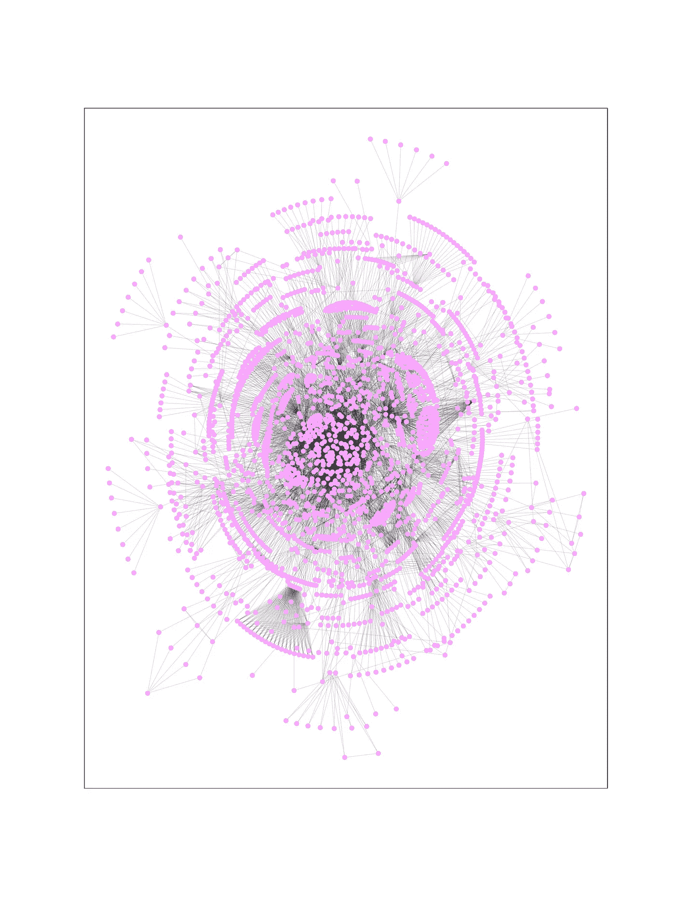

3 月 26 日新闻的网络情节

*很美，不是吗？虽然不是很有用。让我们看看我们是否能找出这些粉红色的家伙第二天会交朋友。*

与之前类似，我们定义了一个按出现次数加权的链接数据集，但这次我们还过滤了前一天两个实体都出现在网络中的链接。之后，我们将从 27 日的网络中移除所有在 26 日已经出现的链接，因此这些链接不是新形成的边。最后，我们将剩余的链接标记为 1，以表示新形成的链接:

```
date_target = '2020-03-27'df_links_tar = df_links[df_links['date']==date_target]
df_links_tar = df_links_tar.groupby(['from', 'to']).size().reset_index()
df_links_tar.rename(columns={0: 'weight'}, inplace=True)
df_links_tar = df_links_tar[df_links_tar['count'] > 1]
df_links_tar.reset_index(drop=True, inplace=True)# filter to only include nodes which exist in training dataall_nodes = G.nodes()df_links_tar = df_links_tar[(df_links_tar['from'].isin(all_nodes)) & (df_links_tar['to'].isin(all_nodes))]# create edge columns and filter out those who also appear in training datadf_links_tar['edge'] = df_links_tar.apply(lambda x: x['from'] + ' - ' + x['to'], axis=1)df_links_sg['edge'] = df_links_sg.apply(lambda x: x['source'] + ' - ' + x['target'], axis=1)# remove edges which exist in training datadf_links_tar = df_links_tar[~df_links_tar['edge'].isin(df_links_sg['edge'])]# label remaining edges with 1df_links_tar['label'] = 1
```

通过上述步骤，我们产生了具有 2183 对实体的数据帧，这些实体在 26 日还没有形成链接，但是将在 27 日形成一个链接，并且用 1 标记它们。那些 27 号*不会*形成链接的呢？

嗯，就我们所知，理论上来说，我们图中的任何一对未连接的对都可能在第二天形成一个连接。因此，我们需要从 26 日开始在图中找到两个节点的所有可能组合，这些组合还没有包括在我们在 27 日确定为形成链接的对中，并将它们标记为 0。

> 让我们在这里停下来想一想。

我们的图表中有 2382 个实体，我们知道其中的 2183 对将形成一个新的链接。有多少人不会呢？有大量的可能性:确切地说，是 2382-choose-2。这个数字接近 300 万，这意味着阳性样本与阴性样本的比例将低于 1:1000！这是一个非常不平衡的数据集来训练分类器。我们有几个选项来处理这个问题，但是对于这个练习，我选择对我的数据进行下采样，因为我知道当我完成整个星期的时候，我可能会有相当多的行。

*注意:这可能不是最佳实践——我主要是出于演示的目的使用下采样，以减少特征工程和模型训练的时间。类似 SMOTE 的东西在这里可能更合适。*

我们将找到网络中所有可能的节点组合，去除那些在 26 日有链接的节点和那些将在 27 日形成链接的节点。然后，我们将从这些未连接的对中随机抽取一个 *9x2，183* (新形成链接数量的九倍)的样本，给我们一个 1:10 的训练比——好得多。

```
from itertools import combinationscombs = list(combinations(all_nodes, 2))all_combinations = pd.DataFrame(data=combs, columns=['from', 'to'])all_combinations['edge'] = all_combinations.apply(lambda x: x['from'] + ' - ' + x['to'], axis=1)all_combinations = all_combinations[~all_combinations['edge'].isin(df_links_sg['edge'])]all_combinations = all_combinations[~all_combinations['edge'].isin(df_links_tar['edge'])]all_combinations.reset_index(inplace=True, drop=True)sample_size = 9*len(df_links_tar.index)all_combinations = all_combinations.iloc[np.random.choice(len(all_combinations.index),
     size=sample_size,
     replace=False)]all_combinations['label'] = 0
```

最后，我们连接两个数据帧:

```
edges_to_predict = all_combinations.append(df_links_tar[['from', 'to', 'edge', 'label']])
```

数据帧 *edges_to_predict* 将包含所有新链接的列表，标记为 1，以及不会形成链接的边对样本，标记为 0。

## 特征工程

我们还记得，为了创建特征，我们需要计算每对训练数据的*共同邻居的数量、*JAC card 系数、 *Adamic/Adar 指数*和*偏好连接分数*。在这方面，NetworkX 库将是我们最好的朋友。我们所需要做的就是创建一个节点对的 *bunch* ，也就是一个元组列表来标识每个节点对的源和目标:

```
bunch = [(source, target) for source, target in zip(edges_to_predict['from'].values, edges_to_predict['to'].values)]
```

特征计算简单得可笑:

```
# Preferential Attachmentpreferential_attachment = nx.preferential_attachment(G, bunch)pref_attach = []for u, v, p in preferential_attachment:
  pref_attach.append(p)edges_to_predict['preferential_attachment'] = pref_attach# Jaccard Coefficientjaccard_coefficient = nx.jaccard_coefficient(G, bunch)jaccard = []for u, v, p in jaccard_coefficient:
  jaccard.append(p)edges_to_predict['jaccard_coefficient'] = jaccard# Common Neighbourscn = []for source, target in zip(edges_to_predict['from'].values, edges_to_predict['to'].values):
  cn.append(len(list(nx.common_neighbors(G, source, target))))edges_to_predict['common_neighbours'] = cn# Adamic Adar Indexadamic_adar = nx.adamic_adar_index(G, bunch)aa = []for u, v, p in adamic_adar:
  aa.append(p)edges_to_predict['adamic_adar_index'] = aa
```

最后，我们有真正的功能和真正的目标！数据帧现在看起来像这样:

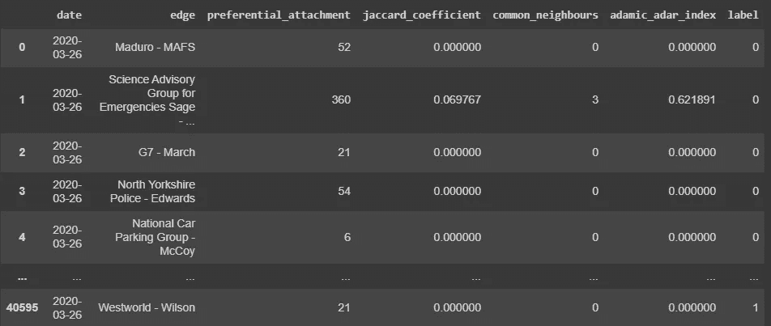

## 分类

我们准备好训练我们的机器学习模型了。在屏幕外，我们在随后的 5 天里重复了上述过程，对第 6 天的训练数据做了一点修改:在 3 月 31 日，我没有对数据进行*而不是*下采样，因为它不是我们训练集的一部分。我们需要假装不知道 4 月 1 日会形成什么联系，因此我们需要使用所有可用的数据。

我们已经在样本训练数据中看到，我们的特征列假设了变化很大的值范围。为了增强我们的学习模型，我们将使用 scikit-learn 将它们调整为平均值为零、标准差为 1 的值:

```
from sklearn.preprocessing import StandardScalerdf_test = pd.read_csv('/content/drive/My Drive/News_Graph/edges_test.csv')df_train= pd.read_csv('/content/drive/My Drive/News_Graph/edges_train.csv')features = ['preferential_attachment',
            'jaccard_coefficient',
            'common_neighbours',
            'adamic_adar_index']X_train = df_train[features].to_numpy()
Y_train = df_train['label'].to_numpy()X_test = df_test[features].to_numpy()
Y_test = df_test['label'].to_numpy()scaler = StandardScaler()X_train = scaler.fit_transform(X_train)
X_test = scaler.fit_transform(X_test)
```

提醒一下，我们正在一个*稍微*不平衡的数据集上训练一个模型，并在一个现实的、*非常*不平衡的数据集上测试:

> 训练集中阳性样本的比率:0.1。
> 测试集中阳性样本的比例:0.00092。

我们准备初始化我们的模型:逻辑回归。

*是的，逻辑回归。当我在标题中吹捧机器学习时，这不是你所期望的，是吗？我保证我尽力了——真的尽力了。我测试了一个随机森林模型，一个支持向量机，我花了一周时间调光梯度 Boosting 和 XGBoost 模型。我搜索了一个深层神经网络。他们都不能打败逻辑回归的 ROC。所以你有它。我想这很符合我的老派特征。*

```
from sklearn.linear_model import LogisticRegressionclf = LogisticRegression(class_weight='balanced')clf.fit(X_train, Y_train)lr_prob = clf.predict_proba(X_test)[:, 1]lr_pred = clf.predict(X_test)
```

*class_weight* 参数确保模型中的错误惩罚与我们数据中的正/负训练样本的比率成比例，使模型对错误的正预测更加敏感，从而提高整体性能。

让我们看看我们在测试数据上的表现。

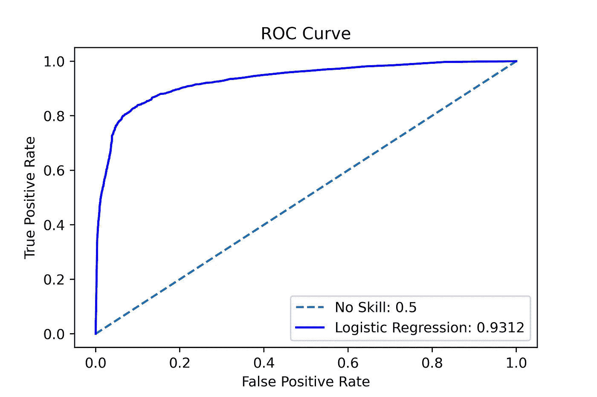

逻辑回归模型的 ROC 曲线

我们的 ROC AUC 值非常可观，为 0.9312。让我们画出混淆矩阵。

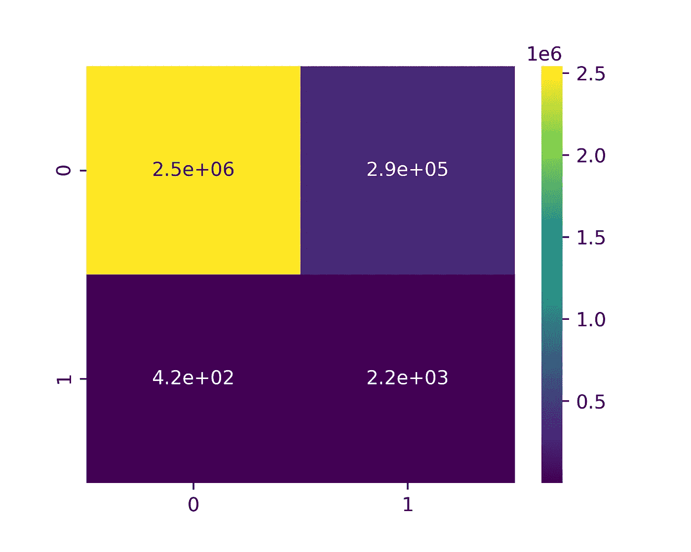

逻辑回归混淆矩阵

这允许我们计算我们的精度和召回:

**精度:**0.0076
召回: 0.8394

不错——不是很好，但也不坏。我们设法识别了几乎 84%的未来链接。然而，我们发现了如此多的潜在联系，以至于只有不到 1%的积极预测在第二天变成了现实。

# 洞察力

恭喜你又完成了一个漫长的练习；我希望这是值得的。让我们回顾一下我们所做的工作:

1.  我们已经从数千篇文章中为一周中的每一天构建了命名实体的网络表示；
2.  我们已经**建立了一个结构来训练一个模型**,通过增量识别将在我们的动态图中形成第二天的链接；
3.  我们学习了一些**图的经典特征**并计算了它们；
4.  我们已经根据我们的数据训练了一个二元分类器，并在一个未知的日子进行了测试。

## 特朗普的朋友

让我们看看我们可以推荐谁做总统，然后:

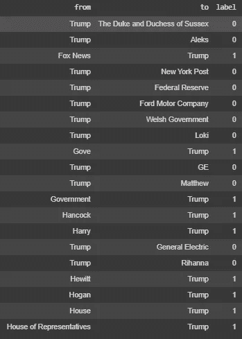

包含唐纳德·特朗普的推荐链接

这是我们预测的一个例子，其中链接中的一个实体是 Trump。这些都是模型认为会在第二天的新闻中出现的链接。标签为的列*表示它实际发生了(1)还是没有发生(0)。*

我们为 Trump 推荐了许多朋友，Trump 在下面“点击”*接受*；记住，前一天他没有和他们一起出现在新闻上:

*   福克斯新闻频道
*   迈克尔·戈夫
*   马特·汉考克
*   哈里王子
*   休·休伊特
*   拉里·霍根州长
*   众议院

## 讨论

我们的结果有多好？嗯，这主要取决于业务环境。不平衡的分类是困难的，您希望从模型中得到的结果决定了您应该关注哪个性能指标。例如，如果这是一个欺诈检测练习(另一个常见的不平衡预测任务)，我们会做得很好——如果这意味着你抓住了 84%的欺诈交易，你不会介意向你的客户发送一些假警报文本。然而，我们的目标是什么？

我们的模型非常善于识别第二天*不会*形成的链接——有很多这样的链接。不太擅长*只*识别*会*发生的环节。如果我是这里的产品负责人，我可能希望专注于精确，而不是回忆；我们的好友推荐大多数时候应该是对的，即使我们没有把所有可能的好友推荐给所有人。为此，我们可以提高肯定分类的概率阈值。这将以回忆为代价，但它将确保我们归类为积极的东西更有可能在现实中发生。

另一件要考虑的事情是朋友推荐在现实中的效果如何。Instagram 上你实际向多少比例的推荐账户*发送邀请？你在亚马逊上购买多少你推荐的产品？杰夫·贝索斯将拥有比我们更多更好的数据。在这种情况下，我认为我们做得很好。*

总而言之——事实证明，预测新闻是很难的。但是没费多少功夫，我们就设法建立了一个很好的模型来实现这个目标。

# 事后思考

我做错什么了吗？我能做得更好吗？我做得好吗？

请随时在 [LinkedIn](https://www.linkedin.com/in/marcell-ferencz-9892a3a6) 上联系我；如果你对我的工作感兴趣，我总是很乐意接受挑战或者只是聊聊天。

如果你想自己玩代码，请点击链接到我的 Google Colab 笔记本:

[](https://colab.research.google.com/drive/1y_fAm4ObJQfIeUsNIWt2izZ4pwxz_9mn?usp=sharing) [## 谷歌联合实验室

### 编辑描述

colab.research.google.com](https://colab.research.google.com/drive/1y_fAm4ObJQfIeUsNIWt2izZ4pwxz_9mn?usp=sharing) [](https://colab.research.google.com/drive/11Zrpjmkg1_tFvw8DXwdu4-YFCnlolj_a?usp=sharing) [## 谷歌联合实验室

### 编辑描述

colab.research.google.com](https://colab.research.google.com/drive/11Zrpjmkg1_tFvw8DXwdu4-YFCnlolj_a?usp=sharing)