# 调和因果关系和统计学

> 原文：<https://towardsdatascience.com/reconciling-causality-and-statistics-1dfa4ce1b465?source=collection_archive---------24----------------------->

## 介绍珀尔的做微积分用商业例子说明

[来源](https://photos.app.goo.gl/a1BjXQkFTSeRV5ac7):作者

*这是由* [*皮尔明·伦伯格*](https://www.linkedin.com/in/pirminlemberger/) *和* [*丹尼斯·奥布林*](https://www.linkedin.com/in/denisoblin/) *共同完成的。*

1.  一段风雨飘摇的关系
2.  **概括地说因果革命**
3.  **简单商业例子的因果分析**
4.  **数据科学家值得了解的东西？**

# 1.风雨飘摇的关系

考虑以下三对伴随事件:“*太阳在公鸡第一声啼叫后不久升起”*、“*当广告横幅出现在某个适当的位置时，某个网站的访问量往往会增加*”、“*皮肤癌的发病率与法国里维埃拉的冰淇淋销量相当*”。

虽然常识告诉我们，通过限制冰淇淋销售来减少癌症或通过挠痒痒让公鸡更早啼叫来加速日出的可能性很小，但尝试优化广告横幅的位置可能确实值得付出努力。因此，似乎我们对世界如何运作的直觉告诉了我们一些关于这些伴随事件的事情，这超出了单纯的统计数据所能描述的范围。统计学实际上只处理相关性，这意味着它量化了假设我们已经观察到另一个事件 a，事件 B 发生的可能性。然而，它没有告诉我们如果我们对系统采取行动会发生什么，它甚至没有提供任何手段来描述对系统的干预是什么。因此结论很简单:一般来说，我们需要的不仅仅是概率和统计来表达和回答因果关系问题。**随机对照试验** (RCT)的方法完全建立在统计分析的基础上，并被广泛认为是临床试验的黄金标准，这是一个值得注意的例外，我们将在后面详细介绍。

直到本世纪初，人们才认识到，简单的统计学天生就无法恰当地处理所有普遍性的因果关系[1]。在此之前，一场争论已经持续了近一个世纪。我们不会进入这些冗长的辩论，因为幸运的是现在已经没有争论的理由了！哲学家和统计学家 Judea Pearl 的开创性工作[1，2，3]提供了一个数学上合理的框架，允许以明确的方式阐述因果关系问题，并尽可能系统地回答这些问题，从而彻底结束了这些争论[3]。朱迪亚·珀尔在很大程度上对因果关系辩论的彻底重塑负有责任，从那时起，这场辩论被称为**因果革命**。为此以及他在人工智能因果推理方面的其他杰出成就，他获得了 2011 年图灵奖。

在我们深入朱迪亚·珀尔的因果关系概念的微妙之处之前，让我们承认，许多使用**监督的机器学习**作为他们最喜欢的工具的数据科学家从来不关心因果关系问题。事实上，他们可能会因此陷入严重的麻烦，但在我们简单提到的两种常见情况下，这仍然是一种合理的态度。

*   首先，发现两类事件之间的相关性本身就有价值。例如，了解购买了产品 A 的用户也有可能购买产品 B，可以提供对客户群体的一些洞察。重要的一点是，由这种基于相关性的预测所驱动的任何后续行动都不应该以任何方式对测量变量产生反作用。
*   第二，在其他情况下，对某个特征 *X* 的被动观察确实与我们指定该特征的值的干预具有相同的效果(对预测目标变量 *Y* )。例如，想象一下 *X* 是气泵的转速，而 *Y* 是它在一个房间内保持的压力。一旦我们通过被动观察了解了 *X* 和 *Y* 之间的关系，当我们设定泵的速度时，我们将能够预测空气压力。直观上，从 *X* 到 *Y* 的因果关系是直接的，不受干扰的。当我们在 2.4 节描述 do 演算时，我们将精确地描述这些情况的特征。

朱迪亚·珀尔的方法真正出彩的地方是在不太明显的情况下，我们想要推断在涉及其他变量 *Z* 的整个因果关系网络存在的情况下，设置 *X* = *x* 对 *Y* 的值的影响。这些其他变量通常被称为伴随变量**【4】，可以被观察到，也可以不被观察到。在最简单的版本中，回答因果问题的困难根源如图 1 所示，图 1 说明了**混杂** *Z* 的概念。**

**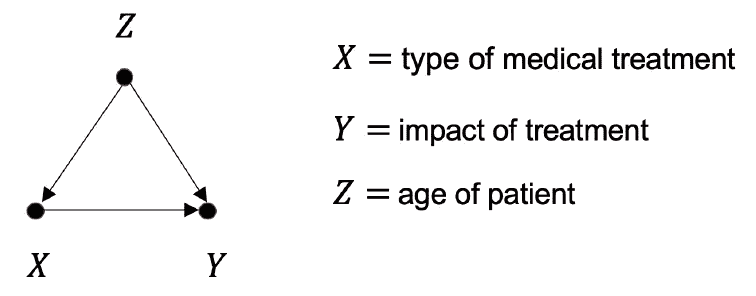**

****图 1** :假设 X 表示给病人用药的选择，Y 表示病人的健康状况，Z 表示他或她的年龄。如果医生选择他或她管理治疗的对象，那么年龄 Z 可能成为影响治疗选择 X 和健康状态 y 的混杂因素。**

**用直观的术语来说，混杂因素 *Z* 是一个变量，它可能会因为是另外两个变量 *X* 和 *Y* 的原因而阻碍对这两个变量之间因果关系的识别。由 *X* 的变化引起的 *Y* 值的观察变化也可以归因于 *Z* 的变化。然而，如果能够访问混杂因素 *Z* 的值，我们或许可以调整其影响，从而提取出 *X* 对 *Y* 的预期影响。在可能的情况下，这样做的程序为统计学家所熟知，并被命名为“**控制**用于 *Z* ”。简而言之，Pearl 的机器所实现的是这种控制程序的广泛推广:**

> **Pearl 的图形和代数工具允许我们识别可能消除两个变量 *X* 和 Y 之间因果关系的情况。只要有可能，这些工具就提供明确的公式，用于计算规定另一个变量 X 的值 X 的干预对变量 Y 的影响。这些公式合并了两种信息。首先，他们使用一些刚刚观察到的伴随 Z 的值。第二，他们利用了一个因果图 G，它概括了我们对一个感兴趣的系统中变量之间的因果关系的了解。**

**稍后我们将考虑用另一种方式来解释珀尔的作品，即作为 RCT 作品的广泛推广。**

**Pearl 的概念和计算工具有几个重要的优点:**

*   **从实践的角度来看，它们允许**预测一个干预**对一个系统的影响，而实际上不必对它执行任何动作。显然，这在我们因为道德或经济原因而无法对一个系统采取行动的情况下非常有用。**
*   **仍然从实用的角度来看，它们都以完全一致的方式**整合了关于系统测量的因果先验知识**。**
*   **从概念的角度来看，它们为因果影响和干预的含义提供了明确的定义，我们很快就会看到这一点。这个**解决了长期的因果关系争议**，并且调和了统计数据和因果关系。**

**这篇文章的续篇组织如下。第 2 节介绍了 Pearl 及其同事定义的主要概念和工具。在简要回顾了允许我们引入*d–***分离**概念的**贝叶斯网络**之后，我们定义了什么是**功能因果模型**并描述了它可以从数据中推断出来的程度。我们定义了**干预**和**可识别性**的概念。我们解释了图形**后门**和**前门**标准，这些标准允许在某些特定情况下识别因果关系。最后，我们引入了更加灵活的**做演算的规则**。第 3 节讨论了各种业务示例作为说明。最后一节提供了一些总结性的评论，并试图解释为什么在我们看来，这些工具在数据科学家群体中仍然鲜为人知。**

# **2.简而言之，因果革命**

**在本节中，我们将介绍支撑因果革命的主要**定义**和**数学结果**。我们定义什么是**因果关系**，如何以及何时从数据中识别它们。然后，我们定义了什么是**干预**，并描述了图形和代数工具，这些工具允许确定我们可以使用从纯观察收集的数据计算干预后果的情况。为了证明，我们参考了珀尔关于因果关系的书[2]和原始论文[3]。**

## **2.1 贝叶斯网络概述**

**我们将在以下小节中介绍的工具非常依赖于一种称为 *d* - **分离标准**的图形方法，这种方法允许回答随机变量组(r.v)之间的一般独立性问题。这些工具是由珀尔开创的，他提出了 T4 贝叶斯网络的概念。关于这个主题有许多好的教科书[9]，但是我们提供了一个简短的介绍，既介绍了符号，又使演示合理地自成一体。请熟悉本材料的读者跳到第 2.2 小节。**

**我们使用大写字母，如 *X* 、 *Y* 或 *Z* 来表示 r.v，粗体大写字母表示 r.v **X** =( *X* _1、 *X* _2、…、 *X* _m)的序列(或集合)，较低的索引表示 **X** 的组件。为简单起见，我们假设每个分量只取有限数量的值。这些 r.v .的相应实现将用相应的小写字母 **x** =( *x* _1、 *x* _2、…、 *x* _ *m* )表示。**

**第一步是将一个图 *G* 关联到一个概率分布*p*(**x**)=*p*(*x*_ 1， *x* _2，…， *x* _ *m* )。迭代条件概率的乘积规则，我们有:**

**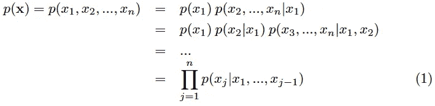**

**其中 *j* =1 的调节设置为空。现在，如果 *X* _ *j* 只以 *X* _1、…、 *X* _j-1 的子集为条件，让我们用 PA_j，即 *X* _ *j* 的**父代**来表示这个子集的最小值，这样我们就可以写出:**

**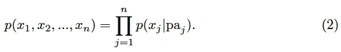**

**(2)的自然表示是使用一个**贝叶斯网络**，它是一个**有向无环图** (DAG)，其中图的每个节点对应于一个变量 *X* _ *j* ，并且一个有向链接从 PA_ *j* 的每个成员指向 *X* _ *j* ，如图 2 所示**

**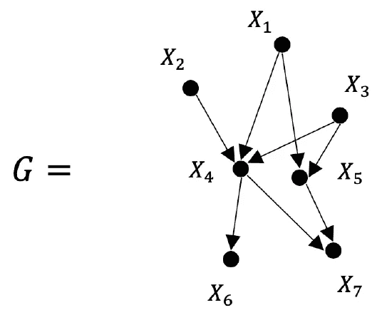**

****图 2** :一个唯一的 DAG G 可以关联到一个有序集或 r.v. X_1，…，X_n 上的概率分布 p。**

**我们说概率分布 *p* 和图 *G* 是**相容的**。还要注意，根据(1 ),与没有特定因子分解特性的一般分布 *p* 相关联的 DAG 是完全连通图。因此，DAG 中的所有信息实际上都包含在缺失的链接中。**

**对于给定的 r.v .顺序，该图 *G* 是唯一的。然而，如果我们在 *p* 中为 r.v .选择了另一个订单，我们将获得另一个图表*G’*。因此，自然产生的问题是确定何时两个 DAG *G* 和*G’***在观测上等价**。更准确地说，我们想问，与 *G* 相容的任何概率分布 *p* 是否也与另一个图*G’*相容。可以显示以下内容[2]:**

****定理 1** (观测等价):*如果满足两个条件，则两个 DAG 是观测等价的。首先，从 G 和 G’(它们的骨架)的边上去掉箭头得到的图应该是相同的。第二，G 和 G '应该有相同的 v 型结构，v 型结构是带有收敛箭头的节点，这些箭头的尾部不是由一个箭头连接的。***

**设 **X、Y** 和 **Z** 为三组 r.v .，其联合分布为 *p* ( **x** *、* **y** *、* **z** )。特别感兴趣的问题是 **X** 是否在观察 **Z** 的条件下独立于 **Y** ，即**

**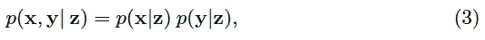**

**或者，换句话说，是否**

**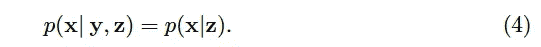**

**如果答案是肯定的，我们用(**X**‘indep of’**Y**|**Z**)来表示。下面的*d*-分离定理允许我们通过查看与 *p* 关联的图形 *G* 来图形化地回答这个问题。为此，我们需要以下图形概念:**

****定义 1** :当且仅当满足以下两个条件之一时，DAG *G* 中的一条路径 *γ* (指向任何方向的一系列连续边)被称为被一组节点 **Z** 阻塞:**

*   **路径 *γ* 包含一个**链条**(*I*→*m*→*j*)或一个**叉**(*I*↓*m*→*j*)使得 *m* 属于**
*   **路径 *γ* 包含一个**碰撞器**(*I*→*m*↓*j*)，这样 *m* 及其任何后代(如 *G* 中边上的箭头所定义)都不属于 *Z* 。**

**集合 **Z** 被称为*d*——每当 **Z** 阻塞从 **X** 中的一个节点到 **Y** 中的一个节点的每一条路径时，将 **X** 与 **Y** 分开。**

**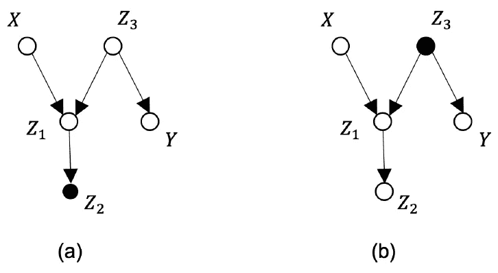**

****图 3** :观察到的节点用实心圆表示。在(a)中，从 X 到 Y 的路径既没有被 Z_2 阻挡，因为它是碰撞器 Z_1 的可观察后代，也没有被 Z_3 阻挡，Z _ 3 是不可观察的分叉。在(b)中，从 X 到 Y 的路径被 z3 阻断，因为它是一个观察到的分叉。**

**我们现在可以公式化*d*-分离准则，该准则将由相容的 DAG *G* 描述的 *p* 的因子分解性质和它们隐含的独立性关系联系起来:**

****定理 2**(*d*-分离定理):*设* **X** *，* **Y** *，* **Z** *是与一个分布 p 相容的 DAG 中三个不相交的节点集.那么对应的按 p 分布的 r.v .满足***X***indep***

***反之亦然。定理 2 的一个重要结论是，r.v .之间的条件独立性集合仅由 *G* 的**拓扑**决定，而 r.v .的排序不起作用。当我们将*d*-分离标准视为 DAG *G* 的节点上的图形测试时，我们将写出(**X**' indep of '**Y**|**Z**)_*G*。使用(4 ),我们可以将定理 2 简洁地改写为***

***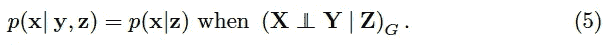***

***我们坚持认为，到目前为止还没有因果关系的讨论，只有独立性问题进行了审查。然而，对于 *d* 分离标准，有一个简单的**助记符**，如果我们暂时允许自己将因果意义与 *G* 中的箭头联系起来。事实上，如果我们固定链或叉中的中间节点 *m* 的值，我们就阻塞了两个末端节点 *i* 和 *j* 之间的信息流，这两个末端节点因此变得独立。相反，如果我们观察一个碰撞器节点 *m* 的值，或者它的一些后代的值，我们实际上观察到一个 *i* 和 *j* 的共同结果。例如，知道了 *i* 和 *m* 将会告诉我们一些关于 *j* 的事情，从而打开信息流。这种基于 *d* 分离的独立性分析预示了我们在下一小节中展开的真正的因果分析。***

## ***2.2 功能因果模型和干预措施***

******结构方程******

***一个条件概率*p*(**Y**|**X**)告诉我们，观察到 **Y** = **y** 的概率是如何受到 **X** = *x* 的影响的。然而，它并没有告诉我们当我们指定 **X** 的值时会发生什么。为了回答这个问题，我们需要比 *p* 包含的更多的信息，即关于概率模型 *p* 在外部干预下将如何变化的信息。这正是一个**功能因果模型** *M* 所做的。它被定义为一组函数关系，描述了每个 r.v. *X* _ *j* 如何被确定为其他的和一些噪声干扰的函数。因此，它解释了数据是如何产生的。使用符号 PA_ *j* 来表示直接影响 *X* _ *j* 的 r.v .集合，然后将因果模型定义为一组**结构方程**:***

***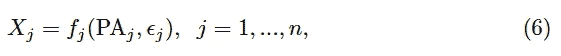***

***其中 *f* _ *j* 是双亲变量 PA_ *j* 和一些噪声干扰ϵ_ *j* 的确定性函数。重要的一点是，ϵ应该独立。换句话说，假设每一个关系都被一个随机扰动所干扰。如果一个扰动同时影响几个 r.v .，我们应该用一个描述它对其他变量影响的结构方程把它提升到一个不可观测的 *X* _ *j* 。因果图 *G* 可以与因果模型 *M* 相关联，如图 4 所示，其也定义了**混淆弧**的概念。***

***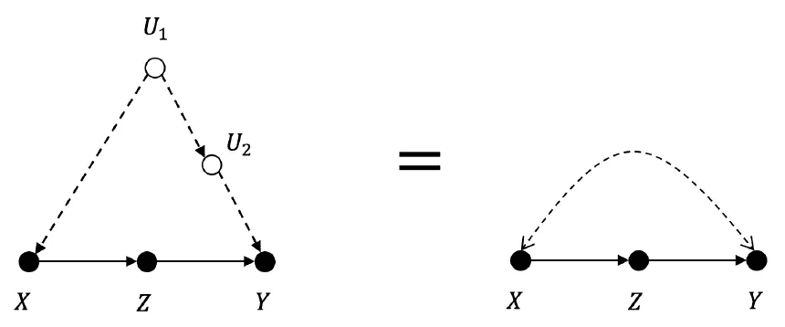***

*****图 4:** 因果图 G，其中观察到的 r.v .如 X、Y 或 Z 表示为实心圆，而未观察到的 r.v .如 U_1 或 U_2 表示为空心圆。混淆弧是连接两个观察到的 r.v .的路径，只包含未观察到的 r.v .并且没有会聚箭头。***

***r.v. **X** 集合上的概率分布 *p* 完全由模型 *M* 指定，该模型包括确定性函数 *f* _ *j* 的集合和扰动ϵ.的分布然而，在实践中，这些仍然是不明确的。注意，图 2 中的链接表示条件依赖关系*p*(*x*_*j*| pa _*j*)，而图 4 中的链接表示确定性依赖关系*x*_*j*=*f*_*j*(pa _*j*，ϵ_ *j* )。***

***假设给我们一个与因果模型 *M* 相关联的因果图 *G* ，该因果图生成概率分布 *p* 。这个 *p* 有什么独立关系？答案和我们想象的一样简单:它们正是由应用于*d*G 的分离标准决定的。这是从贝叶斯网络意义上的 *p* 与 *G* 兼容的事实和*d*-分离定理得出的。***

******do-Operator******

***因果模型描述的系统上的**干预**是结构方程(6)的变更，其中一些关系被其他关系代替。在我们固定值的最简单的情况下，比如说， *X* _ *i* 到 *a* 这相当于用*x*_*I*=*f*_*I*(pa _*I*，ϵ_ *i* 替换等式*x【t21 _*I*=)因此，如图 5 所示，通过移除将节点连接到 *X* _ *i* 到其父 PA_ *i* 的所有链接，从 *G* 获得修改模型的相应因果图。****

***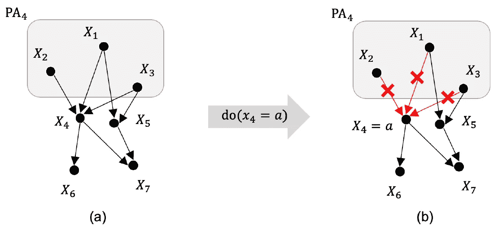***

*****图 5** :移除变量 X_4 与其父变量 PA_4 之间的链接，定义一个干预。如果(a)表示 p( **x** ，那么(b)表示 p( **x** |do(x_4=a))。***

***干预后，概率分布*p*(**x**)**被一个新的概率分布代替，我们用*p*(**x**| do(*x*_*I*=*a*)表示。这定义了 **do 操作符**。使用该定义和分布 *p* 的因式分解(1 ),我们还可以将干预后分布表示为截断因式分解:*****

**********

*****一般来说*p*(**x**| do(*x*_*I*=*a*))当然不同于古典条件句*p*(**x**|*x【T75 _*I*=*两个表达式确实相同的一个小情况是当 *X* _ *i* 没有父代时，即 PA_ *i* 是空集。当我们在第 2.4 节中介绍微积分时，我们将会准确地回答这样一个一般性的问题:作为一个观察值，对一个变量 *X* 的作用何时对另一个变量 *Y* 产生相同的结果。*******

****为了更直观地了解 do 运算符，让我们计算干预 do(*X*_*I*=*a*)对单个变量 *Y* 的影响，该变量不同于 *X_i* 及其父变量 PA_ *i* 。堵漏****

****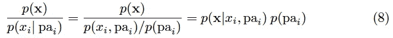****

****into(7)for*x*_*I*=*a*并对除了在 *y* 和 *x_i* 上的所有变量进行边缘化，我们得到****

****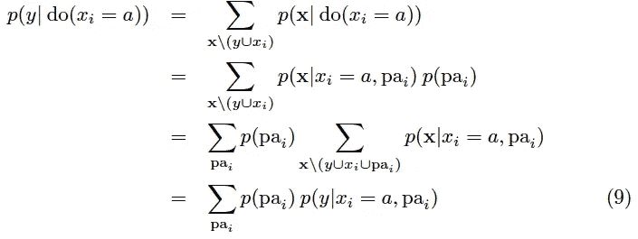****

****这种对变量 PA_ *i* 的调节和加权运算(9)来计算*p*(*y*| do(*X*_*I*=*a*))被称为 *X_i* 的**直接原因**的**调整**。****

****等式(9)表明，当操纵变量 *X_i* 的双亲 PA_ *i* 可测量时，那么对 *X_i* 的干预对 *Y* 的影响可以仅从被动观察来计算。确实这些决定了 *p* ( **x** )和*p*(*x*_*I*| pa _*I*)。在实践中，我们可以使用机器学习来达到这个目的。****

****那么有趣的问题是，当情况并非如此时，即当 PA_ *i* 中的一些 r . v .*不*可测量时，我们是否可以计算干预的效果？更一般地说，自然产生的问题如下。给定一个因果图 *G* 和一个可观察伴随物的子集 **Z** 我们能否仅用观察变量 **Z** 、 *X* 和 *Y* 的分布来表示*p*(*Y*| do(*X*=*a*)？在这种情况下，我们将说 *X* 对 *Y* 的因果关系是**可识别的**。让我们简洁地总结一下这个可识别性的概念[11]。****

> ****对变量 X 和 Y 以及一组可观察伴随物的 ***Z*** 的被动观察告知我们它们的联合分布 p *(* x，Y， ***z*** *)* )，当然，只要我们有足够的数据。但是，对 X 的干预对 Y 的影响 p*(*Y |*do(*X*)*只编码在生成这个 p 的因果模型 M 中，而不编码在 p 本身中！因此，我们面临的问题是，两个不同的因果模型 M_1 和 M_2 可以生成相同的 p。为了预测干预的效果，我们需要比 p 中包含的更多的信息。与因果模型 M 相关联的因果图 G 有时可以提供这种缺失的信息，而不需要完全了解因果模型 M。在这种情况下，我们说干预 p*(*y |*do(*x*)*可以从 G 中识别出来。****

****在 2.3 和 2.4 小节中，我们将描述图形和符号工具来回答这些问题。****

*******用 do 运算符解读随机对照试验*******

****让我们快速联系 do 运算符的定义(7)和**随机对照试验** (RCT)程序。考虑这样一种情况，我们想要评估一组患者的治疗效果。假设 *X* =1 表示我们进行了治疗，而 *X* =0 表示我们没有进行治疗，而 *Y* 表示他们健康状况的最终影响(“改善”、“稳定”、“恶化”)。患者的特征包括*Z*_ 1 =年龄，*Z*_ 2 =性别，*Z*_ 3 =患有糖尿病，这些特征也会影响他们的健康状况。****

****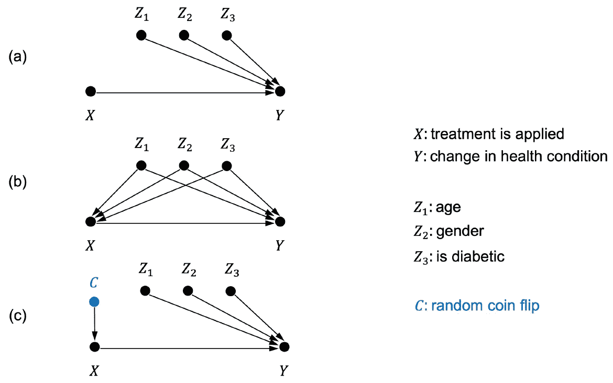****

******图 6** : (a)治疗 X 和患者特征 **Z** =(Z_1 =年龄，Z_2 =性别，Z_3 =“是糖尿病患者”)对其健康 Y 的综合影响的因果图，(b)当实验者自己选择他管理治疗的患者时的因果图，从而潜在地将 **Z** 转换成混杂因素，(C)通过随机投掷硬币来管理治疗，从而将治疗与任何潜在的混杂因素分离。****

****相应的因果图如图 6 (a)所示。对于这个图，我们想要计算*p*(*y*| do(**x**))。如果实验者选择她将对哪个患者实施治疗，她可能会无意中将特征 **Z** 转换成混杂因素，这将同时影响实施治疗的决定 *X* 和患者的健康 *Y* 。这表现在图 6 (b)中。RCT 程序将实施治疗的决定从属于抛完美硬币 *C* 的结果，其结果既不受 **Z** 的影响，也对 *Y* 没有任何直接影响。因此，它切断了与测量变量 *X* 相同的输入链接，这些链接必须被移除以定义(7)中的*p*(*y*| do(*X*))。在这样的情况下*p*(*Y*|*X*，*C*)=*p*(*Y*|*X*)，因为 *X* 挡住了 *C* 和 *Y* 之间的路径。因此(9)暗示着*p*(*y*| do(*x*)=*p*(*y*|*x*)。换句话说，当使用 RCT 程序时，观察 *X* 对预测 *Y* 具有与规定 *X* 的值相同的效果。****

*******我们能从原始数据推断出因果图吗？*******

****在 2.3 和 2.4 节中，我们将描述回答上述可识别性问题的工具，假设给我们一个因果图 *G* 并且它的一些变量 **Z** 可以测量。但是如果我们首先没有因果图 *G* 会怎么样呢？我们能直接从数据中推断出来吗？这是一个引发了很多争议的世俗问题。在日常生活中，我们都使用一些线索来确定因果关系，最重要的一个是假设原因总是先于结果。然而，分析这些因果关系的时间方面将很快推动我们讨论过去和未来之间不对称的起源以及物理学中的其他基本问题[8]。尽管这些问题很有趣，但我们不会在这里讨论这些问题，因为这将使我们远离分析数据模式的主题，数据模式可以识别由结构方程(6)定义的函数因果关系。我们参考[1]来了解更广泛的因果关系。****

****统计学家的共识一直是，从数据中找出一个因果模型是完全不可能的。事实上，一般来说，这是不可能的，因为我们将确认。然而有趣的一点是，与这种普遍的看法相反，在实际相关的情况下，这种对 *G* *的识别是*可能的，至少是部分可能的。同样，对这些问题的彻底讨论超出了这篇短文的范围。因此，我们仅限于总结[2]中的一个重要结果，该结果表明，假设对奥卡姆剃刀的特定解释，当 *G* 中的所有变量 **X** 都可测时，可以推断出因果图 *G* 的一个等价类。****

****所以我们假设变量 **X** 都是可测的，它们的概率分布是 *p* ( **x** )。在没有进一步假设的情况下，可能存在许多与 *p* 兼容的不同因果图。因此，我们需要进一步限制我们试图推断的因果模型。我们确实应该提出两个这样的限制。第一个，**极小性**，符合标准的科学实践，并将我们的搜索限制在最简单的可能因果图 *G* 上，第二个，**稳定性**，将是因果模型 *M* 本身的一个条件。为了精确地将它们公式化，我们假设由(6)定义的因果模型 *M* 取决于**参数** **θ** ，这些参数定义了确定性相关性 *f_j* 和噪声变量ϵ_ *j* 的分布。因此，这种参数化的因果模型 *M* 实际上定义了一组分布 *p* ，其可以通过改变 *M* 的参数 **θ** 来获得。****

*   ****给定两个因果图 *G* _1 和 *G* _2，考虑与这些图相关联的参数化模型 *M* _1 和 *M* _2。每当由*M*2 生成的分布集合包含由*M*1 生成的分布集合时，我们说因果图*G*1 比*G*2**更好。换句话说，与 *G* _1 兼容的分布集小于与 *G* _2 兼容的分布集。一个因果图 *G* 被称为一组图中的**极小**，当该组中没有其他图优于 *G* 时。******
*   **给定由具有固定参数值 **θ** 的因果模型 *M* 生成的分布 *p* ，我们应该确保 *p* 没有仅适用于那些特定参数值集的偶然独立关系。将 **θ** 的值更改为另一组值 **θ** 不应破坏任何独立性关系 *X* 独立于 *Y* | *Z* ，这适用于 *p* 。当这一点成立时，我们说因果模型生成了一个**稳定的**分布[2]。**

**关于观察等价的定理 1 暗示如下:**

****定理 3** :如果一个因果模型 *M* 生成一个稳定分布 *p* 那么，直到观察等价，存在一个唯一的最小因果图 *G* 与*p*相容**

**一类观测等价图可以用一种叫做**模式**【2】的表示法来图形化地表示。模式是部分有向的 DAG，其中一些边是有向的，而其他边不是。有向边对应于模式中所有成员共有的边，而无向边可以指向任何一个方向。珀尔和维尔马[6]开发了一种算法，即 **IC 算法**(用于推断因果关系)，该算法构建了与一组可观察变量上的任何稳定分布 *p* 相关的模式。关于 IC 算法的详细描述和 IC 对具有潜在变量的因果模型的各种扩展，我们参考[2]。Pearl 获得的其他有趣结果与因果图中某些假设的可证伪性有关[12，13]。**

## **2.3 用图表回答因果关系问题**

**正如我们前面所看到的，因果关系 *p* ( *y* |do(x)一旦因 *X* 的亲本 PA( *X* )可测量就可识别。公式(9)通过显示我们应该如何根据直接原因的先验概率 *p* (pa)调整条件*p*(*y*|*x*，pa)来回答这个问题。在这一小节中，我们描述两个简单的图形标准，它们在更一般的情况下回答这个问题。**

*****后门准则*****

**以下成立[2，3]:**

****定理 4** : *当一组* ***Z*** *可观测的 r.v .满足以下两个条件时***

*   ***没有变量 Z_i 是 g 中 X 的后代，换句话说，X 应该对* ***Z*** *中的任何变量都没有影响。***
*   ***变量组* ***Z*** *应该阻塞 G 中 X 和 Y 之间的任何路径γ，该路径有一个进入 X 的传入箭头(后门路径)。***

***当两个条件都被验证时，我们得到缩减:***

**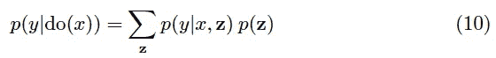**

**上述缩减公式可以被认为是基本调整公式(9)的推广。定理 4 中的两个条件都可以很容易地进行系统测试。可以尝试各种设置 **Z** 来优化其测量成本。**

**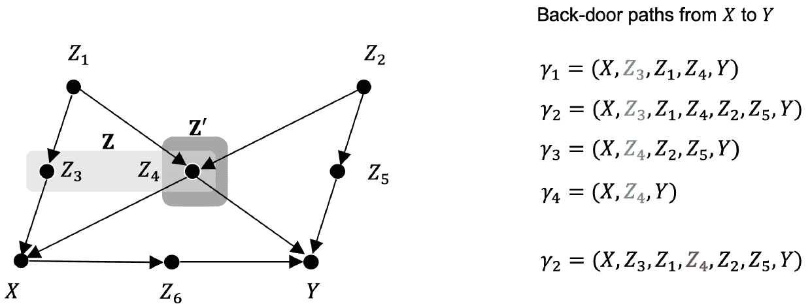**

****图 7** :使 X 对 Y 的干预可识别的一组 r.v. **Z** =(Z_3，Z_4)的例子。事实上，z3 是一个封闭γ1 和γ2 的测量链，而 Z4 封闭γ3 作为测量链，γ4 作为测量叉。另一方面， **Z** '=(Z_4)不会，因为路径γ_2 仍然被 Z_4 这个被测量的碰撞体所阻挡。**

**图 7 给出了一组 **Z** =( *Z* _3， *Z* _4)的例子，使得 *X* 对 *Y* 的因果影响可识别，而 **Z** '=( *Z* _4)不可识别。**

*****前门衡*****

**定理 4 中的条件 1 要求原因 *X* 不应影响可观察变量 **Z** 。幸运的是，另一个标准，即前门标准允许我们证明 *X* 对 *Y* 的影响在其他一些情况下仍然是可识别的。考虑通过将图 7 中的 *Z* _1 到 *Z* _5 合并到我们假设未观察到的组 **U** 中，然后将 *Z* _6 重命名为 Z 并表示 **Z** =( *Z* )而获得的图 8 所示的情况。该变量 *Z* 直接受 *X* 的影响，不阻断路径*X*←**U**→*Y*。因此 **Z** 不符合这两个后门标准。**

**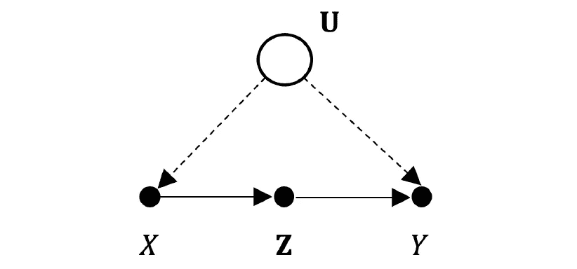**

****图 8** :满足前门标准应用条件的因果图。**

**请注意，在图 8 的示例中，以下三个条件成立:**

*   **变量 **Z** 阻塞了从 *X* 到 *Y* 的有向路径。**
*   **从 *X* 到 **Z** 的所有后门路径被阻断。事实上，在示例中，路径*X*←**U**→*Y*←**Z**在 *Y* 处受阻，这是一个无条件碰撞器。**
*   **从 **Z** 到 *Y* 的所有后门路径都被 *X* 阻断。事实上，在示例中，路径**Z**←*X*←**U**→*Y*被条件链 *X* 阻挡。**

**当这三个条件都满足时，我们说变量 **Z** 满足相对于 *X* 对 *Y* 的因果影响的**前端标准**。以下情况成立:**

****定理 5** : *当变量* **Z** *满足变量 X 对变量 Y 的影响的前门准则时，那么这种影响是可识别的，由*给出**

**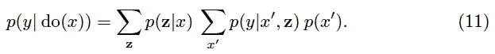**

**请注意，变量 **u** 没有出现在上述简化公式中，而未测量变量则应该出现在公式中。因此，这第二个图形工具补充了我们发现可识别因果图的武器库。我们将在 2.4 小节中作为 do 微积分的一个应用例子来证明它。**

## **2.4 用 Do-Calculus 回答因果关系问题**

**图形工具很好，因为它们允许我们识别因果关系，而不必做任何数学计算。不幸的是，这并不总是可能的。在这一小节中，我们提出了三个简单的代数规则[3],它们可以组合起来转换包含两个普通条件的表达式。| **x** 和干预措施。|do( **x** )转化为等价表达式。这些规则是**做微积分**的规则。当然，我们的目标是找到这些转换的适当顺序，以最终摆脱所有这些。|do( **x** )以证明干预是可识别的。**

**假设我们给定了因果图 *G* 中变量 **X** 、 **Y** 、 **Z** 和 **W** 的四个不相交子集。让我们用来表示**

**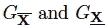**

**从 *G* 分别删除进入 **X** 和离开 **X** 的链路得到的图形。为了表示输入和输出链接的同时删除，我们使用如下符号**

**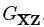**

**最后， *Z* ( **W** )将表示一组*Z*-节点，它们不是中任何*W*-节点的祖先**

**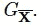**

**在下面的 3 个规则中， **X** 总是作为 do( **X** )干预进入，而 **W** 作为被动观察出现， **Y** 作为我们想要预测的结果。给定对 **X** 的干预和对 **W** 的观察，我们还定义了对 **Y** 的混合条件概率:**

**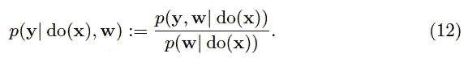**

****定理 6** (做微积分规则):*假设分布 p 是由与图 g 相关联的因果模型生成的，那么以下成立:***

*   ****规则 1** [ *删除观察* ]**

**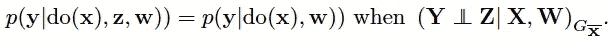**

*   ****规则 2** [ *移除干预* ]**

**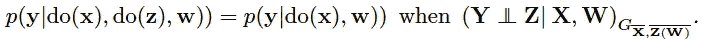**

*   ****规则 3** [ *用观察代替干预* ]**

**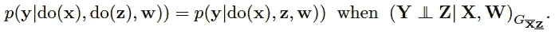**

**这些规则概括了基本的*d*-分离规则(5 ),在此回忆以供比较:**

**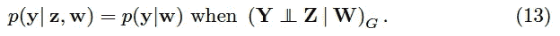**

**事实上，当 **X** 为空时,( 13)是规则 1 的特例。
反过来，当我们记得干预 do( **x** )简单地从 *G* 中移除所有进入 *X* 的链接时，我们可以很容易地理解规则 1 作为(13)的结果。结果正是规则 1 中使用的图形。规则 2 和 3 使用该图的子图。规则 3 回答了对变量 *Z* 的干预是否与其被动观察具有相同效果的重要问题。规则 3 适用的最简单情况是当 *G* 是描述直接因果关系的双节点图 **Z** → **Y** 时**

**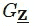**

**减少到两个不连接的节点，从而确保 **Z** 和 **Y** 与该图 *d* 分离。**

*****一个例子——推导前门公式*****

**作为 do 演算应用的一个例子，让我们看看我们如何使用它们来推导前门规则(11)，参考图 9 中我们需要检查的各种子图。**

**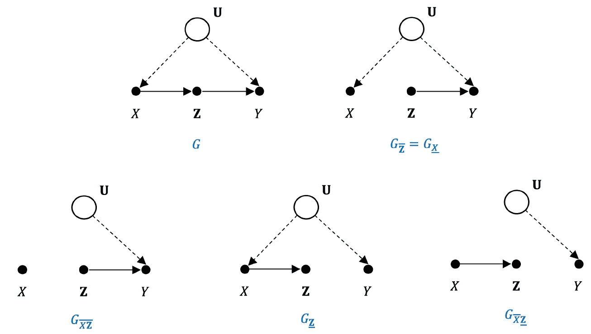**

****图 9** :前门规则中考虑的原图 G 以及用于其推导的子图。**

**让我们跟随[3]一步一步地完成这个过程。**

**首先，使用求和规则和定义(12)，期望的量可以写成:**

**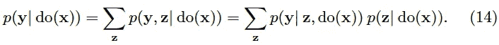**

**现在我们可以应用规则 3 来删除(14)的第二个因子中的 **x** 上的 do 运算符**

**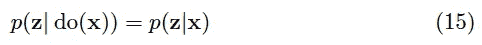**

**现在让我们关注(14)中的因子*p*(**y**|**z**，do( **x** )。再次使用规则 3，我们可以用 do( **z** )代替 **z****

**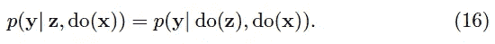**

**规则 2 现在允许从(16)的右成员中删除 do( **x** )动作，因此**

**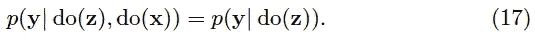**

**让我们这样计算*p*(**y**| do(**z**))。在 **x** 上应用混合调节和边缘化的定义(12)**

**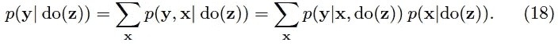**

**我们可以应用规则 2，它隐含着*p*(**x**| do(**z**)=*p*(**x**)。我们也可以应用规则 3，它隐含着*p*(**y**|**x**，do(**z**)=*p*(**y**|**x**， **z** )。总共(18)和这最后两个结果意味着**

**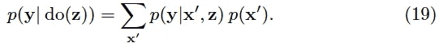**

**结合(16)、(17)和(19)，我们得到**

**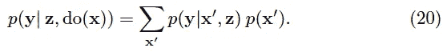**

**最终，结合(14)、(15)和(20)，我们得到了想要的结果**

**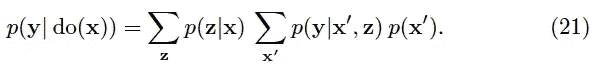**

**这与前门规则(11)相同。**

**如这个例子所示，do 演算允许可识别性情况的优雅推导，但绝不是显而易见的！相反，它需要相当多的直觉和实践。**

*****做微积分的长处和局限*****

**do 演算的规则已经被证明是**完全的**【10】，在这个意义上，如果一个干预是完全可识别的，那么确实存在这 3 个规则的序列，它们将产生一个没有任何 do 运算符的表达式。不幸的是，没有通用的规则来决定一个表达式是否可识别[2]。事实上，应用 do 演算的一个主要困难是，没有一个通用的指导原则来告诉我们在每一步应用哪个规则。幸运的是，勇敢的人已经在编辑可识别和不可识别的因果图，我们可以重复使用。图 10 显示了可识别的例子。**

**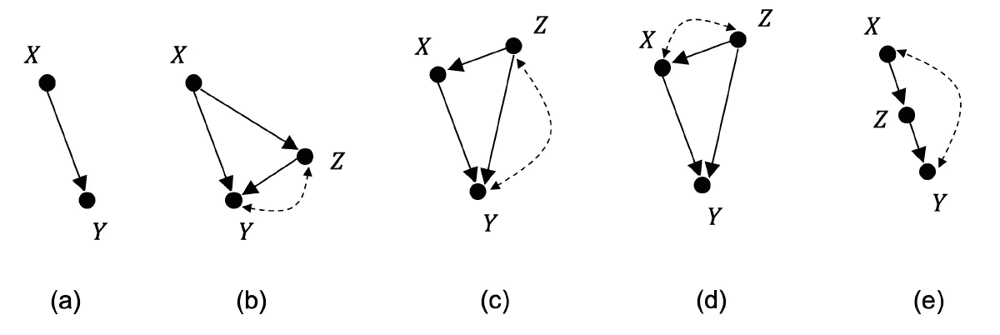**

****图 10** :简单因果图的例子，其中 X 对 Y 的影响是可识别的。所有的图都是极大的。**

**重要的一点是，一旦我们认识到以下两个事实，我们就可以从这些图中生成更多可识别的图:**

**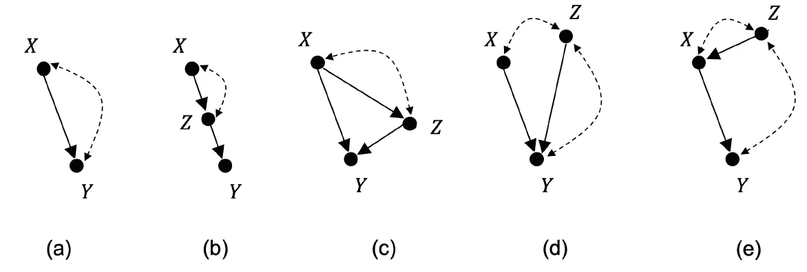**

****图 11** :简单因果图示例，其中 X 对 Y 的影响不可识别。**

*   ****给任何因果图 *G* 增加一条边**只会降低新图被识别的几率。这是我们一直在讨论的所有规则的直接结果，无论是图形的还是代数的，最终都等于测试在 *G* 的子集内的一些路径是否被阻塞。添加一条边显然会增加要测试的路径数量，从而降低所有路径都被阻塞的可能性。**
*   ****在图形边缘添加观察变量**会产生相反的效果。这只会增加新图可识别的机会，因为它增加了一个观察链，这是一个额外的阻塞点，只会增加组或变量之间的 *d* 分离的机会。**

**图 10 中显示的所有图都是**最大的**，在这个意义上，给它们中的任何一个增加一条边都会破坏它们的可识别性。因此，它们是最有用的列表。图 11 显示了不可识别的例子。**

# **3.简单业务示例的因果分析**

**因果分析的例子通常来自农学、社会科学或经济学等依赖于复杂因果模型的领域。我们选择说明因果分析是如何在最普通的商业例子中自然发生的。**

## **3.1 评估忠诚度活动的有效性**

**客户对服务的满意度通常可以从他们的可观察行为来判断，例如访问网站的次数或使用该服务所花费的时间。该信息可以帮助服务提供商识别一些客户打算离开服务的早期迹象。然后，营销部门可以决定发起一场忠诚度运动，旨在留住那些信心动摇的顾客。这些活动当然是有成本的，因此能够评估它们的有效性是很重要的。某类忠诚度活动真的对流失率有影响吗？**

**为了回答这个问题，让我们形式化这个问题。首先，假设 *U* 是一个二元变量，它对应于客户在成为任何忠诚度活动的目标之前是否离开服务的意图。当然，这将是一个不可测量的变量。这个初心 *U* 当然对客户的行为有可以衡量的影响，姑且称之为 *Z* 。该行为 *Z* 将依次决定服务提供商是否应该将该客户作为忠诚度活动的目标。我们姑且称这个决定为 *X* 。最终，客户取消服务的最终决定还是一个二元变量，称之为 *Y* 。客户的最终决定当然取决于他的最初意图 *U* 以及他是否已经成为活动的目标( *X* )。因此，从形式上来说，我们的问题可以转化为:当我们测量 *Z* 时，我们能识别出成为目标 *X* 对最终决策 *Y* 的因果影响吗？图 12 显示了相应的因果图。**

**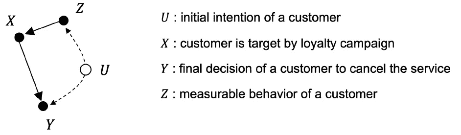**

****图 12** :忠诚度活动对流失率影响的因果模型。**

**该图只是图 10 中可识别图列表中的图(c ),去掉了从 *Z* 到 *Y* 的直接链接。因此它是可识别的。另一方面 *Z* 满足定理 4 中后门准则的两个条件。它不是 *X* 的后代，它阻塞了 *X* 和 *Y* 之间的后门路径，因为它是一个观察链。因此,( 10)给出了将 *X* 对 *Y* 的因果影响明确缩减为可观察量。**

## **3.2 保险公司的索赔准备金**

**当被保险人提出索赔时，保险公司通常会留出一定的金额。当报道人身伤害时尤其如此。最后的赔偿显然取决于损坏的程度。但是，正如保险公司已经意识到的那样，这种补偿也将取决于初始准备金。此处因果分析的目的是确定这一规定对被保险人获得的最终赔偿的影响。**

**设 *U* 为完整的权利要求特征。其价值在报告时未知，但它将决定被保险人的申报 *Z* 和调查后给予的最终赔偿 *Y* 。初始评估 *Z* 直接决定专家的准备 *X* ，进而影响最终补偿 *Y* 。因此，因果图与图 12 完全相同，因此，同样的后门简化公式(10)也适用于此。**

## **3.3 销售人员培训对营业额的影响**

**为了提高销售团队的效率，公司可以投资培训。这有一个很容易衡量的成本 *X* ,希望这将有助于通过增加销售来增加营业额。因此，因果关系将是直接的，因此可以轻易识别。然而，至少有一个不可测量的混杂变量破坏了这种可识别性，即竞争压力 *U* 。的确，强大的竞争压力会鼓励对培训工作的投资，但同时也会影响人员流动。不过幸运的是，如果我们能在从 *X* 到 *Y* 的因果链中找到一个可测量的“去组合”变量 *Z* ，我们就能恢复可识别性。销售人员的技能和动机由这些培训诱导，并通过调查或民意测验来衡量，可以发挥这一作用。因果图如图 13 所示，与图 8 相同，图 8 是前门规则适用的基本图。因此，我们可以使用前门简化公式(11)。**

**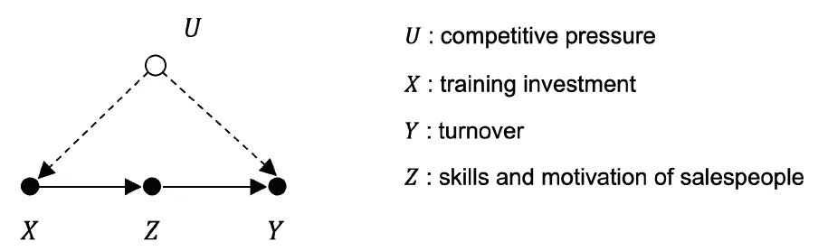**

****图 13** :培训投资对销售人员技能和动机评估的影响因果图。**

## **3.4 定价对销售的影响**

**一家公司在一种产品上的营业额 *Y* 是该产品价格 *X* 和销售量 *Z* 的函数。例如 *Y* 可以与 *X* * *Z* 成比例。现在价格 *X* 既影响营业额 *Y* 也影响销售量 *Z* ，因为较低的价格通常会增加销售量。这样，相应的因果图将是可识别的，因为它对应于来自图 10 的可识别图列表中的图(b ),其中去除了 *Y* 和 *Z* 之间的混淆链接。不幸的是，作为未知变量的竞争压力 *U* 是影响价格 *X* 和销售量 *Z* 的混杂因素，使得图 14 中的图表无法识别，因为它与图 11 中的无法识别图表列表中的图表(c)相同。**

**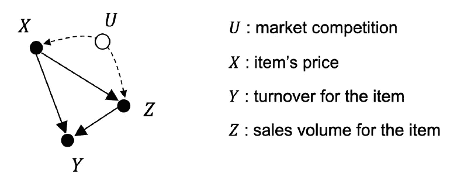**

****图 14** :由于竞争压力，定价对营业额的影响无法识别。**

# **4.数据科学家值得了解的东西？**

**一旦一个人完全理解了因果革命所暗示的范式转变的重要性，许多新来者就会产生一个问题。为什么在我学习统计、概率或机器学习的时候，从来没有人告诉过我这些？作为一名数据科学家，我怎么从来没有听说过做微积分呢？在实践中真的有用吗？在哪个地区？这个大概有几个答案。我们在下面列出了其中的一些。**

*   **我们看到的第一个原因是文化性质的。例如，在[5]中已经很好地分析了这一点。事实上,“因果关系”这个词在统计学界长期以来几乎是一个禁忌，统计学界仍然忠实于上个世纪这门学科创始人如皮尔逊和费希尔的经典联想主义观点。他们认为数据中不可能有因果关系的证据(RCT 除外)。朱迪亚·珀尔用自己所有的毅力和科学高度扭转了人们对因果关系和统计学关系的看法。显然，这种范式转变还没有渗透到更新的数据科学社区中。**
*   **我们在第 2 节中提出的图形和代数机制显然只有在因果图 *G* 不是平凡的时候才有意义。这解释了为什么社会科学、经济学、医学或农学等领域都发展了丰富的因果模型，并从这种新的因果观中受益最多。然而，对于像 *G* = *X* → *Y* 这样的基本因果关系，对原因 *X* 的被动观察和对原因的干预之间没有区别。数据科学家设计的许多用例都属于这一类，也许在某些情况下只是偶然。但是没有这样的运气，忽略观察和干预之间的差异可能会导致预测错误。我们在第 3 节中给出了一些这种情况的例子。**
*   **虽然图形规则相当容易理解，但是将 do 演算明智地应用到新的因果图中无疑需要技巧和直觉。正如在[5]中所建议的，对于那些负担不起或不想掌握这种代数机器的人来说，do 微积分肯定可以从一本食谱中受益。**
*   **最后一个原因，也是一个更主观的原因，与珀尔的写作风格有关，这种风格有时可能缺乏一点简洁。这肯定会让许多读者气馁，甚至是那些在统计学和概率论方面具备所有先决条件的读者。珀尔用大量的历史轶事、例子和评论来满足他的读者，有时这与关键数学事实的清晰呈现背道而驰。因果关系革命可能仍然缺乏一个简洁的教科书般的主题介绍。**

**统计学的创始人肯定是对的，他们坚持认为，一般来说，我们不能仅仅从数据中推断出因果关系。但是在他们新生学科的热情中，他们的许多弟子和追随者不知何故变得过分热情。他们忽略了在大多数情况下我们有比数据更多的可用信息！我们对世界如何运转有一些先验知识！也许不是一个完全成熟的因果模型，但至少是一个部分因果图。Pearl 告诉我们的是，在一些有利的条件下(我们在第 2 节中讨论过)，我们可以将这两种知识结合起来，以预测干预对系统的影响。如果事实证明这些预测与观测不符，我们只需更加努力，想出一些更好的模型。但是，无论如何，我们不得不放弃仅仅通过观察来自动发现世界如何运转的希望。大自然不会在一些愚蠢的算法面前展示它的魅力。她是一个要求很高的女主人，希望我们能像好奇和有创造力的头脑一样，与她进行一次深思熟虑的谈话。所以，让我们欢呼吧，因为这就是科学如此有趣的原因！**

# **参考**

1.  **J.Pearl，D. Mackenzie (2018)，*为什么之书*，基础书籍。**
2.  **J.珀尔(2009)，*因果关系*，剑桥大学出版社。**
3.  **J.珀尔(1995)，*实证研究的因果图*，生物计量学(1995)，82，4，第 669–710 页。**
4.  **D.R. Cox (1958) *实验计划*，约翰威利父子公司，纽约州。**
5.  **南鲍威尔(2018)，*原因之书:因果的新科学*，多学科评价杂志
    第 14 卷，2018 年第 31 期。**
6.  **J.珀尔和 t .维尔马(1990)，*因果模型的等价和综合*，第六届人工智能不确定性会议论文集，第 220-227 页。**
7.  **J.珀尔和 t .维尔马(1991)，*一种推断因果关系的理论*，《知识表示和推理的原则:第二届国际会议论文集》，第 441-452 页。摩根考夫曼，加州圣马特奥。**
8.  **H.赖兴巴赫(1956)，*时间的方向*，加州大学出版社，柏克莱。**
9.  **栗色 M. Bishop (2016)，*模式识别与机器学习*，斯普林格出版社纽约公司。**
10.  **Y.黄，M. Valtorta (2006)， *Pearl 的干预演算完成*，06:第二十二届人工智能不确定性会议论文集，第 217–224 页。**
11.  **D.Galles 和 J. Pearl (1995)，*测试因果效应的可识别性*，UAI-95:第十一届人工智能不确定性会议录，第 185–195 页。**
12.  **J.Pearl (1994)，*从贝叶斯网络到因果网络*。贝叶斯网络与概率，第 1-31 页。伦敦:阿尔弗雷德·沃尔特。
    推理**
13.  **J.Pearl (1995)，*间接实验的因果推断*。阿提夫。英特尔。医学。第 7 卷，第 561-582 页。**

**[arXiv 上 LaTeX 排版的 PDF 版本](https://arxiv.org/abs/2007.03940)**