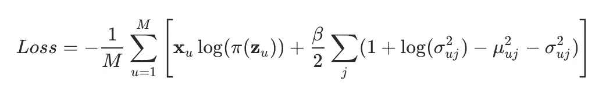
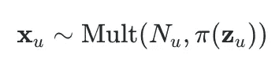
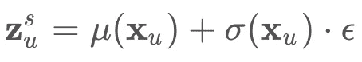
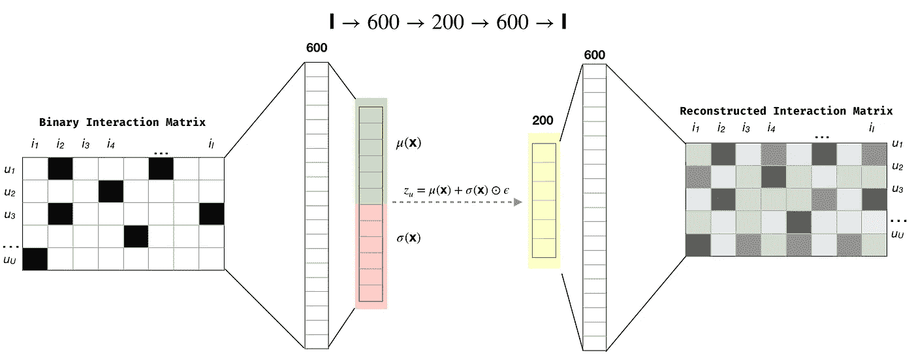
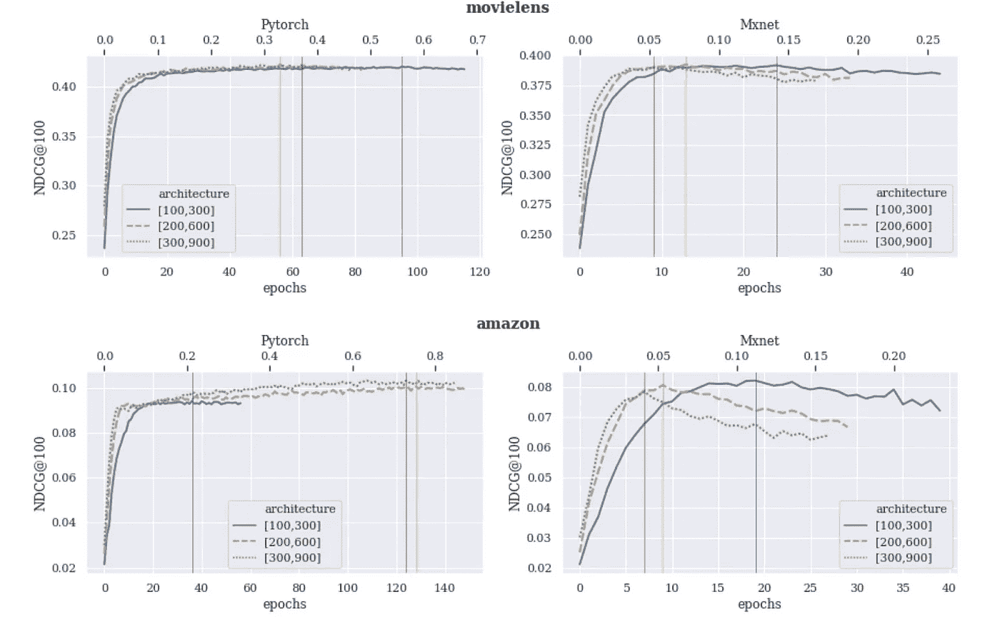
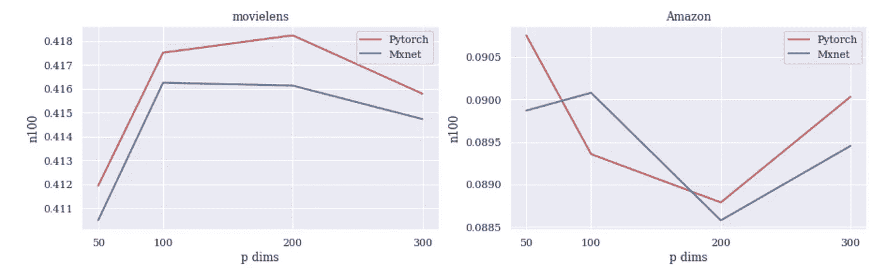
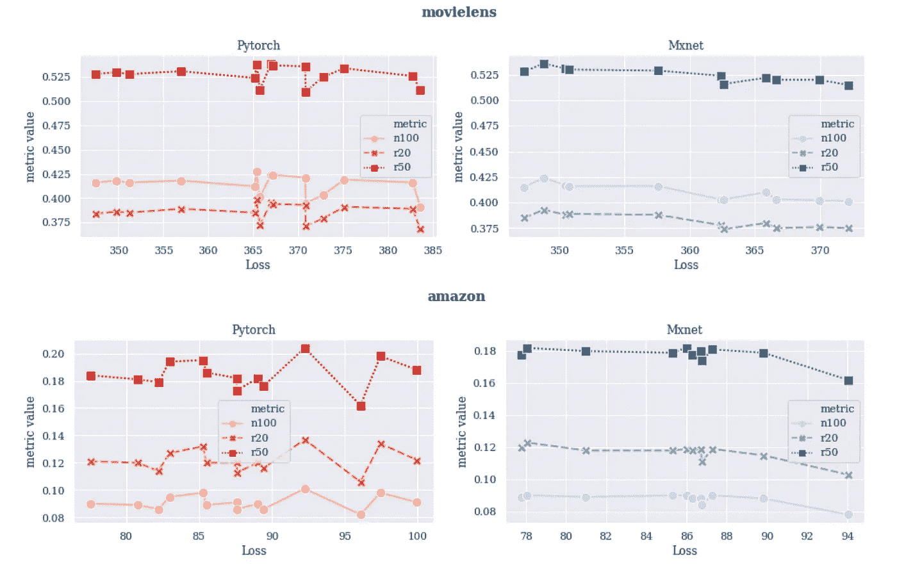

# RecoTour III:使用 Mxnet 和 Pytorch 进行协同过滤的可变自动编码器

> 原文：<https://towardsdatascience.com/recotour-iii-variational-autoencoders-for-collaborative-filtering-with-mxnet-and-pytorch-710c924fa2fd?source=collection_archive---------25----------------------->

这篇文章和这里的代码是一个更大的名为 [RecoTour](https://github.com/jrzaurin/RecoTour) 的报告的一部分，在那里我通常探索和实现一些我认为有趣和/或有用的推荐算法(见 [RecoTour](https://medium.com/datadriveninvestor/recotour-a-tour-through-recommendation-algorithms-in-python-52d780628ab9) 和[recotouri](/recotour-ii-neural-recommendation-algorithms-49733938d56e))。在每个目录中，我都包含了一个`README`文件和一系列解释笔记本，我希望它们能帮助解释代码。我一直不定时的加算法，有兴趣的继续关注。

像往常一样，让我首先感谢做了艰苦工作的相关人员。这篇文章和配套的报告是基于论文“[协同过滤的变分自动编码器](https://arxiv.org/pdf/1802.05814.pdf)”[1]和“[自动编码变分贝叶斯](https://arxiv.org/pdf/1312.6114.pdf)”[2]。这里和回购中的代码部分受到了来自 [Younggyo Seo](https://github.com/younggyoseo/vae-cf-pytorch) 的实现的启发。我根据自己的编码偏好修改了代码，并添加了一些选项和灵活性来运行多个实验。

深入研究用于协同过滤的变分自动编码器的原因是因为它们似乎是少数基于深度学习的算法之一(如果不是唯一的)，比那些使用非深度学习技术的算法获得更好的结果[【3】](https://arxiv.org/abs/1907.06902)。

在整个练习中，我将使用两个数据集。[亚马逊电影和电视](http://jmcauley.ucsd.edu/data/amazon/)数据集【4】【5】和[电影镜头](https://grouplens.org/datasets/movielens/20m/)数据集。后者用于确保我获得的结果与论文中的一致。亚马逊数据集比 Movielens 数据集更具挑战性，因为它的稀疏度是 movie lens 数据集的 13 倍。

本文中的所有实验都是使用 AWS 上的 p2.xlarge EC2 实例运行的。

[***越详细，***](https://jrzaurin.github.io/infinitoml/2020/05/15/mult-vae.html) 原文本帖子在我的[博客](https://jrzaurin.github.io/infinitoml/)中发表。这是对内容的总结，更侧重于实现/代码和相应的结果，而不是数学。

# 1.部分正则多项式变分自动编码器:损失函数

在本节中，我假设读者对可变自动编码器(vae)有一些经验。如果不是这样，我推荐阅读[金马和韦林的论文](https://arxiv.org/pdf/1312.6114.pdf)、[梁等人的论文](https://arxiv.org/pdf/1802.05814.pdf)，或者[原帖](https://jrzaurin.github.io/infinitoml/2020/05/15/mult-vae.html)。在那里，读者将找到我们在实现部分正则化多项式变分自动编码器(多 VAE)时将使用的*损失*函数的详细推导。这里，我将只包括最后一个表达式，并简要介绍一些我认为有助于理解多 VAE 实现和等式(1)中的损耗的附加信息。

让我首先描述一下记数惯例。继[梁等人 2018](https://arxiv.org/pdf/1802.05814.pdf) 之后，我将用 **u** ∈ {1、…、**、** }索引用户，用 **i** ∈ {1、…、 ***I*** }索引条目。用户逐项二进制交互矩阵(即点击矩阵)是**x**∈ℕ^{***u***×***I***}并且我将使用小写字母***【xᵤ***=***x***_ { u1 }，…，***x***_ { 0

根据这一符号，多 VAE *损失*函数定义为:

Eq 1。多 VAE 损失函数

其中 *M* 为小批量。求和中的第一个元素仅仅是点击历史的对数似然性***【xᵤ】***【条件反射】到潜在表示**z*ᵤ****log*(*pθ*(***xᵤ*|**|**z*ᵤ***)(见下文)。第二个要素是当编码器和解码器分布都是高斯分布时 VAEs 的 kull back-lei bler 散度(见[这里的](https://stats.stackexchange.com/questions/318748/deriving-the-kl-divergence-loss-for-vaes))。

在我们开始写代码之前，我们还需要一些细节。**用户的点击历史**，定义为:****

********

****Eq 2。点击用户的历史记录 **u******

****其中***nᵤ=***∑***ᵢnᵤᵢ***为用户 **u** *的点击总数。*正如我之前提到的*，*， **z *，*，**，*，*是**，，**，**，*，*，**的潜在表示，并且被假定为从一个标准的高斯先验*pθ*(**z***)*√在多值的实现过程中， **z *ᵤ*** 需要从一个近似的后验概率*qϕ*(**z*ᵤ***∣**x*ᵤ***)(也假设为高斯)。由于涉及采样时计算梯度是…" *复杂的*"， [Kingma 和 Welling](https://arxiv.org/pdf/1312.6114.pdf) 介绍了所谓的重新参数化技巧(请阅读[原始论文](https://arxiv.org/pdf/1312.6114.pdf)、[原始帖子](https://jrzaurin.github.io/infinitoml/2020/05/15/mult-vae.html)或任何[多种在线资源](https://gregorygundersen.com/blog/2018/04/29/reparameterization/#:~:text=Reddit%3A%20The%20%E2%80%9Ctrick%E2%80%9D%20part,you%20can't%20do).)以了解有关重新参数化技巧的更多细节)，以便采样后的 **z *ᵤ*********

********

****Eq 3。取样的 **z *ᵤ*** *(因此上标有‘s’)将用于多值*的实现****

****方程 3 中的 ***μ*** 和 ***σ*** 是神经网络的函数，*ϵ*∾***n***(0，I)是高斯噪声。当我们看到相应的代码时，他们的计算将变得更加清晰。最后，等式(2)中的π( **z *ᵤ*** )是π(**z*ᵤ***)=*soft max*(**z*ᵤ***)。****

****在这个阶段，我们几乎拥有了实现等式(1)中的多值及其损失函数所需的所有信息:我们知道什么是***【xᵤ】***，**z*【ᵤ】，μ*** 和 ***σ*** 将是我们的神经网络的函数，而π就是 *Softmax* 函数。从等式(1)讨论剩下的唯一“字母”是 *β* 。****

****在 VAEs 的上下文中查看等式(1)中的损失函数，我们可以看到第一项是“重建损失”，而 *KL* 散度作为正则项。考虑到这一点，[梁等人](https://arxiv.org/pdf/1802.05814.pdf)增加了一个因子 *β* 来控制正则化的强度，提出了 *β* < 1。为了更深入地反映 *β、*的作用，以及更好地解释多 VAE *、*损失函数的形式，请阅读[原始论文](https://arxiv.org/pdf/1802.05814.pdf)或[原始帖子](https://jrzaurin.github.io/infinitoml/2020/05/15/mult-vae.html)。****

****事不宜迟，让我们来看看代码:****

# ****2.准备数据。****

****正如我在帖子前面提到的，这是对原帖子的总结。考虑到这一点，我将在这里简要描述如何在不包含代码的情况下准备数据。读者可以在[原始实现](https://github.com/dawenl/vae_cf/blob/master/VAE_ML20M_WWW2018.ipynb)、[原始发布](https://jrzaurin.github.io/infinitoml/2020/05/15/mult-vae.html#2.-Preparing-the-data)或[回购](https://github.com/jrzaurin/RecoTour/tree/master/Amazon/mult-vae)中找到与数据准备相关的代码。****

****基本上，作者将数据分为培训、验证和测试用户及其相应的交互。然后，他们将验证和测试交互分成所谓的“*验证和测试训练以及测试集*”。****

****我知道这听起来很复杂，但并不复杂。“*验证 _ 训练和测试 _ 训练集合*”在这里包括总验证和测试集合的 80%，将被用于构建我们可以认为是输入二进制*“图像”*(即点击的二进制矩阵)，该输入二进制将由经过训练的自动编码器进行“*编码→解码*。另一方面，“*验证 _ 测试和测试 _ 测试集*”包括总验证和测试集的 20%，将用于计算验证/测试时的排名指标。如果您想了解更多细节以及玩具示例，请前往回购中相应的[笔记本](http://localhost:8790/notebooks/notebooks/01_prepare_data.ipynb)。****

# ****3.部分正则多项式变分自动编码器:代码****

****我已经使用`Mxnet`的`Gluon`和`Pytorch`实现了多重 VAE。在这一节中，我将只关注`Mxnet`的实现。如果您对`Pytorch`的实施感兴趣，请前往[回购](https://github.com/jrzaurin/RecoTour/tree/master/Amazon/mult-vae)。****

****与任何自动编码器架构一样，主要的两个元素是(屏住呼吸…)编码器和解码器。在[原始出版物](https://arxiv.org/pdf/1802.05814.pdf)中，作者使用一个隐藏层 MLP 作为生成模型。他们说更深层次的架构并不能改善结果，在进行了 60 多次实验后，我发现这是真的。带着这样的想法，我们先来看看模型[ *I→600→200→600→I* ]其中 *I* 是项目总数:****

********

****图一。多 VAE 建筑。这些颜色是我试图引导眼睛通过重新参数化的技巧过程。****

****在代码中，图(1)是:****

******3.1 编码器******

****片段 1。多 VAE 编码器。注意第 20 行中的 ***μ*** ，***∑***分割，作为重新参数化技巧的一部分。这种分离对应于图 1 中的绿色和红色****

******3.2 解码器******

****片段 2。多 VAE 解码器****

******3.3 完整型号******

****片段 3。多 VAE 模型。注意第 15–18 行发生的重新参数化。线 18 对应于图 1 中的黄色****

****在我继续之前，让我提一下(并欣赏)一下`Mxnet`的`Gluon`所提供的许多美好的*小*事物中的一个。当我们定义向前传球，或者更准确地说，`hybrid_forward`传球时，你会注意到`HybridBlock`和输入`F`(后端)的使用。人们可以写一个完整的帖子，介绍一下`HybridBlocks`的乐趣，以及开发`Gluon`的人是如何将命令式框架(例如`Pytorch`)的灵活性和声明式框架(例如`Tensorflow`)的速度完美地结合在一起的。如果你想了解细节，去[这里](https://gluon.mxnet.io/chapter07_distributed-learning/hybridize.html)，但是相信我，这很快。****

****话虽如此，我们还需要一个完整的模型，即等式(1)中的损失函数。****

****片段 4。多 VAE 损失的实现(即等式(1))****

****在[论文](https://arxiv.org/pdf/1802.05814.pdf)中，作者还使用了多项式去噪自动编码器(Mult-DAE)。除了没有任何变化之外，其架构与 Mult-VAE 的架构完全相同。我已经实现了 Mult-DAE，并用它进行了多次实验。然而，鉴于它的简单性和已经很长的帖子，我不会在这里讨论相应的代码。****

****请注意，按照最初的实现，我在多 VAE 和多 DAE 的输入层应用了 dropout，以避免过度拟合。我还包括在整个网络中应用辍学的选项。****

****还要注意的是，尽管我研究了不同的漏失，解决漏失、权重衰减、 *β* 等与架构之间相互影响的最佳方式是使用“ *proper* ”超参数优化。****

# ****4.培训、验证和测试****

******4.1 退火时间表******

****如前所述，我们可以将 Kullback-Leiber 散度解释为一个正则项。考虑到这一点，在一个受 [Samuel R. Bowman 等人 2016](https://arxiv.org/abs/1511.06349)【6】启发的程序中，梁和合著者在大量训练步骤中缓慢地线性退火 KL 项(即增加 *β* )。****

****更具体地说，作者将 KL 散度一直退火到 *β* = 1，在该过程中使用的总历元数的大约 80%处达到该值。然后，他们根据峰值验证指标确定表现最佳的 *β* ，并使用相同的退火计划重新训练模型，但在达到该值后停止增加 *β* 。****

****如果我们去[他们的实现](https://github.com/dawenl/vae_cf/blob/master/VAE_ML20M_WWW2018.ipynb)，这些是过程的细节:使用 500 的批量，他们设置退火步骤的总数为 200000。假设训练数据集的大小为 116677，每个时期有 234 个训练步骤。它们的`anneal_cap`值，即训练期间达到的最大退火，被设置为 0.2，并且在训练期间它们使用以下方法:****

****片段 5。原始退火时间表****

****其中`update_count`每训练一步/批次增加 1。他们使用 200 个时期，因此，如果我们做数学计算，当`update_count / total_anneal_steps` = 0.2 时，即在 40000 个训练步骤之后，或者换句话说，在大约 170 个时期之后，即时期总数的 80%之后，`anneal_cap`值将停止增加。****

****考虑到这一点，我的实现如下所示:****

****片段 6。我稍微调整了一下退火计划。****

****一旦设定了`total_anneal_steps`，剩下的唯一事情就是定义培训和验证步骤。如果你熟悉`Pytorch`，接下来的两个功能你会觉得很熟悉。****

******4.2 培训步骤******

****片段 7。使用 Mxnet 的胶子的训练步骤****

******4.3 验证步骤******

****代码片段 8。使用 Mxnet 的胶子的评估步骤。****

****我在这个 [repo](https://github.com/jrzaurin/RecoTour) (以及相应的帖子)中的多个笔记本里广泛讨论过评测指标(NDCG@k 和召回@k)。因此，考虑到这一点，也为了不使这篇文章成为一篇更“无限的帖子”，我将不在这里描述相应的实现。如果您想了解这些评估指标的详细信息，请转到`[utils](https://github.com/jrzaurin/RecoTour/tree/master/Amazon/mult-vae/utils)`中的`[metrics.py](https://github.com/jrzaurin/RecoTour/blob/master/Amazon/mult-vae/utils/metrics.py)`模块。这里的代码对最初的实现[中的代码做了很小的修改。](https://github.com/dawenl/vae_cf/blob/master/VAE_ML20M_WWW2018.ipynb)****

******4.4。运行过程**:****

****让我们定义模型，准备设置并运行一个小样本(当然，忽略打印的结果。我只想说明如何运行模型)****

****片段 9。运行模型****

****再加上一些铃声和铃声(例如可选的学习率计划、提前停止等等)，这就是你将在`[main_mxnet.py](https://github.com/jrzaurin/RecoTour/blob/master/Amazon/mult-vae/main_mxnet.py)`中找到的代码。****

****在我进入下一个，也是最后一个部分之前，我想简单地评论一下我通常在这些科学出版物中发现的一些东西。通常，一旦他们在验证集上找到了最佳超参数，他们就在测试集上测试模型。****

****在“现实生活”场景中，会有一个额外的步骤，即合并训练集和验证集，用最佳超参数重新训练模型，然后在测试集上进行测试。无论如何，因为这里我的目标不是构建一个真实的系统，所以我将遵循最初的[实现](https://github.com/dawenl/vae_cf/blob/master/VAE_ML20M_WWW2018.ipynb)中的相同过程。****

****现在是时候看看用`Pytorch`和`Mxnet`得到的结果了。****

# ****5.结果摘要****

****让我再次提醒一下第 4.1 节中描述的退火时间表。基本上我们逐渐退火到 *β* =1，在总次数的 80%左右达到，记录最佳退火参数( *βbest* )。然后，我们应用相同的退火程序，但是使用 *βbest* ，即，我们退火到 *βbest* 在总周期数的大约 80%处达到该值。****

********

****图二。与梁等人 2018 年的[相同的退火时间表，适用于 3 种不同的架构以及使用`Pytorch`和`Mxnet`的 Movielens 和 Amazon 数据集。在退火程序中，β= 1 \β= 1*β*= 1 在 170 个时期达到(200 个时期中的 85%)](https://arxiv.org/pdf/1802.05814.pdf)****

****表 1。在我运行的所有实验中表现最好的实验(根据 NDCG@10 )(可以在回购的``run_experiment.sh`文件中找到)。包含所有实验运行结果的 csv 文件可以在 repo 的`all_results.csv`文件中找到。****

****图 2 使用`Pytorch`和`Mxnet`为 3 种不同的架构以及 Movielens 和 Amazon 数据集复制了相同的退火时间表。在退火程序中，在 170 个时期(200 个时期中的 85%)达到 *β* =1。此外，我还使用了 20 个时期的"*耐心*"提前停止，这就是为什么没有一个实验达到 200 个时期。图中竖线表示达到最佳`NDGC@100`的时期，对应的 *β* 值表示在顶部 x 轴。****

****另一方面，表 1 显示了我在所有实验中获得的最佳结果，您可以在文件`run_experiments.sh`的报告中找到。****

****乍一看，这两种深度学习框架的行为有多么不同是显而易见的。我发现`Pytorch`比`Mxnet`表现得好一点，并且在实验中更加稳定。这是我每次使用这两个框架进行相同练习时不断发现的事情。比如这里的，用的是分层注意力网络。实际上，我认为这是因为我知道(或用过)的`Pytorch`比`Mxnet`多。尽管如此，在这个阶段，我很清楚我需要在这两个深度学习库之间进行适当的基准测试。****

****关注图 1 所示的结果，第一个明显的结果是`Mxnet`实现在很少或没有正则化的情况下表现得更好。事实上，我已经运行了 60 多次实验，如表 1 所示，使用`Mult-VAE`和`Mxnet`时的最佳结果是在没有正则化的情况下获得的，即使用重新参数化技巧的去噪自动编码器。此外，使用`Mult-DAE` (NDCG@100 = 0.424)可以获得使用`Mxnet`的最佳总体指标。****

****如果我们关注数据集之间的差异，首先显而易见的是，Amazon 数据集的指标明显小于 Movielens 数据集。这当然是意料之中的，因为亚马逊数据集比 Movielens 数据集稀疏 13 倍，也就是说，挑战性更大。此外，我们看到`Pytorch`实现对数据集和架构都表现出非常稳定的行为，在 Amazon 数据集的情况下，在训练期的后期达到最佳`NDCG@10`。同样，这与`Mxnet`实现的情况不同，在这种情况下，我们看到一致性较低，并且在两个数据集的训练期间很早就达到了最大值`NDCG@10`。****

********

****图 3。NDCG100(称为`n100 in the figure`)针对以下架构绘制了解码器的第一维:I)*I*→150→50→150→*I*，ii)*I*→300→100→300→*I*，iii)*I*→600→200→600→*I*****

*****另一方面，梁等人在他们的论文中提到，更深层次的架构并没有带来任何改善。这与我在实验中发现的结果是一致的。事实上，图 3 显示了四种不同架构的 NDCG100(图中标记为`n100`)与解码器第一维度的关系。正如我们在图中看到的，即使集中在具有相同层数的架构中，每层增加神经元也不会有特别大的帮助(Movilens 和 Amazon 数据集分别为 50 和 200)。*****

**********

*****图 4。NDGC@100 (n100)和 Recall@20 (r20)和 Recall@50 (r50)针对我运行的所有实验的损失绘制*****

*****在我结束这个练习之前，我想强调一下我过去已经讨论过的一个结果(见[这里](https://github.com/jrzaurin/RecoTour/blob/master/Amazon/neural_graph_cf/Chapter06_results_summary.ipynb))，如图 4 所示。*****

*****图 4 示出，一般来说，最佳排序度量不对应于最佳损失值。即使点击的输入矩阵的重建可能更差，排名度量仍然可能改进。这是一个重要且常见的结果，在构建真实世界的推荐系统时，人们必须记住这一点。当构建推荐算法时，我们对实现最佳分类/回归损失不感兴趣，而是对产生最佳推荐感兴趣，这与信息检索效率更相关，因此与排名度量更相关。关于推荐系统的更多信息，我推荐这本[神奇的书](https://www.amazon.co.uk/Recommender-Systems-Textbook-Charu-Aggarwal/dp/3319296574/ref=sr_1_1?crid=2SK7PGNMA59FW&keywords=recommender+systems&qid=1559762483&s=gateway&sprefix=recommender+syste%2Caps%2C153&sr=8-1)。那本书的第 7 章主要关注评估指标。*****

*****就这样，我用`Pytorch`和`Mxnet`结束了我在`Mult-VAE`的实验*****

*****接下来，我想添加到回购中的最直接的项目是:*****

1.  *****[用于协同过滤的顺序变分自动编码器](https://arxiv.org/pdf/2002.02126.pdf)【7】*****
2.  *****[LightGCN:简化图卷积网络并为其供电，建议](https://arxiv.org/pdf/2002.02126.pdf) [8]*****

*****如果你设法读完了所有这些，我希望你会觉得有用。*****

# *****参考资料:*****

*****[1]达文·梁，拉胡尔·g·克里希南，马修·d·霍夫曼，托尼·杰巴拉，2018。用于协同过滤的可变自动编码器: [arXiv:1802.05814v1](https://arxiv.org/pdf/1802.05814.pdf)*****

*****[2]迪德里克·P·金马，马克斯·韦林，2014 年。自动编码变分贝叶斯: [arXiv:1312.6114v10](https://arxiv.org/pdf/1312.6114.pdf)*****

*****[3]毛里齐奥·费拉里·达克雷马、保罗·克雷莫内西、迪特马尔·扬纳克。我们真的取得了很大进展吗？近期神经推荐方法令人担忧的分析: [arXiv:1907.06902v3](https://arxiv.org/pdf/1907.06902.pdf)*****

*****[4] J .麦考利，c .塔吉特，j .史，a .范登亨格尔。2015.基于图像的风格和替代品建议。 [arXiv:1506.04757v1](https://arxiv.org/pdf/1506.04757.pdf)*****

*****[5] R .何，j .麦考利，2016。用一类协同过滤对流行趋势的视觉演变建模。 [arXiv:1602.01585v1](https://arxiv.org/pdf/1602.01585.pdf)*****

*****[6]塞缪尔·r·鲍曼，卢克·维尔尼斯，奥里奥尔·维尼亚尔斯，安德鲁·m·戴，拉斐尔·约泽福维茨，萨米·本吉奥，2016。从连续空间生成句子: [arXiv:1511.06349v4](https://arxiv.org/abs/1511.06349.pdf)*****

*****[7]诺维恩·萨克德瓦，朱塞佩·曼科，埃托雷·里塔科，维克拉姆·迪普，2018 年。用于协同过滤的顺序变分自动编码器: [arXiv:1811.09975v1](https://arxiv.org/pdf/1811.09975.pdf)*****

*****[8]何湘南，邓宽，，，，2020。LightGCN:简化图卷积网络并为其供电的建议 [arXiv:2002.02126v2](https://arxiv.org/abs/2002.02126.pdf)*****