# 使用 reactable 在 R 中重新创建出版物质量的交互式表

> 原文：<https://towardsdatascience.com/recreate-publication-quality-interactive-tables-in-r-using-reactable-187407bc9702?source=collection_archive---------35----------------------->

## 复制《经济学人》的表格，只在 R

*《经济学人》*最近发布了一系列关于“超额死亡率”的国家级[数据集](https://twitter.com/J_CD_T/status/1261625814854045696)，超额死亡率一词用于[描述](https://www.economist.com/graphic-detail/2020/04/16/tracking-covid-19-excess-deaths-across-countries)“死于任何原因的总人数与同一地点同一时间的历史平均值之间的差距。”更简单地说，这种方法捕捉到了发生了多少*不该发生的*死亡事件。

(免费中！)的文章，我偶然发现了下表:


我以为桌子是干净的，发出了明确的信息。内联条形图的添加不会造成干扰，但仍有助于读者了解数据。这是一张相当漂亮的桌子。最近[偶然看到](https://twitter.com/dataandme/status/1196552930167599106) Greg Lin 的包`[reactable](https://glin.github.io/reactable/index.html)`，我想这可能是一个很好的机会来尝试重新创作上述作品。

(巧合的是，当我在做这个项目的时候，Malcolm Barrett 发布了一个类似的[博客帖子](https://malco.io/2020/05/16/replicating-an-nyt-table-of-swedish-covid-deaths-with-gt/)，记录了他使用`gt`重新制作 NYT 桌子的过程。看看吧！)

# 装载包

我们的过程使用标准的包:`reactable`(显然)，`htmltools`作为它的伙伴，`lubridate`用于日期和时间，`hrbrthemes`用于经济学家的字体，`tidyverse`用于通用数据争论。

```
library(reactable)
library(htmltools)
library(lubridate)
library(hrbrthemes)
library(tidyverse)
```

# 收集数据

如果您对数据收集和清理过程不感兴趣，您肯定可以跳过这一步。

不幸的是，这个项目中最耗时的步骤之一是获取与《经济学家》杂志文章中使用的格式相同的数据。他们发布的数据以一系列国家级 CSV 的形式出现。虽然这有助于国家级别的分析，但这意味着我们必须将数据修改为连接格式才能创建一个表。

让我们从创建一个函数开始，该函数读入**每个单独的 CSV** ，选择相关的列，并将特定的数据帧存储在全局环境中。

```
create_dataframe <- function(country) {
  ## for URL (below)
  country <- str_replace(country, " ", "_")

  ## read in CSV, given country parameter
  data <-
    readr::read_csv(
      paste0(
        '[https://raw.githubusercontent.com/TheEconomist/covid-19-excess-deaths-tracker/master/output-data/excess-deaths/'](https://raw.githubusercontent.com/TheEconomist/covid-19-excess-deaths-tracker/master/output-data/excess-deaths/'), country, '_excess_deaths.csv'
      )
    )

  ## select relevant columns
  data <- data %>%
    select(
      country,
      region,
      start_date,
      end_date,
      population,
      total_deaths,
      covid_deaths,
      expected_deaths,
      excess_deaths,
      non_covid_deaths
    )

  assign(country, rbind(data), envir = .GlobalEnv)
}
```

创建了这个函数后，我们想对经济学人包含的每个国家*进行循环。*

为此，我们从 GitHub 获取他们的来源列表，并将每个国家/地区纳入一个列表:

```
country_names <-
  readr::read_csv(
    '[https://raw.githubusercontent.com/TheEconomist/covid-19-excess-deaths-tracker/master/source-data/list_of_sources.csv'](https://raw.githubusercontent.com/TheEconomist/covid-19-excess-deaths-tracker/master/source-data/list_of_sources.csv')
  ) %>%
  select(country) %>%
  distinct() %>%
  mutate(country = stringr::str_to_lower(country)) %>%
  filter(country != 'all') %>%
  pull()
```

然后，我们循环！

```
for (country in country_names) {
  create_dataframe(country)
}
```

现在，我们有一个数据框架列表，每个框架包含一个国家的超额死亡率数据。

最后，我们将这些新数据帧合并成一个主数据集。这里，我们在`dfs`中定义了一个全局环境中属于结构化数据框的所有对象的列表。然后，我们一起`rbind`他们！

```
dfs = sapply(.GlobalEnv, is.data.frame)data <- do.call(rbind, mget(names(dfs)[dfs]))
```

但不幸的是，这还不是全部。我们需要过滤我们的数据，只包括在经济学家的表中的地方。更困难的是，该表的标识行被命名为“地区/国家”,并包括来自 CSV 中两个*单独的*行的数据。

让我们首先根据经济学家所包含的*国家和地区进行手动定义和过滤。(这个选择似乎没有一个顺序；因此，它必须是手动的)。*

```
good_countries <-
  c("Britain",
    "Spain",
    "Italy",
    "France",
    "Netherlands",
    "Belgium",
    "Sweden",
    "Austria")good_regions <- c("New York City", "Istanbul", "Jakarta")data_filtered_countries <- data %>%
  filter(country %in% good_countries) %>%
  filter(country == region)
```

因为表格中只有一行国家/地区，并相应地对它们进行分组，所以我们可以将`data_filtered_regions`数据框中的`country`变量替换为`region`。

```
data_filtered_regions <- data %>%
  filter(region %in% good_regions) %>%
  # replace for the sake of the table
  mutate(country = region)
```

并合并:

```
data_filtered <-
  rbind(data_filtered_countries, data_filtered_regions)
```

接下来，我们注意到表格标题显示“自地区/国家前 50 例 covid 死亡以来的超额死亡率*”这意味着我们需要排除在一个地区有 50 例 COVID 死亡之前的超额死亡数。*

```
data_filtered <- data_filtered %>%
  group_by(country) %>%
  mutate(csum = cumsum(covid_deaths))
```

此时(仅选择相关列后)，我们的数据如下所示:

```
data_filtered %>% 
  select(country, start_date, end_date, covid_deaths, 
         excess_deaths, covid_deaths, csum) %>% 
  reactable()
```

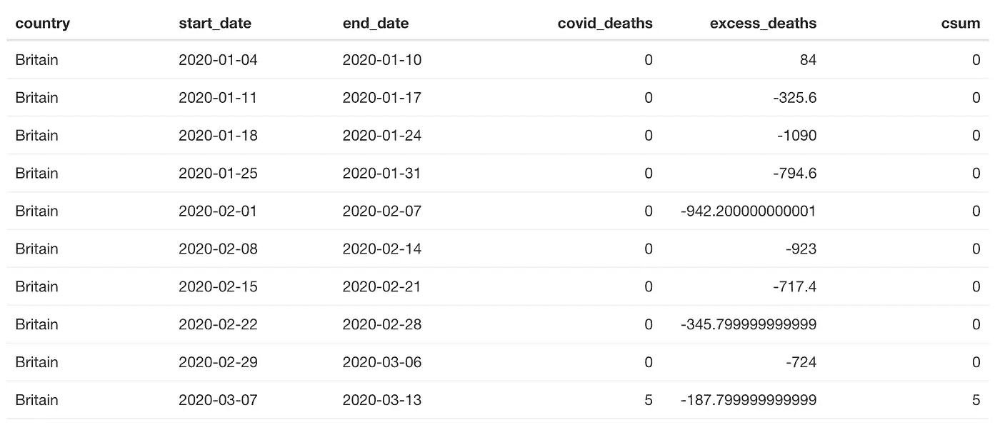

我们需要根据与新冠肺炎相关的总死亡人数和超额死亡人数对每个国家进行分组。然后，利用这两个数字，我们计算出新冠肺炎造成的超额死亡的百分比。这可以作为一个国家新冠肺炎病例漏报的衡量标准。

```
data_for_table <- data_filtered %>%
  filter(excess_deaths > 0) %>%
  group_by(country) %>%
  summarise(
    excess_deaths = round(sum(excess_deaths)),
    covid_deaths = round(sum(covid_deaths)),
    perc = covid_deaths / excess_deaths
  ) %>%
  select(country, covid_deaths, excess_deaths, perc)reactable(data_for_table, pagination = FALSE)
```

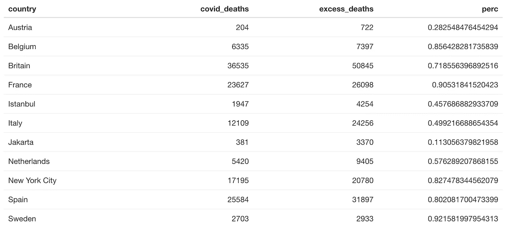

此时唯一缺少的是日期范围。为了找到并显示日期，我们需要找到给定国家/地区达到 50 个新冠肺炎病例后的第一个*日期和该国家/地区数据*中的最后一个*日期。*

我们如何做到这一点？首先，我们将创建一个名为`append_date_suffix`的[函数](https://stackoverflow.com/questions/40039903/r-add-th-rd-and-nd-to-dates)，它根据给定的日期添加适当的后缀。

```
append_date_suffix <- function(dates) {
  suff <- case_when(
    dates %in% c(11, 12, 13) ~ "th",
    dates %% 10 == 1 ~ 'st',
    dates %% 10 == 2 ~ 'nd',
    dates %% 10 == 3 ~ 'rd',
    TRUE ~ "th"
  )
  paste0(dates, suff)
}
```

然后，我们将按`country`变量分组，并找到最小和最大日期(最小日期仅在一个国家出现 50 例 COVID 死亡后出现)。然后，我们对单个的日期和月份进行大量的格式化，并以经济学家*的*风格将它们用破折号附加在一起。抱歉，这里发生了很多事。

```
dates_data <-
  data_filtered %>%
  # only looking at date ranges starting post-50 deaths
  filter(csum > 50) %>%
  group_by(country) %>%
  summarise(start_date = min(start_date),
            end_date = max(end_date)) %>%
  mutate(
    clean_start_day = format(start_date, "%d"),
    clean_start_day = append_date_suffix(as.numeric(clean_start_day)),
    clean_start_month = format(start_date, "%b"),
    clean_end_day = format(end_date, "%d"),
    clean_end_day = append_date_suffix(as.numeric(clean_end_day)),
    clean_end_month = format(end_date, "%b")
  ) %>%
  mutate(
    clean_range = paste0(
      clean_start_month," ", ## Mar
      clean_start_day, "-", ## 6-
      clean_end_month, " ", ## May
      clean_end_day ## 18
    )
  ) %>%
  select(country, clean_range)
```

这将创建如下所示的日期范围:

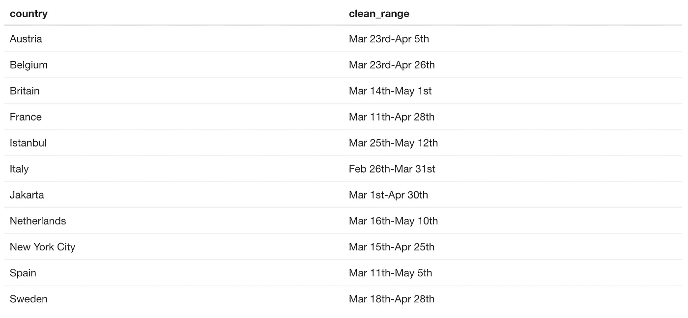

将这些日期与我们现有的数据结合起来…

```
data_for_table <- data_filtered %>%
  filter(excess_deaths > 0) %>%
  group_by(country) %>%
  summarise(
    excess_deaths = round(sum(excess_deaths)),
    covid_deaths = round(sum(covid_deaths)),
    perc = covid_deaths / excess_deaths
  ) %>%
  left_join(dates_data, by = 'country') %>%
  select(country, clean_range, covid_deaths, excess_deaths, perc)
```

我们得到了最终的数据集:

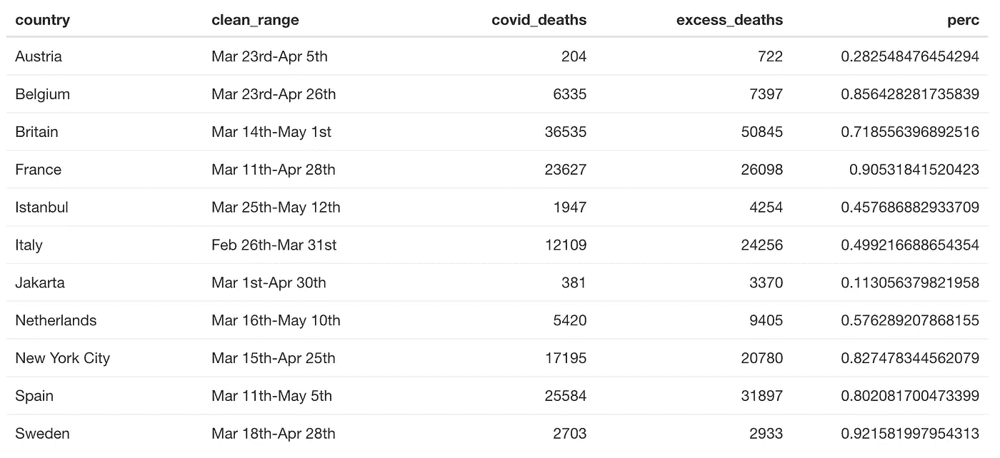

# 创建表

最后，我们准备好获取数据集并创建我们的表。我们可以从定义一些参数开始，这些参数使表格更容易使用，更美观。在这里，我们根据超额死亡进行排序(但不包括箭头)，使其紧凑，并在一页上显示所有结果。

```
reactable(
  data_for_table,
  defaultSortOrder = 'desc',
  defaultSorted = 'excess_deaths',
  showSortIcon = FALSE,
  compact = TRUE,
  pagination = FALSE)
```

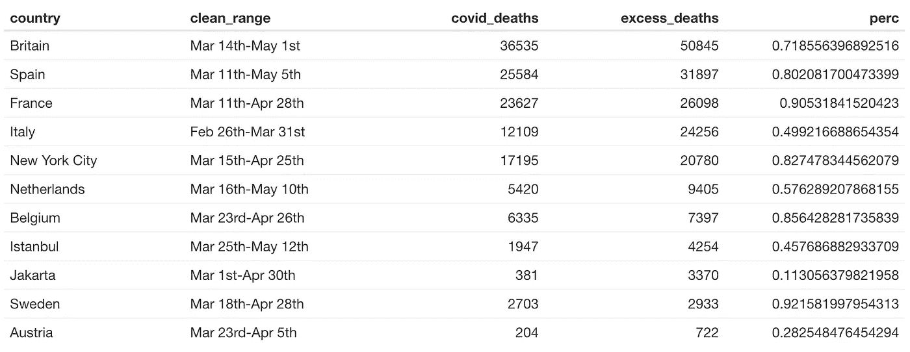

# 样式标题

接下来，让我们使列标题在风格上类似于 *The Economist* 。我们使用 reactable 的`defaultColDef`来实现这一点，在这里我们定义了一个带有标题和常规单元格样式的`colDef`。在这里，我们可以包括 CSS(您可以通过检查手边的表找到它)。在这篇文章中，你会注意到我经常提到`font_es`。这是来自鲍勃·鲁迪斯的《T4》。它包含经济学人 Sans Condensed 的字体名称，这是经济学人使用的字体！

```
reactable(
  data_for_table,
  defaultSortOrder = 'desc',
  defaultSorted = 'excess_deaths',
  showSortIcon = FALSE,
  compact = TRUE,
  pagination = FALSE,
  ######## NEW ########
  defaultColDef = colDef(
    ### define header styling
    headerStyle = list(
      textAlign = "left",
      fontSize = "11px",
      lineHeight = "14px",
      textTransform = "uppercase",
      color = "#0c0c0c",
      fontWeight = "500",
      borderBottom = "2px solid #e9edf0",
      paddingBottom = "3px",
      verticalAlign = "bottom",
      fontFamily = font_es
    ),
    ### define default column styling
    style = list(
      fontFamily = font_es,
      fontSize = "14px",
      verticalAlign = "center",
      align = "left"
    )
  )
)
```

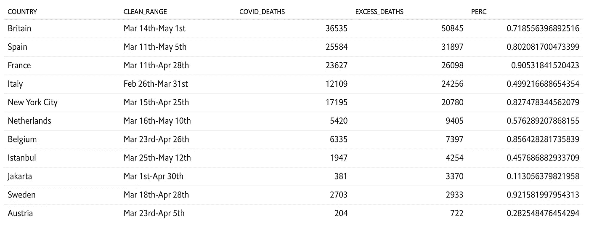

# 格式化列

现在，我们可以开始适当地格式化特定的列。最简单的三栏是**地区/国家**、**时间段**、**新冠肺炎占总数的百分比**。在每一列中，我们都创建了一个`colDef`，它定义了列名以及一些样式。

您会注意到在我们的百分比栏中增加了`JS`。这允许我们在列和列标题中包含 JavaScript。我用它来做一些简单的事情，比如换行。你可以将 JS 用于许多更复杂的目的，[这里记录了其中的一些。](https://glin.github.io/reactable/articles/examples.html)

```
reactable(
  data_for_table,
  defaultSortOrder = 'desc',
  defaultSorted = 'excess_deaths',
  showSortIcon = FALSE,
  compact = TRUE,
  pagination = FALSE,
  defaultColDef = colDef(
    headerStyle = list(
      textAlign = "left",
      fontSize = "11px",
      lineHeight = "14px",
      textTransform = "uppercase",
      color = "#0c0c0c",
      fontWeight = "500",
      borderBottom = "2px solid #e9edf0",
      paddingBottom = "3px",
      verticalAlign = "bottom",
      fontFamily = font_es
    ),
    style = list(
      fontFamily = font_es,
      fontSize = "14px",
      verticalAlign = "center",
      align = "left"
    )
  ),
  ####### NEW #######
  columns = list(
    country = colDef(
      name = "Region / Country",
      style = list(fontFamily = font_es,
                   fontWeight = "400")
    ),
    perc = colDef(
      html = TRUE,
      header = JS("
      function(colInfo) {
        return 'COVID-19 as<br>% of total'
      }"),
      name = "COVID-19 as % of Total",
      align = "right",
      maxWidth = 100,
      format = colFormat(percent = TRUE, digits = 0),
      style = list(fontFamily =  font_es_bold),
      headerStyle = list(
        fontSize = "11px",
        lineHeight = "14px",
        textTransform = "uppercase",
        color = "#0c0c0c",
        fontWeight = "500",
        borderBottom = "2px solid #e9edf0",
        paddingBottom = "3px",
        verticalAlign = "bottom",
        fontFamily = font_es,
        textAlign = "right"
      )
    ),
    clean_range = colDef(
      name = "Time Period",
      style = list(
        color = '#3f5661',
        fontSize = '12px',
        fontFamily = font_es
      )
    )
  )
)
```

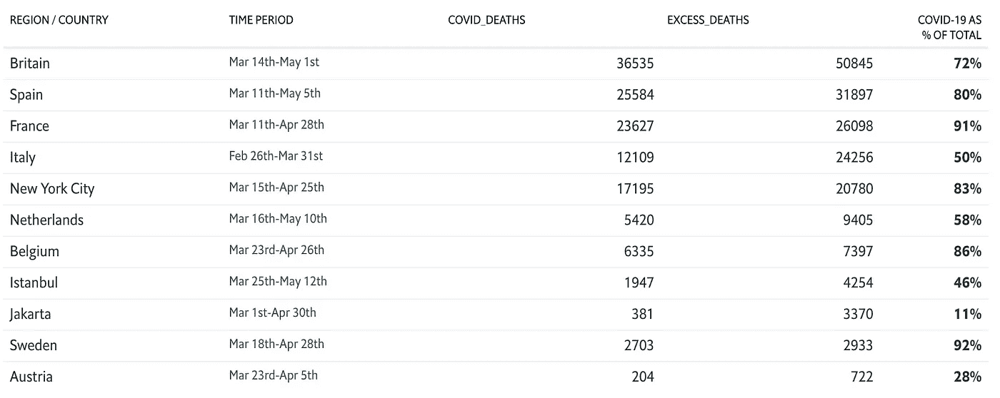

# 添加条形图

我们现在可以创建包含条形图的“死亡”列。

由于集成了 JavaScript，向表格添加条形图变得非常容易。这里，我从`reactable`网站上的一个[示例](https://glin.github.io/reactable/articles/twitter-followers/twitter-followers.html)中提取，并使用以下代码:

```
reactable(
  data_for_table,
  defaultSortOrder = 'desc',
  defaultSorted = 'excess_deaths',
  showSortIcon = FALSE,
  compact = TRUE,
  pagination = FALSE,
  defaultColDef = colDef(
    headerStyle = list(
      textAlign = "left",
      fontSize = "11px",
      lineHeight = "14px",
      textTransform = "uppercase",
      color = "#0c0c0c",
      fontWeight = "500",
      borderBottom = "2px solid #e9edf0",
      paddingBottom = "3px",
      verticalAlign = "bottom",
      fontFamily = font_es
    ),
    style = list(
      fontFamily = font_es,
      fontSize = "14px",
      verticalAlign = "center",
      align = "left"
    )
  ),
  columns = list(
    country = colDef(
      name = "Region / Country",
      style = list(fontFamily = font_es,
                   fontWeight = "400")
    ),
    perc = colDef(
      html = TRUE,
      header = JS("
      function(colInfo) {
        return 'COVID-19 as<br>% of total'
      }"),
      name = "COVID-19 as % of Total",
      align = "right",
      maxWidth = 100,
      format = colFormat(percent = TRUE, digits = 0),
      style = list(fontFamily =  font_es_bold),
      headerStyle = list(
        fontSize = "11px",
        lineHeight = "14px",
        textTransform = "uppercase",
        color = "#0c0c0c",
        fontWeight = "500",
        borderBottom = "2px solid #e9edf0",
        paddingBottom = "3px",
        verticalAlign = "bottom",
        fontFamily = font_es,
        textAlign = "right"
      )
    ),
    clean_range = colDef(
      name = "Time Period",
      style = list(
        color = '#3f5661',
        fontSize = '12px',
        fontFamily = font_es
      )
    ),
    ###### NEW ######
    covid_deaths = colDef(
      name = "COVID-19 Deaths",
      cell = function(value) {
        width <- paste0(value * 100 / max(data_for_table$covid_deaths), "%")
        value <- format(value, big.mark = ",")
        value <- format(value, width = 10, justify = "right")
        bar <- div(
          class = "bar-chart",
          style = list(marginRight = "6px"),
          div(
            class = "bar",
            style = list(width = width, backgroundColor = "#F15A3F")
          )
        )
        div(class = "bar-cell", span(class = "number", value), bar)
      }
    ),
    excess_deaths = colDef(
      name = "Total Excess Deaths",
      cell = function(value) {
        width <-
          paste0(value * 100 / max(data_for_table$excess_deaths), "%")
        value <- format(value, big.mark = ",")
        value <- format(value, width = 10, justify = "right")
        bar <- div(
          class = "bar-chart",
          style = list(marginRight = "6px"),
          div(
            class = "bar",
            style = list(width = width, backgroundColor = "#3F5661")
          )
        )
        div(class = "bar-cell", span(class = "number", value), bar)
      }
    )
  )
)
```

让我们把重点放在`covid_deaths`上，一步一步地分解它。

首先，我们需要定义一些 CSS。`reactable`允许您轻松地将 CSS is RMarkdown 文档包含在定义为`css`的块中。

```
.bar-cell {
  display: flex;
  align-items: center;
}.number {
  font-size: 13.5px;
  white-space: pre;
}.bar-chart {
  flex-grow: 1;
  margin-left: 6px;
  height: 22px;
}.bar {
  height: 100%;
}
```

现在，让我们看看我们如何定义`covid_deaths`:

```
covid_deaths = colDef(
  ### define the name
  name = "COVID-19 Deaths",
  ### create a 'cell' function
  cell = function(value) {
    ### define the bar width according to the specified value
    width <- paste0(value * 100 / max(data_for_table$covid_deaths), "%")
    ### add a comma to the label
    value <- format(value, big.mark = ",")
    ### justify and provide padding with width
    value <- format(value, width = 10, justify = "right")
    ### create the barchart div
    bar <- div(
      ### with a class of 'bar-chart'
      class = "bar-chart",
      ### give the bar a margin
      style = list(marginRight = "6px"),
      ### create the *actual* bar, with the red economist color
      div(
        class = "bar",
        style = list(width = width, backgroundColor = "#F15A3F")
      )
    )
    ### bring it all together, with the 'value' (number) preceding the bar itself
    div(class = "bar-cell", span(class = "number", value), bar)
  }
)
```

这将创建一个如下所示的表:

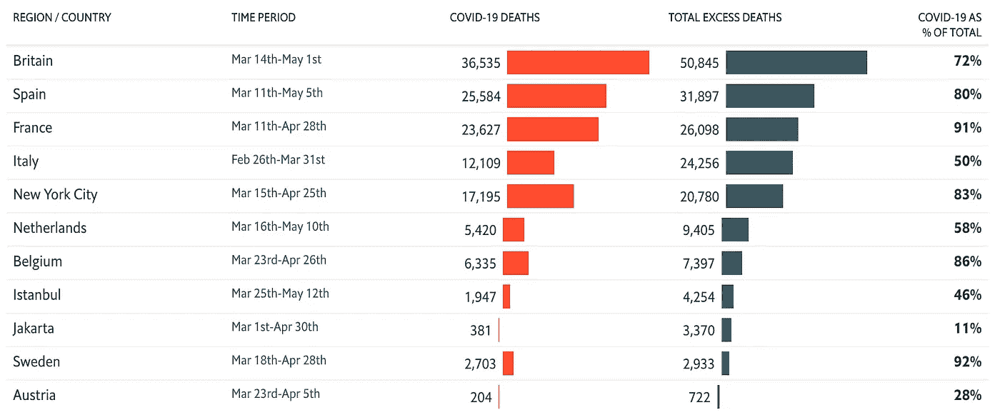

# 添加标题

最后，我们可以添加表格标题和副标题。我们通过在我们的环境中存储上表来做到这一点。(这是最终的表码！)

```
table <- reactable(
  data_for_table,
  defaultSortOrder = 'desc',
  defaultSorted = 'excess_deaths',
  showSortIcon = FALSE,
  compact = TRUE,
  pagination = FALSE,
  defaultColDef = colDef(
    headerStyle = list(
      textAlign = "left",
      fontSize = "11px",
      lineHeight = "14px",
      textTransform = "uppercase",
      color = "#0c0c0c",
      fontWeight = "500",
      borderBottom = "2px solid #e9edf0",
      paddingBottom = "3px",
      verticalAlign = "bottom",
      fontFamily = font_es
    ),
    style = list(
      fontFamily = font_es,
      fontSize = "14px",
      verticalAlign = "center",
      align = "left"
    )
  ),

  columns = list(
    country = colDef(
      name = "Region / Country",
      style = list(fontFamily = font_es,
                   fontWeight = "400")
    ),
    covid_deaths = colDef(
      name = "COVID-19 Deaths",
      # align = "left",
      cell = function(value) {
        width <- paste0(value * 100 / max(data_for_table$covid_deaths), "%")
        value <- format(value, big.mark = ",")
        # value <- str_pad(value, 6, pad = "")
        value <- format(value, width = 10, justify = "right")
        bar <- div(
          class = "bar-chart",
          style = list(marginRight = "6px"),
          div(
            class = "bar",
            style = list(width = width, backgroundColor = "#F15A3F")
          )
        )
        div(class = "bar-cell", span(class = "number", value), bar)
      }
    ),
    excess_deaths = colDef(
      name = "Total Excess Deaths",
      # align = "left",
      cell = function(value) {
        width <-
          paste0(value * 100 / max(data_for_table$excess_deaths), "%")
        value <- format(value, big.mark = ",")
        value <- format(value, width = 10, justify = "right")
        bar <- div(
          class = "bar-chart",
          style = list(marginRight = "6px"),
          div(
            class = "bar",
            style = list(width = width, backgroundColor = "#3F5661")
          )
        )
        div(class = "bar-cell", span(class = "number", value), bar)
      }
    ),
    perc = colDef(
      html = TRUE,
      header = JS("
      function(colInfo) {
        return 'COVID-19 as<br>% of total'
      }"),
      name = "COVID-19 as % of Total",
      align = "right",
      maxWidth = 100,
      format = colFormat(percent = TRUE, digits = 0),
      style = list(fontFamily =  font_es_bold),
      headerStyle = list(
        fontSize = "11px",
        lineHeight = "14px",
        textTransform = "uppercase",
        color = "#0c0c0c",
        fontWeight = "500",
        borderBottom = "2px solid #e9edf0",
        paddingBottom = "3px",
        verticalAlign = "bottom",
        fontFamily = font_es,
        textAlign = "right"
      )
    ),
    clean_range = colDef(
      name = "Time Period",
      style = list(
        color = '#3f5661',
        fontSize = '12px',
        fontFamily = font_es
      )
    )
  ),
)
```

现在，我们可以在表格上方包含一个标题和副标题。我们使用一些`htmltools`函数来创建 div、标题和段落。

```
div(
    div(
      h2("Excess mortality since region/country’s first 50 covid deaths"),
      p(
        ### create the 'Updated on ...' and make it dynamic
        paste0(
          "Updated on ", format(Sys.Date(), "%B "),
          append_date_suffix(
            as.numeric(format(Sys.Date(), "%d"))
            ), " ",
          strftime(Sys.time(), format = "%H:%M"), " UCT"
        )
      ),
    ),
    table)
```

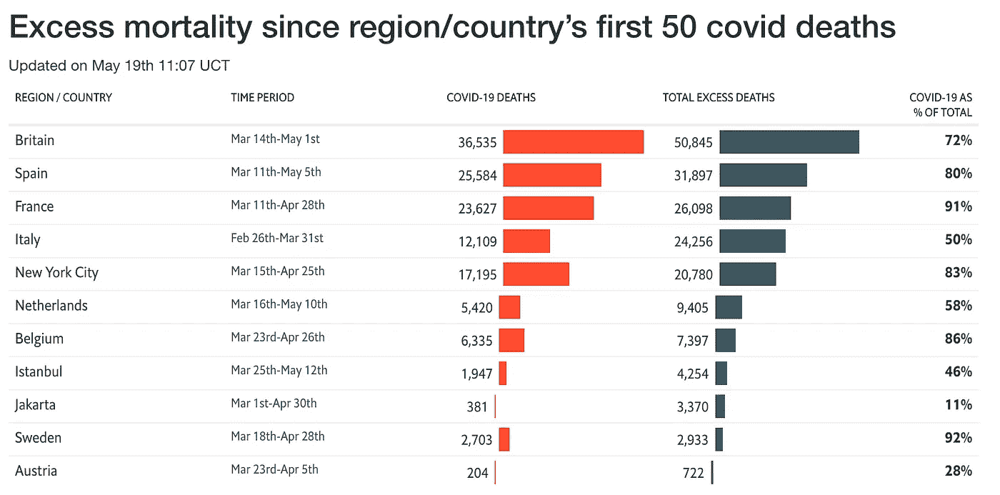

呀！那些字体大小不太符合经济学人的风格。让我们给我们的 div 添加类来匹配它们的风格。

```
.table {
  margin: 0 auto;
  width: 675px;
}.tableTitle {
  margin: 6px 0;
  font-size: 16px;
  font-family: 'Econ Sans Cnd'
}.tableTitle h2 {
  font-size: 16px;
  font-weight: bold;
  font-family: 'Econ Sans Cnd'
}.tableTitle p {
  font-size: 14px;
  font-weight: 500;
}
```

现在我们可以重新运行上面的代码:

```
div(class = "tableTitle",
    div(
      class = "title",
      h2("Excess mortality since region/country’s first 50 covid deaths"),
      p(
        paste0("Updated on ", format(Sys.Date(),"%B "),
          append_date_suffix(
            as.numeric(format(Sys.Date(), "%d"))
            ), " ",
          strftime(Sys.time(), format = "%H:%M"), " UCT"
        )
      ),
    ),
    table)
```

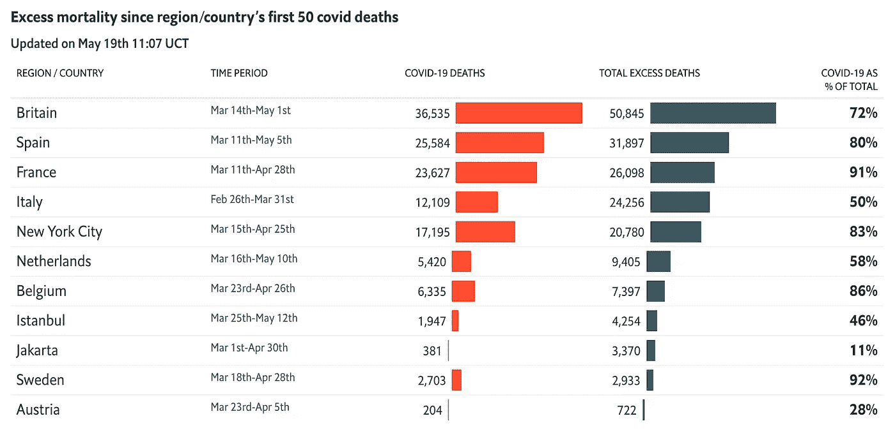

让我们将它与我们试图复制的表进行比较。请注意，在《经济学家》杂志发表他们的表格和我创建我的表格之间的时间里，有些数据已经改变了。

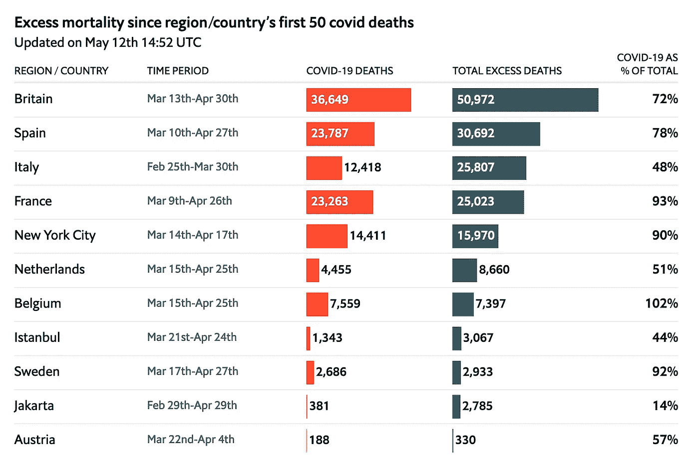

这篇文章的代码可以在我的 GitHub 上找到。你可以把任何关于复制的问题(或任何其他问题)发送给 me@connorrothschild.com，或者在我的推特上。

[https://twitter.com/CL_Rothschild](https://twitter.com/CL_Rothschild)

最初发表在[我的博客上。](https://www.connorrothschild.com/post/economist-table-replication-using-reactable/)