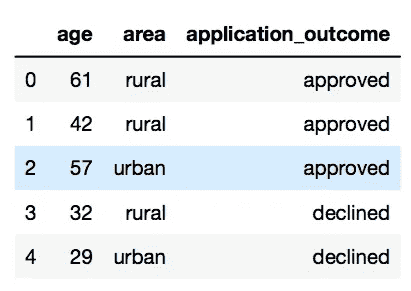
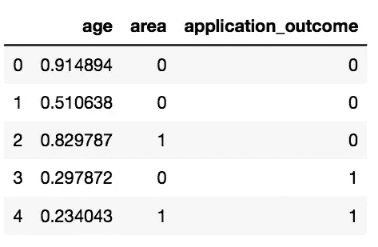

# 在 PyTorch 中重新创建 Keras 代码——入门教程

> 原文：<https://towardsdatascience.com/recreating-keras-code-in-pytorch-an-introductory-tutorial-8db11084c60c?source=collection_archive---------13----------------------->

## 初学者的深度学习

## 学习在 PyTorch 中创建神经网络的基础知识


作者于 [Imgflip](https://imgflip.com/i/4fycse) 创建

***我爱 Keras，我说对了！然而……***

作为一名应用数据科学家，没有什么比用三行代码快速构建一个功能性的神经网络更让我高兴的了！然而，随着我开始更深入地钻研神经网络的黑暗网络，我愿意接受 Pytorch *确实让你对你的网络架构有更大的控制权这一事实。*

鉴于我们大多数人对 Keras 都相当熟悉(如果不熟悉，请参见[这里](/beginners-guide-to-building-artificial-neural-networks-using-keras-in-python-bdc4989dab00)的 Keras 热情介绍)，学习在 Pytorch 中创建一个类似的网络(同时学习 Pytorch 基础知识)一点也不困难。我们开始吧！

*注意:我们不会复制 Keras 代码，因为我想在这个入门教程中介绍 PyTorch 的更多特性和功能！*

# 快速回顾一下 Keras 代码的样子:

下面是创建模型架构、编译模型和最终训练模型的代码片段(来自我之前关于 Keras 中神经网络的[帖子](/beginners-guide-to-building-artificial-neural-networks-using-keras-in-python-bdc4989dab00))。它是一个贷款评估模型，输出贷款应该被接受还是拒绝。

```
*# Model architecture*
model_m = Sequential([
    Dense(units = 8, input_shape= (2,), activation = 'relu'),
    Dense(units = 16, activation = 'relu'),
    Dense(units = 2, activation = 'softmax') 
])*# Model compilation*
model_m.compile(optimizer= Adam(learning_rate = 0.0001), 
              loss = 'sparse_categorical_crossentropy', 
              metrics = ['accuracy'] 
             )*# Model Training and Validation*
model_m.fit(x = scaled_train_samples_mult, 
          y = train_labels, 
          batch_size= 10, 
          epochs = 30, 
          validation_split= 0.1, 
          shuffle = True,
          verbose = 2 
         )
```

总结一下，我们构建了一个有三个隐层的网络，都是`Dense`。三个隐藏层的激活功能分别是`relu`、`relu`和`softmax`。`input_shape`是一个元组`(2,0)`，意味着我们有两个预测特征。`Adam`优化器和学习率`lr = 0.0001`已用于根据训练数据迭代更新网络权重。我们将在每次迭代中监控的损失是`sparse_categorical_crossentropy`。`accuracy`将用于判断网络的好坏。对于培训，我们将使用 30 个`epochs`和 10 个`batch_size`。如果上述任何术语的含义不清楚，请参见此处的[或此处的](/beginners-guide-to-building-artificial-neural-networks-using-keras-in-python-bdc4989dab00)或。

*注:如果你想跟随本教程，请查看 Github* *上的笔记本。*

# 让我们从 PyTorch 开始吧

为了与我们之前使用 Keras 构建的网络保持一定程度的一致性，我将使用相同的数据集，即贷款申请数据集。它看起来是这样的:



在对数据集应用一些预处理后，主要是在 0-1 的范围内缩放所有输入特征(`age`和`area`)并对结果特征(`application_outcome`)进行标签编码，这就是我们最终得到的结果:



## 在 PyTorch 中定义数据集

我们将使用 PyTorch 中的`torch.utils.data.Dataset`类为贷款申请数据集定义一个`Dataset`对象。我们将称它为`CVSDataset`。

我们将在我们的`CSVDataset`类中有四个方法— `__init__`、`__len__`、`__getitem__`和`get_splits`。

```
class CSVDataset(Dataset):

    *# reading the csv and defining predictor and output columns*
    def __init__(self):

        # store the input and output features
        self.X = df.values[:,:-1] 
        self.y = df.values[:,-1] 

        # ensure all data is numerical - type(float)
        self.X = self.X.astype('float32')
        self.y = self.y.astype('float32')

    *# number of rows in dataset*
    def __len__(self):
        return len(self.X)

    *# get a row at an index*
    def __getitem__(self, index):
        return [self.X[index], self.y[index]] # split into train and testset - using `random_split`
    def get_splits(self, split_ratio = 0.2):
        test_size = round(split_ratio * len(self.X))
        train_size = len(self.X) - test_size

        return random_split(self, [train_size, test_size])
```

> 注意:在非常基础的层面上，你为自己的数据集扩展的`Dataset`类应该有`__init__`、`__len__()`和`__getitem__` 方法。

我们首先在`__init__()`中定义预测器`X`和输出特征`y`，并确保类型是浮点型的，因为神经网络只处理数字数据。

`__len__`返回数据集中的行数，而`__getitem__`返回数据集中特定索引处的项目。

此外，我们还定义了一个(可选的)方法`get_splits`，让我们将数据集分成训练集和测试集。我们可以在 Sklearn 中使用`train_test_split`很好地完成这项工作，但这只是展示如何在 PyTorch 中使用`torch.utils.data.random_split`完成这项工作的一种方式。

## 定义模型架构

这是我们定义所有隐藏层在我们的网络中想要什么以及这些层如何相互作用的地方。为此，我们将利用`torch.nn.Module`类并扩展它。我们将称呼我们的班级为`myNeuralNetwork`。

它包含定义层的`__init__`方法和解释输入如何通过定义的层向前传播的`forward`方法。

```
class myNeuralNetwork(Module):
      def __init__(self, n_inputs):
        .
        .
        . def forward(self,X):
        .
        .
        .
```

我们先来看一下`init`方法:

```
def __init__(self, n_inputs):

        # calling constructor of parent class
        super().__init__()

        # defining the inputs to the first hidden layer
        self.hid1 = Linear(n_inputs, 8) 
        kaiming_uniform_(self.hid1.weight, nonlinearity='relu')
        self.act1 = ReLU()

        # defining the inputs to the second hidden layer
        self.hid2 = Linear(8, 16)
        kaiming_uniform_(self.hid2.weight, nonlinearity='relu')
        self.act2 = ReLU()

        # defining the inputs to the third hidden layer
        self.hid3 = Linear(16, 2)
        xavier_uniform_(self.hid3.weight)
        self.act3 = Softmax(dim=1)
```

我们首先使用`super().__init__()`调用父类的构造函数。接下来，我们定义三个隐藏层`hid1`、`hid2`和`hid3`，以及它们的权重初始化和激活函数——`act1`、`act2`和`act3`。

如果您还记得本文开头对 Keras 模型的总结，我们有三个密集的隐藏层。 **Pytorch 相当于 Keras 致密层的是** `**Linear**`。

第一个隐藏线性层`hid1`采用`n_inputs`个输入，输出 8 个神经元/单元。

> 注意:`n_inputs`粗略地翻译为我们有多少预测列(在我们的例子 2 中)。

第二隐层以 8 个神经元为输入，输出 16 个单元。

第三个隐藏层将 16 个神经元作为输入，并产生 2 个单元作为输出(这是贷款申请为`approved`或`rejected`的概率，因为 softmax 激活函数在该层中起作用)。

每个隐藏层的激活函数都存储在`act1`、`act2`和`act3`中。

> 注意:Pytorch 中激活函数的常见例子有`ReLu`、`Sigmoid`、`LogSigmoid`等。

此外，PyTorch 允许您初始化每个隐藏层的权重张量。常见的例子有`kaiming_uniform`、`xavier_uniform`和`orthogonal`。你可以在[文档](https://pytorch.org/docs/stable/nn.init.html)页面上了解更多细节。

现在，让我们看看`forward`方法:

```
def forward(self, X):

        #input and act for layer 1
        X = self.hid1(X)
        X = self.act1(X)

        #input and act for layer 2
        X = self.hid2(X)
        X = self.act2(X)

        #input and act for layer 3
        X = self.hid3(X)
        X = self.act3(X)

        return X
```

每层的输入和激活在该函数中定义。总之，输入`X`进入`hid1`，第一激活功能`act1`应用于此。然后输出被传递到`hid2`，在此应用第二激活功能`act2`等等。由于最后一层有一个 softmax 激活函数，返回的`X`将是一个包含 *n* 个元素的张量，其中 *n* 是输出类的数量(在我们的例子中是两个——批准与拒绝)。

> 张量只不过是 Pytorch 自己的 Numpy 数组。这是一个通用的 n 维数组，用于任意数值计算。

## 在 PyTorch 中准备数据

在我们训练之前，*使用`torch.utils.data.DataLoader`加载*用于训练的数据是很重要的。你会问，为什么需要这样做？它实际上创建了要作为模型输入发送的批次(针对训练和测试集)。它将行的样本、批量大小以及是否重排行作为输入。

*注:我们在* `*test_dl*` *的情况下显式设置* `*shuffle = False*` *是因为我们需要在末尾添加未混淆的标签来绘制混淆矩阵。*

```
# Preparing the dataset before training the model# load the dataset
dataset = CSVDataset()# get the train and test split
train, test = dataset.get_splits()# prepare dataloaders - 
train_dl = DataLoader(train, batch_size = 32, shuffle = True)
test_dl = DataLoader(test, batch_size= 32, shuffle= False)
```

## 训练模型

我们首先通过创建`myNeuralNetwork`对象并传递 2 作为输入来定义模型。这里的 2 是指输入特征的数量。

我们还将设置`epochs = 10`,这意味着模型将根据所有数据训练*10 次。*

对于训练过程，我们将使用随机梯度下降(SGD) `optimizer`。

> 优化器的选择包括`Adam`、`AdaGrad`、`SparseAdam`、`SGD`等，它们的用例可以在[文档](https://pytorch.org/docs/stable/optim.html)中找到。

最后，我们要在训练时监控`CrossEntropyLoss`。

```
# define the network
model = myNeuralNetwork(2) # 2 because we only have 2 input features# define the number of epochs
epochs = 10# define the optimizer - SGD
optimizer = SGD(model.parameters(), lr=0.01, momentum=0.9)# define the loss function
criterion = CrossEntropyLoss()
```

为了训练网络，我们将使用两个 ***用于*** 循环。以下代码中的外循环是训练历元数所必需的，内循环用于迭代`train_dl`中的样本批次。也就是说，对于`train_dl`中的每一批样本，我们将清除梯度、计算模型输出、计算损耗并进行反向传播以更新权重。

```
# iterate through all the epoch
for epoch in range(epochs):
    # go through all the batches generated by dataloader
    for i, (inputs, targets) in enumerate(train_dl):
            # clear the gradients
            optimizer.zero_grad()
            # compute the model output
            yhat = model(inputs)
            # calculate loss
            loss = criterion(yhat, targets.type(torch.LongTensor))
            # credit assignment
            loss.backward()
            # update model weights
            optimizer.step()
```

## 评估模型

为了评估模型，我们将再次使用 ***作为*** 循环来检查`test_dl`中的所有批次。对于每个样本，我们将把它传递给模型并得到输出，即`y_pred`。由于`y_pred`包含两个概率值(一个用于`approved`，一个用于`rejected`，我们将选择概率最高的索引作为最终输出。

最后，我们将实际输出和预测输出存储在两个列表中— `actuals`和`predictions`。

```
# Evaluate the model
predictions, actuals = list(), list()# loop over all batches in test setfor i, (inputs, targets) in enumerate(test_dl):
    # pass input to the model
    y_pred = model(inputs) 
    # retrieve the numpy array
    y_pred = y_pred.detach().numpy()
    # pick the index of the highest values
    res = np.argmax(y_pred, axis = 1) 

    # actual output
    actual = targets.numpy()
    actual = actual.reshape(len(actual), 1)

    # store the values in respective lists
    predictions.append(list(res))
    actuals.append(list(actual))

actuals = [val for sublist in vstack(list(chain(*actuals))) for val in sublist]
predictions = [val for sublist in vstack(list(chain(*predictions))) for val in sublist]
```

为了打印准确度分数，我们将使用`sklearn.metrics`中的`accuracy_score`

```
*# evaluating how good the model is!*
from sklearn.metrics import accuracy_scoreprint("The accuracy is" , accuracy_score(actuals, predictions))
*********************
The accuracy is 0.7495
```

我们成功了！

我们已经使用 PyTorch 创建了一个基本网络。希望这不是太多的信息超载。如果你想获得全部代码，请查看 Github[上的笔记本。在下一篇教程中，我们将深入探讨 Pytorch 提供的一些高级功能。](https://github.com/V-Sher/pytorch_ANN_example)

在那之前:)

[](https://varshitasher.medium.com/membership) [## 阅读瓦希塔·谢尔博士的每一家书店(以及媒体上成千上万的其他作家)

### 作为一个媒体会员，你的会员费的一部分给了你阅读的作家，你可以完全接触到每一个故事…

varshitasher.medium.com](https://varshitasher.medium.com/membership) [](/beginners-guide-to-building-artificial-neural-networks-using-keras-in-python-bdc4989dab00) [## 使用 Python 中的 Keras 构建人工神经网络的初学者指南

### 创建网络架构、训练、验证和保存模型并使用它进行推理的提示和技巧。

towardsdatascience.com](/beginners-guide-to-building-artificial-neural-networks-using-keras-in-python-bdc4989dab00) [](/step-by-step-guide-to-explaining-your-ml-project-during-a-data-science-interview-81dfaaa408bf) [## 在数据科学面试中解释你的 ML 项目的逐步指南。

### 在结尾有一个额外的样本脚本，让你谨慎地展示你的技术技能！

towardsdatascience.com](/step-by-step-guide-to-explaining-your-ml-project-during-a-data-science-interview-81dfaaa408bf) [](/time-series-modeling-using-scikit-pandas-and-numpy-682e3b8db8d1) [## 使用 Scikit、Pandas 和 Numpy 进行时间序列建模

### 直观地利用季节性来提高模型准确性。

towardsdatascience.com](/time-series-modeling-using-scikit-pandas-and-numpy-682e3b8db8d1)