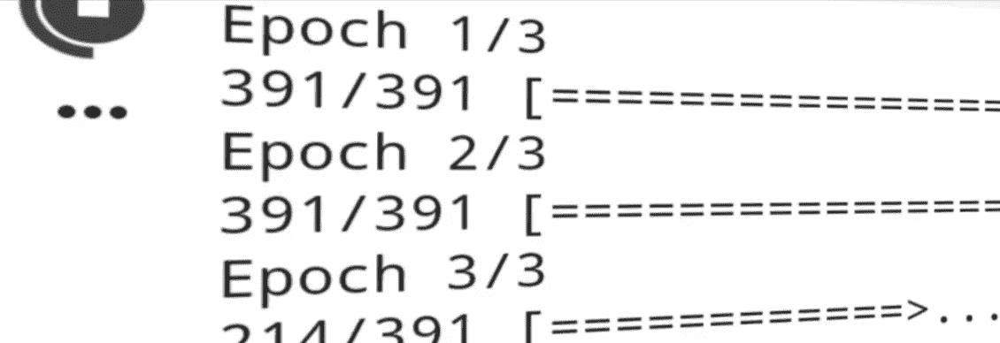

# 用 PyTorch 重新创建 Keras 功能 API

> 原文：<https://towardsdatascience.com/recreating-keras-functional-api-with-pytorch-cc2974f7143c?source=collection_archive---------39----------------------->

## 让我们把喀拉斯的经历带到 PyTorch

作者图片

## 介绍

Francois Chollet(Keras 的创始人)的书《用 Python 进行深度学习》让我进入了深度学习的世界。从那时起，我就爱上了 Keras 的风格。

Keras 是我的第一个框架，然后跳进一点 Tensorflow 然后进来 PyTorch，剩下的就是历史了。

老实说，我真的很兴奋在 Keras 的模型训练中出现的进度条，这真是太棒了:)

那么，为什么不试着把 Keras 训练模特的经验带到 PyTorch 呢？

这个问题让我开始，我最终用所有花哨的进度条重新创建了 Keras 的密集层、卷积层和平坦层。

可以通过将一层堆叠在另一层的顶部来创建模型，并通过简单地调用 fit 方法来训练模型，这与 Keras 的工作方式类似。

## 让我们建造它

对于那些没有使用过 Keras 的人来说，在 Keras 中构建和训练一个模型如下所示:

在 keras 培训全连接网络

**1。导入所需的库**

你可能不熟悉 pkbar 库，它是用来显示进度条的。

导入所需的库

**2。输入层和密集层**

输入层简单地采用将被传递到神经网络并返回它的数据的单个实例的形状，对于全连接网络，它将类似于(1，784)并且对于卷积神经网络，它将是图像的维度(高度×宽度×通道)。

使用大写字母来命名 python 函数是违反规则的，但我们暂时忽略它(Keras 源代码的某些部分使用了相同的约定)。

输入层

密集类通过传递该层的输出神经元的数量和激活函数来初始化。当密集层被调用时，前面的层作为输入被传递。

现在我们有了前一层的信息。如果前一层是输入层，则会创建 PyTorch 线性层，其中包含从输入层返回的形状以及在密集类初始化期间作为参数提供的输出神经元的数量。

如果前一层是密集层，我们通过添加 PyTorch 线性层和用户提供给密集类的激活层来扩展神经网络。

而如果前一层是卷积或展平层，我们会创建一个名为 *get_conv_output()* 的效用函数，得到图像经过卷积和展平层后的输出形状。此维度是必需的，因为如果不向 in_features 参数传递值，我们就无法在 PyTorch 中创建线性图层。

*get_conv_output()* 函数将图像形状和卷积神经网络模型作为输入。然后，它创建一个与图像形状相同的虚拟张量，并将其传递给卷积网络(带有扁平化层)，并返回从中输出的数据大小，该大小作为值传递给 PyTorch 的线性层中的 in_features 参数。

致密层

**3。展平图层**

为了创建展平图层，我们将创建一个名为 flattened layer 的自定义图层类，它接受一个张量作为输入，并在向前传播期间返回张量的展平版本。

我们将创建另一个名为 flatten 的类，当这个层被调用时，前面的层作为输入被传递，然后 flatten 类通过在前面的层上添加我们自定义创建的 flattened layer 类来扩展网络。

因此，所有到达展平层的数据都使用我们自定义创建的展平层类进行展平。

展平图层

**4。卷积层**

我们将通过传入过滤器数量、内核大小、步幅、填充、膨胀和激活函数来初始化 Conv2d 层。

现在，当调用 Conv2d 层时，前面的层被传递给它，如果前面的层是输入层，则创建一个 PyTorch Conv2d 层，它具有提供的过滤器数量、内核大小、步幅、填充、膨胀和激活函数的值，其中 in_channels 的值取自输入形状中的通道数量。

如果前一层是卷积层，则通过添加 PyTorch Conv2d 层和激活函数来扩展前一层，激活函数的 in_channels 值取自前一层的 out_channels。

在填充的情况下，如果用户需要保留从该层输出的数据的维度，那么填充的值可以被指定为“相同”而不是整数。

如果填充的值被指定为“same ”,则使用一个名为 *same_pad()* 的实用函数来获取填充的值，以保持给定输入大小、内核大小、步幅和膨胀的尺寸。

可以使用前面讨论过的 *get_conv_output()* 实用函数获得输入大小。

**5。模型类别**

在构建了我们的模型的架构之后，通过传入输入层和输出层来初始化模型类。但是我给出了一个额外的参数叫做 device，这是 Keras 中没有的，这个参数接受的值是“CPU”或“CUDA ”,它会将整个模型移动到指定的设备。

model 类的 parameters 方法用于返回要提供给 PyTorch 优化器的模型的参数。

模型类有一个名为 compile 的方法，它接受训练模型所需的优化器和损失函数。model 类的 summary 方法借助 torchsummary 库显示创建的模型的概要。

拟合方法用于训练模型，该方法以输入特征集、目标数据集和历元数为自变量。它显示由损失函数计算的损失和使用 pkbar 库的训练进度。

评估法用于计算试验数据的损失和精度。

当使用 PyTorch 数据加载器加载数据时，将使用 fit_generator、evaluate_generator 和 predict_generator。fit_generator 将训练集数据加载器和时期作为参数。evaluate_generator 和 predict_generator 分别采用验证集数据加载器和测试数据加载器来衡量模型对未知数据的执行情况。

模型类

## 最后的想法

我已经使用密集层和卷积神经网络在 CIFAR100、CIFAR10 和 MNIST 数据集上测试了代码。它运行良好，但有巨大的改进空间。

这是一个有趣的项目，我工作了 3-4 天，它真正推动了我用 PyTorch 编程的极限。

你可以在这里查看在上述数据集[上完成训练的完整代码，或者你可以在](https://github.com/bipinKrishnan/torchkeras/blob/master/functional_api_v1.ipynb) [colab](https://colab.research.google.com/github/bipinKrishnan/torchkeras/blob/master/functional_api_v1.ipynb) 中自由调整代码以适合你的喜好。