# 在 R 中重建网飞的分位数自举

> 原文：<https://towardsdatascience.com/recreating-netflixs-quantile-bootstrapping-in-r-a4739a69adb6?source=collection_archive---------44----------------------->

我在做一些随意的数据科学阅读，然后嘣！我在网飞的技术博客上重新发现了一篇很棒的文章:[马丁·廷利](https://www.linkedin.com/in/martintingley/)的《[网飞流式视频实验:可视化实践和统计意义](https://netflixtechblog.com/streaming-video-experimentation-at-netflix-visualizing-practical-and-statistical-significance-7117420f4e9a)》。

它有什么酷的？它提供了一种可扩展的方法来探索大规模在线实验中的异构处理效果。心智融化？好的，我再试一次。它描述了一种方式，实验者可以学到更多的东西，而不仅仅是他们是否有整体影响。相反，它让实验者看到他们如何影响不同的群体。此外，它还可以扩展到处理海量数据！

[马丁和新合著者最近的文章](https://netflixtechblog.com/data-compression-for-large-scale-streaming-experimentation-c20bfab8b9ce)，分享了一个很好的例子来说明这种方法是如何帮助的。下面您可以看到用户的视频质量如何在现有的流配置(生产，黑色设置为零)和新的(治疗，紫色)之间进行比较。

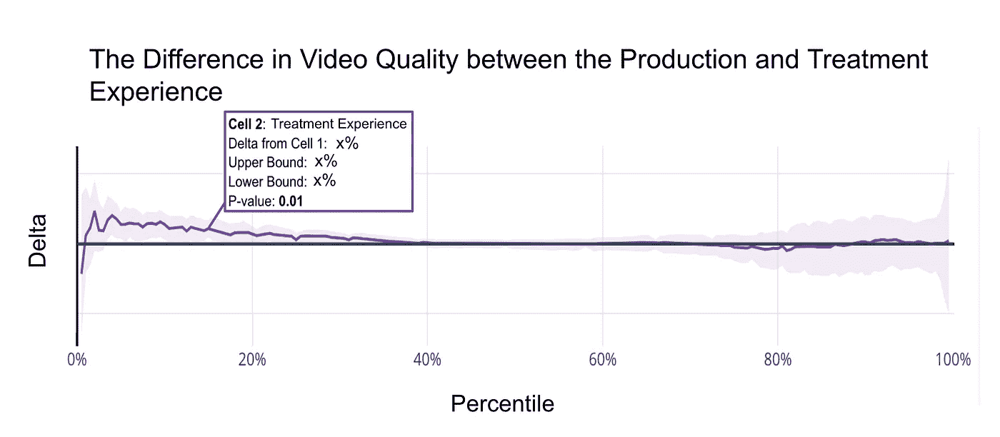

图来自“[大规模流实验的数据压缩](https://netflixtechblog.com/data-compression-for-large-scale-streaming-experimentation-c20bfab8b9ce)”。详细信息:“带阴影置信区间的差异图表明，在分布的最低百分位数处，视频质量有实际和统计上的显著提高”

请记住，特别之处在于看到不同用户的影响如何不同。对质量差的用户有积极的影响(见左边)，对其他人没有显著影响。这意味着产品团队可以从说“质量提高了”变成更有用的话，比如“我们为体验最差的用户提高了质量，而不影响已经有高质量体验的用户。”

这对我来说太棒了，我决定剔除细节，边走边编码学习。更好的是，我正在分享我所做的来节省你的时间！

*注意:我在本文中粘贴了一些有用的代码片段。可以从我的 GitHub repo* *中* [*访问完整的代码演练。*](https://github.com/drsimonj/RecreatingNetflixQuantileBootstrap)

# 入门指南

```
library(tidyverse)
```

## 模拟数据

没有数据我们做不了什么。我将为一组实验对象模拟一个连续的度量标准`x`。想象一下`x`对于网飞的每一个用户来说代表着类似“秒延迟”的东西。为了看起来更合理，我们来看看卡方分布数据:

```
x <- rchisq(n = 200, df = 8)
```

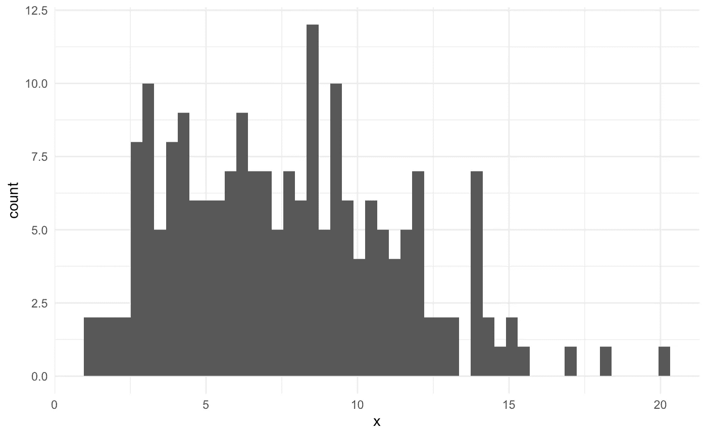

模拟指标的分布，“x”

## 获取分位数

*提醒:* [*分位数*](https://en.wikipedia.org/wiki/Quantile) *是将数据分割成不同大小/百分位数的数值。例如，0.5 分位数将是将数据分成两半的值(因此 50%的值低于该值)。这也是一种叫做中位数的特例。. 25 分位数将是大于数据的 25%的值。要找到特定的分位数，您需要排列数据(从最小到最大)并在 x%位置找到数据点。*

r 有一个俏皮的功能，`quantile()`。让我们用它来得到一个数值范围(用`seq()`设置)，如下所示:

```
quantile_df <- tibble(percentile = seq(0, 1, by = .2)) %>% 
  mutate(value = quantile(x, percentile))
quantile_df#> # A tibble: 6 x 2
#>   percentile value
#>        <dbl> <dbl>
#> 1        0    1.02
#> 2        0.2  4.08
#> 3        0.4  6.31
#> 4        0.6  8.58
#> 5        0.8 11.0 
#> 6        1   20.0
```

轻松点。

# 签到:我们已经可以做一点了

这已经足以产生类似网飞的情节。我们可以模拟两种情况(生产和处理)的数据，并计算每种情况的分位数。

```
*# Simulate data sets. For treatment, we'll bind two distributions
# skewed either side of production*
x_production <- rchisq(200, 8)
x_treatment  <- c(rchisq(100, 12), rchisq(100, 4))group_quantiles_df <- tibble(percentile = seq(0, 1, by = .2)) %>% 
  mutate(production = quantile(x_production, percentile),
         treatment  = quantile(x_treatment, percentile))
group_quantiles_df#> # A tibble: 6 x 3
#>   percentile production treatment
#>        <dbl>      <dbl>     <dbl>
#> 1        0         1.80     0.180
#> 2        0.2       4.76     2.83 
#> 3        0.4       6.44     5.22 
#> 4        0.6       7.96     8.04 
#> 5        0.8      10.3     13.2  
#> 6        1        27.9     36.2
```

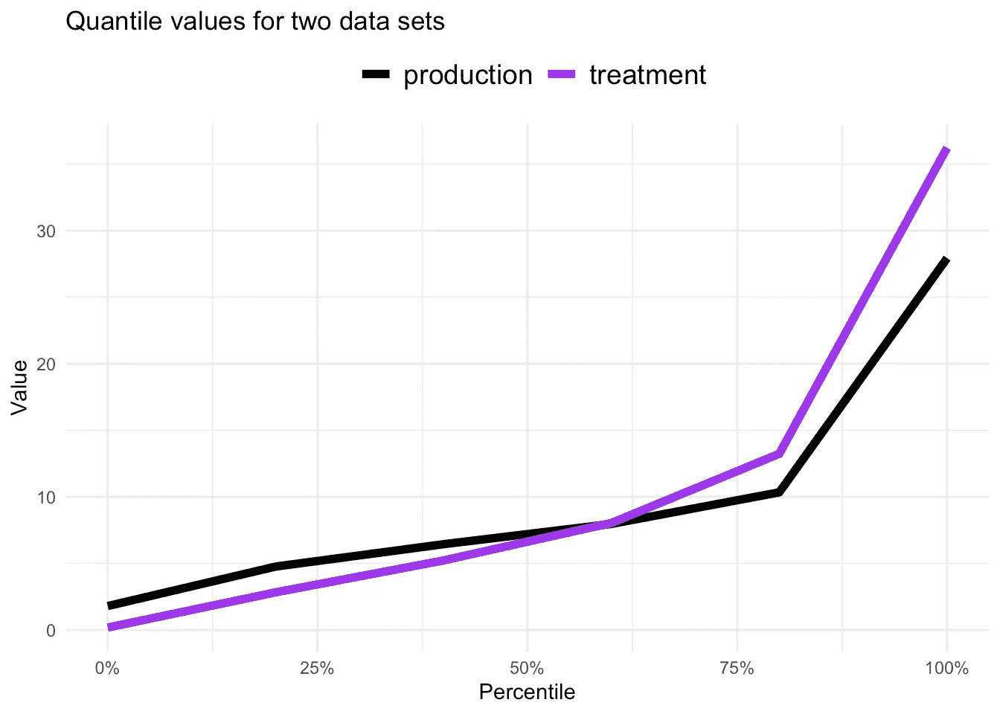

网飞图显示了与产量(产量= 0)相比的“差异”，对我们来说是这样的:

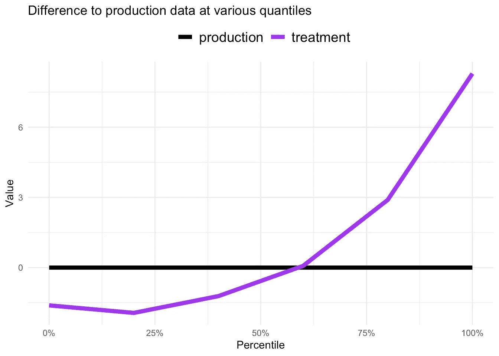

对于几行代码来说相当不错！好吧，我们的数据和他们的不同，但是概念都是一样的。

# 自举差异

我们已经走了很远，但是缺少了一些重要的东西:置信区间(原始图中的透明带)。这些告诉我们两组之间是否有显著差异。让我们迎接挑战，开始行动吧。我们需要考虑的第一件事是引导。

*提醒:*[*Bootstrapping*](https://en.wikipedia.org/wiki/Bootstrapping_(statistics))*是一个随机抽取一堆数据进行替换的过程。您可以使用这个新样本计算所有感兴趣的统计数据(例如，分位数)。然后重复多次，每次得到的结果都略有不同，并建立起一种不确定感。*

我们可以很容易地用 R 的`sample()`和`replace = TRUE`创建一个自举。结果将是一个向量，其长度与原始数据相同，但使用替换对其进行采样。

```
x_bootstrap <- sample(x, replace = TRUE)
```

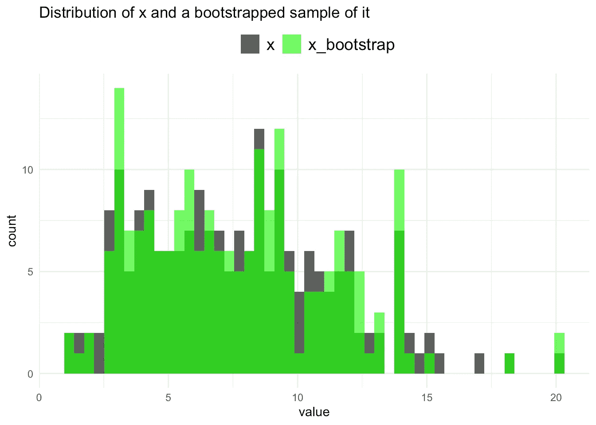

对于每个数据集(生产和处理),我们多次这样做，每次都保存自举样本的分位数。

```
n_bootstraps <- 100
quantile_df_template <- tibble(percentile = seq(0, 1, by = .2))bootstrapped_quantiles <- map_df(seq_len(n_bootstraps),function(i) {
  bootstrapped_production <- sample(x_production, replace = TRUE)
  bootstrapped_treatment  <- sample(x_treatment, replace = TRUE)

  quantile_df_template %>%
    mutate(bootstrap = i,
           production = quantile(bootstrapped_production,
                                 percentile),
           treatment  = quantile(bootstrapped_treatment, 
                                 percentile))
})bootstrapped_quantiles#> # A tibble: 600 x 4
#>    percentile bootstrap production treatment
#>         <dbl>     <int>      <dbl>     <dbl>
#>  1        0           1       1.80     0.180
#>  2        0.2         1       4.84     3.16 
#>  3        0.4         1       6.41     5.58 
#>  4        0.6         1       8.24     7.48 
#>  5        0.8         1      11.0     14.9  
#>  6        1           1      27.9     36.2  
#>  7        0           2       1.80     0.180
#>  8        0.2         2       4.80     2.93 
#>  9        0.4         2       7.14     5.07 
#> 10        0.6         2       8.78     7.79 
#> # … with 590 more rows
```

这给了我们每个百分点的很多点(每个引导一个点)。下图以红色显示了原始`production`数据的范围和平均值。

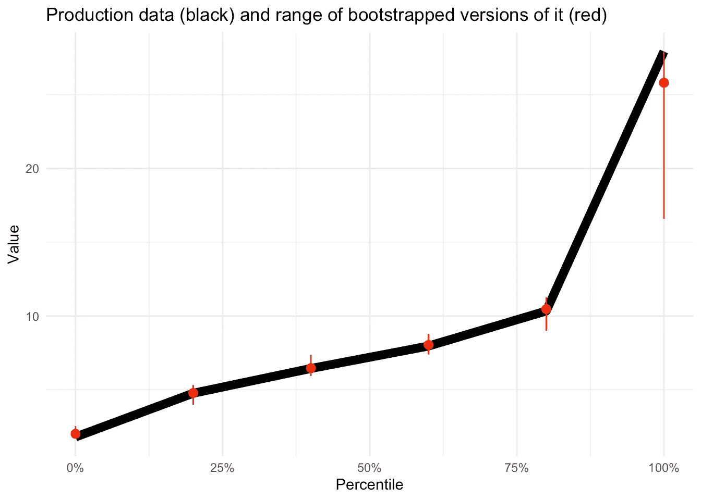

现在，我们真正感兴趣的是两组之间的差异。让我们为生产和处理自举分位数之间的“差异”重复这个过程。然后使用这些数据计算与生产数据相比，围绕处理条件绘制的“范围”。

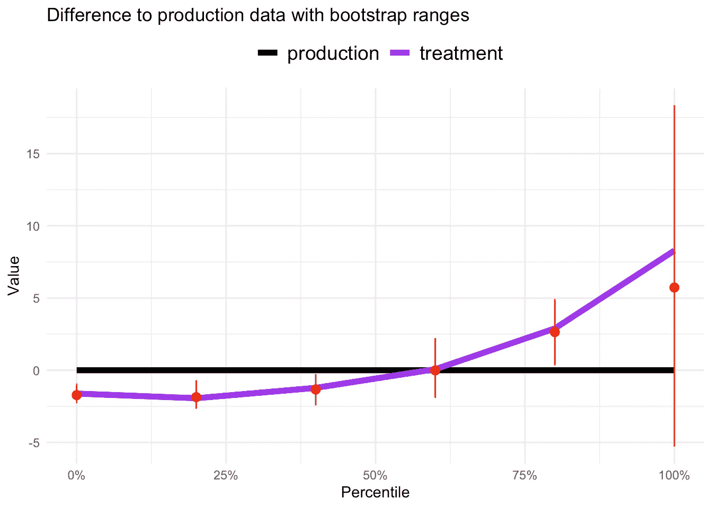

# 置信区间

*提醒:* [*置信区间*](https://en.wikipedia.org/wiki/Confidence_interval) *为可以被认为与我们观察到的数据显著不同的东西设定界限。显著性由一个称为显著性标准的概率阈值决定。*

上面我们绘制了自举分位数差异的完整范围，但这不是我们想要的。我们实际上想要置信区间。为了得到这些，我们需要运行一定数量的自举，然后计算出截断最高和最低自举值的点，以给我们自己留下特定百分比的结果。例如，如果我们的显著性标准是 5%，这是非常典型的，我们希望得到砍掉最低和最高 2.5%数据的点。额外收获:这些对应于自举差异的 0.025 和 0.975 分位数！

这段代码可以让我们快速到达目的地:

```
bootstrapped_cis <- bootstrapped_quantiles %>% 
  mutate(q_dif = treatment - production) %>% 
  group_by(percentile) %>% 
  summarise(lower_bound = quantile(q_dif, .025),
            upper_bound = quantile(q_dif, .975))bootstrapped_cis#> # A tibble: 6 x 3
#>   percentile lower_bound upper_bound
#>        <dbl>       <dbl>       <dbl>
#> 1        0        -2.28       -1.00 
#> 2        0.2      -2.53       -0.984
#> 3        0.4      -2.09       -0.351
#> 4        0.6      -1.19        2.03 
#> 5        0.8       0.825       4.75 
#> 6        1        -4.72       16.3
```

我们现在可以将这些数据绘制成透明带！

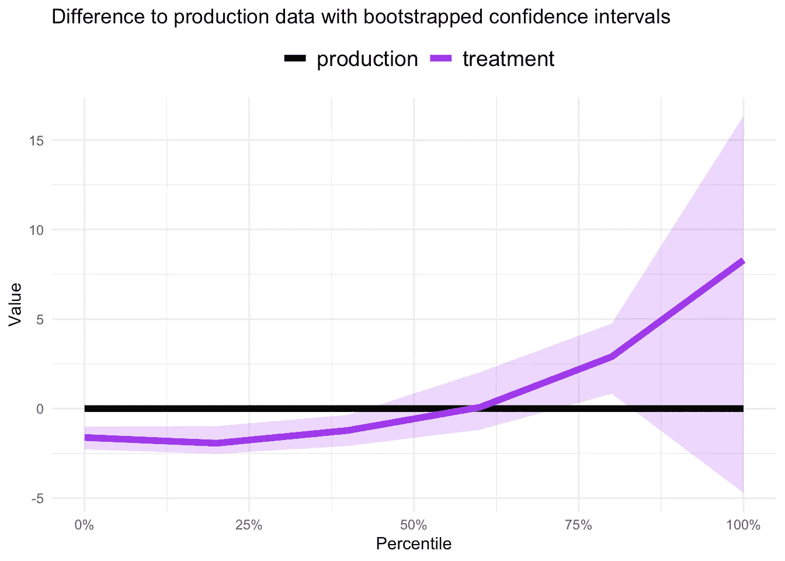

看起来不错！由此，我们可以得出结论，我们的治疗组明显低于较低百分位数的产量，可能高于 80%左右，在其他地方没有不同。

# 提高数字

你已经得到了提高数字所需的一切。更大的数据集，更多的数量，更多的引导。您可能会得到这样的结果:

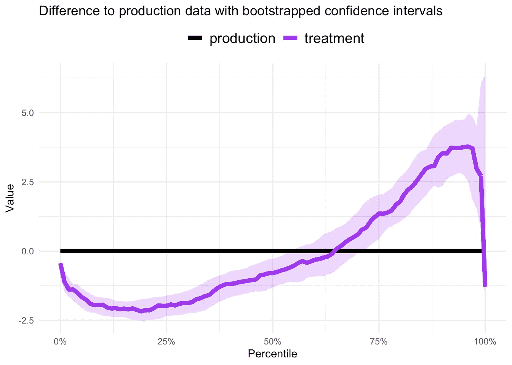

现在我们正在谈话！

# 是时候获得(更多)技术了

好了，该认真了。Martin 继续分享如何处理(1)多重比较和(2)大量数据的“一些技术细节”。让我们按顺序解决它们。

## 多重比较

当你运行一个实验并比较组平均值时，你做了一个统计测试。你可以使用 95%的置信区间，有 5%的机会错误地说有差异，而实际上没有差异(统计学家说有 5%的假阳性率)。在这里，我们实际上运行了许多测试:每个分位数一个。Lots =倍数；测试=比较。[多重比较](https://en.wikipedia.org/wiki/Multiple_comparisons_problem)！这可能不太直观，但请相信我，对所有这些测试使用 95%的置信区间会使你出错的几率大大高于 5%。不酷😬

幸运的是，有一个解决方案。我们可以调整显著性阈值，使出错的总体几率达到期望的水平。这可以通过 [Bonferroni 修正](https://en.wikipedia.org/wiki/Bonferroni_correction)来实现，我们可以估计独立测试的数量(而不是因为使用了更多的分位数而受到惩罚)。我先不为新手读者解释这个，让我们看看代码。

PSA:我已经根据我所能读到的拼凑了这些，但我愿意接受修改。

```
*# Sum of the correlations between bootstrapped
# differences at each quantile*
cor_sum <- bootstrapped_quantiles %>%
  transmute(bootstrap, percentile, 
            q_dif = treatment - production) %>% 
  pivot_wider(names_from = percentile, values_from = q_dif) %>% 
  select(-bootstrap) %>% 
  cor() %>% 
  .[-upper.tri(.)] %>% 
  sum()*# Estimated number of independent tests*
n_tests_estimate <- length(quantile_seq) ^ 2 / cor_sum
n_tests_estimate#> [1] 2.289841# Bonferroni adjusted confidence interval
desired_error_rate  <- 0.05
adjusted_error_rate <- desired_error_rate / n_tests_estimate
adjusted_error_rate#> [1] 0.022
```

为了处理我们的多重比较并保证只有 5%的错误率，我们应该使用 97.8%的置信区间(从`1 — 0.022`)而不是 95% ( `1 — 0.05`)。因此，我们不是在 0.025 和 0.975 分位数处截断自举数据，而是在 0.011 和 0.989 处截断。

这显示了不同之处:

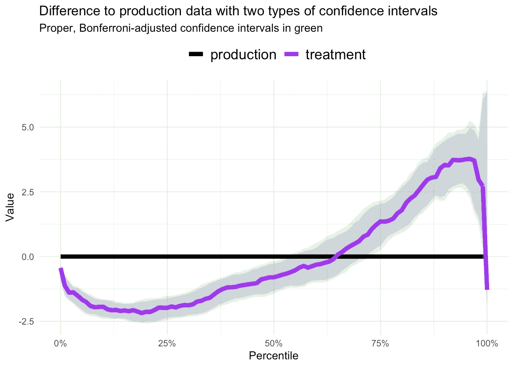

请注意，经过适当调整的绿色置信区间比原始区间更宽。因此，我们对统计显著性的评估更为保守，将我们的总体误差率保持在 5%。

不错！

## 基于大数据的快速引导

到目前为止，一切都很酷，但如果你有从数千次实验中产生的大量数据，就会崩溃。聪明的解决方案是通过将数据压缩到均匀大小的桶中来近似计算结果，并引导这些桶而不是原始数据。这意味着无论原始大小如何，数据都可以压缩到设定数量的存储桶。

*提示:我发现跟随最近的文章* *会更容易理解这个话题。如果你想看一个不同的应用程序，请阅读我之前关于回归的文章。*

第一步，获取有序存储桶中的数据，跟踪每个存储桶的计数和汇总统计数据(我将使用中间值)。我们可以在`cut_number()`(来自 tidyverse 自带的 ggplot2)的帮助下做如下操作。

```
# Define number of buckets per group
n_buckets <- 100# Compress data into buckets of even counts
compressed_data <- tibble(production = x_production, 
                          treatment = x_treatment) %>% 
  pivot_longer(c(production, treatment),
               names_to = "group", values_to = "x") %>% 
  group_by(group) %>% 
  mutate(x_bucket = cut_number(x, n_buckets)) %>% 
  group_by(group, x_bucket) %>% 
  summarise(count = n(),
            x = median(x)) %>%
  ungroup()compressed_data#> # A tibble: 200 x 4
#>    group      x_bucket    count     x
#>    <chr>      <chr>       <int> <dbl>
#>  1 production (1.53,1.94]    10  1.69
#>  2 production (1.94,2.15]    10  2.06
#>  3 production (10.1,10.3]    10 10.2 
#>  4 production (10.3,10.4]    10 10.4 
#>  5 production (10.4,10.6]    10 10.5 
#>  6 production (10.6,10.8]    10 10.7 
#>  7 production (10.8,10.9]    10 10.8 
#>  8 production (10.9,11]      10 11.0 
#>  9 production (11,11.2]      10 11.1 
#> 10 production (11.2,11.3]    10 11.2 
#> # … with 190 more rows
```

下一个挑战是获得分位数，因为`quantile()`不再工作了。没什么大不了的。让我们添加一个累积百分比列，并编写一个函数来根据需要搜索数据框。

```
# Add cumulative percentile to compressed data for easy search
compressed_data <- compressed_data %>% 
  group_by(group) %>% 
  arrange(x) %>% 
  mutate(cum_percentile = cumsum(count) / sum(count)) %>% 
  ungroup()

compressed_data#> # A tibble: 200 x 5
#>    group      x_bucket       count     x cum_percentile
#>    <chr>      <chr>          <int> <dbl>          <dbl>
#>  1 treatment  [0.0539,0.412]    10 0.223           0.01
#>  2 treatment  (0.412,0.547]     10 0.447           0.02
#>  3 treatment  (0.547,0.769]     10 0.675           0.03
#>  4 treatment  (0.769,0.881]     10 0.812           0.04
#>  5 treatment  (0.881,0.986]     10 0.926           0.05
#>  6 treatment  (0.986,1.08]      10 1.01            0.06
#>  7 production [0.493,1.53]      10 1.08            0.01
#>  8 treatment  (1.08,1.21]       10 1.11            0.07
#>  9 treatment  (1.21,1.33]       10 1.23            0.08
#> 10 treatment  (1.33,1.43]       10 1.38            0.09
#> # … with 190 more rows*# Function we can reuse to get `x` quantile from the compressed data*
x_at_percentile <- **function**(percentile, compressed_df) {
  i <- 1
  **while** (compressed_df$cum_percentile[i] < percentile) {
    i <- i + 1
  }
  **return** (compressed_df$x[i])
}# Test
compressed_data %>% 
  filter(group == "production") %>% 
  x_at_percentile(.5, .)#> [1] 7.361729
```

最好确保它能工作！下面我用这两种方法从原始数据和压缩数据中得到生产数据的分位数。

```
quantile_df <- tibble(percentile = seq(0, 1, by = .1)) %>%
  mutate(original = quantile(x_production, percentile)) %>%
  mutate(compressed = map_dbl(
    percentile,
    x_at_percentile,
    filter(compressed_data, group == "production")
  ))
```

当我们绘制原始和压缩的结果时，我们得到:

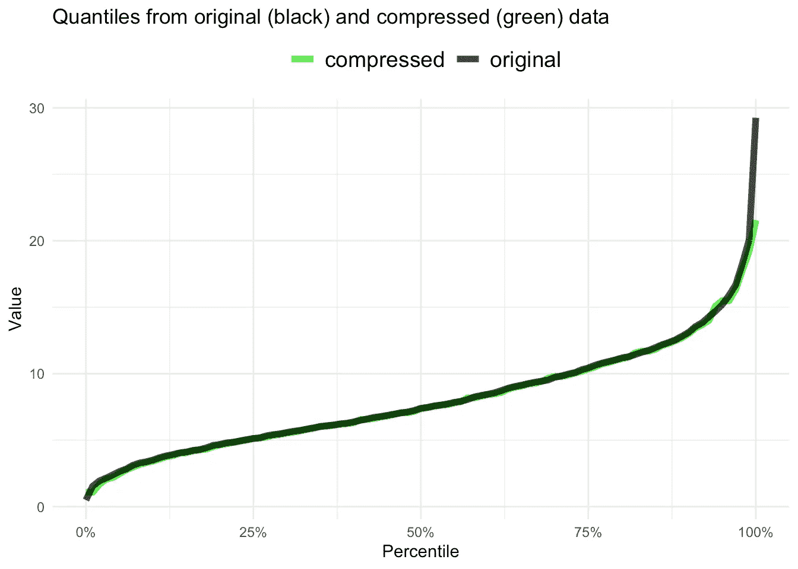

看起来是一个很好的近似值，我们没有使用太多的数据或桶。这只会随着更多的原始数据和更多的桶而变得更准确(显然“几千”应该可以做到)。

我们现在可以压缩我们的数据，无论数据有多大，都可以大规模管理！

我们需要知道的最后一件事是如何引导压缩数据集。我们现在对压缩数据帧的行进行采样(包含计数和汇总值)。这可以通过`sample_n()`(来自 tidyverse 附带的 dplyr)来完成。下面是一个简单的示例，它对压缩的生产数据进行采样，并重新计算累积的百分位数:

```
# A bootstrap of the compressed data
compressed_data %>% 
  filter(group == "production") %>% 
  sample_n(n(), replace = TRUE) %>% 
  arrange(x) %>% 
  mutate(cum_percentile = cumsum(count) / sum(count))#> # A tibble: 100 x 5
#>    group      x_bucket    count     x cum_percentile
#>    <chr>      <chr>       <int> <dbl>          <dbl>
#>  1 production (1.53,1.94]    10  1.69           0.01
#>  2 production (2.15,2.39]    10  2.19           0.02
#>  3 production (2.39,2.65]    10  2.48           0.03
#>  4 production (2.39,2.65]    10  2.48           0.04
#>  5 production (3.29,3.38]    10  3.31           0.05
#>  6 production (3.38,3.51]    10  3.43           0.06
#>  7 production (3.69,3.82]    10  3.75           0.07
#>  8 production (3.69,3.82]    10  3.75           0.08
#>  9 production (3.92,4.05]    10  4.02           0.09
#> 10 production (3.92,4.05]    10  4.02           0.1 
#> # … with 90 more rows
```

请注意，正如原始数据一样，引导会导致行被多次采样(例如，行 3 和 4、行 7 和 8 或行 9 和 10)。这就是为什么我们重新计算百分点，一切都应该工作。

*注意:如果每行的计数不相等，您需要做一些加权，以确保具有较高计数的行以较高的速率被采样。但是，我们将数据分成大小相等的组，因此可以忽略这一点，并以相等的概率对行进行采样。*

# 那都是乡亲们！

嗯，我们也是。这些都是你开始大规模实施网飞分位数自举技术需要解决的问题。

尽管如此，我还是要给你一个重要的警告。撰写本文和代码是为了帮助理解正在发生的事情。这绝对不是为了表现。所以不要把它扔进任何实验管道，因为 s*！%会出问题。想要启动并运行这项技术吗？使用一个小数据集来试验这些代码，直到您理解发生了什么。然后慢慢地改进性能，反复测试准确性和处理更大数据的能力。完成后，请回到这里分享您的作品:)