# 在 PowerBI 中重现 Gapminder 情节

> 原文：<https://towardsdatascience.com/recreating-the-gapminder-plot-in-powerbi-2b2eb6061dc6?source=collection_archive---------51----------------------->

## COVID19 会改变 2020 年的趋势吗？

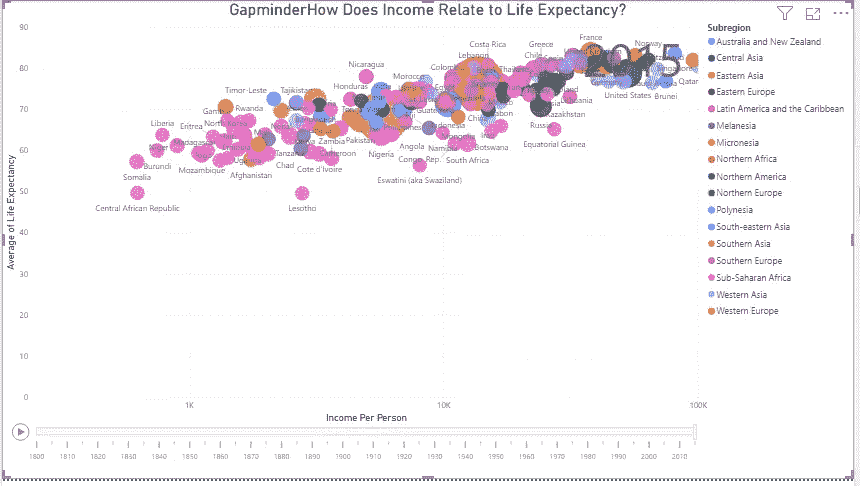

在过去的几周里，我看到了许多关于 COVID19 对全球健康和经济影响的分析和可视化。

这不仅仅是一场寻找疾病治疗方法的竞赛，它还激发了人们对数据科学的兴趣，因为它适用于抗击疫情。

我也要加入这股潮流。

对于初学者来说，我认为汉斯·罗斯林教授著名的 Gapminder 图是最好的选择。罗斯林教授做了一件了不起的工作，用这个图讲述了一个故事，从那时起，它已经成为事实上的初学者数据可视化项目。

事不宜迟，我们来做剧情吧！

# 准备数据

首先，我们必须获得用于可视化的数据。你可以从 Gapminder 网站[这里](https://www.gapminder.org/data/)或者我的 GitHub [repo](https://github.com/kennethjhim/Gapminder-PowerBI/tree/master/data2018) 下载数据。

这些数据与以下内容有关

*   预期寿命(年)
*   人均收入(国内生产总值/人均，经通货膨胀调整的购买力平价美元)
*   总人口
*   世界各地区

打开 CSV 文件，您会注意到它们是“宽”格式(区域除外)，如下所示

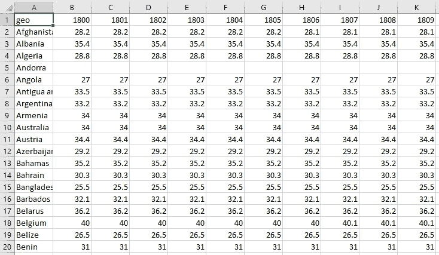

“宽”格式的数据

我们必须将数据转换为“长”或“整齐”格式，以创建 Gapminder 图。

先说预期寿命数据。

1.  创建一个新的 PowerBI 文件并转到*主页>获取数据> Text/CSV* 。选择预期寿命 CSV 文件
2.  在 PowerQuery 编辑器中，将第一行提升为列标题。
3.  要变成“整齐”格式，选择`geo`列并点击*转换>取消透视其他列*。我们希望年份和值组成新的列。
4.  将这些列分别重命名为`Country`、`Year`和`Life Expectancy`。
5.  为尾随空格修剪`Country`列

数据现在应该如下所示

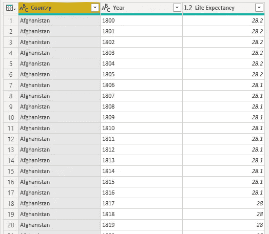

长格式的预期寿命数据

对收入和人口数据重复上述过程。

这样做之后，收入和人口数据应该如下所示

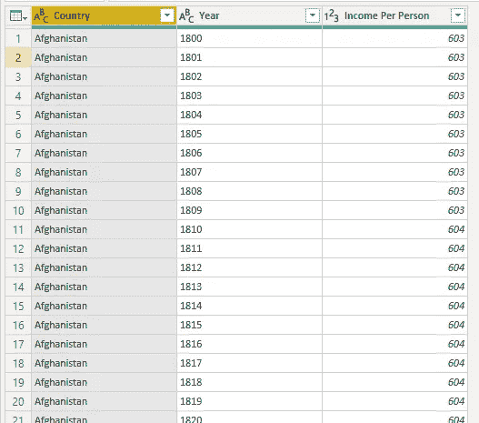

“长”格式的收入数据

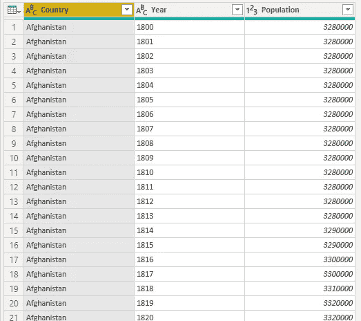

“长”格式的人口数据

区域数据已经是“长”或“整齐”的格式，但我们必须进一步格式化它，以便稍后进行合并。

1.  将`name`列重命名为`Country`
2.  删除除`Country`、`region`和`sub-region`列之外的其他列。
3.  南极洲没有标明区域或次区域。我们只是通过创建条件列将南极洲分配给这些列。举个例子，

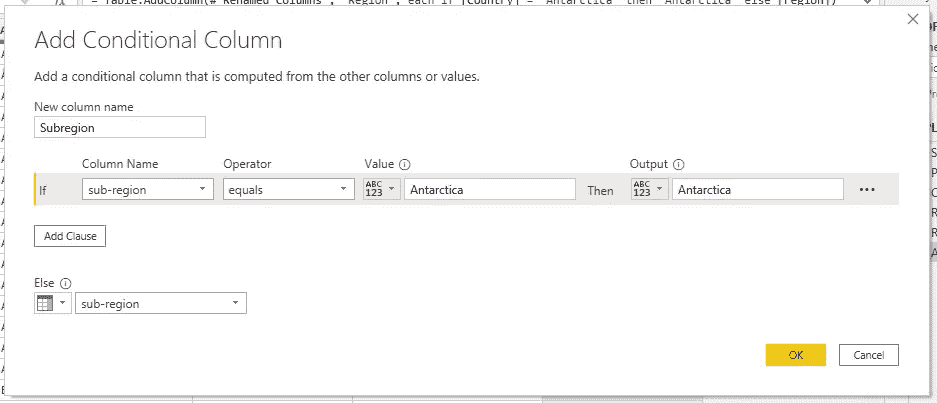

上面创建了一个新的列`Subregion`，如果`Country`是南极洲，则使用南极洲，否则使用`sub-region`列的值。对`Region`栏进行同样的操作。之后去掉旧的`region`和`sub-region`列。

4.最后，为尾随空格修剪`Country`列

区域数据现在应该如下所示

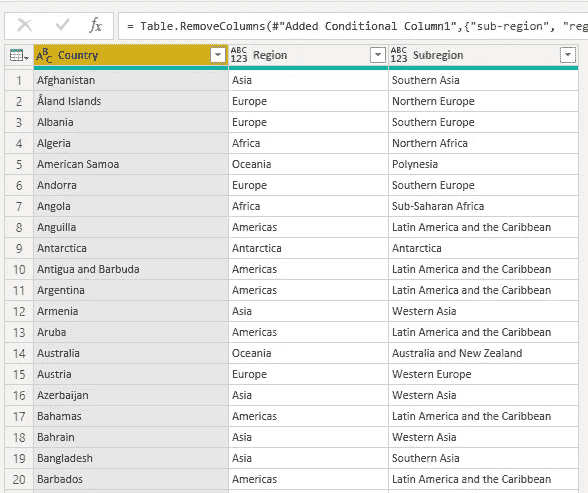

# 组合数据

下一步是结合预期寿命、收入和人口数据。

*我们必须这样做有三个原因*

1.  我们的数据没有相同的行数。预期寿命数据有 186 行，收入数据有 193 行，人口数据有 195 行。
2.  我们将把`Years`列限制为 5 的倍数。这是为了在我们将数据动画化后使趋势更加明显。

让我们从结合我们的数据开始。

1.  创建新的合并查询(*新查询>将>合并查询合并为新的*)
2.  将预期寿命和收入数据合并如下。

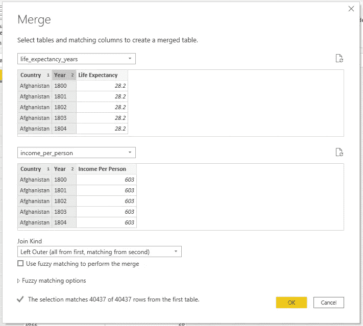

我们首先选择预期寿命数据，因为它的行数最少。通过选择左连接，没有匹配预期寿命的国家将在结果合并中被移除。这是为了确保一旦合并完成，所有国家都有预期寿命、收入和人口。

3.扩展列以包含人均收入数据。

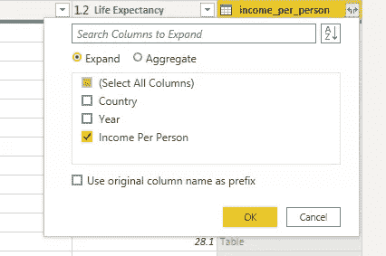

展开合并的数据

对人口数据重复上述过程。数据最终应该如下所示

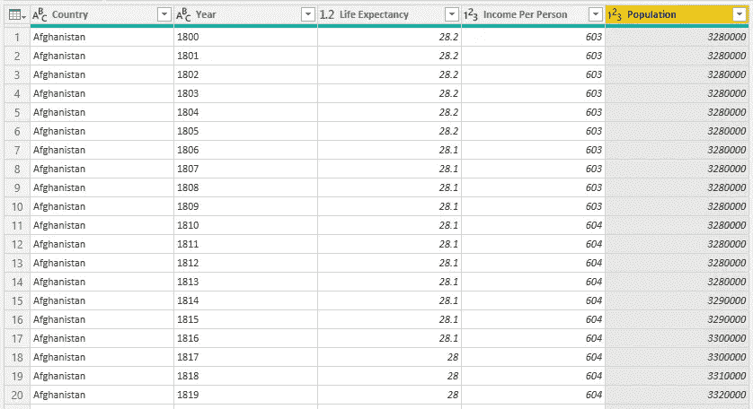

结果数据有 186 行，我们可以确定所有国家都有所有必需的字段，因为我们前面使用了左连接。

# 过滤数据

为了在我们将数据制成动画后使趋势更加明显，让我们将`Years`列过滤为 5 年间隔。我们可以用 PowerQuery 中的`Number.Mod`函数来实现这一点

1.按如下方式创建新列

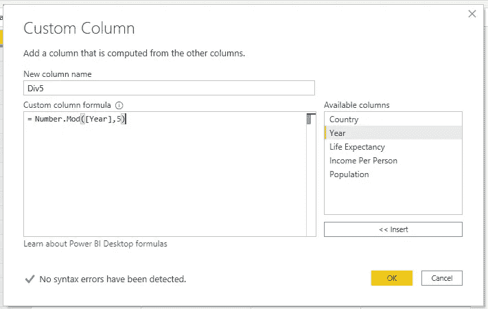

2.筛选自定义列以仅包含 0 或可被 5 整除的年份。随后删除自定义列

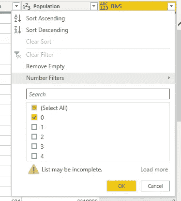

结果数据应该如下所示

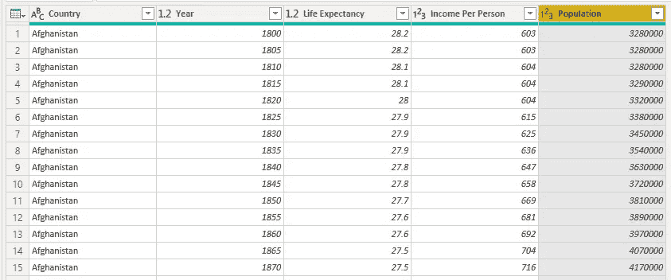

过滤数据

将合并的数据重命名为 Gapminder。

# 可视化数据

经过所有这些准备，我们现在终于准备好创建我们的可视化。

来绘制 Gapminder 图。
1。将散点图拖放到我们的 PowerBI 窗口。适当调整大小。

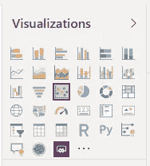

2.将字段拖动到绘图中适当的轴上

```
X-axis — Gapminder[Income Per Person]
Y-axis — Gapminder[Life Expectancy] summarized by Average
Size — Gapminder[Population]
Play Axis — Gapminder[Year]
Details — Gapminder[Country]
```

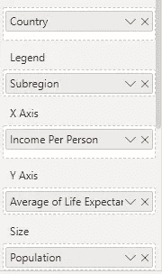

3.让我们在`Subregion`的基础上给`Countries`着色。为此，让我们首先在 Gapminder(合并)数据和 Regions 数据之间创建一个关系。

转到`Modelling > Manage Relationships`。按如下方式创建关系

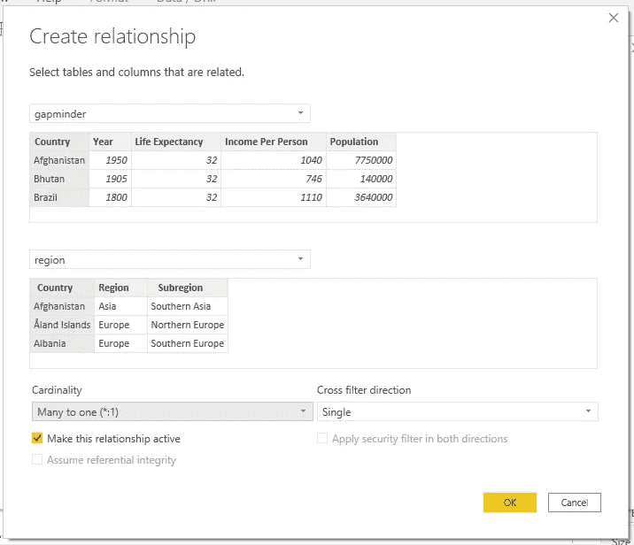

请注意，我选择利用关系，而不是合并数据，因为它不像前面的过程那样混乱。现在，这两个数据的主键只是`Country`列。

4.让我们格式化我们的图表，使它更清晰。转到*格式*面板，按如下方式调整轴

```
X-axis — make it a logarithmic scale, max of 120,000
Legend — put in the Right
Category Labels — turn it on to show Country names
Title — put “How Does Income Relate to Life Expectancy?”
```


最终的情节现在看起来像这样


最终 Gapmidner 图

你可以在这里下载 T4。

如果你玩这个 1910 年到 1920 年的 PowerBI，你会注意到，与 1910 年和 1915 年相比，1920 年很少有圆点移动得更低。

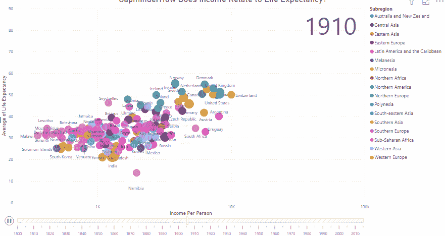

由于西班牙流感，这些国家在 20 世纪 20 年代移到了左下方

这当然是因为西班牙流感从 1918 年 1 月到 1920 年 12 月持续了 36 个月，感染了 5 亿人——约占当时世界人口的三分之一。

【2020 年，COVID19 也会这样吗？

我们不知道，我也希望不知道。然而，一旦 2020 年的数据出来，我很高兴能重现这个图。

***感谢您阅读我的文章。关注我上***[***Twitter***](https://twitter.com/iamkennethcpa)***和***[***Linkedin***](https://www.linkedin.com/in/kennethinfante/)***。***

***退房还我的书***[***PowerQuery 熊猫指南***](https://leanpub.com/powerqueryguidetopandas) ***上***[***Leanpub***](https://leanpub.com/powerqueryguidetopandas)***。***