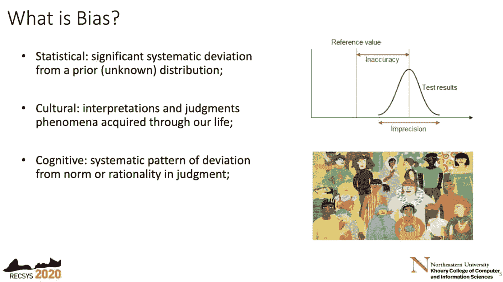
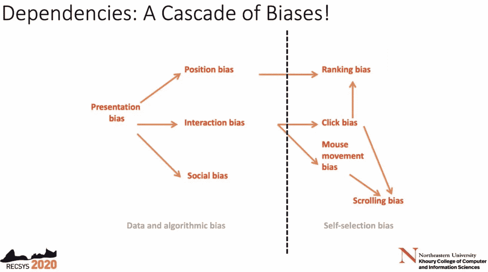
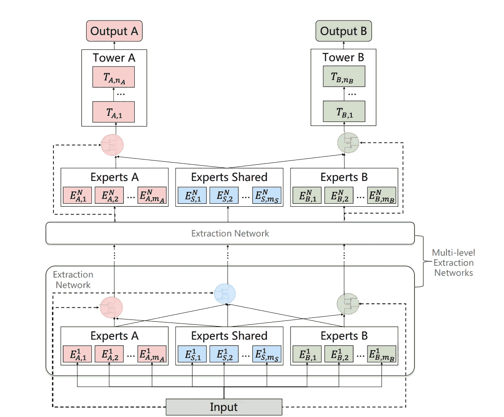
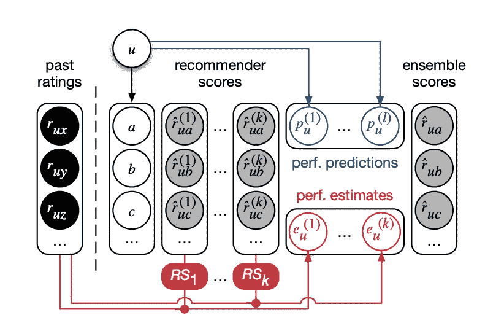
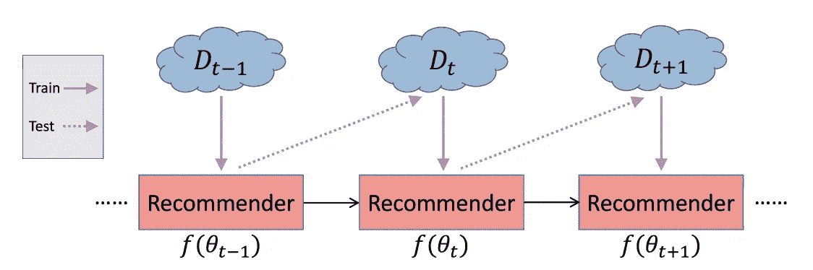
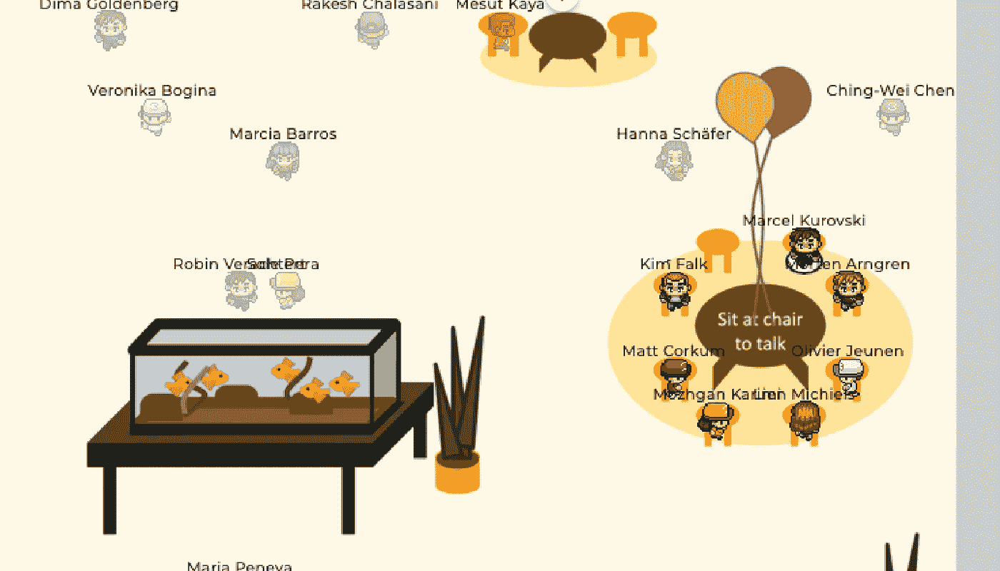
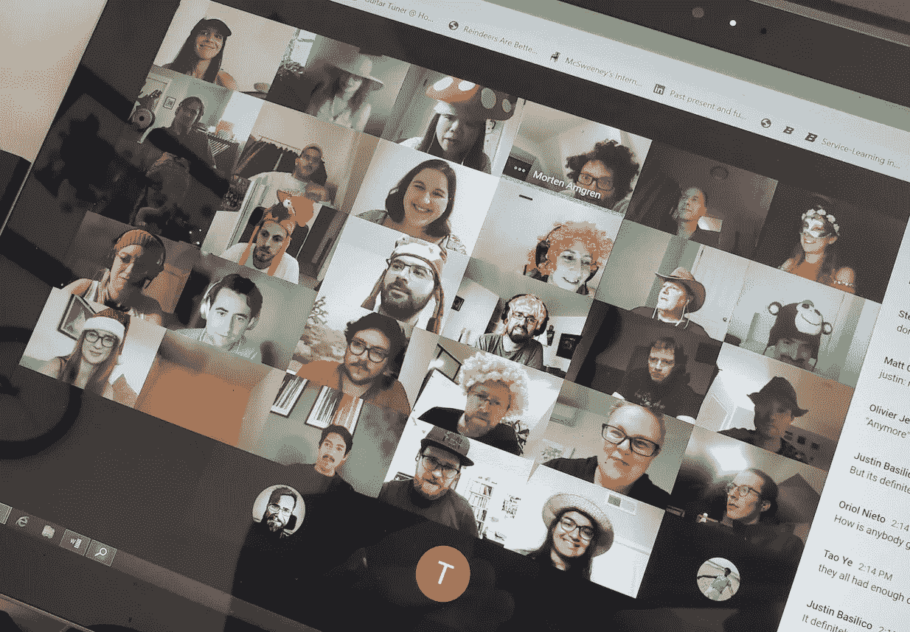
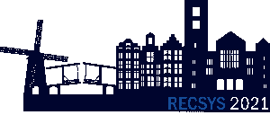

# RecSys 2020:第 14 届推荐系统会议纪要

> 原文：<https://towardsdatascience.com/recsys-2020-highlights-of-the-14th-conference-on-recommender-systems-1bdac5f5ef22?source=collection_archive---------31----------------------->

莱昂纳多·马里尼奥在 [Unsplash](https://unsplash.com?utm_source=medium&utm_medium=referral) 上的照片

第 14 届 ACM 推荐系统会议在许多方面都很特别:一个完全虚拟的会议，它在保持社交互动方面做了令人惊叹的工作——即使许多人在位置和时间上都很远。另一方面:偏见和公平从来没有像现在这样普遍和受到重视。这篇博客引导你参加会议，提供了演示文稿、材料和论文的有用链接。所以，(再次)享受这个会议吧。

计划在里约热内卢举行(首次在南美举办)今年的 RecSys 于 9 月 22 日至 26 日举行，其中前三天是主要会议，随后两天是教程和研讨会。第 0 天——一如既往——是为博士研讨会预留的。2019 年 10 月[拉丁美洲推荐系统学校率先推出了整个南美和拉丁美洲 RecSys 体验。](https://sbbd.org.br/lars2019/)

# RecSys 2020 的几个数字

会议完全是虚拟的。现场论文、海报和辅导会议分两次进行，每次间隔 11 小时，以适应来自全球所有时区的演示者和参与者。然而，会议仍然是单轨制，允许每个人看到和参与所有的事情。

*   1200 多名参与者:64%来自工业界，36%来自学术界，21%是学生
*   主会议: [3 场主题演讲](https://recsys.acm.org/recsys20/keynotes/)，9 场论文会议，12 场社交会议，3 场海报会议
*   [6 教程](https://recsys.acm.org/recsys20/tutorials/)， [12 工作坊](https://recsys.acm.org/recsys20/workshops/)
*   39/218 长论文提交被接受(18%) —新的提交记录！
*   26/128 篇短文被接受(20%)
*   2/7 的论文(29%)通过了新引入的再现性跟踪
*   25%的提交来自美国
*   话题焦点从算法(2020 年为 47%对 26%)转移到应用(2020 年为 17%对 39%)
*   接受 10/20 工业捐款
*   Linus Dietz 跑了 46.6 公里的总距离，获得了最佳跑步者奖

# 关于操纵、偏见和对话式人工智能代理的主题演讲

每个主要会议日都以主题演讲开始:

## 菲利普·门策尔:社交媒体让我们容易被操纵的 4 个原因

在第一天，来自印第安纳大学社交媒体观察站的菲利普·门泽尔谈到了“社交媒体让我们容易被操纵的 4 个原因”(在 YouTube 上找到相同的演讲)。考虑到最近美国大选或当前疫情电晕的社交媒体反响，他提出了有趣的模拟和分析，概述了以下四个原因:

1.  操纵
2.  平台偏差
3.  信息过载
4.  回声室

通过对内容病毒式传播，特别是假新闻传播和社交机器人行为的说明，这次谈话非常有趣，也非常具体。他还展示了在不同的用户注意力和信息过载以及特定的信息共享模式下，质量和受欢迎程度的相关性。门策尔还分享了[在他的实验室创造的各种有趣的工具](http://osome.iuni.iu.edu/tools/)。在他的总结中，他声称“认知、社会和算法偏见的相互作用使我们容易受到错误信息的影响”，并且“社交机器人利用了这些漏洞”。这很好地反映了今年 RecSys 在偏见研究方面的许多贡献。绝对值得笑的是他对成年人批判性思维能力的评论:

> 孩子们的批判性思维不如成年人，相信我，成年人也没有多少批判性思维。

## 里卡多·巴埃萨-耶茨:搜索和推荐系统中的偏见

第二天的主题演讲完美地延续了第一天的内容。来自东北大学的里卡多·巴埃萨-耶茨教授发表了“搜索和推荐系统中的偏见”(非常相似的演讲[在这里](https://www.youtube.com/watch?v=brr8cZHf2ec))。他构建了渗透在个性化网络中的各种偏见的复杂相互作用，其中搜索和推荐系统是主导力量。通过活动、算法和认知偏差等总体偏差，他深入研究了这种复杂相互作用中出现的一些恶性反馈循环的复杂性。

图片来自里卡多·巴埃萨-耶茨:搜索和推荐系统中的偏见

图片来自里卡多·巴埃萨-耶茨:搜索和推荐系统中的偏见

幸运的是，他还触及了去偏置技术，不同目标的相关性，如多样性、意外收获或仅次于准确性的新颖性。他还提出了在不损害长期商业目标的情况下进行更多探索的理由。这是一个警告，但仍然是令人鼓舞的谈话。

## 米歇尔·周:“你真的懂我”——能够真正理解和帮助用户的对话式人工智能代理

还讨论了这些对话代理在现实世界中的应用。不幸的是，网上没有类似的谈话，但你可能会发现[最近与她的对话部分](https://www.youtube.com/watch?v=flI5-GKVACQ&t)的采访很有趣。

# 最佳论文

会议再次向最佳长篇和短篇论文以及最佳评论者颁奖。

最佳长论文奖由腾讯的唐等人颁发给[【渐进式分层抽取(PLE):一种新颖的多任务学习(MTL)个性化推荐模型】](https://dl.acm.org/doi/pdf/10.1145/3383313.3412236))，以表彰他们改进腾讯视频推荐系统的方法。他们的解决方案解决了负迁移，负迁移描述了推荐系统中多个松散相关甚至冲突的任务之间不利的折衷。作者将最先进的 MTL 模型中的结果现象描述为*跷跷板现象*，其中一些任务得到改善，而牺牲了其他任务。他们提出了共享学习结构，以提高共享学习效率，从而缓解跷跷板现象和负迁移。通过工业和公共基准数据集，他们提供了他们的方法优于先前方法的证据。

图片来自唐等:[、:一种新颖的多任务学习(MTL)个性化推荐模型](https://dl.acm.org/doi/pdf/10.1145/3383313.3412236))

[Gustavo Penha 和 Rodrygo L. T. Santos 的“利用性能评估增加推荐集合”](https://dl.acm.org/doi/pdf/10.1145/3383313.3412264)获得了**最佳长论文亚军**。在他们的工作中，他们提出了一种个性化的方法来组合推荐器集成的基本估计器，以在最先进的集成推荐器结果中实现显著更高的准确性。至此，他们利用历史用户反馈来生成*性能估计*，当生成集合推荐时，该性能估计用作基本推荐器的个性化权重。

图片来自 Gustavo Penha 和 Rodrygo L. T. Santos: [利用性能评估来扩充推荐集合](https://dl.acm.org/doi/pdf/10.1145/3383313.3412264)

最后，**最佳短文**是米等人的“[【ADER:面向连续学习的基于会话的推荐的自适应提取样本重放”](https://dl.acm.org/doi/pdf/10.1145/3383313.3412218)。作者提出了一种基于会话的推荐器的连续更新方法，减轻了灾难性遗忘的风险。因此，他们确定并使用一小组有代表性的历史序列数据(样本),以便在对新数据以及蒸馏损失进行训练时进行重放。

图片来自 Mi 等人:[自适应提取样本回放，实现基于会话推荐的持续学习](https://dl.acm.org/doi/pdf/10.1145/3383313.3412218)

引起我兴趣的其他论文，也是我阅读清单上的下一篇:

*   Afchar 和 Hennequin (Deezer 研究):[用属性使神经网络可解释:应用于隐含信号预测](https://dl.acm.org/doi/pdf/10.1145/3383313.3412253)
*   Sato 等人(富士施乐):[对建议的因果效应进行无偏学习](https://dl.acm.org/doi/pdf/10.1145/3383313.3412261)
*   黄等:[将数据集偏差排除在模拟之外:基于强化学习的推荐系统去偏差模拟器](https://dl.acm.org/doi/pdf/10.1145/3383313.3412252)
*   Schnabel 等人(微软):[用小型注释数据集消除项目间推荐的偏见](https://dl.acm.org/doi/pdf/10.1145/3383313.3412265)
*   Rendle 等人(谷歌研究):[神经协同过滤与矩阵分解再探](https://dl.acm.org/doi/pdf/10.1145/3383313.3412488)
*   李等:[层叠式混血儿土匪:在线学习相关性和多样性排名](https://dl.acm.org/doi/pdf/10.1145/3383313.3412245)
*   戈登堡等人(Booking.com): [免费午餐！投资回报约束内动态促销推荐的追溯提升建模](https://dl.acm.org/doi/pdf/10.1145/3383313.3412215)
*   Aridor 等人:[解构过滤泡沫——用户决策和推荐系统](https://dl.acm.org/doi/pdf/10.1145/3383313.3412246)
*   Saito: [双稳健估计器，用于对点击后转化率指标进行排名](https://dl.acm.org/doi/pdf/10.1145/3383313.3412262)
*   王等:[推荐系统的因果推理](https://dl.acm.org/doi/pdf/10.1145/3383313.3412225)
*   郭等(推特):[深度贝叶斯盗匪:探索在线个性化推荐](https://dl.acm.org/doi/pdf/10.1145/3383313.3412214)

# 主导主题:偏见，公平，因果关系，强盗和强化学习

在我个人看来，近年来对狭隘地关注准确性的强烈抗议已经被机构群体所听到。会议的主要议题包括承认偏见和发展消除偏见的技术，超越相关性和试图模拟因果关系，以及解决公平和问责问题。我相信，RecSys 研究团体对这些问题的了解比一般社会所认为的要多得多。然而，我的观点偏向于我在会议上看到的，而不是每个系统背后发生的事情。但也有证据表明，解决这些问题可以推动有益的长期商业目标，因此符合行业自身的利益。

这篇博客不能总结所有的发展和趋势，但它应该作为那些不能参加或想重温的人的一个切入点。关于回顾和思考观点，来自网飞的 Justin Basilico 做了一个非常翔实和精心制作的概述:[“网飞最近的个性化趋势”](https://www.slideshare.net/justinbasilico/recent-trends-in-personalization-at-netflix)

衡量标准的层次(图片来自 Justin Basilico 的[网飞最近的个性化趋势](https://www.slideshare.net/justinbasilico/recent-trends-in-personalization-at-netflix)

他为网飞确定的趋势似乎很好地反映了整个会议的大部分内容，这就是为什么我强烈建议看一下幻灯片:

*   因果关系
*   盗匪
*   强化学习
*   目标
*   公平
*   体验个性化

# 练习技能和加强交流的教程和研讨会

第四个会议日安排了 6 个针对 RecSys 实践的高级主题的教程:

*   对话式推荐系统:[视频](https://www.youtube.com/watch?v=RdGnJSRA0aw&ab_channel=ACMRecSys)
*   推荐系统的特征工程(Nvidia rapids.ai): [视频](https://www.youtube.com/watch?v=uROvhp7cj6Q&amp;ab_channel=ACMRecSys)和[代码](https://github.com/rapidsai/deeplearning/tree/main/RecSys2020Tutorial)
*   在搜索和推荐系统中抵消偏见并增加公平性:[视频](https://www.youtube.com/watch?v=TtF6exuBbSU&amp;ab_channel=ACMRecSys)、[幻灯片](http://fate.infoseeking.org/resources/RecSys2020_tutorial.pdf)和[参考文献](http://fate.infoseeking.org/resources/RecSys2020_tutorial_references.pdf)
*   推荐系统中的土匪简介:[视频](https://www.youtube.com/watch?v=rDjCfQJ_sYY&amp;ab_channel=ACMRecSys)和[代码](https://gitlab.insight-centre.org/andbar/bears/tree/master/tutorials/RECSYS2020)
*   基于贝叶斯值的推荐:基于代理和反事实策略的推荐(Criteo)的一种基于模型的替代方案:[视频](https://www.youtube.com/watch?v=DrsFfor1n3U&amp;ab_channel=ACMRecSys)和[代码](https://github.com/nd7141/recsystutorial)
*   对抗性学习推荐:安全和生成性任务的应用—概念到代码:[视频](https://www.youtube.com/watch?v=tjzykHbBd0w&ab_channel=ACMRecSys)、[幻灯片](https://github.com/sisinflab/amlrecsys-tutorial/blob/master/Tutorial-AML-RecSys2020.pdf)和[代码](https://github.com/sisinflab/HandsOn-RecSys2020)

在过去的两天里，我们还举办了 12 场有趣的研讨会，以强化 RecSys 研究中的特定主题:

*   CARS :情境感知推荐系统研讨会
*   **ComplexRec** :关于复杂环境中的建议的研讨会
*   FAccTRec :关于负责任的建议的研讨会
*   时尚与零售推荐系统研讨会
*   健康推荐系统研讨会
*   **impacters**:关于推荐系统影响的研讨会
*   IntRS :关于推荐系统的界面和人类决策的联合研讨会
*   OHARS :在线错误信息和危害感知推荐系统研讨会
*   在线推荐系统和用户建模研讨会
*   播客推荐研讨会
*   **揭示**:关于从用户交互中学习 Bandit 和强化的研讨会
*   **RecSys** 挑战 2020 研讨会

请登录[rec sys 官方网站](https://recsys.acm.org/recsys20/workshops/)链接到您的专用车间。

与去年类似，REVEAL workshop 吸引了最多的关注，共有 900 多名参与者。你一定要去看看。还有[开放 bandit 管道](https://github.com/st-tech/zr-obp)的发布——这是一个用于 Bandit 算法和非策略评估的 python 库，被认为是本次研讨会的亮点之一。

关于 RecSys Challenge 2020 Workshop，请查看 NVIDIA 获胜团队的博客帖子，在此处描述他们的解决方案。

# 社会的

由于完全虚拟的环境以及社交活动在 RecSys 会议中发挥着至关重要的作用，会议的社交方面是迄今为止最具挑战性的。但是，在回顾中，虚拟代孕超出了我所有的期望！Whova event 应用程序提供了一个简单而强大的单一入口:查看议程、与同行联系、开始讨论、观看演示等。使用(网络)应用程序时非常好用。然而，这仅仅是开始。远程个人联系和快乐的主要驱动力是[gather . town](https://gather.town/)——一个类似神奇宝贝的 2D 虚拟环境，有你可以导航的小化身。只要碰到一堆其他头像，上面贴着参与者的名字，就可以启动一个即时视频会议，覆盖所有你家附近的人。使用交互式 pdf 覆盖的海报会议，当踩在他们的海报区地毯上时与演讲者建立联系，撞上某人并进行小聊天，或在桌子旁进行私人谈话，或邀请人们到你家或更现实的里约热内卢海滩，一切都真正带来了与你的同伴或结识新朋友建立联系的感觉。这是一个爆炸。这个小工具真的激发了人们的喜悦之情，他们喜欢面对面的交流，因为这感觉就像是真的一样。

作者图片

这使得从 it 部门启动我们的远程卡拉 ok 会议、参加[鸡尾酒会](https://twitter.com/myrthereuver/status/1308769716085886980)或只是听一些[现场音乐](https://www.youtube.com/watch?v=aV7zgdWHOJ0)变得更加令人愉快。亲爱的组委会:你们做了出色的工作！

图片取自[https://twitter.com/DrCh0le/status/1309232717272289280](https://twitter.com/DrCh0le/status/1309232717272289280](img/twitter_sole_pera.png))

# 更多有用的链接

*   所有论文都可以在[会议论文集](https://dl.acm.org/doi/proceedings/10.1145/3383313)中免费获得
*   推特上的 [RecSys 2020 挑战赛](http://www.recsyschallenge.com/2020/)
*   谷歌大脑发布 [TensorFlow 推荐器](https://blog.tensorflow.org/2020/09/introducing-tensorflow-recommenders.html?linkId=100309856)
*   在 AIcrowd 上重新发布 [Spotify 百万播放列表数据集](https://www.aicrowd.com/challenges/spotify-million-playlist-dataset-challenge)
*   更多即将发布的材料将在此处发布，敬请关注！

# 阿姆斯特丹的 RecSys 2021

带着所有这些信息和美好的经历，全球 RecSys 社区期待着 2021 年的第 15 次聚会。就我个人而言，我希望科罗纳疫情将得到很好的控制，然后允许一个存在的事件。如果是这样的话，全球 RecSys 社区将于 9 月 27 日至 10 月 1 日在阿姆斯特丹举行会议，地点就在阿姆斯特丹会议中心——阿姆斯特丹证券交易所的前身。因此，它的口号不足为奇:“一个聚会和交流的地方”。希望在那里见到你。

图片取自[https://recsys.acm.org/recsys21/](https://recsys.acm.org/recsys21/)