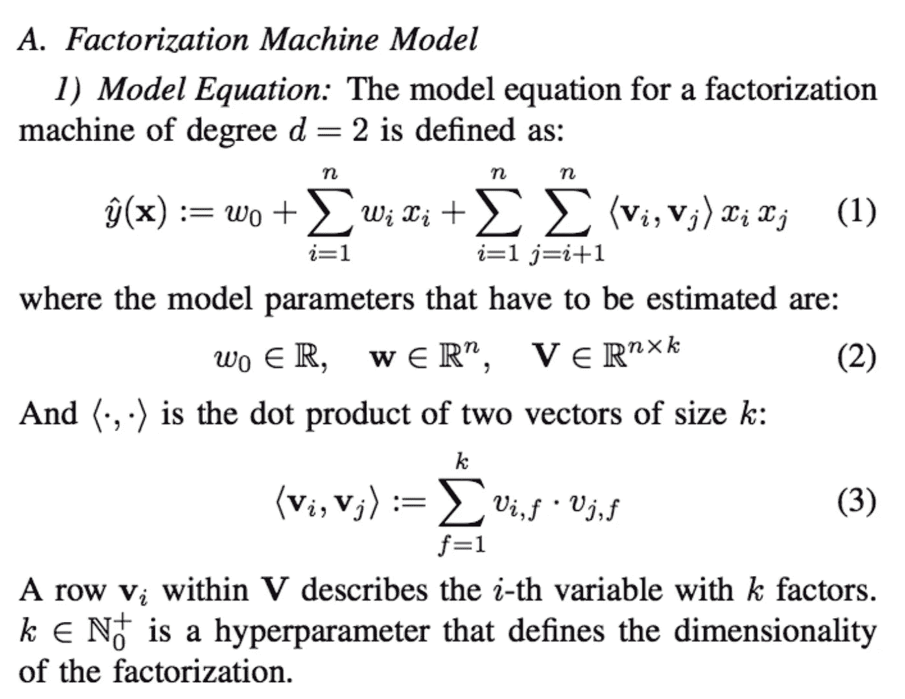

# 基于奇异值分解的推荐系统变体的实现

> 原文：<https://towardsdatascience.com/recsys-implementation-on-variants-of-svd-based-recommender-system-a3dc1d059c83?source=collection_archive---------35----------------------->


由[罗马法师](https://unsplash.com/@roman_lazygeek?utm_source=medium&utm_medium=referral)在 [Unsplash](https://unsplash.com?utm_source=medium&utm_medium=referral) 上拍摄的照片

## 模型包括 lightFM、RDF SVD 和神经协同过滤

一般来说，推荐算法的发展分为三个领域:基于内容的模型、协同过滤模型和基于深度神经网络的模型。在本文中，我们将重点讨论 CF，尤其是基于 SVD 的算法。我们不仅要练习建立基于奇异值分解的模型，还要练习它的变体，比如一个正则化模型和另一个采用神经网络的模型。

另外，基于 SVD 的分类模型只考虑了用户/iterm 交互。它既不考虑用户与项目交互时的上下文信息(例如:用户在地铁列车上浏览手机上的产品列表)，也不利用隐藏在连续动作中的含义。然而，包含这些信息会使我们的模型更加复杂，因此我们不会在本文中讨论这些问题。如果你对应用这些技术感兴趣，欢迎查看 [YouTube(2016)](https://static.googleusercontent.com/media/research.google.com/en//pubs/archive/45530.pdf) 和[华为(2017)](https://arxiv.org/pdf/1703.04247.pdf) 发表的论文。这里也有相关的 git repos 供你参考——实现 [YouTube](https://github.com/sladesha/deep_learning/tree/master/YoutubeNetwork) 和[华为](https://github.com/NELSONZHAO/zhihu/tree/master/ctr_models)。

# 熟悉数据集

我们这里使用的数据集来自作者 moorissa 的 [github repo](https://github.com/moorissa/medium/tree/master/items-recommender) 。它由客户的杂货购买记录组成。首先，让我们看看数据是如何构造的。


采购记录的数据布局

显然，这个数据集还不能用于模型训练。`products`列堆满了物品 id(与`|`连接在一起)。我们需要对其进行预处理，并将其转换为模型期望接受的内容。

下面，我们将准备两种类型的数据格式，一种是用户-iterm 交互矩阵，另一种是长格式数据帧(见下面的演示)。

## 预期格式 01:用户-项目互动矩阵


用户-项目矩阵格式

在用户-项目交互矩阵中，每行代表一个用户，每列代表一个产品项目。对应索引(I，j)处的条目是重复购买的次数(或者更广义地解释为交互强度)。这种数据格式通常适用于传统的 SVD 建模。

## 预期格式 02:长格式数据帧


长格式数据帧

在长格式数据帧中，每一行代表一对(用户、物品)的重复购买次数(或交互强度)。参见上面的演示，我们有第一列为 **customerId** ，第二列为 **productId** ，因此是(用户，项目)对。最后一列 **purchase_count** 填入相应的购买次数。长格式数据帧是非常普遍和广泛使用的。它更适合基于神经网络(NN)的建模。

我们已经为数据预处理和转换设定了目标，现在让我们看看如何实现它。

# 逐步—数据预处理

## 步骤 01:转换数据类型和格式转换

下面的代码是从作者[moorissa](https://github.com/moorissa/medium/blob/master/items-recommender/notebooks/recommendation-MT.ipynb)【1】那里借来的，他是这个数据集的同一个回购作者。主要的想法是拆分条目的字符串(最初用`|`连接)，并将其保存为 pd.Series。然后我们使用 pd.melt()将数据从宽格式转换为长格式。最后，我们应用 df.groupby()来聚合每个(用户、商品)购买记录。就是这样。现在，我们手头有了一个干净的长格式数据集。

我们可以直接在数据集上应用`trx_transform()`来完成任务。

## 步骤 02:重新缩放数据集

我们知道每个用户去商场的频率不同。最终，每个用户的购买数量是不同的。为了让模型更好地正确、一致地解释每个用户的交互，我们最好将每个用户的购买计数重新调整到范围(0，1)。

```
data["max_count"] = data.groupby("customerId")["purchase_count"].transform(
    lambda x: x.max())data["purchase_count_norm"] = data["purchase_count"] / data["max_count"]
```

## 步骤 03:创建用户-项目互动矩阵

在这一步，我们将应用`df2interact_mat()`将长格式数据集转换为交互矩阵。代码借用[本帖](https://jessesw.com/Rec-System/)【2】稍作改编。

(可选)一旦我们创建了交互矩阵，我们也可以计算矩阵的稀疏度。当稀疏度大于 99.5%(意味着不到 0.5%的总条目为非零)时，协同过滤模型表现不佳。一种补救方法是删除一些几乎全是零的用户或项目，从而使矩阵变绿。

## 步骤 04:创建训练/测试集

此外，我们需要为模型评估创建训练/测试集。值得注意的一点是，在推荐建模下，训练/测试分割是相当不同的。在传统的训练/测试分裂中，我们从训练集中分离出行的子集作为测试集。然而，在这种情况下，我们采用类似于屏蔽的方法，对用户部分屏蔽一些项目。这就像假装用户还没有看到该项目。并使用未屏蔽的项目来训练模型。一旦模型准备好，然后我们使用屏蔽的项目作为测试集标签，并查看模型的预测是否正确地将这些项目包括在用户的推荐列表中。


推荐情况下的训练/测试分割

同样，我将它包装在一个函数`train_test_split()`中，以简化这个过程。

使用该功能时，我们需要提供:

*   评级:用户-项目交互矩阵。
*   split_count:(整数)每个用户从训练集转移到测试集的项目交互次数。
*   fractions: (float)用户将他们的一些项目交互拆分到测试集中的部分。如果没有，则考虑所有用户。

该函数将返回三个对象。

1.  列车组:列车交互矩阵
2.  测试集:测试交互矩阵
3.  user_index:对测试集屏蔽了一些交互的用户索引，存储为索引以备后用

至此，我们手头已经有了训练和测试交互矩阵。然而，我们也可以在这里为神经网络建模准备长格式数据帧。

## 步骤 05:准备长格式数据帧

幸运的是，Scipy 首席运营官矩阵有一堆方便的方法。我们可以将这个矩阵转换成首席运营官数据类型。然后我们只需简单地调用 **coo.row、coo.col** 和 **coo.data** 来访问各自的索引和数据。最后，我们将这些片段放在一起，创建长格式数据集。

```
# Ref: [https://stackoverflow.com/a/36587845](https://stackoverflow.com/a/36587845)train_long = train.tocoo(copy=True)
test_long = test.tocoo(copy=True)# Access `row`, `col` and `data` properties of coo matrix.
train_long = pd.DataFrame({
    'user_id': train_long.row,
    'item_id': train_long.col,
    'rating': train_long.data
})[['user_id', 'item_id',
    'rating']].sort_values(['user_id', 'item_id']).reset_index(drop=True)# Apply the same operation on test data.
test_long = pd.DataFrame({
    'user_id': test_long.row,
    'item_id': test_long.col,
    'rating': test_long.data
})[['user_id', 'item_id',
    'rating']].sort_values(['user_id', 'item_id']).reset_index(drop=True)
```


[和](https://unsplash.com/@andyoneru?utm_source=medium&utm_medium=referral)在 [Unsplash](https://unsplash.com?utm_source=medium&utm_medium=referral) 上拍照

# 开始建模吧！

恭喜你！我们刚刚完成了所有繁琐的数据预处理步骤。现在我们可以做一些更有趣的事情了。我们将总共测试三种型号。首先是 lightFM 模型，其次是 RDF 模型，最后是 NN 模型。

## 什么是因式分解机(FM)？

在讨论第二种模型时，我们将提出奇异值分解基本上是调频的一种特殊情况。但在此之前，让我们快速回顾一下什么是 FM，并了解一下 lightFM 模块如何利用这项技术。

正如本帖【3】中[所解释的，FM 主要用于简化特征交互系数的估计( **θ** )。最初，必须逐个估计成对特征交互的系数。然而，FM 玩了一个把戏，定义了具有 K 个潜在嵌入的每个特征，并假设交互作用的系数可以通过这些潜在嵌入的内积来估计。该方法巧妙地将成对系数估计简化为潜在嵌入估计，极大地提高了效率。](https://medium.com/@jimmywu0621/factorization-machines-%E7%A8%80%E7%96%8F%E8%B3%87%E6%96%99%E7%9A%84%E6%95%91%E6%98%9F-732153700d10)

下图清楚地展示了不同之处。

## 之前:


原创模型(鸣谢:陈鸿轩)

1.  FM 将对相互作用系数的估计( **θ** )简化为对潜在嵌入的估计( **V** )。
2.  成对潜在嵌入的内积代替了成对交互系数估计(见下文)。

## 之后:



从这篇[帖子](https://medium.com/@jimmywu0621/factorization-machines-%E7%A8%80%E7%96%8F%E8%B3%87%E6%96%99%E7%9A%84%E6%95%91%E6%98%9F-732153700d10)解释因式分解模型

## lightFM 丰富了什么？

lightFM 的作者在 FM 方法的基础上做了一点小小的修改，使得 lightFM 模型可以在新用户的推荐下使用。

正如在[论文](https://arxiv.org/pdf/1507.08439.pdf)【4】中所述，lightFM 模块非常灵活。如果只提供用户-项目交互矩阵，那么模型只是一个矩阵分解模型。但是，我们也可以从用户和项目提供额外的功能。然后，该模型将合并这些信息，并转而使用因式分解机。下面的过程是 first lightFM 将这些特征以及用户/项目指示符(索引)转换为 K 维嵌入。每个用户或物品的表征是所有潜在嵌入特征的总和。(见下图)这种将用户或项目表示为特征嵌入总和的方式允许模型对新用户进行预测。这解决了协同过滤模型中最棘手的问题之一——冷启动问题。

> 旁注:冷启动意味着新用户或项目没有过去的用户-项目交互记录，因此不可能向新用户推荐或向现有用户推荐新项目。


lightFM 将用户/项目表示为其内容特征的线性组合。(来自[论文](https://arxiv.org/pdf/1507.08439.pdf))

一旦我们熟悉了 lightFM 背后的概念，让我们试着实现它。

# 第一个模型:通过 lightFM 模块构建推荐器

## A.构建和训练模型

使用 lightFM 构建推荐器非常简单。只需实现下面的代码，并在模型初始化中指定自定义参数。

```
# Initialize model with self-defined configuration.model = LightFM(no_components=20, 
                learning_rate=0.005, 
                loss='bpr', 
                random_state=12)# Start training.model.fit(train, epochs=50, verbose=True) #train: interaction matrix
```

## B.模型预测和评估

在完成模型训练后，我们可以使用两个指标来评估它。一个是 RMSE，另一个是 Top@K precision。

对于像我们这样的机器学习实践者来说，RMSE 是一个非常常见的指标。它可以衡量实际评分(或在这种情况下的购买强度)和预测评分之间的差异。同时，Top@K 用于衡量用户实际购买推荐的 top k 商品的比例。

现在，让我们使用模型进行预测。

```
# Ref: [https://
github.com/lyst/lightfm/blob/9ffeacbdc4688e9b58c6e5edfdeb52b037608a6b/lightfm/lightfm.py#L784](https://github.com/lyst/lightfm/blob/9ffeacbdc4688e9b58c6e5edfdeb52b037608a6b/lightfm/lightfm.py#L784)# predict() takes only numpy.array
predictions = model.predict(val_user_ids, 
                            val_item_ids)
```

这里， **val_user_ids** 和 **val_item_ids** 来自长格式测试数据帧。

## -计算 RMSE

我们定义了一个名为`compute_rmse`的函数来帮助完成这项任务。

```
def compute_rmse(X_test, X_pred):
    # Ref: [https://github.com/ncu-dart/rdf/blob/master/rdf/utils.py](https://github.com/ncu-dart/rdf/blob/master/rdf/utils.py)

    sse = 0.
    for i in range(len(X_test)):
        sse += (X_test[i] - X_pred[i]) ** 2

    return (sse / len(X_test)) ** .5
```

这个函数有两个参数。

*   X_test: (arr)正常化的真实购买值
*   X_pred: (arr)标准化的预测采购值

## -计算 Top@K

在计算 Top@K 之前，我们需要首先将模型的预测转换为交互矩阵。

```
predict_mat = sparse.csr_matrix(
    (predictions, (val_user_ids, val_item_ids)), 
    shape=(n_users, n_items)
)
```

然后，我们使用之前保存的 **user_index** 提取这些测试用户的购买记录。

```
test_sub = test[user_index] # true user purchase
predict_mat_sub = predict_mat[user_index] # predicted user purchase
```

最后，我们准备计算 Top@K。假设我们只想计算前 4 个预测项的准确性。我们只是运行下面的代码。

```
top_k = 4  # hyper-parameterpredict_top_k = []
for i in range(len(user_index)):
    # csr.indices and csr.data only return non-zero entries

    predict_r = predict_mat_sub[i].indices[
        predict_mat_sub[i].data.argsort()[::-1]][:top_k]

    true_r = test_sub[i].indices[
        test_sub[i].data.argsort()[::-1][:top_k]]

    pre = len(set(predict_r) & set(true_r))/ float(top_k)
    predict_top_k.append(pre)np.mean(predict_top_k)
```

这样，我们可以获得 lightFM 模型的 RMSE 和 Top@K 性能，如下所示:

*   RMSE: 0.721
*   Top@K: 1

# 第二个模型:使用 RDF 方法构建推荐器

让我们在另一个叫做 RDF-SVD 的模型上进行实验——正则化微分函数。[这个方法](https://in.ncu.edu.tw/~hhchen/academic_works/chen19_diff_reg_weight.pdf)【5】是由台湾 NCU 的陈鸿轩教授和他的研究助理陈普提出的。

在讲 RDF 之前，我们先来回顾一下 SVD。在 SVD 的损失函数中，我们可以在每个系数估计上包括正则化项( **λ** )。它用于防止模型中的过度拟合。


具有偏差和正则项的奇异值分解损失函数(来自[论文](https://in.ncu.edu.tw/~hhchen/academic_works/chen19_diff_reg_weight.pdf)

特别是，\hat{r}(预测评级)等于…


奇异值分解预测额定值方程(来自[论文](https://in.ncu.edu.tw/~hhchen/academic_works/chen19_diff_reg_weight.pdf)

将上面的等式与第一个模型中的 FM 进行比较，可以清楚地看出 SVD 只是 FM 模型的一个特例。

陈教授的方法(RDF)也是 lightFM 的设计目标，旨在解决冷启动问题。lightFM 试图通过引入特征潜在嵌入来解决这个问题，而 RDF 则侧重于奇异值分解损失函数中的正则项。

总的想法是，对于已经被更多用户评级(或购买)的项目，我们可以对模型的预测有信心。这同样适用于那些比其他人评价更多项目的用户。因为我们从这些受欢迎的项目和活跃用户那里收集了更多的数据，所以建立在此基础上的模型不太可能过度拟合和不准确。尽管如此，对于评分较低的项目和活跃用户，我们没有太多的记录。因此，我们对这些项目或用户的系数估计使用了更大的正则项。这导致我们的损失函数如下:


带有正则化微分函数的损失函数(来自[论文](https://in.ncu.edu.tw/~hhchen/academic_works/chen19_diff_reg_weight.pdf)

等式中的“*****”代表项目被评分的次数或用户评分的次数。 **f()** 是一个单调递增的函数。基于本文的实验，采用这种改进的 RDF 的模型在精度上有了很大的提高。在这里，让我们尝试使用这种方法建立一个模型。

## A.首先，导入 rdf

陈教授和将这种方法封装在一个叫做 rdf 的模块中。这是[源代码链接](https://github.com/ncu-dart/rdf)。我们只需要在使用之前克隆 repo 并安装模块。

## B.选择长格式数据帧作为训练/测试数据集


长格式数据帧

我们首先选择长格式数据帧作为输入数据集。然后，我们需要再次将它转换成 rdf 模块要求的格式。对于每条记录，它必须以下列格式存储。

> [(客户标识，产品标识，评级)，(客户标识，产品标识，评级)，…]

下面的代码为我们完成了这项工作。

```
ll = train_long.apply(lambda x: (x[0], x[1], x[2]), axis = 1)
X = list(ll)# Apply the same operation on test data.
ll = test_long.apply(lambda x: (x[0], x[1], x[2]), axis = 1)
X_test = list(ll)
```

## C.启动和训练模型

**rdf** 模块能够对各种算法应用微分正则化，包括 SVD、SVD++和 NMF。在本文中，为了简单起见，我们选择了基本的 SVD 模型，并应用了 repo 中的默认超参数。

```
model = rdf.rdfsvd.RDFSVD(n_users=n_users,
                          n_items=n_items,
                          lr=.005,
                          lmbda_p=500,
                          lmbda_q=500,
                          lmbda_u=.01,
                          lmbda_i=.01,
                          method="linear")model.train(X)
```

## D.模型预测和评估

一旦模型训练完成，我们就可以用它在 RMSE 和 Top@K 上进行预测并评估其性能

```
# make predictions
X_pred = model.predict(X_test)
```


测试-(用户标识，项目标识，评级)元组上 RDF-SVD 模型预测的演示

将上述代码应用于 rmse 和 top@k 计算，我们得到如下指标:

*   RMSE: 0.245
*   Top@K: 1

# 第三个模型:使用神经协同过滤构建推荐器

最后，让我们尝试将深度学习框架整合到我们的推荐器中。这里让我们介绍一个非常通用的框架，叫做神经协同过滤(NCF)。这是[报纸的链接](https://arxiv.org/abs/1708.05031)【6】。另外，我强烈推荐 Steeve Huang 写的这篇[中帖](/paper-review-neural-collaborative-filtering-explanation-implementation-ea3e031b7f96)【7】。如果你想节省时间，跳过阅读原文，这是让你快速掌握 NCF 概貌的必读文章。


神经协同过滤模型(来自[论文](https://arxiv.org/abs/1708.05031)

## A.模型算法

在论文中，作者提出了两个框架，一个是广义矩阵分解(GMF)，如上图(左)所示，另一个是多层感知器(MLP)，如上图(右)所示。在模型的最后一层，来自两个框架的输出将连接在一起，作为最终输出。

如果我们更仔细地观察，我们会发现曼氏金融只是 GMF 的另一个特例。


与 MF 的关系(信用: [Steeve Huang](/paper-review-neural-collaborative-filtering-explanation-implementation-ea3e031b7f96) )

`Eq 1`是 GMF 下的用户-物品交互。 **L** 为激活函数， **J_kx1** 为输出层的边权重。在 GMF 框架下， **L** 可以是线性的也可以是非线性的， **J_kx1** 代表潜在向量中各维度的权重。

假设我们说 **L** 是一个线性激活函数，而 **J_kx1** 是一个所有值都为 1 的向量(意味着每个维度具有相同的权重)，那么 GMF 将还原为原始 MF，即 **pᵤ和**qᵢ的内积，如`Eq 3`所示。

我在此引用教皇的话:

> 在 NCF 框架下，物流可以很容易地推广和扩展…它将物流推广到一个非线性的设置，这可能比线性物流模型更有表现力。

然而，NCF 并没有就此止步。它还包括多层感知器(MLP)作为模型中的另一个分支，以便捕捉用户和项目之间的高阶非线性交互。我在这里引用:

> 我们可以赋予模型很大程度的灵活性和非线性，以了解 pᵤ和 qᵢ之间的相互作用，而不是像 GMF 那样只使用它们的固定元素乘积。

在 MLP 框架中，作者也做了几次尝试来测试多少层对模型来说是最合适的。一般来说，模型越深，精度越高。在基本结构中，它有 **3 层**，每层的**节点比上一层减少一半。**

还有另外三个有趣的点值得一提。

1.  进行预培训:我们可以将 GLM 和 MLP 分开，对每个模型进行预培训。然后我们使用这些模型的权重作为 NCF 模型的初始化权重。实验表明，该方法比直接随机初始化 NCF 模型的权重具有更好的性能。
2.  使用负抽样:对于那些用户没有交互的项目，我们可以进行负(不交互)到正(有交互)抽样。在训练集中添加一部分负样本可以提高模型的性能。但是比例是多少呢？在实验中，1:1 的正负比例并不能达到最佳效果。在训练集中，负样本的比率最好大于 1。作者最后选择了 4:1(阴性:阳性)。
3.  输出层的加权初始化:这是模型调整的可选步骤。特别是在培训前的情况下。NCF 的输出层是 GMF 和 MLP 输出的拼接。我们可以做得更巧妙的是，给每个输出分配权重(α)和(1-α),以便对一个输出比另一个输出给予更多的重视。权重(α)是自定义的指定超参数。

在下面的实现中，为了简单起见，不包括上面提到的任何实践。我们只是构建 GMP 和 MLP 模型，并将两者结合起来。无负采样，两个输出无加权初始化(α)。

## B.建立模型

这里我使用了 tensorflow 2.0 下的 tf.keras API 来构建模型。我主要采用了 Steeve Huang 的[回购](https://github.com/khuangaf/tibame_recommender_system/blob/master/NCF.ipynb)【8】的模型，只是对超参数做了一些修改，以便与原始论文中的参数保持一致。

建立 NCF 模型

## C.训练模型

我们再次需要使用长格式数据集来训练我们的 NCF 模型。

```
from tensorflow.keras.callbacks import EarlyStopping# early stopping wait for 3 epoch
callbacks = [EarlyStopping(patience=3, restore_best_weights=True)]# train and test set
train_user_ids = train_long["user_id"]
train_movie_ids = train_long["item_id"]
train_ratings = train_long["rating"]val_user_ids = test_long["user_id"]
val_movie_ids = test_long["item_id"]
val_ratings = test_long["rating"]# train for 50 epochs
model.fit([train_user_ids, train_movie_ids],
          train_ratings,
          validation_data=(
              [val_user_ids, val_movie_ids], val_ratings),
          epochs=50,
          batch_size=128,
          callbacks=callbacks)
```

## D.模型预测和评估

最后，下面是 NCF 在 RMSE 和 Top@K 上的表现指标

*   RMSE: 0.231
*   Top@K: 1

# 最终反射

我们在这里看到三个模型有趣的结果。所有模型在 Top@K 中得到了 1(在 Top 4 的情况下)，意味着模型推荐的前 4 件商品实际上都是测试用户在现实中购买的。也许这不是偶然发生的。在数据预处理中，我尽量去除数据集中一些交互记录不多的项目或用户。它导致更致密的相互作用矩阵。手头剩余的项目和用户，大多数都有相当多的交互记录。因此，任何协作过滤模型表现良好都不足为奇。

尽管如此，让我们比较另一个指标，RMSE。我们看到，lightFM 的误差最大(0.72)，NCF 的误差最小(0.23)，尽管与 RDF-SVD 的误差(0.24)相差不大。

所以总的来说，我们可以说 NCF 仍然有最好的表现。

如果你对整个实现感兴趣，欢迎查看[我的回购](https://github.com/TomLin/Playground)。希望你喜欢这篇文章，并欢迎提供任何进一步改进的反馈。干杯！

# 参考

[1] moorissa，[如何构建购买数据的推荐系统(循序渐进)](https://github.com/moorissa/medium/blob/master/items-recommender/notebooks/recommendation-MT.ipynb)(2018)*Github*

[2]杰西·斯坦威格·伍兹，[含蓄反馈推荐系统的温和介绍](https://jessesw.com/Rec-System/) (2016)，*个人博客*

[3] Jimmy Wu, [Factorization Machines — 稀疏資料的救星](https://medium.com/@jimmywu0621/factorization-machines-%E7%A8%80%E7%96%8F%E8%B3%87%E6%96%99%E7%9A%84%E6%95%91%E6%98%9F-732153700d10) (2019), *Medium*

[4]马切伊·库拉，[用户和项目冷启动的元数据嵌入
建议](https://arxiv.org/pdf/1507.08439.pdf) (2015)，*Lyst.com*

[5]陈鸿轩和陈普，[区分正则化权重——一种减轻推荐系统冷启动的简单机制](https://github.com/ncu-dart/rdf)(2019)*美国计算机学会数据知识发现汇刊*

[6] X 何等，[神经协同过滤](https://arxiv.org/pdf/1708.05031.pdf) (2017)，*国大*

[7] Steeve Huang，[论文综述:神经协同过滤解说&实现](/paper-review-neural-collaborative-filtering-explanation-implementation-ea3e031b7f96) (2018)，*走向数据科学*

[8] Steeve Huang，[2019](https://github.com/khuangaf/tibame_recommender_system/blob/master/NCF.ipynb)， *Github*