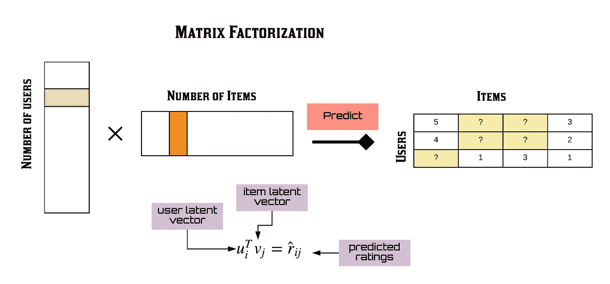
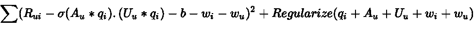

# 推荐系统系列第 4 部分:用于协同过滤的矩阵分解的 7 种变体

> 原文：<https://towardsdatascience.com/recsys-series-part-4-the-7-variants-of-matrix-factorization-for-collaborative-filtering-368754e4fab5?source=collection_archive---------2----------------------->

## RecSys 系列

## 矩阵分解的数学深度探究

***更新:*** *本文是我探索学术界和工业界推荐系统系列文章的一部分。查看完整系列:* [*第一部分*](/recommendation-system-series-part-1-an-executive-guide-to-building-recommendation-system-608f83e2630a) *，* [*第二部分*](/recommendation-system-series-part-2-the-10-categories-of-deep-recommendation-systems-that-189d60287b58) *，* [*第三部分*](/recommendation-system-series-part-3-the-6-research-directions-of-deep-recommendation-systems-that-3a328d264fb7) *，* [*第四部分*](/recsys-series-part-4-the-7-variants-of-matrix-factorization-for-collaborative-filtering-368754e4fab5) *，* [*第五部分*](/recsys-series-part-5-neural-matrix-factorization-for-collaborative-filtering-a0aebfe15883) *和*

协同过滤是任何现代推荐系统的核心，它已经在亚马逊、网飞和 Spotify 等公司取得了相当大的成功。它的工作原理是收集人们对某个特定领域的项目的判断(称为评级),并将具有相同信息需求或相同品味的人匹配在一起。协同过滤系统的用户共享他们对他们消费的每个项目的分析判断和意见，以便系统的其他用户可以更好地决定消费哪些项目。反过来，协同过滤系统为新项目提供有用的个性化推荐。

协同过滤的两个主要领域是(1)邻域方法和(2)潜在因素模型。

*   **邻域法**专注于计算项目之间或用户之间的关系。这种方法基于同一用户对相邻项目的评级来评估用户对项目的偏好。一个项目的邻居是由同一用户评价时倾向于获得相似评价的其他产品。
*   **潜在因素法**通过从评级模式中推断出的许多因素来描述项目和用户的特征，从而解释评级。例如，在音乐推荐中，发现的因素可能测量精确的维度，如嘻哈与爵士、高音量或歌曲长度，以及不太明确的维度，如歌词背后的含义，或完全无法解释的维度。对于用户来说，每个因素衡量用户有多喜欢在相应歌曲因素上得分高的歌曲。

一些最成功的潜在因素模型是基于**矩阵分解。**在其自然形式中，矩阵因子分解使用从项目评级模式推断的因子向量来表征项目和用户。项目和用户因素之间的高度对应导致推荐。

*Sharmistha Chatterjee —使用 Python 的矩阵分解技术概述(*[*https://towardsdatascience . com/Overview-of-Matrix-Factorization-Techniques-using-Python-8e 3d 118 a9 b 39*](/overview-of-matrix-factorisation-techniques-using-python-8e3d118a9b39)*)*

在这篇文章和接下来的文章中，我将介绍推荐系统的创建和训练，因为我目前正在做这个主题的硕士论文。

*   [第 1 部分](/recommendation-system-series-part-1-an-executive-guide-to-building-recommendation-system-608f83e2630a)提供了推荐系统的高级概述，它们是如何构建的，以及它们如何用于改善各行业的业务。
*   [第 2 部分](/recommendation-system-series-part-2-the-10-categories-of-deep-recommendation-systems-that-189d60287b58)对正在进行的关于这些模型的优势和应用场景的研究计划进行了仔细的回顾。
*   [第 3 部分](/recommendation-system-series-part-3-the-6-research-directions-of-deep-recommendation-systems-that-3a328d264fb7)提供了几个可能与推荐系统学者社区相关的研究方向。

在第 4 部分中，我深入探讨了矩阵分解的数学细节，这可以说是目前推荐系统研究中最常见的基线模型。更具体地说，我将向您展示可以构建的矩阵分解的七种变体——从边特征的使用到贝叶斯方法的应用。

## 1 —标准矩阵分解

一个简单的矩阵分解模型将用户和项目都映射到一个维度为 D 的联合潜在因素空间，这样用户-项目交互就被建模为该空间中的内积。

*   因此，每个项目 I 与向量 q_i 相关联，并且每个用户 u 与向量 p_u 相关联
*   对于一个给定的项目 I，q_i 的元素测量该项目拥有这些因素的程度，积极的或消极的。
*   对于给定的用户 u，p_u 的元素测量用户对项目的兴趣程度，该项目在相应的正面或负面因素上是高的。
*   得到的点积(q_i * p_u)抓住了用户 u 和物品 I 之间的交互，是用户对物品特征的整体兴趣。

因此，我们有如下等式 1:

最大的挑战是计算每个项目和用户到因子向量 q_i 和 p_u 的映射。矩阵分解通过最小化已知评级集的正则化平方误差来实现这一点，如下面的等式 2 所示:

通过拟合先前观察到的评级来学习该模型。然而，目标是以预测未来/未知评级的方式来概括那些先前的评级。因此，我们希望通过向每个元素添加 L2 正则化惩罚来避免过度拟合观察到的数据，并同时利用随机梯度下降来优化学习到的参数。

Shay Palachy 的这篇文章很好地解释了直觉，以下是快速注释:

*   当我们使用 SGD 来将模型的参数拟合到手头的学习问题时，我们在算法的每次迭代中在解空间中朝着损失函数相对于网络参数的梯度前进一步。由于我们推荐的用户-项目交互矩阵非常稀疏，这种学习方法可能会过度适应训练数据。
*   L2(也称为[吉洪诺夫正则化](https://en.wikipedia.org/wiki/Tikhonov_regularization)或岭回归)是一种正则化成本函数的特定方法，增加了一个表示复杂性的项。该项是用户和项目潜在因素的平方欧几里得范数。添加一个附加参数λ，以允许控制正则化的强度。
*   加入 L2 项通常会使整个模型的参数变得更小。

让我们看看这在代码中是什么样子的:

这个模型的完整实验可以在这里访问:[https://github . com/khanhnamle 1994/transfer-rec/tree/master/Matrix-Factorization-Experiments/Vanilla-MF](https://github.com/khanhnamle1994/transfer-rec/tree/master/Matrix-Factorization-Experiments/Vanilla-MF)

## 2 —有偏差的矩阵分解

协作过滤的矩阵分解方法的一个好处是它在处理各种数据方面和其他应用特定的需求方面的灵活性。回想一下，等式 1 试图捕捉产生不同评级值的用户和项目之间的交互。然而，许多观察到的评分值的变化是由于与用户或项目相关的影响，称为**偏差**，与任何交互无关。这背后的直觉是，一些用户给出比其他人高的评级，一些项目系统地获得比其他人高的评级。

因此，我们可以将等式 1 扩展到等式 3，如下所示:

*   总体平均评级中包含的偏差用 b 表示。
*   参数 w_i 和 w_u 分别表示项目 I 和用户 u 与平均值的观测偏差。
*   请注意，观察到的评级分为 4 个部分:(1)用户-项目互动，(2)全球平均，(3)项目偏见，和(4)用户偏见。

通过最小化新的平方误差函数来学习该模型，如下面的等式 4 所示:

让我们看看这在代码中是什么样子的:

这个模型的完整实验可以在这里访问:[https://github . com/khanhnamle 1994/transfer-rec/tree/master/Matrix-Factorization-Experiments/MF-bias](https://github.com/khanhnamle1994/transfer-rec/tree/master/Matrix-Factorization-Experiments/MF-Biases)

## 3 —带辅助特征的矩阵分解

协同过滤中的一个常见挑战是冷启动问题，因为它无法处理新项目和新用户。或者许多用户提供非常少的评级，使得用户-项目交互矩阵非常稀疏。缓解这个问题的一个方法是加入关于用户的额外信息来源，也就是**的侧面特征**。这些可以是用户属性(人口统计)和隐式反馈。

回到我的例子，假设我知道用户的职业。对于这个侧面特征，我有两种选择:将其作为一种偏见添加(艺术家比其他职业更喜欢电影)和作为一种向量添加(房地产经纪人喜欢房地产节目)。矩阵分解模型应该将所有信号源与增强的用户表示相结合，如等式 5 所示:

*   对职业的偏好用 d_o 表示，这意味着职业像速率一样变化。
*   职业的向量由 t_o 表示，意味着职业根据项目(q_i * t_o)而变化。
*   请注意，必要时项目可以得到类似的处理。

损失函数现在是什么样子的？下面的等式 6 表明:

让我们看看这在代码中是什么样子的:

这个模型的完整实验可以在这里访问:[https://github . com/khanhnamle 1994/transfer-rec/tree/master/Matrix-Factorization-Experiments/MF-Side-Features](https://github.com/khanhnamle1994/transfer-rec/tree/master/Matrix-Factorization-Experiments/MF-Side-Features)

## 4-具有时间特征的矩阵分解

到目前为止，我们的矩阵分解模型是静态的。在现实中，项目受欢迎程度和用户偏好是不断变化的。因此，我们应该考虑反映用户-项目交互的动态性质的时间效应。为了实现这一点，我们可以添加一个影响用户偏好的时间项，从而影响用户和项目之间的交互。

为了更复杂一点，让我们用时间 t 的评级的动态预测规则来尝试下面的新等式 7:

*   p_u (t)将用户因素作为时间的函数。另一方面，q_i 保持不变，因为项目是静态的。
*   我们根据用户的不同有职业的变化(p_u * t_o)。

等式 8 显示了包含时间特征的新损失函数:

让我们看看这在代码中是什么样子的:

这个模型的完整实验可以在这里访问:[https://github . com/khanhnamle 1994/transfer-rec/tree/master/Matrix-Factorization-Experiments/MF-Temporal-Features](https://github.com/khanhnamle1994/transfer-rec/tree/master/Matrix-Factorization-Experiments/MF-Temporal-Features)

## 5 —因式分解机器

推荐系统的一个更强大的技术叫做**因式分解机器**，它具有强大的表达能力来概括矩阵因式分解方法。在许多应用程序中，我们有大量的项目元数据可以用来进行更好的预测。这是对特征丰富的数据集使用因式分解机的好处之一，对于这种情况，有一种自然的方式可以将额外的特征包括在模型中，并且可以使用维度参数 d 对高阶交互进行建模。对于稀疏数据集，二阶因式分解机模型就足够了，因为没有足够的信息来估计更复杂的交互。

*Berwyn Zhang —因式分解机(*[*)http://Berwyn Zhang . com/2017/01/22/machine _ learning/Factorization _ Machines/*](http://berwynzhang.com/2017/01/22/machine_learning/Factorization_Machines/)*)*

等式 9 显示了二阶 FM 模型的情况:

其中 v 代表与每个变量(用户和项目)相关的 k 维潜在向量，括号运算符代表内积。根据 Steffen Rendle 关于因式分解机的[原始论文](https://www.csie.ntu.edu.tw/~b97053/paper/Rendle2010FM.pdf)，如果我们假设每个 x(j)向量仅在位置 u 和 I 处非零，我们得到带有偏差的经典矩阵因式分解模型(等式 3):

这两个方程之间的主要区别是因式分解机器在潜在向量方面引入了更高阶的相互作用，潜在向量也受到分类或标签数据的影响。这意味着模型超越了共现，以发现每个特征的潜在表示之间更强的关系。

因式分解机器模型的损失函数就是均方误差和特征集的和，如公式 10 所示:

让我们看看这在代码中是什么样子的:

这个模型的完整实验可以在这里访问:[https://github . com/khanhnamle 1994/transfer-rec/tree/master/Matrix-Factorization-Experiments/Factorization-Machines](https://github.com/khanhnamle1994/transfer-rec/tree/master/Matrix-Factorization-Experiments/Factorization-Machines)

## 6-混合口味的矩阵分解

到目前为止，提出的技术隐含地将用户的口味视为单峰的——也就是在单个潜在向量中。这可能会导致在代表用户时缺乏细微差别，在这种情况下，主流口味可能会压倒更多的小众口味。此外，这可能降低项目表示的质量，减少属于多个品味/风格的项目组之间的嵌入空间的分离。

[马切伊·库拉](https://arxiv.org/pdf/1711.08379.pdf)提出并评估了将用户表示为几种不同口味的混合物，由不同的口味向量来表示。每个味道向量都与一个注意力向量相关联，描述了它在评估任何给定项目时的能力。然后，用户的偏好被建模为所有用户口味的加权平均值，权重由每个口味与评估给定项目的相关程度提供。

等式 11 给出了这种混合味道模型的数学公式:

*   U_u 是代表用户 u 的 m 个口味的 m×k 矩阵。
*   A_u 是一个 m×k 矩阵，表示来自 U_u 的每一种口味的相似性，用于表示特定的项目。
*   \sigma 是软最大激活函数。
*   \sigma(A_u * q_i)给出混合概率。
*   U_u * q_i 给出了每种混合物成分的推荐分数。
*   请注意，我们假设所有混合成分的单位方差矩阵。

因此，下面的等式 12 表示损失函数:

让我们看看这在代码中是什么样子的:

这个模型的完整实验可以在这里访问:[https://github . com/khanhnamle 1994/transfer-rec/tree/master/Matrix-Factorization-Experiments/MF-Mixture-Tastes](https://github.com/khanhnamle1994/transfer-rec/tree/master/Matrix-Factorization-Experiments/MF-Mixture-Tastes)

## 7 —变分矩阵分解

我想介绍的矩阵分解的最后一个变体叫做变分矩阵分解。到目前为止，这篇博文讨论的大部分内容是关于优化模型参数的点估计，而 variable 是关于优化后验估计，粗略地说，它表达了一系列与数据一致的模型配置。

以下是改变的实际原因:

*   变分法可以提供替代的正则化。
*   变分法可以度量你的模型不知道的东西。
*   变分法可以揭示蕴涵以及分组数据的新方法。

我们可以通过以下方式改变等式 3 中的矩阵分解:(1)用来自分布的样本替换点估计，以及(2)用正则化新的分布替换正则化该点。数学是相当复杂的，所以我不会试图在这篇博文中解释它。[关于变分贝叶斯方法的维基百科页面](https://en.wikipedia.org/wiki/Variational_Bayesian_methods)是一个有用的入门指南。最常见的变分贝叶斯使用 [Kullback-Leibler 散度](https://en.wikipedia.org/wiki/Kullback%E2%80%93Leibler_divergence)作为去相似性函数的选择，这使得损失最小化变得容易处理。

让我们看看这在代码中是怎样的:

这个模型的完整实验可以在这里访问:[https://github . com/khanhnamle 1994/transfer-rec/tree/master/Matrix-Factorization-Experiments/variation-MF](https://github.com/khanhnamle1994/transfer-rec/tree/master/Matrix-Factorization-Experiments/Variational-MF)

## 模型评估

你可以在 [this repository](https://github.com/khanhnamle1994/transfer-rec/tree/master/Matrix-Factorization-Experiments) 查看我为 MovieLens1M 数据集做的所有 7 个矩阵分解实验。所有模型都经过 50 个时期的训练，结果在 TensorBoard 中捕获。评估指标是均方误差，即预测评分和实际评分之间所有平方差的总和。

结果表位于自述文件的底部，如您所见:

*   变分矩阵分解的训练损失最小。
*   具有边特征的矩阵分解具有最低的测试损失。
*   因式分解机器的训练时间最快。

## 结论

在这篇文章中，我讨论了矩阵分解的直观意义及其在协同过滤中的应用。我还谈到了它的许多不同的扩展:(1)添加偏见，(2)添加侧面特征，(3)添加时间特征，(4)升级到因子分解机器以利用高阶交互，(5)使用带有“注意”机制的混合口味，(6)使模型变得不同。我希望您已经发现这种深入矩阵分解世界的数学方法是有帮助的。请继续关注本系列未来的博客文章，这些文章将超越矩阵分解的领域，深入探讨协作过滤的深度学习方法。

## 参考

*   [*推荐系统的矩阵分解技术*](https://dl.acm.org/doi/10.1109/MC.2009.263) *。*耶胡达·科伦，罗伯特·贝尔，克里斯·沃林斯基。2009 年 8 月
*   [*py torch*](https://cemoody.github.io/simple_mf/)*中简单灵活的深度推荐器。克里斯·穆迪。2018*

*现在继续上* [*推荐系统第五部分*](/recsys-series-part-5-neural-matrix-factorization-for-collaborative-filtering-a0aebfe15883) *！*

*如果你想关注我在推荐系统、深度学习和数据科学新闻方面的工作，你可以查看我的* [*中的*](https://medium.com/@james_aka_yale) *和*[*GitHub*](https://github.com/khanhnamle1994)*，以及在*[*【https://jameskle.com/】*](https://jameskle.com/)*的其他项目。你也可以在* [*推特*](https://twitter.com/le_james94) *，* [*直接发邮件给我*](mailto:khanhle.1013@gmail.com) *，或者* [*在 LinkedIn 上找我*](http://www.linkedin.com/in/khanhnamle94) *。* [*注册我的简讯*](http://eepurl.com/deWjzb) *就在你的收件箱里接收我关于数据科学、机器学习和人工智能的最新想法吧！*