# 推荐系统系列之五:用于协同过滤的多层感知器的 5 种变体

> 原文：<https://towardsdatascience.com/recsys-series-part-5-neural-matrix-factorization-for-collaborative-filtering-a0aebfe15883?source=collection_archive---------15----------------------->

## RecSys 系列

## 将神经架构引入建议

***更新:*** *本文是我探索学术界和工业界推荐系统系列文章的一部分。查看完整系列:* [*第一部分*](/recommendation-system-series-part-1-an-executive-guide-to-building-recommendation-system-608f83e2630a) *，* [*第二部分*](/recommendation-system-series-part-2-the-10-categories-of-deep-recommendation-systems-that-189d60287b58) *，* [*第三部分*](/recommendation-system-series-part-3-the-6-research-directions-of-deep-recommendation-systems-that-3a328d264fb7) *，* [*第四部分*](/recsys-series-part-4-the-7-variants-of-matrix-factorization-for-collaborative-filtering-368754e4fab5) *，* [*第五部分*](/recsys-series-part-5-neural-matrix-factorization-for-collaborative-filtering-a0aebfe15883) *和*

协同过滤算法是推荐系统应用中最常用的算法。由于互联网的使用和产生的大量信息，用户找到他们的偏好变成了一项非常乏味的任务。用户对项目的偏好以评分矩阵的形式表示，用于建立用户和项目之间的关系，以找到用户的相关项目。因此，目前的协同过滤算法面临着大数据集和评分矩阵稀疏的问题。

在各种协同过滤技术中，[矩阵分解](/recsys-series-part-4-the-7-variants-of-matrix-factorization-for-collaborative-filtering-368754e4fab5)是最流行的一种，它将用户和项目投影到一个共享的潜在空间，用一个潜在特征向量来表示一个用户或一个项目。之后，用户对一个项目的交互被建模为他们潜在向量的内积。

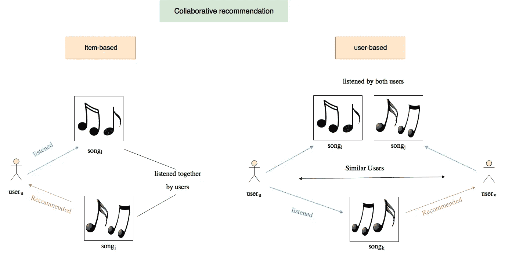

*Kiran Shivlingkar—Spotify 发现算法如何工作(*[*https://blog . prototypr . io/How-Spotify-Discovery-Algorithm-Works-fae8f 63466 ab*](https://blog.prototypr.io/how-spotify-discovery-algorithm-works-fae8f63466ab)*)*

尽管矩阵分解对于协同过滤是有效的，但是众所周知，它的性能会受到交互作用函数的简单选择的阻碍:内积。例如，对于对显式反馈的评级预测的任务，众所周知，矩阵分解模型的性能可以通过将用户和项目偏好项合并到交互函数中来提高。虽然对于内积运算符来说，这似乎只是一个微不足道的调整，但它指出了设计一个更好的、专用的交互函数来建模用户和项目之间的潜在功能交互的积极效果。简单地线性组合潜在特征的乘积的内积可能不足以捕获用户交互数据的复杂结构。

在这篇文章和接下来的文章中，我将介绍推荐系统的创建和训练，因为我目前正在做这个主题的硕士论文。

*   [第 1 部分](/recommendation-system-series-part-1-an-executive-guide-to-building-recommendation-system-608f83e2630a)提供了推荐系统的高级概述，它们是如何构建的，以及它们如何用于改善各行业的业务。
*   [第 2 部分](/recommendation-system-series-part-2-the-10-categories-of-deep-recommendation-systems-that-189d60287b58)提供了关于这些模型的优势和应用场景的正在进行的研究计划的仔细回顾。
*   [第 3 部分](/recommendation-system-series-part-3-the-6-research-directions-of-deep-recommendation-systems-that-3a328d264fb7)提供了几个可能与推荐系统学者社区相关的研究方向。
*   [第 4 部分](/recsys-series-part-4-the-7-variants-of-matrix-factorization-for-collaborative-filtering-368754e4fab5)提供了可以构建的矩阵分解的 7 种变体的本质数学细节:从使用巧妙的侧面特征到应用贝叶斯方法。

*阿汉·莫汉提— MLP 真实世界银行数据模型(*[*https://becoming human . ai/multi-layer-perceptron-MLP-Models-on-Real-World-Banking-Data-f6dd 3d 7 e 998 f*](https://becominghuman.ai/multi-layer-perceptron-mlp-models-on-real-world-banking-data-f6dd3d7e998f)*)*

在第 5 部分中，我探索了使用**多层感知器**进行协同过滤。多层感知器是一种前馈神经网络，在输入层和输出层之间有多个隐藏层。它可以解释为非线性变换的堆叠层，用于学习等级要素制图表达。这是一个简洁但实用的网络，可以将任何可测量的函数逼近到任何期望的精确度(这种现象被称为**通用逼近定理**)。因此，它是许多高级方法的基础，并被广泛应用于许多领域。

更具体地说，我将浏览 5 篇将多层感知器整合到推荐框架中的论文。

# 1 —广泛而深入的学习

记忆和归纳对于推荐系统都是至关重要的。谷歌的论文“[推荐系统的广泛和深度学习](https://arxiv.org/pdf/1606.07792.pdf)”(2016)提出了一个结合广泛线性模型和深度神经网络的优势的框架，以解决这两个问题。该框架已经在大规模商业应用商店 Google Play 的推荐系统上进行了生产和评估。

如下图所示，**宽学习**组件是一个单层感知器，可以使用叉积特征变换有效记忆稀疏特征交互。**深度学习**组件是一个多层感知器，可以通过低维嵌入归纳到以前看不到的特征交互。

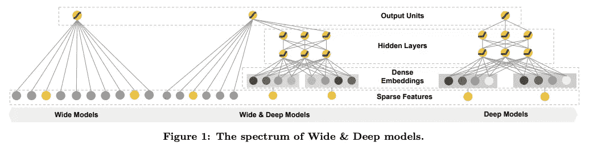

*Google Inc .—&深度学习推荐系统(*[*https://arxiv.org/pdf/1606.07792.pdf*](https://arxiv.org/pdf/1606.07792.pdf)*)*

从数学上来说，广泛学习被定义为:

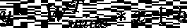

其中 y 是预测值，x 是特征向量，W 是模型参数向量，b 是偏差。特征集包括原始输入和转换输入(通过叉积转换来获取特征之间的相关性)。

在深度学习组件中，每个隐藏层执行以下计算:

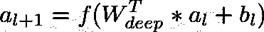

其中 l 是层数，f 是激活函数，a_l 是激活向量，b_l 是偏差向量，W_l 是第 l 层的模型权重向量。

通过融合这些模型来获得广泛和深度的学习模型:

其中 Y 是二进制类标签，W_{wide}是所有宽模型权重的向量，W_{deep}是应用于最终激活 a_{last}的权重的向量，b 是偏差项。

让我们看看这在代码中是什么样子的:

这种方法的完整 PyTorch 实现可以在这里查看:[https://github . com/khanhnamle 1994/transfer-rec/tree/master/multi layer-Perceptron-Experiments/Wide-and-Deep-py torch](https://github.com/khanhnamle1994/transfer-rec/tree/master/Multilayer-Perceptron-Experiments/Wide-and-Deep-PyTorch)。

# 2-深度因子分解机器

作为宽深度学习方法的扩展，由 Huifeng Guo 等人提出的“ [DeepFM:一个基于因子分解机的神经网络用于 CTR 预测](https://arxiv.org/pdf/1703.04247.pdf)”(2017)是一个端到端的模型，无缝集成了**因子分解机**(宽组件)和**多层感知器**(深度组件)。与宽和深模型相比，DeepFM 不需要繁琐的特征工程。

如下图所示，因式分解机器利用加法和内积运算来捕获特征之间的线性和成对交互。多层感知器利用非线性激活和深层结构来模拟高阶交互。

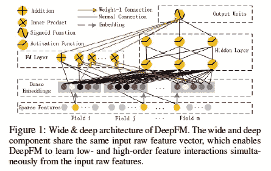

*郭慧峰等——DeepFM:一种基于因子分解机器的 CTR 预测神经网络(*[*)*](https://arxiv.org/pdf/1703.04247.pdf)*)*

从数学上来说，DeepFM 的输入是一个 m-fields 数据，由(u，I)对组成，它们是用户和项目的身份和特征，以及一个表示用户点击行为的二进制标签 y(y = 1 表示用户点击了项目，否则 y = 0)。这里的任务是建立一个预测模型，以估计用户在给定的上下文中点击特定应用程序的概率。

对于任何特定的特征 I，标量 w_i 用于衡量其一阶重要性，潜在向量 V_i 用于衡量其与其他特征的相互作用的影响。将 V_i 馈入宽分量以模拟二阶特征相互作用，馈入深分量以模拟高阶特征相互作用。包括 w_i、V_i 和网络参数在内的所有参数被联合训练用于组合预测模型:

其中 y_hat 是预测的 CTR(在 0 和 1 之间)，y_{FM}是宽因式分解机组件的输出，y_{DNN}是多层感知器组件的输出。

在宽分量中，除了特征之间的线性(一阶)交互之外，因子分解机器将成对(二阶)特征交互建模为各个特征潜在向量的内积。当数据集稀疏时，这有助于非常有效地捕捉二阶特征交互。因式分解机的输出是一个加法单元和几个内积单元的和:

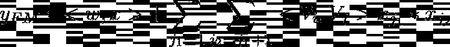

对于给定的特征 I 和 j，加法单位(第一项)反映一阶特征的重要性，内积单位(第二项)表示二阶特征相互作用的影响。

在深层组件中，多层感知器的输出如下所示:

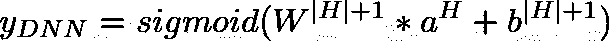

其中|H|是隐藏层的数量，a 是嵌入层的向量输出，W 是模型权重的向量，b 是偏差单元的向量。

让我们看看这在代码中是什么样子的:

这种方法的完整 PyTorch 实现可以在这里查看:[https://github . com/khanhnamle 1994/transfer-rec/tree/master/multi layer-Perceptron-Experiments/DeepFM-py torch](https://github.com/khanhnamle1994/transfer-rec/tree/master/Multilayer-Perceptron-Experiments/DeepFM-PyTorch)。

# 3-极端深度因式分解机器

作为深度因子分解机的扩展，简训廉等人的《 [xDeepFM:结合显式和隐式特征交互的推荐系统](https://arxiv.org/pdf/1803.05170.pdf)》(2018)可以对显式和隐式特征交互进行联合建模。**显式**高阶特征交互通过**压缩交互网络** k 学习，而**隐式**高阶特征违反通过多层**感知器**学习。该模型也不需要人工特征工程，并且将数据科学家从繁琐的特征搜索工作中解放出来。

压缩交互网络的设计考虑了以下因素:

1.  交互应用于向量级，而不是位级。
2.  高阶特征相互作用被明确地测量。
3.  网络的复杂性不会随着相互作用的程度呈指数增长。

压缩交互网络的结构非常类似于递归神经网络，其中下一个隐藏层的输出依赖于最后一个隐藏层和附加输入。各层嵌入向量的结构保持现状；因此，相互作用应用于向量水平。

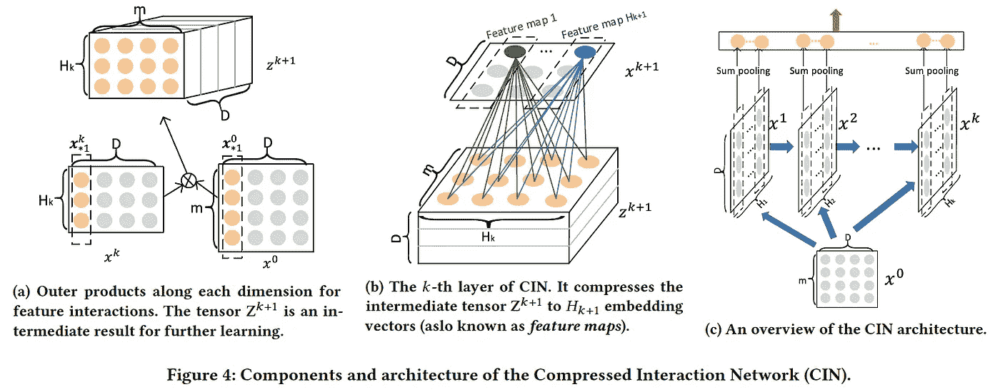

*简训廉等——xDeepFM:结合显式和隐式特征交互的推荐系统(*[*)*](https://arxiv.org/pdf/1803.05170.pdf)*)*

*   看上面的图 4a，中间张量 Z^{k+1}是沿着隐藏层 x^k 和原始特征矩阵 x⁰.的每个嵌入维度的外积计算每个隐藏层 x^k 的过程与计算机视觉中众所周知的卷积神经网络有很强的联系。在这里，Z^{k+1}可以被视为一种特殊类型的图像，而 W^{k，h}是一个过滤器。
*   如图 4b 所示，作者沿着嵌入维度将过滤器滑过 Z^{k+1}，得到了一个隐藏向量 x^{k+1}——这在计算机视觉中通常被称为特征图。因此，x^k 是 H_k 个不同特征地图的集合。
*   图 4c 提供了压缩交互网络架构的概述。设 T 表示网络的深度。X^k 的每个隐藏层都与输出单元有联系。作者在隐藏层的每个特征图上应用和池，并为第 k 个隐藏层获得长度为 H_k 的池向量 p^k。隐藏层的所有池向量在连接到输出单元之前被连接:p+ = [p，p，…，p^T]

xDeepFM 通过广度和深度学习框架将上述压缩的交互网络与简单的多层感知器相结合。一方面，该模型既包括低阶特征交互，也包括高阶特征交互；另一方面，它还包含隐式和显式的特征交互。这里显示了架构。

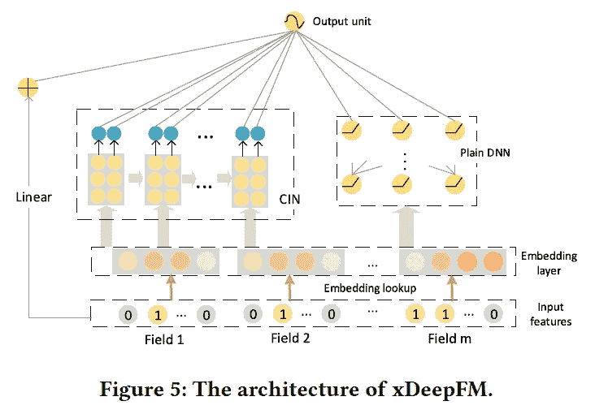

*简训廉等 xDeepFM:结合显式和隐式特征交互的推荐系统(***)**

*从数学上来说，产生的输出单位是:*

*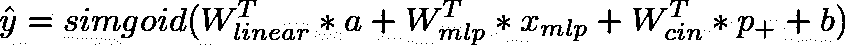*

*其中 a 是原始特征的向量，x_{mlp}是普通多层感知器的输出向量，p+是交叉交互网络的输出向量。w 和 b 是可学习的参数，分别是权重和偏差。*

*让我们看看这在代码中是什么样子的:*

*这种方法的完整 PyTorch 实现可以在这里查看:[https://github . com/khanhnamle 1994/transfer-rec/tree/master/multi layer-Perceptron-Experiments/xDeepFM-py torch](https://github.com/khanhnamle1994/transfer-rec/tree/master/Multilayer-Perceptron-Experiments/xDeepFM-PyTorch)*

# *4-神经分解机器*

*另一个无缝集成因子分解机器和多层感知机的并行工作是 Xiangnan He 和 Tat-Seng Chua 的“[用于稀疏预测分析的神经因子分解机器](https://arxiv.org/pdf/1708.05027.pdf)”(2017)。该模型将线性因式分解机器的有效性与非线性神经网络的强大表示能力结合起来，用于稀疏预测分析。*

*如下所示，其架构的关键是一种称为**双线性交互池**的操作，它允许神经网络模型在较低级别学习更多信息的功能交互。通过在双线性交互层上堆叠非线性层，作者能够深化浅层线性因式分解机，有效地建模高阶和非线性特征交互，以提高因式分解机的表达能力。与简单连接或平均低层嵌入向量的传统深度学习方法相比，双线性交互池的这种使用编码了更多信息的特征交互，极大地促进了后续“深度”层学习有意义的信息。*

*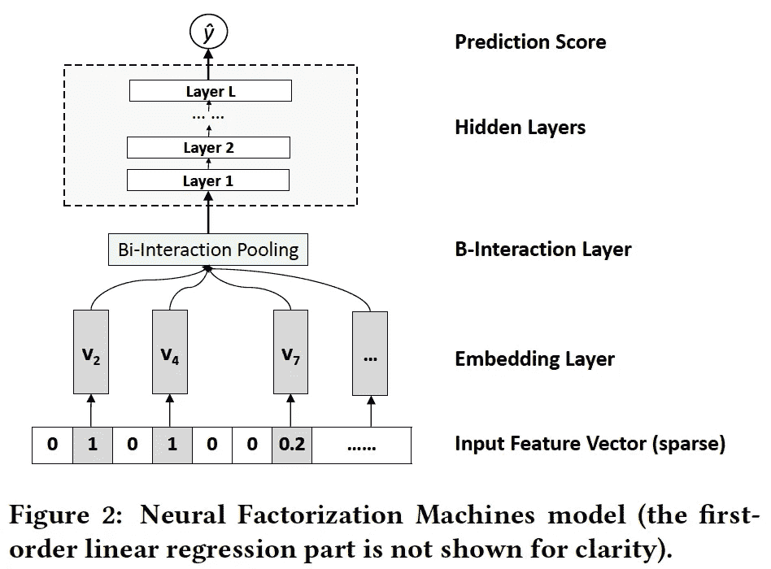*

*【https://arxiv.org/pdf/1708.05027.pdf】*

**让我们深入研究神经分解机器模型的数学。给定稀疏向量 x 作为输入，模型估计目标为:**

**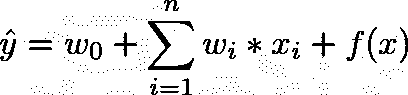**

**其中第一项模拟特征数据的全局偏差，第二项模拟特征权重的全局偏差，第三项 f(x)是模拟特征交互的多层感知器(如图 2 所示)。f(x)的设计由这些层组件组成:**

## **嵌入层**

**这是一个完全连通的图层，将每个要素投影到密集矢量表示中。设 v_i 为第 I 个特征的嵌入向量。然后在嵌入步骤之后，作者获得一组嵌入向量来表示输入特征向量 x。**

**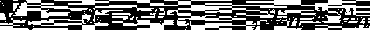**

**由于 x 的可能的稀疏表示，作者仅包括非零特征的嵌入向量，其中 x_i 不等于 0。**

## **双线性相互作用层**

**然后，嵌入集 V_x 被馈送到双线性交互层，双线性交互层是将一组嵌入向量转换成一个向量的汇集操作:**

**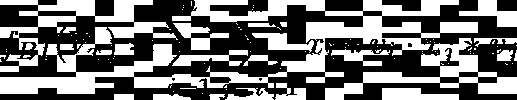**

**其中 v_i.x_j 表示两个向量 v_i 和 x_j 的按元素的乘积，该汇集的输出是 k 维向量，其编码嵌入空间中特征之间的二阶交互。**

## **隐藏层**

**双线性交互池层之上是一堆完全连接的层，这些层能够学习要素之间的高阶交互。这些隐藏层的定义是:**

**********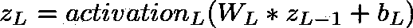**

**其中 L 是隐藏层数；W_L、b_L 和 activation_L 分别对应于第 L 层的权重矩阵、偏置向量和激活函数。激活函数的选择可以是 sigmoid、tanh 或 ReLU，以非线性地学习高阶特征交互。**

## **预测层**

**最后，最后一个隐藏层 z_L 的输出向量被转换成最终预测分数:**

**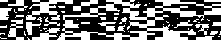**

**其中 h^T 表示预测层的神经元权重。**

**让我们看看这在代码中是什么样子的:**

**这种方法的完整 PyTorch 实现可以在这里查看:[https://github . com/khanhnamle 1994/transfer-rec/tree/master/multi layer-Perceptron-Experiments/Neural-FM-py torch](https://github.com/khanhnamle1994/transfer-rec/tree/master/Multilayer-Perceptron-Experiments/Neural-FM-PyTorch)**

# **5 —神经协同过滤**

**向南和等人的论文“[神经协同过滤](https://www.comp.nus.edu.sg/~xiangnan/papers/ncf.pdf)”(2018)将多层感知器用于从数据中学习交互函数的应用又推进了一步。这里注意，他们也是上面提到的神经因子分解机器论文的同一作者。他们形式化了一种协作过滤的建模方法，这种方法专注于**隐式反馈**，它通过观看视频、购买产品和点击商品等行为间接反映用户的偏好。与评分和评论等显性反馈相比，隐性反馈可以被自动跟踪，因此对于内容提供商来说，收集隐性反馈要自然得多。然而，利用它更具挑战性，因为没有观察到用户满意度，并且存在负面反馈的固有稀缺性。**

**用于模拟用户隐式反馈的用户-项目交互值 y_ui 可以是 1 或 0。值 1 指示在用户 u 和项目 I 之间存在交互，但是这并不意味着 u 喜欢 I。这在从隐式数据中学习时提出了挑战，因为它仅提供关于用户偏好的噪声信号。虽然观察到的条目至少反映了用户对项目的兴趣，但未观察到的条目可能只是缺失的数据，并且负面反馈自然很少。**

**作者采用多层表示来建模用户-项目交互 y_ui，如下所示，其中一层的输出作为下一层的输入。**

*   **底部的**输入层**由 2 个描述用户 u 和物品 I 的特征向量组成，可以定制以支持用户和物品的广泛建模。特别地，本文仅使用用户和物品的身份作为输入特征，通过一键编码将其转换为二值化的稀疏向量。有了这样一个输入的通用特征表示，通过使用内容特征来表示用户和项目，可以很容易地调整这个框架来解决冷启动问题。**
*   **在输入层之上是**嵌入层**——一个将稀疏表示投影到密集向量的全连接层。在潜在因素模型的上下文中，所获得的用户/项目嵌入可以被视为用户/项目的潜在向量。**
*   **用户嵌入和项目嵌入然后被馈送到多层神经架构(称为**神经协同过滤层**)以将潜在向量映射到预测分数。神经协同过滤层的每一层都可以被定制以发现用户-项目交互的特定潜在结构。最后一个隐藏层 X 的尺寸决定了模型的能力。**
*   **最终的**输出层**为预测得分 y-hat_ui，通过最小化 y-hat_ui 与其目标值 y_ui 之间的逐点损失来进行训练。**

**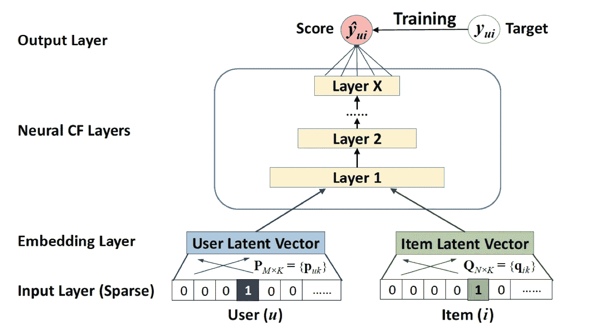**

**【https://www.comp.nus.edu.sg/~xiangnan/papers/ncf.pdf】*)***

**上述框架可以用下面的评分函数来概括:**

**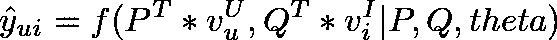**

**其中 y-hat_ui 是交互 y_ui 的预测得分，θ表示模型参数。f 是将模型参数映射到预测得分的多层感知器。更具体地，P 是用户的潜在因素矩阵，Q 是项目的潜在因素矩阵，v_u^U 是与用户特征相关联的辅助信息，而 v_i^I 是与项目特征相关联的辅助信息。**

**本文认为，传统的矩阵分解可以看作是神经协同过滤的一个特例。因此，将矩阵分解的神经解释与多层感知器相结合以形成更通用的模型是方便的，该模型利用矩阵分解的线性和多层感知器的非线性来提高推荐质量。**

**让我们看看这在代码中是什么样子的:**

**这种方法的完整 PyTorch 实现可以在这里查看:[https://github . com/khanhnamle 1994/transfer-rec/tree/master/multi layer-Perceptron-Experiments/Neural-CF-py torch-version 2](https://github.com/khanhnamle1994/transfer-rec/tree/master/Multilayer-Perceptron-Experiments/Neural-CF-PyTorch-Version2)。**

# **模型评估**

**你可以查看我在这个知识库中构建的所有五个基于多层感知器的推荐模型:[https://github . com/khanhnamle 1994/transfer-rec/tree/master/Multilayer-Perceptron-Experiments](https://github.com/khanhnamle1994/transfer-rec/tree/master/Multilayer-Perceptron-Experiments)。**

*   **数据集是 [MovieLens 1M](https://github.com/khanhnamle1994/transfer-rec/tree/master/ml-1m) ，类似于我在[上一篇文章](/recsys-series-part-4-the-7-variants-of-matrix-factorization-for-collaborative-filtering-368754e4fab5)中的矩阵分解实验。目标是预测用户对特定电影的评分——评分范围为 1 到 5。**
*   **唯一的区别是，为了使用基于因式分解机器的模型来预测点击率，我使用了**二进制评级**。小于等于 3 的评级被视为 0，大于 3 的评级被视为 1。**
*   **因此，考虑到这是一个二元分类问题(而不是像上次一样的 RMSE)，评估度量是 **AUC** 。**
*   **所有模型都经过 100 个时期的训练，结果在 [**权重和偏差**](https://app.wandb.ai/khanhnamle1994/multi_layer_perceptron_collaborative_filtering) 中捕获。对于那些不熟悉的人来说，这是一个出色的工具，它将所有模型超参数和输出指标存储在一个地方，以跟踪实验并毫不费力地再现结果。**

**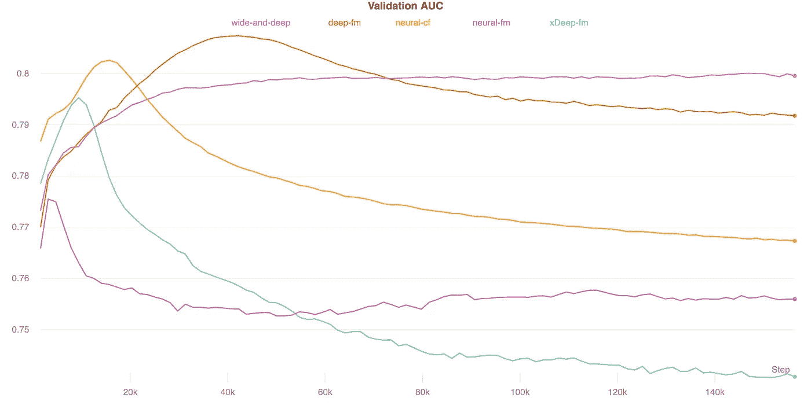**

**结果表位于自述文件的底部，正如您从重量和偏差仪表盘可视化中看到的:**

*   **广度和深度学习模型在测试和验证集上都具有最好的 AUC 结果。**
*   **另一方面，极深因式分解机分别具有最低的 AUC。**
*   **神经协同过滤运行速度最快，极深因式分解机运行速度最慢。**

**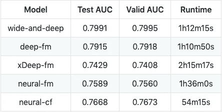**

# **结论**

**在这篇文章中，我讨论了多层感知器的直观含义及其在协同过滤中的应用。我还浏览了使用 MLP 作为推荐框架的 5 篇不同的论文:(1)广泛和深度学习，(2)深度因子分解机，(3)极端深度因子分解机，(4)神经因子分解机，以及(5)神经协同过滤。这些模型补充了主流的浅层协同过滤模型，从而为基于深度学习的推荐开辟了一条新的研究途径。**

**请继续关注本系列未来的博文，它们超越了区分模型，进入了协同过滤的生成模型领域。**

***现在开始阅读* [*推荐系统系列第六部*](/recommendation-system-series-part-6-the-6-variants-of-autoencoders-for-collaborative-filtering-bd7b9eae2ec7) *！***

# **参考**

*   ***针对推荐系统的宽深度学习。Cheng-Tze Cheng、Levent Koc、Jeremiah Harmsen、Tal Shaked、Tushar Chandra、Hrishi Aradhye、Glen Anderson、Greg Corrado、、Mustafa Ispir、Rohan Anil、Zakaria Haque、Hong、Jain、和 Hemal Shah。2016 年 6 月***
*   ***[*DeepFM:基于因子分解机的神经网络，用于 CTR 预测*](https://arxiv.org/pdf/1703.04247.pdf) 。郭慧峰，唐瑞明，叶云明，，何秀强。2017 年 3 月。***
*   ***[*神经协同过滤*](https://www.comp.nus.edu.sg/~xiangnan/papers/ncf.pdf) *。*何湘南，廖，汉王张，聂，，蔡达生。2017 年 8 月***
*   ***[*用于稀疏预测分析的神经分解机*](https://arxiv.org/pdf/1708.05027.pdf) 。何湘南和蔡达生。2017 年 8 月***
*   ***[*xDeepFM:结合显式和隐式特征交互的推荐系统*](https://arxiv.org/pdf/1803.05170.pdf) 。连建勋、周小欢、张辅政、陈忠霞、谢星和。2018 年 5 月***

****如果你想关注我在推荐系统、深度学习和数据科学新闻方面的工作，你可以查看我的* [*中的*](https://medium.com/@james_aka_yale) *和*[*GitHub*](https://github.com/khanhnamle1994)*，以及在*[*https://jameskle.com/*](https://jameskle.com/)*的其他项目。你也可以在* [*推特*](https://twitter.com/le_james94) *，* [*直接发邮件给我*](mailto:khanhle.1013@gmail.com) *，或者* [*在 LinkedIn 上找我*](http://www.linkedin.com/in/khanhnamle94) *。* [*注册我的简讯*](http://eepurl.com/deWjzb) *就在你的收件箱里接收我对机器学习研究和行业的最新想法吧！****