# 推荐系统系列第 7 部分:用于协同过滤的玻尔兹曼机器的 3 种变体

> 原文：<https://towardsdatascience.com/recsys-series-part-7-the-3-variants-of-boltzmann-machines-for-collaborative-filtering-4c002af258f9?source=collection_archive---------28----------------------->

## RecSys 系列

## 物理符合推荐

***更新:*** *本文是我探索学术界和工业界推荐系统系列文章的一部分。查看完整系列:* [*第一部分*](/recommendation-system-series-part-1-an-executive-guide-to-building-recommendation-system-608f83e2630a) *，* [*第二部分*](/recommendation-system-series-part-2-the-10-categories-of-deep-recommendation-systems-that-189d60287b58) *，* [*第三部分*](/recommendation-system-series-part-3-the-6-research-directions-of-deep-recommendation-systems-that-3a328d264fb7) ，[*第四部分*](/recsys-series-part-4-the-7-variants-of-matrix-factorization-for-collaborative-filtering-368754e4fab5) ，[*第五部分*](/recsys-series-part-5-neural-matrix-factorization-for-collaborative-filtering-a0aebfe15883) ， [*第六部分*](/recommendation-system-series-part-6-the-6-variants-of-autoencoders-for-collaborative-filtering-bd7b9eae2ec7)

我去年读过的最好的人工智能相关书籍之一是特伦斯·塞伊诺夫斯基的《[深度学习革命](https://mitpress.mit.edu/books/deep-learning-revolution)》这本书解释了深度学习是如何从一个模糊的学术领域变成信息时代一项有影响力的技术的。作者 [Terry Sejnowski](https://www.salk.edu/scientist/terrence-sejnowski/) 是深度学习的先驱之一，他与 [Geoffrey Hinton](https://en.wikipedia.org/wiki/Geoffrey_Hinton) 一起创造了 [Boltzmann machines](https://en.wikipedia.org/wiki/Boltzmann_machine) :一个与大脑中的学习有着惊人相似之处的深度学习网络。

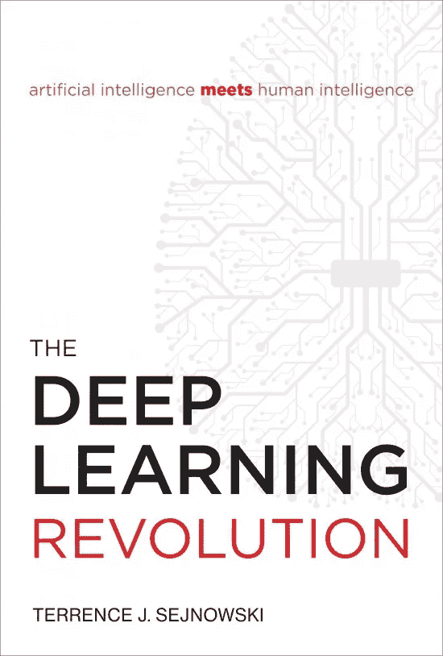

*深度学习革命(*[*【https://mitpress.mit.edu/books/deep-learning-revolution】*](https://mitpress.mit.edu/books/deep-learning-revolution)*)*

我最近听了一个关于人工智能的播客，特伦斯讨论了机器做梦，玻尔兹曼机器的诞生，大脑的内部运作，以及在神经网络中重建它们的过程。特别是，他和 Geoff Hinton 用物理学启发的架构发明了玻尔兹曼机器:

*   每个单元有一个**概率**产生一个随输入量变化的输出。
*   他们给网络输入，然后跟踪网络内的活动模式。对于每个连接，他们跟踪输入和输出之间的相关性。然后，为了能够学习，他们摆脱输入，让网络自由运行，这被称为**睡眠阶段**。
*   **学习算法很直观**:他们从唤醒学习阶段减去睡眠阶段相关性，然后相应地调整权重。对于足够大的数据集，该算法可以有效地学习输入和输出之间的任意映射。

玻尔兹曼机器的类比被证明是一个很好的洞察睡眠期间人类大脑中发生了什么。在认知科学中，有一个概念叫做[回放](https://www.inverse.com/mind-body/offline-replay-memory-sleep-study)，海马体向皮层回放我们的记忆和经历，然后皮层将其整合到我们关于世界的语义知识库中。

这是一种啰嗦的方式来说，我对探索玻尔兹曼机器感兴趣有一段时间了。看到他们在推荐系统中的应用，我欣喜若狂！

在这篇文章和接下来的文章中，我将介绍推荐系统的创建和训练，因为我目前正在做这个主题的硕士论文。

*   第 1 部分提供了推荐系统的高层次概述，它们是如何构建的，以及它们如何被用来改善各行各业的业务。
*   [第 2 部分](/recommendation-system-series-part-2-the-10-categories-of-deep-recommendation-systems-that-189d60287b58)对正在进行的关于这些模型的优势和应用场景的研究计划进行了有益的回顾。
*   [第 3 部分](/recommendation-system-series-part-3-the-6-research-directions-of-deep-recommendation-systems-that-3a328d264fb7)提供了几个可能与推荐系统学者社区相关的研究方向。
*   [第 4 部分](/recsys-series-part-4-the-7-variants-of-matrix-factorization-for-collaborative-filtering-368754e4fab5)提供了可以构建的矩阵分解的 7 种变体的本质数学细节:从使用巧妙的侧面特征到贝叶斯方法的应用。
*   [第 5 部分](/recsys-series-part-5-neural-matrix-factorization-for-collaborative-filtering-a0aebfe15883)提供了基于多层感知器的协同过滤模型的 5 个变体的架构设计，这些模型是能够以非线性方式解释特征的判别模型。
*   [第 6 部分](/recommendation-system-series-part-6-the-6-variants-of-autoencoders-for-collaborative-filtering-bd7b9eae2ec7)提供了基于协作过滤模型的自动编码器的六个变体的主类，这些模型是在学习底层特征表示方面更胜一筹的生成模型。

在第 7 部分中，我探索了使用**波尔兹曼机器**进行协同过滤。更具体地说，我将剖析三篇将玻尔兹曼机器纳入其推荐架构的原则性论文。但首先，让我们浏览一下玻尔兹曼机器及其变体的初级读本。

# 玻尔兹曼机及其变体入门

[据其发明者](https://www.cs.toronto.edu/~hinton/csc321/readings/boltz321.pdf):

> “玻尔兹曼机器是一个由对称连接的神经元样单元组成的网络，可以随机决定是开还是关。玻尔兹曼机器有一个简单的学习算法，允许它们在由二进制向量组成的数据集中发现有趣的特征。在具有许多层特征检测器的网络中，学习算法非常慢，但是通过一次学习一层特征检测器，可以使学习算法快得多。”

为了进一步揭示这一点，Hinton 指出，我们可以使用 Boltzmann 机器来解决两种不同的计算问题:

1.  **搜索问题:**玻尔兹曼机器在连接上具有固定的权重，其被用作优化过程的成本函数。
2.  **学习问题:**给定一组二进制数据向量，我们的目标是找到连接上的权重，以优化训练过程。玻尔兹曼机器通过解决搜索问题的多次迭代来更新权重值。

**受限玻尔兹曼机** (RBM)是玻尔兹曼机的一种特殊类型，有两层单元。如下图所示，第一层由可见单元组成，第二层包括隐藏单元。在这种受限的体系结构中，层中的单元之间没有连接。

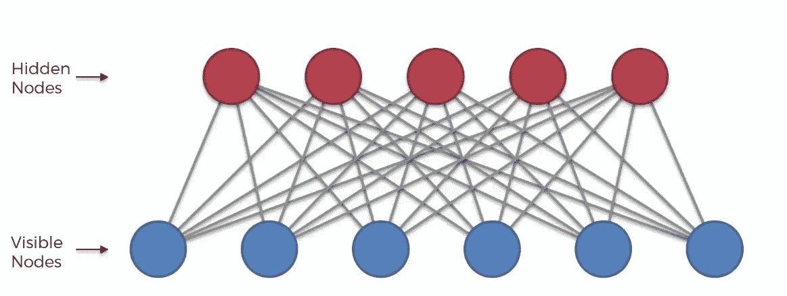

*马尼什·纳亚克——RBM 直观介绍(*[*https://medium . com/datadriveninvestor/An-Intuitive-Introduction-of-restricted-Boltzmann-machine-RBM-14f 4382 A0 dbb*](https://medium.com/datadriveninvestor/an-intuitive-introduction-of-restricted-boltzmann-machine-rbm-14f4382a0dbb)*)*

模型中可见的单元对应于观察到的组件，隐藏的单元代表这些观察到的组件之间的依赖关系。目标是对可见和隐藏单元的联合概率建模: **p(v，h)** 。因为隐藏单元之间没有连接，所以学习是有效的，因为给定可见单元，所有隐藏单元都是有条件独立的。

一个**深度信念网络** (DBN) 是一个多层学习架构，它使用一堆 RBM 来提取训练数据的深度分层表示。在这样的设计中，每个子网络的隐藏层充当即将到来的子网络的可见层。

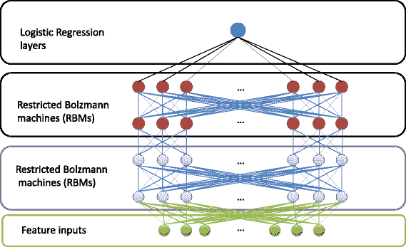

*himan Shu Singh-Deep Belief Networks:An Introduction(*[*https://medium . com/analytics-army/Deep-Belief-Networks-An-Introduction-1d 52 bb 867 a 25*](https://medium.com/analytics-army/deep-belief-networks-an-introduction-1d52bb867a25)*)*

当通过 DBN 学习时，首先通过将原始数据输入到可视单元中来训练底层的 RBM。然后，固定参数，并将 RBM 的隐藏单元用作第二层 RBM 的输入。学习过程继续进行，直到到达堆叠子网络的顶部，最后，获得合适的模型以从输入中提取特征。由于学习过程是无监督的，因此通常会在 DBN 的末尾添加一个新的监督学习网络，以用于分类或回归(上图中的逻辑回归图层)等监督学习任务。

好了，是时候回顾一下不同的基于波尔兹曼机器的推荐框架了！

# 1-用于协同过滤的受限玻尔兹曼机器

回想一下在经典的协同过滤设置中，我们试图用维度 **n x d** 对评级(*用户-项目交互*)矩阵 **X** 进行建模，其中 n 是用户数量，d 是项目数量。条目 **xᵢⱼ** (第 I 行，第 j 列)对应于用户 I 对项目 j 的评级。在 MovieLens 数据集中(在我之前的所有帖子中都使用过)，xᵢⱼ ∈ 0，1，2，3，4，5(其中 0 代表缺失的评级)。

*   例如，xᵢⱼ = 2 意味着用户 I 给电影 j 的评分是 2 分(满分 5 分)。另一方面，xᵢⱼ = 0 意味着用户没有评价电影 j
*   X 行编码每个用户对所有电影的偏好，X 列编码所有用户收到的每个项目的评级。

从形式上来说，我们将协同过滤上下文中的预测和推断定义如下:

*   **预测:**给定观察评分 X，预测 x_{im}(用户 I 给新查询电影 m 的评分)。
*   **推论:**计算概率 p(x_{im} = k | Xₒ)(其中 Xₒ表示 x 和 k ∈ 0，1，2，3，4，5 的非零项)。

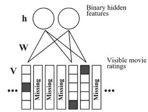

*RBM 架构中提出的* [*受限玻尔兹曼机用于协同过滤*](https://dl.acm.org/doi/10.1145/1273496.1273596)

*Salakhutdinov、Mnih 和 Hinton 将计算 p(x_{im} = k | Xₒ)的任务框定为对具有训练参数的底层 RBM 的推断。数据集被细分为评级矩阵，其中用户的评级被一次性编码到矩阵 v 中，使得如果用户用评级 k 对电影 j 进行评级，则 vⱼᵏ = 1。上图说明了 RBM 图:*

*   *v 是一个 5×d 矩阵，对应于用户的独热编码整数等级。*
*   *h 是二进制隐变量的 F×1 向量，其中 F 是隐变量的个数。*
*   *w 是一个 d x F x 5 张量，它对评级和隐藏特征之间的邻接关系进行编码。它的入口 Wⱼcᵏ对应于电影 j 的等级 k 和隐藏特征 c 之间的边缘电势*

*整个用户-项目交互矩阵**是 V** (s)的集合，其中**每个 V 对应每个用户的评分**。因为每个用户可能有不同的缺失值，所以每个用户都有一个唯一的 RBM 图。在每个 RBM 图中，边连接评级和隐藏功能，但不会出现在缺失评级的项目之间。这篇论文把 W 看作是连接在所有这样的 RBM 图上的一组边势。*

*在**训练**阶段，RBM 使用条件概率 **p(vⱼᵏ = 1 | h)** 和 **p(hₐ = 1 | V)** 来表征评级和隐藏特征之间的关系:*

*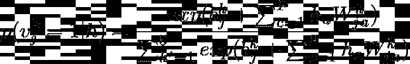*

*等式 1*

*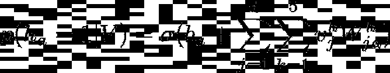*

*等式 2*

*得到这些概率后，还有两个额外的步骤来计算 **p(vₒᵏ = 1 | V)** :*

1.  *基于观察到的评级 v 和每个 a)的边缘势 W (p(hₐ = 1 | V)计算 h 中每个隐藏特征的分布。*
2.  *基于边缘电势 w 和 p(hₐ的分布计算 p(vₒᵏ = 1 | V。*

*在**优化**阶段，通过 V — **p(V)** 的边际似然对 W 进行优化。使用**对比散度**计算梯度∇ Wᵢⱼᵏ，这是基于 Gibbs 抽样的梯度的近似值:*

*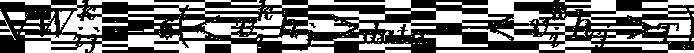*

*等式 3*

*期望值<.> _T 代表运行吉布斯采样器得到的样本分布，在数据处初始化，用于 T 个完整步骤。t 通常在学习开始时设置为 1，并随着学习的收敛而增加。当运行 Gibbs 采样器时，RBM 重构(如等式 1 所示)非缺失评级的分布。对比散度的近似梯度然后可以在所有 n 个用户上平均。*

*为了便于说明，下面给出了 RBM 模型类的 PyTorch 代码:*

*对于[我的 PyTorch 实现](https://github.com/khanhnamle1994/transfer-rec/tree/master/Boltzmann-Machines-Experiments/RBM-CF-PyTorch)，我设计了 RBM 架构，它有一个由非线性 sigmoid 函数激活的 100 个单元的隐藏层。其他超参数包括批次大小 512 和时期 50。*

# *2 —用于协同过滤的可解释的受限玻尔兹曼机器*

*对建议的解释可以有多种好处，包括有效性(帮助用户做出正确的决定)、效率(帮助用户做出更快的决定)和透明度(揭示建议背后的推理)。在 RBM 的例子中，它将一组低维的特征分配给潜在空间中的项目，很难解释这些习得的特征。因此，**一个巨大的挑战是为 RBM** 选择一种预测精度适中的可解释技术。*

*[Abdollahi 和 Nasraoui](https://arxiv.org/abs/1606.07129) 为一个协同过滤推荐系统设计了一个 RBM 模型，该系统在保持准确性的同时建议可以解释的项目。该论文的范围仅限于在解释中不使用额外数据源的建议，以及仅由活动用户的邻居从对这些项目给出的评级中可以生成对推荐项目的解释。*

*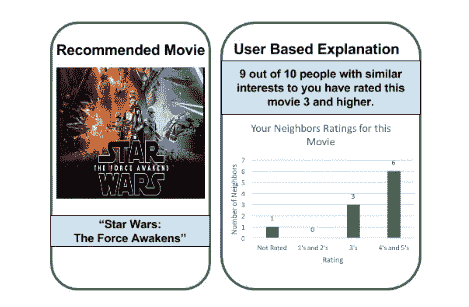*

**推荐项目的基于用户的邻居风格解释的例子，如在* [*可解释的 RBM 用于 CF*](https://arxiv.org/abs/1606.07129) *中提出的**

*主要思想是，如果许多邻居已经对推荐的项目进行了评级，那么这可以使用邻居风格的解释机制来提供解释推荐的基础。对于基于用户的邻居风格的解释，如上图所示，用户 u 的项目 I 的**可解释性得分**被定义为:*

*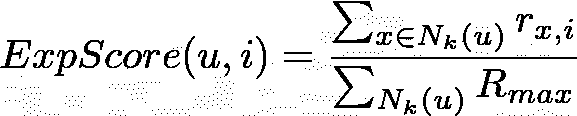*

*等式 4*

*这里 **N_k (u)** 是用户 u 的 k 个邻居的集合， **r_{x，i}** 是 x 对项目 I 的评分， **R_max** 是 N_k (u)对 I 的最大评分值，**余弦相似度定义邻域**。在没有信息损失的情况下，对于缺失评分，r_{x，i}为 0，表明用户 x 对于用户 u 对项目 I 的基于用户的邻居式解释没有贡献，因此，**可解释性得分在 0 和 1 之间**。只有当项目 I 的可解释性得分大于 0 时，项目 I 对于用户 u 才是可解释的。当无法解释时，可解释率为 0。*

*为了便于说明，下面给出了 RBM 模型等级的张量流代码:*

*对于[我的 TensorFlow 实现](https://github.com/khanhnamle1994/transfer-rec/tree/master/Boltzmann-Machines-Experiments/Explainable-RBM-CF-TensorFlow)，我设计了 RBM 架构，它有一个由非线性 sigmoid 函数激活的 100 个单元的隐藏层。其他超参数包括批次大小 512 和时期 50。我还给一个假设用户展示了一个示例推荐列表，其中包括可解释性得分。*

# *3 —用于协同过滤的神经自回归分布估计器*

*RBM 模型的一个问题是它遭受不准确和不切实际的长训练时间，因为:(1)训练是难以处理的，和(2)需要变分近似或马尔可夫链蒙特卡罗。 [Uria，Cote，Gregor，Murray，Larochelle](https://arxiv.org/abs/1605.02226) 提出了所谓的**神经自回归分布估计量** (NADE)，这是一种对高维二元向量的易处理的分布估计量。估计器计算每个元素的条件概率，给定二进制向量中其左侧的其他元素，其中所有条件共享相同的参数。二元向量的概率可以通过这些条件的乘积得到。通过反向传播可以有效地优化 NADE，而不是像 RBM 那样需要昂贵的推理来处理潜在变量。*

*如下图 NADE 所示:*

*   *在输入图层中，值为 0 的单位显示为黑色，值为 1 的单位显示为白色。虚线边框表示层预激活。*
*   *输出 x^_0 给出了向量 x_0 的每个维度的预测概率，以某种顺序给出了前面的元素。*
*   *在输出和被预测的值之间，或者在排序中的 x_0 的后面的元素之间，没有连接的路径。*
*   *连接的箭头对应于具有共享参数的连接。*

*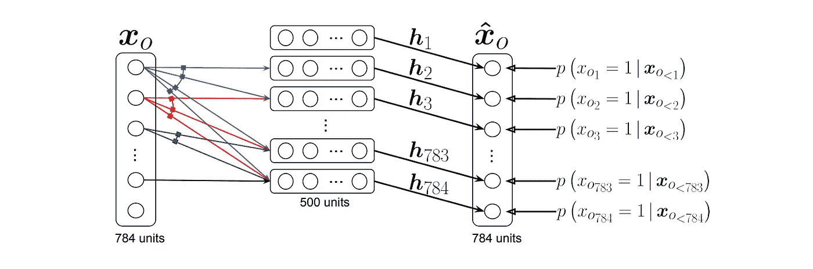*

**一个 NADE 模型的示意图，如图* [*神经自回归分布估计*](https://arxiv.org/abs/1605.02226)*

**[郑、唐、丁、周](https://arxiv.org/abs/1605.09477)提出 **CF-NADE** ，其灵感来源于-CF 和模型，对用户评分分布进行建模。假设我们有四部电影:m1(评分为 5)、m2(评分为 3)、m3(评分为 4)和 m4(评分为 2)。更具体地说，过程如下:**

1.  **无条件下用户给 m1 五星的概率。**
2.  **在给 m1 5 星的条件下，用户给 m2 3 星的概率。**
3.  **用户给 m3 4 星的概率，条件是给 m1 5 星，给 m2 3 星。**
4.  **用户给予 m4 2 星的概率，条件是给予 m1 5 星、m2 3 星和 m3 4 星。**

**从数学上讲，CF-NADE 通过链式法则将评级向量 r 的联合概率建模为:**

**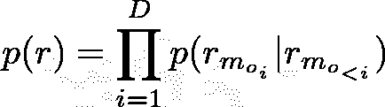**

**等式 5**

*   **d 是用户已经评级的项目的数量。**
*   **o 是(1，2，…，D)排列中的 D 元组。**
*   **mᵢ ∈ {1，2，…，M}是第 I 个评级项的指标。**
*   **rᵘ = (rᵘ_{m_{o₁}}，rᵘ_{m_{o₂}}，…，rᵘ_{m_{oD}})表示用户 u 的训练案例**
*   **rᵘ_{m_{oᵢ}} ∈ {1，2，…，K}表示用户对项目 m_{oᵢ}.的评价**
*   **rᵘ_{m_{o**

**To expand on the process of getting the conditionals in equation 5, CF-NADE first computes the hidden representation of dimension H given rᵘ_{m_{o**

**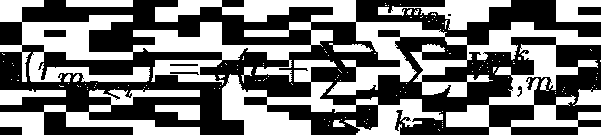**

**Equation 6**

*   **g is the activation function.**
*   **Wᵏ is the connection matrix associated with rating k.**
*   **Wᵏ_{:,j} is the j-th column of Wᵏ and Wᵏ_{i,j} is an interaction parameter between the i-th hidden unit and item j with rating k.**
*   **c is the bias term.**

**Using this hidden representation from equation 6, CF-NADE then computes sᵏ_{m_{oᵢ}} (r_{m_{o_{**

***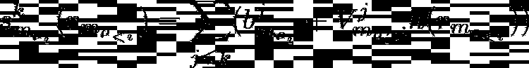***

***Equation 7***

***Vʲ and bʲ are the connection matrix and the bias term associated with rating k, respectively, where k is bigger than or equal to j. Using this score from equation 7, the conditionals in equation 5 could be modeled as:***

***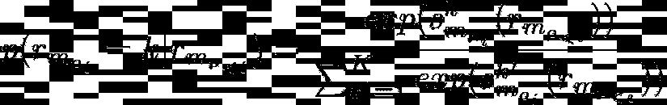***

***Equation 8***

***CF-NADE is optimized via minimization of the negative log-likelihood of p(r) in equation 5:***

***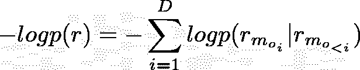***

***Equation 9***

***Ideally, the order of movies (represented by notation o) should follow the timestamps of ratings. However, the paper shows that random drawing can yield good performance.***

***The Keras code of the CF-NADE model class is given below for illustration purpose:***

***For [我的 Keras 实现](https://github.com/khanhnamle1994/transfer-rec/tree/master/Boltzmann-Machines-Experiments/NADE-CF-Keras)，我设计了一个包含 100 个单元的隐藏层，通过 Adam 优化，学习率为 0.001。其他超参数包括批次大小 512 和时期 50。***

# ***模型评估***

***您可以查看我在这个资源库中构建的所有三个基于波尔兹曼机器的推荐模型:[https://github . com/khanhnamle 1994/transfer-rec/tree/master/Boltzmann-Machines-Experiments](https://github.com/khanhnamle1994/transfer-rec/tree/master/Boltzmann-Machines-Experiments)。***

*   ***数据集是 [MovieLens 1M](https://github.com/khanhnamle1994/transfer-rec/tree/master/ml-1m) ，类似于我之前用[矩阵分解](https://github.com/khanhnamle1994/transfer-rec/tree/master/Matrix-Factorization-Experiments)、[多层感知器](https://github.com/khanhnamle1994/transfer-rec/tree/master/Multilayer-Perceptron-Experiments)和[自动编码器](https://github.com/khanhnamle1994/transfer-rec/tree/master/Autoencoders-Experiments)做的三个实验。目标是预测用户对一部电影的评价，其中评价在 1 到 5 之间。***
*   ***在该设置中，评估度量是**均方根误差(RMSE)** 。换句话说，我希望最小化预测评级和实际评级之间的差值。***

***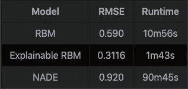***

*   ***结果表在我回购的[自述](https://github.com/khanhnamle1994/transfer-rec/blob/master/Boltzmann-Machines-Experiments/README.md)底部:可解释的 RBM 模型 RMSE 最低，训练时间最短，NADE 模型 RMSE 最高，训练时间最长。***

# ***结论***

***在这篇文章中，我讨论了玻尔兹曼机器的基本原理及其在协同过滤中的应用。我还浏览了 3 篇不同的论文，这些论文使用了受波尔兹曼机器启发的架构作为推荐框架:(1)受限波尔兹曼机器，(2)可解释的受限波尔兹曼机器，以及(3)神经自回归分布估计器。***

***还有几篇值得一提的论文，我还没来得及细说:***

*   ***[乔尔杰夫和纳科夫](http://proceedings.mlr.press/v28/georgiev13.html)使用 RBMs 联合建模:(1)用户投票项目之间的相关性和(2)对特定项目投票的用户之间的相关性，以提高推荐系统的准确性。***
*   ***[胡等](https://datasciences.org/publication/aaai2014-hu.pdf)在基于群体的推荐系统中使用，通过联合建模集体特征和群体简档来建模群体偏好。***
*   ***[Truyen 等人](https://arxiv.org/abs/1205.2611)使用 Boltzmann 机器来提取两者:(1)评级项目与其评级之间的关系(由于隐藏层和 softmax 层之间的连接)以及(2)评级项目之间的相关性(由于 softmax 层单元之间的连接)。***
*   ***[Gunawardana 和 Meek](https://www.microsoft.com/en-us/research/wp-content/uploads/2016/02/gunawardana08__tied_boltz_machin_cold_start_recom.pdf) 不仅使用 Boltzmann 机器来建模用户和项目之间的相关性，还用于整合内容信息。更具体地说，模型参数与内容信息联系在一起。***

***请继续关注本系列的下一篇博文，它将探讨推荐系统环境中的各种评估指标。***

## ***参考***

*   ***[*受限玻尔兹曼机协同过滤*](https://dl.acm.org/doi/10.1145/1273496.1273596) *。Ruslan Salakhutdinov，Andriy Mnih 和 Geoffrey Hinton。2007 年 6 月。****
*   ***[*可解释受限玻尔兹曼机进行协同过滤*](https://arxiv.org/abs/1606.07129) *。*贝努什·阿多拉希和奥尔法·纳斯拉维。2016 年 6 月。***
*   ***[*一种神经自回归的协同过滤方法*](https://arxiv.org/abs/1605.09477) 。、唐、丁、周汉宁。2016 年 5 月。***

****如果你想关注我在推荐系统、深度学习和数据科学新闻方面的工作，你可以查看我的* [*中的*](https://medium.com/@james_aka_yale) *和*[*GitHub*](https://github.com/khanhnamle1994)*，以及在*[*【https://jameskle.com/】*](https://jameskle.com/)*的其他项目。你也可以在* [*推特*](https://twitter.com/le_james94) *，* [*直接发邮件给我*](mailto:khanhle.1013@gmail.com) *，或者* [*在 LinkedIn 上找我*](http://www.linkedin.com/in/khanhnamle94) *。* [*注册我的简讯*](http://eepurl.com/deWjzb) *就在你的收件箱里接收我关于研究和生产中的机器学习的最新想法吧！****