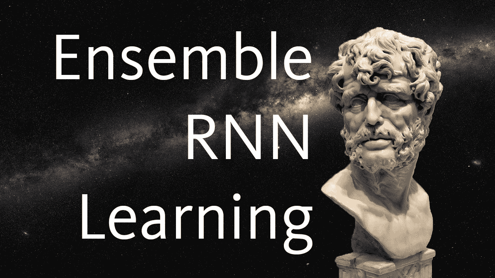
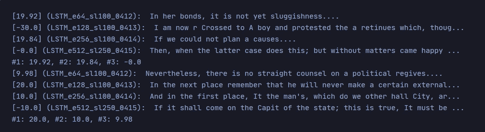
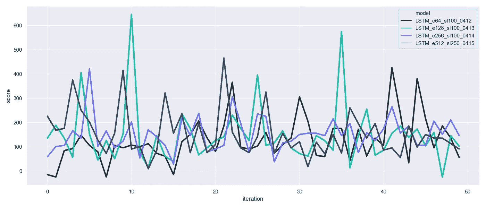

# 递归集成学习

> 原文：<https://towardsdatascience.com/recurrent-ensemble-learning-caffdcd94092?source=collection_archive---------46----------------------->

## [冥想计划](http://www.towardsdatascience.com/tagged/the-meditations)

## 用竞争神经网络提高文本生成质量



塞内卡图像来自 [Jean-Pol GRANDMONT](https://commons.wikimedia.org/wiki/User:Jean-Pol_GRANDMONT) 制作的[17 世纪匿名雕塑家制作的塞内卡半身像](https://commons.wikimedia.org/wiki/File:0_S%C3%A9n%C3%A8que_-_Mus%C3%A9e_du_Prado_-_Cat._144_-_(2).JPG)，由 3.0 授权于 [CC。背景图片来自](https://creativecommons.org/licenses/by/3.0/)[银河全景图](https://www.eso.org/public/images/eso0932a/)由 [ESO](https://www.eso.org/public/) 提供，由 4.0 授权 [CC。](https://creativecommons.org/licenses/by/4.0/)

我一直在设计几个斯多葛派哲学家——都是用 TensorFlow 构建的。他们中的一些人创造了辉煌的文本，但随后会陷入疯狂的状态***(不是一件非常坚忍的事情)*并说出类似`(!EPLYZzzFxZFKzPZjQYCVS(!C!HZwEL(]SzKz]FXXKHzzzPP[(`的话。**

**其他哲学家会写出可读的文本，但不是特别有趣。但是他们会更加稳定。**

**这两个问题的解决方案——让这些现在的角斗士哲学家进行生死决斗。场地？体育馆里欢呼的人群已经被没有灵魂的短语排名算法所取代。**

**因此，在开始之前，我们将介绍:**

*   **使用几个竞争的 RNN 模型(我们的**哲学角斗士****
*   **评定模型输出(体育馆**和****
*   **将这些放在一起产生一些神奇的东西(**一个冠军角斗士**的哲学名言——或者实际上，我们的几个角斗士)**

# **莫拉莱斯书信**

**我们的角斗士将学习马可·奥勒留的冥想和鲁契留的书信。我们混合使用了`requests`和`BeautifulSoup`库来获取它们。**

**为了你的兴趣，我不会描述这个过程。但是你可以在这里找到`code/data.py`中的代码。**

# **全体**

**使用一个名为`gladiator_predict`的简单函数来控制模型的集合。**

**模型名称列表被传递给这个函数——它加载模型，然后遍历每个模型——用`generate`生成文本，用`rate`对文本**进行评级**。**

**然后，我们根据分数对这些输出进行排序，并将获胜的序列传递回`generate`，就像这样:**

**完整代码见[此处](https://github.com/jamescalam/meditations_ai/blob/master/code/meditation.py)。**

**当我们生成更多文本时，能够选择最佳序列对我们的输出有巨大的影响。**

**在之前，模型会产生合理的文本，但经常会陷入**无意义的胡言乱语**——然后回到*雄辩的“斯多葛派的冥想*。**

****现在**，一旦一个模特陷入这种胡言乱语的状态，她**就输了**👎**

**然后，我们的模型将继续丢失，直到它再次生成英文文本**👍****

# **竞技场**

**决定哪个哲学家角斗士产生了最好的输出的关键是`rate`函数。**

**`rate`给出一个角斗士的冥想，并根据几个因素进行评分:**

*   **冥想是否以正确的**标点符号**结束？**

**✔ ️ `"this whole world is my country."`**

**❌ `"Thy knows what **Z**"`**

*   **冥想包含多少**重复**？**

**✔ ️ `"About what am I now employing my own soul?"`**

**❌ `"But **I know** how many **I know** and **I know**."`**

*   **这些词存在于**词汇**中吗？**

**✔ ️ `"Do not act as if thou wert going to live ten thousand years."`**

**❌ `"**Turramoly**? When **hishich** is deity, from there is places the **smater**."`**

**综上所述，我们可以根据这个分数生成输出:**

****

# **谁赢了？**

**`gladiator_predict`中的`vis`参数允许我们可视化我们的角斗士表演:**

****

**我们可以看到这是一场戏剧性的战斗。但最终，角斗士哲学家 **LSTM_e512_sl250_0414** 产生了最好和最一致的哲学。**

**使用一组模型的**优势**在这张图片中是显而易见的。 **e128** 产生了一些得分最高的输出。但是在迭代 *36* 和 *47* 时也产生了一些可怕的输出。**

****如果没有合奏**来支持 **e128** ，迭代 *36* 和 *47* 中所说的任何胡言乱语都将进入最终输出。**

**幸运的是，我们有几个更好的选择。**

**在这次演出中，我们的合奏制作了这篇短文。**

```
Do you ask any man with a book: here you ask these fellows, who indeed make thy thing greater. That which you declared if you consider any man a friend whom you are to distinguish between investigation to every man accordingly.That even in the scholar's abyss in study, and the senses may need desired, but the world walls he should not *abroughly* handle soil, which turn to the fact where the good seeks a fame of living things, and likewise to disease to meet us to other also, that we can come *alood* of it again in all respects, but not boast of his own strength; but what kind out my lot has been broken, it *goan* us generations, and was reached when one fights away upon a period of labour! This is the words of Socrates.
```

**感谢阅读！**

**如果你对这个项目感兴趣，你可以在这里找到回购协议。我还写了关于初始构建的内容，您可以在这里阅读:**

**[](/stoic-philosophy-built-by-algorithms-9cff7b91dcbd) [## 斯多葛派哲学——由算法构建

### 再现历史上最有权势的人之一所写的斯多葛派哲学

towardsdatascience.com](/stoic-philosophy-built-by-algorithms-9cff7b91dcbd)**