# 递归神经网络

> 原文：<https://towardsdatascience.com/recurrent-neural-networks-56e1ad215339?source=collection_archive---------18----------------------->

## 理解 RNN 背后的直觉！

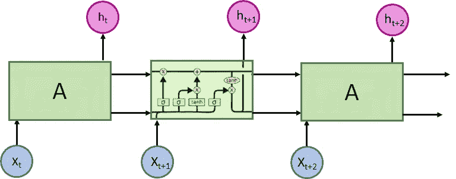

按作者分列的数字

# 介绍

本文的目标是深入探讨递归神经网络，这是一种具有不同于前几篇文章(链接)中所见的架构的神经网络。

具体而言，文章分为以下几个部分:

*   什么是 rnn
*   长短期记忆(LSTM)网络
*   时间序列的 RNNs 实现

# 什么是 rnn？

正如我们在这里看到的，CNN 没有任何记忆，rnn 每次都可以超越“从头开始思考”的限制，因为它们有某种记忆。

让我们用一个非常直观的例子来看看它们是如何工作的:

## 例子

假设我们住在公寓里，有一个完美的室友，他会根据天气做不同的饭菜，晴天还是雨天。


按作者分列的数字

所以，如果我们用向量来编码这些食物:

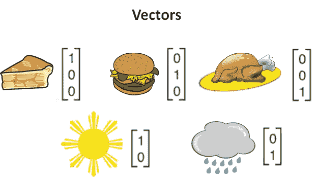

按作者分列的数字

我们的神经网络会做以下事情:

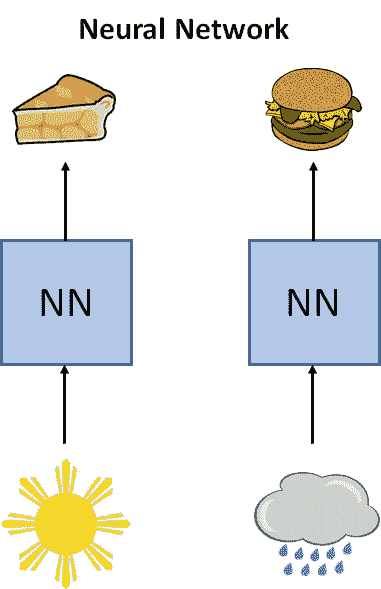

按作者分列的数字

如果我们回想一下，神经网络学习一些可以用矩阵表示的权重，这些权重用于进行预测。我们的将如下:

如果是晴天:


按作者分列的数字

如果是雨天:

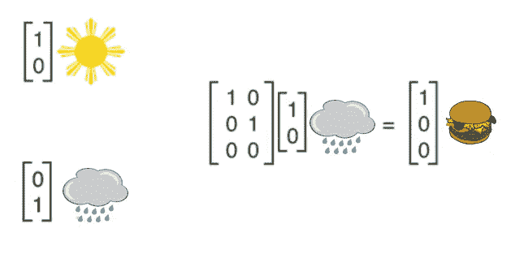

按作者分列的数字

如果我们看一下我们的权重矩阵，这次是一个图表:

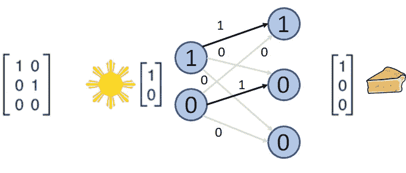

按作者分列的数字

现在让我们看看在这个例子之后添加了什么 rnn:

## 递归神经网络

比方说，现在我们亲爱的室友不仅根据天气来决定做什么，而且现在只看他昨天做了什么。

负责根据室友今天做的菜来预测她明天会做什么菜的网络是一个递归神经网络(RNN)。

这个 RNN 可以表示为下面的矩阵:

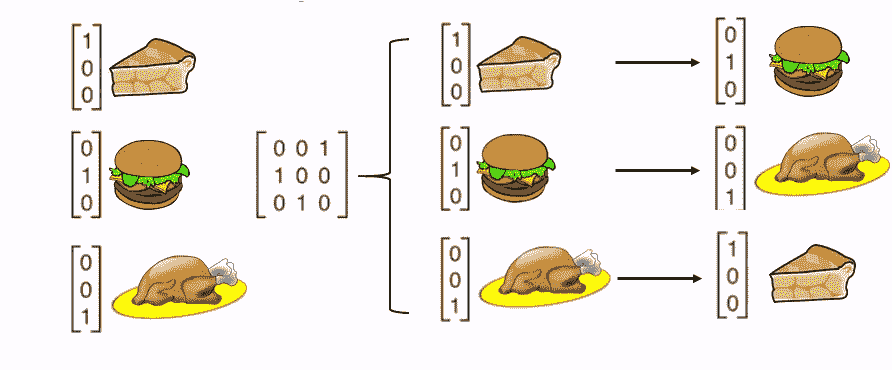

按作者分列的数字

所以我们有一个:

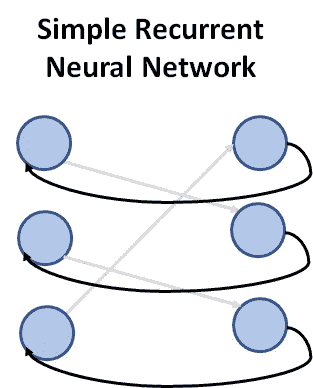

按作者分列的数字

## 让我们把它变得稍微复杂一点

现在想象一下，你的室友根据她昨天做的菜和天气决定做什么菜。

*   如果天气晴朗，她会手里拿着一瓶上好的啤酒在阳台上呆一天，所以她不做饭，所以我们吃和昨天一样的东西。但是
*   如果下雨，她就呆在家里做饭。

大概是这样的:

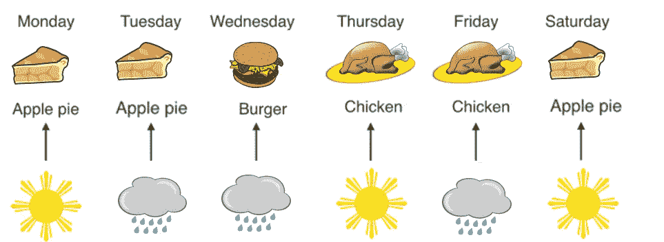

按作者分列的数字

因此，我们最终有了一个模型，它根据我们昨天吃的东西告诉我们将要吃什么，而另一个模型告诉我们我们的室友是否会做饭。

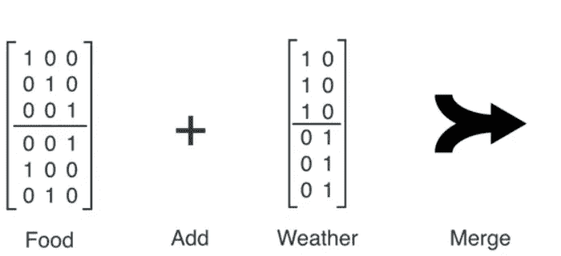

按作者分列的数字

添加和合并操作如下:

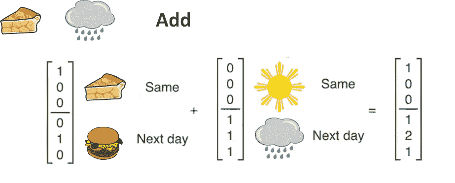

按作者分列的数字

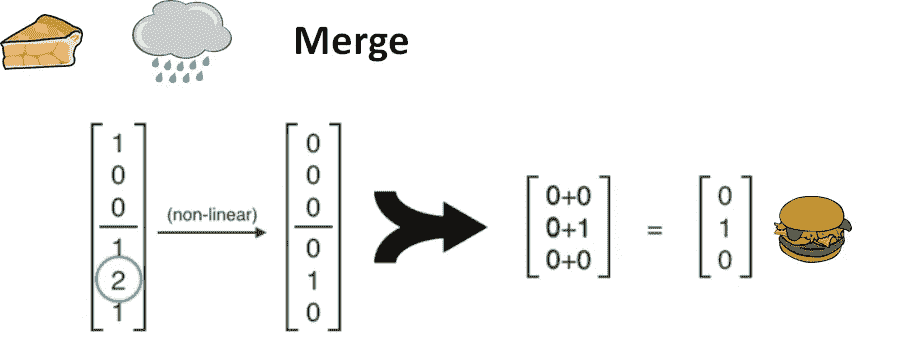

按作者分列的数字

这里你可以看到图表:

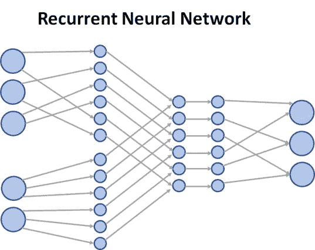

按作者分列的数字

这就是它的工作原理！

这个例子来自一个很棒的视频，我建议你根据需要多次查看，深入理解前面的解释。你可以在这里找到视频:[https://www.youtube.com/watch?v=UNmqTiOnRfg](https://www.youtube.com/watch?v=UNmqTiOnRfg)

## rnn 是用来做什么的？

有几种类型:


按作者分列的数字

他们非常擅长做出预测，尤其是当我们的数据是连续的时候:

**股市预测**

一只股票的价值很大程度上取决于它以前的价值

**序列生成**
只要数据是序列，数据在一个瞬间 *t* 取决于数据在瞬间 *t-1。*

**文本生成**

比如你手机提示单词的时候。它看着你写的最后一个单词，看着你正在写的字母，暗示下一个字母甚至单词。

**语音识别**

在这种情况下，我们可以识别出前一个单词，并在那一刻接收到音频。

# 长短期记忆网络

现在让我们研究一下最流行的 RNN 是如何工作的。它们是 LSTM 网络，其结构如下:

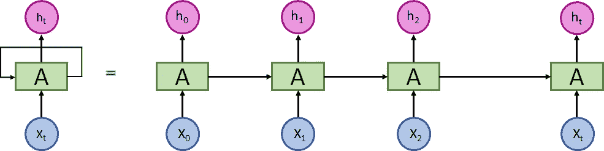

按作者分列的数字

但是首先:**为什么他们是最受欢迎的？**

原来常规的 rnn 都有内存问题。专门设计的记忆网络无法进行长期记忆。为什么这是一个问题？

好吧，回到我们室友的问题，对于这个例子，我们只需要知道我们昨天吃了什么，所以什么都不会发生。

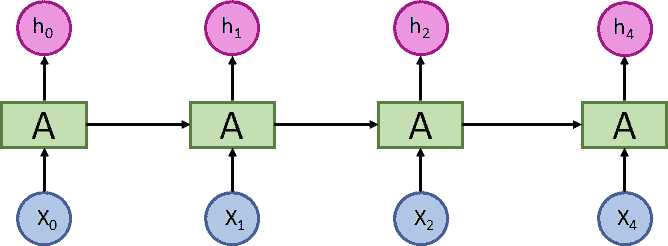

按作者分列的数字

但是想象一下，如果不是三道菜的菜单，而是 60 道菜。

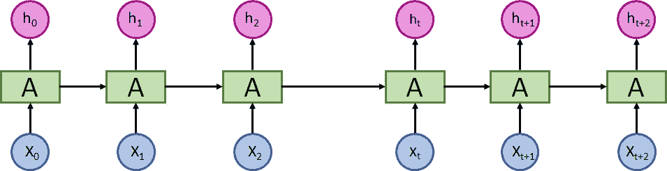

按作者分列的数字

传统的 rnn 无法记住很久以前发生的事情。然而，LSTM 会！

为什么呢？

让我们来看看 RNN 和 LSTM 的建筑:

## RNN

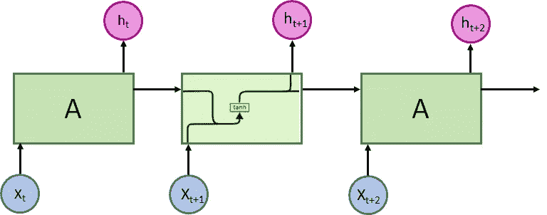

按作者分列的数字

## LSTM


按作者分列的数字

事实证明，rnn 只有一层，而 LSTMs 有多层的组合，它们以一种非常特殊的方式相互作用。

让我们试着理解这一点，但首先，让我解释一下术语:


按作者分列的数字

在上图中:

*   向量沿着每条线传播，从一个节点的输出到其他节点的输入。
*   粉色圆圈表示元素到元素的运算，例如向量和，而黄色方框是通过训练学习的神经层。
*   连接的线表示连接，分隔的线表示相同的行内容到达两个不同的目的地。

## LSTMs 的核心思想

关键是单元的状态，它在图中表示为穿过顶部的线:

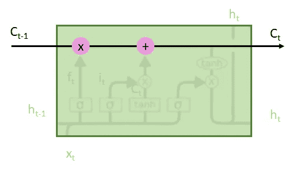

按作者分列的数字

细胞的状态就像一种传送带，它沿着网络的整个结构行进，很少交互作用(并且它们是线性的):这意味着信息只是简单地流动而没有被修改。

巧妙之处在于，LSTM 的各层可以(或不可以)向这条传送带提供信息，而这个决定是由“门”做出的:

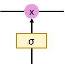

按作者分列的数字

这些门只不过是一种小心调节到达传送带的信息的方式。它们由具有 sigmoid 型激活和元素乘法的神经网络组成。

因此，sigmoid 层输出一个介于 0 和 1 之间的数字，这意味着让信息传递到传送带有多重要。0 表示我不在乎，1 表示非常重要。

如图所示，一台 LSTM 有 3 个这样的门，用于保护和控制传送带。

关于这个操作的具体细节，在这里有很大的解释:[http://colah.github.io/posts/2015-08-Understanding-LSTMs/](http://colah.github.io/posts/2015-08-Understanding-LSTMs/)

而且这个博客也很有意思:【http://karpathy.github.io/2015/05/21/rnn-effectiveness/】T2

考虑到这一点，让我们看看循环网络可以做什么！

# LSTM 实施

## LSTM 图像分类

我们将遵循一个可以在此找到的示例:

[https://medium . com/the-artificial-impostor/notes-understanding-tensor flow-part-2-f 7 e 5 ECE 849 f 5](https://medium.com/the-artificial-impostor/notes-understanding-tensorflow-part-2-f7e5ece849f5)

```
from keras.models import Sequential
from keras.layers import LSTM, Dense
from keras.datasets import mnist
from keras.utils import np_utils
from keras import initializers

**# Hyper parameters**
batch_size = 128
nb_epoch = 10**# Parameters for MNIST dataset**
img_rows, img_cols = 28, 28
nb_classes = 10**# Parameters for LSTM network**
nb_lstm_outputs = 30
nb_time_steps = img_rows
dim_input_vector = img_cols**# Load MNIST dataset**
(X_train, y_train), (X_test, y_test) = mnist.load_data()
print('X_train original shape:', X_train.shape)
input_shape = (nb_time_steps, dim_input_vector)X_train = X_train.astype('float32') / 255.
X_test = X_test.astype('float32') / 255.Y_train = np_utils.to_categorical(y_train, nb_classes)
Y_test = np_utils.to_categorical(y_test, nb_classes)print('X_train shape:', X_train.shape)
print(X_train.shape[0], 'train samples')
print(X_test.shape[0], 'test samples')
```

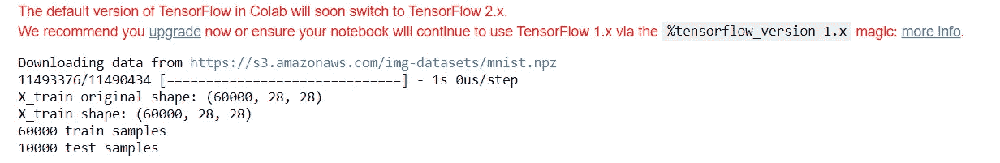

```
**# LSTM Building**
model = Sequential()
model.add(LSTM(nb_lstm_outputs, input_shape=input_shape))
model.add(Dense(nb_classes, activation='softmax'))
model.compile(optimizer='rmsprop', loss='categorical_crossentropy', metrics=['accuracy'])
model.summary()
```

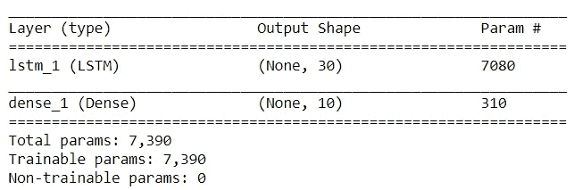

```
**# Training the model**
history = model.fit(X_train, 
                    Y_train, 
                    nb_epoch=nb_epoch, 
                    batch_size=batch_size, 
                    shuffle=True,
                    validation_data=(X_test, Y_test),
                    verbose=1)
```

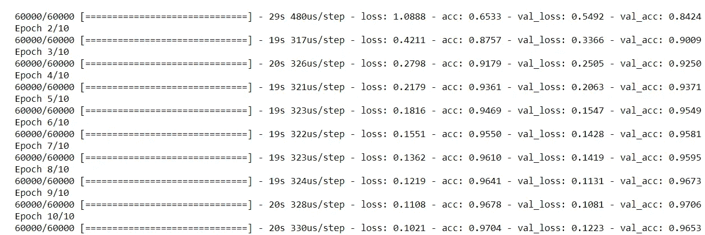

```
**# Evaluation**
evaluation = model.evaluate(X_test, Y_test, batch_size=batch_size, verbose=1)
print('Summary: Loss over the test dataset: %.2f, Accuracy: %.2f' % (evaluation[0], evaluation[1]))
```

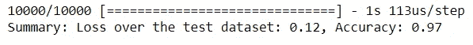

## 用 LSTM 进行时间序列预测

```
# LSTM for international airline passengers problem with regression framing
# [https://machinelearningmastery.com/time-series-prediction-lstm-recurrent-neural-networks-python-keras/](https://machinelearningmastery.com/time-series-prediction-lstm-recurrent-neural-networks-python-keras/)
!wget [https://raw.githubusercontent.com/lazyprogrammer/machine_learning_examples/master/airline/international-airline-passengers.csv](https://raw.githubusercontent.com/lazyprogrammer/machine_learning_examples/master/airline/international-airline-passengers.csv)import numpy
import matplotlib.pyplot as plt
from pandas import read_csv
import math
from keras.models import Sequential
from keras.layers import Dense
from keras.layers import LSTM
from sklearn.preprocessing import MinMaxScaler
from sklearn.metrics import mean_squared_error**# convert an array of values into a dataset matrix**
def create_dataset(dataset, look_back=1):
 dataX, dataY = [], []
 for i in range(len(dataset)-look_back-1):
  a = dataset[i:(i+look_back), 0]
  dataX.append(a)
  dataY.append(dataset[i + look_back, 0])
 return numpy.array(dataX), numpy.array(dataY)**# fix random seed for reproducibility**
numpy.random.seed(7)**# load the dataset**
dataframe = read_csv('international-airline-passengers.csv', usecols=[1], engine='python', skipfooter=3)
dataset = dataframe.values
dataset = dataset.astype('float32')**# normalize the dataset**
scaler = MinMaxScaler(feature_range=(0, 1))
dataset = scaler.fit_transform(dataset)**# split into train and test sets**
train_size = int(len(dataset) * 0.67)
test_size = len(dataset) - train_size
train, test = dataset[0:train_size,:], dataset[train_size:len(dataset),:]**# reshape into X=t and Y=t+1**
look_back = 1
trainX, trainY = create_dataset(train, look_back)
testX, testY = create_dataset(test, look_back)**# reshape input to be [samples, time steps, features]**
trainX = numpy.reshape(trainX, (trainX.shape[0], 1, trainX.shape[1]))
testX = numpy.reshape(testX, (testX.shape[0], 1, testX.shape[1]))**# create and fit the LSTM network**
model = Sequential()
model.add(LSTM(4, input_shape=(1, look_back)))
model.add(Dense(1))
model.compile(loss='mean_squared_error', optimizer='adam')
model.fit(trainX, trainY, epochs=100, batch_size=1, verbose=2)**# make predictions**
trainPredict = model.predict(trainX)
testPredict = model.predict(testX)**# invert predictions**
trainPredict = scaler.inverse_transform(trainPredict)
trainY = scaler.inverse_transform([trainY])
testPredict = scaler.inverse_transform(testPredict)
testY = scaler.inverse_transform([testY])**# calculate root mean squared error**
trainScore = math.sqrt(mean_squared_error(trainY[0], trainPredict[:,0]))
print('Train Score: %.2f RMSE' % (trainScore))
testScore = math.sqrt(mean_squared_error(testY[0], testPredict[:,0]))
print('Test Score: %.2f RMSE' % (testScore))**# shift train predictions for plotting**
trainPredictPlot = numpy.empty_like(dataset)
trainPredictPlot[:, :] = numpy.nan
trainPredictPlot[look_back:len(trainPredict)+look_back, :] = trainPredict**# shift test predictions for plotting**
testPredictPlot = numpy.empty_like(dataset)
testPredictPlot[:, :] = numpy.nan
testPredictPlot[len(trainPredict)+(look_back*2)+1:len(dataset)-1, :] = testPredict**# plot baseline and predictions**
plt.plot(scaler.inverse_transform(dataset))
plt.plot(trainPredictPlot)
plt.plot(testPredictPlot)
plt.show()
```

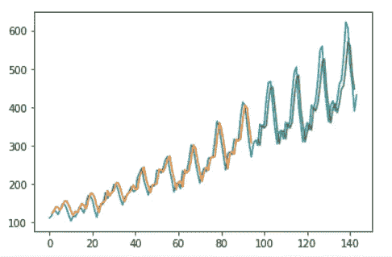

# 最后的话

一如既往，我希望你喜欢这篇文章，并且对 rnn 以及如何实现它们有了一个直觉！

*如果你喜欢这篇文章，那么你可以看看我关于数据科学和机器学习的其他文章* [*这里*](https://medium.com/@rromanss23) *。*

*如果你想了解更多关于机器学习、数据科学和人工智能的知识* ***请关注我的媒体*** *，敬请关注我的下一篇帖子！*