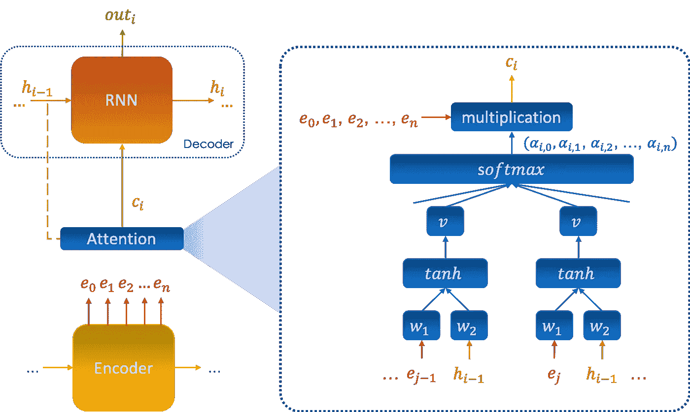

# 递归神经网络

> 原文：<https://towardsdatascience.com/recurrent-neural-networks-b7719b362c65?source=collection_archive---------31----------------------->

由 [Sonja Langford](https://unsplash.com/@sonjalangford?utm_source=unsplash&utm_medium=referral&utm_content=creditCopyText) 在 [Unsplash](https://unsplash.com/s/photos/time-series?utm_source=unsplash&utm_medium=referral&utm_content=creditCopyText) 上拍摄的照片

## 了解是什么使 RNNs 在处理序列数据时高效

递归神经网络是非常著名的深度学习网络，应用于序列数据:时间序列预测、语音识别、情感分类、机器翻译、命名实体识别等..
对序列数据使用前馈神经网络提出了两个主要问题:

*   在不同的例子中，输入和输出可以有不同的长度
*   MLPs 不共享跨数据样本的不同位置学习的特征

在本文中，我们将发现 RNNs 成功背后的数学原理，以及一些特殊类型的细胞，如 LSTMs 和 GRUs。最后，我们将深入研究结合注意力机制的编码器-解码器架构。

注意:因为 Medium 不支持 LaTeX，所以数学表达式是作为图像插入的。因此，为了更好的阅读体验，我建议你关闭黑暗模式。

# 目录

1.  **符号**
2.  **RNN 车型**
3.  **不同类型的无线网络**
4.  **高级细胞类型**
5.  **编码器&解码器架构**
6.  **注意机制**

# 1.注释

作为示例，我们将考虑命名实体识别的任务，该任务包括定位和识别命名实体，例如专有名称:

我们表示:

当处理非数字数据时，例如文本，将它编码成数字向量是非常重要的:这个操作称为`embedding`。最著名的文本编码方式之一是由谷歌开发的 Bert。

# 2.RNN 模型

RNNs 代表神经网络的一种特殊情况，其中模型的参数以及所执行的操作在整个体系结构中是相同的。网络为序列中的每个元素执行相同的任务，该序列的`output depends on the input and the previous state of the memory`。
下图显示了具有单层隐藏记忆的神经元的神经网络:

## 方程式

架构中的变量包括:

其中:

*h(*-1)被随机初始化， *ϕ* 和 *ψ* 是非线性函数， *U* 、 *V* 和 *W* 是各种线性回归的`parameters`，在非线性激活之前。
需要注意的是，它们在整个架构中**是相同的**。

## 应用程序

递归神经网络显著改进了序列模型，特别是:

*   NLP 任务、建模和文本生成
*   翻译机
*   声音识别

我们在下表中总结了上述应用:

## 学习算法

如同在经典神经网络中一样，在递归网络的情况下，通过优化关于 *U* 、 *V* 和 *W* 的成本函数来进行学习。换句话说，我们的目标是从真实值 *yi* 的输入 *xi* 开始，找到给出最佳预测 y^ *i* 的最佳参数。

为此，我们定义了一个名为`loss function`的目标函数，记为`J`，它量化了整个训练集的真实值和预测值之间的距离。

我们通过以下两个主要步骤来最小化 J:

*   `**Forward Propagation**`:我们通过网络整体或分批传播数据，并计算这批数据的损失函数，该损失函数只不过是不同行的预测输出中的误差之和。
*   `**Backward Propagation Through Time**`:包括计算成本函数相对于不同参数的梯度，然后应用下降算法对其进行更新。它被称为 BPTT，因为每个输出端的梯度既取决于同一时刻的元素，也取决于前一时刻的记忆状态。

我们多次重复相同的过程，称为`epoch number`。定义架构后，学习算法编写如下:

(∫)成本函数 *L* 计算单个点上实际值和预测值之间的距离。

## 正向传播

让我们考虑通过神经网络预测单个序列的输出。
在每个时刻 *t* ，我们计算:

直到到达序列的末尾。
同样，参数 *U* 、 *W* 和 *V* 在整个神经网络中保持**相同**。
当处理一个 *m* 行的数据集时，对每一行分别重复这些操作是非常昂贵的。因此，我们截断数据集，以便在相同的时间线中描述序列，即:

我们可以使用线性代数将其并行化，如下所示:

## 穿越时间的反向传播

反向传播是学习的第二步，包括在预测(正向)阶段将`injecting the error`提交到网络中，并将其参数更新为`perform better on the next iteration`。因此，函数 *J* 的优化通常通过下降法进行。

我们现在可以应用一个下降方法，在我之前的[文章](/deep-learnings-mathematics-f52b3c4d2576)中有详细描述。

## 记忆问题

我们对基于历史预测时间序列的演变感兴趣的领域有几个:音乐、金融、情感…等等。上面描述的内在循环网络被称为“香草”,具有记忆力差的缺点，在预测未来时不能考虑过去的几个因素。

考虑到这一点，RNNs 的各种扩展被设计来修整内部记忆:双向神经网络、LSTM 细胞、注意力机制等等。记忆放大在某些领域是至关重要的，比如在金融领域，人们试图记住尽可能多的历史，以便预测一个金融序列。

RNN 的学习阶段也可能遭受`gradient vanishing`或`gradient exploding`问题，因为成本函数的梯度包括影响其记忆能力的 *W* 的幂。

# 3.不同类型的 rnn

经典或“普通”递归神经网络有多种扩展，这些扩展旨在增加网络的存储容量以及特征提取能力。
下图总结了不同的扩展:

还有其他类型的 rnn 有一个专门设计的隐藏层，我们将在下一章讨论。

# 4.高级类型的细胞

## 门控循环单元

GRU(门控循环单元)单元允许循环网络保存更多的历史信息，以便进行更好的预测。它引入了一个`update gate`，用于确定要从过去保留的信息量，以及一个`reset gate`，用于设置要忘记的信息量。下图示意了 GRU 细胞:

**方程** 我们将 GRU 单元中的方程定义如下:

*ϕ* 是非线性整数函数，参数 *W* 由模型学习。

## 长短期记忆

LSTMs(长短期记忆)也被引入来克服短记忆的问题，它们比普通的 RNNs 多 4 倍的记忆。这个模型使用了门的概念，有三个:

*   输入门 *i* :控制输入信息的流动。
*   遗忘门 *f* :控制前一存储状态的信息量。
*   输出门 *o:控制输出信息流*

下图显示了 LSTM 电池的操作:

当输入和输出门关闭时，存储单元中的激活被阻止。

**方程式** 我们将 LSTM 单元中的方程式定义如下:

**优点&缺点** 我们可以把 LSTM 细胞的优点和缺点总结为四个要点:

*   **优点**

+他们能够对长期序列依赖性进行建模。
+与“普通”rnn 相比，它们对短记忆问题更具鲁棒性，因为内部存储器的定义从:

*   **缺点**

+与 RNN 相比，它们增加了计算复杂性，引入了更多要学习的参数。
+由于存在多个内存单元，所需内存高于“普通”rnn。

# 5.编码器和解码器架构

它是由两个主要部分组成的顺序模型:

*   `Encoder`:模型的第一部分处理序列，然后在最后返回整个序列的编码向量，称为`context vector`，其概括了不同输入的信息。
*   `Decoder`:上下文向量然后被作为解码器的输入，以便进行预测。

下图说明了该模型的架构:

编码器可以认为是一个降维工具，事实上，上下文向量 *en* 无非是对输入向量的编码( 0 中的*，* 1 中的*， *inn* )，这些向量的大小之和远大于 en 的大小，因此有降维的概念。*

# 6.注意机制

引入注意机制是为了解决记忆限制的问题，主要回答以下两个问题:

*   编码器的每个输出 *ej* 赋予什么权重(重要性) *αj* ？
*   我们如何克服编码器有限的内存，以便能够“记住”更多的编码过程？

该机制将其自身插入编码器和解码器之间，并帮助解码器显著选择对解码过程的每个步骤都很重要的编码输入 *outi* 如下:

## 数学形式主义

保持与之前相同的符号，我们将 *αi* ， *j* 设置为由输出 *i* 给予向量 *ej* 的注意力，表示为 *outi* 。
注意力通过神经网络来计算，该神经网络将向量( *e* 0、 *e* 1、…、 *en* )和先前的记忆状态 *h(i-* 1)作为输入，它由下式给出:

## 应用:翻译机

注意机制的使用使得`visualize and interpret`模型内部正在做什么成为可能，特别是在预测的时候。
例如，通过绘制翻译系统注意力矩阵的“热图”,我们可以看到第一种语言中的单词，该模型将每个单词翻译成第二种语言:

如上所述，当将单词翻译成英语时，系统特别关注相应的法语单词。

## LSTM 叠加与注意机制

结合这两种方法来改善内部记忆是相关的，因为第一种方法允许考虑更多的过去的元素，而第二种方法选择在预测时仔细关注它们。
注意机制的输出 *ct* 是 LSTM 细胞的新输入，因此方程组变成如下:

*ϕ* 是非线性整数函数，参数 w 由模型学习。

# 结论

RNNs 是处理序列数据的一个非常强大的工具，它们提供了令人难以置信的记忆能力，并广泛应用于日常生活中。它们也有许多扩展，能够解决各种类型的数据驱动问题，尤其是讨论时间序列的问题。

不要犹豫，检查我以前的文章处理:

*   [深度学习的数学](https://medium.com/p/deep-learnings-mathematics-f52b3c4d2576)
*   [卷积神经网络的数学](https://medium.com/p/convolutional-neural-networks-mathematics-1beb3e6447c0)
*   [物体检测&人脸识别算法](https://medium.com/p/object-detection-face-recognition-algorithms-146fec385205)

# 参考

*   Z.Lipton，J.Berkowitz，C.Elkan，**对用于序列学习的递归神经网络的评论**，arXiv:156.00019 v4，2015。
*   H.Salehinejad，S.Sankar，J.Barfett，E.Colak，S.Valaee，**递归神经网络的最新进展**，arXiv: 1801.01078v3，2018。
*   Y.Baveye，C.Chamaret，E . del andréA，L.Chen，**情感视频内容分析:多学科洞察**，HAL Id: hal-01489729，2017。
*   A.Azzouni，G.Pujolle，**一种用于网络流量矩阵预测的长短期记忆递归神经网络框架**，arXiv: 1705.05690v3，2017。
*   Y.g .希纳尔，H .米里萨伊，P .戈斯瓦米，E .高斯希尔，A .艾特-巴奇尔，V .斯特里约夫，**利用 RNNs 进行时间序列预测:一种扩展的注意机制对周期进行建模并处理缺失值**，arXiv: 1703.10089v1，2017。
*   K.徐，吴，王，冯，维特布洛克，谢宁，Graph2Seq: **基于注意的神经网络的图到序列学习**，arXiv: 1804.00823v3，2018 .
*   Rose Yu，，Cyrus Shahabi，Ugur Demiryurek，**深度学习:极端条件下交通预测的通用方法**，南加州大学，2017 年。

*原载于 2020 年 4 月 15 日 https://www.ismailmebsout.com***。**