# 用于假人的递归神经网络

> 原文：<https://towardsdatascience.com/recurrent-neural-networks-explained-ffb9f94c5e09?source=collection_archive---------19----------------------->

## 一个有趣的和有插图的指南来理解直觉。

这篇文章温和地介绍了循环单元，它们的内存是如何工作的，以及它们是如何被用来处理序列数据的，比如文本和时间序列。**有没有把递归神经网络想象成时光机？**

[来源](https://sciencevibe.com/2017/04/05/astronomer-light-is-a-cosmic-time-machine-2/)

# 我们为什么关心序列数据？

我们想要一个机器学习模型来理解序列，而不是孤立的
样本。这对于时间序列数据尤其重要，因为数据与时间的概念有着内在的联系。

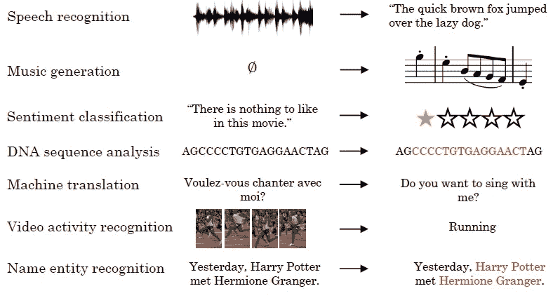

序列也存在于自然语言中，句子是单词的序列。自然语言处理模型需要上下文信息来理解下面句子中的主语( *he* )和直接宾语( *it* )。在提供顺序信息后，模型将理解句子中的主语(*乔的兄弟*)和直接宾语(*毛衣*)。

页（page 的缩写）Protopapas，CS109b，哈佛 FAS

# 为什么神经网络会在序列数据上失败？

在我们之前的文章[为什么深度学习有效](/why-deep-learning-works-289f17cab01a)中，我们展示了几个人工神经网络来预测农民在给定年份可能生产的收获量。这些模型不仅着眼于一年(如 2019 年)，而且同时着眼于一系列年份(如 2017 年、2018 年、2019 年)，从而提高预测能力。

如下图所示，给定三个连续值，模型将预测第四个值。第一个垂直列显示值的完整序列。下一列显示了预测结果的示例(蓝色)。

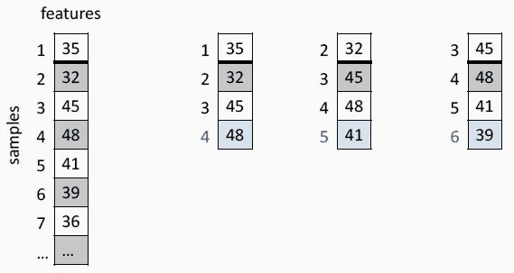

页（page 的缩写）Protopapas，CS109b，哈佛 FAS

这被称为重叠加窗数据集，因为我们对观测值加窗以创建新的。我们可以设想建立一个具有三层和 ReLU 激活函数的全连接神经网络，用于在给定三个连续数字时预测下一个数字。

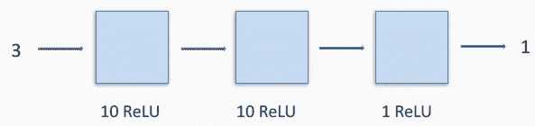

页（page 的缩写）Protopapas，CS109b，哈佛 FAS

这种方法有几个问题。如果我们重新排列输入序列，网络将预测同样的结果。完全连接的网络不会区分顺序，因此会丢失一些信息。

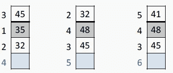

页（page 的缩写）Protopapas，CS109b，哈佛 FAS

此外，完全连接的网络需要固定的输入和输出大小。如果我们决定查看 5 个连续数字来进行预测，我们将不得不建立另一个模型。

全连接网络的另一个缺点是，它不能对多个地方的输入进行分类。例如，当网络被设计为预测 3 个值时，我们不能同时预测接下来的 4 个值。

> 输入的顺序很重要。对于大多数顺序数据来说都是如此。

# 记忆游戏

在上一节中，我们提出了使用上下文、历史和未来来进行更好预测的想法。怎样才能让一个神经网络记住？

我们可能都经历过在 [Pexeso](https://en.wikipedia.org/wiki/Concentration_(card_game)) 游戏中被孩子打败的经历，这是一个关于注意力和记忆力的游戏。

玩 Pexeso 时，目标是用尽可能少的走法找到所有相同的牌对。不知何故，孩子们非常擅长记忆。为什么我们不把这种同样的超人能力赋予人工神经网络中的一个神经元呢？

基本上，我们需要将神经元更新为一个新的计算单元，能够记住它以前看到的东西。我们将这称为单元的**状态**或**隐藏状态**或**内存**。

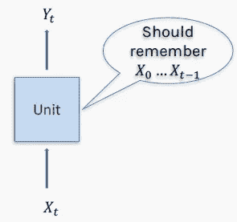

页（page 的缩写）Protopapas，CS109b，哈佛 FAS

如何建立一个能记住过去的单位？内存或状态可以被写到一个文件中，但是更好的是，我们把它保存在单元内部，在一个数组中或者在一个向量中。当单元读取输入时，它也读取存储器的内容。利用这两种信息，它做出预测，更重要的是，它更新记忆。

我们也可以在 Pexeso 游戏中找到这个原则。一个孩子会打开一张卡片，试着回忆以前打开过的配对卡片的位置，然后决定下一张打开哪张卡片。打开那张卡片后，如果不匹配，孩子会通过记录他刚刚发现的那对卡片的位置来更新他的记忆。在下一轮游戏中，孩子将重复这个过程，如下图所示。

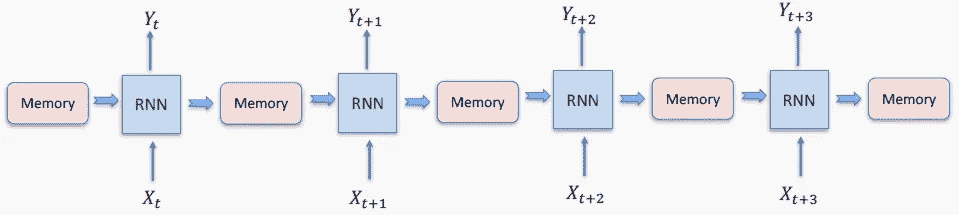

页（page 的缩写）Protopapas，CS109b，哈佛 FAS

# 循环单元

在数学中，当前值(事件或单词)对先前事件的依赖类型被称为递归，并使用递归方程来表示。

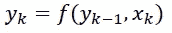

递归神经网络可以被认为是同一节点的多个副本，每个副本都向后继节点传递消息。表示上述递归关系的一种方法是使用下图。黑色的小方块表示所使用的状态是从以前的时间戳获得的，也就是以前的状态进入当前状态的循环。

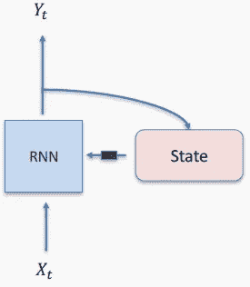

页（page 的缩写）Protopapas，CS109b，哈佛 FAS

每个单元有三组权重:一组用于输入𝒙(𝑡，另一组用于前一时间步的输出𝒚(𝑡–1，另一组用于当前时间步的输出𝒚(𝑡).这些权重就像我们在正常的人工神经网络中处理的任何其他权重一样，最终它们将由训练过程来确定。

下面的示意图显示了将 3 个数字转换成 4 个数字的装置内部。输入是一个 3 个数字的向量。隐藏状态或记忆是一个 5 个数字的向量。该单元将使用 5 个神经元(A1-5)的内部网络将输入转化为 5 个数字的向量，将其与当前状态相结合，并通过激活函数传递结果。由此产生的 5 个数字的向量将通过另一个由 5 个神经元(B1–5)组成的内部网络来产生新的状态。它将同时通过另一个由 4 个神经元(C1-4)组成的网络，产生一个 4 个数字的输出向量。

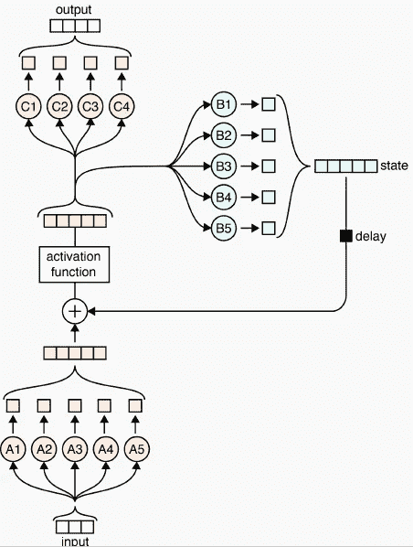

页（page 的缩写）Protopapas，CS109b，哈佛 FAS

通过将当前输入与先前状态相结合，并通过激活函数来传递，网络将不仅仅记住先前的输入。国家永远是一个已经被网络看到的事物的更大画面。

在 Pexeso 游戏中，孩子们不是记录桌子上卡片的(x，y)坐标，而是模糊地记得哪些卡片彼此相邻，哪些靠近中心，哪些在棋盘的左边，哪些有更多的颜色，等等。

类似地，一个单元不会只记住一个句子的最后 2 或 3 个单词，而是会找到要记住多少个单词和哪些单词，尤其是这些单词的哪个表示，以便实现最佳预测。

这是一个非常简单的例子，说明了我们人类是如何选择记住一些事情(例如我们的妈妈纪念日)和忘记另一些事情(我们的老板纪念日)的。

# 穿越时间的反向传播

在我们之前的例子中，整个单元将在训练期间学习 5+5+4=14 个权重和 14 个偏差。我们如何找到这些重量？典型的梯度下降和反向传播在这里也适用吗？

现在来点难看的数学。首先，我们称 *V* 为应用于输入的权重， *U* 为应用于状态的权重， *W* 为应用于输出的权重。姑且称 *h* 为状态。我们有两个激活函数， *g_h* 作为隐藏状态的激活， *𝑔_y* 作为输出的激活。

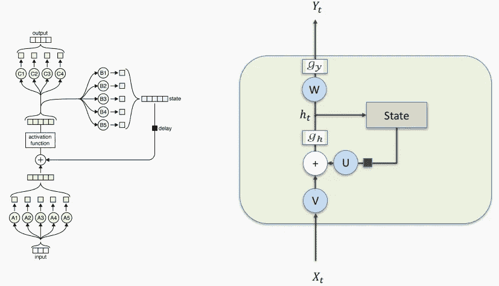

页（page 的缩写）Protopapas，CS109b，哈佛 FAS

递归单元由以下两个等式完美描述，其中 *b* 和*b’*分别表示输出神经元和状态神经元中的偏差。

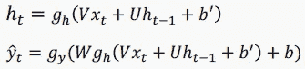

为了通过应用随机梯度下降找到权重，正如我们在[另一篇文章](/why-deep-learning-works-289f17cab01a)中所述，我们需要计算损失函数及其对权重的导数。

下面你可以看到这是如何为输出权重 *W* 完成的。整个网络的损耗是以循环单位表示的单个损耗的总和。

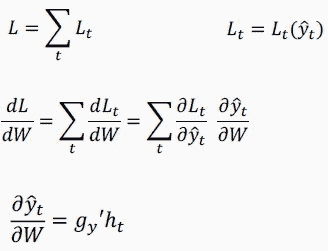

类似地，我们可以如下计算损失函数相对于状态权重 *U* 的导数。

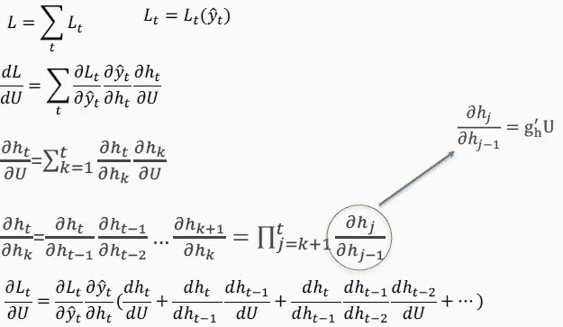

还不算太糟。我们现在知道如何训练一个递归神经网络。但是有一个问题。

在上面突出显示的损失函数中，你可以看到一个巨大的数字乘积。已知产生的量变得非常大或非常小，导致**爆炸或消失梯度**。

梯度可能会超过最小值，并撤消许多已经完成的工作。因此，通常的做法是将梯度裁剪在可接受的区间内，并选择不允许梯度过小的激活函数。

实际上，由于这个问题，rnn 不能学习长依赖关系，正如我们将在我们的[对真实世界客户评论分类的实际实验](/sentiment-analysis-a-benchmark-903279cab44a)中所展示的。如果你想用 Python 从零开始实现你自己的 RNN，查看 Victor Zhou 的这篇优秀文章。

# 递归神经网络如何处理序列数据？

现在，我们知道了单个循环单元是如何工作的。通过一个接一个地链接几个单元，我们能够处理一系列的输入。

下面，我们将说明递归神经网络如何获取一系列观察结果并预测是否会下雨。

在时间 *t* 时，网络出现“狗叫声”信息，其存储器为空。因此，预测有 0.3 的可能性会下雨。该网络在其存储器中存储“狗叫声”的表示，用于下一步。

在时间 *t+1* ，它接收到新的信息‘白衬衫’，这将下雨的可能性降低到 0.1。现在记忆中有了“狗叫声”和“白衬衫”的代表。

接下来，在时间 *t+2* ，网络接收“苹果派”作为信息。这不会改变它的预测，但是通过推出“白衬衫”来更新记忆。

在时间 *t+3* 时，输入“膝盖疼”将预测值增加到 0.6，并覆盖存储器中的“苹果派”。序列的最终输入是‘get dark’，将最终预测推至 0.9。

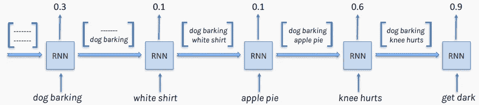

页（page 的缩写）Protopapas，CS109b，哈佛 FAS

这个例子直观地说明了当从输入序列中学习时，网络是如何有意识地在记忆中保持和忘记某些信息的。这是一个典型的多对一场景。

在下面描述的不同风格中也发现了递归神经网络。多对多体系结构通常用于将文本从一种语言翻译成另一种语言。

[来源](http://karpathy.github.io/2015/05/21/rnn-effectiveness/)

# 结论

在本文中，我们展示了神经网络如何处理序列数据。如果您有兴趣了解如何实现递归神经网络，并对全连接神经网络或卷积神经网络进行基准测试，请通读我们下面的下一篇文章。包括实际操作的 Python 代码。

 [## 情感分析:一个基准

### 递归神经网络解释。使用 FCNNs、CNN、RNNs 和嵌入对客户评论进行分类。

towardsdatascience.com](/sentiment-analysis-a-benchmark-903279cab44a) 

感谢阅读。