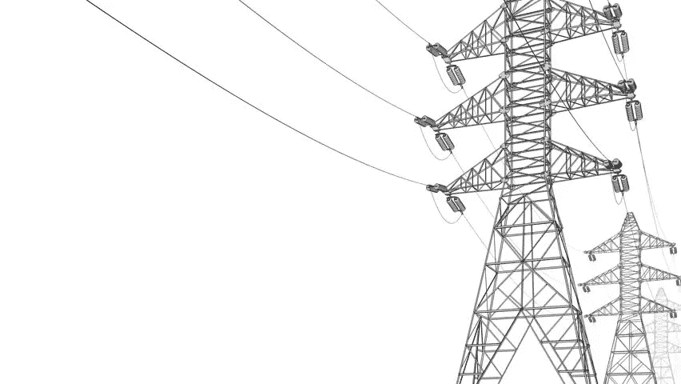
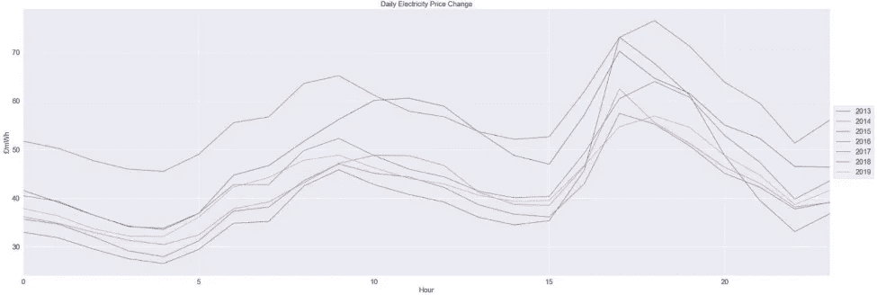
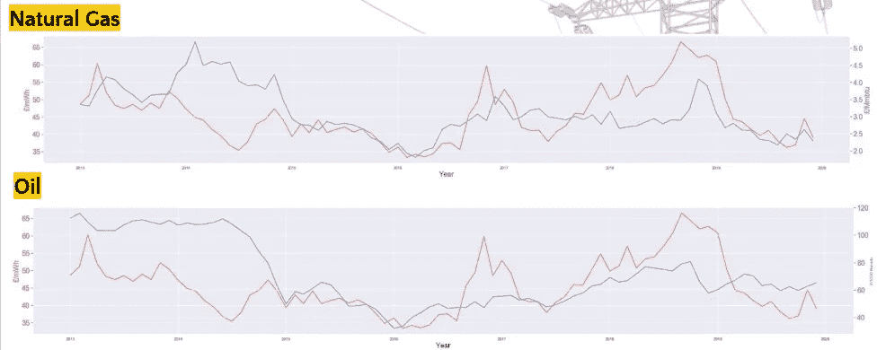
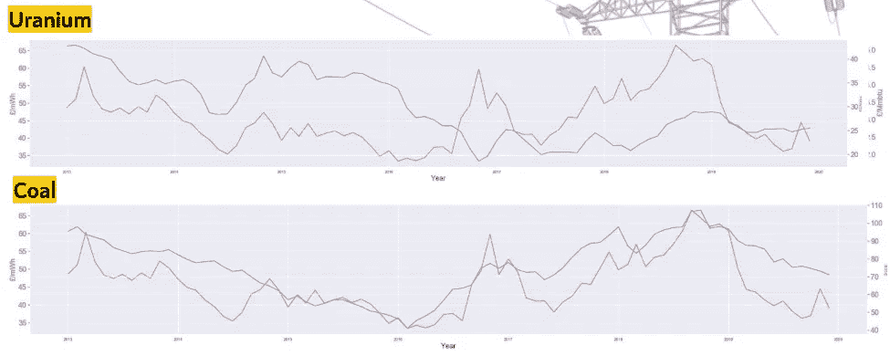
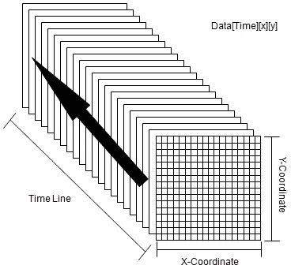
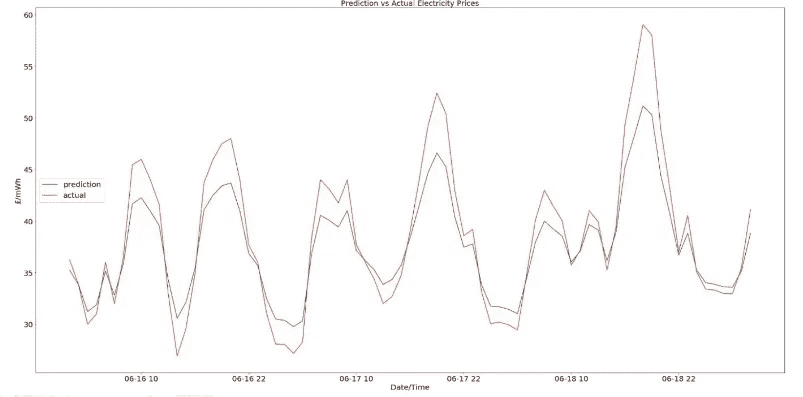
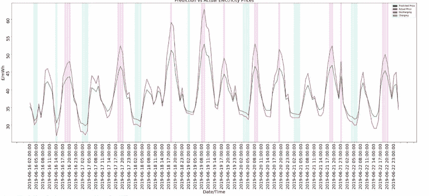

# 电价预测的递归神经网络

> 原文：<https://towardsdatascience.com/recurrent-neural-networks-for-electricity-price-prediction-a26f8411ea44?source=collection_archive---------29----------------------->

## 具有外生变量的时间序列分析

*用于预测这些价格的最终模型可以找到(* [*此处*](https://github.com/Carterbouley/ElectricityPricePrediction/blob/master/multivariate_LSTM_electricity.ipynb) *)*

*(f*[*full GitHub 库*](https://github.com/Carterbouley/ElectricityPricePrediction) *)*



# 什么是需求灵活性？

需求灵活性可以描述为电力终端用户(包括企业和家庭)根据市场信号(如随时间变化的电价)改变其电力消费模式的能力。



电价遵循每日、每周和季节性模式。上面我们可以看到日线模式。早上，每个人醒来，打开所有设备，价格上涨。随着人们去工作，需求和价格下降(太阳能发电开始上网)。下午 5 点左右，人们开始离开办公室，回家，打开电视，洗衣服等，价格再次上涨，直到就寝时间，价格下降。这个循环然后重复。

鉴于电价和碳排放的相关性(见我之前的博客)，如果我们能把人们从高峰时间转移到非高峰时间，我们就能节省成本和碳排放。

*没有多少公司向他们的客户提供提前一天的价格，但是* [*章鱼能源公司的灵活关税*](https://octopus.energy/agile/) *正是这样做的。*

然而，首先，对价格的准确预测将是有用的。

# 外变量

通常当进行特征工程时，我们需要确保我们的输入确实有助于(而不是阻碍)模型。幸运的是，神经网络非常善于辨别什么是有益的，什么是无益的，所以我们可以非常慷慨。

电力生产的投入可能对决定价格很有帮助。以下是 2013 年至 2019 年的数据图。



随着时间的推移，每个输入似乎都与电价有某种关联。

最重要的是，考虑到季节变化，包括温度数据是有帮助的。由于空调需求，夏季可能会有更高的价格。

所有这些数据必须来自不同的来源。我用 Nordpools 的提前一天市场来获取价格数据，用 DarkSky API 来获取温度数据，用 Investing.com 来获取商品数据。(这个都可以在这里找到[。)](https://github.com/Carterbouley/ElectricityPricePrediction/tree/master/data)

# 时间序列分析的整形

现在，经过一些清理，我有了一个完整的数据帧([这里](https://github.com/Carterbouley/ElectricityPricePrediction/blob/master/re_fixed_multivariate_timeseires.csv))。

因为我正在执行时间序列分析，而我试图预测的变量也在预测中使用，所以我需要将数据重塑为监督学习问题。

```
data = df.valuesn_steps = 168series_reshaped =  np.array([data[i:i + (n_steps+24)].copy() **for** i **in** range(len(data) - (n_steps+24))])series_reshaped.shape(61134, 192, 6)
```

取数据帧的值(在对神经网络进行缩放之后),我定义它可以看到 168 个向后的时间步长(1 周),我希望它可以预测未来 24 小时。

它在数据框上创建了一个窗口，这样我就有了一个 192 行 X 6 列的矩阵。此窗口向下移动原始数据框“行我的行”,每小时创建一个新矩阵。如果 2013 年 1 月 1 日中午是第一个矩阵的第一行，那么下午 1 点将是第二个矩阵的第一行。

像这样增加维度将允许神经网络理解时间到来的顺序很重要。



既然数据是这种格式，我将它拆分，这样我们就有了 168 小时(1 周)的输入数据块，对于每 168 小时块，我们有 24 小时的价格输出，所以我们的模型可以“看到”接下来的 24 小时。这将数据转化为监督学习问题。

```
X_train = series_reshaped[:43800, :n_steps] 
X_valid = series_reshaped[43800:52560, :n_steps] 
X_test = series_reshaped[52560:, :n_steps] 
Y = np.empty((61134, n_steps, 24))  
**for** step_ahead **in** range(1, 24 + 1):     
   Y[..., step_ahead - 1] =   series_reshaped[..., step_ahead:step_ahead + n_steps, 0]

Y_train = Y[:43800] 
Y_valid = Y[43800:52560] 
Y_test = Y[52560:]
```

现在 X 训练数据是所有商品过去的 168 小时，而 Y 训练数据是未来 24 小时的价格。

# 训练模型

将数据格式化后输入神经网络，只需要尝试不同的格式。

在尝试了 LSTM 的、GRU 的卷积层以及经典的机器学习(回归树和 ARIMA 预测)之后，一个递归神经网络提供了最好的结果。

```
np.random.seed(42)
tf.random.set_seed(42)

model6 = keras.models.Sequential([
    keras.layers.SimpleRNN(20, return_sequences=**True**, input_shape=[**None**, 6]),
    keras.layers.SimpleRNN(20, return_sequences=**True**),
    keras.layers.TimeDistributed(keras.layers.Dense(24))
])

model6.compile(loss="mape", optimizer="adam")
history = model6.fit(X_train, Y_train, epochs=20,
                    validation_data=(X_valid, Y_valid))
```

这里有两个重要的事情需要了解，对于那些更喜欢技术方面的人来说，那就是 return_sequences=True，以及最终的时间分布层 24。第一个确保数据在网络中保持相同的多维(时间序列)格式，第二个是它以相同的结构每小时输出未来 24 小时的数据。

对于预测，我只关心最后的 24 小时，因为一个小时后，将有一个新的输入，这将产生下一个小时的预测。

在 2013 年至 2018 年对模型进行训练后，我用 2019 年来评估模型在看不见的数据上的工作情况。随机选择几天，这样你就能真正看到效果，这是相当准确的。



# 使用案例

鉴于该模型现在可以提前 24 小时预测电价，我们现在可以调整我们的用电量，使其远离那些高峰时段。这可能意味着设置我们的烘干机和电器在我们睡觉时运行，甚至投资智能插头来自动化我们的循环设备(如冰箱和空调)。

为了简单起见，我模拟了一个家用电池。它大致基于特斯拉 Powerwall 2，容量为 14KW，功率为 5 KW。为简单起见，这意味着它可以容纳近 3 个小时的电荷。它查看模型的 24 小时预测，并选择 3 个最便宜的充电时间和 3 个最贵的放电时间。



然而，你不太可能以这些日前价格将电力卖回给电网，我模拟的估值指标正是如此。在 2019 年的过程中，这种电池将花费 151.02 英镑用于充电，并从出售给电网中“赚取”280.23 英镑，从而获得 85.5%的投资回报率。考虑到这是一个相当初级的电池模型，这是一个不错的结果。

还不错，但是钱也不多。当我们开始考虑灵活需求的真正潜在规模时，真正有趣的场景出现了，事实是，有成千上万个巨大的 1MW +空调机组可以做到这一点，既减少了碳排放，又节省了大量成本。