# 递归神经网络—第一部分

> 原文：<https://towardsdatascience.com/recurrent-neural-networks-part-1-498230290534?source=collection_archive---------57----------------------->

## [FAU 讲座笔记](https://towardsdatascience.com/tagged/fau-lecture-notes)关于深度学习

## 埃尔曼细胞

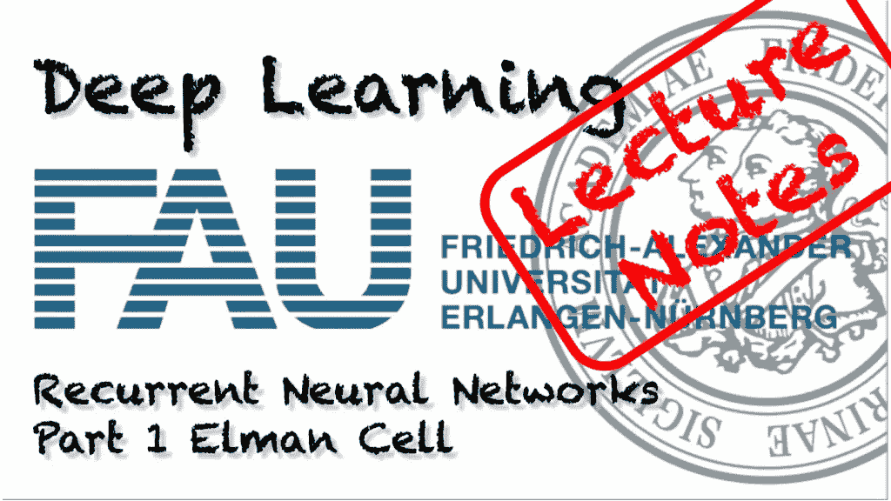

FAU 大学的深度学习。下图 [CC BY 4.0](https://creativecommons.org/licenses/by/4.0/) 来自[深度学习讲座](https://www.youtube.com/watch?v=p-_Stl0t3kU&list=PLpOGQvPCDQzvgpD3S0vTy7bJe2pf_yJFj&index=1)

**这些是 FAU 的 YouTube 讲座** [**深度学习**](https://www.youtube.com/watch?v=p-_Stl0t3kU&list=PLpOGQvPCDQzvgpD3S0vTy7bJe2pf_yJFj&index=1) **的讲义。这是与幻灯片匹配的讲座视频&的完整抄本。我们希望，你喜欢这个视频一样多。当然，这份抄本是用深度学习技术在很大程度上自动创建的，只进行了少量的手动修改。如果你发现了错误，请告诉我们！**

# 航行

[**上一讲**](/architectures-part-5-7224dd8fcf39) **/** [**观看本视频**](https://youtu.be/0ZErqh2kE4w) **/** [**顶级**](/all-you-want-to-know-about-deep-learning-8d68dcffc258) **/** [**下一讲**](/recurrent-neural-networks-part-2-5f45c1c612c4)

欢迎大家来到深度学习的新一期。今天我们想研究顺序学习，特别是递归神经网络。到目前为止，我们只有简单的前馈网络，其中我们基本上有固定大小的输入，然后将生成分类结果，如“猫”、“狗”或“仓鼠”。

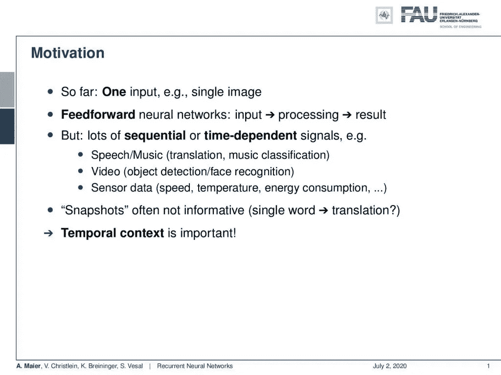

背景知识在许多分类问题中是相关的。 [CC 下的图片来自](https://creativecommons.org/licenses/by/4.0/)[深度学习讲座](https://www.youtube.com/watch?v=p-_Stl0t3kU&list=PLpOGQvPCDQzvgpD3S0vTy7bJe2pf_yJFj&index=1)的 4.0 。

如果我们有像音频、语音、语言或视频这样的具有时间背景的序列，那么我们目前看到的技术并不是很适合。所以，我们现在感兴趣的是寻找适用于很长输入序列的方法。递归神经网络(RNNs)正是实际做到这一点的一种方法。在对动机进行第一次回顾之后，我们将继续研究简单的递归神经网络。然后，我们将介绍著名的长短期记忆单位，然后是门控循环单位。之后，我们将比较这些不同的技术，并讨论一下优缺点。最后，我们将讨论我们的 rnn 的采样策略。当然，这对于一个视频来说太多了。所以，我们会在个别短视频中，针对不同的话题进行讨论。所以，我们来看动机。好吧，我们有一个针对单个图像的输入，但对于语音、音乐、视频或其他传感器数据等时序或时间相关信号来说，这就不太好了。你甚至可以谈论测量能量消耗的非常简单的传感器。因此，固定长度的快照通常信息不多。如果你只看一个单词，你可能很难得到正确的翻译，因为上下文很重要。时间上下文非常重要，需要适当地建模。

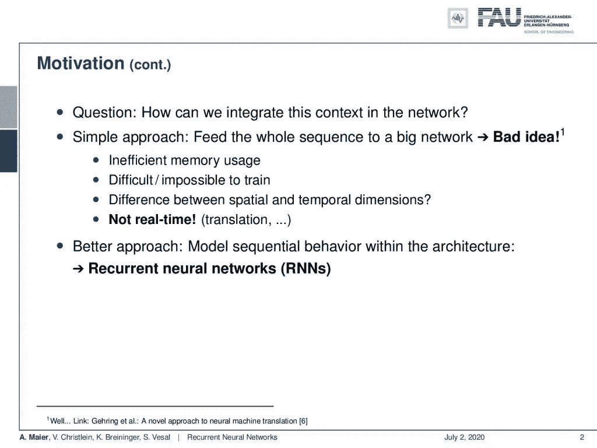

递归神经网络能够以不同于时间维度的方式对空间维度进行建模。 [CC 下的图片来自](https://creativecommons.org/licenses/by/4.0/)[深度学习讲座](https://www.youtube.com/watch?v=p-_Stl0t3kU&list=PLpOGQvPCDQzvgpD3S0vTy7bJe2pf_yJFj&index=1)的 4.0 。

现在的问题是:“我们如何将这种背景融入网络？”简单的方法是将整个序列输入一个大网络。这可能是个坏主意，因为我们的内存使用效率很低。这很难训练，甚至不可能训练，我们永远也搞不清楚空间和时间维度之间的区别。我们会照样处理。实际上，也许这不是一个坏主意。对于相当简单的任务，正如你在[6]中看到的，因为他们实际上调查了这一点，并用 CNN 发现了相当令人惊讶的结果。当然，你的一个问题是它不是实时的，因为你需要整个序列来处理。因此，我们在本视频和接下来的几个视频中建议的方法是对架构内的顺序行为进行建模，从而产生递归神经网络。

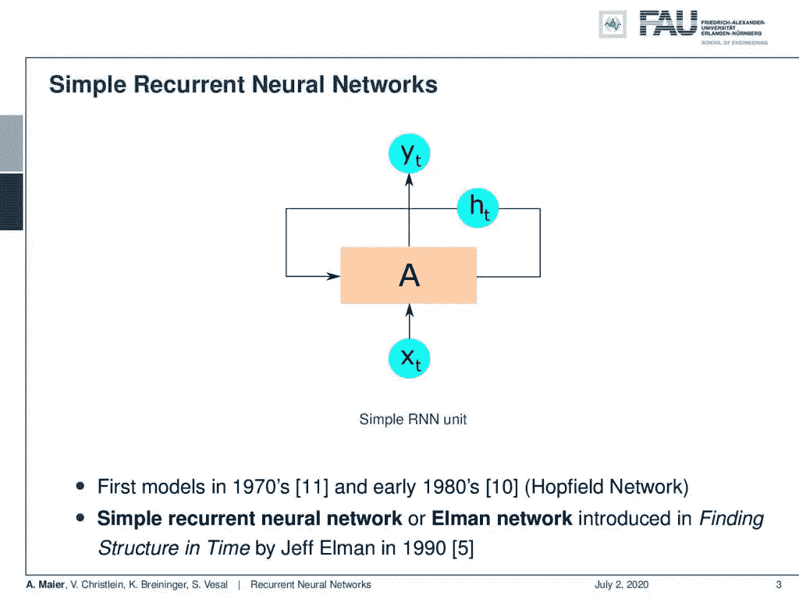

经典埃尔曼单元草图。 [CC 下的图片来自](https://creativecommons.org/licenses/by/4.0/)[深度学习讲座](https://www.youtube.com/watch?v=p-_Stl0t3kU&list=PLpOGQvPCDQzvgpD3S0vTy7bJe2pf_yJFj&index=1)的 4.0 。

所以让我们来看看简单的递归神经网络。主要的想法是，你引入一个隐藏状态 **h** 下标 t，它会持续一段时间。所以这是可以改变的，但它本质上是连接回原始细胞 A。所以，A 是我们的循环细胞，它有这种隐藏状态，以某种方式允许我们编码当前时间信息带给我们的东西。现在，我们有一些输入 x 下标 t，这将产生一些输出 y 下标 t，顺便说一下，第一个模型来自 20 世纪 70 年代和 80 年代初，像 Hopfield 网络。这里，我们将坚持使用简单的递归神经网络或 Elman 网络，如[5]中所介绍的。

递归网络和前馈网络的比较。 [CC 下的图片来自](https://creativecommons.org/licenses/by/4.0/)[深度学习讲座](https://www.youtube.com/watch?v=p-_Stl0t3kU&list=PLpOGQvPCDQzvgpD3S0vTy7bJe2pf_yJFj&index=1)的 4.0 。

现在，前馈网络只前馈信息。相比之下，有了循环网络，我们现在可以模拟循环，我们可以模拟记忆和经验，我们可以学习顺序关系。因此，随着数据的到来，我们可以提供连续的预测。这使我们能够实时处理一切。

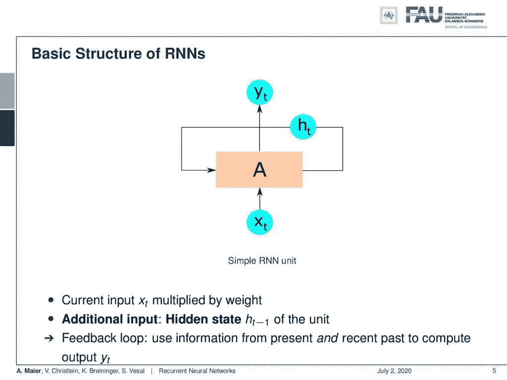

在 RNN 建筑中，隐藏状态随着时间而变化。来自[深度学习讲座](https://www.youtube.com/watch?v=p-_Stl0t3kU&list=PLpOGQvPCDQzvgpD3S0vTy7bJe2pf_yJFj&index=1)的 4.0CC 下的图片。

现在，这又是我们的基本递归神经网络，其中我们有一些输入 **x** 乘以一些权重。然后，我们有了额外的输入，来自先前配置的隐藏状态，我们本质上有了一个反馈回路，在那里你使用来自现在和最近过去的信息。

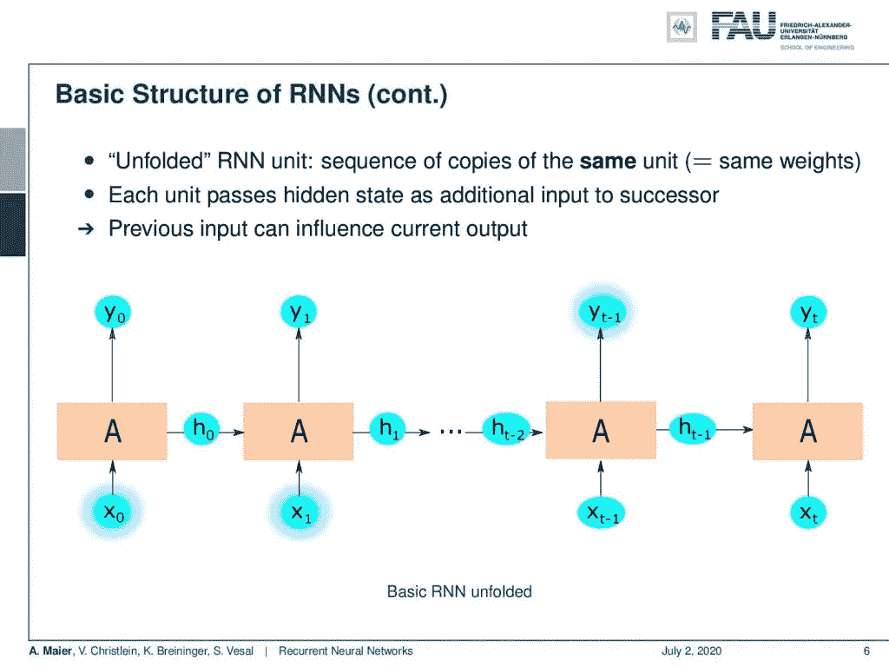

在输入序列上展开或展开网络是理解网络解码和训练的关键。 [CC 下的图片来自](https://creativecommons.org/licenses/by/4.0/)[深度学习讲座](https://www.youtube.com/watch?v=p-_Stl0t3kU&list=PLpOGQvPCDQzvgpD3S0vTy7bJe2pf_yJFj&index=1)的 4.0 。

为了计算输出 y 下标 t，我们最终得到一个展开的结构。所以，如果你想评估循环单元，你要做的是从你的单元处理的一些 **x** ₀开始。这产生了新的结果 y₀和新的隐藏状态₀.现在， **h** ₀被前馈到下一个实例，在那里实质上是权重被耦合。所以在下一个时间状态，我们有相同单元的完全相同的副本，但是当然，h 是不同的。所以现在，我们馈入 **x** ₁过程产生 y₁并产生一个新的隐藏态 **h** ₁等等。我们可以这样做，直到我们在序列的末尾，这样每个单元将隐藏状态作为附加输入传递给后继单元。这意味着先前的输入可以对当前的输出产生影响，因为如果我们已经看到了 **x** ₀和 **x** ₁，它们可以对 y 下标(t-1)产生影响，只是因为我们已经对我们在隐藏状态中观察到的 **x** ₀和 **x** ₁的信息进行了编码。因此，隐藏状态允许我们存储信息，并通过整个网络将信息传递到某个时间段，然后我们想选择特定的行动。

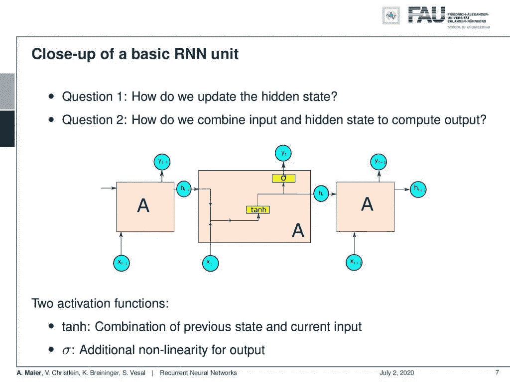

我们如何更新状态，如何计算输出？ [CC 下的图片来自](https://creativecommons.org/licenses/by/4.0/)[深度学习讲座](https://www.youtube.com/watch?v=p-_Stl0t3kU&list=PLpOGQvPCDQzvgpD3S0vTy7bJe2pf_yJFj&index=1)的 4.0 。

所以现在，基本问题是“我们如何更新隐藏状态？”第二个问题是“我们如何结合输入和隐藏状态来计算输出？”所以，我们打开牢房往里面看。你在这里看到的是，我们本质上把隐藏状态和新输入连接起来，然后把它输入非线性，这里是双曲正切。这产生了一个新的状态，从这个新的状态，我们用一个 sigmoid 函数产生新的输出。然后，我们将新的隐藏状态传递给同一个单元格的下一个实例。因此，我们有两个激活函数:用于组合先前状态和当前状态的双曲正切函数和用于产生输出的 sigmoid 非线性函数。

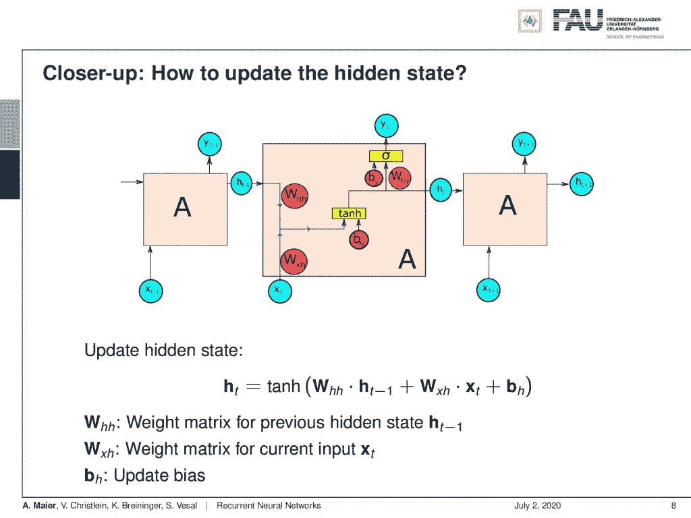

更新状态方程。 [CC 下的图片来自](https://creativecommons.org/licenses/by/4.0/)[深度学习讲座](https://www.youtube.com/watch?v=p-_Stl0t3kU&list=PLpOGQvPCDQzvgpD3S0vTy7bJe2pf_yJFj&index=1)的 4.0 。

当然，为了做到这一点，我们需要权重矩阵，这些权重矩阵在这里用红色表示。如果我们想要更新隐藏状态，我们可以更详细地查看它们。这实质上是隐藏状态转移矩阵 **W** 下标 hh 乘以最后一个隐藏状态加上隐藏状态转换矩阵的输入 **W** 下标 xh 乘以 **x** 下标 t 加上偏差。这然后被馈送到非线性，然后产生新的隐藏状态。

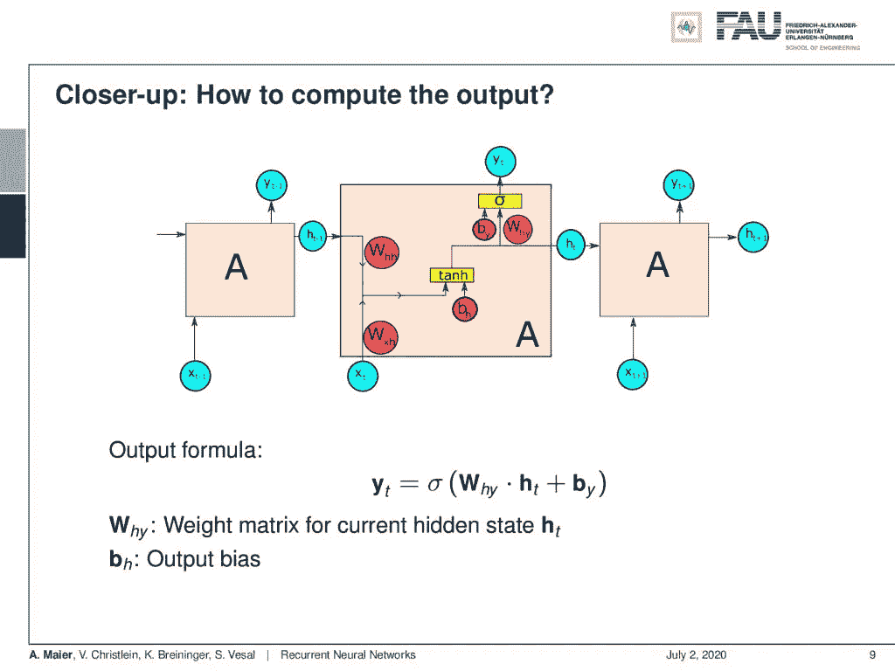

产生输出的方程式。 [CC 下的图片来自](https://creativecommons.org/licenses/by/4.0/)[深度学习讲座](https://www.youtube.com/watch?v=p-_Stl0t3kU&list=PLpOGQvPCDQzvgpD3S0vTy7bJe2pf_yJFj&index=1)的 4.0 。

好，那么我们如何计算输出呢？我们产生了一个新的隐藏状态，这意味着我们现在有了另一个转移矩阵，从隐藏状态产生一个初步输出。因此，我们有了这个新的 **W** 下标 hy，它接受 **h** 下标 t 和一些偏置，并将其提供给 sigmoid 函数以产生最终输出。

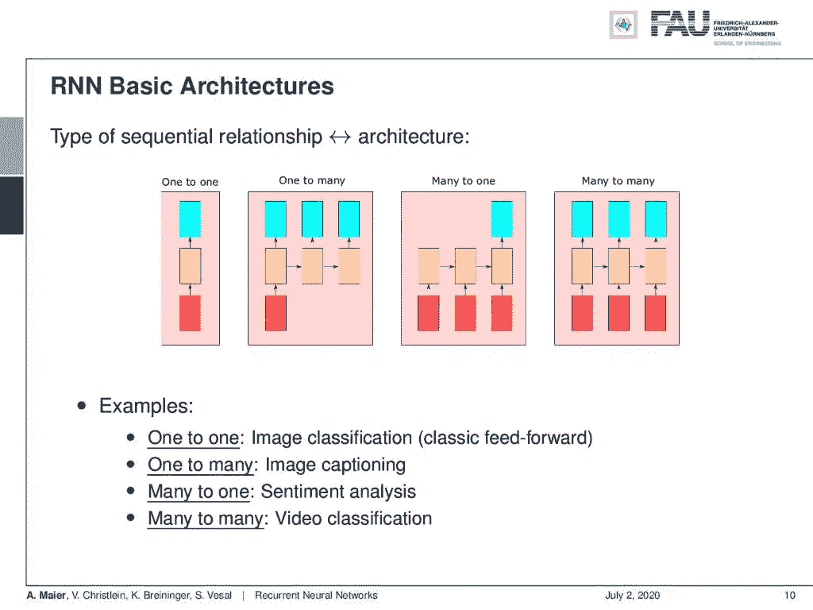

RNNs 有多种输入和输出选择。 [CC 下的图片来自](https://creativecommons.org/licenses/by/4.0/)[深度学习讲座](https://www.youtube.com/watch?v=p-_Stl0t3kU&list=PLpOGQvPCDQzvgpD3S0vTy7bJe2pf_yJFj&index=1)的 4.0 。

如果我们坚持这种架构，我们就可以实现许多不同类型的架构。这是由架构的设置决定的。因此，我们可以进行一对一的映射，我们有一个输入单元和一个输出单元，但你也可以做一个太多，多对一，或者你甚至可以做许多。一对一的例子是图像分类。本质上是经典的前馈。一对多是图像字幕。多对一是情绪分析，你需要观察一个特定的序列，以便找出在这种情况下是什么情绪。多对多是视频分类。

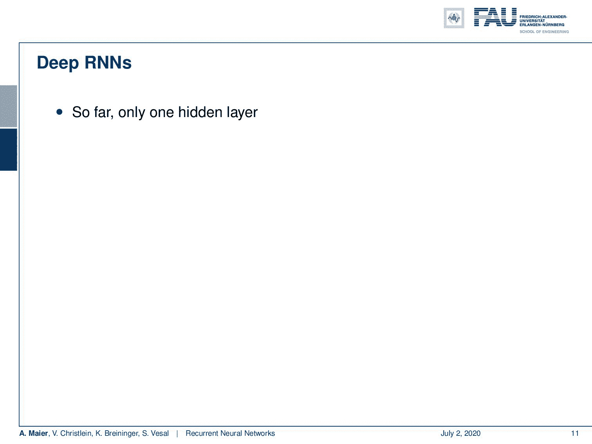

深度 RNNs 可能吗？ [CC 下的图片来自](https://creativecommons.org/licenses/by/4.0/)[深度学习讲座](https://www.youtube.com/watch?v=p-_Stl0t3kU&list=PLpOGQvPCDQzvgpD3S0vTy7bJe2pf_yJFj&index=1)的 4.0 。

当然，我们也可以思考深层 RNNS。到目前为止，我们只有一个隐藏层，我们可以只使用我们的循环模型，这就是为什么我们需要更深入。在这种情况下，它更像是“哟，老兄，我听说你喜欢 RNNs，所以我把 RNN 放在你的 RNN RNN 上。”

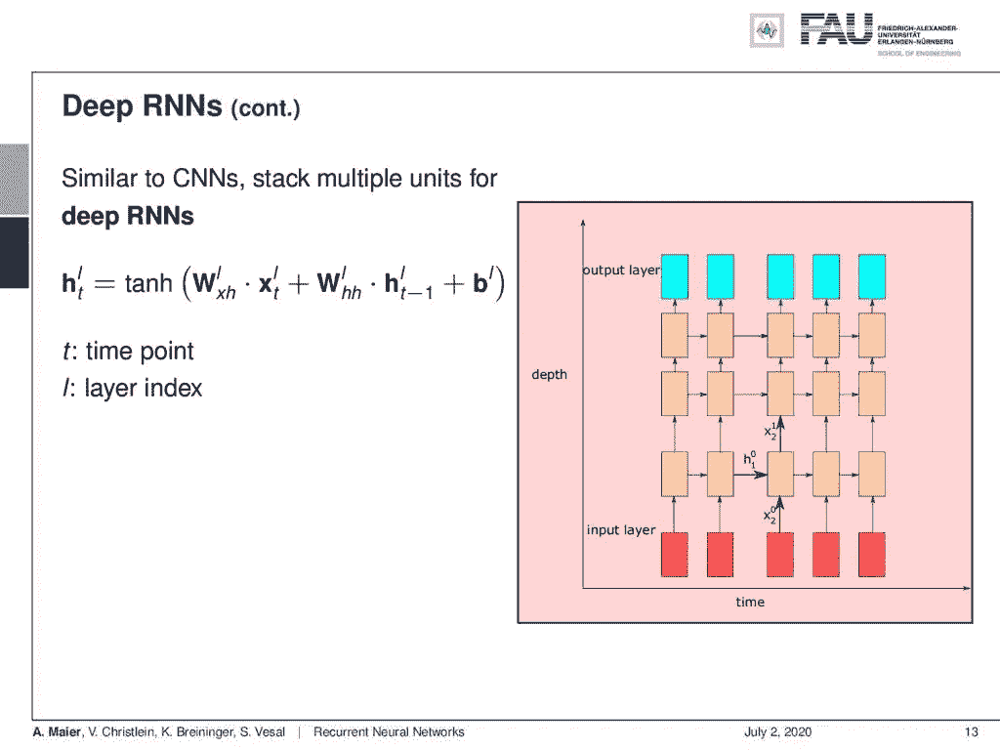

深度 RNN 的一个例子。来自[深度学习讲座](https://www.youtube.com/watch?v=p-_Stl0t3kU&list=PLpOGQvPCDQzvgpD3S0vTy7bJe2pf_yJFj&index=1)的 [CC BY 4.0](https://creativecommons.org/licenses/by/4.0/) 下的图片。

由此产生了像这样的建筑。对于深度 rnn，我们简单地堆叠多个隐藏单元。所以，我们当然可以把 Elman 细胞堆叠在 Elman 细胞上。然后，我们将使用输入随时间进行解码，使用多个 RNN 单元进行解码，并随时间产生多个输出。所以，这给了我们接触深层元素的机会。

在这个深度学习讲座中，更多令人兴奋的事情即将到来。 [CC 下的图片来自](https://creativecommons.org/licenses/by/4.0/)[深度学习讲座](https://www.youtube.com/watch?v=p-_Stl0t3kU&list=PLpOGQvPCDQzvgpD3S0vTy7bJe2pf_yJFj&index=1)的 4.0 。

好的。所以，这是对深度 RNNs 和递归神经网络的简单介绍。在下一个视频中，我们想更详细地了解一下训练是如何完成的，以及为了执行训练而实际更新的等式。所以，我希望你喜欢这个视频，并看到你在下一个！

如果你喜欢这篇文章，你可以在这里找到更多的文章，或者看看我们的讲座。如果你想在未来了解更多的文章、视频和研究，我也会很感激关注 [YouTube](https://www.youtube.com/c/AndreasMaierTV) 、 [Twitter](https://twitter.com/maier_ak) 、[脸书](https://www.facebook.com/andreas.maier.31337)或 [LinkedIn](https://www.linkedin.com/in/andreas-maier-a6870b1a6/) 。本文以 [Creative Commons 4.0 归属许可](https://creativecommons.org/licenses/by/4.0/deed.de)发布，如果引用，可以转载和修改。

# RNN 民间音乐

[FolkRNN.org](https://folkrnn.org/competition/)
[MachineFolkSession.com](https://themachinefolksession.org/tunes/)
[玻璃球亨利评论 14128](https://github.com/IraKorshunova/folk-rnn/blob/master/soundexamples/successes/The%20Glas%20Herry%20Comment%2014128.mp3)

# 链接

[人物 RNNs](http://karpathy.github.io/2015/05/21/rnn-effectiveness/)
[CNN 用于机器翻译](https://engineering.fb.com/ml-applications/a-novel-approach-to-neural-machine-translation/)
[用 RNNs 作曲](http://www.hexahedria.com/2015/08/03/composing-music-with-recurrent-neural-networks/)

# 参考

[1] Dzmitry Bahdanau、Kyunghyun Cho 和 Yoshua Bengio。“通过联合学习对齐和翻译的神经机器翻译”。载于:CoRR abs/1409.0473 (2014 年)。arXiv: 1409.0473。Yoshua Bengio，Patrice Simard 和 Paolo Frasconi。“学习具有梯度下降的长期依赖性是困难的”。摘自:IEEE 神经网络汇刊 5.2 (1994)，第 157-166 页。
[3]钟俊英，卡格拉尔·古尔希雷，赵京云等，“门控递归神经网络序列建模的实证评估”。载于:arXiv 预印本 arXiv:1412.3555 (2014 年)。
[4]道格拉斯·埃克和于尔根·施密德胡伯。“学习蓝调音乐的长期结构”。《人工神经网络——ICANN 2002》。柏林，海德堡:施普林格柏林海德堡出版社，2002 年，第 284-289 页。
【5】杰弗里·L·埃尔曼。“及时发现结构”。摘自:认知科学 14.2 (1990)，第 179-211 页。
[6] Jonas Gehring，Michael Auli，David Grangier，等，“卷积序列到序列学习”。载于:CoRR abs/1705.03122 (2017 年)。arXiv: 1705.03122。亚历克斯·格雷夫斯、格雷格·韦恩和伊沃·达尼埃尔卡。《神经图灵机》。载于:CoRR abs/1410.5401 (2014 年)。arXiv: 1410.5401。
【8】凯罗尔·格雷戈尔，伊沃·达尼埃尔卡，阿历克斯·格雷夫斯等，“绘制:用于图像生成的递归神经网络”。载于:第 32 届机器学习国际会议论文集。第 37 卷。机器学习研究论文集。法国里尔:PMLR，2015 年 7 月，第 1462-1471 页。
[9]赵京贤、巴特·范·梅林波尔、卡格拉尔·古尔切雷等人，“使用 RNN 编码器-解码器学习统计机器翻译的短语表示”。载于:arXiv 预印本 arXiv:1406.1078 (2014 年)。
【10】J J 霍普菲尔德。“具有突发集体计算能力的神经网络和物理系统”。摘自:美国国家科学院院刊 79.8 (1982)，第 2554-2558 页。eprint:[http://www.pnas.org/content/79/8/2554.full.pdf.](http://www.pnas.org/content/79/8/2554.full.pdf.)T11【11】w . a . Little。“大脑中持久状态的存在”。摘自:数学生物科学 19.1 (1974)，第 101-120 页。
[12]赛普·霍克雷特和于尔根·施密德胡贝尔。“长短期记忆”。摘自:神经计算 9.8 (1997)，第 1735-1780 页。
[13] Volodymyr Mnih，Nicolas Heess，Alex Graves 等，“视觉注意的循环模型”。载于:CoRR abs/1406.6247 (2014 年)。arXiv: 1406.6247。
[14]鲍勃·斯特姆、若昂·费利佩·桑托斯和伊琳娜·科尔舒诺娃。“通过具有长短期记忆单元的递归神经网络进行民间音乐风格建模”。英语。In:第 16 届国际音乐信息检索学会会议，晚破，西班牙马拉加，2015，p. 2。
[15] Sainbayar Sukhbaatar，Arthur Szlam，Jason Weston 等著《端到端存储网络》。载于:CoRR abs/1503.08895 (2015 年)。arXiv: 1503.08895。
【16】彼得·m·托德。“算法合成的连接主义方法”。在:13(1989 年 12 月)。
【17】伊利亚·苏茨基弗。“训练递归神经网络”。安大略省多伦多市多伦多大学。，加拿大(2013)。
【18】安德烈·卡帕西。“递归神经网络的不合理的有效性”。载于:安德烈·卡帕西博客(2015)。
贾森·韦斯顿、苏米特·乔普拉和安托万·博尔德斯。“记忆网络”。载于:CoRR abs/1410.3916 (2014 年)。arXiv: 1410.3916。