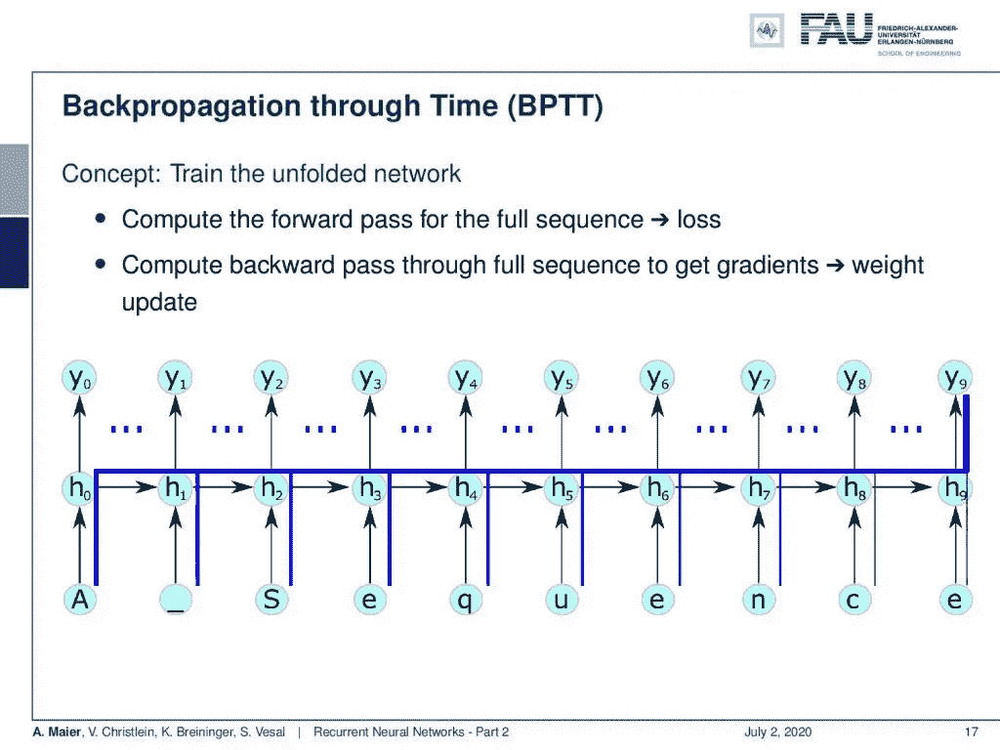
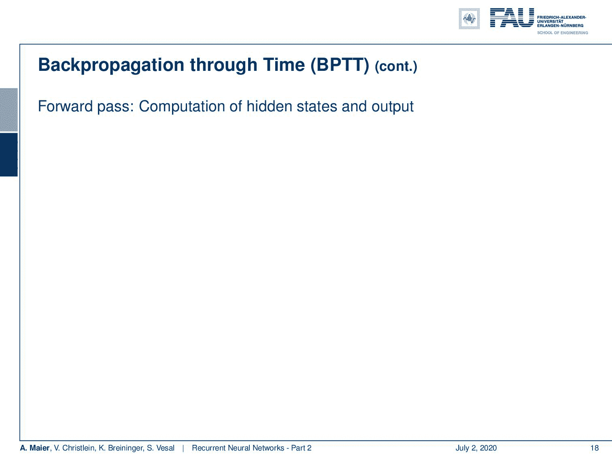
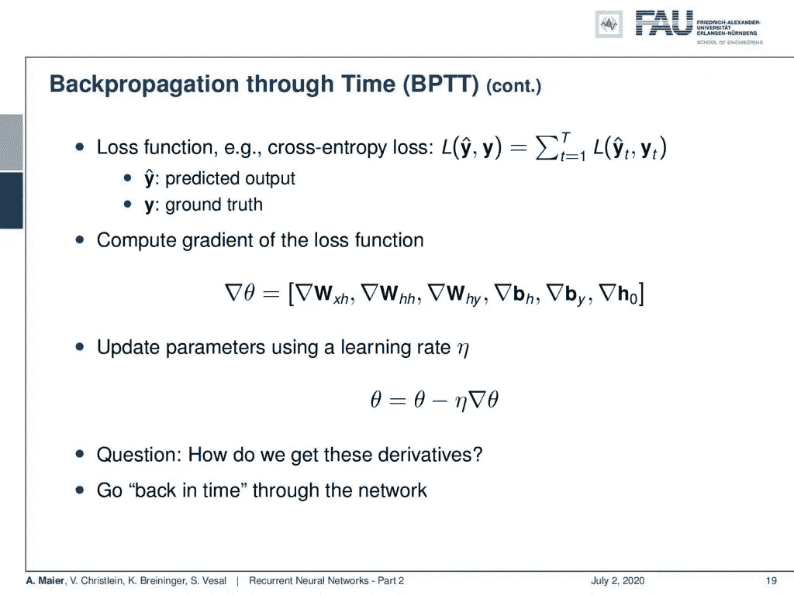
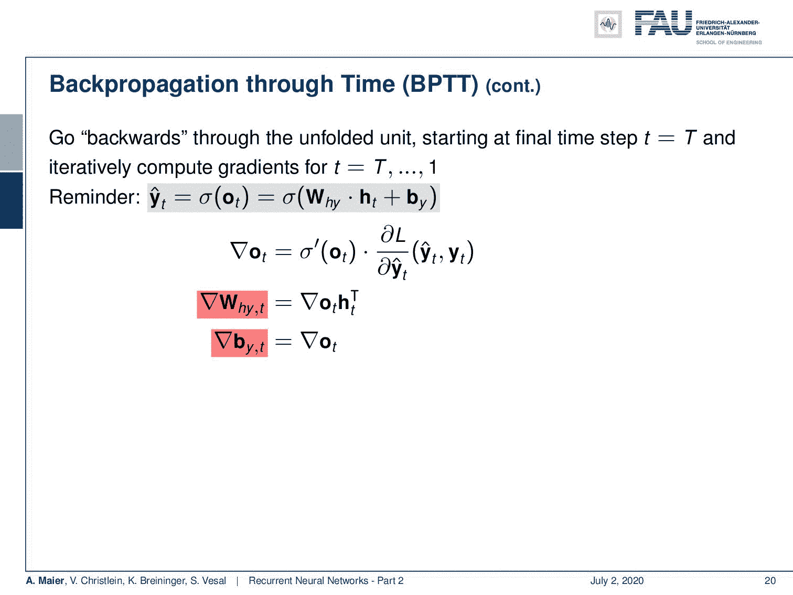
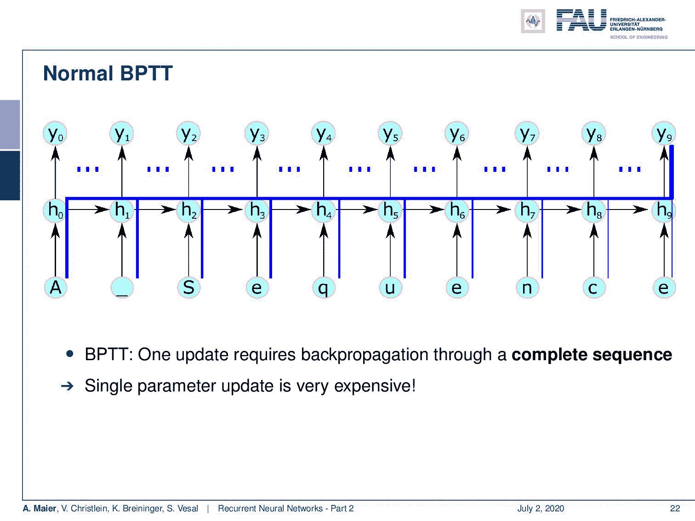
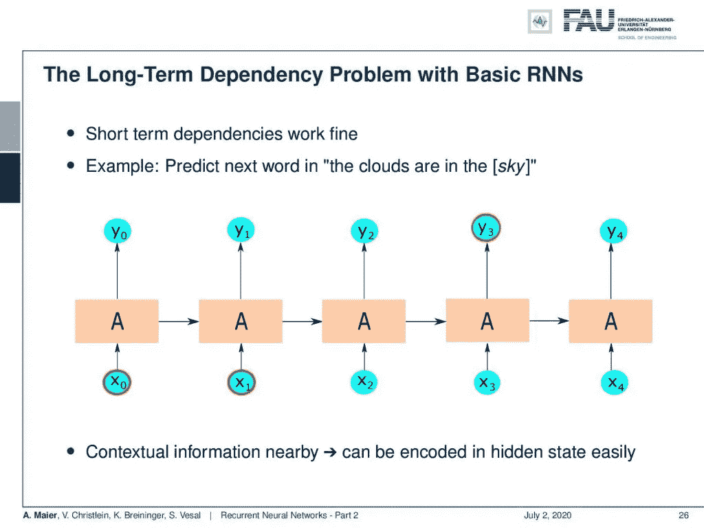
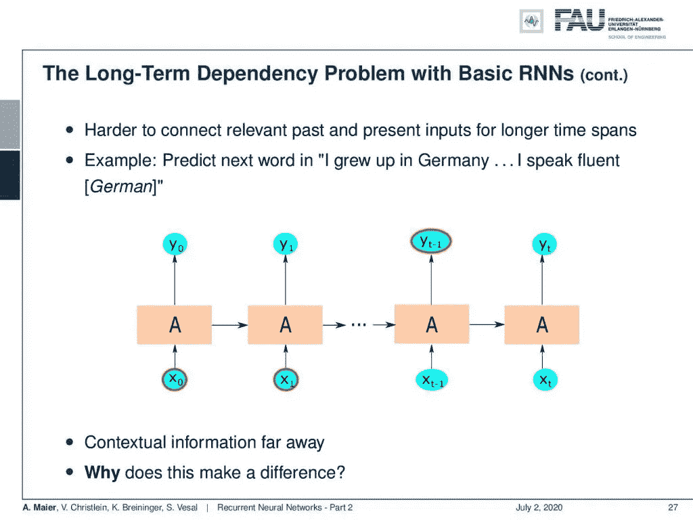
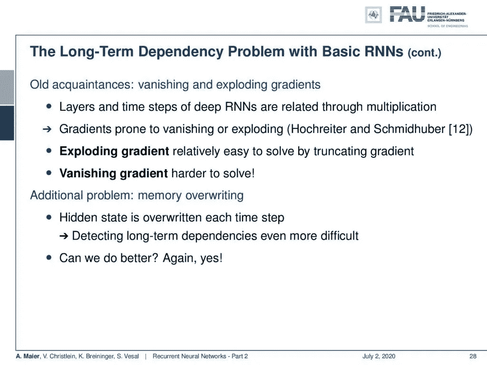
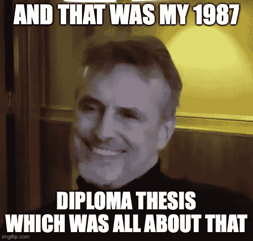

# 递归神经网络—第二部分

> 原文：<https://towardsdatascience.com/recurrent-neural-networks-part-2-5f45c1c612c4?source=collection_archive---------49----------------------->

## [FAU 讲座笔记](https://towardsdatascience.com/tagged/fau-lecture-notes)关于深度学习

## 穿越时间的反向传播

FAU 大学的深度学习。下图 [CC BY 4.0](https://creativecommons.org/licenses/by/4.0/) 来自[深度学习讲座](https://www.youtube.com/watch?v=p-_Stl0t3kU&list=PLpOGQvPCDQzvgpD3S0vTy7bJe2pf_yJFj&index=1)

**这些是 FAU 的 YouTube 讲座** [**深度学习**](https://www.youtube.com/watch?v=p-_Stl0t3kU&list=PLpOGQvPCDQzvgpD3S0vTy7bJe2pf_yJFj&index=1) **的讲义。这是与幻灯片匹配的讲座视频&的完整抄本。我们希望，你喜欢这个视频一样多。当然，这份抄本是用深度学习技术在很大程度上自动创建的，只进行了少量的手动修改。如果你发现了错误，请告诉我们！**

# 航行

[**上一讲**](/recurrent-neural-networks-part-1-498230290534) **/** [**观看本视频**](https://youtu.be/ztVIn-9c6UU) **/** [**顶级**](/all-you-want-to-know-about-deep-learning-8d68dcffc258) **/** [**下一讲**](/recurrent-neural-networks-part-3-1032d4a67757)

同样，对于 RNNs，我们可以采用一次热编码。 [CC 下的图片来自](https://creativecommons.org/licenses/by/4.0/)[深度学习讲座](https://www.youtube.com/watch?v=p-_Stl0t3kU&list=PLpOGQvPCDQzvgpD3S0vTy7bJe2pf_yJFj&index=1)的 4.0 。

欢迎回到深度学习！今天，我们想多谈一点关于递归神经网络，特别是研究训练程序。那么，我们的 RNN 培训是如何进行的呢？让我们看一个简单的例子，我们从字符级语言模型开始。所以，我们想从一个输入文本中学习一个字符概率分布，我们的词汇将会非常简单。这将是字母 h，e，l，和 o，我们将它们编码为一个热点向量，这样我们就可以得到 h 的向量(1 0 0 0)ᵀ.现在，我们可以继续在序列“hello”上训练我们的 RNN，我们应该知道给定“h”作为第一个输入，网络应该生成序列“hello”。现在，当出现 l 时，网络需要知道以前的输入，因为它需要知道它是需要产生 l 还是 o，它是相同的输入，但有两个不同的输出。所以，你得知道语境。

未经训练的 RNN 解码示例。 [CC 下的图片来自](https://creativecommons.org/licenses/by/4.0/)[深度学习讲座](https://www.youtube.com/watch?v=p-_Stl0t3kU&list=PLpOGQvPCDQzvgpD3S0vTy7bJe2pf_yJFj&index=1)的 4.0 。

让我们看看这个例子，你已经可以看到解码是如何发生的。因此，我们基本上再次将输入层作为一个热码编码向量。然后，我们用之前看到的矩阵产生隐藏状态 **h** 下标 t，并产生输出，你可以看到。现在，我们输入不同的字母，然后产生一些输出，这些输出可以通过一键编码映射回字母。因此，这基本上为我们提供了遍历整个序列并产生所需输出的可能性。现在，对于训练来说，问题是我们如何确定所有这些权重？当然，我们希望最大化这些权重来预测正确的分量。

通过时间的反向传播展开了完整序列的递归解码。来自[深度学习讲座](https://www.youtube.com/watch?v=p-_Stl0t3kU&list=PLpOGQvPCDQzvgpD3S0vTy7bJe2pf_yJFj&index=1)的 4.0CC 下的图片。

这都可以通过时间反向传播算法来实现。我们的想法是在展开的网络上训练。这里有一个关于如何做到这一点的简短草图。我们的想法是展开网络。因此，我们计算整个序列的前向路径，然后应用损耗。所以，我们基本上是在整个序列上反向传播，这样即使是发生在最后一个状态的事情也会对最开始产生影响。因此，我们计算整个序列的后向传递，以获得梯度和权重更新。因此，对于一个随时间反向传播的更新，我必须展开这个由输入序列产生的完整网络。然后，我可以将创建的输出与期望的输出进行比较，并计算更新。

让我们重温一下正向路径的更新公式。 [CC 下的图片来自](https://creativecommons.org/licenses/by/4.0/)[深度学习讲座](https://www.youtube.com/watch?v=p-_Stl0t3kU&list=PLpOGQvPCDQzvgpD3S0vTy7bJe2pf_yJFj&index=1)的 4.0 。

那么，让我们更详细地看一下这个问题。当然，正向传递只是计算隐藏状态和输出。因此，我们知道我们有一些输入序列是 **x** 下标 1 到 **x** 下标 T，其中 T 是序列长度。现在，我只是重复更新我们的 **u** 下标 t，它是各自激活函数之前的线性部分。然后，我们计算激活函数来得到新的隐藏状态，然后我们计算下标 t，它本质上是 sigmoid 函数之前的线性部分。然后，我们应用 sigmoid 来产生基本上是我们网络输出的 y 帽子。

rnn 就像五行代码一样简单。图片来源: [imgflip](https://imgflip.com/i/48zhqg) 。

如果我们这样做，那么我们可以展开整个网络，并产生我们需要的所有相应信息，然后实际计算权重的更新。

为了得到梯度，我们从损失函数开始。来自[深度学习讲座](https://www.youtube.com/watch?v=p-_Stl0t3kU&list=PLpOGQvPCDQzvgpD3S0vTy7bJe2pf_yJFj&index=1)的 4.0CC 下的图片。

现在通过时间的反向传播基本上产生了一个损失函数。现在，损失函数实际上是对我们在之前的讲座中已经知道的损失进行求和，但我们对每个时间 t 的实际观测值进行求和，因此，例如，我们可以取交叉熵，然后我们将预测输出与地面真实值进行比较，并以我们已经知道的类似方式计算损失函数的梯度。我们希望获得参数向量 **θ** 的参数更新，参数向量由这三个矩阵、两个偏置向量和向量 **h** 组成。因此，也可以使用学习率来更新参数，方法与我们在整个课程中所做的非常相似。现在的问题是，当然，我们如何得到这些衍生物，现在的想法是通过整个网络回到过去。

在这张幻灯片上，我们推导了隐藏状态的梯度。来自[深度学习讲座](https://www.youtube.com/watch?v=p-_Stl0t3kU&list=PLpOGQvPCDQzvgpD3S0vTy7bJe2pf_yJFj&index=1)的 [CC BY 4.0](https://creativecommons.org/licenses/by/4.0/) 下的图片。

那我们该怎么办？我们从时间 T = T 开始，然后迭代计算 T 的梯度，直到 1。所以只要记住我们的 **y** 帽子是由这两个矩阵组成的 **o** 下标 t 的 sigma 产生的。因此，如果我们想要计算相对于 **o** 下标 t 的偏导数，那么我们需要 **o** 下标 t 的 sigmoid 函数的导数乘以损失函数相对于 **y** 下标 t 的偏导数。现在，你可以看到，相对于 **W** 下标 hy 的梯度将被给出为 **o** 下标 t 乘以 **h** 下标 t 转置的梯度。相对于偏差的梯度将被简单地给定为 **o** 下标 t 的梯度。因此，梯度 **h** 下标 t 现在取决于两个元素:受 **o** 下标 t 影响的隐藏状态和下一个隐藏状态 **h** 下标 t+1。所以，我们可以得到 **h** 下标 t 的梯度，作为 **h** 下标 t+1 对 **h** 下标 t 的偏导数，转置乘以 **h** 下标 t+1 的梯度。然后，我们仍然需要添加 **o** 下标 t 相对于 **h** 下标 t 的偏导数乘以 **o** 下标 t 的梯度。这可以表示为权重矩阵 **W** 下标 hh 乘以 **W** 下标 hh 乘以 **h** 下标 t 加上 **W** 下标 xh 乘以**x **乘以 **h** 下标 t+1 的梯度加上 **W** 下标 hy 转置乘以 **o** 下标 t 的梯度，所以，你可以看到我们也可以针对矩阵实现这个梯度。 现在，您已经拥有了隐藏状态的所有更新。****

接下来，我们研究参数来更新状态。来自[深度学习讲座](https://www.youtube.com/watch?v=p-_Stl0t3kU&list=PLpOGQvPCDQzvgpD3S0vTy7bJe2pf_yJFj&index=1)的 4.0CC 下的图片。

现在，我们还想计算其他权重矩阵的更新。所以，让我们来看看这是怎么可能的。我们现在已经基本上建立了计算对我们的 **h** 下标 t 的导数的方法，所以，现在我们已经可以通过时间传播了。所以对于每个 t，我们基本上得到和中的一个元素，因为我们可以计算梯度 **h** 下标 t，我们现在可以得到剩余的梯度。为了计算 **h** 下标 t，我们需要 **u** 下标 t 的 tanh，它包含剩余的权重矩阵。所以我们基本上得到了关于两个缺失矩阵和偏差的导数。通过使用梯度 **h** 下标 t 乘以 **u** 下标 t 的 tangens 双曲线导数。然后，根据您想要更新的矩阵，它将是 **h** 下标 t-1 转置，或 **x** 下标 t 转置。对于偏差，你不需要乘以任何额外的东西。因此，这些基本上是计算剩余更新所需的要素。我们现在看到的是，我们可以计算梯度，但它们依赖于 t，现在的问题是，我们如何得到序列的梯度。我们看到的是，以展开状态出现的网络本质上是一个共享权重的网络。这意味着我们可以简单地通过所有时间步长的和来更新。这样，我们就可以计算出权重和时间 t 的所有更新，最终的梯度更新将是所有梯度步长的总和。好了，我们已经看到了如何计算所有这些步骤，是的:这可能是五行伪代码，对吗？

反向传播算法截断的天真想法。来自[深度学习讲座](https://www.youtube.com/watch?v=p-_Stl0t3kU&list=PLpOGQvPCDQzvgpD3S0vTy7bJe2pf_yJFj&index=1)的 4.0CC 下的图片。

正常的时间反向传播存在一些问题。你需要展开整个序列，对于长序列和复杂的网络，这意味着大量的内存消耗。单个参数更新非常昂贵。所以，你可以做一个分裂的方法，就像我们在这里建议的天真的方法，但是如果你只是将序列分成几批，然后重新开始初始化隐藏状态，那么你可能可以训练，但是你会在长时间内失去依赖性。在本例中，第一个输入永远不会连接到这里的最后一个输出。所以，我们需要一个更好的方法来处理和节省内存，当然，有一种方法可以做到这一点。这被称为通过时间的截断反向传播算法。

截断时间反向传播算法。 [CC 下的图片来自](https://creativecommons.org/licenses/by/4.0/)[深度学习讲座](https://www.youtube.com/watch?v=p-_Stl0t3kU&list=PLpOGQvPCDQzvgpD3S0vTy7bJe2pf_yJFj&index=1)的 4.0 。

现在，通过时间的截断反向传播算法整体上保持对序列的处理，但是它适应更新的频率和深度。所以每个 k₁时间步，你运行一个 k₂时间步的反向传播，如果 k₂很小，参数更新会很便宜。隐藏状态仍然暴露在许多时间步骤中，正如您将在下面看到的。所以，这个想法是从 1 到 t 的时间 t 运行我们的 RNN 一步计算 **h** 下标 t 和 **y** 下标 t，然后如果我们在 k₁步骤，那么我们通过时间从 t 向下运行反向传播到 t 减去 k₂.

时间截断反向传播的一个例子。 [CC 下的图片来自](https://creativecommons.org/licenses/by/4.0/)[深度学习讲座](https://www.youtube.com/watch?v=p-_Stl0t3kU&list=PLpOGQvPCDQzvgpD3S0vTy7bJe2pf_yJFj&index=1)的 4.0 。

这在下面的设置中出现:你可以看到，我们实际上跨越了 4 个时间步。如果我们在第四个时间步，那么我们可以通过时间回溯，直到序列的开始。一旦我们这样做了，我们继续前进，我们总是保持隐藏状态。我们不会丢弃它。所以，我们可以模拟这种相互作用。那么，这能解决我们所有的问题吗？不，因为如果我们有一个很长的时间背景，它将无法更新。比方说，第一个元素负责改变序列中最后一个元素的某些东西，然后你会发现它们永远不会被连接起来。所以，我们再也无法了解这种长时间的背景。这是长期依赖和基本 RNNs 的一个大问题。

可以很好地捕捉附近的上下文。 [CC 下的图片来自](https://creativecommons.org/licenses/by/4.0/)[深度学习讲座](https://www.youtube.com/watch?v=p-_Stl0t3kU&list=PLpOGQvPCDQzvgpD3S0vTy7bJe2pf_yJFj&index=1)的 4.0 。

假设你有这种长期依赖。你想预测“云在天上”的下一个词。你可以看到云可能与此相关。这里，上下文信息就在附近。所以，我们可以很容易地把它编码成隐藏状态。现在，如果我们有很长的序列，那么会困难得多，因为我们必须反向传播这么多步骤。你也看到了，我们在深度网络中有这些问题，在那里我们有消失梯度问题。我们无法找到连接相距甚远的网络部分的更新。

长时间的上下文仍然会产生问题。来自[深度学习讲座](https://www.youtube.com/watch?v=p-_Stl0t3kU&list=PLpOGQvPCDQzvgpD3S0vTy7bJe2pf_yJFj&index=1)的 [CC BY 4.0](https://creativecommons.org/licenses/by/4.0/) 下的图片。

你可以在这里看到，如果我们有这样的例子:一句“我在德国长大”然后说别的“我说得很流利”，那很可能是德语。我必须能够记住“我在德国长大”。因此，上下文信息离得很远，这很重要，因为我们必须通过许多层来传播。

rnn 中长期依赖的问题。 [CC 下的图片来自](https://creativecommons.org/licenses/by/4.0/)[深度学习讲座](https://www.youtube.com/watch?v=p-_Stl0t3kU&list=PLpOGQvPCDQzvgpD3S0vTy7bJe2pf_yJFj&index=1)的 4.0 。

这意味着我们必须彼此相乘。正如 Hochreiter 和 Schmidhuber 在[12]中指出的那样，你可以看到这些梯度易于消失和爆炸。现在，你仍然有这个问题，你可能有一个爆炸梯度。嗯，你可以截断梯度，但消失梯度更难解决。还有一个内存覆盖的问题，因为隐藏状态在每个时间步都被覆盖。因此，如果隐藏状态向量中没有足够的空间，检测长期依赖关系将会更加困难。这也是你的递归神经网络可能出现的问题。那么，我们能做得比这更好吗？答案还是:是的。

在这个深度学习讲座中，更多令人兴奋的事情即将到来。 [CC 下的图片来自](https://creativecommons.org/licenses/by/4.0/)[深度学习讲座](https://www.youtube.com/watch?v=p-_Stl0t3kU&list=PLpOGQvPCDQzvgpD3S0vTy7bJe2pf_yJFj&index=1)的 4.0 。

这是我们将在下一个视频中讨论的内容，届时我们将讨论长短期记忆单位以及 Hochreiter 和 Schmidhuber 所做的贡献。

接下来:更多来自 Schmidhuber 毕业论文的秘密。来源: [imgflip](https://imgflip.com/i/48zofw) 。

所以非常感谢你听这个视频，希望在下一个视频中见到你。谢谢你，再见！

如果你喜欢这篇文章，你可以在这里找到更多的文章[，在这里](https://medium.com/@akmaier)找到更多关于机器学习的教育材料[，或者看看我们的](https://lme.tf.fau.de/teaching/free-deep-learning-resources/)[深度](https://www.youtube.com/watch?v=p-_Stl0t3kU&list=PLpOGQvPCDQzvgpD3S0vTy7bJe2pf_yJFj) [学习](https://www.youtube.com/watch?v=p-_Stl0t3kU&list=PLpOGQvPCDQzvgpD3S0vTy7bJe2pf_yJFj&index=1) [讲座](https://www.youtube.com/watch?v=p-_Stl0t3kU&list=PLpOGQvPCDQzvgpD3S0vTy7bJe2pf_yJFj)。如果你想在未来了解更多的文章、视频和研究，我也会很感激关注 [YouTube](https://www.youtube.com/c/AndreasMaierTV) 、 [Twitter](https://twitter.com/maier_ak) 、[脸书](https://www.facebook.com/andreas.maier.31337)或 [LinkedIn](https://www.linkedin.com/in/andreas-maier-a6870b1a6/) 。本文以 [Creative Commons 4.0 归属许可](https://creativecommons.org/licenses/by/4.0/deed.de)发布，如果引用，可以转载和修改。

# RNN 民间音乐

[FolkRNN.org](https://folkrnn.org/competition/)
MachineFolkSession.comT5[玻璃球亨利评论 14128](https://github.com/IraKorshunova/folk-rnn/blob/master/soundexamples/successes/The%20Glas%20Herry%20Comment%2014128.mp3)

# 链接

[人物 RNNs](http://karpathy.github.io/2015/05/21/rnn-effectiveness/)
[机器翻译 CNN](https://engineering.fb.com/ml-applications/a-novel-approach-to-neural-machine-translation/)
[用 RNNs 作曲](http://www.hexahedria.com/2015/08/03/composing-music-with-recurrent-neural-networks/)

# 参考

[1] Dzmitry Bahdanau、Kyunghyun Cho 和 Yoshua Bengio。“通过联合学习对齐和翻译的神经机器翻译”。载于:CoRR abs/1409.0473 (2014 年)。arXiv: 1409.0473。Yoshua Bengio，Patrice Simard 和 Paolo Frasconi。“学习具有梯度下降的长期依赖性是困难的”。摘自:IEEE 神经网络汇刊 5.2 (1994)，第 157-166 页。
[3]钟俊英，卡格拉尔·古尔希雷，赵京云等，“门控递归神经网络序列建模的实证评估”。载于:arXiv 预印本 arXiv:1412.3555 (2014 年)。
[4]道格拉斯·埃克和于尔根·施密德胡伯。“学习蓝调音乐的长期结构”。《人工神经网络——ICANN 2002》。柏林，海德堡:施普林格柏林海德堡出版社，2002 年，第 284-289 页。
【5】杰弗里·L·埃尔曼。“及时发现结构”。摘自:认知科学 14.2 (1990)，第 179-211 页。
[6] Jonas Gehring，Michael Auli，David Grangier，等，“卷积序列到序列学习”。载于:CoRR abs/1705.03122 (2017 年)。arXiv: 1705.03122。亚历克斯·格雷夫斯、格雷格·韦恩和伊沃·达尼埃尔卡。《神经图灵机》。载于:CoRR abs/1410.5401 (2014 年)。arXiv: 1410.5401。
【8】凯罗尔·格雷戈尔，伊沃·达尼埃尔卡，阿历克斯·格雷夫斯等，“绘制:用于图像生成的递归神经网络”。载于:第 32 届机器学习国际会议论文集。第 37 卷。机器学习研究论文集。法国里尔:PMLR，2015 年 7 月，第 1462-1471 页。
[9]赵京贤、巴特·范·梅林波尔、卡格拉尔·古尔切雷等人，“使用 RNN 编码器-解码器学习统计机器翻译的短语表示”。载于:arXiv 预印本 arXiv:1406.1078 (2014 年)。
【10】J J 霍普菲尔德。“具有突发集体计算能力的神经网络和物理系统”。摘自:美国国家科学院院刊 79.8 (1982)，第 2554-2558 页。eprint:[http://www.pnas.org/content/79/8/2554.full.pdf.](http://www.pnas.org/content/79/8/2554.full.pdf.)T11【11】w . a . Little。“大脑中持久状态的存在”。摘自:数学生物科学 19.1 (1974)，第 101-120 页。
[12]赛普·霍克雷特和于尔根·施密德胡贝尔。“长短期记忆”。摘自:神经计算 9.8 (1997)，第 1735-1780 页。
[13] Volodymyr Mnih，Nicolas Heess，Alex Graves 等，“视觉注意的循环模型”。载于:CoRR abs/1406.6247 (2014 年)。arXiv: 1406.6247。
[14]鲍勃·斯特姆、若昂·费利佩·桑托斯和伊琳娜·科尔舒诺娃。“通过具有长短期记忆单元的递归神经网络进行民间音乐风格建模”。英语。In:第 16 届国际音乐信息检索学会会议，晚破，西班牙马拉加，2015，p. 2。
[15] Sainbayar Sukhbaatar，Arthur Szlam，Jason Weston 等著《端到端存储网络》。载于:CoRR abs/1503.08895 (2015 年)。arXiv: 1503.08895。
【16】彼得·m·托德。“算法合成的连接主义方法”。在:13(1989 年 12 月)。
【17】伊利亚·苏茨基弗。“训练递归神经网络”。安大略省多伦多市多伦多大学。，加拿大(2013)。
【18】安德烈·卡帕西。“递归神经网络的不合理的有效性”。载于:安德烈·卡帕西博客(2015)。
贾森·韦斯顿、苏米特·乔普拉和安托万·博尔德斯。“记忆网络”。载于:CoRR abs/1410.3916 (2014 年)。arXiv: 1410.3916。