# 递归神经网络——第三部分

> 原文：<https://towardsdatascience.com/recurrent-neural-networks-part-3-1032d4a67757?source=collection_archive---------40----------------------->

## [FAU 讲座笔记](https://towardsdatascience.com/tagged/fau-lecture-notes)关于深度学习

## 向 schmid Huber-LSTMs 致敬

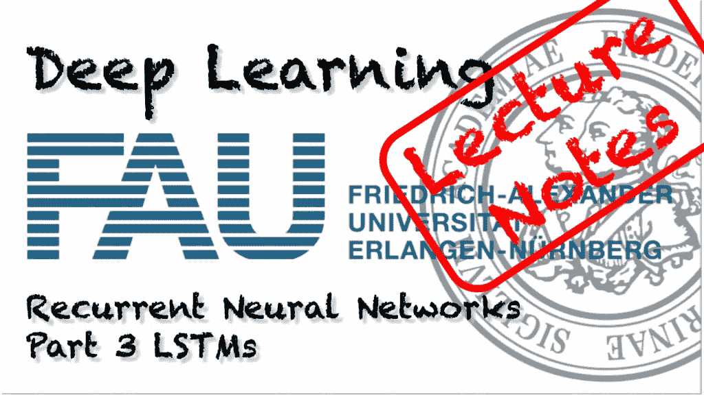

FAU 大学的深度学习。下图 [CC BY 4.0](https://creativecommons.org/licenses/by/4.0/) 来自[深度学习讲座](https://www.youtube.com/watch?v=p-_Stl0t3kU&list=PLpOGQvPCDQzvgpD3S0vTy7bJe2pf_yJFj&index=1)

**这些是 FAU 的 YouTube 讲座** [**深度学习**](https://www.youtube.com/watch?v=p-_Stl0t3kU&list=PLpOGQvPCDQzvgpD3S0vTy7bJe2pf_yJFj&index=1) **的讲义。这是讲座视频&的完整文字记录，配有幻灯片。我们希望，你喜欢这个视频一样多。当然，这份抄本是用深度学习技术在很大程度上自动创建的，只进行了少量的手动修改。如果你发现了错误，请告诉我们！**

# 航行

[**上一讲**](/recurrent-neural-networks-part-2-5f45c1c612c4) **/** [**观看本视频**](https://youtu.be/vZQxwDHvuug) **/** [**顶级**](/all-you-want-to-know-about-deep-learning-8d68dcffc258) **/** [**下一讲**](/recurrent-neural-networks-part-4-39a568034d3b)

欢迎回到深度学习！今天，我想向大家展示一种替代方案，来解决递归神经网络中的消失梯度问题。

于尔根·斯密德胡伯的名言。来源: [imgflip](https://imgflip.com/i/492k7p) 。

你已经注意到长时间的上下文是一个问题。因此，我们将讨论长短期记忆单位(LSTMs)。它们是由 Schmidhuber 的一位 Hochreiter 介绍的，并于 1997 年出版。

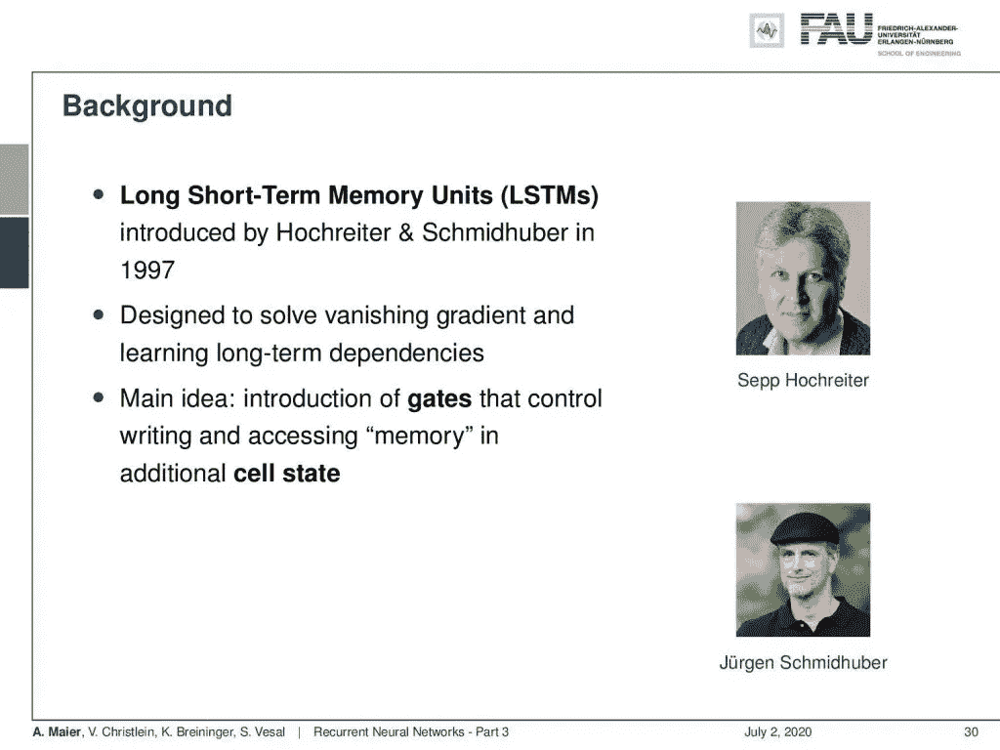

机器学习领域的两位著名作者。 [CC 下的图片来自](https://creativecommons.org/licenses/by/4.0/)[深度学习讲座](https://www.youtube.com/watch?v=p-_Stl0t3kU&list=PLpOGQvPCDQzvgpD3S0vTy7bJe2pf_yJFj&index=1)的 4.0 。

它们被设计用来解决长期依赖中的消失梯度问题。主要的想法是，你引入门来控制额外状态下的写和访问存储器。

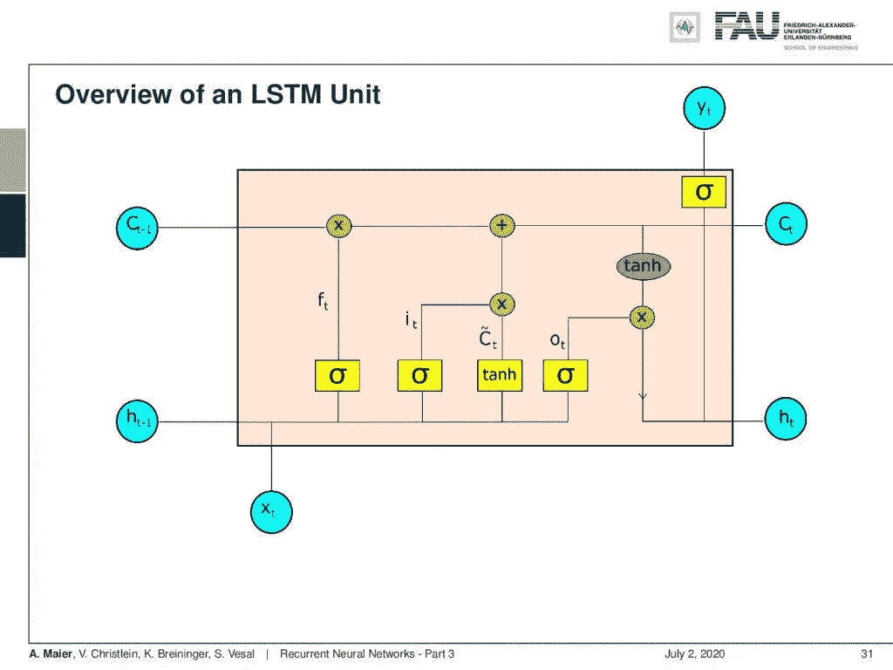

LSTM 细胞概述。 [CC 下的图片来自](https://creativecommons.org/licenses/by/4.0/)[深度学习讲座](https://www.youtube.com/watch?v=p-_Stl0t3kU&list=PLpOGQvPCDQzvgpD3S0vTy7bJe2pf_yJFj&index=1)的 4.0 。

那么，让我们来看看 LSTM 单元。你看这里，一个主要的特征是我们现在有两个可以被认为是隐藏状态的东西:我们有单元状态 **C** 和隐藏状态 **h** 。同样，我们有一些输入。然后我们有相当多的激活函数。然后我们将它们组合起来，最后，我们产生一些输出 **y** 。这个单元比你之前在简单的 RNNs 中看到的要复杂得多。

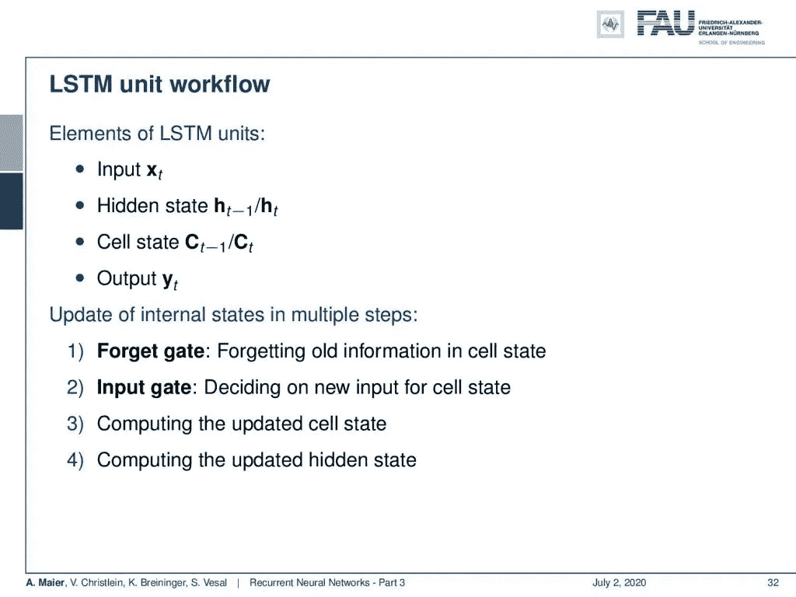

LSTM 细胞的工作流程。来自[深度学习讲座](https://www.youtube.com/watch?v=p-_Stl0t3kU&list=PLpOGQvPCDQzvgpD3S0vTy7bJe2pf_yJFj&index=1)的 4.0CC 下的图片。

好，那么 LSTM 的主要特征是什么:给定一些输入 **x** 它产生一个隐藏状态 **h** 。它还有一个单元状态 **C** ，我们将在接下来的几张幻灯片中更详细地研究它，以产生输出 **y** 。现在，我们有几个门，这些门本质上是用来控制信息流的。有一个遗忘门，用来遗忘细胞状态中的旧信息。然后，我们有输入门，这实质上是决定细胞状态的新输入。由此，我们然后计算更新的单元状态和更新的隐藏状态。

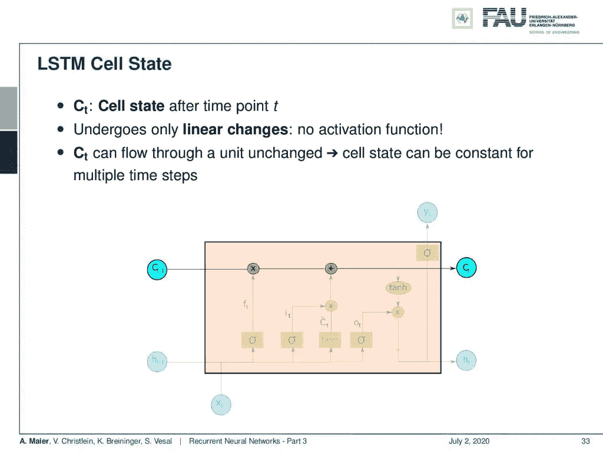

单元状态处理的路径。 [CC 下的图片来自](https://creativecommons.org/licenses/by/4.0/)[深度学习讲座](https://www.youtube.com/watch?v=p-_Stl0t3kU&list=PLpOGQvPCDQzvgpD3S0vTy7bJe2pf_yJFj&index=1)的 4.0 。

让我们来看看工作流程。我们有每个时间点 t 之后的单元状态，并且单元状态仅经历线性变化。所以没有激活功能。你看到在细胞状态的路径上只有一个乘法和一个加法。所以，细胞状态可以流过这个单位。对于多个时间步长，单元状态可以是恒定的。现在，我们要对细胞状态进行操作。我们用几个门来做这个，第一个门是遗忘门。这里的关键思想是我们想忘记细胞状态的信息。在另一个步骤中，我们要考虑如何将新的信息放入细胞状态，用来记忆东西。

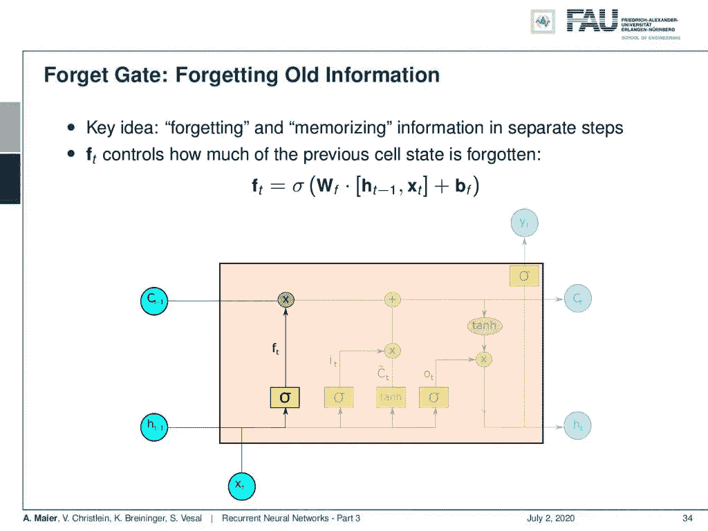

遗忘之门。 [CC 下的图片来自](https://creativecommons.org/licenses/by/4.0/)[深度学习讲座](https://www.youtube.com/watch?v=p-_Stl0t3kU&list=PLpOGQvPCDQzvgpD3S0vTy7bJe2pf_yJFj&index=1)的 4.0 。

因此，遗忘门 **f** 控制有多少先前的单元状态被遗忘。你可以看到它是由 sigmoid 函数计算的。所以，它介于 0 和 1 之间。它本质上是通过隐藏状态和 **x** 的串联加上一些偏差的矩阵乘法来计算的。然后乘以单元状态。所以，我们决定忘记状态向量的哪些部分，保留哪些部分。

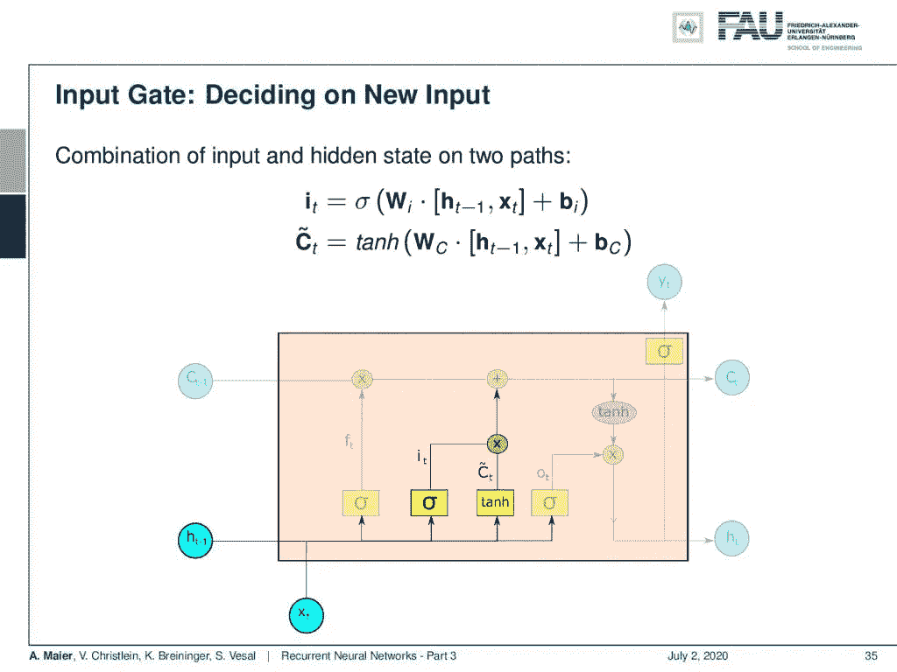

输入门。 [CC 下的图片来自](https://creativecommons.org/licenses/by/4.0/)[深度学习讲座](https://www.youtube.com/watch?v=p-_Stl0t3kU&list=PLpOGQvPCDQzvgpD3S0vTy7bJe2pf_yJFj&index=1)的 4.0 。

现在，我们还需要输入新的信息。对于新信息，我们必须以某种方式决定将什么信息输入到单元状态中。这里，我们需要两个激活函数:一个我们称之为 **I** ，它也是由一个 sigmoid 激活函数产生的。同样，隐藏状态的矩阵乘法与输入加上一些偏置和 sigmoid 函数连接，是非线性的。记住，这个值会在 0 和 1 之间，所以你可以说它是在选择什么。然后，我们有一些 C 波浪号，这是一种由双曲正切产生的更新状态。然后，将某个权重矩阵 W 下标 c 作为输入，该权重矩阵 W 下标 c 乘以隐藏向量和输入向量加上某个偏差的串联。所以本质上，我们有这个指数，然后乘以中间细胞阶段 C 代字号。我们可以说双曲正切正在产生一些新的细胞状态，然后我们通过 I 选择这些指数中的哪些应该添加到当前细胞状态。因此，我们用 I 乘以新产生的 **C** 波形符，并将其添加到单元格状态 **C** 。

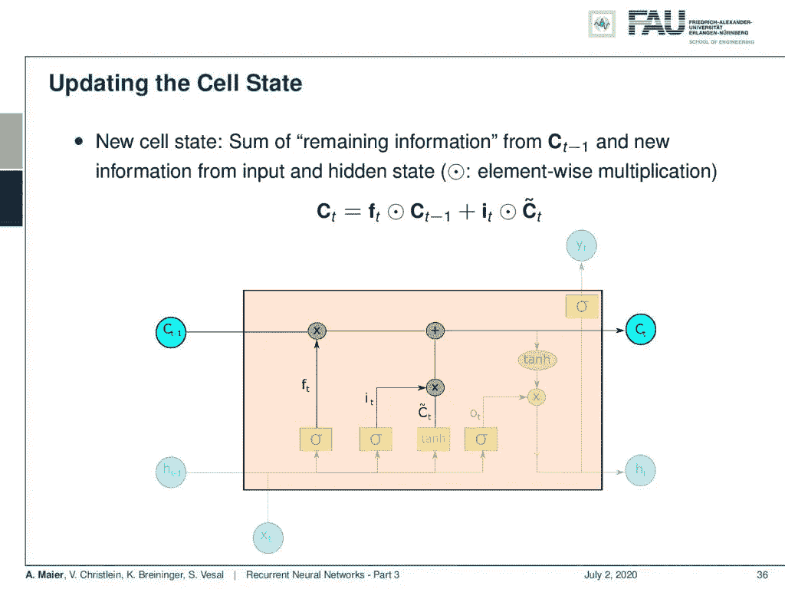

单元状态更新。来自[深度学习讲座](https://www.youtube.com/watch?v=p-_Stl0t3kU&list=PLpOGQvPCDQzvgpD3S0vTy7bJe2pf_yJFj&index=1)的 4.0CC 下的图片。

现在，我们使用与前一状态的遗忘门的逐点乘法来更新我们刚刚看到的完整单元状态。然后，我们用逐点乘法将已经由 **I** 识别的更新单元状态的元素相加。因此，您可以看到，仅使用乘法和加法，单元状态的更新是完全线性的。

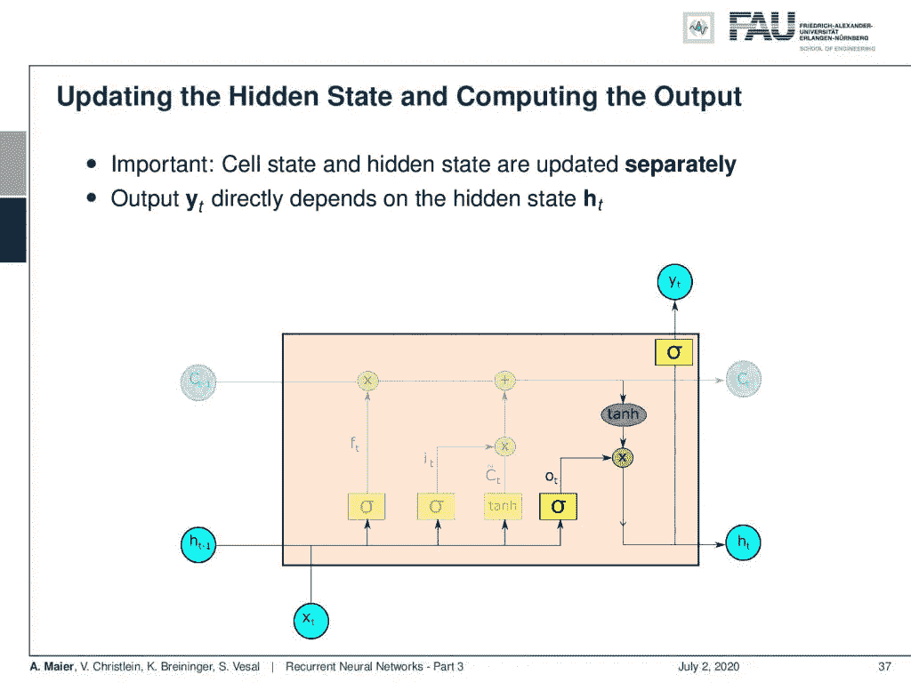

隐藏状态更新和输出。来自[深度学习讲座](https://www.youtube.com/watch?v=p-_Stl0t3kU&list=PLpOGQvPCDQzvgpD3S0vTy7bJe2pf_yJFj&index=1)的 4.0CC 下的图片。

现在，我们仍然需要产生隐藏状态和输出。正如我们在 Elman 单元中所看到的，我们网络的输出只取决于隐藏态。因此，我们首先用另一个非线性更新隐藏状态，然后乘以单元状态的变换。这给了我们新的隐藏状态，并且根据新的隐藏状态，我们产生具有另一个非线性的输出。

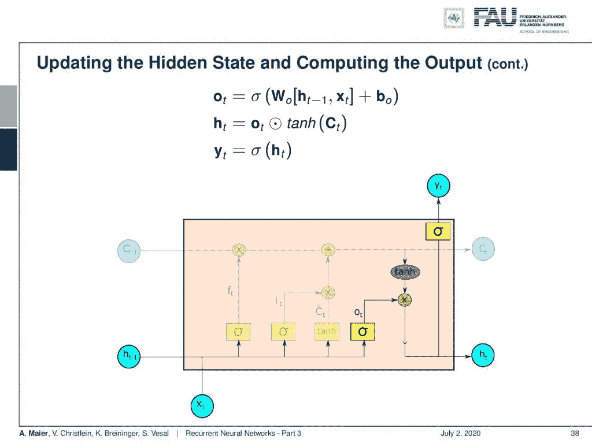

更新公式。 [CC 下的图片来自](https://creativecommons.org/licenses/by/4.0/)[深度学习讲座](https://www.youtube.com/watch?v=p-_Stl0t3kU&list=PLpOGQvPCDQzvgpD3S0vTy7bJe2pf_yJFj&index=1)的 4.0 。

所以，你看这些是更新方程。我们产生一些 **o** ，这实质上是一个 sigmoid 函数对新隐藏态的提议。然后，我们将它与细胞状态产生的双曲线正切相乘，以选择实际产生的元素。这给了我们新的隐藏状态。新的隐藏状态可以通过另一个非线性来产生输出。顺便说一下，你可以在这里看到，对于隐藏状态的更新和新输出的产生，我们省略了当然需要的转换矩阵。你可以把网络中的每一个非线性本质上解释为一个通用函数逼近器。所以，我们仍然需要线性部分，当然，在这里减少消失梯度。

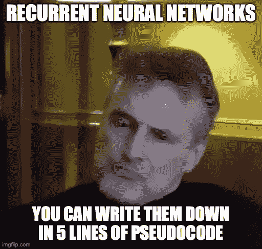

记住:rnn 就像五行代码一样简单。图片来源: [imgflip](https://imgflip.com/i/48zhqg) 。

如果你想训练所有这些，你可以回去用一个非常相似的方法，就像我们已经看到的 Elman 细胞一样。所以，你用反向传播来更新所有不同的权重矩阵。

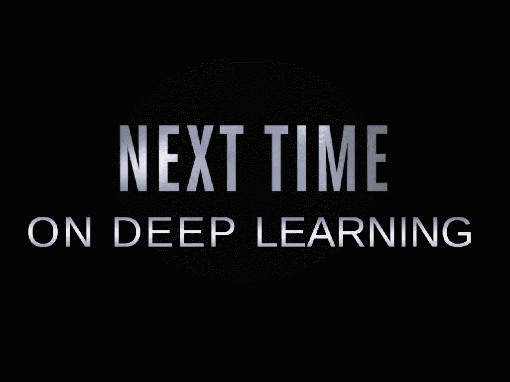

在这个深度学习讲座中，更多令人兴奋的事情即将到来。 [CC 下的图片来自](https://creativecommons.org/licenses/by/4.0/)[深度学习讲座](https://www.youtube.com/watch?v=p-_Stl0t3kU&list=PLpOGQvPCDQzvgpD3S0vTy7bJe2pf_yJFj&index=1)的 4.0 。

好吧。这已经把我们带到了这个视频的结尾。你们已经看到了长短期记忆细胞，不同的部分，不同的门，当然，这是这节课非常重要的一部分。所以，如果你正在准备考试，那么我肯定会推荐你看一看如何画出这么长的短期记忆单元。你可以看到 LSTM 有很多优点。特别地，我们可以通过单元状态的线性变换来缓解消失梯度的问题。顺便说一句，值得指出的是，我们在长短期记忆细胞中包含了一些我们从计算机设计中了解到的想法。我们基本上学会了如何操纵记忆细胞。我们可以说，在隐藏状态下，我们现在有了一种程序，一种有限状态机，它对一些内存进行操作，学习存储哪些信息，删除哪些信息，加载哪些信息。因此，这些网络设计如何逐渐接近计算机体系结构是非常有趣的。当然，关于这个还有很多要说的。在下一个视频中，我们将研究门控循环神经网络，它是 LSTM 细胞的一种简化。您将会看到，采用稍薄的设计，我们仍然可以获得 LSTM 的许多优势，但参数要少得多。好了，我希望你喜欢这个视频，下次我们讨论门控循环神经网络时再见。拜拜。

如果你喜欢这篇文章，你可以在这里找到更多的文章，或者看看我们的讲座。如果你想在未来了解更多的文章、视频和研究，我也会很感激关注 [YouTube](https://www.youtube.com/c/AndreasMaierTV) 、 [Twitter](https://twitter.com/maier_ak) 、[脸书](https://www.facebook.com/andreas.maier.31337)或 [LinkedIn](https://www.linkedin.com/in/andreas-maier-a6870b1a6/) 。本文以 [Creative Commons 4.0 归属许可](https://creativecommons.org/licenses/by/4.0/deed.de)发布，如果引用，可以转载和修改。

# RNN 民间音乐

[FolkRNN.org](https://folkrnn.org/competition/)
[MachineFolkSession.com](https://themachinefolksession.org/tunes/)
[玻璃球亨利评论 14128](https://github.com/IraKorshunova/folk-rnn/blob/master/soundexamples/successes/The%20Glas%20Herry%20Comment%2014128.mp3)

# 链接

[人物 RNNs](http://karpathy.github.io/2015/05/21/rnn-effectiveness/)
[CNN 用于机器翻译](https://engineering.fb.com/ml-applications/a-novel-approach-to-neural-machine-translation/)
[用 RNNs 作曲](http://www.hexahedria.com/2015/08/03/composing-music-with-recurrent-neural-networks/)

# 参考

[1] Dzmitry Bahdanau、Kyunghyun Cho 和 Yoshua Bengio。“通过联合学习对齐和翻译的神经机器翻译”。载于:CoRR abs/1409.0473 (2014 年)。arXiv: 1409.0473。Yoshua Bengio，Patrice Simard 和 Paolo Frasconi。“学习具有梯度下降的长期依赖性是困难的”。摘自:IEEE 神经网络汇刊 5.2 (1994)，第 157-166 页。
[3]钟俊英，卡格拉尔·古尔希雷，赵京云等，“门控递归神经网络序列建模的实证评估”。载于:arXiv 预印本 arXiv:1412.3555 (2014 年)。
[4]道格拉斯·埃克和于尔根·施密德胡伯。“学习蓝调音乐的长期结构”。《人工神经网络——ICANN 2002》。柏林，海德堡:施普林格柏林海德堡出版社，2002 年，第 284-289 页。
【5】杰弗里·L·埃尔曼。“及时发现结构”。摘自:认知科学 14.2 (1990)，第 179-211 页。
[6] Jonas Gehring，Michael Auli，David Grangier，等，“卷积序列到序列学习”。载于:CoRR abs/1705.03122 (2017 年)。arXiv: 1705.03122。亚历克斯·格雷夫斯、格雷格·韦恩和伊沃·达尼埃尔卡。《神经图灵机》。载于:CoRR abs/1410.5401 (2014 年)。arXiv: 1410.5401。
【8】凯罗尔·格雷戈尔，伊沃·达尼埃尔卡，阿历克斯·格雷夫斯等，“绘制:用于图像生成的递归神经网络”。载于:第 32 届机器学习国际会议论文集。第 37 卷。机器学习研究论文集。法国里尔:PMLR，2015 年 7 月，第 1462-1471 页。
[9]赵京贤、巴特·范·梅林波尔、卡格拉尔·古尔切雷等人，“使用 RNN 编码器-解码器学习统计机器翻译的短语表示”。载于:arXiv 预印本 arXiv:1406.1078 (2014 年)。
【10】J J 霍普菲尔德。“具有突发集体计算能力的神经网络和物理系统”。摘自:美国国家科学院院刊 79.8 (1982)，第 2554-2558 页。eprint:[http://www.pnas.org/content/79/8/2554.full.pdf.](http://www.pnas.org/content/79/8/2554.full.pdf.)T11【11】w . a . Little。“大脑中持久状态的存在”。摘自:数学生物科学 19.1 (1974)，第 101-120 页。
[12]赛普·霍克雷特和于尔根·施密德胡贝尔。“长短期记忆”。摘自:神经计算 9.8 (1997)，第 1735-1780 页。
[13] Volodymyr Mnih，Nicolas Heess，Alex Graves 等，“视觉注意的循环模型”。载于:CoRR abs/1406.6247 (2014 年)。arXiv: 1406.6247。
[14]鲍勃·斯特姆、若昂·费利佩·桑托斯和伊琳娜·科尔舒诺娃。“通过具有长短期记忆单元的递归神经网络进行民间音乐风格建模”。英语。In:第 16 届国际音乐信息检索学会会议，晚破，西班牙马拉加，2015，p. 2。
[15] Sainbayar Sukhbaatar，Arthur Szlam，Jason Weston 等著《端到端存储网络》。载于:CoRR abs/1503.08895 (2015 年)。arXiv: 1503.08895。
【16】彼得·m·托德。“算法合成的连接主义方法”。在:13(1989 年 12 月)。
【17】伊利亚·苏茨基弗。“训练递归神经网络”。安大略省多伦多市多伦多大学。，加拿大(2013)。
【18】安德烈·卡帕西。“递归神经网络的不合理的有效性”。载于:安德烈·卡帕西博客(2015)。
贾森·韦斯顿、苏米特·乔普拉和安托万·博尔德斯。“记忆网络”。载于:CoRR abs/1410.3916 (2014 年)。arXiv: 1410.3916。