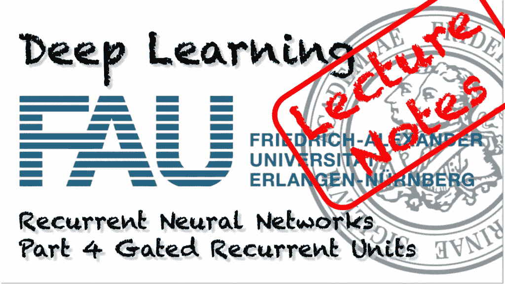
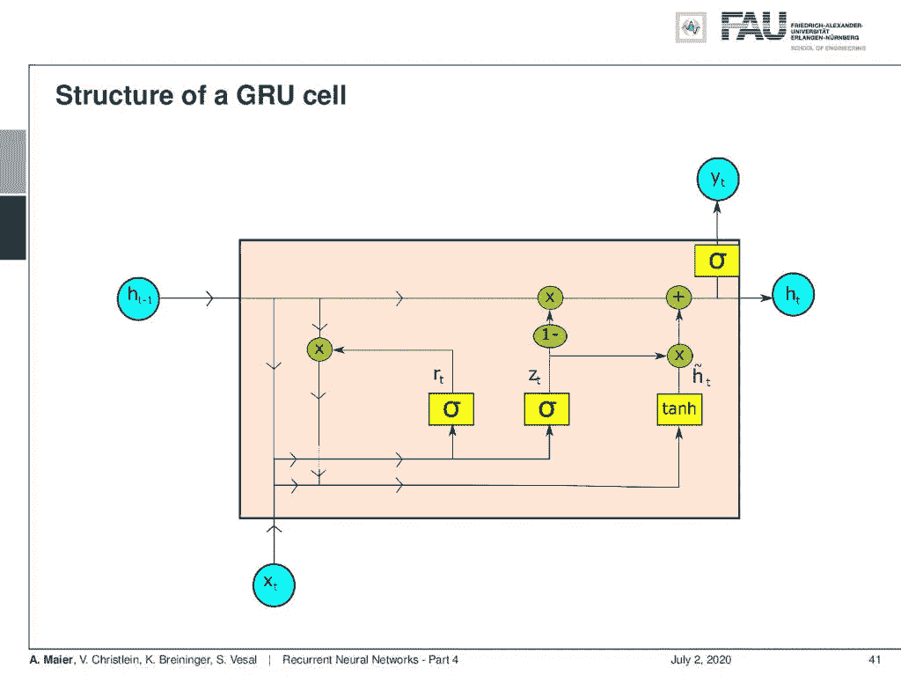
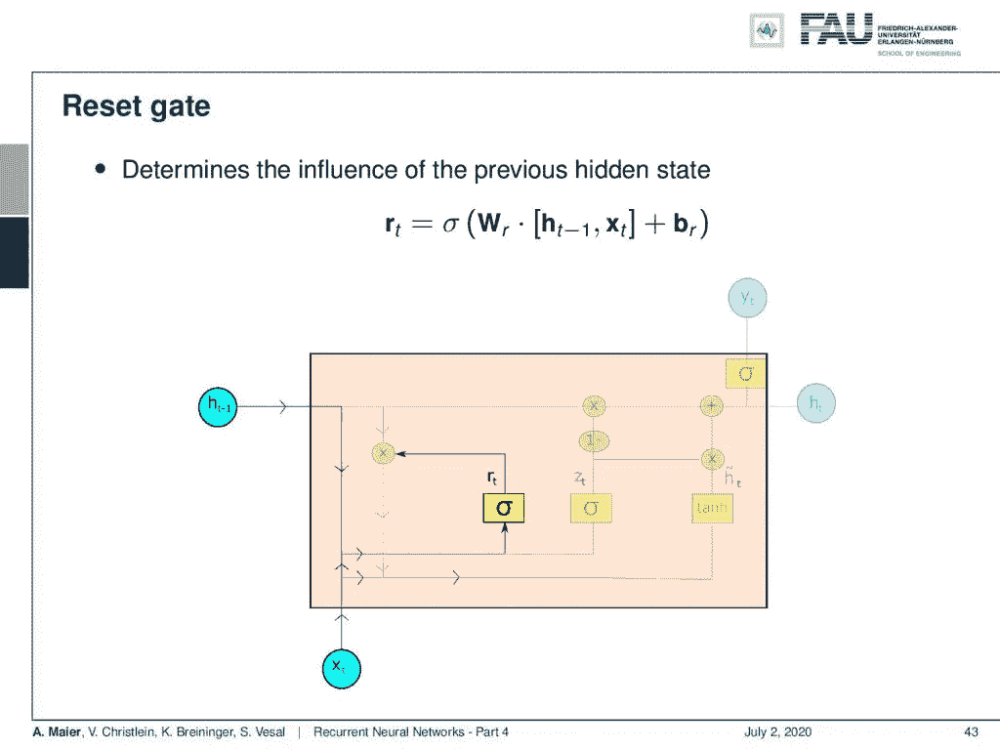
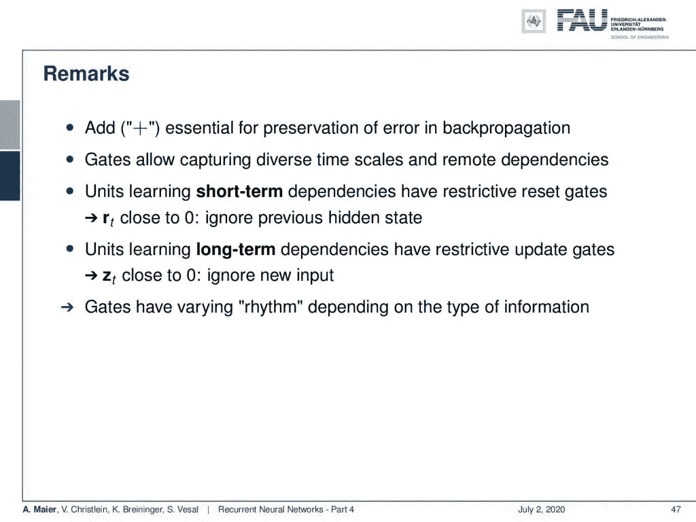
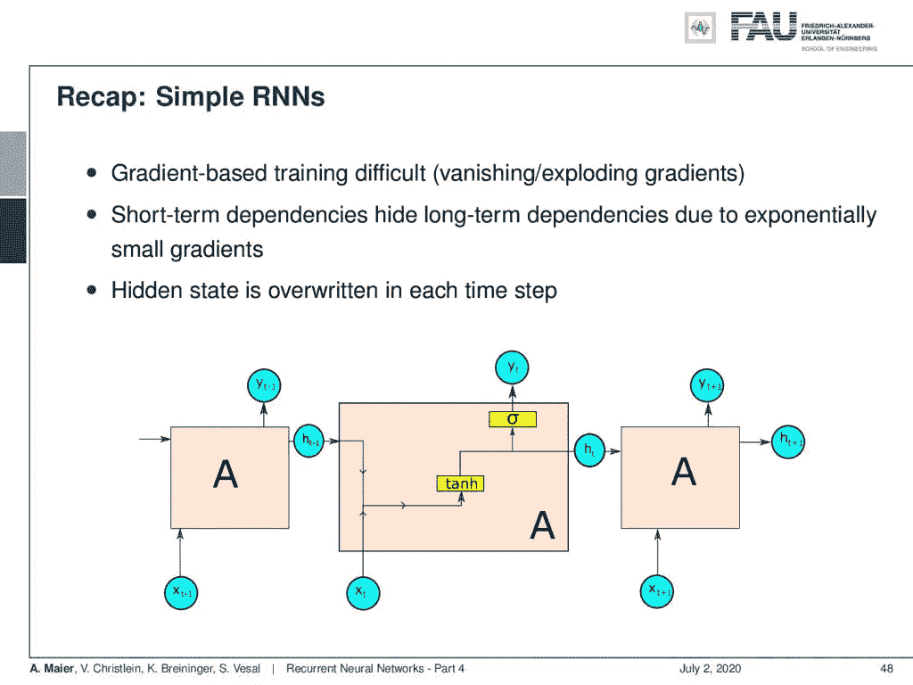
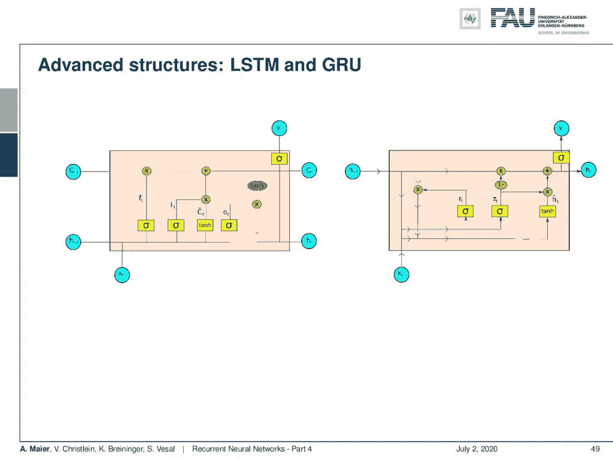
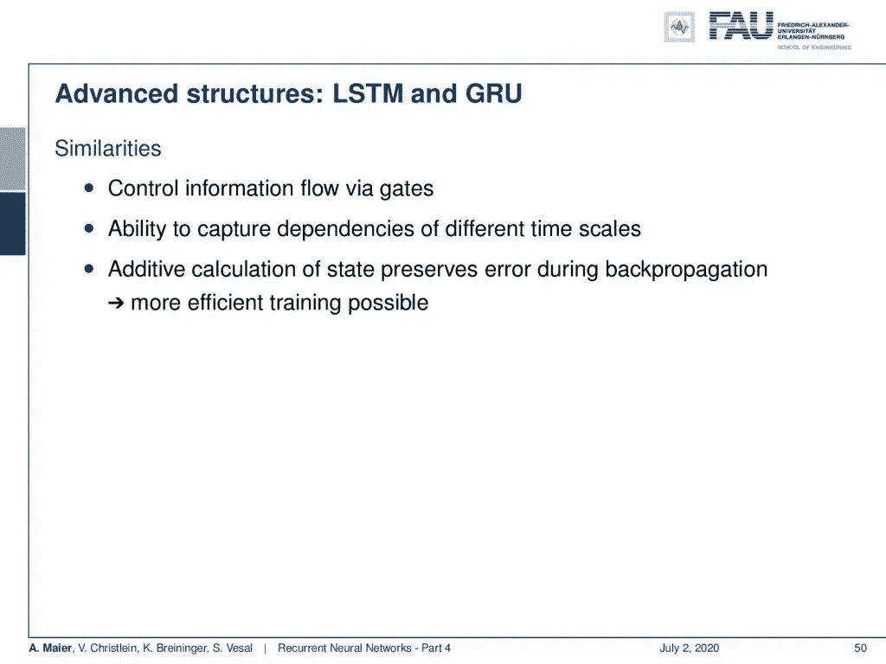
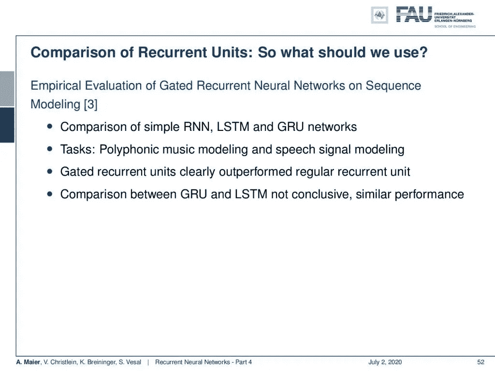

# 递归神经网络——第四部分

> 原文：<https://towardsdatascience.com/recurrent-neural-networks-part-4-39a568034d3b?source=collection_archive---------53----------------------->

## [FAU 讲座笔记](https://towardsdatascience.com/tagged/fau-lecture-notes)关于深度学习

## 门控循环单位

FAU 大学的深度学习。下图 [CC BY 4.0](https://creativecommons.org/licenses/by/4.0/) 来自[深度学习讲座](https://www.youtube.com/watch?v=p-_Stl0t3kU&list=PLpOGQvPCDQzvgpD3S0vTy7bJe2pf_yJFj&index=1)

**这些是 FAU 的 YouTube 讲座** [**深度学习**](https://www.youtube.com/watch?v=p-_Stl0t3kU&list=PLpOGQvPCDQzvgpD3S0vTy7bJe2pf_yJFj&index=1) **的讲义。这是讲座视频&的完整文本，配有幻灯片。我们希望，你喜欢这个视频一样多。当然，这份抄本是用深度学习技术在很大程度上自动创建的，只进行了少量的手动修改。如果你发现了错误，请告诉我们！**

# 航行

[**上一讲**](/recurrent-neural-networks-part-3-1032d4a67757) **/** [**观看本视频**](https://youtu.be/Gt6GLTkuoTs) **/** [**顶级**](/all-you-want-to-know-about-deep-learning-8d68dcffc258) **/** [**下一讲**](/recurrent-neural-networks-part-5-885fc3357792)

欢迎回到深度学习！今天我们想谈谈门控循环单位(GRUs)，它是 LSTM 细胞的一种简化。

GRUs 为长时间的上下文提供了一种更简单的方法。图片来源: [imgflip](https://imgflip.com/i/495hg2) 。

这又是一个神经网络:门控循环单元。这里的想法是，LSTM 当然很棒，但它有很多参数，很难训练。

gru 的性能与 LSTMs 相当，但参数更少。 [CC 下的图片来自](https://creativecommons.org/licenses/by/4.0/)[深度学习讲座](https://www.youtube.com/watch?v=p-_Stl0t3kU&list=PLpOGQvPCDQzvgpD3S0vTy7bJe2pf_yJFj&index=1)的 4.0 。

因此，Cho 提出了门控循环单元，并在 2014 年将其引入统计机器翻译。你可以说这是一种 LSTM，但它更简单，参数更少。

GRU 细胞的结构。 [CC 下的图片来自](https://creativecommons.org/licenses/by/4.0/)[深度学习讲座](https://www.youtube.com/watch?v=p-_Stl0t3kU&list=PLpOGQvPCDQzvgpD3S0vTy7bJe2pf_yJFj&index=1)的 4.0 。

这是大致的设置。你可以看到我们不像在 LSTM 那样有两个不同的记忆。我们只有一个隐藏状态。与 LSTM 的一个相似之处是隐藏状态只沿着一个线性过程流动。所以，你在这里只能看到乘法和加法。同样，在 LSTM 中，我们从隐藏状态产生输出。

GRU 工作流程的主要步骤。来自[深度学习讲座](https://www.youtube.com/watch?v=p-_Stl0t3kU&list=PLpOGQvPCDQzvgpD3S0vTy7bJe2pf_yJFj&index=1)的 [CC BY 4.0](https://creativecommons.org/licenses/by/4.0/) 下的图片。

所以让我们来看看 Cho 为了提出这个酷细胞的想法。它从 LSTM 中提取概念，并通过门来控制内存。主要区别在于没有额外的单元状态。所以，记忆只直接作用于隐藏状态。状态的更新可以分为四个步骤:有一个重置门，它控制着先前隐藏状态的影响。然后是引入新计算的更新的更新门。因此，下一步提出一个更新的隐藏状态，然后用它来更新隐藏状态。

重置门。 [CC 下的图片来自](https://creativecommons.org/licenses/by/4.0/)[深度学习讲座](https://www.youtube.com/watch?v=p-_Stl0t3kU&list=PLpOGQvPCDQzvgpD3S0vTy7bJe2pf_yJFj&index=1)的 4.0 。

那么，这是如何工作的呢？首先我们确定前一个隐藏状态的影响。这是通过 sigmoid 激活函数来完成的。我们又有一个矩阵类型的更新。我们将输入和之前的隐藏状态用一个矩阵相乘，并添加一些偏差。然后，将其输入这个 sigmoid 激活函数，该函数产生一些复位值 **r** 下标 t。

更新门首先用来自[深度学习讲座](https://www.youtube.com/watch?v=p-_Stl0t3kU&list=PLpOGQvPCDQzvgpD3S0vTy7bJe2pf_yJFj&index=1)的 4.0 计算 [CC 下的 z 下标 t. Image。](https://creativecommons.org/licenses/by/4.0/)

接下来，我们生产一些 **z** 。这实质上是对新隐藏状态的更新建议。因此，这又是由一个 sigmoid 函数产生的，其中我们连接了最后一个隐藏状态，输入向量乘以矩阵 **W** 下标 z 并添加一些偏差。

接下来，计算更新建议。 [CC 下的图片来自](https://creativecommons.org/licenses/by/4.0/)[深度学习讲座](https://www.youtube.com/watch?v=p-_Stl0t3kU&list=PLpOGQvPCDQzvgpD3S0vTy7bJe2pf_yJFj&index=1)的 4.0 。

接下来，我们提议更新。所以我们把输入和复位状态结合起来。这是以如下方式完成的:因此，更新建议 **h** 波浪号由双曲正切产生，其中我们将复位门乘以最后的隐藏状态。因此，我们基本上从最后一个隐藏状态中删除了我们不想看到的条目，并将 **x** 下标 t 与某个矩阵 **W** 下标 h 相乘，并添加一些偏差 **b** 下标 h。然后，这被提供给 tanh 以产生更新建议。

最后，新状态被计算为旧状态和更新提议之间的混合。下图 [CC BY 4.0](https://creativecommons.org/licenses/by/4.0/) 来自[深度学习讲座](https://www.youtube.com/watch?v=p-_Stl0t3kU&list=PLpOGQvPCDQzvgpD3S0vTy7bJe2pf_yJFj&index=1)。

现在，有了更新建议，我们就进入了更新阶段。更新门控制旧状态和建议状态的组合。因此，我们通过乘以 1 — **z** 下标 t 来计算新的状态。你记得这是我们之前用旧状态计算的中间变量。进一步，我们添加 **z** 下标 t 乘以 **h** 波浪号。这是提议的更新。因此，本质上，产生了一个 **z** 下标 t 的 sigmoid 函数现在用于选择是保留旧状态的旧信息还是用新状态的信息更新它。这给出了新的隐藏状态。有了新的隐藏状态，我们产生了新的输出，并再次注意到我们在这一步省略了转换矩阵。因此，我们把它写成下标 t 的 sigmoid，但实际上有转换矩阵和偏差。不，我们在这里什么也没发现。所以，这个东西给出了最终输出 **y** hat 下标 t。

关于 GRUs 的评论。来自[深度学习讲座](https://www.youtube.com/watch?v=p-_Stl0t3kU&list=PLpOGQvPCDQzvgpD3S0vTy7bJe2pf_yJFj&index=1)的 4.0CC 下的图片。

一些注释:加法对于保留反向传播中的误差是必要的。这些门允许捕获不同的时标和远程相关性。这些单元能够通过学习限制门来学习短期依赖性。因此，如果我们有一个接近于零的下标 t，它将忽略先前的隐藏状态。我们还可以通过设置限制性更新门来了解长期依赖性。所以，这里我们的 z 下标 t 接近于零，这意味着我们忽略了新的输入门。然后，根据信息的类型出现不同的节奏。现在，你会说“好吧。现在，我们有了 RNN 单位、LSTM 单位和 GRUs。那么，我们该走哪一条？”

重新盖好 [RNN 电池](/recurrent-neural-networks-part-1-498230290534)。下图 [CC BY 4.0](https://creativecommons.org/licenses/by/4.0/) 来自[深度学习讲座](https://www.youtube.com/watch?v=p-_Stl0t3kU&list=PLpOGQvPCDQzvgpD3S0vTy7bJe2pf_yJFj&index=1)。

所以，让我们简单回顾一下。在简单的 RNNs 中，我们有基于梯度的训练，这很难做到。我们有长期依赖的爆炸梯度和消失梯度问题。短期依赖性很好，但是由于指数小梯度，它们可能隐藏长期依赖性，并且隐藏状态在每个时间步中被覆盖。

来自[深度学习讲座](https://www.youtube.com/watch?v=p-_Stl0t3kU&list=PLpOGQvPCDQzvgpD3S0vTy7bJe2pf_yJFj&index=1)的 4.0 的 [CC 下的 LSTM 和 GRU. Image 对比。](https://creativecommons.org/licenses/by/4.0/)

然后，我们有 LSTMs 和 GRUs。他们两人都引入了对记忆进行操作的门。在 LSTMs 中，我们将其分为单元状态和隐藏状态。在 GRU，我们只有一个隐藏的国家。它们都有完全线性的记忆，这有助于我们理解长期依赖性。

LSTM 和格鲁的相似之处。来自[深度学习讲座](https://www.youtube.com/watch?v=p-_Stl0t3kU&list=PLpOGQvPCDQzvgpD3S0vTy7bJe2pf_yJFj&index=1)的 [CC BY 4.0](https://creativecommons.org/licenses/by/4.0/) 下的图像。

所以，这里的相似之处，当然，是信息由门控制，以及捕捉不同时间尺度的依赖性的能力。状态的加法计算保留了反向传播期间的误差。所以，我们可以做更有效率的训练。

LSTMs 和 GRUs 的区别。 [CC 下的图片来自](https://creativecommons.org/licenses/by/4.0/)[深度学习讲座](https://www.youtube.com/watch?v=p-_Stl0t3kU&list=PLpOGQvPCDQzvgpD3S0vTy7bJe2pf_yJFj&index=1)的 4.0 。

当然，LSTMs 有不同的隐藏和单元状态。因此，它们通过一个输出门、一个输入门和一个遗忘门来控制内存内容的暴露。他们独立工作。所以，他们可能会做不同的事情。新内存内容独立于当前内存。在 GRU，我们将隐藏状态和细胞状态结合在一起。所以，我们完全暴露在没有控制的内存内容中。有一个公共的更新门，它用我们的变量 **z** 下标 t 产生新的隐藏状态。它本质上决定是使用旧的状态还是使用建议的更新。所以，新的内存内容取决于当前的内存。

经验证据表明，LSTM 和 GRU 都优于埃尔曼细胞。然而，GRU 和 LSTM 的表现不相上下。 [CC 下的图片来自](https://creativecommons.org/licenses/by/4.0/)[深度学习讲座](https://www.youtube.com/watch?v=p-_Stl0t3kU&list=PLpOGQvPCDQzvgpD3S0vTy7bJe2pf_yJFj&index=1)的 4.0 。

您也可以比较应用程序，因为您可能会问应该使用什么。在[3]中，您看到了门控递归神经网络对序列建模的经验评估。他们比较了简单的 RNN、LSTMs 和 GRU 网络。任务是复调音乐建模和语音信号建模。结果表明门控循环单位明显优于常规循环单位。GRU 和 LSTM 之间的比较不是结论性的。他们有相似的表现。

Jürgen Schmidhuber 的至理名言。图片来源: [imgflip](https://imgflip.com/i/495iim) 。

所以，你可以说它们都非常适合序列建模。一个有较少的参数，但是对于本文中提出的任务，它没有产生很大的差异，所以它们都是可行的选择。

在这个深度学习讲座中，更多令人兴奋的事情即将到来。来自[深度学习讲座](https://www.youtube.com/watch?v=p-_Stl0t3kU&list=PLpOGQvPCDQzvgpD3S0vTy7bJe2pf_yJFj&index=1)的 4.0CC 下的图片。

好吧，下一次在深度学习中，我们想谈谈生成序列。我们现在有了递归神经网络，当然，递归不仅可以用来处理长序列，当然，我们也可以生成序列。因此，我们将稍微研究一下序列生成。非常感谢你们的聆听。我希望你喜欢这个视频，并希望在下一个视频中看到你。拜拜。

如果你喜欢这篇文章，你可以在这里找到更多的文章，或者看看我们的讲座。如果你想在未来了解更多的文章、视频和研究，我也会很感激关注 [YouTube](https://www.youtube.com/c/AndreasMaierTV) 、 [Twitter](https://twitter.com/maier_ak) 、[脸书](https://www.facebook.com/andreas.maier.31337)或 [LinkedIn](https://www.linkedin.com/in/andreas-maier-a6870b1a6/) 。本文以 [Creative Commons 4.0 归属许可](https://creativecommons.org/licenses/by/4.0/deed.de)发布，如果引用，可以转载和修改。

# RNN 民间音乐

[FolkRNN.org](https://folkrnn.org/competition/)
[MachineFolkSession.com](https://themachinefolksession.org/tunes/)
[玻璃球亨利评论 14128](https://github.com/IraKorshunova/folk-rnn/blob/master/soundexamples/successes/The%20Glas%20Herry%20Comment%2014128.mp3)

# 链接

[人物 RNNs](http://karpathy.github.io/2015/05/21/rnn-effectiveness/)
[CNN 用于机器翻译](https://engineering.fb.com/ml-applications/a-novel-approach-to-neural-machine-translation/)
[用 RNNs 作曲](http://www.hexahedria.com/2015/08/03/composing-music-with-recurrent-neural-networks/)

# 参考

[1] Dzmitry Bahdanau、Kyunghyun Cho 和 Yoshua Bengio。“通过联合学习对齐和翻译的神经机器翻译”。载于:CoRR abs/1409.0473 (2014 年)。arXiv: 1409.0473。Yoshua Bengio，Patrice Simard 和 Paolo Frasconi。“学习具有梯度下降的长期依赖性是困难的”。摘自:IEEE 神经网络汇刊 5.2 (1994)，第 157-166 页。
[3]钟俊英，卡格拉尔·古尔希雷，赵京云等，“门控递归神经网络序列建模的实证评估”。载于:arXiv 预印本 arXiv:1412.3555 (2014 年)。
[4]道格拉斯·埃克和于尔根·施密德胡伯。“学习蓝调音乐的长期结构”。《人工神经网络——ICANN 2002》。柏林，海德堡:施普林格柏林海德堡出版社，2002 年，第 284-289 页。
【5】杰弗里·L·埃尔曼。“及时发现结构”。摘自:认知科学 14.2 (1990)，第 179-211 页。
[6] Jonas Gehring，Michael Auli，David Grangier，等，“卷积序列到序列学习”。载于:CoRR abs/1705.03122 (2017 年)。arXiv: 1705.03122。亚历克斯·格雷夫斯、格雷格·韦恩和伊沃·达尼埃尔卡。《神经图灵机》。载于:CoRR abs/1410.5401 (2014 年)。arXiv: 1410.5401。
【8】凯罗尔·格雷戈尔，伊沃·达尼埃尔卡，阿历克斯·格雷夫斯等，“绘制:用于图像生成的递归神经网络”。载于:第 32 届机器学习国际会议论文集。第 37 卷。机器学习研究论文集。法国里尔:PMLR，2015 年 7 月，第 1462-1471 页。
[9]赵京贤、巴特·范·梅林波尔、卡格拉尔·古尔切雷等人，“使用 RNN 编码器-解码器学习统计机器翻译的短语表示”。载于:arXiv 预印本 arXiv:1406.1078 (2014 年)。
【10】J J 霍普菲尔德。“具有突发集体计算能力的神经网络和物理系统”。摘自:美国国家科学院院刊 79.8 (1982)，第 2554-2558 页。eprint:[http://www.pnas.org/content/79/8/2554.full.pdf.](http://www.pnas.org/content/79/8/2554.full.pdf.)T11【11】w . a . Little。“大脑中持久状态的存在”。摘自:数学生物科学 19.1 (1974)，第 101-120 页。
[12]赛普·霍克雷特和于尔根·施密德胡贝尔。“长短期记忆”。摘自:神经计算 9.8 (1997)，第 1735-1780 页。
[13] Volodymyr Mnih，Nicolas Heess，Alex Graves 等，“视觉注意的循环模型”。载于:CoRR abs/1406.6247 (2014 年)。arXiv: 1406.6247。
[14]鲍勃·斯特姆、若昂·费利佩·桑托斯和伊琳娜·科尔舒诺娃。“通过具有长短期记忆单元的递归神经网络进行民间音乐风格建模”。英语。In:第 16 届国际音乐信息检索学会会议，晚破，西班牙马拉加，2015，p. 2。
[15] Sainbayar Sukhbaatar，Arthur Szlam，Jason Weston 等著《端到端存储网络》。载于:CoRR abs/1503.08895 (2015 年)。arXiv: 1503.08895。
【16】彼得·m·托德。“算法合成的连接主义方法”。在:13(1989 年 12 月)。
【17】伊利亚·苏茨基弗。“训练递归神经网络”。安大略省多伦多市多伦多大学。，加拿大(2013)。
【18】安德烈·卡帕西。“递归神经网络的不合理的有效性”。载于:安德烈·卡帕西博客(2015)。
贾森·韦斯顿、苏米特·乔普拉和安托万·博尔德斯。“记忆网络”。载于:CoRR abs/1410.3916 (2014 年)。arXiv: 1410.3916。