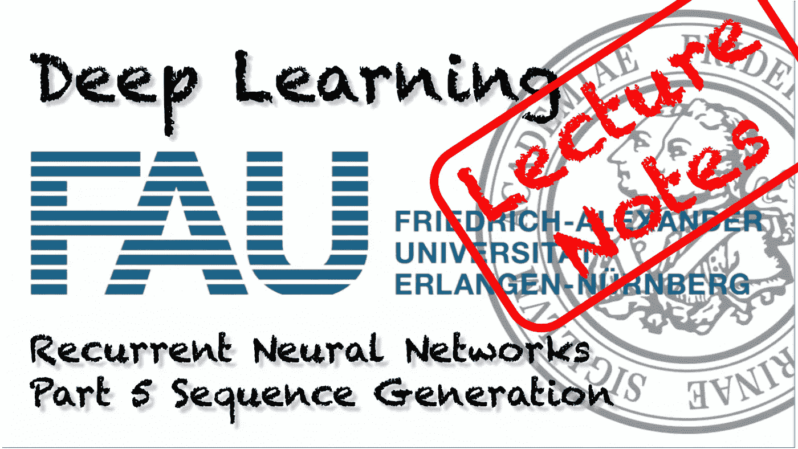
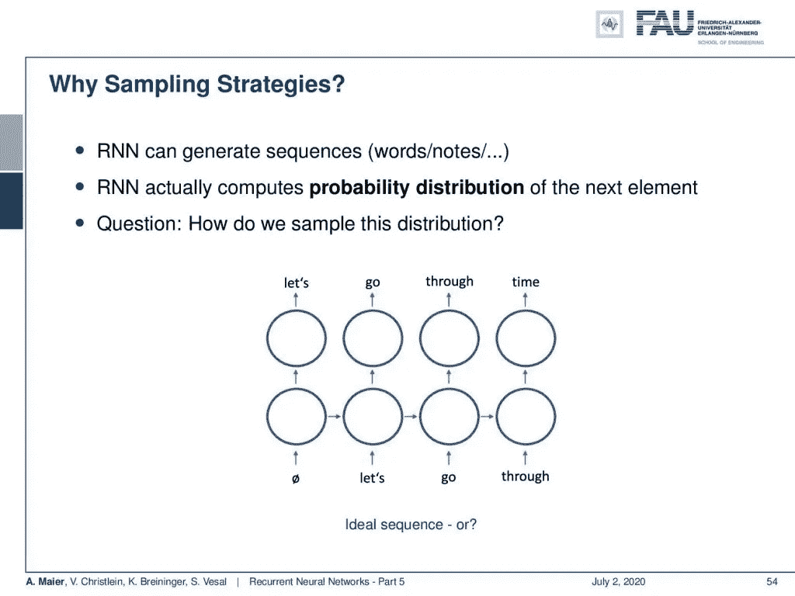
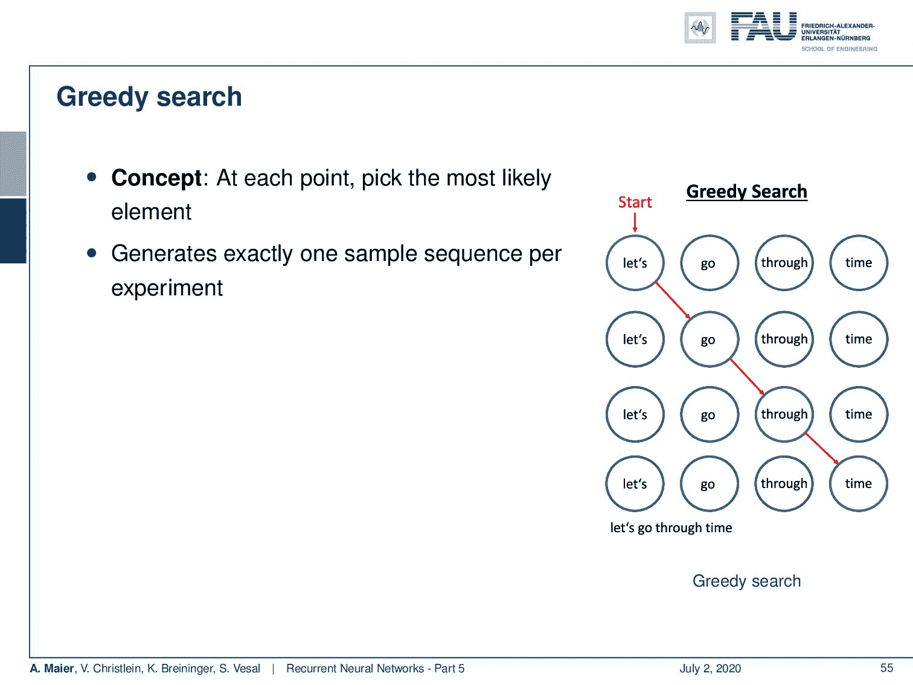
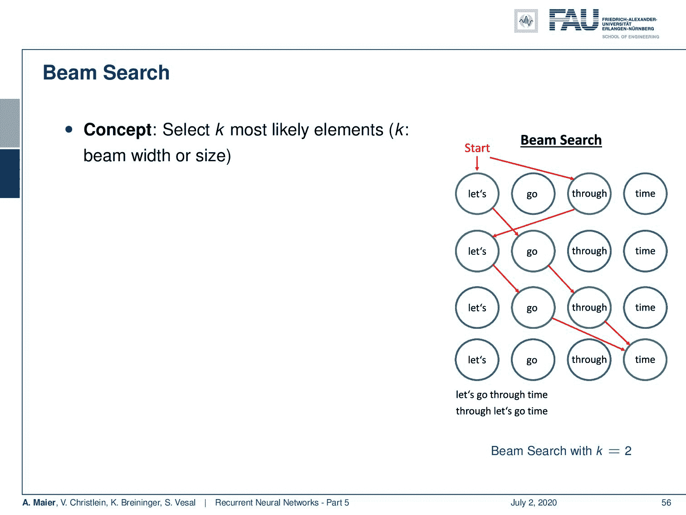
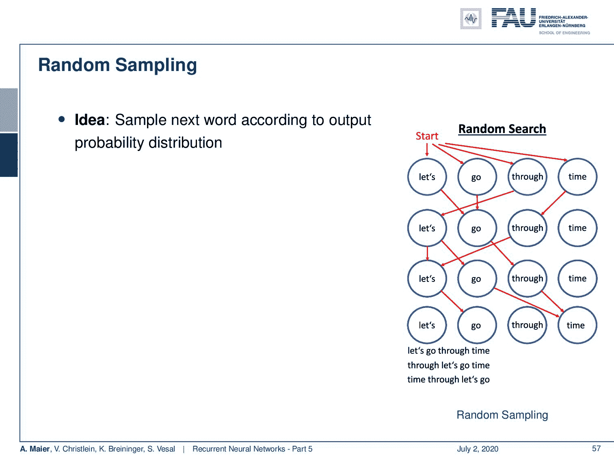
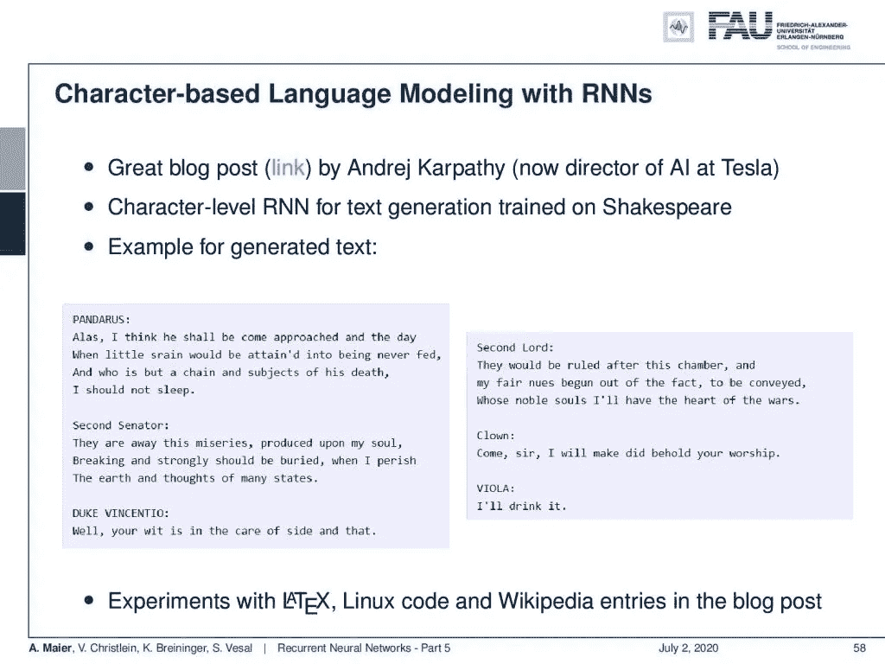
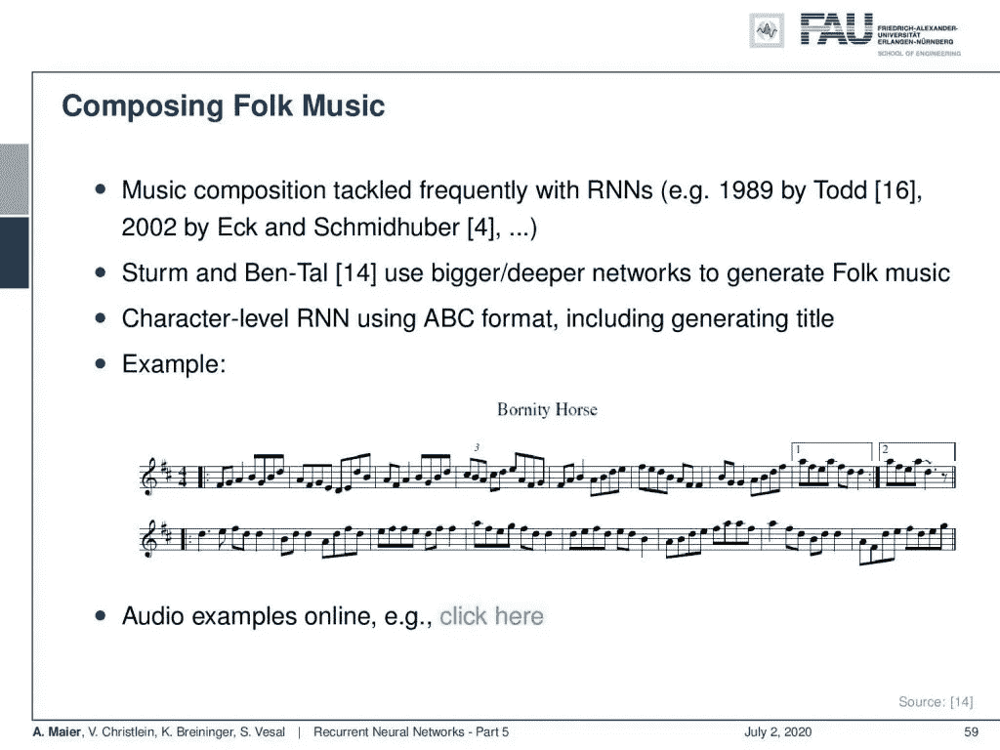
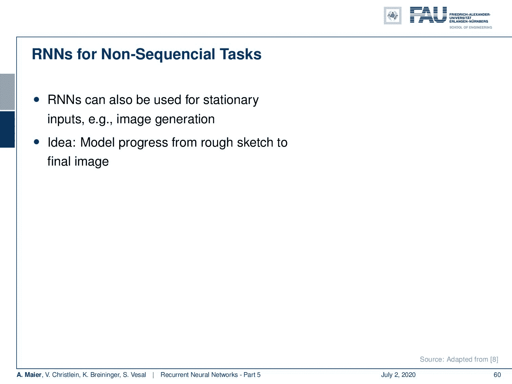
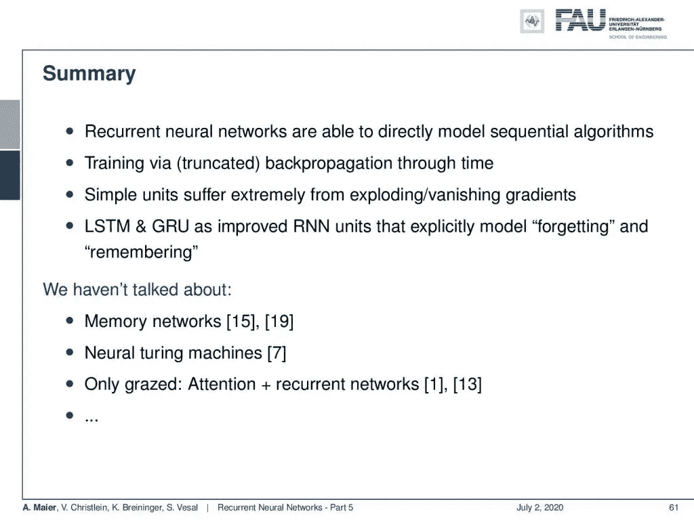
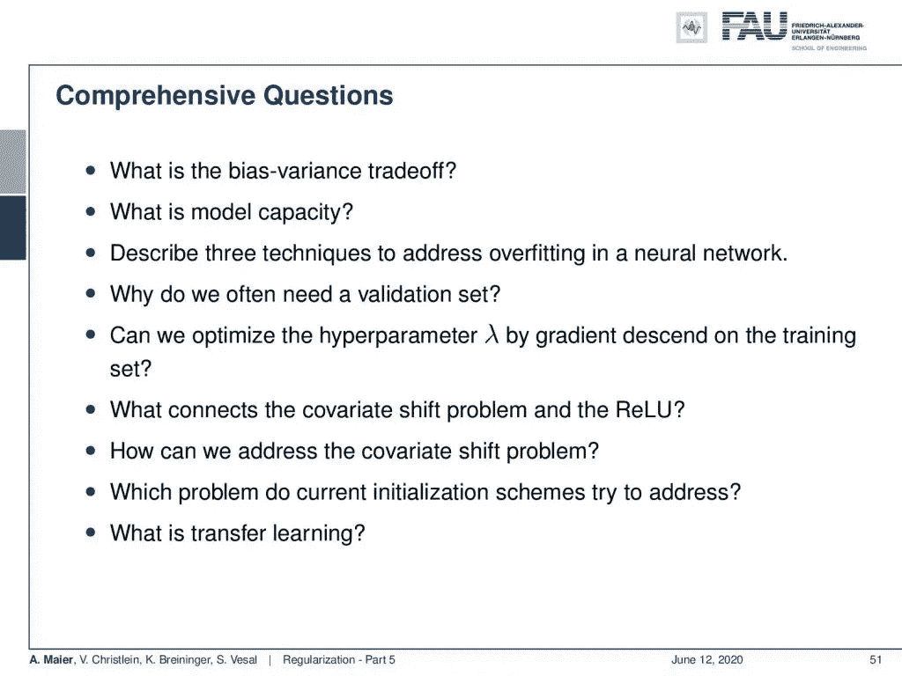

# 递归神经网络——第五部分

> 原文：<https://towardsdatascience.com/recurrent-neural-networks-part-5-885fc3357792?source=collection_archive---------45----------------------->

## [FAU 讲座笔记](https://towardsdatascience.com/tagged/fau-lecture-notes)关于深度学习

## 序列生成

FAU 大学的深度学习。下图 [CC BY 4.0](https://creativecommons.org/licenses/by/4.0/) 来自[深度学习讲座](https://www.youtube.com/watch?v=p-_Stl0t3kU&list=PLpOGQvPCDQzvgpD3S0vTy7bJe2pf_yJFj&index=1)

**这些是 FAU 的 YouTube 讲座** [**深度学习**](https://www.youtube.com/watch?v=p-_Stl0t3kU&list=PLpOGQvPCDQzvgpD3S0vTy7bJe2pf_yJFj&index=1) **的讲义。这是与幻灯片匹配的讲座视频&的完整抄本。我们希望，你喜欢这个视频一样多。当然，这份抄本是用深度学习技术在很大程度上自动创建的，只进行了少量的手动修改。** [**自己试试吧！如果您发现错误，请告诉我们！**](http://peaks.informatik.uni-erlangen.de/autoblog/)

# 航行

[**上一讲**](/recurrent-neural-networks-part-4-39a568034d3b) **/** [**观看本视频**](https://youtu.be/ZUz_u3w-sCs) **/** [**顶级**](/all-you-want-to-know-about-deep-learning-8d68dcffc258) **/** [**下一讲**](/visualization-attention-part-1-a16667295007)

如何使用 RNNs 进行序列生成？ [CC 下的图片来自](https://creativecommons.org/licenses/by/4.0/)[深度学习讲座](https://www.youtube.com/watch?v=p-_Stl0t3kU&list=PLpOGQvPCDQzvgpD3S0vTy7bJe2pf_yJFj&index=1)的 4.0 。

欢迎回到我们关于递归神经网络的视频系列的最后部分！今天，我们想谈谈递归神经网络的采样。当我说采样时，我的意思是我们想使用递归神经网络来实际生成符号序列。那么，我们怎样才能做到呢？

如果你用正确的方法训练你的神经网络。你可以用一种方式来创建它们，它们预测下一个元素的概率分布。所以，如果我训练它们来预测序列中的下一个符号，你也可以用它们来生成序列。这里的想法是，从空符号开始，然后使用 RNN 生成一些输出。然后，将这个输出放入下一个状态的输入中。如果你继续这样做，那么你可以看到你实际上可以从你训练过的循环神经网络中生成完整的序列。

贪婪的搜索。 [CC 下的图片来自](https://creativecommons.org/licenses/by/4.0/)[深度学习讲座](https://www.youtube.com/watch?v=p-_Stl0t3kU&list=PLpOGQvPCDQzvgpD3S0vTy7bJe2pf_yJFj&index=1)的 4.0 。

因此，简单的策略是执行贪婪搜索。所以我们从空符号开始。然后，我们只需选择最可能的元素作为下一个状态中 RNN 的输入，并生成下一个、下一个和下一个，这样每次实验都会生成一个样本序列。所以，这将是一个贪婪的搜索，你可以看到，我们得到的是这里构造的一个句子。我们在这里构造的句子是“让我们穿越时间”。当然，缺点是不可能有前瞻性。所以，姑且说“走吧”后面最有可能的词是“走吧”。所以你可能会产生循环，比如"走吧，走吧"等等。所以，你无法察觉“让我们穿越时间”有更高的总概率。所以，它倾向于在讲话中重复一系列频繁出现的词“和”、“这个”、“一些”等等。

光束搜索。来自[深度学习讲座](https://www.youtube.com/watch?v=p-_Stl0t3kU&list=PLpOGQvPCDQzvgpD3S0vTy7bJe2pf_yJFj&index=1)的 [CC BY 4.0](https://creativecommons.org/licenses/by/4.0/) 下的图片。

现在，我们对缓解这个问题感兴趣。这可以通过波束搜索来完成。现在，波束搜索的概念是选择 k 个最可能的元素。k 本质上是波束宽度或大小。所以，在这里你可以推出 k 个可能的序列。你有一个以这 k 个元素为前缀的，取 k 个最可能的。所以，在我们右边展示的例子中，我们从一个空单词开始。然后，我们选择两个最有可能的选项，即“让我们”和“通过”。接下来，如果我们取“through”，我们生成“let's”作为输出。如果我们用“let's ”,我们产生“go ”,我们可以继续这个过程，用我们的两个光束。我们可以在波束搜索中保留两个最可能的序列。所以现在，我们一次生成两个序列。一个是《穿越时空》，一个是《穿越时空》。所以，你可以看到我们可以用这个光束的想法来产生多个序列。最后，我们可以确定哪一个是我们最喜欢的，或者哪一个产生了最大的总概率。因此，我们可以一次生成多个序列，这通常也包含比贪婪搜索更好的序列。我认为这是从 RNN 身上取样的最常见的技术之一。

随机搜索。 [CC 下的图片来自](https://creativecommons.org/licenses/by/4.0/)[深度学习讲座](https://www.youtube.com/watch?v=p-_Stl0t3kU&list=PLpOGQvPCDQzvgpD3S0vTy7bJe2pf_yJFj&index=1)的 4.0 。

当然也有其他类似随机抽样的。这里的思路是，你根据输出概率分布选择下一个。你还记得吗，我们把单词编码成一个热编码向量。然后，我们可以将自动 RNN 的输出解释为概率分布，并从中进行采样。这就允许我们产生许多不同的序列。那么假设“let's”的输出概率为 0.8，那么它作为下一个单词被抽样 10 次中的 8 次。这会产生非常多样的结果，看起来可能太随机了。所以，你可以看到我们得到了非常不同的结果，以及我们在这里生成的序列。你也可以在生成的序列中观察到相当多的随机性。为了减少随机性，您可以增加概率或减少可能或不太可能的单词的概率。这可以通过例如温度采样来完成。这里你可以看到，我们引入了这个温度𝜏，然后我们用它来控制概率采样。这是一种常见的技巧，你已经在本课程的各种实例中看到过。

[角色级 RNNs](http://karpathy.github.io/2015/05/21/rnn-effectiveness/) 。来自[深度学习讲座](https://www.youtube.com/watch?v=p-_Stl0t3kU&list=PLpOGQvPCDQzvgpD3S0vTy7bJe2pf_yJFj&index=1)的 [CC BY 4.0](https://creativecommons.org/licenses/by/4.0/) 下的图片。

让我们看一些例子，我发现非常有趣的一件事是用 RNNs 进行基于字符的语言建模。我们这里有一篇 Andrew Kaparthy 的博文。我也把它作为下面描述的链接。在那里，他训练了一个基于莎士比亚文本生成的 RNN。它是在角色层面上训练的。所以，你只有一个字符作为输入，然后你生成序列。它产生了非常有趣的序列。这里，你可以看到已经生成的典型例子。让我读给你听:

> 唉，我想他将会到来，到那一天，小斯瑞恩将不再被喂养，
> 他只是一条锁链，是他死亡的主题，
> 我不会睡去。
> 
> *除来自* [*卡帕蒂的博客*](http://karpathy.github.io/2015/05/21/rnn-effectiveness/)

诸如此类。所以，你可以看到这是非常有趣的，这种语言的类型非常接近莎士比亚，但是如果你通读这些例子，你可以看到它们本质上完全是胡说八道。然而，有趣的是，这种语言的基调仍然存在，而且对莎士比亚来说非常典型。这真的很有趣。

创作民间音乐。 [CC 下的图片来自](https://creativecommons.org/licenses/by/4.0/)[深度学习讲座](https://www.youtube.com/watch?v=p-_Stl0t3kU&list=PLpOGQvPCDQzvgpD3S0vTy7bJe2pf_yJFj&index=1)的 4.0 。

当然，你可以产生很多很多其他的东西。我今天想给你们看的一个很好的例子是创作民间音乐。所以，音乐创作通常是用 RNNS 来解决的，你可以在文学作品中找到不同的例子，也是尤尔根·施密德胡伯的作品。这里的想法是使用更大更深的网络来产生民间音乐。因此，他们采用的是一个字符级的 RNN 使用 ABC 格式，包括生成标题。我这里有一个例子，这是一小段音乐。是的，正如你所听到的，这真的是民间音乐。这是完全自动生成的。有趣不是吗？如果你仔细听，你会听到民间音乐可能特别适合这个，因为你可能会说这有点重复。尽管如此，整首歌完全是自动生成的，这还是很棒的。实际上，人们会在真实的乐器上演奏计算机生成的歌曲，就像这些人一样。非常有趣的观察。所以，如果你对此感兴趣，我也把链接放在这里供你参考。你可以在这个网站上听到更多[的例子。](https://folkrnn.org/competition/)

图像序列生成。来自[深度学习讲座](https://www.youtube.com/watch?v=p-_Stl0t3kU&list=PLpOGQvPCDQzvgpD3S0vTy7bJe2pf_yJFj&index=1)的 [CC BY 4.0](https://creativecommons.org/licenses/by/4.0/) 下的图片。

所以也有针对非顺序任务的 rnn。RNNs 也可用于静态输入，如图像生成。然后，想法是模拟从草图到最终图像的过程。你可以看到一个例子，我们从从模糊到清晰地绘制数字开始。在这个例子中，他们使用一个额外的注意机制来告诉网络在哪里寻找。这就产生了类似于笔触的东西。它实际上使用了一种变分的自动编码器，我们将在讨论[无监督深度学习](https://youtu.be/GpAHm7dvP_k)的主题时讨论这种编码器。

RNNs 上的单元总结。 [CC 下的图片来自](https://creativecommons.org/licenses/by/4.0/)[深度学习讲座](https://www.youtube.com/watch?v=p-_Stl0t3kU&list=PLpOGQvPCDQzvgpD3S0vTy7bJe2pf_yJFj&index=1)的 4.0 。

所以我们稍微总结一下。你已经看到递归神经网络能够直接模拟顺序算法。你通过截断的反向传播来训练。简单的单元受到爆炸和消失梯度的极大影响。我们已经看到，LSTMs 和 gru 是改进的 rnn，它们明确地模拟了这种遗忘和记忆操作。我们没有谈到的是，还有很多很多的发展，我们无法在这个简短的讲座中涵盖。所以，谈论记忆网络，神经图灵机也是很有趣的，我们目前只接触了注意力和循环神经网络。在接下来的一个视频中，我们将更多地讨论注意力。

在这个深度学习讲座中，更多令人兴奋的事情即将到来。来自[深度学习讲座](https://www.youtube.com/watch?v=p-_Stl0t3kU&list=PLpOGQvPCDQzvgpD3S0vTy7bJe2pf_yJFj&index=1)的 [CC BY 4.0](https://creativecommons.org/licenses/by/4.0/) 下的图片。

所以，下一次在深度学习中，我们想谈谈可视化。特别是，我们想谈谈可视化架构，培训过程，当然还有网络的内部工作。我们想弄清楚网络内部到底发生了什么，有相当多的技术，老实说，我们已经在本课前面看到过其中一些。在这堂课中，我们真的想深入研究这些方法，了解它们实际上是如何工作的，以便弄清楚深层神经网络内部发生了什么。一个有趣的观察结果是，这也与神经网络艺术有关。另一件值得更多思考的事情是注意力机制，这也将在随后的一个视频中涉及。

综合题。来自[深度学习讲座](https://www.youtube.com/watch?v=p-_Stl0t3kU&list=PLpOGQvPCDQzvgpD3S0vTy7bJe2pf_yJFj&index=1)的 4.0CC 下的图片。

因此，我有一些综合性的问题:“与前馈网络相比，RNNs 的优势是什么？”然后当然是:“你怎么训练一只 RNN？”、“挑战是什么？”，“LSTMs 背后的主要思想是什么？”因此，你应该能够描述在培训期间展开 RNNs。你应该能够描述埃尔曼细胞，LSTM 和格鲁。所以，如果你必须在不久的将来参加一些测试，这些真的是非常重要的事情。所以，最好对这种问题有所准备。好了，下面我们有一些进一步的阅读。安德鲁·卡帕西有一篇非常好的博文。有一篇关于 [CNN 的机器翻译](https://engineering.fb.com/ml-applications/a-novel-approach-to-neural-machine-translation/)的非常酷的博文，我非常推荐阅读，还有一篇关于[音乐一代](http://www.hexahedria.com/2015/08/03/composing-music-with-recurrent-neural-networks/)的很酷的博文，你也可以在下面找到。当然，我们也有大量的科学参考。所以，我希望你喜欢这个视频，并看到你在下一个。拜拜。

如果你喜欢这篇文章，你可以在这里找到更多的文章，或者看看我们的讲座。如果你想在未来了解更多的文章、视频和研究，我也会很感激关注 [YouTube](https://www.youtube.com/c/AndreasMaierTV) 、 [Twitter](https://twitter.com/maier_ak) 、[脸书](https://www.facebook.com/andreas.maier.31337)或 [LinkedIn](https://www.linkedin.com/in/andreas-maier-a6870b1a6/) 。本文以 [Creative Commons 4.0 归属许可](https://creativecommons.org/licenses/by/4.0/deed.de)发布，如果引用，可以转载和修改。如果你有兴趣从视频讲座中获得文字记录，试试[自动博客](http://peaks.informatik.uni-erlangen.de/autoblog/)。

# RNN 民间音乐

[FolkRNN.org](https://folkrnn.org/competition/)
[MachineFolkSession.com](https://themachinefolksession.org/tunes/)
[玻璃亨利评论 14128](https://github.com/IraKorshunova/folk-rnn/blob/master/soundexamples/successes/The%20Glas%20Herry%20Comment%2014128.mp3)

# 链接

[人物 RNNs](http://karpathy.github.io/2015/05/21/rnn-effectiveness/)
[CNN 用于机器翻译](https://engineering.fb.com/ml-applications/a-novel-approach-to-neural-machine-translation/)
[用 RNNs 作曲](http://www.hexahedria.com/2015/08/03/composing-music-with-recurrent-neural-networks/)

# 参考

[1] Dzmitry Bahdanau、Kyunghyun Cho 和 Yoshua Bengio。“通过联合学习对齐和翻译的神经机器翻译”。载于:CoRR abs/1409.0473 (2014 年)。arXiv: 1409.0473。Yoshua Bengio，Patrice Simard 和 Paolo Frasconi。“学习具有梯度下降的长期依赖性是困难的”。摘自:IEEE 神经网络汇刊 5.2 (1994)，第 157-166 页。
[3]钟俊英，卡格拉尔·古尔希雷，赵京云等，“门控递归神经网络序列建模的实证评估”。载于:arXiv 预印本 arXiv:1412.3555 (2014 年)。
[4]道格拉斯·埃克和于尔根·施密德胡伯。“学习蓝调音乐的长期结构”。《人工神经网络——ICANN 2002》。柏林，海德堡:施普林格柏林海德堡出版社，2002 年，第 284-289 页。
【5】杰弗里·L·埃尔曼。“及时发现结构”。摘自:认知科学 14.2 (1990)，第 179-211 页。
[6] Jonas Gehring，Michael Auli，David Grangier，等，“卷积序列到序列学习”。载于:CoRR abs/1705.03122 (2017 年)。arXiv: 1705.03122。亚历克斯·格雷夫斯、格雷格·韦恩和伊沃·达尼埃尔卡。《神经图灵机》。载于:CoRR abs/1410.5401 (2014 年)。arXiv: 1410.5401。
【8】凯罗尔·格雷戈尔，伊沃·达尼埃尔卡，阿历克斯·格雷夫斯等，“绘制:用于图像生成的递归神经网络”。载于:第 32 届机器学习国际会议论文集。第 37 卷。机器学习研究论文集。法国里尔:PMLR，2015 年 7 月，第 1462-1471 页。
[9]赵京贤、巴特·范·梅林波尔、卡格拉尔·古尔切雷等人，“使用 RNN 编码器-解码器学习统计机器翻译的短语表示”。载于:arXiv 预印本 arXiv:1406.1078 (2014 年)。
【10】J J 霍普菲尔德。“具有突发集体计算能力的神经网络和物理系统”。摘自:美国国家科学院院刊 79.8 (1982)，第 2554-2558 页。eprint:[http://www.pnas.org/content/79/8/2554.full.pdf.](http://www.pnas.org/content/79/8/2554.full.pdf.)T11【11】w . a . Little。“大脑中持久状态的存在”。摘自:数学生物科学 19.1 (1974)，第 101-120 页。
[12]赛普·霍克雷特和于尔根·施密德胡贝尔。“长短期记忆”。摘自:神经计算 9.8 (1997)，第 1735-1780 页。
[13] Volodymyr Mnih，Nicolas Heess，Alex Graves 等，“视觉注意的循环模型”。载于:CoRR abs/1406.6247 (2014 年)。arXiv: 1406.6247。
[14]鲍勃·斯特姆、若昂·费利佩·桑托斯和伊琳娜·科尔舒诺娃。“通过具有长短期记忆单元的递归神经网络进行民间音乐风格建模”。英语。In:第 16 届国际音乐信息检索学会会议，晚破，西班牙马拉加，2015，p. 2。
[15] Sainbayar Sukhbaatar，Arthur Szlam，Jason Weston 等著《端到端存储网络》。载于:CoRR abs/1503.08895 (2015 年)。arXiv: 1503.08895。
【16】彼得·m·托德。“算法合成的连接主义方法”。在:13(1989 年 12 月)。
【17】伊利亚·苏茨基弗。“训练递归神经网络”。安大略省多伦多市多伦多大学。，加拿大(2013)。
【18】安德烈·卡帕西。“递归神经网络的不合理的有效性”。载于:安德烈·卡帕西博客(2015)。
贾森·韦斯顿、苏米特·乔普拉和安托万·博尔德斯。“记忆网络”。载于:CoRR abs/1410.3916 (2014 年)。arXiv: 1410.3916。