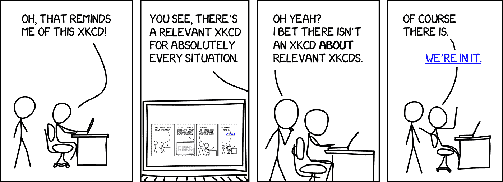
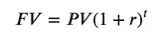
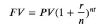

# Python 中的递归，探索

> 原文：<https://towardsdatascience.com/recursion-in-python-an-exploration-bfaa452d3260?source=collection_archive---------21----------------------->



[图片来源](https://xkcd.com/)，[牌照](https://creativecommons.org/licenses/by-nc/2.5/)

递归是那些看起来遥不可及的想法之一，可能来自编程存在的更高层次。a .你不知道它为什么是一个东西，b .你不认为你会需要利用它。毕竟，在撰写本文时， [TIOBE 指数](https://www.tiobe.com/tiobe-index/)的前 10 名中还没有函数式编程语言。再想想，再想想…

也许你是对的，递归只对编码面试有用，否则就算了。然而，我认为学习不同的编程范例，以及它们解析问题的方式，最终会让你成为一名更好的数据科学家/程序员。学习一个新的范例会让你接触到新的思维方式和不同的代码结构。“这是我们一贯的做法”不会成为你这种态度的口头表达的一部分。因此，您将学到更多知识，并能更好地解决遇到的数据挑战。另外，如果你像我一样喜欢数学，让我们面对它，如果你在做数据科学，不喜欢数学，那么现在就离开(抱歉的语气，我爱你)，然后你会发现这项练习本身就是令人愉快的。

## 什么是递归？

为了介绍递归，让我们做一个简单的、假设的例子来比较解决方案。您有一个数组或一个数字列表，在被程序的其余部分使用之前，需要对它们求平方。我们可以使用 python 中的循环或**列表理解**的**来创建平方版本。**

```
# Set array
my_array = [10,11,12,13,14,15]# Method 1
# Create a new squared array with for loop (can be considered an anti-pattern)
squared_array = []
for num in my_array:
   squared_array.append(num*num)# Method 2
# Create a new squared array with list comprehension, a bit more beautiful and concise
my_squared_array = [x*x for x in my_array]
```

> 通常，当我们在 Python 这样的命令式语言中循环值时，我们使用 **for** 循环或 **while** 循环。这些是我们已经习惯的概念，我们经常使用它们，它们是我们的第二天性。但是如果 for 和 while 循环明天被 python 砍掉了呢？除了世界上大部分停止运作，我们还有更紧迫的问题…现在如何使用递归？？

## 递归简介:平方数组

我们不能使用列表理解，所以让我们使用新的 pal 递归来平方我们的数组。为此，我们需要编写一个新的函数。

```
# Set array
my_array = [10,11,12,13,14,15]# Define our recursive, squared function that returns a new array
def squares(an_array, n=None, ret_array=None):
   if n == None:
      n = len(an_array)
      ret_array = []
   pos = len(ret_array)
   squared = an_array[pos] ** 2
   ret_array.append(squared)
   if n-1 == 0:
       return ret_array
   else:
       return squares(an_array, n-1, ret_array)
```

好吧，当一个列表理解就足够了的时候，这有点丑陋和冗长，但是它表明我们可以使用递归来代替 for 循环。该函数首先初始化一个保存平方值的新数组，使用 n 作为计数器来确定我们在按位置遍历数组时的位置，然后它调用自己，直到我们遍历了整个数组，随后得到新的平方数组。

## 有用的提示

把递归函数想象成一段代码，它不仅仅驻留在内存中的一个地方。当然，函数是在一个地方定义的，但是当数据传入时可以多次调用。这被称为**调用堆栈。不要把它想成一条蟒蛇在吃自己的尾巴，尽管许多 R 用户会欢呼。想象一下，一群克隆人传递一个小盒子，每个人放入一枚硬币，然后将盒子传递给下一个克隆人。好吧，也许现在你更困惑了。回顾以下三个案例将有助于你理解这一点，并消除你可能有的任何困惑。**

## 递归案例 1:标准阶乘

让我们用递归来做每个接触过递归的人都做过的事情，计算一个阶乘。还有谁爱离散数学！？

```
def factorial(num):
    if num == 1:
        return 1
    return num*factorial(num-1)
```

n 的阶乘(记为 n！)是所有小于 n 的正整数的乘积，是对定义为 n 的任意数的运算！= n *(n-1)*(n-2)……(1！)，其中 1！= 1.这就是我们代码中所说的**停止条件**。这个想法对递归非常重要，因为没有它，我们的代码可能会进入无限循环，导致“时间悖论，其结果可能会引起连锁反应，破坏时空连续体的结构并摧毁整个宇宙。”—布朗博士

> S **ay 什么？**

这里有一个有用的方法来形象化 4 的阶乘函数。。

阶乘(4)= 4 *阶乘(3)= 4 * 3 *阶乘(2)= 4 * 3 * 2 *阶乘(1) = 4*3*2*1 = 24

factorial 函数的每个实例都与我们在 *def factorial()* 中定义的相同，但它是一个新的实例，接受前一个 factorial 函数实例的结果并传递一个新的结果，所有这些都从基本情况 1 开始，在这种情况下，所有这些都将累积到最终计算中。

## 递归情况 2:前 N 个整数的和

下面是如何使用递归对 0 和 n 之间的整数求和

```
def sum_n(n):
    if n == 0:
        return 0
    return n + sum_n(n-1)sum_n(1000)Outputs: 
500500
```

让我们用相同操作的封闭形式来检查我们的结果，以确保我们正确地定义了递归函数。抽查总是一个好主意，因为正如理查德·费曼所说:“首要原则是你不能欺骗自己——而你是最容易被欺骗的人。”在报价中插入我和我自己，使其个性化。

```
def check_sum(n):
    return int(n*(n+1)/2)check_sum(1000)Outputs:
500500
```

## 递归案例 3:复利

你可能以前见过复利的公式。



因为我们有一个指数的数字(1+r ),那么我们可以使用递归来计算我们的未来值 FV。

```
def future_val(pv, rate, t):
    if t == 0:
        return pv
    pv = pv*(1+rate)
    return future_val(pv, rate, t-1)
```

前面的函数假设复利 n=1。这意味着我们每个周期 t 只复利一次，这里 t 通常是指一年的时间。让我们扩展我们的例子，以包括不同的复合利率，如每月。



```
def future_val_n(pv, rate, t, n):
    if t == 0:
        return pv
    pv = future_val(pv, rate/n, n)
    return future_val_n(pv, rate, t-1, n)
```

我们已经能够回收我们的 future_val 函数，并扩展它，使我们在每个时间段 t 内复利 n 次，我们的函数起作用吗？

```
future_val_n(1000, 0.07, 20, 12)Outputs:
4038.73# Now we check our value from future_val_nprint(1000*(1+0.07/12)**(20*12))Outputs:
4038.73
```

## 最后的话

记住一些事情

1.  我们不一定要有一门纯函数式语言才能开始在我们的代码中使用函数式编程技术
2.  Python 不是一种纯粹的函数式语言(当然)，但借鉴了它们的许多特性，比如作为第一类对象的函数和命名一对夫妇的列表理解。

考虑到这两点，我们意识到 python 对函数的递归调用次数有限制。此限制定义如下:

```
sys.getrecursionlimit()Outputs:
3000
```

如果我们在 n>3000 的情况下运行 sum_n 函数，它将抛出一个 **RecursionError** ，即使该函数适用于小于限制的递归深度。这是在将这些类型的函数合并到 python 代码库时需要考虑的事情。

既然你已经知道了递归，你将开始用不同的方式看待事物，也许你的下一个项目会有一些创造性的解决方案。我希望这是对递归和函数式编程范例的有趣而有启发性的介绍！