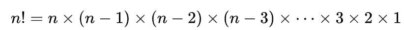
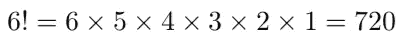

# Python 中的递归

> 原文：<https://towardsdatascience.com/recursion-in-python-b026d7dde906?source=collection_archive---------32----------------------->

## 理解 Python 中的递归


[来源](https://www.pexels.com/photo/apple-blank-business-computer-442574/)

在计算机科学中，递归是一种使用同一问题的较小解来寻找问题的解决方案的方法。递归算法在列表排序、二叉树遍历、路径查找等等方面都有应用。在本帖中，我们将讨论一个用于寻找自然数阶乘的经典递归过程。

我们开始吧！

因为我们将编写一个算法来寻找阶乘，所以有必要回顾一下阶乘的定义。自然数的阶乘， *n* ，是所有小于或等于 *n* 的自然数的乘积:



例如，如果 *n* =6:



让我们递归地思考这个问题。如果我们有一个递归函数 *f* ，我们想用 *f* 来计算 6！以下面的方式:

6!= *f* (6)

*f* (6) = 6* *f* (5)

*f* (5) = 5* *f* (4)，所以*f*(6)= 6 * 5 **f*(4)

*f* (4) = 4* *f* (3)，所以*f*(6)= 6 * 5 * 4 **f*(3)

*f* (3) = 3* *f* (2)，所以*f*(6)= 6 * 5 * 4 * 3 **f*(2)

*f* (2) = 2* *f* (1)，所以*f*(6)= 6 * 5 * 4 * 3 * 2 **f*(1)

*f* (1) = 1，所以 *f* (6) = 6*5*4*3*2*1。

为了在 python 中实现这一点，我们需要定义一个函数，我们将调用“recursive_factorial”，它接受输入 *n* ，并返回*n** recursive _ factorial(*n*-1)。此外，我们希望函数不断返回自身，直到输入等于 1。此时，我们返回 1，递归终止。为了实现这一点，我们执行以下操作:

```
def recursive_factorial(n):
    if n == 1:
        return 1
    else:
        return n*recursive_factorial(n-1)
```

另外，我们应该处理 *n* =0 的情况，给定 0！=1.让我们适当地改变 if 语句:

```
def recursive_factorial(n):
    if n <= 1:
        return 1
    else:
        return n*recursive_factorial(n-1)
```

另一件值得注意的事情是，我们的函数不处理负数。这个方法只对自然数和零有效。

我们来考虑一下这个函数对于 4 来说是做什么的！：

```
We have to calculate recursive_factorial(4).The function asks, is n = 1? No, n=4, so let's return 4*recursive_factorial(4 - 1), which is 4*recursive_factorial(3).Now we have to calculate recursive_factorial(3). Is n = 1? No, n=3, so let's return 4*3*recursive_factorial(3 - 1), which is 4*3*recursive_factorial(2).Now we have to calculate recursive_factorial(2).Is n = 1? No, n=2, so let's return 4*3*2recursive_factorial(2 - 1), which is 4*3*2recursive_factorial(1).Now we have to calculate recursive_factorial(1).Is n = 1? yes, n=1, so let's return 4*3*2*1.
```

其中 *n* > 1 的情况称为递归情况，当 *n* < = 1 时，我们有基本情况。

根据这一逻辑，recursive _ factorial(4)= 4 * 3 * 2 * 1 = 24。让我们验证一下:

```
def recursive_factorial(n):
    if n <= 1:
        return 1
    else:
        return n*recursive_factorial(n-1)
print("4! =", recursive_factorial(4))
```


让我们试试前面的例子，6！：

```
print("6! =", recursive_factorial(6))
```


我将在这里停下来，但是您可以随意摆弄代码。如果你有兴趣学习更多关于递归的知识，python-course.edu 是一个很好的资源。

总之，在这篇文章中，我们讨论了如何编写一个递归算法来寻找一个自然数的阶乘。递归算法的其他经典应用包括[汉诺塔问题](https://www.python-course.eu/towers_of_hanoi.php)和[第 N 个楼梯问题](https://www.geeksforgeeks.org/count-ways-reach-nth-stair-using-step-1-2-3/)。我希望你觉得这篇文章有用/有趣。这篇文章的代码可以在 [GitHub](https://github.com/spierre91/medium_code/tree/master/data_structures_and_algorithms) 上找到。感谢您的阅读！