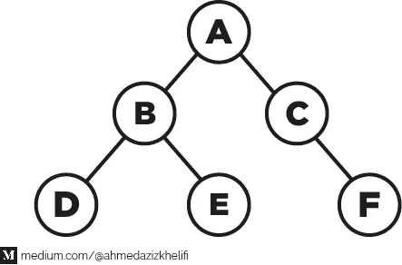
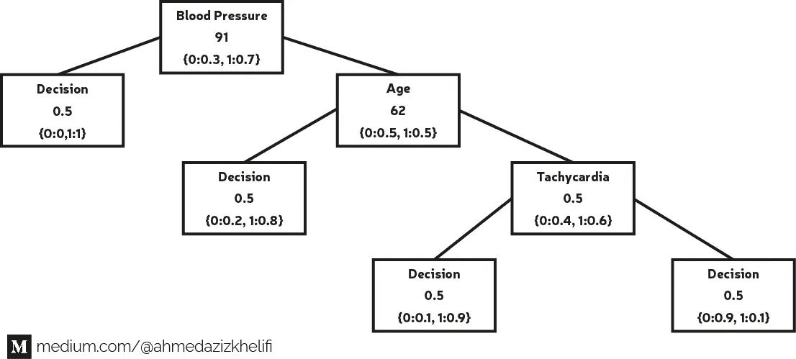

# Python 中的递归函数

> 原文：<https://towardsdatascience.com/recursive-function-in-python-36f8b833c847?source=collection_archive---------22----------------------->

## 数据科学

## 数据科学领域的例子


照片由[Tine ivani](https://unsplash.com/@tine999?utm_source=medium&utm_medium=referral)在 [Unsplash](https://unsplash.com?utm_source=medium&utm_medium=referral) 上拍摄

# 目录

*   什么是递归？
*   程序设计中的递归
*   来自数据科学世界的例子
*   结论

# 什么是递归？

递归是一个在操作中引用自身的概念。这在所有艺术领域都可以找到:文学(mise en abyme)、绘画、摄影……
一个物理世界的例子是将两个平行的镜子面对面放置。它们之间的任何对象都将被递归反射。
我们每天在定义词的时候都会用到递归！事实上，我们用词来定义他人，而他人也被其他词所定义！

# 程序设计中的递归

在编程中，它是一个引用自身的函数。两个函数可以互相调用，这叫相互递归。让我们用一个数学界的例子:阶乘。自然数`n`的阶乘是小于等于`n`的严格正整数的乘积。记为`n!`，计算如下:`n! = (n-1)!*n`。

在你的头脑中运行这个算法，你会发现它永远不会停止，它会无休止地运行。的确，如果我们用`n = 3`执行函数，T5 会被`n = 3`调用，然后`n = 2`，然后`n = 1`，然后`n = 0`，然后`n = -1`，等等。

> 一个永不停歇的算法是个问题，可想而知！

因此，解决方案是指定**一个停止条件**，这将始终取决于我们的问题。在我们的例子中`3! = 3*2*1`。您会注意到不同的因子(3、2 和 1)从不为负，甚至不等于 0。正是这个条件为我们提供了一个停止条件:“因子决不能小于或等于 0”。所以，我们添加一个条件语句:

> 在函数内部调用函数被称为递归调用。
> 
> 递归调用必须在条件语句中。

**注:**每一次递归都可以转化为迭代。

# 来自数据科学世界的例子

## 1.二叉树结构的表示:

二叉树是由称为节点的元素层次结构形成的数据结构。节点由两类信息表征:

*   节点特定信息
*   描述与其后代节点的链接的信息

二叉树总是由一个节点指定:它的初始节点叫做根节点。
每个节点最多有两个子节点:

*   如果该节点正好有两个子节点，它们被称为 t *左子节点*和*右子节点*。
*   如果该节点只有一个子节点，这是左子节点*或右子节点*。**
*   如果节点没有子节点，它被称为*叶节点*。

树枝是从树根到树叶的路径。

因此，二叉树是一个**递归结构**，因为左子树和右子树本身就是节点(依次代表树)。



二叉树图。源作者

这个图表示一个二叉树，它的节点 A 是根，B 是它的左孩子，C 是它的右孩子。节点 C 只有一个子节点 F(右子节点)。d、E 和 F 是叶节点。
【A，B，D】，【A，B，E】，【A，C，F】是树的分支。

让我们创建类节点:

**属性:**

*   ***标签*** :表示观察的字符串。
*   ***左*** :表示左子的类的实例。
*   ***right*** :代表右孩子的类的实例。

**方法:**

*   ***__init__:*** 构造函数。
*   ***__str__:*** 根据以下示例返回表示树的字符串
*   ***线性化:*** 递归方法返回一个树形分支列表。

```
NodeFigure = Nd = Node('A',Node('B', Node('D'), Node('E')), Node('C',None,Node('F')))**>>> print(NodeFigure)**
Node(A,Node(B,Node(D),Node(E)),Node(C,None,Node(F)))
```

## 2.决策模型的表示

数据集表的切片

决策规则可以用二叉树来表示，称为**二叉决策树**。例如，对于下表中的数据集，可以构建下图所示的二元决策树。



在这一部分中，我们将创建 DecisionNode 类，它从 Node 类继承并表示一个二叉决策树。

**属性:**

*   ***标签*** :表示观察的字符串，继承自 Node 类。
*   ***distr*** :代表每个决策概率的字典:
    ——每个**键**代表一个可能的决策 0 或 1。
    -每个**值**都是一个代表决策概率的实数。
*   ***threshold:*** 一个实数代表测试阈值，用来推导要跟随的分支。
*   ***left*** :表示左侧子节点的类的实例，继承自 Node 类。
*   ***right*** :代表右子的类的实例，继承自 Node 类。

**方法:**

*   ***__init__:*** 构造函数(从节点继承)
*   ***__str__:*** 根据以下示例返回表示树的字符串

```
#Create the instance
left = DecisionNode('Decision', {0:0,1:1}, 0.5)
right = DecisionNode('Age',{0:0.5, 1:0.5},62,
                     DecisionNode('Decision', {0:0.2, 1:0.8},0.5),
                     DecisionNode('Tachycardia',{0:0.4,1:0.6},0.5,
                         DecisionNode('Decision',{0:0.1, 1:0.9},0.5),
                         DecisionNode('Decision',{0:0.9, 1:0.1},0.5)) )
DecisionNd = DecisionNode('Blood Pressure', {0:0.3,1:0.7},91, left, right)**>>> print(DecisionNd)**IF Blood Pressure >= 91  THEN Decision = {0: 0, 1: 1}
IF Blood Pressure < 91 AND Age >= 62  THEN Decision = {0: 0.2, 1: 0.8}
IF Blood Pressure < 91 AND Age < 62 AND Tachycardia >= 0.5  THEN Decision = {0: 0.1, 1: 0.9}
IF Blood Pressure < 91 AND Age < 62 AND Tachycardia < 0.5  THEN Decision = {0: 0.9, 1: 0.1}
```

# 简而言之:如何编程一个递归函数？

1.  将问题分解成一个或多个同类型的子问题。子问题通过递归调用解决。
2.  子问题应该比原问题小。
3.  最后，分解必须产生一个不分解成子问题的基本问题(**这是停止条件**)。

## 资源:

*   [http://www.ipeis.rnu.tn/concours_nationaux/concours.htm](http://www.ipeis.rnu.tn/concours_nationaux/concours.htm)
*   [https://www.geeksforgeeks.org/recursive-functions/](https://www.geeksforgeeks.org/recursive-functions/)

**感谢阅读！😄**


查看我的其他文章，并在[媒体](https://medium.com/@ahmedazizkhelifi)上关注我

哈利菲·艾哈迈德·阿齐兹