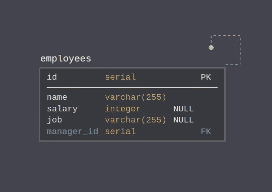
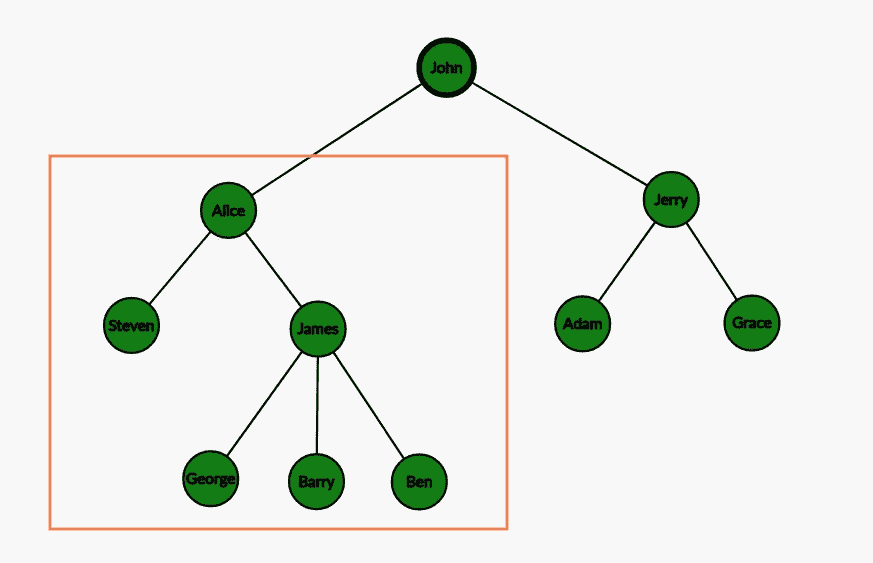
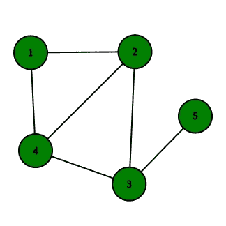

# 使用 PostgreSQL 的递归 SQL 查询

> 原文：<https://towardsdatascience.com/recursive-sql-queries-with-postgresql-87e2a453f1b?source=collection_archive---------2----------------------->

## 公共表表达式是 SQL 的一个鲜为人知的特性，它使得编写递归查询成为可能。让我们用 PostgreSQL 来探索一下吧！

照片由[卢德·洛伦兹](https://unsplash.com/@luddelorentz?utm_source=unsplash&utm_medium=referral&utm_content=creditCopyText)在 [Unsplash](https://unsplash.com/?utm_source=unsplash&utm_medium=referral&utm_content=creditCopyText) 上拍摄

在使用数据库时，大多数时候，你需要的只是`SELECT`、`UPDATE` (CRUD 操作)、几个`JOIN`和`WHERE`子句，仅此而已。但是，有时您会遇到数据集和任务，这将需要您使用更高级的 SQL 功能。其中之一是 CTE 或*公共表表达式*，更具体地说是*递归 CTE* ，我们可以用它来进行递归 SQL 查询。让我们看看它是如何工作的，我们可以用它做什么！

# 为什么是递归查询？

首先，为什么这实际上是一件事？递归查询有什么好处？—通常，当处理自引用数据或类似图形/树的数据结构时，递归查询很方便。这些使用案例的几个例子是:

自参考数据:

*   *经理- >下属(员工)*关系
*   *类别- >子类别- >产品*关系
*   图表—飞行(飞机旅行)地图

树木:

*   任何分类系统——书籍、动物、遗传学…
*   文章之间的链接——例如在维基百科上
*   评论部分—例如 Reddit 上的主题

对于这些示例中的任何一个，都需要您构建临时表或使用游标来从这样的数据集中获取有用的数据。现在，我希望让您相信递归查询非常有用，让我们看看它们是什么以及如何使用它们。

# 我们需要什么？

递归查询利用了一种叫做 *CTE 的东西——公共表表达式*，它是 SQL `WITH`子句，更常用于简化非常复杂的查询(子查询)。让我们来看一个例子:

这是一个非常简单的例子，但是您可以想象如何使用它来使包含多个子查询的非常复杂的查询更具可读性。

除了上面的语法，我们还需要一些可以用于递归查询的数据。为此，我们将使用*经理-下属*层级，使用一个自引用表，定义如下:

员工表

下面的 SQL 创建了这样一个表，其中包含一些要使用的数据:

所以，现在我们来构建一些递归查询吧！

> *重复是人类的，重现是神圣的——l·彼得·多伊奇*

# 递归

让我们从递归 SQL 查询的正式结构开始:

它看起来很简单，但并没有告诉我们太多，所以让我们看一个人类可读的例子:

该查询的输出是:

在这个例子中，我们的非递归基本情况只是`SELECT 1`，递归部分是`SELECT n+1 FROM nums WHERE n+1 <= 10`。这部分通过引用 *CTE* ( `nums`)的名字并联合所有结果来创建递归。最后，我们有`WHERE`子句来终止递归，这样我们的查询就不会无限地运行。

# 真实世界的例子

前一节展示了一个非常基本的例子，解释了它是如何工作的，但并没有真正展示递归 *CTE* 如何帮助我们。因此，让我们使用上面的*经理-下属*层级数据来看一些例子:

为某些员工获取*【经理树】*:

这个查询可以用来生成某个经理的所有下属的列表，它实际上是从某个特定雇员开始的子树。作为这里的一个基本案例，我们通过 ID 选择一个员工(经理),我们还包括了`level`,以表明我们在树中向下走了多少层。在递归部分，我们使用经理 id 将雇员表从 T5 转到 CTE。同样，我们通过增加上一步递归的结果级别来包含`level`。这是输出:

为了更好地想象那里发生了什么，请看下面的树。突出显示的部分是查询返回的内容:

另一个使用相同数据的实际例子是计算两名员工的*离职程度*:

递归 *CTE* 与前一个例子非常相似。为了简单起见，我们只选择 ID 和`degree`(而不是等级)。接下来，我们需要一个查询来查找并告诉我们两个雇员的离职程度——为此，我们将`employees`表连接到我们之前构建的包含 id 的`rec`表，并在各自的表中使用 id 连接`degrees`。在最后的`SELECT`部分，我们做了一些格式化以获得更好的输出，在`WHERE`子句中，我们可选地指定另一个(第二个)员工，我们希望得到他们的离职程度。输出:

同样，用同样的数据，让我们来看看在假设的公司里工作进展可能是怎样的:

这次我们从下往上运行递归。与前面的例子相比，这是通过翻转`ON`子句来实现的。为了创建可读的输出，我们使用了`STRING_AGG`函数，它从`SELECT`上面获取行，并使用`>`作为分隔符将它们连接起来。这是查询给我们的结果:

# 图的递归

足够多的*雇员*数据集，让我们探索一下我们能用图做什么——图作为一种数据结构是使用递归进行遍历的理想选择。因此，让我们首先定义一个简单的表并插入一些数据，这样我们就有东西可玩了:

图表

作为一个例子，我们将做一件显而易见的事情——用图的形式寻找路径。为此，我们将需要一个特殊的数据类型*PostgreSQL*—`ARRAY`。数组不是常见的关系数据库特性，但在这里存储路径非常方便。如果您不熟悉这种数据类型，下面是理解 SQL 所需的一些东西:

*   创建阵列— `ARRAY[value_1, value_2]`
*   串联数组— `ARRAY[value_1, value_2] || ARRAY[value_3]`
*   `ALL`函数- `"x" != ALL(ARRAY["a", "b", "c"])` -将`"x"`与数组中的每个值进行比较，如果所有比较的结果为`true`，则结果为`true`

好了，现在是问题:

上面的查询首先选择非递归情况下的所有直接邻居。然后在递归部分，我们建立在基础情况上(并且在随后的迭代过程中在先前的递归情况上)，并且将可用的边附加到现有的路径上，并且用相同的边替换目的地。我们对现有路径的终点(`dest`)与所选边的起点相同且新目的地尚未在路径中的每一行都这样做(以防止循环)。这是全部输出:

除了上面有用的东西，你还可以对无限数据流使用递归 *CTE* :

递归表是通过每一步迭代构建的，每一步产生有限数量的行，因此可以使用`LIMIT`从无限查询中检索第一个`n`行！

# 额外收获:递归视图

作为一个小奖励，我还想展示一下(从 PostgreSQL 9.3 开始)甚至可以创建递归视图:

尽管这只是语法上的好处，但在处理一些递归查询和数据时，它会让您的生活变得更加轻松。

# 结论

递归是一个非常强大的工具，它能以一种非常优雅的方式解决一些问题。不过，在 SQL 中使用它并不常见，所以希望本文向您展示了如何利用它的一些方法，以防您遇到只能递归处理的数据。

然而，递归会降低代码的可读性，所以要谨慎使用，尤其是在 SQL 中，因为即使没有递归，解析和理解也不是那么容易。

*本文原帖*[*martinheinz . dev*](https://martinheinz.dev/blog/18)