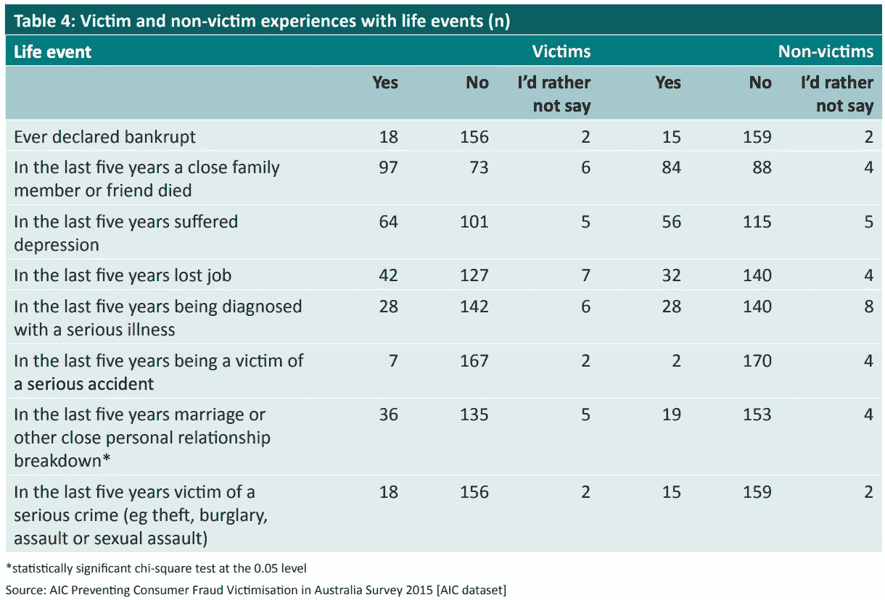
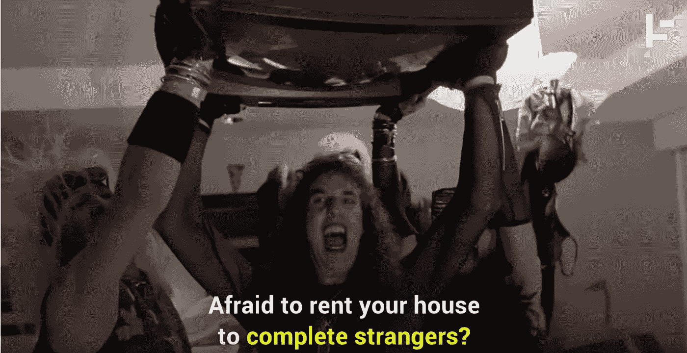

# 红色标记！！一个简单的分数如何影响你的一生。

> 原文：<https://towardsdatascience.com/red-flagged-how-a-simple-score-can-affect-your-life-e6bc2d6b76ec?source=collection_archive---------39----------------------->

## 欺诈和数字支付的问题

Yaneev 由 Pixabay 提供

在过去的学生时代，当人们用现金支付工资时，在借记卡、信用卡或在线商务出现之前，装甲卡车在街上游荡，将现金送到工资发放办公室，在那里，钱会被及时清点并装入棕色的小信封，然后发给工人。

现金仍然与数字支付流分层，但政府打击黑市经济、避税和犯罪洗钱，以及打击恐怖主义融资，意味着一个越来越西方化的无现金社会。

当然，这样做的问题是，不是现金所有者的人可能会欺诈性地获得资金。由于商品供应和支付之间的数字距离,*识别资金操作者是否实际上是所有者的核心问题*，这个问题在现金中不存在，因为资金与支付令牌是分开的，现在变成了一个问题。

## **银行如何努力消除信用卡欺诈是我们得分的开始**

因此，接下来发生的是，每个卡支付事件都应该经过[两级验证](https://www.auspaynet.com.au/sites/default/files/2019-07/IAC%20Volume%207%20V9%20-%20Effective%201%20July%202019%20-%20public_0.pdf):

1.  支付事件本身及其与客户账户主记录以及地理位置、数量、终端 IP、时间、购买模式的关系；和
2.  通过“弹出框”、手机应用程序或输入全名、出生日期和地址，对账户持有人的身份进行强有力的支付事件认证；例如，还匹配送货和帐单地址。

所以，如果我住在澳大利亚，但一组来自保加利亚的欺诈性信用卡交易被阻止了？公平的决定。但那会留在我的记录里。

由于澳大利亚一家典型的大型银行每月处理高达 1.3 亿笔支付，因此根据公开的 [Kaggle 信用卡欺诈训练数据集](https://www.kaggle.com/mlg-ulb/creditcardfraud)可以粗略推断，只有 0.172%的交易被确认为欺诈。如果 1.3 亿笔支付中有一半涉及银行卡，那么一家银行每月仍有约 11.2 万笔潜在的欺诈性银行卡交易。

尽管信用卡和借记卡号码内置了使用 Luhn 支票进行验证的功能，CVV 号码也有所帮助，但通过黑客、ATM 盗用、在线盗用和社交工程非法获取的大量卡号在网上随处可见，这意味着这是电子商务领域最大的问题之一。

在大多数在线欺诈案例中，如果欺诈不是由客户实施的，那么如果信用卡存在(CP)，作为发卡机构的银行将承担损失。在使用 EFTPOS 商户终端而没有卡(CNP)的在线交易中，损失由商户承担。澳大利亚的商户每年花费大约 5 亿澳元来解决无卡欺诈。因此，这是一个很大的问题，它会侵蚀商家的利润空间，还会导致废弃的购物车，商家会理所当然地说“我不能确定你就是你”。也是发卡方在冻结后重新发卡的成本。

虽然 1 级和 2 级验证是绝对有保证的，以防止有动机和机会的预谋的匿名黑客，但这变得有些复杂的是“风险分数”的概念，它基于客户自己实施欺诈或实际上成为欺诈受害者的倾向。

分数(满分为 100 分)类似于信用评分。日常客户实施的典型欺诈是应用程序欺诈。比如在申请增加信贷时虚报收入。“分数”会根据你的生活事件而变化，尤其是失业、关系破裂或破产…

澳大利亚犯罪学研究所，趋势与问题№2019 年 4 月 577 日

…此外，账户持有人同事的行为——已知同事的网络和他们的“分数”——会影响账户持有人的倾向“分数”,反之亦然。也就是说，如果一个已知的合作伙伴被证实从事欺诈活动，它会影响到你。

他们怎么会认识你的同事？很容易，通过脸书或推特。通过你付钱给的人，或者他们付钱给你的人，你的联系人。通过他们自己的 CRM 系统主数据层次结构。

这些分数也适用于那些被发现以低评级或高回报为基础欺骗顾客的商家。

## 不仅仅是银行用这种方式跟踪我们。

[2020 年](https://www.youtube.com/watch?v=oWYEhgXu7HM&feature=youtu.be)

Airbnb 显然不以执行自己的政策而闻名，在收购在线背景调查公司[“Trooly”](https://www.standard.co.uk/tech/airbnb-software-scan-online-life-suitable-guest-a4325551.html)后，它正在应用类似的自动化方法对客户和主人的“特质”进行描述和评分，如精神变态或自恋:

> 该专利称，博客和新闻网站上的帖子也被考虑在内，以形成“人物图”

使用 NLP 技术的特质分析是一种语言分析形式，它要么使用单词的分类法及其上下文来对情绪进行分类，这种情绪被映射到性格模型，在基本级别上类似于 Myers-Briggs，甚至是[自动编码](https://doi.org/10.1016/j.neucom.2013.09.055)。这是更进一步，使用 ML 技术来判断你的在线“个性”，并标记和过滤掉危险行为属性的申请人。还有一个事实是，现在很容易识别发布的不当图片，并将其计入[信任“得分”。](https://www.airbnb.com.au/trust)

因此，如果 Airbnb 可以这样做，从而[终身禁止顾客](https://medium.com/@jacksoncunningham/digital-exile-how-i-got-banned-for-life-from-airbnb-615434c6eeba)，那么拼车平台也可能这样做，或者易贝或亚马逊等。

## 为什么这有问题？

以这种方式将 ML/AI 技术应用于风险/信任评分人员的问题在于:

1.  出错的倾向；
2.  人类个性的浅薄模型被用来对人进行自动分级和评判；
3.  缺乏赎罪的机会；和
4.  强化学习居然漏进社会培训*美国*。

在出现错误的情况下，银行有可能为你的情况辩护，事实上，你可以去找[调查官](https://www.fos.org.au/)并花费精力来纠正这种误解。信不信由你，在这些事情上，银行实际上是高度诚信的。对于像 Airbnb 这样的私人组织，投诉可能会被置若罔闻。

因为可能给我们打分的模型是基于数据的，并且在后台自动运行，所以对它们和它们的理论基础(如[大脑的计算理论](https://medium.com/towards-artificial-intelligence/how-neuroscience-and-ai-play-politics-with-our-brains-b2052947a86a))进行争论将变得几乎不可能。

此外，一些用于做这件事的 DNN 技术由于它们的黑盒性质而无法解释。这意味着，一旦被标记，*不管是对是错*，那面旗帜就好像我们衬衫背后的一个污点，可能永远不会被发现；由于许多非政府组织不受信息自由或监察员的监督，国旗可能会禁止赎回的可能性。

当我们凭经验学习这些评分“游戏”的规则时，这些规则在获得资金、住宿或交通的可用性方面对我们产生了真正的影响，我们是否会*自己*受到训练和约束，以双向机器-人类模式的性质来缓和曾经被视为普通的自由言论？

现在自动获得的言论自由，以及在我们同意下被评分算法断章取义的*【1】限制了我们现在拥有的令人惊叹的社交工具的潜力。如果我们的同事被发现有所欠缺，他们自己的分数会影响我们的分数，这是因为像脸书这样的社交媒体所依赖的网络或图表的性质。*

*使用这些评分技术的公司的权衡是，如果他们过于积极地训练模型，以最大限度地降低风险，假阳性率将增加到这样的程度，即受到不当惩罚的客户将流失并找到替代方案，从而降低品牌资产和股东价值。*

*这里的一个解决方案是进行人工调查审查，但这很昂贵，而且使用 Keras 和 CloudML [2]等技术的 [DNN 技术自动编码分数](https://blogs.rstudio.com/tensorflow/posts/2018-01-24-keras-fraud-autoencoder/)，无论如何都不可能，而且数量非常大。*

*随着这些评分型方法渗透到日常生活的更多方面，试图消除风险并增加未知参与者之间的信任，我认为我们将开始看到评分模型本身的强化奖励和惩罚成为我们必须遵守的[政治正确性的一个方面](https://medium.com/the-digital-ethicist/the-cult-of-pc-and-the-imperative-of-free-thought-fe2dd2b26411)，因为社交媒体表达中的语言变得越来越狭隘，基于互联网的对话的新私人渠道越来越多地出现在主流的审查之外【3】。*

***脚注***

*[1]通过服务的隐私条款，您可以了解他们在法律上有权以“研究”为目的共享数据。例如:[https://policies.google.com/privacy?hl=en#infosharing](https://policies.google.com/privacy?hl=en#infosharing)*

*[2]尽管可以使用修改的随机森林模型作为分类器。*

*【3】类似[茧](https://www.technologyreview.com/s/615094/why-private-micro-networks-could-be-the-future-of-how-we-connect/)的私人微网。*