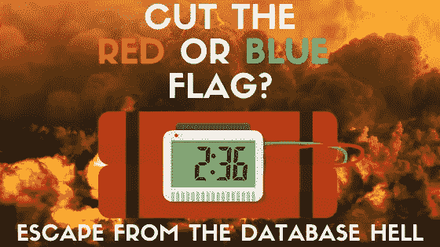

# 红色或蓝色标志:切断正确的电线。

> 原文：<https://towardsdatascience.com/red-or-blue-flag-cut-the-right-wire-7a19f57c85b5?source=collection_archive---------34----------------------->

## 旗帜图案的阴暗面带来了数据库噩梦。看了才信。

你记得九十年代的动作电影吗？其中一半有炸弹，英雄必须拆除它。我在 IT 环境中看到了同样的情况。睡不好的次数太多了。你不相信吗？嗯，有一种炸弹进入了软件，它的名字叫做 flag。我会解释原因。

# 旗帜和独角兽的故事

曾经有一段时间，软件躺在旗子上。我们可以称这个时代为“旗帜时代”。那是它的中世纪时代。那时没有任何团队或开发流程。你是开发人员(与“印刷工人”没有太大区别)，有人拍拍你的肩膀开始一项任务或解释一项业务需求。好吧，如果你太年轻不知道，或者太老不记得，我会试着告诉你。想象一下这种情况。像往常一样，你是开发者。你开发了一个订单输入表单。那时，后端和前端之间没有任何区别。你必须完成工作，而不仅仅是一部分。幸运的是，您的应用程序工作正常，许多用户可以使用您编写的程序完成销售订单，没有任何限制，除了它是一个控制台应用程序这一事实。有一天老板来找你，拍拍你的肩膀(可能他不知道什么是电子邮件！)而责怪软件是因为有人在订单关闭后更改了销售订单。所以，你浪费了五分钟来解释软件是好的 bla，bla bla…但最后，你不得不改变软件。更简单的解决方案是什么？只需在销售订单表中添加一个布尔列，称之为“已发送”，如果它是真的，则不能更改销售订单。真或假足以定义程序的行为。好吧，你完成了工作，然后高高兴兴地回家。上任的第二天简直是地狱。流向 WMS(仓库管理系统，或者新手的“谁把你的产品送到商店”)的数据流失败了，你有数千个订单因此而受阻。老板在尖叫，所以你必须跑到 BI 办公室，明白桌子上新的血淋淋的柱子把一切都打碎了。世界得救了，老板却又来找你。他非常愤怒，因为有人能够在订单已经包装但尚未发货的情况下更改销售订单。好吧，接下来呢？您是否会向表中添加另一个布尔标志，这可能会导致 ETL 的另一个中断？绝对没有。在那个时候，改变数据库中的某些东西是相当昂贵的，并且许多应用程序共享同一个数据库。此外，公司像筒仓一样工作，改变一个数据库中的一点可能会中断到其他系统的数据流，通过 ETL 在一夜之间严格地移动。你迟早会从皮肤上学会的。

解决方案很简单，您将列从 boolean 改为 char(一个 char 允许使用英语字母表的 26 种可能性，并且您可能有很多机会获得有意义的字母)。您跑到 BI 办公室请求更改，给出的规则是:“只考虑州‘S’中的行，因为‘S’代表‘shipped’”。你没有在代码中对此写任何评论。你没有写任何文档。很明显。“S”代表“已装运”。为什么我应该忘记它？

但是随着时间的推移，你使用了几乎所有的字母来满足所有的业务需求。您引入了如此多的订单状态，以至于每次有人问您销售订单状态时，您都会感到头疼。即使在家里，当你在亚马逊上购物并收到确认邮件时。您在 BI 的同事已经退休，新同事不知道他必须接受标有 S、R、T、L 的销售订单，但不能接受日期比昨天早的 X 状态。很多人都在问为什么“特殊”状态是 X，而你不能回答“S”已经取自“发送”或者“X 在开始时听起来很酷”。但是最坏的情况是，当你有了一个新同事，他对你的销售订单状态编码一无所知，所以他创建了一个新的列。他不能称之为状态，因为已经有另一个人用了这个名字，所以他用了“进步”这个词。这意味着现在 BI 需要知道可以接受状态为 S、R、T、L 的订单，但不能接受日期早于昨天的 X 状态的订单，更不能接受进度标志设置为 28 的销售订单。(刚刚校对完最后一句，我有点头疼..).因为您的同事是第三范式的数据库纯粹主义者，所以他使用了一个外部表来列出所有可能的进度值。偶尔，一些订单没有发货或有一些延迟，当你想到销售订单时，你仍然有些头痛。一切都很正常，就像过去 30 年里一样。你微笑。明天你就要退休了，所有的麻烦都会流向你的新同事和它的第三人称数据库。

# 带什么回家

我希望你在读这个故事的时候笑一笑。任何与事实或你可能认识的人的相似之处完全是巧合😃标志是操纵应用程序业务逻辑的一个很好的选择。一切都是通过改变数据发生的。确实如此。

## 与旗帜相关的问题有哪些

标志的问题在于，它并不总是清楚标志的改变对应用程序的影响是什么，或者你需要什么样的改变来获得期望的行为。这是因为应用程序的逻辑在源代码内部。源代码可能有数吨行，可能由许多人花费大量时间编写。此外，事实上，在大多数情况下，开发人员都很匆忙，没有时间处理文档……嗯，标志管理可以在几分钟内变成地狱。

## 穷人旗帜规则

以下是一般规则的简短列表:

*   **并不总是有参考的表格才是解决方案**。一个标志仅仅是一个字母，你可能会被要求使用一个表格来增加更多的信息。这是真的，但是…谁来补充这个描述呢？我见过太多的解码表，有 PK、简短描述、详细描述和注释，其中的列是空的，或者只有无意义的文本，这让我感到厌烦。这让我实现了一个简单的咒语。**以正确的方式做事，但要从头到尾。**如果管理不当，引入空表只会增加开销。
*   **记录下来。**每个概念只使用一面旗帜，清楚地列出可能的价值和结果。数据库中的表是一个很好的解决方案，但是隐藏了一些问题。首先，只有开发人员可以看到它，但分析师或项目经理也可能想知道 flags 是如何工作的。例如，哪些销售订单状态适合发送。第二，与没有任何格式的 1000 个字符的数据库字段相比，word 文档中有更多的空间来描述所有可能的场景。
*   **切勿剪断红色电缆。**更换旗帜时，不能剪错线。先看文档。如果没有任何文档，请询问您的同事并仔细检查源代码。你发现的一切都必须记录在案，否则，我们将重新开始！

## 当标志起作用时

如果我让你相信旗子是邪恶的，请原谅我。可能我对这个工具的印象不好。基本上，数据库上的标志列只是一个枚举。当枚举足够好(完整且稳定)时，一切都会变好。这里有一些你需要满足的条件:

*   标志必须只在一个地方定义一次。你需要一个完整的枚举，每个值都必须有解释
*   标志必须只在一个地方定义一次。
*   不能更改标志。如果在代码中定义，请将它们设为只读。枚举是一个不错的选择。
*   每个标志值必须有一个含义。不要有一个“shipped”标志，如果填写了装运日期，则表示“Shipped ”,如果数据为空，则表示“Shipping”。
*   使用有意义的名字。你不需要为角色付费，只需要使用它们。
*   小心你赋予旗帜的角色。它是一行的状态还是驱动代码的一部分？

# 礼貌的结论

我们总是认为架构、基础设施和技术是软件成功的关键因素。有时候威胁来自内部。我的愚蠢的故事解释了一个糟糕的开发过程，糟糕的管理和沟通(书面和口头)的泄漏如何在噩梦中改变一个工作软件。