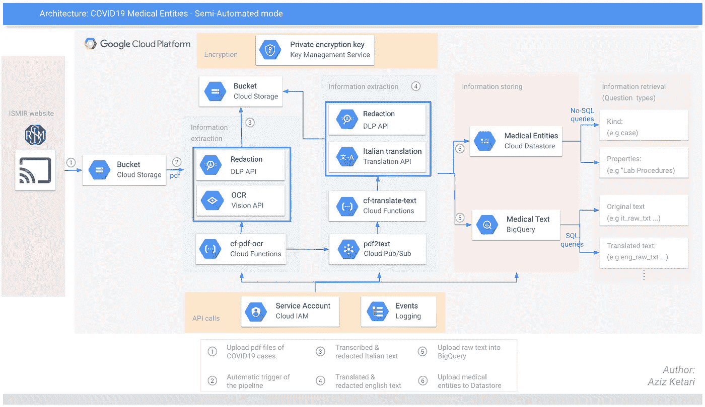
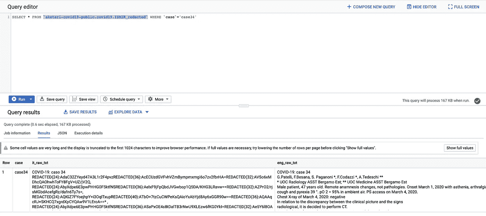

# 编辑医生病历中的敏感信息

> 原文：<https://towardsdatascience.com/redacting-sensitive-information-from-doctors-patient-notes-51773a9c494b?source=collection_archive---------41----------------------->

## 从意大利案例看新冠肺炎 GCP 公共数据集(下)

本文是关于发布由医生关于受 COVID19 影响的患者的医疗记录组成的公共数据集的系列文章的第二篇。您将了解到用于编辑医疗记录中敏感信息的 Google Cloud DLP API。如果你还没有看过，你可以在这里找到第一篇文章。

向[意大利医学放射和介入学会](https://www.sirm.org/category/senza-categoria/covid-19/)(图片[鸣谢](https://unsplash.com/photos/Q5BVSGt9Ljc))

为了重申我对社区的承诺，我将通过意大利医学和介入放射学协会(ISMIR)发布的最新病例来更新公共数据库。如果，作为一个副作用，你可以学到一些关于 GCP 的东西，那么这个系列将会超出我的预期💪 🙏。这个管道中使用的代码可以在我的 [Github repo](https://github.com/azizketari/covid19_ISMIR) 中获得。

顺便说一下，我非常自豪地看到社区正在考虑利用这些数据的方法。jérme mass ot[提出的一种方法是利用该数据集并执行:](https://www.linkedin.com/in/jeromemassot/)

> "用于知识图框架构建的抽取实体间的共现分析."

# 管道

谷歌云管道架构 v2

当涉及到编排管道时，Google Cloud 提供了几个选项，包括但不限于:

*   **云功能** **(已实现):**
    在本版本中，管道将由医生笔记 pdf 文档的上传触发。随后，Vision API 和 DLP API 将分别提取和编辑文本(意大利语)。然后结合 DLP API 的翻译 API 会被之前云函数发布的一条 pubsub 消息触发。最后，医疗实体的提取将从 GCE 上的虚拟机中进行(尚未实现自动化)。
*   [Cloud Composer](https://cloud.google.com/composer) :(下一版本)
    该服务符合利用完全托管服务的愿望，Composer 将帮助在环境上更灵活地编排和调度该管道。
*   [云运行](https://cloud.google.com/run) :
    该选项也符合通过使用托管服务和自动扩展无状态容器来降低拥有成本的目标。一旦我们确定了所有的基础设施和环境细节，我们将把流程容器化。只有这样，我们才能准备好使用云运行。

云函数触发函数

当涉及到去识别(即屏蔽、编辑、替换)敏感信息时，在 GCP 上你实际上有两个选择:

1.**医疗保健 API:**
该服务专注于 [DICOM 图像](https://cloud.google.com/healthcare/docs/how-tos/dicom-deidentify)和 [FHIR 资源](https://cloud.google.com/healthcare/docs/how-tos/fhir-deidentify)中受保护的健康信息(PHI)【目前😉).由于管道从 pdf 中提取原始文本，这个 API 在这种情况下并不真正适用。

2.**数据丢失防护(DLP) API(已实施):** 根据您的使用情形，您将通过屏蔽、替换或加密数据来取消数据标识。在医疗记录的情况下，我选择使用(CryptoDeterministicConfig 转换)加密数据，这样，如果出于其他目的需要，我可以重新标识该数据(前提是我保留了最初用于取消标识数据的密钥)。

假设数据由来自意大利的医疗记录组成，它可能包含人们的个人信息，使得以下信息类型相关:
["名字"、"姓氏"、"女性名"、"男性名"、"个人名"、"街道地址"、"意大利财政代码"]

去识别码片段

# 数据集:

修订的数据集现在出现在 ISMIR _ redacted 表下的 public[big query 数据集](https://console.cloud.google.com/bigquery?authuser=1&organizationId=819335046878&project=aketari-covid19-public&p=aketari-covid19-public&d=covid19&t=ISMIR_redacted&page=table)中。它对所有研究人员和贡献者公开。

查询公共数据集

查询公共数据集(修订的和原始的)的 Python 代码片段

*观察:*
1。我运行的一个实验是用相同的 INFO_TYPES 编辑意大利语和英语的相同文本，看看 DLP API 是否会编辑相同的字段。令我惊讶的是，这并不一定。挺惊讶的！不确定去识别在 DLP 背景中如何工作，但是从该实验中产生的一个假设是文本的语言可能导致候选人名字、姓氏…

2.根据第一项观察，当名称的来源不同于它们出现的文本语言时，DLP API 似乎显示出性能差异。以 67 号案例为例。当编辑来自亚洲的名字时(例如，陈、简谱和王、向和张…)，DLP API 无法在意大利语文本中识别它们，而在英语文本中却能成功识别。

3.如果您使用加密转换:CryptoReplaceFfxFpeConfig，您将需要确保您使用的“alphabet”(参数)包含您试图修订的字段的所有字符。使用“字母数字”将涵盖[0–9A-Za-z]范围内的字符。如果您试图修订的文本包含符号$，您将需要创建一个自定义字母表。

# 学习内容:

*   **DLP** 😡:我不确定当前的世界形势是在考验我的耐心，还是因为民主党不太合作，但我确实在与它斗争。我遇到的一个困难是在 CryptoReplaceFfxFpeConfig 中使用“kms_wrapped”功能。它总是抱怨一些无效的输入。最近的几个开放 stackoverflow 问题([开放线程 1](https://stackoverflow.com/questions/60471428/gcp-dlpdata-loss-prevention-getting-decryption-failed-the-ciphertext-is-inva) 和[开放线程 2](https://stackoverflow.com/questions/60719396/gcp-dlpdata-loss-prevention-getting-decryption-failed-the-ciphertext-is-inva) )和 [github 问题](https://github.com/GoogleCloudPlatform/python-docs-samples/issues/3245)让我对自己的奋斗感觉更好。我最终屈服了，转而选择使用“解包”,生成了一个 AES 密钥，并用 base64 编码。
    一个建议是确定您的用例需要哪种转换([有用链接](https://cloud.google.com/dlp/docs/reference/rest/v2/organizations.deidentifyTemplates#DeidentifyTemplate.PrimitiveTransformation))。
*   **云功能**😃:通过云功能实现自动化相当顺利。然而，为这条管道使用云函数是一个明显的考虑不周的错误。事实上，部分管道需要从 scispacy 下载和安装模型。然而，云功能只允许对每个实例化的环境进行有限的操作。因此，流水线是自动化的，直到必须使用 scispacy 模型提取实体并将其存储在数据存储中的步骤。
    一个建议是评估您的管道是否需要一些定制安装/环境。如果是这样的话，将其打包到一个容器中并使用 Cloud Run 可能是一个更好的选择。

就这样结束了！

我希望你喜欢这个系列的续集！如果你有什么改进的建议，请告诉我。此外，请分享您对 Google Cloud 面临的任何问题的反馈或意见。

我希望听到任何能够利用这个数据集和/或代码的人的意见。对你正在做的事情发表评论。